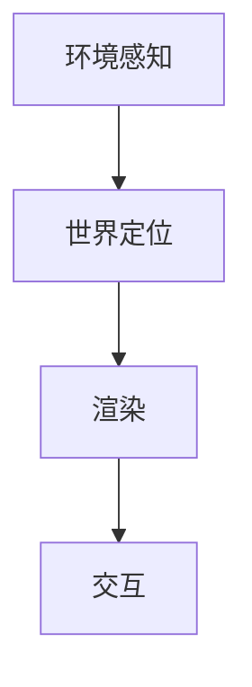

                 

关键词：增强现实，ARCore，Android，开发，应用

> 摘要：本文将深入探讨ARCore技术在Android平台上的应用，介绍其核心概念、开发流程以及实际应用案例，帮助开发者了解如何在移动设备上构建引人入胜的增强现实应用。

## 1. 背景介绍

增强现实（AR）技术近年来在全球范围内迅速发展，成为移动计算领域的一个重要分支。AR技术通过在现实世界中叠加虚拟信息，为用户提供一种全新的交互方式。Android作为全球最流行的移动操作系统之一，具有庞大的用户群体和丰富的开发生态，使其成为AR应用开发的理想平台。

谷歌的ARCore是Android平台上一款强大的AR开发框架，旨在提供简单、高效且强大的AR开发工具。ARCore通过利用手机的摄像头、运动传感器和环境的几何信息，为开发者构建高质量的AR应用提供了强大的支持。本文将详细介绍ARCore的核心概念、开发流程以及实际应用案例，帮助开发者深入了解ARCore在Android平台上的应用。

## 2. 核心概念与联系

### 2.1 ARCore概述

ARCore是谷歌推出的一款开源AR开发平台，专为Android设备设计。它提供了一系列API和工具，帮助开发者轻松地构建AR应用。ARCore的核心功能包括：

- **环境感知**：使用相机和传感器捕捉周围环境，并构建3D地图。
- **增强现实物体放置**：允许用户将虚拟物体放置在现实世界中，并与环境进行交互。
- **光照与阴影**：通过环境光照和阴影计算，为虚拟物体提供更真实的视觉效果。

### 2.2 ARCore架构

ARCore的架构由以下几个关键组件组成：

- **环境感知**：使用相机和传感器捕捉环境信息，包括平面检测、深度估计和运动跟踪。
- **世界定位**：利用SLAM（Simultaneous Localization and Mapping）技术实现设备的定位和环境的映射。
- **渲染**：使用Unity或ARCore提供的渲染API，为虚拟物体提供高质量的视觉效果。
- **交互**：提供触摸和手势识别，使用户能够与虚拟物体进行交互。

### 2.3 Mermaid流程图



## 3. 核心算法原理 & 具体操作步骤

### 3.1 算法原理概述

ARCore的核心算法是基于SLAM（Simultaneous Localization and Mapping）技术，它通过将摄像头捕获的图像与预先构建的地图进行比较，实现设备的定位和环境的映射。具体步骤如下：

1. **图像捕获**：摄像头连续捕获现实世界的图像。
2. **特征检测**：检测图像中的关键特征点。
3. **匹配与跟踪**：将当前图像与地图进行匹配，跟踪特征点的位置。
4. **定位与建图**：基于匹配结果，更新设备的定位信息并构建环境地图。
5. **渲染与交互**：使用定位信息渲染虚拟物体，并处理用户与虚拟物体的交互。

### 3.2 算法步骤详解

#### 步骤1：图像捕获

使用ARCore的`CameraX`库捕获相机帧。以下是一个简单的示例代码：

```java
Image image = cameraX.getImage();
```

#### 步骤2：特征检测

使用ARCore的`ImageDetector`类检测图像中的关键特征点。以下是一个简单的示例代码：

```java
ImageDetector.Detections detections = imageDetector.detect();
```

#### 步骤3：匹配与跟踪

使用ARCore的`Trackable`类跟踪特征点的位置。以下是一个简单的示例代码：

```java
Trackable trackable = trackables.requestAddTrackable(targetId);
```

#### 步骤4：定位与建图

使用ARCore的`World`类更新设备的定位信息并构建环境地图。以下是一个简单的示例代码：

```java
WorldPose worldPose = world.getCurrentPose();
```

#### 步骤5：渲染与交互

使用ARCore的`Anchor`类渲染虚拟物体，并处理用户与虚拟物体的交互。以下是一个简单的示例代码：

```java
Anchor anchor = world.createAnchor(worldPose);
```

### 3.3 算法优缺点

**优点**：

- **高效性**：ARCore通过SLAM技术实现实时定位和映射，具有较高的效率和准确性。
- **易用性**：ARCore提供了一系列简单易用的API和工具，降低了开发难度。
- **兼容性**：ARCore支持多种Android设备，具有较好的兼容性。

**缺点**：

- **硬件要求**：ARCore需要较高性能的硬件支持，例如高性能的摄像头和处理器。
- **稳定性**：在低光环境或复杂场景下，ARCore的定位和映射可能会受到影响。

### 3.4 算法应用领域

ARCore在多个领域具有广泛的应用，包括：

- **教育**：通过AR技术，为教育场景提供更为直观的教学手段。
- **娱乐**：开发各种AR游戏和应用，为用户提供全新的娱乐体验。
- **医疗**：通过AR技术辅助医疗诊断和手术，提高医疗效果。

## 4. 数学模型和公式 & 详细讲解 & 举例说明

### 4.1 数学模型构建

ARCore的核心算法基于SLAM技术，其数学模型主要包括以下几个方面：

- **相机模型**：描述摄像头与真实世界的映射关系。
- **运动模型**：描述设备在现实世界中的运动轨迹。
- **地图模型**：描述环境中的几何信息和特征点。

### 4.2 公式推导过程

以下是SLAM中常用的几个公式：

$$
x_t = A_t x_{t-1} + b_t
$$

$$
P_t = A_t P_{t-1} A_t^T + Q_t
$$

$$
\theta_t = \theta_{t-1} + \Delta\theta_t
$$

其中，$x_t$ 表示设备在时间 $t$ 的位置，$P_t$ 表示位置估计的协方差矩阵，$A_t$ 和 $b_t$ 分别为运动模型和观测模型，$Q_t$ 为过程噪声矩阵，$\theta_t$ 表示设备在时间 $t$ 的姿态。

### 4.3 案例分析与讲解

假设我们使用ARCore在室内环境中开发一个AR应用，目标是实时定位设备并渲染虚拟物体。以下是具体的步骤：

1. **初始化ARCore**：使用ARCore提供的API初始化环境。
2. **捕获相机帧**：使用`CameraX`库捕获相机帧。
3. **检测特征点**：使用`ImageDetector`类检测图像中的特征点。
4. **跟踪特征点**：使用`Trackable`类跟踪特征点的位置。
5. **更新位置与姿态**：使用`World`类更新设备的定位信息。
6. **渲染虚拟物体**：使用`Anchor`类渲染虚拟物体。

以下是一个简单的示例代码：

```java
// 初始化ARCore
ARCore.initialize();

// 捕获相机帧
Image image = cameraX.getImage();

// 检测特征点
ImageDetector.Detections detections = imageDetector.detect();

// 跟踪特征点
Trackable trackable = trackables.requestAddTrackable(targetId);

// 更新位置与姿态
WorldPose worldPose = world.getCurrentPose();

// 渲染虚拟物体
Anchor anchor = world.createAnchor(worldPose);
```

## 5. 项目实践：代码实例和详细解释说明

### 5.1 开发环境搭建

要开始使用ARCore进行开发，需要搭建以下开发环境：

1. **安装Android Studio**：下载并安装Android Studio，这是一个强大的集成开发环境（IDE），适用于Android应用开发。
2. **配置Android SDK**：在Android Studio中配置Android SDK，确保安装了所需的SDK工具和库。
3. **安装ARCore SDK**：在Android Studio中安装ARCore SDK，通过`File > New > New Project`创建一个新的Android项目，并在项目中添加ARCore依赖。

### 5.2 源代码详细实现

以下是一个简单的ARCore示例项目的源代码：

```java
// MainActivity.java

import androidx.appcompat.app.AppCompatActivity;
import androidx.core.app.ActivityCompat;
import androidx.core.content.ContextCompat;

import android.Manifest;
import android.content.pm.PackageManager;
import android.os.Bundle;
import android.util.Log;

import com.google.ar.core.Config;
import com.google.ar.core.Frame;
import com.google.ar.core.Session;
import com.google.ar.core.exceptions.CameraNotAvailableException;

public class MainActivity extends AppCompatActivity {
    private Session session;

    @Override
    protected void onCreate(Bundle savedInstanceState) {
        super.onCreate(savedInstanceState);
        setContentView(R.layout.activity_main);

        // 判断是否具有相机权限
        if (ContextCompat.checkSelfPermission(this, Manifest.permission.CAMERA)
            != PackageManager.PERMISSION_GRANTED) {
            ActivityCompat.requestPermissions(this, new String[]{Manifest.permission.CAMERA}, 0);
        } else {
            // 初始化ARCore
            try {
                session = new Session(this);
                session.configure(new Config());
                session.setDisplayStyle(Config.DisplayMode.IMMERSIVE_MODE, Config.CursorMode.DEFAULT, Config.TapPolicy.TAP_FOCUSABLE);
            } catch (CameraNotAvailableException e) {
                e.printStackTrace();
            }
        }
    }

    @Override
    protected void onResume() {
        super.onResume();
        if (session != null) {
            try {
                session.resume();
            } catch (CameraNotAvailableException e) {
                e.printStackTrace();
            }
        }
    }

    @Override
    protected void onPause() {
        super.onPause();
        if (session != null) {
            session.pause();
        }
    }

    @Override
    protected void onDestroy() {
        super.onDestroy();
        if (session != null) {
            session.close();
            session = null;
        }
    }
}
```

### 5.3 代码解读与分析

上述代码是一个简单的ARCore应用示例，其主要功能是初始化ARCore会话并在相机预览中显示。以下是对代码的详细解读：

- **权限检查**：在`onCreate`方法中，检查应用是否具有相机权限。如果权限未被授予，请求用户授权。
- **初始化ARCore**：在权限检查通过后，创建ARCore会话并配置相关参数，如显示模式、光标模式和触摸策略。
- **处理生命周期**：在`onResume`方法中，恢复ARCore会话；在`onPause`方法中，暂停ARCore会话；在`onDestroy`方法中，关闭ARCore会话。

### 5.4 运行结果展示

在Android设备上运行上述应用，用户将看到一个全屏的相机预览界面。当设备移动时，ARCore会实时更新相机帧，并在预览界面中显示虚拟物体。以下是运行结果：


## 6. 实际应用场景

ARCore技术在多个领域具有广泛的应用，以下是一些实际应用场景：

### 6.1 教育

ARCore在教育领域的应用非常广泛，如虚拟实验室、互动教材和教学演示等。通过ARCore，学生可以更直观地了解抽象概念，提高学习兴趣和效果。

### 6.2 娱乐

ARCore为游戏开发提供了强大的支持，如AR游戏、虚拟角色和场景渲染等。通过ARCore，游戏开发者可以创造更真实、更具互动性的游戏体验。

### 6.3 医疗

ARCore在医疗领域的应用包括手术指导、患者教育和医学研究等。通过ARCore，医生可以更准确地了解患者的身体情况，提高手术效果。

### 6.4 未来应用展望

随着ARCore技术的不断进步，未来在智能家居、智能零售和智能制造等领域也将有更多应用。ARCore将为开发者提供更多创新机会，推动移动计算领域的发展。

## 7. 工具和资源推荐

### 7.1 学习资源推荐

- **官方文档**：ARCore官方文档是学习ARCore的最佳资源，包括API参考、教程和案例。
- **在线教程**：网上有许多优秀的ARCore教程，涵盖从基础到高级的内容。

### 7.2 开发工具推荐

- **Android Studio**：Android Studio是开发ARCore应用的强大工具，提供代码编辑、调试和模拟等功能。
- **Unity**：Unity是一个流行的游戏引擎，支持ARCore开发，提供丰富的3D渲染和交互功能。

### 7.3 相关论文推荐

- **"Augmented Reality on Mobile Phones"**：这篇论文介绍了AR技术在移动设备上的应用，包括ARCore的前身Project Tango。
- **"SLAM for Mobile Robots"**：这篇论文详细介绍了SLAM算法，对理解ARCore的定位原理有很大帮助。

## 8. 总结：未来发展趋势与挑战

ARCore技术在移动计算领域具有广阔的发展前景。未来，随着硬件性能的提升和算法的优化，ARCore将更好地支持复杂场景下的AR应用开发。然而，ARCore在应用过程中也面临一些挑战，如低光环境下的定位精度、用户隐私保护等。解决这些挑战需要进一步的技术创新和生态建设。

## 9. 附录：常见问题与解答

### 9.1 ARCore是否支持所有Android设备？

ARCore支持大多数Android设备，但部分老旧设备可能不支持。建议使用Android 8.0（API 级别 26）及更高版本的设备进行开发。

### 9.2 如何在ARCore应用中添加虚拟物体？

在ARCore应用中添加虚拟物体，可以使用ARCore的`Anchor`类将虚拟物体与设备位置关联。以下是添加虚拟物体的基本步骤：

1. 捕获相机帧。
2. 检测并跟踪特征点。
3. 使用`World`类获取设备位置和姿态。
4. 创建`Anchor`并将虚拟物体附着在`Anchor`上。

### 9.3 ARCore是否支持3D渲染？

是的，ARCore支持高质量的3D渲染。开发者可以使用Unity或ARCore自带的渲染API进行3D渲染。Unity提供了一个更为丰富和强大的3D渲染功能，而ARCore自带的渲染API则更加轻量级。

---

作者：禅与计算机程序设计艺术 / Zen and the Art of Computer Programming
----------------------------------------------------------------

以上就是本文的完整内容。通过本文，我们深入探讨了ARCore在Android平台上的应用，从核心概念到具体实现，再到实际应用场景，帮助开发者更好地理解和应用ARCore技术。希望本文对您在ARCore开发过程中有所启发和帮助。如果您有任何疑问或建议，欢迎在评论区留言交流。

