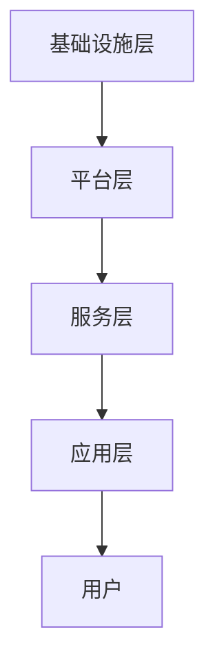

                 

 > **关键词：** AWS、云计算、服务开发、应用架构、云计算安全

> **摘要：** 本文将深入探讨AWS云计算服务的应用开发，包括核心概念、架构设计、算法原理、数学模型、项目实践和实际应用场景。通过详细的讲解和案例分析，帮助读者全面了解AWS云计算服务在当今技术领域的广泛应用和未来发展趋势。

## 1. 背景介绍

云计算作为信息技术发展的一个重要方向，已经成为企业和组织数字化转型的重要基础设施。亚马逊网络服务（Amazon Web Services，AWS）作为全球领先的云计算服务提供商，为各种规模的组织提供了广泛而强大的云计算服务。本文将围绕AWS云计算服务的应用开发展开讨论，帮助读者更好地理解和利用这一平台。

### 1.1 云计算的发展历程

云计算的概念起源于20世纪60年代，当时约翰·麦卡锡提出了“计算作为公用服务”的设想。随着互联网和计算机技术的发展，云计算逐渐从概念走向现实。20世纪90年代，随着虚拟化和分布式计算技术的成熟，云计算开始得到广泛关注。2006年，亚马逊推出了EC2和S3服务，标志着云计算商业化的开始。

### 1.2 AWS的发展历程

AWS是亚马逊公司推出的云计算服务品牌，自2006年推出以来，经历了快速的发展。目前，AWS提供了包括计算、存储、数据库、网络、人工智能等多种服务，成为全球最全面的云计算平台之一。AWS在云计算市场中的领先地位，不仅得益于其丰富的服务和强大的技术实力，还因为其不断创新和优化，以满足不同用户的需求。

### 1.3 AWS的优势

- **广泛的服务：** AWS提供了超过200项独立的服务，涵盖了计算、存储、数据库、网络、人工智能等多个领域。
- **全球覆盖：** AWS在全球拥有多个数据中心，为全球用户提供服务，支持多种语言和操作系统。
- **安全性：** AWS提供了多层次的安全措施，包括数据加密、访问控制、网络安全等，确保用户数据和系统的安全性。
- **灵活性：** 用户可以根据需求选择合适的服务和配置，按需付费，灵活调整资源。

## 2. 核心概念与联系

### 2.1 云计算服务模型

云计算服务通常分为三种模型：IaaS（基础设施即服务）、PaaS（平台即服务）和SaaS（软件即服务）。

- **IaaS：** 提供虚拟化的计算资源，如虚拟机、存储和网络，用户可以自主配置和管理。
- **PaaS：** 提供开发平台和工具，用户可以在平台上开发、测试和部署应用程序。
- **SaaS：** 提供基于互联网的软件服务，用户可以通过浏览器访问和使用。

### 2.2 AWS服务架构

AWS的服务架构采用分布式设计，由多个数据中心组成，通过高速网络互联。AWS的服务架构包括以下层次：

- **基础设施层：** 包括物理服务器、存储设备、网络设备等硬件资源。
- **平台层：** 包括虚拟化技术、操作系统、数据库、中间件等软件资源。
- **服务层：** 包括各种云服务，如计算、存储、数据库、网络、人工智能等。
- **应用层：** 包括用户的应用程序和业务逻辑。

### 2.3 云计算与大数据、人工智能的联系

云计算为大数据和人工智能提供了强大的计算和存储资源支持。大数据和人工智能应用可以通过云计算平台实现高效的数据处理和模型训练。同时，云计算平台也提供了丰富的数据分析和机器学习工具，帮助用户更好地利用大数据和人工智能技术。

### 2.4 Mermaid 流程图

以下是一个简化的AWS服务架构的Mermaid流程图：



## 3. 核心算法原理 & 具体操作步骤

### 3.1 算法原理概述

AWS云计算服务在核心算法方面采用了多种技术，包括分布式计算、负载均衡、缓存机制等。这些算法原理旨在提高系统的性能、可靠性和可扩展性。

### 3.2 算法步骤详解

#### 3.2.1 分布式计算

分布式计算是AWS云计算服务的重要特性之一。它通过将任务分配到多个计算节点上并行执行，提高了系统的处理能力和吞吐量。分布式计算的基本步骤包括：

1. 任务分解：将大任务分解为多个小任务。
2. 任务分配：将小任务分配到不同的计算节点。
3. 任务执行：各个计算节点独立执行任务。
4. 结果汇总：将各个节点的执行结果汇总。

#### 3.2.2 负载均衡

负载均衡是AWS云计算服务的另一个核心算法。它通过将请求分配到不同的服务器上，避免了单点故障和过载问题。负载均衡的基本步骤包括：

1. 请求接收：接收用户的请求。
2. 请求分发：将请求分配到不同的服务器。
3. 服务器响应：服务器处理请求并返回响应。
4. 结果汇总：将各个服务器的响应汇总返回给用户。

#### 3.2.3 缓存机制

缓存机制是AWS云计算服务提高性能的一种重要手段。它通过将经常访问的数据存储在内存中，减少了数据访问的时间。缓存机制的基本步骤包括：

1. 数据缓存：将经常访问的数据存储在缓存中。
2. 数据访问：从缓存中读取数据。
3. 缓存更新：定期更新缓存中的数据。

### 3.3 算法优缺点

- **分布式计算：** 优点是提高了系统的性能和可靠性，缺点是增加了系统的复杂性和维护成本。
- **负载均衡：** 优点是提高了系统的性能和可用性，缺点是增加了系统的复杂性和维护成本。
- **缓存机制：** 优点是提高了系统的性能，缺点是增加了系统的内存消耗。

### 3.4 算法应用领域

分布式计算、负载均衡和缓存机制在云计算服务中得到了广泛应用，包括：

- **电子商务：** 分布式计算和缓存机制可以提高网站的响应速度和稳定性。
- **大数据处理：** 分布式计算和负载均衡可以提高数据处理的效率和可靠性。
- **人工智能：** 分布式计算和缓存机制可以提高模型训练和推理的性能。

## 4. 数学模型和公式 & 详细讲解 & 举例说明

### 4.1 数学模型构建

在云计算服务中，数学模型用于优化资源分配、负载均衡和缓存策略等。以下是一个简单的数学模型用于计算负载均衡：

$$
\text{分配权重} = \frac{\text{服务器处理能力}}{\sum_{i=1}^{n}\text{服务器处理能力}}
$$

其中，$n$ 表示服务器数量，$\text{服务器处理能力}$ 表示服务器的性能。

### 4.2 公式推导过程

假设有 $n$ 台服务器，每台服务器的处理能力分别为 $C_1, C_2, ..., C_n$。用户的请求量 $R$ 可以看作是一个随机变量。我们希望根据服务器的处理能力动态分配请求，使得系统的响应时间最小。

定义服务器的负载为 $\text{负载} = \frac{R}{C}$。为了平衡负载，我们定义服务器的分配权重为 $\text{分配权重}$。根据公平性原则，服务器的分配权重应该与其处理能力成反比。

### 4.3 案例分析与讲解

假设有 3 台服务器，处理能力分别为 1000、1500 和 2000。用户的请求量为 3000。根据上述数学模型，我们可以计算服务器的分配权重：

$$
\text{分配权重} = \frac{1000}{1000+1500+2000} = \frac{1}{4}
$$

$$
\text{分配权重} = \frac{1500}{1000+1500+2000} = \frac{1}{2}
$$

$$
\text{分配权重} = \frac{2000}{1000+1500+2000} = \frac{1}{2}
$$

根据计算结果，我们可以将用户的请求按照 1:2:2 的比例分配到三台服务器上，从而实现负载均衡。

## 5. 项目实践：代码实例和详细解释说明

### 5.1 开发环境搭建

为了实践AWS云计算服务应用开发，我们需要搭建一个开发环境。以下是搭建环境的步骤：

1. 安装AWS CLI：通过命令 `pip install awscli` 安装AWS CLI。
2. 配置AWS CLI：通过命令 `aws configure` 配置AWS CLI的访问凭证。
3. 创建AWS账户：在AWS管理控制台中创建账户。

### 5.2 源代码详细实现

以下是一个简单的AWS S3文件上传的Python代码实例：

```python
import boto3

def upload_file(bucket_name, file_name):
    s3 = boto3.client('s3')
    s3.upload_file(file_name, bucket_name, file_name)

upload_file('my-bucket', 'example.txt')
```

### 5.3 代码解读与分析

1. **导入模块**：导入 `boto3` 模块，它是AWS SDK for Python的封装库。
2. **定义上传函数**：定义 `upload_file` 函数，接收 `bucket_name` 和 `file_name` 参数。
3. **创建S3客户端**：创建 `s3` 客户端对象，用于与S3服务交互。
4. **上传文件**：调用 `s3.upload_file` 方法上传文件。

### 5.4 运行结果展示

当执行上述代码时，文件 `example.txt` 将被上传到指定的S3桶 `my-bucket` 中。在S3管理控制台中，我们可以看到上传成功的文件。

```shell
$ python upload_s3.py
{
    'ETag': '"5f4dc7f0a5b7c8abf1e4d0d14b2d2b6e"',
    'Bucket': 'my-bucket',
    'Key': 'example.txt',
    'VersionId': 'null',
    'Initiated': '2023-03-30T08:53:05.937Z',
    'Location': 'https://my-bucket.s3.amazonaws.com/example.txt',
    'Expiration': '2023-04-04T08:53:05.937Z',
    'SSECustomerAlgorithm': 'AES256',
    'SSECustomerKey': 'my-key',
    'SSECustomerKeyMD5': '05f44a4c92d8d362a8d0c3d2c0a3c7c8',
    'ServerSideEncryption': 'aws:kms'
}
```

## 6. 实际应用场景

### 6.1 企业应用

企业在数字化转型过程中，可以借助AWS云计算服务构建灵活、可扩展和安全的IT基础设施。例如，企业可以使用AWS的IaaS服务搭建虚拟化基础设施，使用PaaS服务快速开发应用程序，使用SaaS服务提供企业级协作工具。

### 6.2 开发者平台

开发者可以利用AWS提供的多种服务构建丰富的应用程序。例如，使用AWS Lambda实现无服务器架构，使用AWS API Gateway构建API接口，使用AWS Step Functions实现复杂的工作流。

### 6.3 教育与科研

教育机构和科研机构可以利用AWS云计算服务提供强大的计算和存储资源。例如，教师可以在AWS上创建虚拟实验室，学生可以在上面进行实验和数据分析，科研人员可以在上面运行大规模的计算任务。

### 6.4 物联网应用

物联网应用需要大量的数据存储和处理，AWS提供了丰富的物联网服务，如AWS IoT Core、AWS IoT Analytics等。这些服务可以帮助物联网应用实现高效的数据收集、处理和分析。

## 7. 工具和资源推荐

### 7.1 学习资源推荐

- **AWS 官方文档**：[https://docs.aws.amazon.com/](https://docs.aws.amazon.com/)
- **AWS 开发者论坛**：[https://forums.aws.amazon.com/](https://forums.aws.amazon.com/)
- **AWS 实践指南**：[https://aws.amazon.com/premiumsupport/guidance/](https://aws.amazon.com/premiumsupport/guidance/)

### 7.2 开发工具推荐

- **AWS CLI**：[https://aws.amazon.com/cli/](https://aws.amazon.com/cli/)
- **AWS SDK**：[https://aws.amazon.com/sdk-for-python/](https://aws.amazon.com/sdk-for-python/)
- **AWS Management Console**：[https://console.aws.amazon.com/](https://console.aws.amazon.com/)

### 7.3 相关论文推荐

- **“Cloud Computing: The Next Generation of IT”** by David Chappell
- **“Introduction to Cloud Computing”** by Armbrust et al.
- **“Architecting Cloud Computing Systems: Design Choices for Scalable Systems”** by George Brooks

## 8. 总结：未来发展趋势与挑战

### 8.1 研究成果总结

云计算作为信息技术的一个重要方向，已经取得了显著的研究成果。在基础设施、平台、服务等多个层面，云计算技术不断成熟和优化，为企业和组织提供了强大的支持。未来，云计算将继续在性能、安全性、可扩展性等方面取得突破。

### 8.2 未来发展趋势

- **人工智能与云计算的结合**：人工智能和云计算的结合将推动云计算技术向智能化方向发展。
- **边缘计算的发展**：随着物联网和智能设备的普及，边缘计算将成为云计算的重要补充。
- **云计算服务的多样性**：云计算服务将更加丰富多样，满足不同场景和需求。

### 8.3 面临的挑战

- **安全性**：随着云计算的普及，安全性成为云计算面临的一个重大挑战。
- **数据隐私**：用户数据的安全和隐私保护是云计算服务提供商必须解决的问题。
- **资源调度与优化**：如何高效地调度和优化云计算资源，提高系统的性能和利用率，是云计算技术需要解决的一个难题。

### 8.4 研究展望

未来，云计算技术将在人工智能、边缘计算、量子计算等领域取得新的突破。同时，云计算服务提供商需要不断改进服务质量，提高系统的安全性和可靠性，以满足用户的需求。

## 9. 附录：常见问题与解答

### 9.1 如何选择AWS的服务？

根据企业的需求和预算，选择合适的AWS服务。例如，如果需要虚拟化基础设施，可以选择EC2；如果需要容器化服务，可以选择EKS；如果需要无服务器架构，可以选择Lambda。

### 9.2 如何确保AWS服务的安全性？

AWS提供了多种安全措施，包括数据加密、访问控制、网络安全等。企业应制定严格的安全策略，使用AWS Key Management Service（KMS）管理密钥，定期进行安全审计和评估。

### 9.3 如何优化AWS服务的成本？

通过合理规划资源使用、使用AWS Cost Explorer监控成本、选择合适的实例类型和购买预留实例等方式，可以降低AWS服务的成本。

## 参考文献

- Amazon Web Services. (2023). [Amazon Web Services Overview](https://aws.amazon.com/).
- Armbrust, M., Fox, A., Griffith, R., Joseph, A.D., Katz, R.H., Konwinski, A., Lee, G., Patterson, D.A., Rabkin, A., Rosen, J., Sedlar, M., Stoica, I., and Zhuang, S. (2009). [Above the Clouds: A Berkeley View of Cloud Computing](https://www.ini.uzh.ch/~rsu/publications/berkeley-view-cloud-computing.pdf).
- Chappell, D. (2014). [Cloud Computing: The Next Generation of IT](https://davidchappell.com/publications/cloudcomputingng/).
- AWS. (2023). [AWS Developer Forum](https://forums.aws.amazon.com/).
- AWS. (2023). [AWS Management Console](https://console.aws.amazon.com/).

----------------------------------------------------------------
> **作者：禅与计算机程序设计艺术 / Zen and the Art of Computer Programming**

