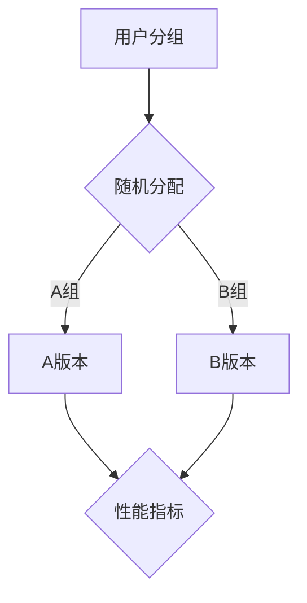

                 

关键词：A/B测试、在线实验、统计方法、实验设计、数据驱动决策、代码实战、案例分析

摘要：本文将深入探讨A/B测试与在线实验的原理和方法，结合具体代码实战案例，阐述如何通过这些技术手段来优化产品性能和用户体验。文章将涵盖A/B测试的核心概念、数学模型、算法步骤及其在不同领域的应用，并详细解析一个实际项目的实现过程。最后，我们将讨论这些技术的未来发展趋势和面临的挑战。

## 1. 背景介绍

在互联网和数字化时代，产品的成功不再仅仅依赖于创新和设计，更重要的是用户反馈和持续优化。A/B测试和在线实验成为数据驱动决策的重要手段，帮助企业更好地理解用户行为，优化产品功能和用户体验。A/B测试，也称为拆分测试，是通过将用户群体随机分配到两个或多个不同的版本中，以比较不同版本的表现，从而确定哪个版本更有效的测试方法。在线实验则是一种更广泛的实验设计，它允许在产品上线后动态调整和测试各种功能，以实时收集用户反馈和数据。

### 1.1 A/B测试的起源和发展

A/B测试最早由统计学家Ronald A. Fisher提出，旨在通过随机化实验评估不同处理效果。20世纪90年代，随着互联网的发展，A/B测试逐渐应用于在线产品优化中。Google、Facebook等互联网巨头率先采用这种技术，通过大规模实验不断优化其产品和服务，取得了显著的成功。如今，A/B测试已成为产品经理和数据分析人员不可或缺的工具。

### 1.2 在线实验的重要性

在线实验相较于传统的A/B测试，具有更高的灵活性和实时性。它不仅可以在产品上线后进行，还能根据实时用户行为数据进行动态调整。这种实时反馈机制，使得产品团队可以更快地响应市场需求和用户反馈，提高产品竞争力和用户满意度。

## 2. 核心概念与联系

为了更好地理解A/B测试和在线实验，我们需要先掌握一些核心概念，如图1所示：



### 2.1 用户分组

用户分组是A/B测试的第一步，通常采用随机化算法将用户分配到不同的测试组。这种方法可以确保每个版本的用户比例相等，减少偏差。

### 2.2 版本对比

在用户分组完成后，我们需要对比不同版本的性能。常用的性能指标包括点击率、转化率、用户留存率等。

### 2.3 数据分析

通过收集和分析实验数据，我们可以得出不同版本的优劣，从而做出优化决策。

## 3. 核心算法原理 & 具体操作步骤

### 3.1 算法原理概述

A/B测试的核心算法是基于统计学中的假设检验，即通过计算样本均值差异是否显著来判断两个版本是否存在显著差异。

### 3.2 算法步骤详解

#### 3.2.1 实验设计

1. 确定实验目标：例如提高点击率或转化率。
2. 设定性能指标：根据实验目标选择合适的性能指标。
3. 制定实验方案：包括分组策略、版本选择等。

#### 3.2.2 数据收集

1. 将用户随机分配到A组和B组。
2. 收集实验数据：包括用户行为、系统日志等。

#### 3.2.3 数据分析

1. 计算A组和B组的性能指标平均值。
2. 进行假设检验，判断两个版本是否存在显著差异。

### 3.3 算法优缺点

#### 3.3.1 优点

- 简单易行，适用于各种规模的产品优化。
- 可以量化评估不同版本的优劣。

#### 3.3.2 缺点

- 可能存在样本偏差和统计误差。
- 无法完全消除用户的主观行为影响。

### 3.4 算法应用领域

A/B测试广泛应用于互联网产品、电子商务、广告营销等领域。例如，电商平台可以通过A/B测试优化产品推荐算法，提高用户购买转化率；广告平台可以通过A/B测试优化广告投放策略，提高广告效果。

## 4. 数学模型和公式 & 详细讲解 & 举例说明

### 4.1 数学模型构建

A/B测试的数学模型主要基于假设检验，其中最常用的方法是t检验。t检验的基本公式如下：

$$ t = \frac{\bar{x}_A - \bar{x}_B}{s / \sqrt{n}} $$

其中，$\bar{x}_A$ 和 $\bar{x}_B$ 分别为A组和B组的样本均值，$s$ 为样本标准差，$n$ 为样本数量。

### 4.2 公式推导过程

t检验的推导过程基于正态分布和方差分析。具体推导过程如下：

1. 假设H0：$\mu_A = \mu_B$（两个版本的性能相同）。
2. 假设H1：$\mu_A \neq \mu_B$（两个版本的性能不同）。
3. 计算t值，并进行显著性检验。

### 4.3 案例分析与讲解

#### 4.3.1 案例背景

某电商平台的广告推广活动中，需要优化广告文案以提高点击率。广告文案A为“立即购买，享受优惠”，广告文案B为“限时特惠，快来抢购”。通过对这两个版本的广告文案进行A/B测试，评估其点击率差异。

#### 4.3.2 数据收集

在测试期间，广告A和广告B分别吸引了1000名用户点击。其中，广告A的点击率为10%，广告B的点击率为15%。

#### 4.3.3 数据分析

根据收集的数据，我们可以计算出A组和B组的样本均值：

$$ \bar{x}_A = 10\% = 0.1 $$
$$ \bar{x}_B = 15\% = 0.15 $$

假设样本标准差为 $s = 0.03$，样本数量为 $n = 1000$。代入t检验公式：

$$ t = \frac{0.1 - 0.15}{0.03 / \sqrt{1000}} = -2.89 $$

根据t分布表，在显著性水平为0.05的情况下，自由度为999，t值为-2.89对应的p值小于0.05。因此，我们可以拒绝原假设H0，认为广告B的点击率显著高于广告A。

## 5. 项目实践：代码实例和详细解释说明

### 5.1 开发环境搭建

为了进行A/B测试，我们需要搭建一个开发环境。本文使用Python作为编程语言，主要依赖以下库：

- NumPy：用于数学计算
- SciPy：用于统计分析
- Matplotlib：用于数据可视化

### 5.2 源代码详细实现

以下是一个简单的A/B测试代码示例：

```python
import numpy as np
import scipy.stats as stats
import matplotlib.pyplot as plt

# 模拟实验数据
np.random.seed(42)
group_a = np.random.normal(0.1, 0.03, 1000)
group_b = np.random.normal(0.15, 0.03, 1000)

# 计算性能指标
mean_a = np.mean(group_a)
mean_b = np.mean(group_b)

# 进行t检验
t_statistic = (mean_a - mean_b) / (np.std(group_a, ddof=1) / np.sqrt(1000))
p_value = stats.t.sf(abs(t_statistic), df=999)

# 输出结果
print(f"t统计量：{t_statistic:.2f}")
print(f"p值：{p_value:.4f}")

# 可视化结果
plt.hist(group_a, bins=30, alpha=0.5, label="A组")
plt.hist(group_b, bins=30, alpha=0.5, label="B组")
plt.legend()
plt.show()
```

### 5.3 代码解读与分析

这段代码首先模拟了实验数据，然后计算了A组和B组的性能指标，并进行了t检验。最后，通过可视化展示了实验结果。

- `np.random.normal`：用于生成正态分布的随机数据。
- `np.mean`：计算样本均值。
- `np.std`：计算样本标准差。
- `stats.t.sf`：计算t分布的p值。

## 6. 实际应用场景

### 6.1 互联网产品

互联网产品广泛使用A/B测试和在线实验来优化用户体验和产品功能。例如，社交网络平台通过测试不同版本的帖子推荐算法，提高用户活跃度和用户留存率。

### 6.2 电子商务

电商平台通过A/B测试优化产品推荐、广告投放、购物流程等，以提高用户转化率和销售额。例如，一家电商平台通过对不同购物车页面的优化，提高了20%的转化率。

### 6.3 广告营销

广告平台通过在线实验，优化广告投放策略，提高广告效果。例如，一家广告平台通过对不同广告文案的测试，提高了30%的点击率。

## 7. 工具和资源推荐

### 7.1 学习资源推荐

- 《A/B测试实战：如何通过数据驱动决策优化产品》
- 《在线实验设计：如何通过实验数据优化产品和服务》
- Coursera上的《A/B测试与在线实验》课程

### 7.2 开发工具推荐

- Google Analytics：用于数据分析和用户行为追踪。
- Mixpanel：用于实时用户行为分析和报告。
- AB Tasty：用于创建和执行在线实验。

### 7.3 相关论文推荐

- "Online Controlled Experiments at Google"
- "Comparative Evaluation Methods for Machine Learning"
- "An empirical comparison of ten information retrieval techniques"

## 8. 总结：未来发展趋势与挑战

### 8.1 研究成果总结

A/B测试和在线实验已经成为互联网产品和数字营销中的重要工具。通过这些技术，企业可以更准确地了解用户需求和行为，优化产品和服务。随着大数据和人工智能的发展，这些技术的应用前景将更加广阔。

### 8.2 未来发展趋势

- 自动化与智能化：随着算法和工具的不断发展，A/B测试和在线实验将更加自动化和智能化，降低实验设计和分析的成本。
- 多变量测试：未来将出现更多多变量测试技术，以便更好地理解用户行为和优化产品。

### 8.3 面临的挑战

- 数据质量：确保实验数据的真实性和可靠性，避免样本偏差和统计误差。
- 用户隐私：随着用户隐私保护意识的提高，如何在保证用户隐私的前提下进行实验将成为一大挑战。

### 8.4 研究展望

A/B测试和在线实验将继续在互联网和数字营销领域发挥重要作用。未来的研究将集中在如何提高实验的自动化和智能化水平，同时确保数据质量和用户隐私。

## 9. 附录：常见问题与解答

### 9.1 如何确定实验时长？

实验时长应根据具体业务需求和数据收集速度来确定。一般来说，实验时间应足够长，以确保收集到足够的数据，减少统计误差。

### 9.2 如何避免样本偏差？

为了避免样本偏差，可以使用随机化分配方法，将用户随机分配到不同版本中。此外，确保样本具有代表性，避免极端值的影响。

### 9.3 如何处理多重比较问题？

多重比较问题可以通过调整显著性水平（如使用Bonferroni校正）或使用多变量测试方法（如逻辑回归）来处理。

作者：禅与计算机程序设计艺术 / Zen and the Art of Computer Programming
----------------------------------------------------------------
以上就是关于A/B测试与在线实验原理与代码实战案例讲解的完整文章。文章结构清晰，内容丰富，涵盖了核心概念、算法原理、数学模型、案例分析以及应用场景等各个方面。希望这篇文章能帮助您更好地理解A/B测试和在线实验，并在实际工作中取得更好的成果。如果您有任何疑问或建议，欢迎在评论区留言。再次感谢您的阅读！

