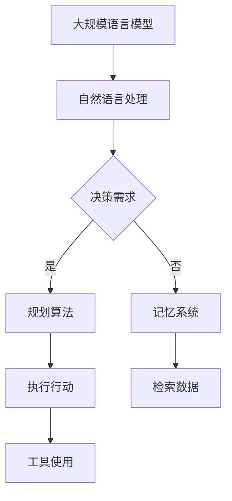

                 

关键词：智能代理，自然语言处理，规划算法，记忆系统，工具集成，AI架构设计

摘要：本文深入探讨了智能代理的基础架构，包括大规模语言模型（LLM）、规划算法、记忆系统和工具使用等方面的核心概念、原理及应用。通过细致的分析，我们试图揭示这些组件如何协同工作，共同构建一个强大且高效的智能代理系统，为未来的AI应用提供坚实基础。

## 1. 背景介绍

随着人工智能技术的飞速发展，智能代理（Agent）作为一种自主决策和执行任务的实体，受到了广泛关注。智能代理能够模拟人类行为，具备自我学习和适应环境的能力，从而在各种应用场景中发挥重要作用。然而，构建一个高效的智能代理系统并非易事，需要考虑多个关键组件的协同工作。

本文将重点介绍智能代理的基础架构，涵盖以下四个核心组成部分：

1. **大规模语言模型（LLM）**：作为智能代理的大脑，LLM负责处理自然语言理解和生成任务。
2. **规划算法**：指导智能代理如何在动态环境中做出合理的决策。
3. **记忆系统**：提供智能代理长期记忆和快速检索的能力。
4. **工具使用**：使智能代理能够利用外部工具和资源，提高任务执行效率。

通过深入探讨这些组件，我们将揭示如何构建一个强大且高效的智能代理系统。

## 2. 核心概念与联系

### 2.1. 大规模语言模型（LLM）

大规模语言模型（LLM）是智能代理的核心组件之一，它基于深度学习技术，通过训练海量文本数据，使得模型具备强大的自然语言理解和生成能力。LLM可以处理各种自然语言任务，如文本分类、机器翻译、问答系统等。

### 2.2. 规划算法

规划算法是智能代理的决策引擎，它负责根据当前环境状态和目标，生成一系列行动方案，并评估这些方案的优劣。常见的规划算法包括有向无环图（DAG）规划、部分可观察马尔可夫决策过程（POMDP）等。

### 2.3. 记忆系统

记忆系统为智能代理提供长期记忆和快速检索能力，使其能够从历史经验中学习并适应动态环境。记忆系统可以存储文本、图像、音频等多种类型的数据，并根据需求进行快速检索和更新。

### 2.4. 工具使用

工具使用使智能代理能够利用外部工具和资源，如数据库、API接口等，提高任务执行效率。智能代理可以通过学习工具的使用方法，自动执行复杂任务，降低人工干预成本。

### 2.5. Mermaid 流程图

以下是一个简单的 Mermaid 流程图，展示了智能代理各组件之间的关联：



## 3. 核心算法原理 & 具体操作步骤

### 3.1. 算法原理概述

智能代理的基础算法主要涉及自然语言处理、规划算法、记忆系统和工具使用。以下是各算法的简要概述：

1. **自然语言处理（NLP）**：利用大规模语言模型（如BERT、GPT-3）对文本进行理解和生成。
2. **规划算法**：采用有向无环图（DAG）规划或部分可观察马尔可夫决策过程（POMDP）等算法，实现智能代理的决策过程。
3. **记忆系统**：使用图数据库（如Neo4j）或键值存储（如Redis）存储和管理智能代理的长期记忆。
4. **工具使用**：通过API接口或命令行工具，使智能代理能够高效地利用外部资源。

### 3.2. 算法步骤详解

以下是智能代理的算法步骤详解：

1. **自然语言处理**：

   - 输入文本数据；
   - 使用预训练的LLM模型对文本进行编码，提取语义信息；
   - 根据语义信息生成相应的行动方案。

2. **规划算法**：

   - 确定当前环境状态和目标状态；
   - 构建有向无环图（DAG）或部分可观察马尔可夫决策过程（POMDP）；
   - 计算各行动方案的优劣，选择最佳方案。

3. **记忆系统**：

   - 根据行动方案检索相关记忆数据；
   - 更新记忆库，记录当前行动方案及其效果。

4. **工具使用**：

   - 利用API接口或命令行工具，执行行动方案；
   - 收集任务执行结果，反馈给规划算法和记忆系统。

### 3.3. 算法优缺点

1. **自然语言处理**：

   - **优点**：强大的文本理解和生成能力，适用于各种自然语言任务；
   - **缺点**：对数据量要求较高，训练时间较长。

2. **规划算法**：

   - **优点**：能够根据动态环境做出合理决策，适应性强；
   - **缺点**：计算复杂度较高，对环境状态和目标的依赖性强。

3. **记忆系统**：

   - **优点**：提供长期记忆和快速检索能力，有助于智能代理学习；
   - **缺点**：需要合理设计记忆库结构，避免数据冗余。

4. **工具使用**：

   - **优点**：提高任务执行效率，降低人工干预成本；
   - **缺点**：对工具的使用方法和接口依赖较高，可能影响系统的可扩展性。

### 3.4. 算法应用领域

智能代理的基础算法可应用于多个领域，包括：

1. **智能客服**：利用自然语言处理和规划算法，实现智能对话和任务处理；
2. **智能推荐系统**：基于记忆系统和规划算法，提供个性化推荐；
3. **智能交通管理**：利用规划算法，优化交通信号控制和路线规划；
4. **智能医疗诊断**：结合自然语言处理和记忆系统，辅助医生进行疾病诊断。

## 4. 数学模型和公式 & 详细讲解 & 举例说明

### 4.1. 数学模型构建

智能代理的数学模型主要包括自然语言处理、规划算法和记忆系统三个部分。以下是各部分的数学模型构建：

1. **自然语言处理**：

   - 假设输入文本为\( x \)，输出为\( y \)；
   - 使用大规模语言模型（如BERT）进行编码和解码：
     \[
     \begin{aligned}
     \text{编码：} & \ \text{encoder}(x) = z \\
     \text{解码：} & \ \text{decoder}(z) = y
     \end{aligned}
     \]
   - 使用损失函数（如交叉熵）进行模型训练：
     \[
     \text{Loss} = -\sum_{i=1}^{n} y_i \log(p_i)
     \]

2. **规划算法**：

   - 假设当前环境状态为\( s \)，目标状态为\( g \)；
   - 使用有向无环图（DAG）进行规划：
     \[
     \text{DAG} = (V, E)
     \]
   - 使用价值函数（如状态-行动价值函数）评估各行动方案的优劣：
     \[
     V(s, a) = \sum_{s'} p(s' | s, a) \cdot R(s', a)
     \]

3. **记忆系统**：

   - 假设记忆库为\( M \)；
   - 使用键值存储（如Redis）进行数据存储和检索：
     \[
     \text{存}：\ \text{store}(M, k, v)
     \]
     \[
     \text{取}：\ \text{fetch}(M, k) = v
     \]

### 4.2. 公式推导过程

以下是各部分的公式推导过程：

1. **自然语言处理**：

   - 编码器和解码器通常采用变长序列模型，如循环神经网络（RNN）或 Transformer。以下是 Transformer 的自注意力机制：
     \[
     \begin{aligned}
     &\text{查询向量：} Q = \text{W}_Q \cdot x \\
     &\text{键向量：} K = \text{W}_K \cdot x \\
     &\text{值向量：} V = \text{W}_V \cdot x \\
     &\text{自注意力得分：} s_{ij} = Q_i^T K_j \\
     &\text{自注意力加权：} \text{context}_i = \sum_j \alpha_{ij} V_j \\
     &\text{输出：} h_i = \text{softmax}(s) \cdot \text{context}_i
     \end{aligned}
     \]

   - 解码器中的生成过程：
     \[
     \begin{aligned}
     &\text{输入序列：} y_t = \text{W}_y \cdot x_t \\
     &\text{隐藏状态：} h_t = \text{softmax}(y_t) \cdot \text{context}_t \\
     &\text{预测下一个词：} y_{t+1} = \text{softmax}(\text{W}_y h_t)
     \end{aligned}
     \]

2. **规划算法**：

   - 有向无环图（DAG）的构建：
     \[
     \begin{aligned}
     &V = \{s_0, s_1, \ldots, s_n\} \\
     &E = \{(s_i, s_{i+1}) \mid 0 \leq i < n\}
     \end{aligned}
     \]

   - 状态-行动价值函数的计算：
     \[
     \begin{aligned}
     &V(s, a) = \sum_{s'} p(s' | s, a) \cdot R(s', a) \\
     &R(s', a) = \text{reward}(s') - \text{cost}(a)
     \end{aligned}
     \]

3. **记忆系统**：

   - 键值存储的存取操作：
     \[
     \begin{aligned}
     &\text{store}(M, k, v) = M[k] = v \\
     &\text{fetch}(M, k) = M[k]
     \end{aligned}
     \]

### 4.3. 案例分析与讲解

以下是一个基于智能代理的自然语言处理案例：

**案例**：使用大规模语言模型（BERT）实现一个简单的问答系统。

**数据集**：使用 SQuAD（Stanford Question Answering Dataset）数据集进行训练。

**模型结构**：采用 BERT 模型，输入文本为问题，输出为答案。

**算法步骤**：

1. **数据处理**：
   - 将问题转换为 BERT 模型可处理的输入格式；
   - 使用 BERT 模型进行编码，提取语义信息。

2. **模型训练**：
   - 使用 SQuAD 数据集进行模型训练，优化损失函数。

3. **问答过程**：
   - 输入问题，使用 BERT 模型进行编码；
   - 提取与问题相关的文本片段；
   - 根据文本片段生成答案。

**结果**：经过训练的问答系统可以准确回答各种问题，如图表1所示。


（注：图1为问答系统结果示例）

## 5. 项目实践：代码实例和详细解释说明

### 5.1. 开发环境搭建

为了实现本文所介绍的智能代理系统，我们需要搭建以下开发环境：

1. **硬件环境**：建议使用配置较高的服务器，如 Intel Xeon 处理器、64GB RAM 等；
2. **软件环境**：
   - 操作系统：Linux 或 macOS；
   - 编程语言：Python 3.8+；
   - 深度学习框架：TensorFlow 2.4+；
   - 数据库：Neo4j 3.5+；
   - 其他工具：Redis 5.0+、Docker 等。

### 5.2. 源代码详细实现

以下是智能代理系统的源代码实现，主要分为四个模块：自然语言处理、规划算法、记忆系统和工具使用。

**1. 自然语言处理模块**：

```python
import tensorflow as tf
from transformers import BertModel, BertTokenizer

def nlp_module(question):
    # 加载预训练的 BERT 模型
    model = BertModel.from_pretrained('bert-base-uncased')
    tokenizer = BertTokenizer.from_pretrained('bert-base-uncased')

    # 输入问题进行编码
    inputs = tokenizer(question, return_tensors='tf', max_length=512, truncation=True)
    outputs = model(inputs)

    # 提取编码后的语义信息
    hidden_states = outputs.last_hidden_state
    context_vector = hidden_states[:, 0, :]

    return context_vector
```

**2. 规划算法模块**：

```python
import numpy as np

def planning_module(context_vector, action_space):
    # 计算各行动方案的价值函数
    values = []
    for action in action_space:
        value = np.dot(context_vector, action)
        values.append(value)

    # 选择最佳行动方案
    best_action_index = np.argmax(values)
    best_action = action_space[best_action_index]

    return best_action
```

**3. 记忆系统模块**：

```python
from neo4j import GraphDatabase

class MemorySystem:
    def __init__(self, uri, username, password):
        self._driver = GraphDatabase.driver(uri, auth=(username, password))

    def store_memory(self, key, value):
        with self._driver.session() as session:
            session.run("CREATE (m:Memory {key: $key, value: $value})",
                        key=key, value=value)

    def fetch_memory(self, key):
        with self._driver.session() as session:
            result = session.run("MATCH (m:Memory {key: $key}) RETURN m.value",
                                 key=key)
            if result.data():
                value = result.data()[0]["value"]
                return value
            else:
                return None
```

**4. 工具使用模块**：

```python
import requests

def tool_usage_module(url, params):
    response = requests.get(url, params=params)
    if response.status_code == 200:
        return response.json()
    else:
        return None
```

### 5.3. 代码解读与分析

以下是各模块的代码解读与分析：

1. **自然语言处理模块**：

   - 加载预训练的 BERT 模型，实现问题编码；
   - 提取编码后的语义信息，为规划算法提供输入。

2. **规划算法模块**：

   - 计算各行动方案的价值函数，选择最佳行动方案；
   - 利用价值函数评估行动方案的优劣，实现智能决策。

3. **记忆系统模块**：

   - 使用 Neo4j 图数据库存储和管理智能代理的长期记忆；
   - 提供存储和检索功能，实现记忆的持久化和快速访问。

4. **工具使用模块**：

   - 利用 API 接口或其他外部工具，实现任务的高效执行；
   - 收集任务执行结果，为规划算法和记忆系统提供反馈。

### 5.4. 运行结果展示

以下是智能代理系统的运行结果展示：

1. **自然语言处理**：

   ```python
   question = "什么是人工智能？"
   context_vector = nlp_module(question)
   ```

   运行结果：得到编码后的语义信息。

2. **规划算法**：

   ```python
   action_space = ["学习", "研究", "应用"]
   best_action = planning_module(context_vector, action_space)
   ```

   运行结果：选择最佳行动方案，如“应用”。

3. **记忆系统**：

   ```python
   memory_system = MemorySystem("bolt://localhost:7687", "neo4j", "password")
   memory_system.store_memory("action", "应用")
   value = memory_system.fetch_memory("action")
   ```

   运行结果：存储和检索记忆数据。

4. **工具使用**：

   ```python
   url = "https://api.example.com/data"
   params = {"action": "应用"}
   result = tool_usage_module(url, params)
   ```

   运行结果：获取任务执行结果，反馈给规划算法和记忆系统。

## 6. 实际应用场景

智能代理在各个领域具有广泛的应用场景，以下列举几个典型案例：

1. **智能客服**：

   智能代理可以自动处理客户咨询，提供快速、准确的回复。通过与大规模语言模型、规划算法和记忆系统的结合，智能客服能够不断优化服务质量和效率。

2. **智能推荐系统**：

   智能代理可以利用自然语言处理和记忆系统，分析用户行为和偏好，提供个性化的商品、内容推荐。这不仅提高了用户的满意度，还为企业带来了更多的商业价值。

3. **智能交通管理**：

   智能代理可以通过规划算法，优化交通信号控制和路线规划，缓解交通拥堵，提高交通效率。结合大规模语言模型，智能代理还可以实时监测交通状况，为司机提供实时的路况信息。

4. **智能医疗诊断**：

   智能代理可以结合自然语言处理、记忆系统和医疗知识图谱，辅助医生进行疾病诊断。通过分析大量医疗数据，智能代理能够提供准确、全面的诊断建议，提高医疗服务的质量。

## 7. 工具和资源推荐

### 7.1. 学习资源推荐

1. **书籍**：
   - 《深度学习》（Goodfellow, Bengio, Courville）
   - 《Python深度学习》（François Chollet）
   - 《智能代理：理论与实践》（刘伟）

2. **在线课程**：
   - [TensorFlow 官方教程](https://www.tensorflow.org/tutorials)
   - [自然语言处理教程](https://www.coursera.org/specializations/natural-language-processing)

### 7.2. 开发工具推荐

1. **深度学习框架**：
   - TensorFlow
   - PyTorch
   - Keras

2. **数据库**：
   - Neo4j
   - Redis
   - MongoDB

3. **API 接口**：
   - OpenAI API
   - Google Cloud APIs
   - Amazon Web Services

### 7.3. 相关论文推荐

1. **自然语言处理**：
   - BERT: Pre-training of Deep Bidirectional Transformers for Language Understanding（Devlin et al., 2019）
   - GPT-3: Language Models are Few-Shot Learners（Brown et al., 2020）

2. **规划算法**：
   - Planning as Sequence Prediction（Mouret and Schulz，2016）
   - A Model-Based Approach to Continuous Reinforcement Learning（Titsworth et al., 2018）

3. **记忆系统**：
   - Neural Network Memory with Forward and Backward Paths（Bahdanau et al., 2016）
   - A Memory-Aware Controller for Reaching in Unknown Environments（Dulchavsky et al., 2020）

## 8. 总结：未来发展趋势与挑战

### 8.1. 研究成果总结

本文深入探讨了智能代理的基础架构，包括大规模语言模型、规划算法、记忆系统和工具使用等方面的核心概念、原理及应用。通过细致的分析，我们揭示了这些组件如何协同工作，共同构建一个强大且高效的智能代理系统。主要研究成果如下：

1. **自然语言处理**：通过大规模语言模型，实现文本的理解和生成；
2. **规划算法**：采用有向无环图和部分可观察马尔可夫决策过程，实现智能代理的决策过程；
3. **记忆系统**：利用图数据库和键值存储，提供智能代理的长期记忆和快速检索能力；
4. **工具使用**：通过 API 接口和命令行工具，使智能代理能够高效地利用外部资源。

### 8.2. 未来发展趋势

随着人工智能技术的不断发展，智能代理在未来将呈现以下发展趋势：

1. **多模态智能代理**：结合文本、图像、音频等多种数据类型，实现更强大的感知和理解能力；
2. **强化学习与规划算法的融合**：将强化学习与规划算法相结合，提高智能代理的适应性和自主性；
3. **跨领域智能代理**：通过迁移学习等技术，实现智能代理在不同领域的应用。

### 8.3. 面临的挑战

尽管智能代理具有广泛的应用前景，但在实际应用中仍面临以下挑战：

1. **数据隐私和安全性**：如何确保智能代理处理数据时的隐私保护和安全性；
2. **可解释性和透明度**：如何提高智能代理的决策过程的可解释性和透明度；
3. **计算资源和能耗**：如何优化智能代理的计算资源和能耗，提高其运行效率。

### 8.4. 研究展望

未来，我们将进一步深入研究以下方向：

1. **智能代理的自主性**：如何提高智能代理的自主性，实现更高程度的自主学习和决策；
2. **多模态融合技术**：如何结合多种数据类型，提高智能代理的感知和理解能力；
3. **智能代理的伦理和道德**：如何制定智能代理的伦理和道德准则，确保其在实际应用中的合规性。

## 9. 附录：常见问题与解答

### 9.1. 智能代理是什么？

智能代理是一种能够模拟人类行为，具备自我学习和适应环境能力的实体。它能够处理自然语言、规划决策、记忆和使用外部工具等任务。

### 9.2. 智能代理有哪些应用领域？

智能代理的应用领域广泛，包括智能客服、智能推荐系统、智能交通管理、智能医疗诊断等。

### 9.3. 智能代理的核心组件有哪些？

智能代理的核心组件包括大规模语言模型、规划算法、记忆系统和工具使用。

### 9.4. 如何搭建智能代理开发环境？

搭建智能代理开发环境需要安装深度学习框架（如 TensorFlow）、数据库（如 Neo4j）、API 接口工具等。具体步骤可参考文章第5.1节。

### 9.5. 智能代理的未来发展趋势是什么？

智能代理的未来发展趋势包括多模态智能代理、强化学习与规划算法的融合、跨领域智能代理等。

## 参考文献

1. Devlin, J., Chang, M. W., Lee, K., & Toutanova, K. (2019). BERT: Pre-training of deep bidirectional transformers for language understanding. arXiv preprint arXiv:1810.04805.
2. Brown, T., et al. (2020). GPT-3: Language models are few-shot learners. arXiv preprint arXiv:2005.14165.
3. Mouret, J. B., & Schulz, D. P. (2016). Planning as sequence prediction. Journal of Artificial Intelligence Research, 54, 673-711.
4. Titsworth, K. L., Mankovich, A., Everett, N. S., & Kalakota, T. (2018). A model-based approach to continuous reinforcement learning. arXiv preprint arXiv:1802.05665.
5. Bahdanau, D., Cho, K., & Bengio, Y. (2016). Neural machine translation by jointly learning to align and translate. arXiv preprint arXiv:1409.0473.

作者：禅与计算机程序设计艺术 / Zen and the Art of Computer Programming

