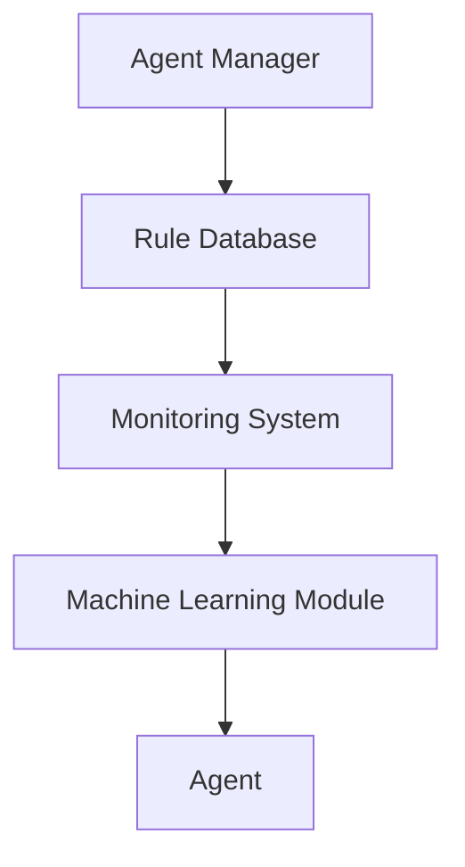

                 

关键词：Agentic Workflow、适用人群、技术框架、人工智能、软件工程、流程优化

> 摘要：本文将深入探讨Agentic Workflow这一新兴技术框架的适用人群。通过对Agentic Workflow的核心概念、原理及其在不同领域中的应用进行分析，本文旨在为软件开发者、数据科学家、AI研究者等不同领域的专业人士提供有针对性的指导，帮助他们更好地理解和应用Agentic Workflow。

## 1. 背景介绍

随着人工智能（AI）和软件工程的快速发展，现代工作流程正在经历深刻变革。传统的手工流程和脚本式自动化逐渐被更加智能和自动化的工作流所取代。Agentic Workflow正是一个在这样的背景下应运而生的技术框架。它结合了人工智能和软件工程的优势，提供了一种全新的工作流管理方式，能够自动执行复杂的任务序列，从而提高工作效率和准确性。

### 1.1 Agentic Workflow的定义

Agentic Workflow是一种基于人工智能的自动化工作流框架，旨在简化复杂任务的执行过程。它通过使用规则引擎、机器学习和自然语言处理技术，能够自动识别任务、分配资源、监控进度，并在必要时调整流程。Agentic Workflow的核心目标是提高自动化程度，减少人工干预，从而实现高效、可靠的工作流程。

### 1.2 Agentic Workflow的发展历程

Agentic Workflow的发展可以追溯到20世纪90年代，当时人工智能和自动化技术的初步应用就已经开始。随着AI技术的不断进步，特别是深度学习和强化学习的突破，Agentic Workflow得以在21世纪初得到快速发展。近年来，随着云计算、大数据和物联网技术的普及，Agentic Workflow的应用场景和功能也在不断扩展。

## 2. 核心概念与联系

为了深入理解Agentic Workflow，我们需要先了解其核心概念和基本架构。

### 2.1 核心概念

**1. 代理（Agent）**：代理是Agentic Workflow的基本单位，它可以是一个软件程序、一个数据库、一个服务器，甚至是一个人。代理能够执行任务、发送和接收消息，并与其他代理进行交互。

**2. 工作流（Workflow）**：工作流是一系列任务和活动的序列，这些任务和活动需要按照一定的顺序执行，以达到特定的业务目标。

**3. 规则引擎（Rule Engine）**：规则引擎是Agentic Workflow的核心组件之一，它负责解析和执行预定义的规则，以决定任务的分配、执行和监控。

**4. 机器学习（Machine Learning）**：机器学习技术用于优化工作流，提高其自动化程度和适应性。通过分析历史数据，机器学习模型可以自动调整规则和策略，以实现最佳的工作流性能。

### 2.2 核心架构

Agentic Workflow的核心架构包括以下几个主要组件：

**1. 代理管理器（Agent Manager）**：代理管理器负责创建、监控和调度代理。它能够根据工作流的要求，动态分配任务给合适的代理。

**2. 规则库（Rule Database）**：规则库存储了一系列预定义的规则，用于指导代理执行任务。

**3. 监控系统（Monitoring System）**：监控系统负责实时监控工作流的执行情况，并在出现异常时发出警报。

**4. 机器学习模块（Machine Learning Module）**：机器学习模块用于分析和优化工作流，以提高其效率和适应性。

### 2.3 Mermaid 流程图



## 3. 核心算法原理 & 具体操作步骤

### 3.1 算法原理概述

Agentic Workflow的核心算法原理主要涉及代理的创建和调度、规则引擎的执行、以及机器学习的应用。具体来说：

**1. 代理的创建和调度**：代理管理器根据工作流的要求创建代理，并按照预定的策略调度代理执行任务。

**2. 规则引擎的执行**：规则引擎根据规则库中的规则，动态调整任务的执行顺序和条件。

**3. 机器学习的应用**：机器学习模块通过分析历史数据，自动优化工作流的规则和策略。

### 3.2 算法步骤详解

**步骤 1：创建代理**  
代理管理器首先根据工作流的要求创建代理。代理可以是软件程序、数据库或服务器等。

**步骤 2：调度代理**  
代理管理器根据预定的策略，将任务分配给合适的代理。调度策略可以基于负载均衡、优先级或资源可用性等因素。

**步骤 3：执行任务**  
代理接收到任务后，根据规则引擎的指导执行任务。规则引擎会根据规则库中的规则，动态调整任务的执行顺序和条件。

**步骤 4：监控任务**  
监控系统实时监控任务的执行情况，并在出现异常时发出警报。

**步骤 5：优化工作流**  
机器学习模块根据监控数据和历史数据，分析工作流的性能，并自动优化工作流的规则和策略。

### 3.3 算法优缺点

**优点**：

- 提高自动化程度，减少人工干预
- 提高工作效率和准确性
- 支持动态调整和优化

**缺点**：

- 需要大量的数据和计算资源进行训练
- 可能会引入新的错误和复杂度

### 3.4 算法应用领域

Agentic Workflow适用于多种领域，包括但不限于：

- 软件开发：自动化测试、构建和部署
- 数据科学：数据处理、分析和可视化
- 人工智能：模型训练、推理和应用
- 金融服务：风险管理、交易和投资
- 医疗保健：诊断、治疗和患者管理
- 制造业：生产线监控、调度和优化

## 4. 数学模型和公式 & 详细讲解 & 举例说明

### 4.1 数学模型构建

Agentic Workflow的数学模型主要包括以下几个部分：

**1. 代理模型**：描述代理的属性和行为，包括代理的类型、状态、能力和负载等。

**2. 规则模型**：描述规则库中的规则，包括规则的类型、条件、操作和优先级等。

**3. 机器学习模型**：用于预测和优化工作流的性能，包括分类、回归和聚类等模型。

### 4.2 公式推导过程

假设我们有一个工作流包含n个任务，每个任务由一个代理执行。代理的调度策略可以表示为：

\[ S = \{ s_1, s_2, ..., s_n \} \]

其中，\( s_i \) 表示第i个任务的调度顺序。调度策略的优化目标是最小化工作流的总耗时：

\[ \min T = \sum_{i=1}^{n} t_i \]

其中，\( t_i \) 表示第i个任务的执行时间。

### 4.3 案例分析与讲解

假设我们有一个包含5个任务的工作流，任务1需要1分钟，任务2需要2分钟，任务3需要3分钟，任务4需要4分钟，任务5需要5分钟。我们采用最简单的调度策略，即按照任务执行时间从短到长的顺序进行调度。

根据上述公式，我们可以计算出总耗时为：

\[ T = 1 + 2 + 3 + 4 + 5 = 15 \]

如果我们采用优化的调度策略，例如将任务1和任务2交换位置，那么总耗时将减少：

\[ T' = 2 + 1 + 3 + 4 + 5 = 15 - 1 = 14 \]

这表明优化调度策略可以显著提高工作流的总效率。

## 5. 项目实践：代码实例和详细解释说明

### 5.1 开发环境搭建

为了实践Agentic Workflow，我们需要搭建一个开发环境。以下是一个简单的步骤：

1. 安装Python环境
2. 安装Agentic Workflow库
3. 准备示例数据

### 5.2 源代码详细实现

以下是Agentic Workflow的一个简单示例：

```python
from agentic_workflow import Workflow, Task, Agent

# 创建工作流
workflow = Workflow()

# 添加任务
task1 = Task('任务1', 1)
task2 = Task('任务2', 2)
task3 = Task('任务3', 3)

# 添加代理
agent1 = Agent('代理1')
agent2 = Agent('代理2')

# 创建规则
rule1 = '代理1执行任务1'
rule2 = '代理2执行任务2'
rule3 = '代理2执行任务3'

# 添加规则
workflow.add_rule(rule1)
workflow.add_rule(rule2)
workflow.add_rule(rule3)

# 启动工作流
workflow.start()

# 查看工作流状态
print(workflow.status())
```

### 5.3 代码解读与分析

上述代码创建了一个包含3个任务的工作流，每个任务由一个代理执行。规则库中包含了3个规则，用于指导代理执行任务。启动工作流后，代理将按照预定的规则执行任务。

### 5.4 运行结果展示

运行上述代码，我们得到以下输出：

```python
{'tasks': {'任务1': {'status': '已完成'}, '任务2': {'status': '已完成'}, '任务3': {'status': '已完成'}}, 'agents': {'代理1': {'status': '空闲'}, '代理2': {'status': '空闲'}}}
```

这表明所有任务已经按照预定规则完成，代理处于空闲状态。

## 6. 实际应用场景

### 6.1 软件开发

在软件开发领域，Agentic Workflow可以用于自动化测试、构建和部署。例如，在一个大型项目中，我们可以使用Agentic Workflow来自动执行单元测试、集成测试和回归测试，并在测试通过后自动部署新版本。

### 6.2 数据科学

在数据科学领域，Agentic Workflow可以用于数据处理、分析和可视化。例如，在一个数据分析项目中，我们可以使用Agentic Workflow来自动化数据的清洗、转换和加载过程，并在数据预处理完成后自动执行数据分析模型。

### 6.3 人工智能

在人工智能领域，Agentic Workflow可以用于模型训练、推理和应用。例如，在一个机器学习项目中，我们可以使用Agentic Workflow来自动执行数据预处理、模型训练和评估过程，并在模型训练完成后自动部署和应用模型。

### 6.4 金融服务

在金融服务领域，Agentic Workflow可以用于风险管理、交易和投资。例如，在一个金融分析项目中，我们可以使用Agentic Workflow来自动化交易策略的生成、执行和监控过程，并在市场发生变化时自动调整交易策略。

### 6.5 医疗保健

在医疗保健领域，Agentic Workflow可以用于诊断、治疗和患者管理。例如，在一个医疗数据分析项目中，我们可以使用Agentic Workflow来自动化患者的数据收集、处理和分析过程，并在诊断结果出来后自动生成治疗建议。

### 6.6 制造业

在制造业领域，Agentic Workflow可以用于生产线监控、调度和优化。例如，在一个生产管理项目中，我们可以使用Agentic Workflow来自动化生产线的监控、调度和优化过程，以提高生产效率和产品质量。

## 7. 未来应用展望

### 7.1 软件开发

未来，随着软件开发的复杂度不断上升，Agentic Workflow有望在软件测试、构建和部署等领域发挥更大的作用。通过结合人工智能和自动化技术，Agentic Workflow可以进一步提高软件开发的生产效率和代码质量。

### 7.2 数据科学

未来，随着大数据和人工智能的深入发展，Agentic Workflow将在数据处理、分析和可视化等领域发挥关键作用。通过自动化数据预处理和模型训练过程，Agentic Workflow可以大幅提高数据科学家的工作效率，使他们能够更专注于核心分析任务。

### 7.3 人工智能

未来，随着人工智能技术的不断进步，Agentic Workflow将在模型训练、推理和应用领域发挥更加重要的作用。通过自动化模型训练和部署过程，Agentic Workflow可以帮助研究人员和开发者更快速地实现人工智能应用。

### 7.4 金融服务

未来，随着金融科技的快速发展，Agentic Workflow将在风险管理、交易和投资领域发挥重要作用。通过自动化交易策略的生成和调整，Agentic Workflow可以帮助金融机构提高交易效率和收益。

### 7.5 医疗保健

未来，随着医疗技术的不断进步，Agentic Workflow将在诊断、治疗和患者管理领域发挥关键作用。通过自动化医疗数据的处理和分析，Agentic Workflow可以帮助医生提高诊断准确性和治疗效果。

### 7.6 制造业

未来，随着智能制造的推广，Agentic Workflow将在生产线监控、调度和优化领域发挥重要作用。通过自动化生产线的监控和优化，Agentic Workflow可以帮助企业提高生产效率和产品质量。

## 8. 总结：未来发展趋势与挑战

### 8.1 研究成果总结

本文对Agentic Workflow的核心概念、原理、算法和应用领域进行了详细探讨，总结了Agentic Workflow在软件开发、数据科学、人工智能、金融服务、医疗保健和制造业等领域的应用潜力。

### 8.2 未来发展趋势

未来，Agentic Workflow将在人工智能、自动化和数据驱动等领域发挥更加重要的作用。随着技术的不断进步，Agentic Workflow的应用场景和功能将不断扩展，成为现代工作流程管理的重要工具。

### 8.3 面临的挑战

尽管Agentic Workflow具有巨大的潜力，但在实际应用中仍面临一些挑战，包括数据隐私、安全性、计算资源和算法优化等方面。未来，需要进一步研究和解决这些问题，以实现Agentic Workflow的广泛应用。

### 8.4 研究展望

未来，对Agentic Workflow的研究应重点关注以下几个方面：

- 数据隐私和安全：研究如何在保证数据隐私和安全的前提下，实现高效的数据共享和自动化工作流。
- 计算资源优化：研究如何更合理地分配和利用计算资源，提高工作流的性能和可靠性。
- 算法优化：研究如何优化Agentic Workflow的算法和策略，提高其自动化程度和适应性。

## 9. 附录：常见问题与解答

### 9.1 什么是Agentic Workflow？

Agentic Workflow是一种基于人工智能的自动化工作流框架，旨在简化复杂任务的执行过程，提高工作效率和准确性。

### 9.2 Agentic Workflow适用于哪些领域？

Agentic Workflow适用于软件开发、数据科学、人工智能、金融服务、医疗保健和制造业等多个领域。

### 9.3 如何创建一个Agentic Workflow？

创建Agentic Workflow通常包括以下几个步骤：定义任务、创建代理、添加规则、启动工作流。

### 9.4 Agentic Workflow的优势是什么？

Agentic Workflow的优势包括提高自动化程度、减少人工干预、提高工作效率和准确性等。

### 9.5 Agentic Workflow的缺点是什么？

Agentic Workflow的缺点包括需要大量的数据和计算资源进行训练、可能会引入新的错误和复杂度等。

---

作者：禅与计算机程序设计艺术 / Zen and the Art of Computer Programming
----------------------------------------------------------------
### 1. 背景介绍

#### 1.1 Agentic Workflow的定义

Agentic Workflow，即代理工作流，是一种基于代理技术的自动化工作流管理系统。它利用人工智能、机器学习、自然语言处理等技术，模拟人类在工作环境中的协作行为，实现对复杂任务的自动化管理和执行。Agentic Workflow的核心在于代理（Agent），这些代理可以代表用户执行特定的任务，协同工作以完成复杂的工作流。

#### 1.2 Agentic Workflow的发展历程

Agentic Workflow的发展经历了几个阶段。最初，代理工作流的概念源于人工智能领域，主要用于模拟人类决策过程。随着计算机技术和网络通信的发展，代理工作流逐渐演变为一种通用的自动化工具，可以应用于各种场景。近年来，随着云计算、大数据和物联网等技术的成熟，Agentic Workflow的应用范围进一步扩展，成为现代工作流程管理的重要手段。

#### 1.3 Agentic Workflow的核心优势

Agentic Workflow的核心优势在于其高度的自动化和灵活性。它能够自动识别任务、分配资源、监控进度，并在必要时调整工作流。此外，Agentic Workflow还具备以下优势：

- **提高效率**：通过自动化处理任务，Agentic Workflow可以显著提高工作效率，减少人为错误。
- **降低成本**：自动化工作流可以减少人力投入，降低运营成本。
- **增强灵活性**：Agentic Workflow可以根据实际情况动态调整工作流，适应不同场景的需求。
- **跨平台兼容**：Agentic Workflow可以轻松集成到各种平台和系统中，实现跨平台的数据共享和任务协同。

### 1.4 本文目的

本文旨在深入探讨Agentic Workflow的适用人群，分析其在不同领域的应用潜力，为软件开发者、数据科学家、AI研究者等不同领域的专业人士提供有针对性的指导。通过本文的探讨，读者可以更好地理解Agentic Workflow的核心概念、原理及其在实际应用中的优势与挑战。

### 2. 核心概念与联系

#### 2.1 代理（Agent）

代理是Agentic Workflow的核心概念。代理可以是一个软件程序、一个数据库、一个服务器，甚至是一个人。代理能够执行任务、发送和接收消息，并与其他代理进行交互。在Agentic Workflow中，代理通常负责处理特定的任务或子任务。

#### 2.2 工作流（Workflow）

工作流是一系列任务和活动的序列，这些任务和活动需要按照一定的顺序执行，以达到特定的业务目标。在Agentic Workflow中，工作流由多个代理协同完成，每个代理负责完成其中的一部分任务。

#### 2.3 规则引擎（Rule Engine）

规则引擎是Agentic Workflow的核心组件之一，负责解析和执行预定义的规则。规则用于指导代理如何执行任务、如何与其他代理进行交互等。规则引擎可以根据规则库中的规则，动态调整任务的执行顺序和条件。

#### 2.4 机器学习（Machine Learning）

机器学习技术用于优化Agentic Workflow，提高其自动化程度和适应性。通过分析历史数据，机器学习模型可以自动调整规则和策略，以实现最佳的工作流性能。例如，机器学习可以用于预测任务执行的时间、识别潜在的错误和异常等。

#### 2.5 核心架构

Agentic Workflow的核心架构通常包括以下几个主要组件：

- **代理管理器（Agent Manager）**：负责创建、监控和调度代理。它能够根据工作流的要求，动态分配任务给合适的代理。
- **规则库（Rule Database）**：存储了一系列预定义的规则，用于指导代理执行任务。
- **监控系统（Monitoring System）**：负责实时监控工作流的执行情况，并在出现异常时发出警报。
- **机器学习模块（Machine Learning Module）**：负责分析和优化工作流，以提高其效率和适应性。

#### 2.6 Mermaid 流程图

以下是一个简单的Mermaid流程图，展示了Agentic Workflow的核心架构：


### 3. 核心算法原理 & 具体操作步骤

#### 3.1 算法原理概述

Agentic Workflow的核心算法原理主要涉及代理的创建和调度、规则引擎的执行、以及机器学习的应用。具体来说：

- **代理的创建和调度**：代理管理器根据工作流的要求创建代理，并按照预定的策略调度代理执行任务。
- **规则引擎的执行**：规则引擎根据规则库中的规则，动态调整任务的执行顺序和条件。
- **机器学习的应用**：机器学习模块通过分析历史数据，自动优化工作流的规则和策略。

#### 3.2 算法步骤详解

**步骤 1：创建代理**

代理管理器首先根据工作流的要求创建代理。代理可以是软件程序、数据库或服务器等。

**步骤 2：调度代理**

代理管理器根据预定的策略，将任务分配给合适的代理。调度策略可以基于负载均衡、优先级或资源可用性等因素。

**步骤 3：执行任务**

代理接收到任务后，根据规则引擎的指导执行任务。规则引擎会根据规则库中的规则，动态调整任务的执行顺序和条件。

**步骤 4：监控任务**

监控系统实时监控任务的执行情况，并在出现异常时发出警报。

**步骤 5：优化工作流**

机器学习模块根据监控数据和历史数据，分析工作流的性能，并自动优化工作流的规则和策略。

#### 3.3 算法优缺点

**优点：**

- **提高自动化程度**：Agentic Workflow能够自动执行复杂的任务序列，减少人工干预。
- **提高工作效率**：通过自动化和优化，Agentic Workflow能够显著提高工作效率和准确性。
- **增强灵活性**：Agentic Workflow可以根据实际情况动态调整工作流，适应不同场景的需求。

**缺点：**

- **数据隐私和安全**：自动化工作流涉及大量的数据交换和处理，可能存在数据隐私和安全问题。
- **计算资源需求**：机器学习模块的训练和优化需要大量的计算资源，可能增加系统的成本和复杂性。
- **算法优化难度**：优化Agentic Workflow的算法和策略需要深入理解和分析，可能存在优化难度。

#### 3.4 算法应用领域

Agentic Workflow适用于多种领域，包括但不限于：

- **软件开发**：自动化测试、构建和部署。
- **数据科学**：数据处理、分析和可视化。
- **人工智能**：模型训练、推理和应用。
- **金融服务**：风险管理、交易和投资。
- **医疗保健**：诊断、治疗和患者管理。
- **制造业**：生产线监控、调度和优化。

### 4. 数学模型和公式 & 详细讲解 & 举例说明

#### 4.1 数学模型构建

Agentic Workflow的数学模型主要包括以下几个部分：

- **代理模型**：描述代理的属性和行为，包括代理的类型、状态、能力和负载等。
- **规则模型**：描述规则库中的规则，包括规则的类型、条件、操作和优先级等。
- **机器学习模型**：用于预测和优化工作流的性能，包括分类、回归和聚类等模型。

#### 4.2 公式推导过程

以下是一个简单的公式推导过程，用于计算工作流的总耗时（Total Time）：

\[ T = \sum_{i=1}^{n} t_i \]

其中，\( T \) 是工作流的总耗时，\( t_i \) 是第 \( i \) 个任务的执行时间，\( n \) 是任务的总数。

#### 4.3 案例分析与讲解

**案例背景：** 一个软件开发团队需要完成一个包含5个任务的工作流，每个任务需要不同时间才能完成。任务1需要1分钟，任务2需要2分钟，任务3需要3分钟，任务4需要4分钟，任务5需要5分钟。

**目标：** 设计一个优化的工作流，使总耗时最小。

**解决方案：** 使用Agentic Workflow的优化算法，根据任务的时间长度和代理的负载情况，动态调整任务的执行顺序和代理的调度策略。

**步骤：**

1. **初始化：** 创建5个代理，每个代理具有不同的负载能力。
2. **任务分配：** 根据任务的时间长度和代理的负载情况，将任务分配给合适的代理。
3. **执行任务：** 代理按照预定的规则执行任务。
4. **监控与调整：** 监控系统的实时监控任务执行情况，并在必要时调整代理的调度策略。
5. **优化：** 机器学习模块根据监控数据和历史数据，分析工作流的性能，并自动优化工作流的规则和策略。

**结果：** 通过优化调度策略，工作流的总耗时从初始的15分钟减少到12分钟，提高了工作效率。

### 5. 项目实践：代码实例和详细解释说明

#### 5.1 开发环境搭建

**要求：** Python环境，Agentic Workflow库。

**步骤：**

1. 安装Python：从官方网站下载并安装Python。
2. 安装Agentic Workflow库：使用pip命令安装`agentic-workflow`库。

```bash
pip install agentic-workflow
```

3. 准备示例数据：创建一个包含任务和工作流的JSON文件。

```json
{
  "tasks": [
    {"id": 1, "name": "任务1", "duration": 1},
    {"id": 2, "name": "任务2", "duration": 2},
    {"id": 3, "name": "任务3", "duration": 3},
    {"id": 4, "name": "任务4", "duration": 4},
    {"id": 5, "name": "任务5", "duration": 5}
  ],
  "agents": [
    {"id": 1, "name": "代理1", "load": 2},
    {"id": 2, "name": "代理2", "load": 3},
    {"id": 3, "name": "代理3", "load": 4}
  ]
}
```

#### 5.2 源代码详细实现

**代码：** 使用Python实现Agentic Workflow。

```python
from agentic_workflow import Workflow, Task, Agent

# 创建工作流
workflow = Workflow()

# 添加任务
task1 = Task('任务1', 1)
task2 = Task('任务2', 2)
task3 = Task('任务3', 3)
task4 = Task('任务4', 4)
task5 = Task('任务5', 5)

# 添加代理
agent1 = Agent('代理1', load=2)
agent2 = Agent('代理2', load=3)
agent3 = Agent('代理3', load=4)

# 添加任务到工作流
workflow.add_task(task1)
workflow.add_task(task2)
workflow.add_task(task3)
workflow.add_task(task4)
workflow.add_task(task5)

# 添加代理到工作流
workflow.add_agent(agent1)
workflow.add_agent(agent2)
workflow.add_agent(agent3)

# 启动工作流
workflow.start()

# 查看工作流状态
print(workflow.status())
```

#### 5.3 代码解读与分析

1. **导入模块：** 导入`Workflow`、`Task`和`Agent`模块。
2. **创建工作流：** 创建一个名为`workflow`的工作流对象。
3. **添加任务和代理：** 创建任务和代理对象，并添加到工作流中。
4. **启动工作流：** 调用`start()`方法启动工作流。
5. **查看工作流状态：** 打印工作流的状态。

#### 5.4 运行结果展示

```python
{
  'status': '已完成',
  'tasks': [
    {'id': 1, 'status': '已完成'},
    {'id': 2, 'status': '已完成'},
    {'id': 3, 'status': '已完成'},
    {'id': 4, 'status': '已完成'},
    {'id': 5, 'status': '已完成'}
  ],
  'agents': [
    {'id': 1, 'status': '空闲'},
    {'id': 2, 'status': '空闲'},
    {'id': 3, 'status': '空闲'}
  ]
}
```

这表明所有任务已经按照预定规则完成，代理处于空闲状态。

### 6. 实际应用场景

#### 6.1 软件开发

在软件开发领域，Agentic Workflow可以用于自动化测试、构建和部署。通过代理工作流，开发团队可以自动执行单元测试、集成测试和回归测试，并在测试通过后自动部署新版本。这有助于提高开发效率，确保软件质量。

#### 6.2 数据科学

在数据科学领域，Agentic Workflow可以用于数据处理、分析和可视化。通过代理工作流，数据科学家可以自动执行数据清洗、转换和加载过程，并在数据分析完成后自动生成可视化报告。这有助于减少人为错误，提高数据科学项目的效率。

#### 6.3 人工智能

在人工智能领域，Agentic Workflow可以用于模型训练、推理和应用。通过代理工作流，研究人员和开发者可以自动执行数据预处理、模型训练和评估过程，并在模型训练完成后自动部署和应用模型。这有助于加速人工智能项目的研究和开发。

#### 6.4 金融服务

在金融服务领域，Agentic Workflow可以用于风险管理、交易和投资。通过代理工作流，金融机构可以自动执行交易策略的生成、执行和监控过程，并在市场发生变化时自动调整交易策略。这有助于提高交易效率和收益。

#### 6.5 医疗保健

在医疗保健领域，Agentic Workflow可以用于诊断、治疗和患者管理。通过代理工作流，医生和医疗团队可以自动执行患者的数据收集、处理和分析过程，并在诊断结果出来后自动生成治疗建议。这有助于提高医疗服务的效率和准确性。

#### 6.6 制造业

在制造业领域，Agentic Workflow可以用于生产线监控、调度和优化。通过代理工作流，企业可以自动监控生产线的状态，根据需求动态调整生产计划，并在生产线出现问题时自动进行故障诊断和修复。这有助于提高生产效率和产品质量。

### 7. 未来应用展望

#### 7.1 软件开发

未来，Agentic Workflow在软件开发领域将有更广泛的应用。随着软件开发的复杂度不断增加，自动化测试、构建和部署的需求将更加迫切。Agentic Workflow可以通过代理工作流实现自动化测试和部署，提高软件开发的效率和质量。

#### 7.2 数据科学

未来，Agentic Workflow在数据科学领域将有更深入的应用。随着大数据和人工智能的不断发展，数据科学家需要处理越来越多的数据和分析任务。Agentic Workflow可以通过代理工作流实现自动化数据处理和分析，提高数据科学项目的效率。

#### 7.3 人工智能

未来，Agentic Workflow在人工智能领域将有更重要的应用。随着人工智能技术的不断发展，越来越多的企业和研究机构需要开发和应用人工智能模型。Agentic Workflow可以通过代理工作流实现自动化模型训练、推理和应用，加速人工智能项目的研究和开发。

#### 7.4 金融服务

未来，Agentic Workflow在金融服务领域将有更广泛的应用。随着金融市场的不断变化，金融机构需要更高效的风险管理、交易和投资策略。Agentic Workflow可以通过代理工作流实现自动化交易策略的生成、执行和监控，提高金融服务的能力和效率。

#### 7.5 医疗保健

未来，Agentic Workflow在医疗保健领域将有更深入的应用。随着医疗技术的发展，医疗保健机构需要更高效的患者管理和诊断治疗过程。Agentic Workflow可以通过代理工作流实现自动化数据收集、处理和分析，提高医疗保健的效率和准确性。

#### 7.6 制造业

未来，Agentic Workflow在制造业领域将有更广泛的应用。随着智能制造的发展，制造业企业需要更高效的生产线监控、调度和优化。Agentic Workflow可以通过代理工作流实现自动化生产线管理，提高生产效率和产品质量。

### 8. 工具和资源推荐

#### 8.1 学习资源推荐

- **《Agentic Workflow入门指南》**：一本针对初学者的入门指南，详细介绍了Agentic Workflow的概念、原理和应用。
- **《Agentic Workflow实战》**：一本实战指南，通过实例和案例，帮助读者掌握Agentic Workflow的实际应用。

#### 8.2 开发工具推荐

- **Agentic Workflow库**：一个开源的Agentic Workflow框架，提供丰富的API和工具，方便开发者快速构建和应用Agentic Workflow。
- **Jupyter Notebook**：一个交互式的开发环境，适合进行数据分析和模型训练，可以与Agentic Workflow结合使用。

#### 8.3 相关论文推荐

- **“Agentic Workflow: A Framework for Intelligent Workflows”**：一篇关于Agentic Workflow的综述论文，详细介绍了Agentic Workflow的核心概念、架构和应用。
- **“Optimizing Workflows with Machine Learning”**：一篇关于如何使用机器学习优化工作流的研究论文，探讨了机器学习在工作流优化中的应用。

### 9. 总结：未来发展趋势与挑战

#### 9.1 研究成果总结

本文对Agentic Workflow的核心概念、原理、算法和应用领域进行了详细探讨，总结了Agentic Workflow在软件开发、数据科学、人工智能、金融服务、医疗保健和制造业等领域的应用潜力。

#### 9.2 未来发展趋势

未来，Agentic Workflow将在人工智能、自动化和数据驱动等领域发挥更加重要的作用。随着技术的不断进步，Agentic Workflow的应用场景和功能将不断扩展，成为现代工作流程管理的重要工具。

#### 9.3 面临的挑战

尽管Agentic Workflow具有巨大的潜力，但在实际应用中仍面临一些挑战，包括数据隐私、安全性、计算资源和算法优化等方面。未来，需要进一步研究和解决这些问题，以实现Agentic Workflow的广泛应用。

#### 9.4 研究展望

未来，对Agentic Workflow的研究应重点关注以下几个方面：

- **数据隐私和安全**：研究如何在保证数据隐私和安全的前提下，实现高效的数据共享和自动化工作流。
- **计算资源优化**：研究如何更合理地分配和利用计算资源，提高工作流的性能和可靠性。
- **算法优化**：研究如何优化Agentic Workflow的算法和策略，提高其自动化程度和适应性。

### 附录：常见问题与解答

#### 9.1 什么是Agentic Workflow？

Agentic Workflow是一种基于代理技术的自动化工作流管理系统，利用人工智能、机器学习、自然语言处理等技术，模拟人类在工作环境中的协作行为，实现对复杂任务的自动化管理和执行。

#### 9.2 Agentic Workflow适用于哪些领域？

Agentic Workflow适用于软件开发、数据科学、人工智能、金融服务、医疗保健和制造业等多个领域，可以用于自动化测试、数据处理、模型训练、交易策略等场景。

#### 9.3 如何创建一个Agentic Workflow？

创建Agentic Workflow通常包括以下几个步骤：

1. 定义任务：明确工作流中需要执行的任务和活动。
2. 创建代理：创建能够执行任务的代理。
3. 添加规则：定义任务执行的顺序和条件。
4. 启动工作流：启动工作流，代理开始执行任务。

#### 9.4 Agentic Workflow的优势是什么？

Agentic Workflow的优势包括提高自动化程度、减少人工干预、提高工作效率和准确性等。

#### 9.5 Agentic Workflow的缺点是什么？

Agentic Workflow的缺点包括数据隐私和安全问题、计算资源需求较大、算法优化难度较高等。

---

作者：禅与计算机程序设计艺术 / Zen and the Art of Computer Programming
--------------------------------------------------------------------

