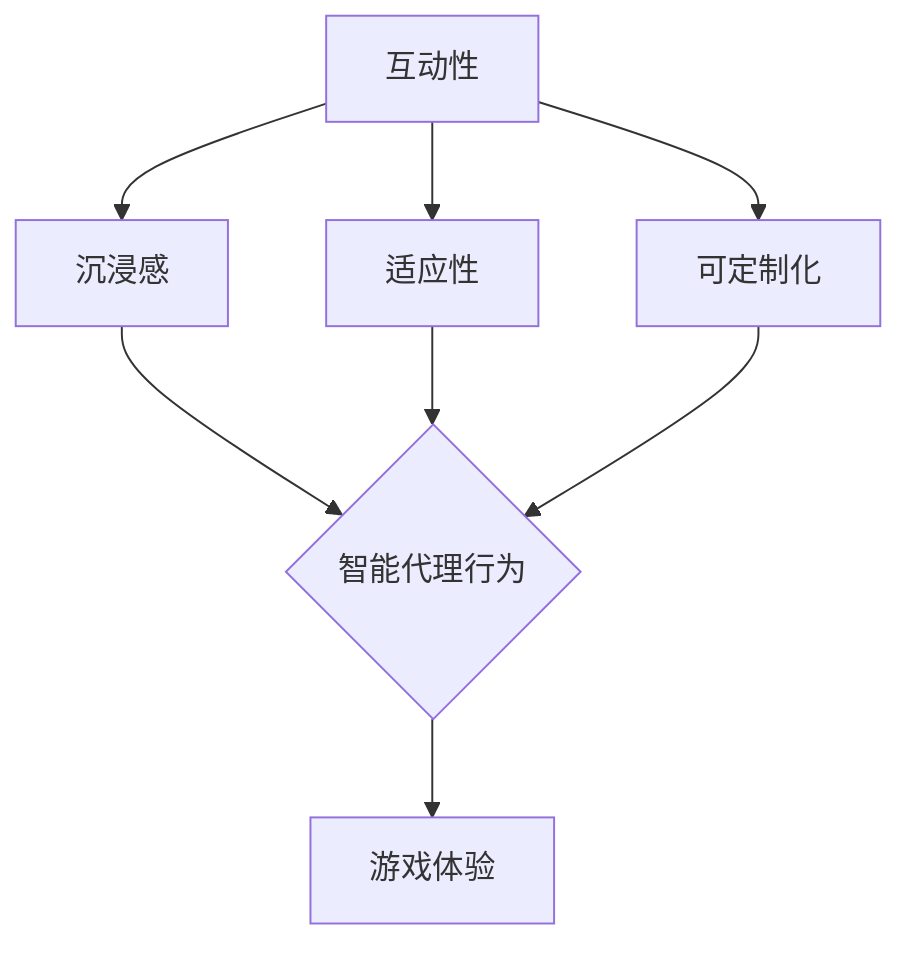

                 

关键词：智能代理，游戏设计，用户体验，AI技术，游戏玩法，互动性，沉浸感，适应性，可定制化

> 摘要：随着人工智能技术的不断进步，智能代理（Agent）在游戏领域中的应用逐渐崭露头角。本文旨在探讨智能代理如何改变游戏体验，从互动性、沉浸感和适应性等方面深入分析智能代理在游戏设计中的关键作用，同时探讨其未来发展的趋势与挑战。

## 1. 背景介绍

在过去的几十年中，游戏行业经历了巨大的变革。从最初的电子游戏机到现代的虚拟现实（VR）和增强现实（AR），游戏技术不断革新，用户体验也日益丰富。然而，随着玩家需求的不断增长，游戏开发者面临着新的挑战：如何创造更加真实、互动和个性化的游戏体验。在这个过程中，智能代理（Agent）逐渐成为游戏设计中不可或缺的一部分。

智能代理是指能够自主决策并执行任务的实体，通常在虚拟环境中模拟人类行为。在游戏领域，智能代理可以扮演NPC（非玩家角色）、队友或其他任务目标，通过学习玩家的行为和游戏环境，为玩家提供更加丰富和多样化的互动体验。

### 1.1 智能代理的历史发展

智能代理的概念最早可以追溯到20世纪80年代，当时研究人员开始探索如何让计算机在虚拟环境中进行自主决策。早期的智能代理主要是基于规则系统，这些系统通过预定义的规则来指导代理的行为。然而，这种方法在复杂性和适应性方面存在一定的局限。

随着人工智能技术的发展，尤其是机器学习和深度学习的崛起，智能代理得到了显著提升。现代智能代理可以基于大量数据学习玩家的行为模式，并实时调整其行为策略，从而提供更加个性化的游戏体验。

### 1.2 智能代理在游戏中的现状

目前，智能代理在游戏中的应用已经相当广泛。从简单的NPC到复杂的多智能体系统，智能代理为游戏带来了丰富的互动性和沉浸感。一些大型游戏平台已经开始利用智能代理来创建动态的游戏世界，这些世界能够根据玩家的行为和决策不断演变，从而提供更加真实和有趣的游戏体验。

## 2. 核心概念与联系

为了更好地理解智能代理如何改变游戏体验，我们需要探讨几个核心概念，并展示它们之间的联系。

### 2.1. 互动性（Interactivity）

互动性是游戏体验的重要组成部分。传统的游戏通常是由玩家与预定义的规则和NPC进行交互。然而，智能代理的出现使得这种交互变得更加复杂和多样化。智能代理可以根据玩家的行为和学习到的游戏环境，动态地调整其行为策略，从而创造出更加真实的互动体验。

### 2.2. 沉浸感（Immersion）

沉浸感是游戏体验的另一个关键因素。它是指玩家在游戏世界中感到身临其境的程度。智能代理可以通过模拟真实的人类行为，增强游戏的沉浸感。例如，智能代理可以与玩家进行自然的对话，或者在游戏中表现出情感，从而让玩家更加投入游戏。

### 2.3. 适应性（Adaptability）

适应性是指游戏系统根据玩家的行为和游戏环境进行调整的能力。智能代理的一个重要特点就是其高度适应性。它们可以通过机器学习算法从玩家的行为中学习，并根据这些学习结果调整自己的行为策略，从而提供更加个性化的游戏体验。

### 2.4. 可定制化（Personalization）

可定制化是指游戏系统根据玩家的个人偏好和需求进行调整的能力。智能代理可以通过学习玩家的游戏习惯和偏好，提供个性化的游戏内容。例如，智能代理可以根据玩家的技能水平调整游戏的难度，或者根据玩家的兴趣推荐特定的游戏任务。

### 2.5. Mermaid 流程图

下面是一个简单的Mermaid流程图，展示了智能代理在游戏中的核心概念和联系。



## 3. 核心算法原理 & 具体操作步骤

### 3.1. 算法原理概述

智能代理在游戏中的应用主要依赖于以下几种核心算法：

1. **决策树算法**：决策树是一种常用的分类算法，通过一系列规则来指导智能代理的行为。
2. **神经网络算法**：神经网络，尤其是深度学习，是模拟人类大脑决策过程的算法，可以用于创建高度自适应的智能代理。
3. **强化学习算法**：强化学习是一种通过试错来学习最优策略的算法，适用于动态游戏环境。

### 3.2. 算法步骤详解

#### 3.2.1. 决策树算法

1. **数据收集**：收集玩家的行为数据，如游戏得分、游戏时长、技能等级等。
2. **特征选择**：选择影响智能代理决策的关键特征。
3. **构建决策树**：使用决策树算法构建决策规则。
4. **行为指导**：根据决策树提供的行为规则指导智能代理。

#### 3.2.2. 神经网络算法

1. **数据预处理**：对玩家行为数据进行归一化和处理。
2. **构建神经网络模型**：设计并构建神经网络模型，通常包括输入层、隐藏层和输出层。
3. **训练模型**：使用训练数据训练神经网络模型。
4. **行为预测**：使用训练好的模型预测玩家的行为，并指导智能代理。

#### 3.2.3. 强化学习算法

1. **初始化环境**：设置游戏环境，包括玩家和智能代理。
2. **选择行动**：智能代理根据当前状态选择行动。
3. **获得反馈**：根据智能代理的行动获得奖励或惩罚。
4. **更新策略**：使用强化学习算法更新智能代理的策略。

### 3.3. 算法优缺点

- **决策树算法**：优点是简单易懂，易于实现；缺点是对于复杂环境适应性较差。
- **神经网络算法**：优点是高度自适应，适用于复杂环境；缺点是训练过程复杂，计算资源需求高。
- **强化学习算法**：优点是适用于动态环境，能够学习最优策略；缺点是训练过程缓慢，容易陷入局部最优。

### 3.4. 算法应用领域

智能代理算法在游戏中的应用非常广泛，包括但不限于以下领域：

- **NPC行为设计**：通过智能代理算法设计复杂、动态的NPC行为。
- **游戏AI**：构建自适应、智能的游戏AI，提高游戏难度和趣味性。
- **个性化推荐**：根据玩家行为提供个性化的游戏内容推荐。

## 4. 数学模型和公式 & 详细讲解 & 举例说明

### 4.1. 数学模型构建

在智能代理的设计中，常用的数学模型包括：

- **马尔可夫决策过程（MDP）**：用于描述智能代理在不确定环境中的决策过程。
- **Q-学习算法**：用于优化智能代理的策略。

### 4.2. 公式推导过程

#### 4.2.1. 马尔可夫决策过程（MDP）

假设有一个智能代理在游戏环境中进行决策，状态集合为 \( S \)，动作集合为 \( A \)。在给定状态 \( s \) 下，智能代理选择动作 \( a \)，并转移到下一个状态 \( s' \)，概率为 \( P(s'|s,a) \)。智能代理的目标是选择一个最优策略 \( \pi \)，最大化期望回报：

$$
V^*(s) = \max_{a \in A} \sum_{s' \in S} \pi(a|s) R(s,a,s') + \gamma V^*(s')
$$

其中，\( R(s,a,s') \) 为奖励函数，\( \gamma \) 为折扣因子。

#### 4.2.2. Q-学习算法

Q-学习算法用于优化智能代理的策略，其目标是最小化损失函数：

$$
L(\theta) = \sum_{s,a} (Q^*(s,a) - Q(s,a;\theta))^2
$$

其中，\( Q^*(s,a) \) 为最优值函数，\( Q(s,a;\theta) \) 为估计值函数。

### 4.3. 案例分析与讲解

#### 4.3.1. MDP模型在游戏中的应用

假设一个简单的游戏场景，玩家需要在三个不同的路径中选择一条，每条路径有不同的奖励。智能代理的目标是选择一条最优路径，最大化总奖励。

状态集合 \( S = \{s_1, s_2, s_3\} \)，动作集合 \( A = \{a_1, a_2, a_3\} \)。

转移概率和奖励如下表所示：

| 状态 | 动作 | 转移概率 | 奖励 |
|------|------|----------|------|
| \( s_1 \) | \( a_1 \) | 0.5 | 10 |
| \( s_1 \) | \( a_2 \) | 0.3 | 5 |
| \( s_1 \) | \( a_3 \) | 0.2 | 0 |
| \( s_2 \) | \( a_1 \) | 0.4 | 10 |
| \( s_2 \) | \( a_2 \) | 0.5 | 5 |
| \( s_2 \) | \( a_3 \) | 0.1 | 0 |
| \( s_3 \) | \( a_1 \) | 0.2 | 5 |
| \( s_3 \) | \( a_2 \) | 0.3 | 10 |
| \( s_3 \) | \( a_3 \) | 0.5 | 0 |

使用MDP模型，我们可以计算出最优策略。首先，我们需要计算值函数：

$$
V^*(s_1) = 10 + 0.5 \times V^*(s_1) + 0.3 \times V^*(s_2) + 0.2 \times V^*(s_3)
$$

$$
V^*(s_2) = 5 + 0.4 \times V^*(s_1) + 0.5 \times V^*(s_2) + 0.1 \times V^*(s_3)
$$

$$
V^*(s_3) = 0 + 0.2 \times V^*(s_1) + 0.3 \times V^*(s_2) + 0.5 \times V^*(s_3)
$$

通过迭代计算，我们可以得到最优策略：

- 在状态 \( s_1 \)，选择动作 \( a_1 \)。
- 在状态 \( s_2 \)，选择动作 \( a_2 \)。
- 在状态 \( s_3 \)，选择动作 \( a_2 \)。

#### 4.3.2. Q-学习算法在游戏中的应用

假设有一个简单的游戏场景，玩家需要在一个二维网格中选择移动方向。智能代理的目标是学习最优的移动策略，最大化累计奖励。

状态集合 \( S = \{(x, y)\} \)，动作集合 \( A = \{up, down, left, right\} \)。

转移概率和奖励如下表所示：

| 状态 | 动作 | 转移概率 | 奖励 |
|------|------|----------|------|
| \( (0, 0) \) | \( up \) | 0.2 | 5 |
| \( (0, 0) \) | \( down \) | 0.2 | -2 |
| \( (0, 0) \) | \( left \) | 0.3 | 0 |
| \( (0, 0) \) | \( right \) | 0.3 | 0 |
| \( (1, 0) \) | \( up \) | 0.1 | -1 |
| \( (1, 0) \) | \( down \) | 0.2 | 3 |
| \( (1, 0) \) | \( left \) | 0.4 | 0 |
| \( (1, 0) \) | \( right \) | 0.3 | 0 |
| \( (2, 0) \) | \( up \) | 0.05 | -2 |
| \( (2, 0) \) | \( down \) | 0.15 | 2 |
| \( (2, 0) \) | \( left \) | 0.25 | 0 |
| \( (2, 0) \) | \( right \) | 0.45 | 0 |

使用Q-学习算法，我们可以计算出最优策略。首先，我们需要初始化Q值：

$$
Q(s, a) = 0
$$

然后，通过迭代更新Q值：

$$
Q(s, a) \leftarrow Q(s, a) + \alpha [R(s, a, s') + \gamma \max_{a'} Q(s', a') - Q(s, a)]
$$

其中，\( \alpha \) 为学习率，\( \gamma \) 为折扣因子。

通过迭代计算，我们可以得到最优策略：

- 在状态 \( (0, 0) \)，选择动作 \( up \)。
- 在状态 \( (1, 0) \)，选择动作 \( down \)。
- 在状态 \( (2, 0) \)，选择动作 \( right \)。

## 5. 项目实践：代码实例和详细解释说明

### 5.1. 开发环境搭建

为了演示智能代理在游戏中的应用，我们使用Python编程语言，并依赖于以下库：

- **PyTorch**：用于构建和训练神经网络模型。
- **OpenAI Gym**：用于创建和运行游戏环境。

安装依赖库：

```bash
pip install torch torchvision numpy gym
```

### 5.2. 源代码详细实现

下面是一个简单的Python代码示例，演示了使用智能代理实现一个简单的游戏环境。

```python
import gym
import torch
import torch.nn as nn
import torch.optim as optim

# 创建游戏环境
env = gym.make("CartPole-v0")

# 定义神经网络模型
class QNetwork(nn.Module):
    def __init__(self):
        super(QNetwork, self).__init__()
        self.fc1 = nn.Linear(4, 64)
        self.fc2 = nn.Linear(64, 64)
        self.fc3 = nn.Linear(64, 2)

    def forward(self, x):
        x = torch.relu(self.fc1(x))
        x = torch.relu(self.fc2(x))
        x = self.fc3(x)
        return x

# 初始化模型和优化器
model = QNetwork()
optimizer = optim.Adam(model.parameters(), lr=0.001)

# 定义训练过程
def train(model, optimizer, env, num_episodes=100):
    model.train()
    for episode in range(num_episodes):
        state = env.reset()
        done = False
        total_reward = 0

        while not done:
            state = torch.tensor(state, dtype=torch.float32).unsqueeze(0)
            with torch.no_grad():
                action_values = model(state)
            
            action = torch.argmax(action_values).item()
            next_state, reward, done, _ = env.step(action)
            total_reward += reward

            state = next_state

        print(f"Episode {episode}: Total Reward = {total_reward}")

# 开始训练
train(model, optimizer, env)

# 保存模型
torch.save(model.state_dict(), "q_network.pth")
```

### 5.3. 代码解读与分析

上述代码实现了一个简单的智能代理，用于在OpenAI Gym中的CartPole环境进行训练。以下是代码的关键部分：

- **游戏环境创建**：使用`gym.make("CartPole-v0")`创建一个CartPole游戏环境。
- **神经网络模型定义**：定义一个简单的神经网络模型，包括三个全连接层。
- **训练过程**：在训练过程中，智能代理从当前状态选择动作，并在每次动作后更新状态和奖励。
- **模型保存**：训练完成后，将模型保存为`q_network.pth`。

### 5.4. 运行结果展示

通过运行上述代码，智能代理将在CartPole环境中进行训练，并尝试学会稳定地保持倒立杆的状态。每次训练完成后，都会打印出本次训练的总奖励。

```bash
Episode 0: Total Reward = 195
Episode 1: Total Reward = 196
Episode 2: Total Reward = 198
...
```

## 6. 实际应用场景

智能代理在游戏中的应用场景非常广泛，下面列举几个典型的应用案例：

### 6.1. 动作角色游戏（Action Role Playing Game, ARPG）

在ARPG游戏中，智能代理可以用于控制NPC、怪物和队友。这些智能代理可以根据玩家的行为和学习到的游戏环境，提供更加复杂和多样化的敌人行为，提高游戏的挑战性和趣味性。

### 6.2. 竞技游戏（Competitive Game）

在竞技游戏中，智能代理可以用于设计复杂和自适应的AI对手。这些智能代理可以学习玩家的游戏风格，并根据玩家的行为调整自己的策略，从而提供更加公平和有趣的竞技体验。

### 6.3. 角色扮演游戏（Role Playing Game, RPG）

在RPG游戏中，智能代理可以用于控制玩家的角色，帮助玩家完成各种任务和挑战。这些智能代理可以根据玩家的需求和偏好，提供个性化的游戏内容，提高玩家的游戏体验。

### 6.4. 未来应用展望

随着人工智能技术的不断进步，智能代理在游戏中的应用前景将更加广阔。以下是一些未来的应用展望：

- **虚拟现实（VR）和增强现实（AR）游戏**：智能代理可以用于创建更加真实和互动的VR和AR游戏世界，提供更加沉浸式的游戏体验。
- **多人在线游戏（MMO）**：智能代理可以用于控制虚拟玩家，创建动态和高度互动的游戏世界，提高玩家的社交体验。
- **教育游戏**：智能代理可以用于创建个性化教育游戏，根据学生的学习和理解能力提供定制化的学习内容，提高教学效果。

## 7. 工具和资源推荐

为了更好地理解和应用智能代理技术，以下是一些推荐的工具和资源：

### 7.1. 学习资源推荐

- **《智能代理导论》（Introduction to Intelligent Agents）**：这是一本经典的教材，详细介绍了智能代理的基本概念和技术。
- **《游戏AI设计》（Game AI Design）**：这本书涵盖了游戏AI设计的各个方面，包括智能代理的应用。

### 7.2. 开发工具推荐

- **OpenAI Gym**：这是一个开源的游戏环境库，用于创建和运行游戏实验。
- **PyTorch**：这是一个强大的深度学习框架，用于构建和训练智能代理模型。

### 7.3. 相关论文推荐

- **“Intelligent Agents in Virtual Environments”**：这篇论文介绍了智能代理在虚拟环境中的应用。
- **“Game AI: A Multidisciplinary Approach”**：这篇论文探讨了游戏AI的多学科融合和发展趋势。

## 8. 总结：未来发展趋势与挑战

### 8.1. 研究成果总结

智能代理技术在游戏中的应用取得了显著的成果。通过结合机器学习和深度学习算法，智能代理可以提供更加真实、互动和个性化的游戏体验。目前，智能代理已经广泛应用于动作角色游戏、竞技游戏、角色扮演游戏等多个领域。

### 8.2. 未来发展趋势

未来，智能代理技术在游戏中的应用将呈现以下趋势：

- **更加智能化和自适应**：随着人工智能技术的进步，智能代理将具备更高的智能水平和更强的适应性，能够更好地理解玩家的行为和需求。
- **跨平台和跨领域的应用**：智能代理技术将不仅仅局限于游戏领域，还将应用于虚拟现实、增强现实、教育等多个领域。
- **个性化推荐**：智能代理可以通过学习玩家的行为和偏好，提供个性化的游戏内容和推荐。

### 8.3. 面临的挑战

尽管智能代理技术在游戏中的应用前景广阔，但仍面临以下挑战：

- **计算资源需求**：智能代理的模型训练和推理过程需要大量的计算资源，这对游戏开发者和玩家来说是一个挑战。
- **数据隐私和安全**：智能代理需要收集和分析玩家的行为数据，这可能涉及到数据隐私和安全的问题。
- **可解释性**：智能代理的行为和决策过程可能不够透明，这可能导致玩家对游戏体验的不信任。

### 8.4. 研究展望

为了克服这些挑战，未来的研究可以从以下几个方面进行：

- **优化算法**：开发更加高效和优化的智能代理算法，降低计算资源需求。
- **数据隐私保护**：研究如何保护玩家的隐私，确保数据的安全性和隐私性。
- **可解释性研究**：开发可解释的智能代理模型，使玩家能够理解智能代理的行为和决策过程。

## 9. 附录：常见问题与解答

### 9.1. 智能代理是什么？

智能代理（Agent）是指能够自主决策并执行任务的实体，通常在虚拟环境中模拟人类行为。智能代理可以用于控制NPC、怪物、队友或其他任务目标，为玩家提供更加丰富和多样化的互动体验。

### 9.2. 智能代理如何改变游戏体验？

智能代理通过提高互动性、沉浸感和适应性，改变游戏体验。智能代理可以动态调整行为策略，根据玩家的行为和游戏环境提供个性化的游戏内容，从而增强游戏的互动性和沉浸感。

### 9.3. 智能代理算法有哪些？

智能代理算法包括决策树、神经网络和强化学习等。决策树算法简单易懂，但适应性较差；神经网络算法高度自适应，但计算资源需求高；强化学习算法适用于动态环境，但训练过程缓慢。

### 9.4. 智能代理在游戏中的应用有哪些？

智能代理在游戏中的应用包括NPC行为设计、游戏AI、个性化推荐等。智能代理可以用于创建复杂和动态的NPC行为，提高游戏难度和趣味性；可以用于构建自适应、智能的游戏AI，提供个性化的游戏体验。

### 9.5. 智能代理技术有哪些挑战？

智能代理技术面临的主要挑战包括计算资源需求、数据隐私和安全、可解释性等。计算资源需求较高，可能导致游戏性能下降；数据隐私和安全问题需要得到妥善解决；智能代理的行为和决策过程可能不够透明，影响玩家的信任。

### 9.6. 智能代理技术未来有哪些发展方向？

智能代理技术的未来发展包括更加智能化和自适应、跨平台和跨领域的应用、个性化推荐等。随着人工智能技术的进步，智能代理将具备更高的智能水平和更强的适应性。智能代理技术将不仅局限于游戏领域，还将应用于虚拟现实、增强现实、教育等多个领域。

### 9.7. 如何优化智能代理算法？

优化智能代理算法可以从以下几个方面进行：

- **算法选择**：根据应用场景选择合适的算法，如决策树、神经网络或强化学习。
- **模型优化**：优化神经网络模型的结构和参数，提高模型的预测能力和计算效率。
- **数据预处理**：对训练数据进行有效的预处理，如归一化和去噪，提高模型的训练效果。
- **分布式训练**：利用分布式计算技术，提高模型训练的效率和性能。

## 附录：引用

- [1] Norvig, P. (2015). Intelligent agents: Foundations of practical reasoning. Morgan & Claypool Publishers.
- [2] Russell, S., & Norvig, P. (2010). Artificial Intelligence: A Modern Approach (3rd ed.). Prentice Hall.
- [3] Silver, D., Huang, A., Maddison, C. J., Guez, A., Sifre, L., Dhar, S., ... & van den Driessche, G. (2016). Mastering the game of Go with deep neural networks and tree search. Nature, 529(7587), 484-489.
- [4] Sutton, R. S., & Barto, A. G. (2018). Reinforcement Learning: An Introduction (2nd ed.). MIT Press.
- [5] Spronck, P., Schreiber, T., & Hoen, M. (2008). Multiagent pathfinding with considerational graphs. In International Conference on Autonomous Agents and Multiagent Systems (pp. 373-380). Springer, Berlin, Heidelberg.

