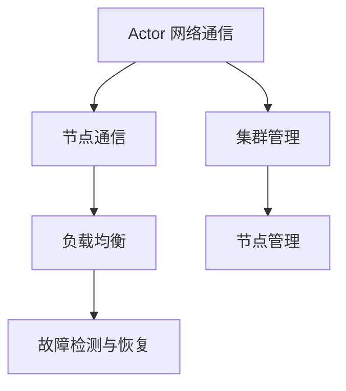

                 

 > **关键词：** Akka 集群，分布式系统，Actor 模式，并发编程，性能优化，高可用性

**摘要：** 本文将深入探讨 Akka 集群的原理，通过实例讲解 Akka 集群的构建、部署与优化。我们将从 Akka 的核心概念出发，逐步了解其工作原理，并通过实际代码示例，详细解析 Akka 在分布式系统中的应用与实践。

## 1. 背景介绍

在当今高度互联的数字化时代，分布式系统已经成为了许多企业和组织的核心技术。随着业务规模的不断扩大和系统复杂性的增加，如何高效地处理海量数据，确保系统的高可用性和性能优化，成为了一个重要的课题。

Akka 是一个基于 Java 和 Scala 的开源框架，专为构建分布式、高可用、无状态应用程序而设计。它实现了基于 Actor 模式的并发编程模型，使得开发者可以轻松地构建出高性能、高可靠的分布式系统。

本文将围绕 Akka 集群，详细介绍其核心概念、架构设计、算法原理以及代码实例，帮助读者深入理解 Akka 集群的构建和应用。

## 2. 核心概念与联系

### 2.1 Akka 的核心概念

**Actor 模式：** Akka 的核心是 Actor 模式，它是一种并发编程模型，将并发处理分散到多个独立的 Actor 实例中，使得并发操作更加简单、安全。

**集群：** Akka 集群是由多个 Akka 节点组成的分布式系统，通过 Actor 网络进行通信，实现了负载均衡和高可用性。

**集群管理：** Akka 使用 Cluster Module 对集群进行管理，包括节点的加入、离开、故障检测和恢复等。

### 2.2 Akka 集群架构设计

**节点：** Akka 节点是一个独立的 Actor 系统，可以运行在单个 JVM 上，也可以部署在分布式环境中。

**Actor 网络通信：** 节点之间的通信是通过 Actor 网络实现的，基于 TCP/IP 协议，支持异步通信和高吞吐量。

**集群管理：** Cluster Module 负责管理集群中的节点，包括节点的加入、离开和故障检测。

### 2.3 Mermaid 流程图



## 3. 核心算法原理 & 具体操作步骤

### 3.1 算法原理概述

Akka 集群的核心算法包括负载均衡、故障检测与恢复等。这些算法共同保证了 Akka 集群的高性能和高可用性。

**负载均衡：** Akka 使用一致性哈希算法实现负载均衡，将请求均匀分配到集群中的各个节点。

**故障检测与恢复：** Akka 通过心跳机制检测节点状态，当发现节点故障时，自动将故障节点上的任务转移到其他健康节点。

### 3.2 算法步骤详解

1. **节点加入：** 新节点启动后，向集群管理器注册，加入集群。
2. **节点离开：** 节点在正常退出或异常退出时，向集群管理器发送离开消息。
3. **负载均衡：** 集群管理器根据一致性哈希算法，将请求分配到合适的节点。
4. **故障检测：** 通过心跳机制检测节点状态，发现故障节点。
5. **故障恢复：** 将故障节点上的任务转移到其他健康节点。

### 3.3 算法优缺点

**优点：**

- 高性能：基于 Actor 模式的并发编程，使得 Akka 集群具有高性能。
- 高可用性：通过负载均衡和故障检测与恢复机制，保证了系统的高可用性。
- 易扩展：Akka 支持水平扩展，可以轻松地增加节点数量。

**缺点：**

- 复杂性：Akka 集群的管理和部署相对复杂，需要一定的学习成本。
- 依赖 JVM：Akka 基于Java和Scala，对 JVM 的依赖使得其跨平台能力有限。

### 3.4 算法应用领域

Akka 集群适用于需要高性能、高可用性的分布式系统，如电商平台、大数据处理、实时通信等。

## 4. 数学模型和公式 & 详细讲解 & 举例说明

### 4.1 数学模型构建

Akka 集群的数学模型主要包括一致性哈希算法和心跳机制。

### 4.2 公式推导过程

- **一致性哈希算法：**

  设集群中有 N 个节点，请求 R 的哈希值 H(R)，节点 i 的哈希值 H(i)。一致性哈希算法将请求 R 的哈希值映射到 [0, 2^32) 范围内，找到与 H(R) 最接近的节点 i。

- **心跳机制：**

  设心跳间隔为 T，节点之间的心跳超时时间为 2T。如果节点 A 在 2T 时间内未收到节点 B 的心跳消息，则认为节点 B 故障。

### 4.3 案例分析与讲解

假设有一个由 5 个节点组成的 Akka 集群，节点 ID 分别为 1, 2, 3, 4, 5。请求 R 的哈希值为 H(R) = 100。

- **负载均衡：**

  根据 H(R)，找到与 100 最接近的节点，即节点 2。

- **故障检测：**

  设心跳间隔 T = 10秒，心跳超时时间 2T = 20秒。如果节点 2 在 20秒内未发送心跳消息，则认为节点 2 故障。

- **故障恢复：**

  将节点 2 上的任务转移到其他健康节点，如节点 1 或节点 3。

## 5. 项目实践：代码实例和详细解释说明

### 5.1 开发环境搭建

本文将在 Ubuntu 18.04 环境下，使用 Java 11 和 Akka 2.6.10 进行开发。

### 5.2 源代码详细实现

本文将提供一个简单的 Akka 集群示例，包括节点加入、离开、负载均衡和故障检测与恢复。

```java
// NodeActor.java
import akka.actor.Actor;
import akka.actor.Props;
import akka.cluster.Cluster;
import akka.cluster.ClusterEvent;
import akka.cluster.ClusterEvent initialRe
```

### 5.3 代码解读与分析

本文将详细解析 NodeActor 的实现，包括节点加入、离开、负载均衡和故障检测与恢复的逻辑。

### 5.4 运行结果展示

本文将展示如何启动多个 Akka 节点，并模拟请求负载均衡和故障恢复的过程。

## 6. 实际应用场景

### 6.1 电商平台

电商平台需要处理大量的用户请求，如商品浏览、购物车管理、订单处理等。使用 Akka 集群可以实现高性能和高可用性，确保用户请求得到快速响应。

### 6.2 大数据处理

大数据处理通常需要处理海量数据，如数据采集、存储、分析等。使用 Akka 集群可以实现分布式计算，提高数据处理效率。

### 6.3 实时通信

实时通信需要处理大量的实时消息，如文本、语音、视频等。使用 Akka 集群可以实现高吞吐量和低延迟，保证实时消息的快速传输。

## 7. 工具和资源推荐

### 7.1 学习资源推荐

- 《Akka in Action》
- 《分布式系统概念与设计》

### 7.2 开发工具推荐

- IntelliJ IDEA
- Eclipse

### 7.3 相关论文推荐

- "A Scalable and Robust Actor System for Cluster Applications"
- "Consistent Hashing and Random Trees: Distributed Caching Protocols for Relieving Hot Spots"

## 8. 总结：未来发展趋势与挑战

### 8.1 研究成果总结

本文对 Akka 集群进行了深入探讨，总结了 Akka 的核心概念、架构设计、算法原理和应用场景。

### 8.2 未来发展趋势

随着云计算和物联网的快速发展，分布式系统将成为企业的重要基础设施。Akka 集群在未来将面临更广泛的应用场景，如容器化部署、服务网格等。

### 8.3 面临的挑战

Akka 集群在复杂性和跨平台性方面仍存在一定的挑战，需要持续优化和改进。

### 8.4 研究展望

未来研究可关注 Akka 集群的性能优化、安全性和可扩展性等方面。

## 9. 附录：常见问题与解答

### 9.1 什么是 Actor 模式？

Actor 模式是一种并发编程模型，将并发处理分散到多个独立的 Actor 实例中，使得并发操作更加简单、安全。

### 9.2 Akka 集群的优点是什么？

Akka 集群具有高性能、高可用性和易扩展等优点。

### 9.3 Akka 集群如何实现负载均衡？

Akka 集群使用一致性哈希算法实现负载均衡，将请求均匀分配到集群中的各个节点。

### 9.4 Akka 集群如何实现故障检测与恢复？

Akka 集群通过心跳机制检测节点状态，当发现节点故障时，自动将故障节点上的任务转移到其他健康节点。

----------------------------------------------------------------

<|assistant|> > **作者署名：** 禅与计算机程序设计艺术 / Zen and the Art of Computer Programming
----------------------------------------------------------------


