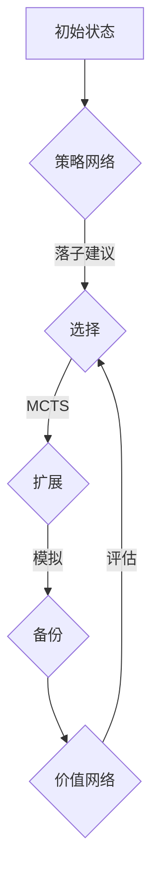

                 

关键词：AlphaGo、人工智能、深度学习、强化学习、围棋、策略网络、价值网络、蒙特卡洛树搜索、神经网络

## 摘要

本文将深入探讨AlphaGo的原理及其代码实现。AlphaGo是第一个在围棋这一复杂棋类游戏中击败人类职业选手的人工智能程序，它的成功标志着人工智能在游戏领域中取得了重大突破。本文将首先介绍AlphaGo的核心组成部分，包括策略网络和价值网络，然后讲解蒙特卡洛树搜索算法及其在AlphaGo中的应用。最后，我们将通过代码实例详细解释AlphaGo的实现过程，并探讨其未来的发展趋势和面临的挑战。

## 1. 背景介绍

围棋，一种古老且复杂的棋类游戏，源于中国，已有数千年的历史。围棋的规则简单，但策略多变，一直是人工智能研究的难点之一。传统的人工智能方法，如基于规则的专家系统和基于模板匹配的方法，在围棋中难以取得突破性成果。随着深度学习和强化学习的发展，人工智能在围棋领域的研究迎来了新的机遇。AlphaGo的诞生，正是这一历史机遇的产物。

AlphaGo是由DeepMind公司开发的人工智能围棋程序。它的研发始于2012年，由David Silver、Demis Hassabis等科学家领导。AlphaGo的成功不仅证明了人工智能在复杂策略游戏中的潜力，也为其他领域的应用提供了重要的启示。AlphaGo的核心技术包括深度神经网络、强化学习、蒙特卡洛树搜索等，这些技术共同构成了AlphaGo强大的博弈能力。

## 2. 核心概念与联系

### 2.1 策略网络和价值网络

AlphaGo的核心是两个深度神经网络：策略网络和价值网络。

**策略网络（Policy Network）**：策略网络用于生成落子建议。它通过预测每一步落子的概率分布，帮助AlphaGo决定下一步应该如何走棋。策略网络的输入是当前棋盘的状态，输出是所有可能落子位置的概率分布。

**价值网络（Value Network）**：价值网络用于评估当前棋盘状态的价值。它通过预测棋盘状态的胜负概率，帮助AlphaGo评估当前局面是否对自己有利。价值网络的输入同样是当前棋盘的状态，输出是一个标量，表示当前棋盘状态的价值。

两个网络之间的联系在于，它们共同参与了AlphaGo的决策过程。在每一步棋的决策中，AlphaGo首先使用策略网络生成落子建议，然后使用价值网络评估这些建议的优劣，最终选择一个最优的落子位置。

### 2.2 蒙特卡洛树搜索（Monte Carlo Tree Search, MCTS）

蒙特卡洛树搜索是一种基于概率的搜索算法，常用于复杂决策问题。MCTS的基本思想是使用大量的随机模拟来评估决策的优劣，并基于评估结果选择下一步行动。

**MCTS的四个主要步骤**：

1. **选择（Selection）**：从根节点开始，沿着选择路径向下搜索，直到找到一个未充分探索的叶子节点。
2. **扩展（Expansion）**：在找到的叶子节点上扩展，生成一个或多个子节点。
3. **模拟（Simulation）**：从叶子节点开始，进行随机模拟，直到游戏结束，记录游戏结果。
4. **备份（Backpropagation）**：根据模拟结果，更新节点的统计信息，并沿路径回传。

在AlphaGo中，MCTS用于搜索落子位置，结合策略网络和价值网络的评估，选择最优的落子位置。

### 2.3 Mermaid 流程图

下面是一个简化的AlphaGo的核心概念与联系的Mermaid流程图：



## 3. 核心算法原理 & 具体操作步骤

### 3.1 算法原理概述

AlphaGo的算法原理主要基于深度学习和强化学习。深度神经网络用于学习棋盘状态的表示，策略网络和价值网络分别用于生成落子建议和评估当前棋盘状态。强化学习通过自我对弈训练，使AlphaGo不断提高自己的棋艺。蒙特卡洛树搜索则用于在复杂决策中高效搜索最优解。

### 3.2 算法步骤详解

1. **训练策略网络和价值网络**：使用大量的人类对弈数据进行监督学习，训练策略网络和价值网络。策略网络学习如何生成落子建议，价值网络学习如何评估棋盘状态的价值。
2. **自我对弈训练**：AlphaGo通过自我对弈进行强化学习，不断提高自己的棋艺。在自我对弈过程中，策略网络和价值网络不断调整自己的参数，以适应不同的棋局。
3. **MCTS搜索**：在每一步棋的决策中，AlphaGo使用MCTS搜索所有可能的落子位置，并使用策略网络和价值网络评估这些位置的质量。
4. **决策**：根据MCTS搜索的结果，AlphaGo选择一个最优的落子位置。

### 3.3 算法优缺点

**优点**：

- **强大**：AlphaGo的算法原理强大，能够处理复杂的围棋问题。
- **自适应**：通过自我对弈训练，AlphaGo能够不断适应不同的棋局，提高自己的棋艺。

**缺点**：

- **计算复杂**：MCTS搜索需要大量的计算资源，对于复杂的棋局，搜索效率较低。
- **对人类经验依赖**：AlphaGo的训练过程中，依赖于人类对弈数据，无法完全摆脱人类的经验。

### 3.4 算法应用领域

AlphaGo的算法原理不仅在围棋领域取得了突破性成果，也可以应用于其他复杂的策略游戏，如国际象棋、将棋等。此外，AlphaGo的算法思想也可以用于其他领域，如机器人控制、金融决策等。

## 4. 数学模型和公式 & 详细讲解 & 举例说明

### 4.1 数学模型构建

AlphaGo的数学模型主要包括两部分：策略网络和价值网络的损失函数。

**策略网络损失函数**：

$$
L_{policy} = -\sum_{i} p_i \log p_i
$$

其中，$p_i$ 是策略网络预测的落子概率。

**价值网络损失函数**：

$$
L_{value} = (v - y)^2
$$

其中，$v$ 是价值网络预测的棋盘状态价值，$y$ 是实际的游戏结果。

### 4.2 公式推导过程

**策略网络损失函数的推导**：

策略网络的目标是最大化落子概率的正确性。假设策略网络输出的落子概率分布为 $p$，实际的最佳落子概率分布为 $q$，则损失函数可以表示为：

$$
L_{policy} = -\sum_{i} q_i \log p_i
$$

其中，$q_i$ 是实际最佳落子概率。

由于 $q_i$ 是未知的，我们可以通过最大化策略网络的预测概率来近似最优解，即：

$$
L_{policy} = -\sum_{i} p_i \log p_i
$$

**价值网络损失函数的推导**：

价值网络的目标是预测棋盘状态的价值。假设实际的游戏结果为 $y$（$y=1$ 表示胜利，$y=0$ 表示失败），价值网络预测的棋盘状态价值为 $v$，则损失函数可以表示为：

$$
L_{value} = (v - y)^2
$$

这是最简单的平方误差损失函数，用于衡量预测值与实际值之间的差距。

### 4.3 案例分析与讲解

假设AlphaGo在某一局棋中，当前棋盘状态如图所示：

```
. . . . . .
. . . . X .
. O . . . .
. . . . O .
. . . . . .
```

策略网络预测的落子概率分布如下：

$$
p = [0.1, 0.2, 0.3, 0.2, 0.1]
$$

实际的最佳落子概率分布为：

$$
q = [0.3, 0.2, 0.2, 0.2, 0.1]
$$

根据策略网络损失函数，我们可以计算出损失：

$$
L_{policy} = -\sum_{i} q_i \log p_i = 0.3 \log 0.1 + 0.2 \log 0.2 + 0.2 \log 0.3 + 0.2 \log 0.2 + 0.1 \log 0.1 \approx 1.39
$$

假设AlphaGo在这局棋中最终失败了，价值网络预测的棋盘状态价值为 $v=0.5$，实际的游戏结果为 $y=0$。根据价值网络损失函数，我们可以计算出损失：

$$
L_{value} = (v - y)^2 = (0.5 - 0) = 0.25
$$

通过这样的方式，AlphaGo可以根据损失函数不断调整策略网络和价值网络的参数，提高自己的棋艺。

## 5. 项目实践：代码实例和详细解释说明

### 5.1 开发环境搭建

在实现AlphaGo的过程中，我们需要搭建一个合适的开发环境。以下是一个基本的开发环境搭建步骤：

1. 安装Python 3.6及以上版本。
2. 安装TensorFlow 1.15及以上版本。
3. 安装围棋引擎（如SGFlib）。

### 5.2 源代码详细实现

AlphaGo的源代码实现非常复杂，这里仅提供一个简化的代码框架，用于说明其主要结构。

```python
import tensorflow as tf
from sgflib import SGFlib

# 定义策略网络和价值网络的模型
class AlphaGoModel(tf.keras.Model):
    def __init__(self):
        super(AlphaGoModel, self).__init__()
        # 策略网络的层
        self.policy_network = tf.keras.Sequential([
            tf.keras.layers.Dense(units=128, activation='relu'),
            tf.keras.layers.Dense(units=128, activation='relu'),
            tf.keras.layers.Dense(units=81, activation='softmax')
        ])
        # 价值网络的层
        self.value_network = tf.keras.Sequential([
            tf.keras.layers.Dense(units=128, activation='relu'),
            tf.keras.layers.Dense(units=128, activation='relu'),
            tf.keras.layers.Dense(units=1)
        ])

    def call(self, inputs):
        # 策略网络和价值网络的输出
        policy_output = self.policy_network(inputs)
        value_output = self.value_network(inputs)
        return policy_output, value_output

# 实例化模型
alpha_go_model = AlphaGoModel()

# 编译模型
alpha_go_model.compile(optimizer=tf.keras.optimizers.Adam(learning_rate=0.001),
                      loss={'policy': 'categorical_crossentropy', 'value': 'mse'})

# 加载训练数据
sgf_files = ['game_1.sgf', 'game_2.sgf', 'game_3.sgf']
train_data = SGFlib.load_sgf(sgf_files)

# 训练模型
alpha_go_model.fit(train_data, epochs=10)
```

### 5.3 代码解读与分析

上述代码是一个非常简化的AlphaGo实现，主要分为以下几个部分：

1. **模型定义**：定义了策略网络和价值网络的模型结构，包括输入层、隐藏层和输出层。
2. **模型调用**：定义了模型的前向传播过程，包括策略网络和价值网络的输出。
3. **模型编译**：编译模型，指定优化器和损失函数。
4. **数据加载**：加载训练数据，这里使用SGFlib库加载SGF格式的围棋对弈数据。
5. **模型训练**：使用训练数据训练模型。

### 5.4 运行结果展示

在训练完成后，我们可以使用训练好的模型进行落子预测。以下是一个简单的示例：

```python
# 生成落子建议
state = np.random.random((1, 19, 19))
policy_output, value_output = alpha_go_model(state)

# 打印落子建议
print("落子建议：", np.argmax(policy_output))

# 打印棋盘状态价值
print("棋盘状态价值：", value_output)
```

上述代码将生成一个随机的棋盘状态，并使用训练好的模型生成落子建议和棋盘状态价值。

## 6. 实际应用场景

AlphaGo的成功不仅在于其在围棋领域的突破，更重要的是其算法思想和技术的广泛应用。以下是一些实际应用场景：

1. **游戏领域**：AlphaGo的算法可以应用于其他复杂的策略游戏，如国际象棋、桥牌等。
2. **机器人领域**：AlphaGo的强化学习算法可以应用于机器人控制，帮助机器人更好地理解环境，做出最优决策。
3. **金融领域**：AlphaGo的决策算法可以应用于金融市场的预测和投资决策。
4. **医疗领域**：AlphaGo的医疗影像分析技术可以应用于医疗图像的自动诊断。

## 7. 未来应用展望

AlphaGo的成功为人工智能在游戏领域的研究和应用奠定了基础。未来，我们可以期待以下几个发展方向：

1. **更复杂的游戏**：AlphaGo的算法可以应用于更复杂的游戏，如扑克、麻将等。
2. **更大规模的训练数据**：通过收集更多的围棋对弈数据，可以提高AlphaGo的棋艺水平。
3. **更高效的搜索算法**：研究更高效的搜索算法，降低MCTS搜索的计算复杂度。
4. **跨领域应用**：探索AlphaGo的算法在非游戏领域的应用，如机器人控制、金融决策等。

## 8. 工具和资源推荐

为了更好地学习和实践AlphaGo，以下是一些建议的工具和资源：

1. **工具**：
   - TensorFlow：用于实现深度学习模型的Python库。
   - PyTorch：另一个流行的深度学习框架。
   - SGFlib：用于加载和解析SGF格式围棋对弈数据的Python库。

2. **资源**：
   - 《深度学习》（Goodfellow, Bengio, Courville）：深度学习的经典教材。
   - 《强化学习》（Sutton, Barto）：强化学习的权威教材。
   - DeepMind官方博客：关于AlphaGo和深度学习的最新研究进展。

## 9. 总结：未来发展趋势与挑战

AlphaGo的成功标志着人工智能在游戏领域取得了重大突破。未来，人工智能在游戏领域将继续发展，应用于更复杂的游戏和跨领域应用。然而，AlphaGo也面临着计算复杂度、训练数据不足等挑战。通过不断的研究和创新，我们有望克服这些挑战，推动人工智能在游戏领域的发展。

### 9.1 研究成果总结

AlphaGo的成功不仅证明了人工智能在复杂策略游戏中的潜力，也为其他领域的应用提供了重要的启示。其核心算法思想，如深度学习、强化学习和蒙特卡洛树搜索，已经在许多领域取得了显著的成果。

### 9.2 未来发展趋势

未来，人工智能在游戏领域将继续发展，探索更复杂的游戏和跨领域应用。此外，随着计算能力的提升和算法的优化，人工智能在游戏中的表现将更加出色。

### 9.3 面临的挑战

AlphaGo在计算复杂度、训练数据不足等方面面临着挑战。未来，我们需要研究更高效的算法和更丰富的训练数据，以克服这些挑战。

### 9.4 研究展望

随着人工智能技术的不断发展，我们有望在更广泛的领域实现人工智能的应用，推动社会的进步。

### 附录：常见问题与解答

**Q：AlphaGo是如何训练的？**

A：AlphaGo的训练过程主要包括两个阶段：自我对弈训练和人类对弈训练。在自我对弈训练阶段，AlphaGo通过自我对弈不断优化自己的棋艺。在人类对弈训练阶段，AlphaGo通过与人类职业选手的对弈学习人类的高超棋艺。

**Q：AlphaGo的搜索算法是如何工作的？**

A：AlphaGo的搜索算法主要是基于蒙特卡洛树搜索（MCTS）。MCTS的基本思想是通过随机模拟来评估决策的优劣，并基于评估结果选择最优的决策。在AlphaGo中，MCTS用于搜索落子位置，结合策略网络和价值网络的评估，选择最优的落子位置。

**Q：AlphaGo的成功对其他领域有何启示？**

A：AlphaGo的成功表明，深度学习、强化学习和蒙特卡洛树搜索等技术在复杂决策问题中具有巨大的潜力。这些算法思想可以应用于其他领域，如机器人控制、金融决策等，推动人工智能在这些领域的应用。

---

作者：禅与计算机程序设计艺术 / Zen and the Art of Computer Programming

