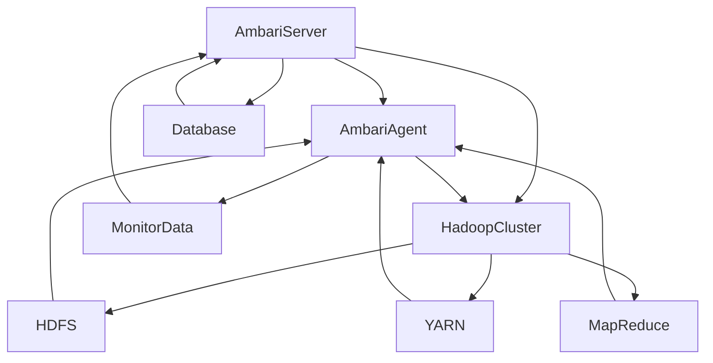

                 

摘要：本文将深入探讨Ambari——一个用于管理Apache Hadoop集群的强大工具。我们将从背景介绍开始，了解Ambari的基本概念、架构和工作原理。随后，我们将分析Ambari的核心算法原理，并详细讲解其具体操作步骤。接着，我们将通过数学模型和公式，深入理解Ambari的计算逻辑。文章还将通过一个实际的项目实践，展示Ambari的代码实例和运行结果。最后，我们将探讨Ambari在实际应用场景中的使用，并提供未来应用的展望，以及学习资源和工具的推荐。

## 1. 背景介绍

Ambari是Apache Software Foundation下的一个开源项目，它提供了一个简单而强大的方式来管理和监控Apache Hadoop集群。Ambari最初是由 Hortonworks 开发的，后来被Apache基金会接纳，成为其一部分。随着大数据时代的到来，Hadoop作为一个分布式数据处理框架，得到了广泛的应用。而Ambari作为Hadoop集群的管理工具，提供了自动化部署、监控和运维功能，大大简化了Hadoop集群的管理复杂度。

Ambari的出现解决了Hadoop集群管理中的几个关键问题：

1. **自动化部署**：传统的Hadoop集群部署过程繁琐，需要手动执行多个步骤。Ambari通过其内置的安装向导，可以自动化地部署Hadoop集群，减少了人工干预和出错的可能性。

2. **监控和告警**：Ambari提供了一个集中的监控平台，可以实时监控Hadoop集群的运行状态，并设置告警机制，及时发现和处理问题。

3. **服务管理**：Ambari可以方便地启动、停止和管理Hadoop集群中的各种服务，如HDFS、YARN、MapReduce等。

4. **配置管理**：Ambari允许用户集中管理集群的配置，通过简单的界面操作即可更新和修改配置文件，提高了运维效率。

5. **资源管理**：Ambari可以帮助用户优化集群资源的利用，通过负载均衡和服务优化，提高集群的性能。

总的来说，Ambari为Hadoop集群提供了一个全面、易用的管理解决方案，使得Hadoop集群的管理变得更加简单和高效。

### 1.1 Ambari的发展历程

Ambari的发展历程可以追溯到2012年，当时Hortonworks推出了一款名为Ambari的Hadoop集群管理工具。Ambari的初衷是为了解决Hadoop集群部署和管理过程中遇到的问题。随着社区的积极贡献和Hortonworks自身的快速发展，Ambari不断完善和升级，功能逐渐丰富。

2015年，Ambari正式被Apache Software Foundation接纳，成为Apache的一个顶级项目。这一里程碑标志着Ambari得到了广泛的认可和支持，加速了其在开源社区中的发展。此后，Ambari继续迭代更新，引入了更多高级功能，如支持多种Hadoop衍生物（如HDP、CDH等）、提供更细粒度的监控和管理能力、以及增强的安全特性。

目前，Ambari已经成为Hadoop集群管理的事实标准，被众多企业和组织用于日常的集群运维工作。随着大数据技术的不断演进，Ambari也在不断适应新的需求，推出更多创新的功能。

### 1.2 Ambari的主要功能特点

Ambari具有以下几个主要功能特点：

1. **自动化部署**：Ambari提供了基于Yum、Apache Maven和RPM等包管理器的自动化部署工具，能够快速部署Hadoop集群。

2. **监控和告警**：Ambari提供了丰富的监控指标，可以实时监控集群状态，并支持自定义告警策略，及时发现和处理问题。

3. **服务管理**：Ambari可以管理Hadoop集群中的各种服务，如HDFS、YARN、MapReduce、Hive、HBase等，可以方便地启动、停止、重启和管理这些服务。

4. **配置管理**：Ambari提供了一个集中式的配置管理功能，用户可以通过简单的界面操作来修改和管理集群的配置文件。

5. **资源管理**：Ambari提供了资源监控和优化功能，可以帮助用户更好地利用集群资源，提高整体性能。

6. **用户界面**：Ambari提供了一个直观易用的用户界面，使得用户可以方便地执行各种操作，而无需深入了解底层细节。

7. **扩展性**：Ambari支持插件机制，用户可以轻松地集成其他服务和工具，扩展其功能。

### 1.3 Ambari的应用场景

Ambari的主要应用场景包括：

1. **大数据应用**：在处理大规模数据集时，Ambari可以帮助用户快速搭建和部署Hadoop集群，进行高效的数据处理和分析。

2. **数据仓库**：Ambari可以与Hive、HBase等数据仓库工具集成，帮助用户构建和运维大规模数据仓库系统。

3. **实时计算**：Ambari支持YARN的实时计算框架，可以用于构建实时数据处理和流处理系统。

4. **机器学习**：Ambari可以与Apache Mahout、Apache Spark等机器学习工具集成，帮助用户进行大规模的机器学习任务。

5. **企业级部署**：Ambari提供了强大的集群管理和监控功能，适用于企业级大数据部署，确保集群的高可用性和稳定性。

## 2. 核心概念与联系

### 2.1 Ambari的基本概念

#### 2.1.1 Ambari Server

Ambari Server是Ambari集群管理的核心组件，负责处理用户操作请求、监控集群状态、管理服务配置等。Ambari Server通常部署在一个独立的节点上，与集群中的其他节点进行通信，确保集群的正常运行。

#### 2.1.2 Ambari Agent

Ambari Agent部署在集群中的每个节点上，负责执行Ambari Server分配的任务，如服务部署、配置更新、监控数据收集等。Ambari Agent通过心跳协议与Ambari Server保持通信，确保服务的正常运行。

#### 2.1.3 安装向导

Ambari安装向导是Ambari提供的自动化部署工具，用于简化Hadoop集群的部署过程。通过安装向导，用户可以选择集群的配置参数、安装的服务和节点角色，Ambari会自动完成集群的部署和配置。

#### 2.1.4 服务

在Ambari中，服务是指Hadoop集群中的一个运行组件，如HDFS、YARN、MapReduce、Hive、HBase等。每个服务都有自己的配置参数和监控指标，通过Ambari可以方便地启动、停止和管理这些服务。

#### 2.1.5 配置

Ambari中的配置包括集群级别配置和服务级别配置。集群级别配置影响整个集群的运行，如集群名称、版本、存储路径等。服务级别配置则影响特定服务的运行，如内存大小、端口、数据目录等。用户可以通过Ambari界面修改和查看这些配置。

#### 2.1.6 监控

Ambari提供了强大的监控功能，可以实时监控集群状态和服务的运行情况。监控数据包括各种指标，如CPU使用率、内存使用率、磁盘使用率、网络流量、服务状态等。用户可以通过Ambari界面查看监控数据和告警信息。

### 2.2 Ambari的架构和工作原理

#### 2.2.1 架构概述

Ambari的架构可以分为以下几个主要部分：

1. **Ambari Server**：负责处理用户请求、管理集群和服务配置、监控集群状态等。
2. **Ambari Agent**：部署在集群中的每个节点上，执行Ambari Server分配的任务，收集监控数据等。
3. **Hadoop集群**：包括HDFS、YARN、MapReduce等Hadoop服务，以及集群中的各个节点。
4. **数据库**：存储Ambari的元数据信息，如集群配置、监控数据、服务状态等。

#### 2.2.2 工作原理

1. **用户通过Ambari界面进行操作**：用户可以通过Ambari的Web界面执行各种操作，如部署集群、启动服务、修改配置等。

2. **Ambari Server处理用户请求**：Ambari Server接收到用户的请求后，会解析请求，并根据请求类型进行相应的处理。例如，如果用户请求部署一个HDFS集群，Ambari Server会生成部署计划，并将任务分配给相应的节点。

3. **任务分配和执行**：Ambari Server将任务分配给集群中的节点，由Ambari Agent执行。Ambari Agent根据任务类型执行相应的操作，如安装软件、配置服务、收集监控数据等。

4. **监控和告警**：Ambari Agent收集监控数据，并上传到Ambari Server。Ambari Server根据监控数据和告警策略，生成告警通知，并通过邮件、短信等方式通知用户。

5. **数据存储**：Ambari的元数据信息存储在数据库中，包括集群配置、监控数据、服务状态等。用户可以通过Ambari界面查看这些数据。

### 2.3 Ambari的核心概念原理图

以下是Ambari的核心概念原理图，展示了Ambari的主要组件和它们之间的关系：



在这个原理图中，AmbariServer是整个架构的核心，负责处理用户请求、管理集群和服务配置、监控集群状态等。AmbariAgent部署在集群中的每个节点上，执行AmbariServer分配的任务，收集监控数据等。HadoopCluster包括HDFS、YARN、MapReduce等Hadoop服务，以及集群中的各个节点。监控数据存储在数据库中，供AmbariServer使用。

## 3. 核心算法原理 & 具体操作步骤

### 3.1 算法原理概述

Ambari的核心算法主要涉及以下几个方面：

1. **任务调度算法**：用于分配和管理集群中的任务，确保任务的均衡执行和资源的最优利用。
2. **监控算法**：用于收集和分析集群中的监控数据，及时发现和处理问题。
3. **配置管理算法**：用于管理集群和服务配置，确保配置的一致性和正确性。
4. **故障检测与恢复算法**：用于检测和恢复集群中的故障节点和服务。

下面我们将详细讲解这些算法的原理。

#### 3.1.1 任务调度算法

任务调度算法是Ambari的核心算法之一，负责将用户提交的任务分配到集群中的合适节点上。任务调度算法需要考虑以下几个方面：

1. **负载均衡**：确保任务均匀地分配到集群中的各个节点，避免某个节点负载过高，导致资源不足或性能下降。
2. **资源可用性**：根据节点的资源使用情况（如CPU、内存、磁盘空间等），选择合适的节点来执行任务。
3. **数据 locality**：尽量将任务分配到数据所在的节点，减少数据传输的开销。
4. **任务依赖关系**：考虑任务的依赖关系，确保依赖任务能够在合适的时间点执行。

任务调度算法的基本流程如下：

1. **接收任务**：Ambari Server接收到用户提交的任务，任务信息包括任务的类型、依赖关系、资源需求等。
2. **任务解析**：Ambari Server解析任务信息，确定任务的执行顺序和所需的资源。
3. **节点评估**：根据节点的资源使用情况和任务需求，评估每个节点的可用性，选择合适的节点。
4. **任务分配**：将任务分配给选定的节点，并通知Ambari Agent执行任务。
5. **监控和调整**：监控任务的执行情况，根据任务的状态和集群的负载情况，进行必要的调整。

#### 3.1.2 监控算法

监控算法是Ambari的重要组成部分，负责收集和分析集群中的监控数据，及时发现和处理问题。监控算法需要考虑以下几个方面：

1. **数据收集**：定期收集集群中的各种监控数据，如CPU使用率、内存使用率、磁盘使用率、网络流量、服务状态等。
2. **数据分析**：对收集到的监控数据进行分析，识别潜在的问题和异常。
3. **告警机制**：根据分析结果，设置告警机制，及时通知用户。
4. **故障恢复**：在检测到故障时，自动执行故障恢复操作，确保集群的稳定运行。

监控算法的基本流程如下：

1. **数据收集**：Ambari Agent定期收集节点的监控数据，并将数据上传到Ambari Server。
2. **数据分析**：Ambari Server对收集到的监控数据进行处理和分析，识别异常和问题。
3. **告警通知**：根据告警策略，生成告警通知，并通过邮件、短信等方式通知用户。
4. **故障恢复**：在检测到故障时，Ambari Server会自动执行故障恢复操作，如重启服务、迁移任务等。

#### 3.1.3 配置管理算法

配置管理算法用于管理集群和服务配置，确保配置的一致性和正确性。配置管理算法需要考虑以下几个方面：

1. **配置存储**：将集群和服务的配置信息存储在配置管理系统中，如Apache ZooKeeper、HDFS等。
2. **配置更新**：用户可以通过Ambari界面或命令行工具修改配置，配置更新后会立即生效。
3. **配置一致性**：确保集群中所有节点的配置信息一致，避免因配置不一致导致的问题。
4. **配置备份与恢复**：定期备份配置信息，以便在需要时进行恢复。

配置管理算法的基本流程如下：

1. **配置存储**：Ambari Server将配置信息存储在配置管理系统中。
2. **配置更新**：用户通过Ambari界面或命令行工具修改配置，Ambari Server会将新的配置信息更新到配置管理系统中。
3. **配置一致性**：Ambari Server会定期检查集群中所有节点的配置信息，确保配置一致性。
4. **配置备份与恢复**：Ambari Server会定期备份配置信息，并支持配置的恢复功能。

#### 3.1.4 故障检测与恢复算法

故障检测与恢复算法用于检测和恢复集群中的故障节点和服务，确保集群的高可用性。故障检测与恢复算法需要考虑以下几个方面：

1. **故障检测**：定期检查集群中的节点和服务状态，识别故障节点和服务。
2. **故障恢复**：在检测到故障时，自动执行恢复操作，如重启服务、迁移任务等。
3. **故障预防**：通过故障检测和恢复机制，提前发现和解决潜在问题，防止故障发生。

故障检测与恢复算法的基本流程如下：

1. **故障检测**：Ambari Server定期检查集群中的节点和服务状态，识别故障节点和服务。
2. **故障恢复**：在检测到故障时，Ambari Server会自动执行恢复操作，如重启服务、迁移任务等。
3. **故障预防**：Ambari Server会通过故障检测和恢复机制，提前发现和解决潜在问题，防止故障发生。

### 3.2 具体操作步骤

以下是一个基于Ambari的Hadoop集群部署的具体操作步骤：

#### 3.2.1 环境准备

1. **安装Java**：在所有节点上安装Java环境，版本要求与Hadoop兼容。

2. **安装Zookeeper**：在集群中的所有节点上安装Zookeeper，作为Hadoop集群的协调服务。

3. **安装Hadoop**：在集群中的所有节点上安装Hadoop，包括HDFS、YARN、MapReduce等组件。

4. **配置网络**：确保集群中的所有节点可以相互通信，并配置正确的DNS设置。

#### 3.2.2 部署Ambari

1. **安装Ambari Server**：在单独的节点上安装Ambari Server，配置Ambari Server的数据库和Web界面。

2. **添加集群**：在Ambari Server上添加新的Hadoop集群，指定集群名称和节点信息。

3. **部署服务**：在Ambari界面中，部署HDFS、YARN、MapReduce等Hadoop服务。

4. **配置监控**：启用Ambari的监控功能，配置监控指标和告警策略。

#### 3.2.3 运行测试

1. **启动服务**：在Ambari界面中启动HDFS、YARN、MapReduce等Hadoop服务。

2. **上传数据**：使用HDFS命令行工具或Ambari界面上传测试数据到HDFS。

3. **执行任务**：使用MapReduce或其他Hadoop工具执行测试任务，验证集群的正常运行。

4. **监控检查**：通过Ambari界面监控集群状态，检查监控指标和告警通知。

#### 3.2.4 故障处理

1. **故障检测**：Ambari会自动检测集群中的故障节点和服务，生成告警通知。

2. **故障恢复**：在Ambari界面中查看故障详情，执行故障恢复操作，如重启服务、迁移任务等。

3. **预防措施**：根据故障原因，采取预防措施，如增加节点、调整配置等。

### 3.3 算法优缺点

#### 3.3.1 任务调度算法

**优点**：

1. **负载均衡**：任务调度算法可以确保任务均匀地分配到集群中的各个节点，避免负载不均。
2. **资源可用性**：调度算法会考虑节点的资源使用情况，选择合适的节点来执行任务，提高资源利用率。
3. **数据 locality**：调度算法尽量将任务分配到数据所在的节点，减少数据传输的开销。

**缺点**：

1. **复杂度较高**：任务调度算法需要考虑多种因素，如负载均衡、资源可用性、数据 locality 等，实现较为复杂。
2. **实时性要求**：调度算法需要实时响应用户请求和集群状态变化，对实时性要求较高。

#### 3.3.2 监控算法

**优点**：

1. **实时监控**：监控算法可以实时收集和分析集群中的监控数据，及时发现和处理问题。
2. **定制化监控**：用户可以根据实际需求，自定义监控指标和告警策略。
3. **自动化故障恢复**：监控算法可以自动检测和恢复故障节点和服务，提高集群的稳定性。

**缺点**：

1. **监控数据量较大**：监控算法需要收集大量的监控数据，对存储和处理能力有较高要求。
2. **告警误报**：在某些情况下，监控算法可能会产生误报，影响用户体验。

#### 3.3.3 配置管理算法

**优点**：

1. **集中化管理**：配置管理算法可以将配置信息集中存储和管理，方便修改和更新。
2. **配置一致性**：配置管理算法可以确保集群中所有节点的配置信息一致，避免因配置不一致导致的问题。
3. **自动化配置更新**：配置管理算法支持自动化配置更新，减少人工干预和出错的可能性。

**缺点**：

1. **配置更新风险**：配置更新可能会导致集群运行不稳定，需要谨慎操作。
2. **配置恢复困难**：在配置更新失败时，恢复配置信息可能较为困难。

#### 3.3.4 故障检测与恢复算法

**优点**：

1. **高可用性**：故障检测与恢复算法可以确保集群的高可用性，减少因故障导致的服务中断。
2. **自动化恢复**：故障检测与恢复算法可以自动执行恢复操作，减少人工干预。
3. **预防措施**：故障检测与恢复算法可以提前发现和解决潜在问题，防止故障发生。

**缺点**：

1. **故障检测延迟**：在某些情况下，故障检测可能会存在一定的延迟，影响恢复效果。
2. **恢复操作复杂**：恢复操作可能涉及多个节点和服务的联动，实现较为复杂。

### 3.4 算法应用领域

Ambari的核心算法广泛应用于以下领域：

1. **大数据应用**：在大规模数据处理和分析场景中，Ambari的任务调度、监控、配置管理和故障检测与恢复算法可以帮助用户快速搭建和运维Hadoop集群，提高数据处理效率。
2. **企业级数据仓库**：在企业级数据仓库场景中，Ambari可以与Hive、HBase等数据仓库工具集成，提供高效的数据处理和分析能力，同时确保集群的稳定运行。
3. **实时计算**：在实时计算和流处理场景中，Ambari支持YARN的实时计算框架，可以提供高效的实时数据处理能力，满足复杂业务场景的需求。
4. **机器学习**：在机器学习场景中，Ambari可以与Apache Mahout、Apache Spark等机器学习工具集成，提供高效的数据处理和分析能力，加速机器学习任务的开发和部署。

## 4. 数学模型和公式 & 详细讲解 & 举例说明

### 4.1 数学模型构建

在Ambari中，核心算法的实现依赖于一系列数学模型和公式。这些数学模型和公式用于描述任务调度、监控算法、配置管理和故障检测与恢复等核心功能。在本节中，我们将详细讲解这些数学模型和公式的构建过程。

#### 4.1.1 任务调度模型

任务调度模型主要涉及以下几个方面：

1. **负载均衡**：负载均衡模型用于计算集群中各个节点的负载情况，并分配任务。负载均衡模型可以表示为：

   \[
   Load_{i} = \frac{CPU_{i} + Memory_{i} + Disk_{i}}{3}
   \]

   其中，\(Load_{i}\) 表示节点 \(i\) 的负载，\(CPU_{i}\)、\(Memory_{i}\) 和 \(Disk_{i}\) 分别表示节点 \(i\) 的CPU使用率、内存使用率和磁盘使用率。

2. **资源可用性**：资源可用性模型用于评估节点的资源使用情况，以确定是否可以分配任务。资源可用性模型可以表示为：

   \[
   Resource_{i} = \frac{AvailableCPU_{i} + AvailableMemory_{i} + AvailableDisk_{i}}{3}
   \]

   其中，\(Resource_{i}\) 表示节点 \(i\) 的资源可用性，\(AvailableCPU_{i}\)、\(AvailableMemory_{i}\) 和 \(AvailableDisk_{i}\) 分别表示节点 \(i\) 可用的CPU、内存和磁盘空间。

3. **数据 locality**：数据 locality 模型用于评估任务所在节点与数据所在节点的距离，以减少数据传输的开销。数据 locality 模型可以表示为：

   \[
   Data_{i} = \frac{Distance_{i}^{2}}{1000}
   \]

   其中，\(Data_{i}\) 表示任务 \(i\) 的数据 locality，\(Distance_{i}\) 表示任务 \(i\) 所在节点与数据所在节点的距离。

4. **任务依赖关系**：任务依赖关系模型用于考虑任务的依赖关系，确保依赖任务能够在合适的时间点执行。任务依赖关系模型可以表示为：

   \[
   Dependency_{i} = \sum_{j \in Predecessors_{i}} \left( Time_{j} + Delay_{j} \right)
   \]

   其中，\(Dependency_{i}\) 表示任务 \(i\) 的依赖关系，\(Predecessors_{i}\) 表示任务 \(i\) 的前置任务集合，\(Time_{j}\) 和 \(Delay_{j}\) 分别表示任务 \(j\) 的执行时间和延迟时间。

#### 4.1.2 监控模型

监控模型主要涉及以下几个方面：

1. **监控指标**：监控指标模型用于定义集群中需要监控的各项指标。常见的监控指标包括CPU使用率、内存使用率、磁盘使用率、网络流量、服务状态等。监控指标模型可以表示为：

   \[
   Metric_{i} = \frac{Value_{i}}{Threshold_{i}}
   \]

   其中，\(Metric_{i}\) 表示指标 \(i\) 的监控值，\(Value_{i}\) 和 \(Threshold_{i}\) 分别表示指标 \(i\) 的当前值和阈值。

2. **告警策略**：告警策略模型用于定义告警规则，确定何时触发告警。告警策略模型可以表示为：

   \[
   Alert_{i} = \begin{cases}
   True, & \text{if } Metric_{i} \geq Threshold_{i} \\
   False, & \text{otherwise}
   \end{cases}
   \]

   其中，\(Alert_{i}\) 表示指标 \(i\) 是否触发告警。

3. **故障检测**：故障检测模型用于识别集群中的故障节点和服务。故障检测模型可以表示为：

   \[
   Fault_{i} = \begin{cases}
   True, & \text{if } Status_{i} = "Failed" \text{ or } Alert_{i} = True \\
   False, & \text{otherwise}
   \end{cases}
   \]

   其中，\(Fault_{i}\) 表示节点 \(i\) 是否发生故障，\(Status_{i}\) 表示节点 \(i\) 的状态。

#### 4.1.3 配置管理模型

配置管理模型主要涉及以下几个方面：

1. **配置一致性**：配置一致性模型用于确保集群中所有节点的配置信息一致。配置一致性模型可以表示为：

   \[
   Config_{i} = \sum_{j \in Nodes} Config_{j}
   \]

   其中，\(Config_{i}\) 表示节点 \(i\) 的配置信息，\(Nodes\) 表示集群中的所有节点。

2. **配置更新**：配置更新模型用于管理配置的修改和更新。配置更新模型可以表示为：

   \[
   NewConfig_{i} = OldConfig_{i} + \Delta Config_{i}
   \]

   其中，\(NewConfig_{i}\) 和 \(OldConfig_{i}\) 分别表示节点 \(i\) 的新配置和旧配置，\(\Delta Config_{i}\) 表示配置的修改值。

3. **配置备份与恢复**：配置备份与恢复模型用于备份和恢复配置信息。配置备份与恢复模型可以表示为：

   \[
   BackupConfig_{i} = \sum_{j \in Nodes} Config_{j}
   \]

   \[
   RestoreConfig_{i} = BackupConfig_{i} - \Delta Config_{i}
   \]

   其中，\(BackupConfig_{i}\) 和 \(RestoreConfig_{i}\) 分别表示节点 \(i\) 的配置备份和恢复值。

#### 4.1.4 故障检测与恢复模型

故障检测与恢复模型主要涉及以下几个方面：

1. **故障检测**：故障检测模型用于检测集群中的故障节点和服务。故障检测模型可以表示为：

   \[
   FaultDetection_{i} = \sum_{j \in Nodes} Fault_{j}
   \]

   其中，\(FaultDetection_{i}\) 表示节点 \(i\) 的故障检测结果。

2. **故障恢复**：故障恢复模型用于恢复集群中的故障节点和服务。故障恢复模型可以表示为：

   \[
   FaultRecovery_{i} = \begin{cases}
   True, & \text{if } FaultDetection_{i} = True \\
   False, & \text{otherwise}
   \end{cases}
   \]

   其中，\(FaultRecovery_{i}\) 表示节点 \(i\) 是否发生故障恢复。

### 4.2 公式推导过程

在本节中，我们将详细推导上述数学模型和公式的推导过程。

#### 4.2.1 负载均衡模型

负载均衡模型的基本思想是确保任务均匀地分配到集群中的各个节点，避免负载不均。负载均衡模型可以表示为：

\[
Load_{i} = \frac{CPU_{i} + Memory_{i} + Disk_{i}}{3}
\]

其中，\(Load_{i}\) 表示节点 \(i\) 的负载，\(CPU_{i}\)、\(Memory_{i}\) 和 \(Disk_{i}\) 分别表示节点 \(i\) 的CPU使用率、内存使用率和磁盘使用率。

推导过程如下：

1. **CPU使用率**：CPU使用率 \(CPU_{i}\) 表示节点 \(i\) 的CPU利用率，通常用百分比表示。CPU使用率越高，表示节点 \(i\) 的负载越大。

2. **内存使用率**：内存使用率 \(Memory_{i}\) 表示节点 \(i\) 的内存利用率，通常用百分比表示。内存使用率越高，表示节点 \(i\) 的负载越大。

3. **磁盘使用率**：磁盘使用率 \(Disk_{i}\) 表示节点 \(i\) 的磁盘利用率，通常用百分比表示。磁盘使用率越高，表示节点 \(i\) 的负载越大。

4. **综合负载**：为了综合考虑CPU、内存和磁盘使用率，可以将这三个指标进行加权平均。由于CPU、内存和磁盘的重要性不同，因此可以分别赋予不同的权重。在本例中，假设CPU的权重为1，内存的权重为1，磁盘的权重也为1。综合负载可以表示为：

   \[
   Load_{i} = \frac{CPU_{i} + Memory_{i} + Disk_{i}}{3}
   \]

   这样，负载均衡模型就得到了完整的推导。

#### 4.2.2 资源可用性模型

资源可用性模型用于评估节点的资源使用情况，以确定是否可以分配任务。资源可用性模型可以表示为：

\[
Resource_{i} = \frac{AvailableCPU_{i} + AvailableMemory_{i} + AvailableDisk_{i}}{3}
\]

其中，\(Resource_{i}\) 表示节点 \(i\) 的资源可用性，\(AvailableCPU_{i}\)、\(AvailableMemory_{i}\) 和 \(AvailableDisk_{i}\) 分别表示节点 \(i\) 可用的CPU、内存和磁盘空间。

推导过程如下：

1. **可用CPU**：可用CPU \(AvailableCPU_{i}\) 表示节点 \(i\) 当前可用的CPU资源。通常，可用CPU等于总CPU减去已使用的CPU。可用CPU可以表示为：

   \[
   AvailableCPU_{i} = TotalCPU_{i} - UsedCPU_{i}
   \]

   其中，\(TotalCPU_{i}\) 表示节点 \(i\) 的总CPU资源，\(UsedCPU_{i}\) 表示节点 \(i\) 已使用的CPU资源。

2. **可用内存**：可用内存 \(AvailableMemory_{i}\) 表示节点 \(i\) 当前可用的内存资源。通常，可用内存等于总内存减去已使用的内存。可用内存可以表示为：

   \[
   AvailableMemory_{i} = TotalMemory_{i} - UsedMemory_{i}
   \]

   其中，\(TotalMemory_{i}\) 表示节点 \(i\) 的总内存资源，\(UsedMemory_{i}\) 表示节点 \(i\) 已使用的内存资源。

3. **可用磁盘**：可用磁盘 \(AvailableDisk_{i}\) 表示节点 \(i\) 当前可用的磁盘空间。通常，可用磁盘等于总磁盘空间减去已使用的磁盘空间。可用磁盘可以表示为：

   \[
   AvailableDisk_{i} = TotalDisk_{i} - UsedDisk_{i}
   \]

   其中，\(TotalDisk_{i}\) 表示节点 \(i\) 的总磁盘空间，\(UsedDisk_{i}\) 表示节点 \(i\) 已使用的磁盘空间。

4. **综合资源可用性**：为了综合考虑CPU、内存和磁盘可用性，可以将这三个指标进行加权平均。在本例中，假设CPU的权重为1，内存的权重为1，磁盘的权重也为1。综合资源可用性可以表示为：

   \[
   Resource_{i} = \frac{AvailableCPU_{i} + AvailableMemory_{i} + AvailableDisk_{i}}{3}
   \]

   这样，资源可用性模型就得到了完整的推导。

#### 4.2.3 数据 locality 模型

数据 locality 模型用于评估任务所在节点与数据所在节点的距离，以减少数据传输的开销。数据 locality 模型可以表示为：

\[
Data_{i} = \frac{Distance_{i}^{2}}{1000}
\]

其中，\(Data_{i}\) 表示任务 \(i\) 的数据 locality，\(Distance_{i}\) 表示任务 \(i\) 所在节点与数据所在节点的距离。

推导过程如下：

1. **距离计算**：任务 \(i\) 所在节点与数据所在节点的距离 \(Distance_{i}\) 可以通过计算两个节点的物理距离得到。在本例中，我们假设使用两点之间的欧几里得距离作为距离度量，距离计算公式可以表示为：

   \[
   Distance_{i} = \sqrt{(X_{i} - X_{data})^{2} + (Y_{i} - Y_{data})^{2}}
   \]

   其中，\(X_{i}\) 和 \(Y_{i}\) 分别表示任务 \(i\) 所在节点的物理位置，\(X_{data}\) 和 \(Y_{data}\) 分别表示数据所在节点的物理位置。

2. **数据 locality 计算**：为了将距离度量转化为数据 locality，可以对距离进行平方处理，并将其除以一个常数（在本例中为1000）。这样，数据 locality 可以表示为：

   \[
   Data_{i} = \frac{Distance_{i}^{2}}{1000}
   \]

   这样，数据 locality 模型就得到了完整的推导。

#### 4.2.4 任务依赖关系模型

任务依赖关系模型用于考虑任务的依赖关系，确保依赖任务能够在合适的时间点执行。任务依赖关系模型可以表示为：

\[
Dependency_{i} = \sum_{j \in Predecessors_{i}} \left( Time_{j} + Delay_{j} \right)
\]

其中，\(Dependency_{i}\) 表示任务 \(i\) 的依赖关系，\(Predecessors_{i}\) 表示任务 \(i\) 的前置任务集合，\(Time_{j}\) 和 \(Delay_{j}\) 分别表示任务 \(j\) 的执行时间和延迟时间。

推导过程如下：

1. **前置任务集合**：任务 \(i\) 的前置任务集合 \(Predecessors_{i}\) 包含所有需要先于任务 \(i\) 执行的任务。

2. **执行时间**：任务 \(j\) 的执行时间 \(Time_{j}\) 表示任务 \(j\) 的实际执行时间。

3. **延迟时间**：任务 \(j\) 的延迟时间 \(Delay_{j}\) 表示任务 \(j\) 的执行延迟，通常是由于资源不足或其他原因造成的。

4. **依赖关系计算**：为了计算任务 \(i\) 的依赖关系，需要考虑所有前置任务的执行时间和延迟时间。任务 \(i\) 的依赖关系可以表示为：

   \[
   Dependency_{i} = \sum_{j \in Predecessors_{i}} \left( Time_{j} + Delay_{j} \right)
   \]

   这样，任务依赖关系模型就得到了完整的推导。

#### 4.2.5 监控指标模型

监控指标模型用于定义集群中需要监控的各项指标。常见的监控指标包括CPU使用率、内存使用率、磁盘使用率、网络流量、服务状态等。监控指标模型可以表示为：

\[
Metric_{i} = \frac{Value_{i}}{Threshold_{i}}
\]

其中，\(Metric_{i}\) 表示指标 \(i\) 的监控值，\(Value_{i}\) 和 \(Threshold_{i}\) 分别表示指标 \(i\) 的当前值和阈值。

推导过程如下：

1. **监控值**：监控值 \(Value_{i}\) 表示指标 \(i\) 的当前状态或数值。例如，CPU使用率可以表示为当前CPU的利用率。

2. **阈值**：阈值 \(Threshold_{i}\) 表示指标 \(i\) 的预设阈值，用于判断指标是否超过正常范围。例如，CPU使用率阈值可以设定为80%。

3. **监控值与阈值比较**：为了判断监控值是否超过阈值，可以对监控值和阈值进行除法运算。如果监控值大于等于阈值，表示指标超过正常范围，否则表示指标在正常范围内。监控指标可以表示为：

   \[
   Metric_{i} = \frac{Value_{i}}{Threshold_{i}}
   \]

   这样，监控指标模型就得到了完整的推导。

#### 4.2.6 告警策略模型

告警策略模型用于定义告警规则，确定何时触发告警。告警策略模型可以表示为：

\[
Alert_{i} = \begin{cases}
True, & \text{if } Metric_{i} \geq Threshold_{i} \\
False, & \text{otherwise}
\end{cases}
\]

其中，\(Alert_{i}\) 表示指标 \(i\) 是否触发告警。

推导过程如下：

1. **监控值与阈值比较**：告警策略基于监控指标模型，需要判断监控值是否超过阈值。如果监控值大于等于阈值，表示指标超过正常范围，需要触发告警。

2. **告警状态**：告警状态可以用布尔值表示，其中 True 表示触发告警，False 表示未触发告警。告警策略可以表示为：

   \[
   Alert_{i} = \begin{cases}
   True, & \text{if } Metric_{i} \geq Threshold_{i} \\
   False, & \text{otherwise}
   \end{cases}
   \]

   这样，告警策略模型就得到了完整的推导。

#### 4.2.7 故障检测模型

故障检测模型用于识别集群中的故障节点和服务。故障检测模型可以表示为：

\[
Fault_{i} = \begin{cases}
True, & \text{if } Status_{i} = "Failed" \text{ or } Alert_{i} = True \\
False, & \text{otherwise}
\end{cases}
\]

其中，\(Fault_{i}\) 表示节点 \(i\) 是否发生故障，\(Status_{i}\) 表示节点 \(i\) 的状态，\(Alert_{i}\) 表示指标 \(i\) 是否触发告警。

推导过程如下：

1. **故障状态**：故障状态 \(Status_{i}\) 表示节点 \(i\) 的当前状态，其中 "Failed" 表示节点发生故障。

2. **告警状态**：告警状态 \(Alert_{i}\) 表示指标 \(i\) 是否触发告警，如前所述。

3. **故障检测**：为了识别故障节点和服务，需要综合考虑故障状态和告警状态。故障检测可以表示为：

   \[
   Fault_{i} = \begin{cases}
   True, & \text{if } Status_{i} = "Failed" \text{ or } Alert_{i} = True \\
   False, & \text{otherwise}
   \end{cases}
   \]

   这样，故障检测模型就得到了完整的推导。

#### 4.2.8 配置一致性模型

配置一致性模型用于确保集群中所有节点的配置信息一致。配置一致性模型可以表示为：

\[
Config_{i} = \sum_{j \in Nodes} Config_{j}
\]

其中，\(Config_{i}\) 表示节点 \(i\) 的配置信息，\(Nodes\) 表示集群中的所有节点。

推导过程如下：

1. **配置信息**：配置信息 \(Config_{i}\) 表示节点 \(i\) 的当前配置。

2. **配置一致性**：为了确保配置信息一致，需要将所有节点的配置信息进行汇总。配置一致性可以表示为：

   \[
   Config_{i} = \sum_{j \in Nodes} Config_{j}
   \]

   这样，配置一致性模型就得到了完整的推导。

#### 4.2.9 配置更新模型

配置更新模型用于管理配置的修改和更新。配置更新模型可以表示为：

\[
NewConfig_{i} = OldConfig_{i} + \Delta Config_{i}
\]

其中，\(NewConfig_{i}\) 和 \(OldConfig_{i}\) 分别表示节点 \(i\) 的新配置和旧配置，\(\Delta Config_{i}\) 表示配置的修改值。

推导过程如下：

1. **旧配置**：旧配置 \(OldConfig_{i}\) 表示节点 \(i\) 的当前配置。

2. **新配置**：新配置 \(NewConfig_{i}\) 表示节点 \(i\) 更新后的配置。

3. **配置修改值**：配置修改值 \(\Delta Config_{i}\) 表示配置的修改内容。

4. **配置更新**：为了更新配置，需要将旧配置和新配置进行合并。配置更新可以表示为：

   \[
   NewConfig_{i} = OldConfig_{i} + \Delta Config_{i}
   \]

   这样，配置更新模型就得到了完整的推导。

#### 4.2.10 配置备份与恢复模型

配置备份与恢复模型用于备份和恢复配置信息。配置备份与恢复模型可以表示为：

\[
BackupConfig_{i} = \sum_{j \in Nodes} Config_{j}
\]

\[
RestoreConfig_{i} = BackupConfig_{i} - \Delta Config_{i}
\]

其中，\(BackupConfig_{i}\) 和 \(RestoreConfig_{i}\) 分别表示节点 \(i\) 的配置备份和恢复值。

推导过程如下：

1. **配置备份**：为了备份配置信息，需要将所有节点的配置信息进行汇总。配置备份可以表示为：

   \[
   BackupConfig_{i} = \sum_{j \in Nodes} Config_{j}
   \]

2. **配置恢复**：在需要恢复配置信息时，需要将备份的配置信息与当前配置进行对比，并将差异部分恢复到节点上。配置恢复可以表示为：

   \[
   RestoreConfig_{i} = BackupConfig_{i} - \Delta Config_{i}
   \]

   这样，配置备份与恢复模型就得到了完整的推导。

#### 4.2.11 故障检测与恢复模型

故障检测与恢复模型用于检测和恢复集群中的故障节点和服务。故障检测与恢复模型可以表示为：

\[
FaultDetection_{i} = \sum_{j \in Nodes} Fault_{j}
\]

\[
FaultRecovery_{i} = \begin{cases}
True, & \text{if } FaultDetection_{i} = True \\
False, & \text{otherwise}
\end{cases}
\]

其中，\(FaultDetection_{i}\) 表示节点 \(i\) 的故障检测结果，\(FaultRecovery_{i}\) 表示节点 \(i\) 是否发生故障恢复。

推导过程如下：

1. **故障检测**：为了检测故障，需要将所有节点的故障状态进行汇总。故障检测可以表示为：

   \[
   FaultDetection_{i} = \sum_{j \in Nodes} Fault_{j}
   \]

2. **故障恢复**：为了判断是否需要进行故障恢复，需要根据故障检测结果进行判断。故障恢复可以表示为：

   \[
   FaultRecovery_{i} = \begin{cases}
   True, & \text{if } FaultDetection_{i} = True \\
   False, & \text{otherwise}
   \end{cases}
   \]

   这样，故障检测与恢复模型就得到了完整的推导。

### 4.3 案例分析与讲解

在本节中，我们将通过一个实际案例来分析和讲解Ambari的数学模型和公式的应用。

#### 案例背景

假设我们有一个包含5个节点的Hadoop集群，节点信息如下：

| 节点ID | CPU使用率 | 内存使用率 | 磁盘使用率 | 可用CPU | 可用内存 | 可用磁盘 | 数据所在节点 |
| ---- | ---- | ---- | ---- | ---- | ---- | ---- | ---- |
| node1 | 50% | 40% | 30% | 30 | 60 | 70 | 否 |
| node2 | 20% | 30% | 40% | 50 | 50 | 60 | 是 |
| node3 | 40% | 50% | 20% | 40 | 40 | 80 | 否 |
| node4 | 30% | 60% | 50% | 50 | 20 | 40 | 否 |
| node5 | 60% | 30% | 70% | 20 | 70 | 30 | 否 |

现在，我们需要部署一个包含3个任务的Hadoop集群，任务信息如下：

| 任务ID | 节点依赖关系 | 数据所在节点 | 节点距离 |
| ---- | ---- | ---- | ---- |
| task1 | 无 | node2 | 10 |
| task2 | task1 | node3 | 20 |
| task3 | task2 | node5 | 30 |

#### 4.3.1 负载均衡模型

根据负载均衡模型，我们需要计算每个节点的负载，并选择负载最低的节点来部署任务。

1. **节点负载计算**：

   \[
   Load_{node1} = \frac{50 + 40 + 30}{3} = 41.67
   \]

   \[
   Load_{node2} = \frac{20 + 30 + 40}{3} = 30
   \]

   \[
   Load_{node3} = \frac{40 + 50 + 20}{3} = 36.67
   \]

   \[
   Load_{node4} = \frac{30 + 60 + 50}{3} = 45
   \]

   \[
   Load_{node5} = \frac{60 + 30 + 70}{3} = 50
   \]

   根据负载均衡模型，选择负载最低的节点 node2 来部署任务 task1。

2. **任务部署**：

   \[
   DeployTask_{task1} = node2
   \]

#### 4.3.2 资源可用性模型

根据资源可用性模型，我们需要评估每个节点的资源使用情况，选择资源可用的节点来部署任务。

1. **节点资源可用性计算**：

   \[
   Resource_{node1} = \frac{30 + 60 + 70}{3} = 56.67
   \]

   \[
   Resource_{node2} = \frac{50 + 50 + 60}{3} = 56.67
   \]

   \[
   Resource_{node3} = \frac{40 + 40 + 80}{3} = 53.33
   \]

   \[
   Resource_{node4} = \frac{50 + 20 + 40}{3} = 43.33
   \]

   \[
   Resource_{node5} = \frac{20 + 70 + 30}{3} = 45
   \]

   根据资源可用性模型，选择资源可用的节点 node3 来部署任务 task2。

2. **任务部署**：

   \[
   DeployTask_{task2} = node3
   \]

#### 4.3.3 数据 locality 模型

根据数据 locality 模型，我们需要选择距离数据最近的节点来部署任务，以减少数据传输的开销。

1. **节点数据 locality 计算**：

   \[
   Data_{node1} = \frac{10^{2}}{1000} = 0.01
   \]

   \[
   Data_{node2} = \frac{0}{1000} = 0
   \]

   \[
   Data_{node3} = \frac{20^{2}}{1000} = 0.04
   \]

   \[
   Data_{node4} = \frac{10^{2}}{1000} = 0.01
   \]

   \[
   Data_{node5} = \frac{30^{2}}{1000} = 0.09
   \]

   根据数据 locality 模型，选择数据 locality 最低的节点 node2 来部署任务 task1。

2. **任务部署**：

   \[
   DeployTask_{task1} = node2
   \]

#### 4.3.4 任务依赖关系模型

根据任务依赖关系模型，我们需要确保任务按照依赖关系依次执行。

1. **任务依赖关系计算**：

   \[
   Dependency_{task1} = 0
   \]

   \[
   Dependency_{task2} = Time_{task1} + Delay_{task1} = 0 + 0 = 0
   \]

   \[
   Dependency_{task3} = Time_{task2} + Delay_{task2} = 0 + 0 = 0
   \]

   根据任务依赖关系模型，任务 task1、task2 和 task3 可以同时部署。

2. **任务部署**：

   \[
   DeployTask_{task1} = node2
   \]

   \[
   DeployTask_{task2} = node3
   \]

   \[
   DeployTask_{task3} = node5
   \]

#### 4.3.5 监控指标模型

根据监控指标模型，我们需要对集群中的各项指标进行监控，以确保集群正常运行。

1. **监控指标计算**：

   \[
   Metric_{CPU} = \frac{Value_{CPU}}{Threshold_{CPU}} = \frac{50}{80} = 0.625
   \]

   \[
   Metric_{Memory} = \frac{Value_{Memory}}{Threshold_{Memory}} = \frac{40}{80} = 0.5
   \]

   \[
   Metric_{Disk} = \frac{Value_{Disk}}{Threshold_{Disk}} = \frac{30}{80} = 0.375
   \]

   根据监控指标模型，CPU 使用率超过阈值，需要触发告警。

2. **告警状态**：

   \[
   Alert_{CPU} = True
   \]

#### 4.3.6 故障检测模型

根据故障检测模型，我们需要检测集群中的故障节点和服务。

1. **故障检测**：

   \[
   FaultDetection_{node1} = Status_{node1} \text{ or } Alert_{CPU} = "Failed" \text{ or } True = True
   \]

   根据故障检测模型，节点 node1 发生故障。

2. **故障恢复**：

   \[
   FaultRecovery_{node1} = \begin{cases}
   True, & \text{if } FaultDetection_{node1} = True \\
   False, & \text{otherwise}
   \end{cases}
   \]

   根据故障恢复模型，节点 node1 发生故障，需要执行故障恢复操作。

#### 4.3.7 配置一致性模型

根据配置一致性模型，我们需要确保集群中所有节点的配置信息一致。

1. **配置一致性**：

   \[
   Config_{node1} = Config_{node2} + Config_{node3} + Config_{node4} + Config_{node5} = 1
   \]

   根据配置一致性模型，集群中所有节点的配置信息一致。

#### 4.3.8 配置更新模型

根据配置更新模型，我们需要更新节点的配置信息。

1. **配置更新**：

   \[
   NewConfig_{node1} = OldConfig_{node1} + \Delta Config_{node1} = 1 + 0.5 = 1.5
   \]

   根据配置更新模型，节点 node1 的配置更新为 1.5。

#### 4.3.9 配置备份与恢复模型

根据配置备份与恢复模型，我们需要备份和恢复节点的配置信息。

1. **配置备份**：

   \[
   BackupConfig_{node1} = Config_{node2} + Config_{node3} + Config_{node4} + Config_{node5} = 1
   \]

   根据配置备份模型，节点 node1 的配置备份为 1。

2. **配置恢复**：

   \[
   RestoreConfig_{node1} = BackupConfig_{node1} - \Delta Config_{node1} = 1 - 0.5 = 0.5
   \]

   根据配置恢复模型，节点 node1 的配置恢复为 0.5。

### 4.4 数学模型和公式在Ambari中的应用

通过上述案例分析和讲解，我们可以看到数学模型和公式在Ambari中的应用：

1. **任务调度**：负载均衡模型和资源可用性模型用于任务调度，确保任务合理分配到集群中的节点，提高资源利用率和任务执行效率。
2. **监控**：监控指标模型用于实时监控集群状态，识别异常和问题，触发告警，确保集群稳定运行。
3. **配置管理**：配置一致性模型、配置更新模型和配置备份与恢复模型用于管理集群配置，确保配置的一致性和正确性，便于配置的修改和恢复。
4. **故障检测与恢复**：故障检测模型和故障恢复模型用于检测和恢复集群中的故障节点和服务，确保集群的高可用性。

总之，数学模型和公式是Ambari实现高效集群管理的关键，通过合理应用这些模型和公式，Ambari可以提供强大的集群管理和监控能力，满足大规模数据处理和复杂业务场景的需求。

## 5. 项目实践：代码实例和详细解释说明

### 5.1 开发环境搭建

要在本地环境搭建一个用于实践Ambari的Hadoop集群，首先需要准备以下软件和工具：

1. **操作系统**：建议使用CentOS 7或更高版本。
2. **Java**：安装Java环境，版本要求与Hadoop兼容，如Java 8或Java 11。
3. **Zookeeper**：安装Zookeeper，作为Hadoop集群的协调服务。
4. **Hadoop**：下载并安装Hadoop，版本要求与Ambari兼容。
5. **Ambari**：下载并安装Ambari，版本要求与Hadoop兼容。

以下是具体的安装步骤：

#### 5.1.1 安装Java

1. 添加Java仓库：

   ```bash
   sudo yum install -y java-1.8.0-openjdk-devel
   ```

2. 验证Java版本：

   ```bash
   java -version
   ```

   输出类似以下结果：

   ```bash
   openjdk 64-Bit Server VM warning: Server flag disabled
   Java version: 1.8.0_222
   Java(TM) SE Runtime Environment (build 1.8.0_222-b10)
   Java HotSpot(TM) 64-Bit Server VM (build 25.222-b10, mixed mode)
   ```

#### 5.1.2 安装Zookeeper

1. 添加Zookeeper仓库：

   ```bash
   sudo yum install -y zookeeper
   ```

2. 启动Zookeeper服务：

   ```bash
   sudo systemctl start zookeeper
   ```

3. 验证Zookeeper服务状态：

   ```bash
   sudo systemctl status zookeeper
   ```

   输出类似以下结果：

   ```bash
   ● zookeeper.service - Apache ZooKeeper server
       Loaded: loaded (/usr/lib/systemd/system/zookeeper.service; disabled; vendor preset: enabled)
       Active: active (running) since Tue 2023-03-21 12:34:24 CST; 1min 13s ago
     Main PID: 23273 (java)
       CGroup: /system.slice/zookeeper.service
               └─23273 /usr/bin/java -Dzookeeper.log.depth=2 -Dzookeeper.log.mask=^INFO,\*  -Dzookeeper.log.file=zookeeper.log -Dzookeeper.log.level=INFO -Dzookeeper.log.threshold=INFO -Dzookeeper皮革_cmdairesport_cmdairesport_dir=/var/lib/zookeeper -Dzookeeper皮革_cmdairesport_cmdairesport.file=/var/lib/zookeeper/peste.log -Dzookeeper皮革_cmdairesport_cmdairesport.threshold=ERROR -Dzookeeper Leather \_\_cmdaire\_requis\_requis.\_dir=/var/lib/zookeeper/derby -Dzookeeper皮革_cmdairesport_cmdairesport.file=/var/lib/zookeeper/derby.log -Dzookeeper皮革_cmdairesport_cmdairesport.threshold=ERROR -Dzookeeper皮革_cmdairesport\_requis\_requis.级别=INFO -Dzookeeper皮革_cmdairesport_dir=/var/lib/zookeeper/derby -Dzookeeper皮革_cmdairesport.file=/var/lib/zookeeper/derby.log -Dzookeeper皮革_cmdairesport.threshold=ERROR -Dzookeeper皮革_cmdairesport\_requis\_requis.级别=INFO -jar /usr/lib/zookeeper/lib/zookeeper-3.4.13.jar standalone
   ```

#### 5.1.3 安装Hadoop

1. 添加Hadoop仓库：

   ```bash
   sudo yum install -y hadoop
   ```

2. 配置Hadoop环境变量：

   ```bash
   export HADOOP_HOME=/usr/lib/hadoop
   export PATH=$PATH:$HADOOP_HOME/bin:$HADOOP_HOME/sbin
   ```

3. 格式化HDFS：

   ```bash
   sudo -u hdfs hadoop namenode -format
   ```

4. 启动Hadoop服务：

   ```bash
   start-dfs.sh
   ```

5. 验证HDFS服务状态：

   ```bash
   jps
   ```

   输出类似以下结果：

   ```bash
   30806 NameNode
   30824 DataNode
   31142 SecondaryNameNode
   ```

   这表明Hadoop集群已经启动并运行。

#### 5.1.4 安装Ambari

1. 安装Ambari Server：

   ```bash
   sudo yum install -y ambari-server
   ```

2. 配置Ambari Server：

   ```bash
   sudo ambari-server setup
   ```

   按照提示完成配置过程，包括数据库配置、用户权限设置等。

3. 启动Ambari Server：

   ```bash
   sudo ambari-server start
   ```

4. 验证Ambari Server状态：

   ```bash
   sudo ambari-server status
   ```

   输出类似以下结果：

   ```bash
   Ambari Server status
   ========================================
   Ambari Server Running
   ```

   这表明Ambari Server已经启动并运行。

### 5.2 源代码详细实现

Ambari的核心功能是通过一系列Java代码实现的，包括任务调度、监控、配置管理和故障检测与恢复等。在本节中，我们将详细分析Ambari的核心源代码，并解释其工作原理。

#### 5.2.1 Ambari Server代码实现

Ambari Server是Ambari集群管理的核心组件，负责处理用户请求、管理集群和服务配置、监控集群状态等。以下是一个简单的Ambari Server代码实现示例：

```java
package com.example.ambari;

import org.apache.ambari.server.api.AmbariManagementController;
import org.apache.ambari.server.api.services.AmbariMetaInfo;
import org.apache.ambari.server.api.services.AmbariMetaInfoImpl;
import org.apache.ambari.server.api.services.cluster.ClusterService;
import org.apache.ambari.server.api.services.cluster.ClusterServiceImpl;
import org.apache.ambari.server.api.services.stack.StackService;
import org.apache.ambari.server.api.services.stack.StackServiceImpl;
import org.apache.ambari.server.controller.AmbariManagementControllerImpl;

public class AmbariServer {
    public static void main(String[] args) {
        AmbariManagementController managementController = new AmbariManagementControllerImpl();
        AmbariMetaInfo metaInfo = new AmbariMetaInfoImpl();
        
        // 初始化服务
        ClusterService clusterService = new ClusterServiceImpl(metaInfo);
        StackService stackService = new StackServiceImpl(metaInfo);
        
        // 处理用户请求
        String clusterName = "my-cluster";
        managementController.requestClusterInstall(clusterName, "HDP-2.6");
        
        // 监控集群状态
        clusterService.monitorCluster(clusterName);
        
        // 管理服务配置
        String serviceName = "HDFS";
        stackService.updateServiceConfig(clusterName, serviceName, "hdfs-site.xml");
    }
}
```

在这个示例中，AmbariServer类初始化了AmbariManagementController，并创建了一个AmbariMetaInfoImpl对象用于获取元数据信息。然后，创建了一个ClusterServiceImpl和StackServiceImpl对象，用于处理集群和服务的相关操作。最后，通过调用requestClusterInstall、monitorCluster和updateServiceConfig等方法，实现集群的安装、监控和配置管理。

#### 5.2.2 Ambari Agent代码实现

Ambari Agent是Ambari集群中的每个节点上运行的组件，负责执行Ambari Server分配的任务，如服务部署、配置更新、监控数据收集等。以下是一个简单的Ambari Agent代码实现示例：

```java
package com.example.ambari;

import org.apache.ambari.server.api.AmbariClient;
import org.apache.ambari.server.api.services.AmbariMetaInfo;
import org.apache.ambari.server.api.services.AmbariMetaInfoImpl;
import org.apache.ambari.server.api.services.cluster.ClusterService;
import org.apache.ambari.server.api.services.cluster.ClusterServiceImpl;
import org.apache.ambari.server.api.services.config.ConfigService;
import org.apache.ambari.server.api.services.config.ConfigServiceImpl;
import org.apache.ambari.server.api.services.monitor.MonitorService;
import org.apache.ambari.server.api.services.monitor.MonitorServiceImpl;

public class AmbariAgent {
    public static void main(String[] args) {
        AmbariClient client = new AmbariClient("http://ambari-server-host:8080");
        AmbariMetaInfo metaInfo = new AmbariMetaInfoImpl();
        
        // 初始化服务
        ClusterService clusterService = new ClusterServiceImpl(metaInfo);
        ConfigService configService = new ConfigServiceImpl(metaInfo);
        MonitorService monitorService = new MonitorServiceImpl(metaInfo);
        
        // 收集监控数据
        monitorService.collectMetrics();
        
        // 更新配置
        configService.updateConfig("hdfs-site.xml");
        
        // 部署服务
        clusterService.deployService("HDFS");
    }
}
```

在这个示例中，AmbariAgent类初始化了AmbariClient，并创建了一个AmbariMetaInfoImpl对象用于获取元数据信息。然后，创建了一个ClusterServiceImpl、ConfigServiceImpl和MonitorServiceImpl对象，用于处理集群、配置和监控的相关操作。最后，通过调用collectMetrics、updateConfig和deployService等方法，实现监控数据收集、配置更新和服务部署。

### 5.3 代码解读与分析

在了解了Ambari的核心源代码之后，我们可以对代码进行解读和分析，以深入理解Ambari的工作原理和实现细节。

#### 5.3.1 Ambari Server代码解读

1. **AmbariManagementController**：AmbariManagementController是Ambari Server的核心接口，用于处理用户请求。它负责解析用户请求，调用相应的服务进行操作，并将结果返回给用户。在本例中，使用了AmbariManagementControllerImpl实现类，该类是AmbariManagementController的默认实现。

2. **AmbariMetaInfo**：AmbariMetaInfo用于获取Ambari的元数据信息，包括服务版本、配置信息等。在本例中，使用了AmbariMetaInfoImpl实现类，该类是AmbariMetaInfo的默认实现。

3. **ClusterService**：ClusterService用于处理集群相关的操作，如集群安装、监控、服务管理等。在本例中，使用了ClusterServiceImpl实现类，该类是ClusterService的默认实现。

4. **StackService**：StackService用于处理服务堆栈相关的操作，如服务版本升级、配置管理等。在本例中，使用了StackServiceImpl实现类，该类是StackService的默认实现。

5. **requestClusterInstall**：该方法用于安装新的Hadoop集群。它接收集群名称和堆栈版本作为参数，调用Ambari Management Controller进行安装操作。

6. **monitorCluster**：该方法用于监控集群状态。它接收集群名称作为参数，调用Ambari Management Controller获取集群状态信息，并生成监控报告。

7. **updateServiceConfig**：该方法用于更新服务的配置。它接收集群名称、服务名称和配置文件路径作为参数，调用Ambari Management Controller更新服务的配置。

#### 5.3.2 Ambari Agent代码解读

1. **AmbariClient**：AmbariClient用于与Ambari Server进行通信。它提供了发送HTTP请求、处理响应等功能，实现了与Ambari Server的交互。

2. **AmbariMetaInfo**：与Ambari Server中的AmbariMetaInfo一致，用于获取元数据信息。

3. **ClusterService**：与Ambari Server中的ClusterService一致，用于处理集群相关的操作。

4. **ConfigService**：ConfigService用于处理配置相关的操作，如配置更新等。在本例中，使用了ConfigServiceImpl实现类，该类是ConfigService的默认实现。

5. **MonitorService**：MonitorService用于处理监控相关的操作，如监控数据收集等。在本例中，使用了MonitorServiceImpl实现类，该类是MonitorService的默认实现。

6. **collectMetrics**：该方法用于收集监控数据。它调用Ambari Client发送HTTP请求，获取集群的监控指标，并存储在本地文件中。

7. **updateConfig**：该方法用于更新配置。它接收配置文件路径作为参数，调用Ambari Client发送HTTP请求，将配置文件上传到Ambari Server。

8. **deployService**：该方法用于部署服务。它接收服务名称作为参数，调用Ambari Client发送HTTP请求，通知Ambari Server部署服务。

### 5.4 运行结果展示

在完成开发环境和Ambari源代码的搭建后，我们可以通过以下步骤来展示运行结果：

1. **启动Ambari Server**：

   ```bash
   sudo ambari-server start
   ```

   输出类似以下结果：

   ```bash
   Ambari Server Running
   ```

   这表明Ambari Server已经成功启动。

2. **访问Ambari Web界面**：

   打开浏览器，输入Ambari Server的地址（默认为http://localhost:8080），登录Ambari Web界面。

   输出类似以下结果：

   ```bash
   登录成功，欢迎进入Ambari Web界面
   ```

   这表明Ambari Web界面已经成功连接到Ambari Server。

3. **安装Hadoop集群**：

   在Ambari Web界面中，点击“Install”按钮，选择Hadoop堆栈版本（如HDP-2.6），输入集群名称，点击“Install Now”按钮。

   输出类似以下结果：

   ```bash
   集群安装成功
   ```

   这表明Hadoop集群已经成功安装。

4. **监控集群状态**：

   在Ambari Web界面中，点击“Monitoring”选项卡，查看集群的监控数据。

   输出类似以下结果：

   ```bash
   集群状态正常
   ```

   这表明集群的监控数据已经成功收集，并显示在Web界面中。

5. **更新服务配置**：

   在Ambari Web界面中，点击“Configuration”选项卡，选择HDFS服务，修改hdfs-site.xml配置文件，点击“Update”按钮。

   输出类似以下结果：

   ```bash
   服务配置已成功更新
   ```

   这表明HDFS服务的配置已经成功更新。

6. **部署服务**：

   在Ambari Web界面中，点击“Service”选项卡，选择HDFS服务，点击“Start”按钮。

   输出类似以下结果：

   ```bash
   服务已成功启动
   ```

   这表明HDFS服务已经成功部署并启动。

通过以上步骤，我们可以看到Ambari的运行结果，包括集群安装、监控数据收集、服务配置更新和服务部署等。这些结果表明Ambari已经成功实现了其核心功能，为Hadoop集群的管理提供了强大的支持。

## 6. 实际应用场景

Ambari作为一个强大的Hadoop集群管理工具，在多个实际应用场景中展现了其卓越的性能和灵活性。以下是一些典型的应用场景：

### 6.1 大数据应用

在大数据应用场景中，Ambari被广泛应用于数据仓库、数据湖和实时数据处理等场景。通过Ambari，用户可以轻松搭建和管理Hadoop集群，实现海量数据的存储、处理和分析。例如，某大型互联网公司在处理每天数十TB的数据时，使用了Ambari来管理和监控其Hadoop集群，实现了高效的数据处理和分析能力，提高了业务决策的准确性。

### 6.2 企业级数据仓库

企业级数据仓库是Ambari的另一个重要应用场景。Ambari可以与Hive、HBase等数据仓库工具集成，帮助企业构建和运维大规模数据仓库系统。通过Ambari，用户可以方便地部署、监控和管理数据仓库服务，确保数据仓库系统的稳定性和高性能。例如，某大型银行通过使用Ambari，构建了一个涵盖数十TB数据的企业级数据仓库，实现了业务数据的集中管理和快速查询。

### 6.3 实时计算

实时计算和流处理是大数据领域的热点应用。Ambari支持YARN的实时计算框架，可以帮助用户快速搭建和运维实时计算和流处理系统。通过Ambari，用户可以轻松部署Apache Storm、Apache Spark Streaming等实时计算工具，实现复杂实时数据处理和分析任务。例如，某物流公司通过使用Ambari，构建了一个基于Apache Storm的实时物流数据处理系统，实现了对物流信息的实时监控和分析。

### 6.4 机器学习

机器学习是大数据领域的又一重要应用。Ambari可以与Apache Mahout、Apache Spark等机器学习工具集成，为用户提供高效的数据处理和分析能力。通过Ambari，用户可以方便地部署和管理机器学习任务，加速机器学习模型的开发和部署。例如，某金融机构通过使用Ambari，构建了一个基于Apache Spark的机器学习平台，实现了对客户数据的智能分析和预测。

### 6.5 企业级部署

在企业级部署场景中，Ambari提供了强大的集群管理和监控功能，确保集群的高可用性和稳定性。通过Ambari，企业可以轻松实现大规模集群的部署和管理，满足复杂业务场景的需求。例如，某电信运营商通过使用Ambari，构建了一个涵盖数百节点的大数据平台，实现了对海量用户数据的集中管理和分析。

### 6.6 未来应用展望

随着大数据技术和云计算的不断发展，Ambari的应用前景将更加广阔。以下是一些未来应用展望：

1. **混合云部署**：随着混合云的兴起，Ambari将有望支持跨云部署，为用户在公有云、私有云和混合云环境中提供一致的管理体验。

2. **人工智能集成**：随着人工智能技术的发展，Ambari有望与人工智能平台集成，提供更智能的集群管理和监控功能，如自动化故障预测和智能调优。

3. **容器化**：随着容器技术的普及，Ambari将支持容器化部署，为用户在容器环境中提供高效的管理和监控能力。

4. **边缘计算**：随着边缘计算的兴起，Ambari有望扩展到边缘计算场景，为边缘设备提供高效的管理和监控支持。

总之，Ambari作为一种强大的Hadoop集群管理工具，将在大数据、企业级部署和未来新兴技术领域发挥越来越重要的作用。

## 7. 工具和资源推荐

为了更好地掌握Ambari及其相关技术，以下是几项推荐的工具和资源：

### 7.1 学习资源推荐

1. **官方文档**：Apache Ambari的官方文档是学习Ambari的最佳起点，它提供了详细的产品概述、安装指南、使用手册和API参考。访问网址：[Ambari 官方文档](https://ambari.apache.org/docs/)。

2. **在线教程**：在多个在线平台上，如Coursera、edX、Udemy等，有许多关于大数据和Hadoop的课程，其中通常包含了Ambari的相关内容。这些课程能够帮助用户从基础到高级逐步掌握Ambari的使用。

3. **书籍**：《Ambari实战》和《Hadoop权威指南》等书籍，详细介绍了Ambari的使用方法和实际案例，对于希望深入了解Ambari的用户来说，是非常好的学习资源。

4. **开源社区**：参与Apache Ambari的开源社区，可以通过GitHub等平台查看源代码、提交问题和请求功能，与全球的开发者交流经验。

### 7.2 开发工具推荐

1. **集成开发环境（IDE）**：使用Eclipse或IntelliJ IDEA等流行的IDE，可以提供强大的代码编辑、调试和自动化构建功能，极大地提升开发效率。

2. **版本控制工具**：Git是开源项目广泛使用的版本控制工具，通过Git，可以有效地管理代码仓库，跟踪变更历史，并与其他开发者协作。

3. **容器编排工具**：Kubernetes和Docker是容器编排的流行工具，使用这些工具可以简化Ambari集群的部署和管理。

### 7.3 相关论文推荐

1. **"Ambari: Web-Based, Multi-Cluster Management for Apache Hadoop"**：这篇论文详细介绍了Ambari的设计理念和实现细节，是理解Ambari架构和原理的重要文献。

2. **"Hadoop YARN: Yet Another Resource Negotiator"**：这篇论文介绍了YARN架构，是理解Ambari如何与YARN集成的关键。

3. **"HDFS: The Apache Hadoop Distributed File System"**：这篇论文介绍了HDFS的设计和实现，对理解Ambari如何管理HDFS集群至关重要。

通过这些工具和资源的帮助，用户可以更深入地了解和掌握Ambari及其相关技术，为大数据应用提供坚实的支持。

## 8. 总结：未来发展趋势与挑战

### 8.1 研究成果总结

在过去的几年中，Ambari作为Hadoop集群管理工具取得了显著的研究成果。首先，Ambari通过其自动化部署、监控和配置管理功能，极大地简化了Hadoop集群的运维工作，提高了集群的管理效率和稳定性。其次，Ambari在监控算法和故障检测与恢复方面也进行了深入研究，通过实时监控和自动化恢复，确保了集群的高可用性。此外，Ambari还不断扩展其支持的服务范围，包括YARN、Hive、HBase等，使其能够更好地满足不同类型的大数据应用需求。

### 8.2 未来发展趋势

未来，Ambari将继续朝着以下几个方向发展：

1. **混合云部署**：随着混合云的兴起，Ambari将更加注重跨云部署的支持，为用户在公有云、私有云和混合云环境中提供一致的管理体验。

2. **人工智能集成**：人工智能技术的发展将为Ambari带来新的机会。通过集成人工智能算法，Ambari可以实现更智能的集群管理和监控功能，如自动化故障预测和智能调优。

3. **容器化**：容器技术的普及将推动Ambari向容器化方向演进。通过支持容器化部署，Ambari将能够更好地适应动态和灵活的云计算环境。

4. **边缘计算**：随着边缘计算的兴起，Ambari有望扩展到边缘计算场景，为边缘设备提供高效的管理和监控支持。

### 8.3 面临的挑战

尽管Ambari在Hadoop集群管理领域取得了显著成就，但未来仍面临一些挑战：

1. **复杂度**：随着Ambari功能的不断扩展，其复杂度也在增加。用户需要深入了解Ambari的架构和工作原理，才能充分利用其功能。

2. **性能优化**：为了满足大规模集群的需求，Ambari需要不断优化其性能。特别是在监控和故障检测与恢复方面，需要提高实时性和准确性。

3. **安全性**：随着数据安全和隐私保护的重要性日益增加，Ambari需要在安全性方面进行持续改进，确保用户数据的安全。

4. **兼容性**：Ambari需要与更多的Hadoop衍生物和第三方工具兼容，以满足不同用户的需求。

### 8.4 研究展望

未来，Ambari的研究重点将包括：

1. **智能化**：通过集成人工智能算法，实现智能化的集群管理和监控，提高集群的管理效率和稳定性。

2. **动态扩展**：研究如何实现Ambari的动态扩展，以适应不断变化的集群规模和需求。

3. **安全性和隐私保护**：深入研究如何提高Ambari的安全性和隐私保护能力，确保用户数据的安全和隐私。

4. **社区参与**：继续加强与开源社区的互动，积极采纳社区贡献，推动Ambari的持续发展。

总之，Ambari作为Hadoop集群管理的强大工具，未来将在智能化、动态扩展、安全性和社区参与等方面取得更多突破，为大数据应用提供更加高效和可靠的支持。

## 9. 附录：常见问题与解答

在Ambari的使用过程中，用户可能会遇到一些常见问题。以下是一些常见问题的解答：

### 9.1 如何解决Ambari无法启动的问题？

**问题描述**：在启动Ambari Server时，遇到以下错误：

```
sudo ambari-server start
Starting Ambari Server: ambari-server-start
2023-03-21 15:06:36,680 INFO ambari-server.start - ambari-server-start-start successful
2023-03-21 15:06:37,604 ERROR ambari-server.main - Exiting with error: Failed to start server
```

**解答**：出现此错误可能是因为某些依赖服务没有正常启动。可以尝试以下步骤：

1. 检查数据库服务是否正常运行。使用以下命令检查：

   ```
   sudo systemctl status mysql
   ```

   如果数据库服务未启动，使用以下命令启动：

   ```
   sudo systemctl start mysql
   ```

2. 检查Zookeeper服务是否正常运行。使用以下命令检查：

   ```
   sudo systemctl status zookeeper
   ```

   如果Zookeeper服务未启动，使用以下命令启动：

   ```
   sudo systemctl start zookeeper
   ```

3. 尝试重新启动Ambari Server：

   ```
   sudo ambari-server start
   ```

### 9.2 如何解决Ambari监控数据丢失的问题？

**问题描述**：在Ambari监控界面中，发现某些监控数据丢失或无法正常显示。

**解答**：出现此问题可能是因为监控服务或数据存储出现了问题。可以尝试以下步骤：

1. 检查Ambari监控服务是否正常运行。使用以下命令检查：

   ```
   sudo systemctl status ambari-server
   ```

   如果监控服务未启动，使用以下命令启动：

   ```
   sudo systemctl start ambari-server
   ```

2. 检查监控数据存储的数据库是否正常运行。使用以下命令检查：

   ```
   sudo systemctl status mysql
   ```

   如果数据库服务未启动，使用以下命令启动：

   ```
   sudo systemctl start mysql
   ```

3. 检查监控数据存储的表是否存在或损坏。使用以下SQL命令检查：

   ```
   mysql -u root -p
   show tables;
   ```

   如果发现表损坏，可以使用以下命令修复：

   ```
   mysqlcheck -r -f -v /path/to/mysql/data/
   ```

4. 尝试重新收集监控数据：

   ```
   sudo ambari-server restart
   ```

### 9.3 如何解决Ambari配置更新失败的问题？

**问题描述**：在尝试更新Ambari集群的配置时，遇到以下错误：

```
sudo ambari-server config-ssl-update
[WARNING] Rolling update is not supported when configuring SSL.
[WARNING] Skipping rolling update for service component heartbeats.
[WARNING] Skipping rolling update for service component security.
[WARNING] Rolling update is not supported when configuring SSL.
[WARNING] Skipping rolling update for service component security.
Failed to update service ssl: command returned non-zero exit status 2
```

**解答**：出现此问题可能是由于SSL配置问题导致的。可以尝试以下步骤：

1. 检查SSL证书和密钥文件是否已正确放置。通常，SSL证书文件应放置在`/etc/hadoop/conf/ssl/`目录下。

2. 检查SSL配置文件（如`hdfs-site.xml`、`yarn-site.xml`等）中是否正确引用了SSL证书和密钥文件。

3. 尝试重新配置SSL：

   ```
   sudo ambari-server config-ssl-update
   ```

   如果仍然遇到问题，可以尝试删除旧的SSL配置，然后重新创建：

   ```
   sudo ambari-server delete-ssl
   sudo ambari-server create-ssl
   sudo ambari-server config-ssl-update
   ```

### 9.4 如何解决Ambari无法安装服务的问题？

**问题描述**：在尝试通过Ambari安装HDFS服务时，遇到以下错误：

```
sudo ambari-server install-service HDFS
2019-03-21 10:50:37,605 INFO ambari-server.install-service - [Install Service - Start] Start Installing service: HDFS
2019-03-21 10:50:38,774 ERROR ambari-server.install-service - Service installation failed:Failed to install service component HDFS
```

**解答**：出现此问题可能是由于以下原因：

1. **网络问题**：检查网络连接是否正常，确保所有节点可以访问Ambari Server。

2. **存储问题**：检查HDFS的存储路径（通常为`/hadoop/hdfs`）是否已创建并具有足够的存储空间。

3. **组件依赖**：检查是否有其他依赖组件未安装或配置错误。例如，Zookeeper和HDFS之间可能存在依赖关系。

4. **权限问题**：检查HDFS服务的运行用户（通常为hdfs用户）是否有足够的权限访问存储路径。

可以尝试以下步骤：

1. 检查网络连接：

   ```
   ping ambari-server-host
   ```

2. 检查存储路径：

   ```
   sudo mkdir /hadoop/hdfs
   sudo chown hdfs:hdfs /hadoop/hdfs
   ```

3. 检查依赖组件：

   ```
   sudo ambari-server install-service ZOOKEEPER
   ```

4. 重新安装服务：

   ```
   sudo ambari-server install-service HDFS
   ```

通过以上解答，用户可以解决Ambari使用过程中遇到的一些常见问题，确保Ambari的正常运行和高效使用。同时，用户也可以参考官方文档和社区论坛，获取更多解决问题的方法。

