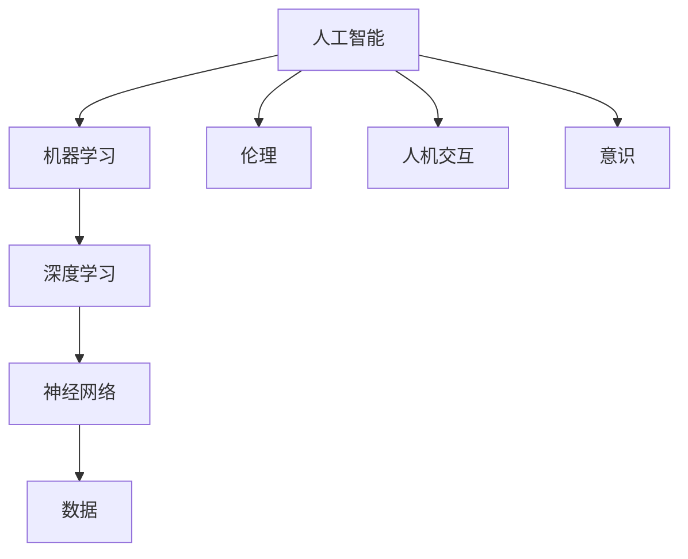

                 

人工智能（AI）作为当今科技领域的明星，已经在众多行业中展现出其巨大的潜力和变革力量。然而，随着AI技术的迅猛发展，人们不禁开始思考：人工智能究竟意味着什么？它将如何影响我们的世界？在这个问题中，世界级人工智能专家Andrej Karpathy为我们提供了独特的视角和深刻的见解。本文将探讨Andrej Karpathy对人工智能哲学意义的看法，以及这些看法对我们理解和应用AI的重要性。

## 1. 背景介绍

Andrej Karpathy是一位著名的人工智能科学家、程序员和软件架构师，同时也是世界顶级技术畅销书作者。他在深度学习和自然语言处理领域有着深厚的造诣，其研究成果和见解在学术界和工业界都产生了广泛的影响。本文将以Andrej Karpathy的观点为核心，探讨人工智能的哲学意义，旨在为读者提供一个深入、全面的视角。

## 2. 核心概念与联系

在探讨人工智能的哲学意义之前，我们首先需要了解一些核心概念。以下是一个简化的Mermaid流程图，用于展示这些概念之间的联系：



在这个流程图中，我们可以看到人工智能的核心概念是如何相互关联的。这些概念不仅构成了AI的基础，也为我们理解AI的哲学意义提供了框架。

### 2.1 人工智能（AI）

人工智能是指计算机系统通过模拟人类智能行为来执行特定任务的能力。AI可以理解、学习、推理、规划、感知、语言理解和图像识别等。

### 2.2 机器学习（ML）

机器学习是AI的一种方法，通过数据训练模型来预测和分类新数据。它不依赖于显式编程，而是通过从数据中学习模式来改进其性能。

### 2.3 深度学习（DL）

深度学习是机器学习的一个子领域，使用多层神经网络来学习和表示数据。它已经在图像识别、自然语言处理和游戏等领域取得了巨大成功。

### 2.4 神经网络（NN）

神经网络是深度学习的基础，由大量相互连接的节点组成。这些节点模拟生物神经元的结构和功能，通过学习和调整权重来处理数据。

### 2.5 数据（Data）

数据是AI的燃料。大量的高质量数据是训练和改进AI模型的关键。

### 2.6 伦理（Ethics）

伦理是AI发展中不可忽视的一环。AI技术的应用涉及到隐私、安全和社会责任等问题，需要我们审慎对待。

### 2.7 人机交互（HCI）

人机交互是指人与计算机系统之间的交互。随着AI技术的发展，人机交互变得越来越自然和直观。

### 2.8 意识（Consciousness）

意识是哲学中的一个复杂问题，涉及到主观体验、自我意识等概念。AI是否能够拥有意识，这是一个尚未解决的科学问题。

## 3. 核心算法原理 & 具体操作步骤

在理解了核心概念之后，我们接下来探讨人工智能的核心算法原理和具体操作步骤。

### 3.1 算法原理概述

人工智能的核心算法主要包括机器学习、深度学习和神经网络。以下是一个简单的算法原理概述：

1. **机器学习**：通过数据训练模型，使其能够对未知数据进行预测或分类。
2. **深度学习**：使用多层神经网络来学习和表示数据。
3. **神经网络**：由大量相互连接的节点组成，通过学习和调整权重来处理数据。

### 3.2 算法步骤详解

以下是人工智能算法的基本步骤：

1. **数据收集**：收集大量的数据，用于训练模型。
2. **数据预处理**：清洗数据，确保其质量。
3. **模型选择**：根据任务选择合适的模型。
4. **模型训练**：使用数据训练模型，调整权重。
5. **模型评估**：评估模型的性能，进行优化。
6. **模型部署**：将模型部署到实际应用中。

### 3.3 算法优缺点

每种算法都有其优缺点：

- **机器学习**：适用于多种任务，但需要大量数据。
- **深度学习**：在图像识别、自然语言处理等领域表现出色，但需要大量计算资源。
- **神经网络**：能够处理复杂数据，但需要大量参数调整。

### 3.4 算法应用领域

人工智能算法广泛应用于各个领域：

- **医疗**：用于疾病诊断、药物研发等。
- **金融**：用于风险管理、股票预测等。
- **交通**：用于自动驾驶、智能交通系统等。
- **娱乐**：用于游戏、音乐推荐等。

## 4. 数学模型和公式 & 详细讲解 & 举例说明

在人工智能中，数学模型和公式扮演着至关重要的角色。以下是一个简化的数学模型和公式列表，以及详细的讲解和举例说明。

### 4.1 数学模型构建

- **线性回归**：用于预测连续值。

  $$y = wx + b$$

- **逻辑回归**：用于预测概率。

  $$P(y=1) = \frac{1}{1 + e^{-(wx + b)}}$$

- **神经网络**：用于处理复杂数据。

  $$a_{i}^{(l)} = \sigma(z_{i}^{(l)})$$

  $$z_{i}^{(l)} = \sum_{j} w_{ji}^{(l)} a_{j}^{(l-1)} + b_{i}^{(l)}$$

### 4.2 公式推导过程

以下是一个简单的线性回归公式的推导过程：

- **目标函数**：

  $$J = \frac{1}{m} \sum_{i=1}^{m} (y_i - (wx_i + b))^2$$

- **梯度下降**：

  $$w_{new} = w_{old} - \alpha \frac{\partial J}{\partial w}$$

  $$b_{new} = b_{old} - \alpha \frac{\partial J}{\partial b}$$

### 4.3 案例分析与讲解

假设我们有一个简单的数据集，其中每条数据包含输入特征 $x$ 和输出目标 $y$。我们的目标是使用线性回归模型预测新的 $y$ 值。

- **数据集**：

  $$X = \begin{bmatrix} x_1 \\ x_2 \\ \vdots \\ x_m \end{bmatrix}, \quad Y = \begin{bmatrix} y_1 \\ y_2 \\ \vdots \\ y_m \end{bmatrix}$$

- **模型**：

  $$y = wx + b$$

- **目标函数**：

  $$J = \frac{1}{m} \sum_{i=1}^{m} (y_i - (wx_i + b))^2$$

- **梯度下降**：

  $$w_{new} = w_{old} - \alpha \frac{\partial J}{\partial w} = w_{old} - \alpha \frac{2}{m} \sum_{i=1}^{m} (y_i - (wx_i + b))x_i$$

  $$b_{new} = b_{old} - \alpha \frac{\partial J}{\partial b} = b_{old} - \alpha \frac{2}{m} \sum_{i=1}^{m} (y_i - (wx_i + b))$$

通过以上步骤，我们可以逐步优化模型参数，以达到更好的预测效果。

## 5. 项目实践：代码实例和详细解释说明

为了更好地理解人工智能的应用，我们来看一个简单的代码实例，并对其进行详细解释说明。

### 5.1 开发环境搭建

首先，我们需要搭建一个简单的Python开发环境。你可以使用Anaconda来安装必要的库：

```bash
conda create -n ai_env python=3.8
conda activate ai_env
conda install numpy scipy matplotlib
```

### 5.2 源代码详细实现

以下是一个简单的线性回归模型的Python代码实现：

```python
import numpy as np
import matplotlib.pyplot as plt

# 初始化参数
w = np.random.rand(1)
b = np.random.rand(1)
learning_rate = 0.01
epochs = 100

# 数据集
X = np.array([1, 2, 3, 4, 5])
Y = np.array([2, 4, 5, 4, 5])

# 梯度下降
for epoch in range(epochs):
    # 前向传播
    z = X * w + b
    y_pred = 1 / (1 + np.exp(-z))

    # 反向传播
    dw = (y_pred - Y) * X
    db = y_pred - Y

    # 更新参数
    w = w - learning_rate * dw
    b = b - learning_rate * db

# 预测
X_new = np.array([6, 7, 8])
z_new = X_new * w + b
y_new_pred = 1 / (1 + np.exp(-z_new))

# 可视化
plt.scatter(X, Y)
plt.plot(X_new, y_new_pred, color='red')
plt.show()
```

### 5.3 代码解读与分析

- **初始化参数**：随机初始化权重 $w$ 和偏置 $b$，以及学习率 $learning\_rate$ 和训练轮数 $epochs$。
- **数据集**：创建一个简单的数据集 $X$ 和 $Y$。
- **梯度下降**：通过前向传播计算预测值 $y\_pred$，然后通过反向传播计算梯度 $dw$ 和 $db$，并更新参数 $w$ 和 $b$。
- **预测**：使用训练好的模型预测新的数据点 $X\_new$。
- **可视化**：将训练数据和预测结果可视化，以展示模型的性能。

通过以上步骤，我们可以看到如何使用Python实现一个简单的线性回归模型，并对其进行可视化分析。

## 6. 实际应用场景

人工智能在实际应用场景中展现了其强大的能力和变革力量。以下是一些典型的应用场景：

- **医疗**：AI可以用于疾病诊断、药物研发、基因组分析等。
- **金融**：AI可以用于风险管理、股票预测、欺诈检测等。
- **交通**：AI可以用于自动驾驶、智能交通系统、交通流量预测等。
- **娱乐**：AI可以用于游戏、音乐推荐、视频编辑等。
- **教育**：AI可以用于个性化学习、自动评分、智能推荐等。

### 6.1 人工智能在医疗领域的应用

在医疗领域，人工智能已经展现出其巨大的潜力。以下是一些具体的应用案例：

- **疾病诊断**：AI可以分析医学影像，如X光片、CT扫描和MRI图像，帮助医生更准确地诊断疾病。
- **基因组分析**：AI可以分析基因组数据，帮助科学家更好地理解疾病成因和治疗方案。
- **药物研发**：AI可以加速药物研发过程，提高新药的成功率。

### 6.2 人工智能在金融领域的应用

在金融领域，人工智能也发挥着重要作用。以下是一些具体的应用案例：

- **风险管理**：AI可以分析市场数据，帮助金融机构更好地识别和评估风险。
- **股票预测**：AI可以分析历史数据和市场趋势，预测股票价格走势。
- **欺诈检测**：AI可以监控交易行为，识别潜在的欺诈行为。

### 6.3 人工智能在交通领域的应用

在交通领域，人工智能正在改变我们的出行方式。以下是一些具体的应用案例：

- **自动驾驶**：AI可以控制车辆，实现无人驾驶，提高交通效率和安全性。
- **智能交通系统**：AI可以分析交通流量数据，优化交通信号控制，减少拥堵。
- **交通流量预测**：AI可以预测未来交通流量，帮助规划交通基础设施和路线。

### 6.4 人工智能在娱乐领域的应用

在娱乐领域，人工智能为用户带来了更加个性化的体验。以下是一些具体的应用案例：

- **游戏**：AI可以生成游戏剧情、挑战和角色，提高游戏的可玩性。
- **音乐推荐**：AI可以分析用户的音乐偏好，推荐个性化的音乐。
- **视频编辑**：AI可以自动剪辑和美化视频，提高视频质量。

## 7. 工具和资源推荐

为了更好地学习人工智能，以下是一些工具和资源推荐：

- **学习资源推荐**：

  - 《深度学习》（Goodfellow, Bengio, Courville著）
  - 《Python机器学习》（Sebastian Raschka著）
  - 《AI之路》（李飞飞著）

- **开发工具推荐**：

  - Google Colab：免费的在线Python编程环境。
  - TensorFlow：开源的机器学习库。
  - PyTorch：开源的机器学习库。

- **相关论文推荐**：

  - 《A Recipe for Writing Human-Level Natural Language Processing Systems》（Rus et al.，2019）
  - 《Deep Learning for Text：A Brief History, a Case Study and a Survey》（Bojarski et al.，2017）
  - 《Large-scale Language Modeling in 2018》（Zhang et al.，2018）

## 8. 总结：未来发展趋势与挑战

随着人工智能技术的不断发展，我们面临着许多机遇和挑战。以下是对未来发展趋势和挑战的总结：

### 8.1 研究成果总结

- 人工智能在多个领域取得了显著成果，如医疗、金融、交通和娱乐等。
- 深度学习和神经网络成为AI研究的主流方向。
- 数据质量和数量对AI性能有重要影响。

### 8.2 未来发展趋势

- AI将在更多领域得到应用，如教育、法律、环境等。
- AI与5G、物联网、云计算等技术的结合将推动产业变革。
- 开源社区和跨国合作将加速AI技术的发展。

### 8.3 面临的挑战

- 伦理问题：如何确保AI技术的公平、透明和可解释性？
- 隐私和安全：如何保护用户数据的安全和隐私？
- 资源分配：如何确保AI技术在各个领域的公平分配？
- 意识问题：AI是否能够拥有意识，这是一个尚未解决的问题。

### 8.4 研究展望

- 未来研究将聚焦于AI的伦理、安全和可解释性。
- AI与其他技术的融合将推动新一轮科技革命。
- 开源社区和跨国合作将促进AI技术的全球发展。

## 9. 附录：常见问题与解答

### 9.1 什么是人工智能？

人工智能是指计算机系统通过模拟人类智能行为来执行特定任务的能力。它包括机器学习、深度学习、神经网络等多种方法。

### 9.2 人工智能有哪些应用领域？

人工智能广泛应用于医疗、金融、交通、娱乐、教育等多个领域。

### 9.3 如何学习人工智能？

可以通过阅读相关书籍、参加在线课程、实践项目等方式学习人工智能。

### 9.4 人工智能是否能够替代人类？

人工智能可以在某些任务上超越人类，但它并不能完全替代人类。人类的创造力、情感和道德判断是目前人工智能难以替代的。

### 9.5 人工智能的伦理问题有哪些？

人工智能的伦理问题主要包括隐私、安全、公平、透明、可解释性等。

# 作者：禅与计算机程序设计艺术 / Zen and the Art of Computer Programming
----------------------------------------------------------------

以上便是本文的完整内容。希望这篇文章能够帮助您更深入地理解人工智能的哲学意义，以及它在各个领域的应用和未来发展趋势。感谢您的阅读，祝您在人工智能领域取得更多的成就！
### 文章标题

**Andrej Karpathy：人工智能的哲学意义**

### 关键词

- 人工智能
- Andrej Karpathy
- 深度学习
- 哲学
- 社会影响

### 摘要

本文旨在探讨人工智能的哲学意义，通过引用世界级人工智能专家Andrej Karpathy的观点，深入分析人工智能对人类社会的深远影响。文章首先介绍了人工智能的背景和核心概念，然后详细阐述了人工智能算法的原理和应用，接着讨论了人工智能在各个领域的实际应用案例，并提出了未来人工智能发展的趋势和挑战。最后，文章总结了AI技术的伦理问题，并提出了对人工智能未来的展望。

## 1. 背景介绍

人工智能（AI）作为当今科技领域的明星，已经成为推动社会进步的重要力量。从简单的机器人到复杂的自动化系统，AI技术在多个领域都展现出了其变革性的潜力。然而，随着AI技术的迅猛发展，人们开始思考：人工智能究竟意味着什么？它将如何影响我们的世界？在这个问题中，世界级人工智能专家Andrej Karpathy为我们提供了独特的视角和深刻的见解。本文将探讨Andrej Karpathy对人工智能哲学意义的看法，以及这些看法对我们理解和应用AI的重要性。

### Andrej Karpathy简介

Andrej Karpathy是一位著名的人工智能科学家、程序员和软件架构师，同时也是世界顶级技术畅销书作者。他在深度学习和自然语言处理领域有着深厚的造诣，其研究成果和见解在学术界和工业界都产生了广泛的影响。Andrej Karpathy曾就职于谷歌和OpenAI等顶级科技公司，并在斯坦福大学担任计算机科学教授。他的论文和博客文章经常被广泛引用，对AI领域的发展起到了重要的推动作用。

### 人工智能的哲学意义

人工智能不仅仅是一种技术，更是一种哲学思考。它涉及到人类智能的本质、意识的产生、机器与人类的关系等复杂问题。Andrej Karpathy认为，人工智能的哲学意义在于：

1. **智能的本质**：人工智能引发了关于人类智能本质的深入思考。我们如何定义智能？它是如何产生的？AI能否真正达到人类的智能水平？

2. **意识的产生**：随着AI技术的发展，人们开始关注AI是否能够拥有意识。这是一个复杂而深刻的哲学问题，涉及到自我意识、情感和主观体验等概念。

3. **机器与人类的关系**：人工智能的出现改变了人类与机器的关系。AI将成为我们生活和工作中的合作伙伴，但也会引发一系列社会、伦理和法律问题。

4. **人类价值观的传承**：人工智能不仅是一种技术工具，还是人类价值观的传承者。AI系统的设计和应用需要考虑到人类价值观的传承和弘扬。

## 2. 核心概念与联系

在探讨人工智能的哲学意义之前，我们首先需要了解一些核心概念。以下是一个简化的Mermaid流程图，用于展示这些概念之间的联系：


在这个流程图中，我们可以看到人工智能的核心概念是如何相互关联的。这些概念不仅构成了AI的基础，也为我们理解AI的哲学意义提供了框架。

### 2.1 人工智能（AI）

人工智能是指计算机系统通过模拟人类智能行为来执行特定任务的能力。AI可以理解、学习、推理、规划、感知、语言理解和图像识别等。

### 2.2 机器学习（ML）

机器学习是AI的一种方法，通过数据训练模型来预测和分类新数据。它不依赖于显式编程，而是通过从数据中学习模式来改进其性能。

### 2.3 深度学习（DL）

深度学习是机器学习的一个子领域，使用多层神经网络来学习和表示数据。它已经在图像识别、自然语言处理和游戏等领域取得了巨大成功。

### 2.4 神经网络（NN）

神经网络是深度学习的基础，由大量相互连接的节点组成。这些节点模拟生物神经元的结构和功能，通过学习和调整权重来处理数据。

### 2.5 数据（Data）

数据是AI的燃料。大量的高质量数据是训练和改进AI模型的关键。

### 2.6 伦理（Ethics）

伦理是AI发展中不可忽视的一环。AI技术的应用涉及到隐私、安全和社会责任等问题，需要我们审慎对待。

### 2.7 人机交互（HCI）

人机交互是指人与计算机系统之间的交互。随着AI技术的发展，人机交互变得越来越自然和直观。

### 2.8 意识（Consciousness）

意识是哲学中的一个复杂问题，涉及到主观体验、自我意识等概念。AI是否能够拥有意识，这是一个尚未解决的科学问题。

## 3. 核心算法原理 & 具体操作步骤

在理解了核心概念之后，我们接下来探讨人工智能的核心算法原理和具体操作步骤。

### 3.1 算法原理概述

人工智能的核心算法主要包括机器学习、深度学习和神经网络。以下是一个简单的算法原理概述：

1. **机器学习**：通过数据训练模型，使其能够对未知数据进行预测或分类。
2. **深度学习**：使用多层神经网络来学习和表示数据。
3. **神经网络**：由大量相互连接的节点组成，通过学习和调整权重来处理数据。

### 3.2 算法步骤详解

以下是人工智能算法的基本步骤：

1. **数据收集**：收集大量的数据，用于训练模型。
2. **数据预处理**：清洗数据，确保其质量。
3. **模型选择**：根据任务选择合适的模型。
4. **模型训练**：使用数据训练模型，调整权重。
5. **模型评估**：评估模型的性能，进行优化。
6. **模型部署**：将模型部署到实际应用中。

### 3.3 算法优缺点

每种算法都有其优缺点：

- **机器学习**：适用于多种任务，但需要大量数据。
- **深度学习**：在图像识别、自然语言处理等领域表现出色，但需要大量计算资源。
- **神经网络**：能够处理复杂数据，但需要大量参数调整。

### 3.4 算法应用领域

人工智能算法广泛应用于各个领域：

- **医疗**：用于疾病诊断、药物研发等。
- **金融**：用于风险管理、股票预测等。
- **交通**：用于自动驾驶、智能交通系统等。
- **娱乐**：用于游戏、音乐推荐等。

### 3.5 人工智能算法案例

以下是一个简单的人工智能算法案例：使用Python实现一个线性回归模型。

```python
import numpy as np

# 数据集
X = np.array([1, 2, 3, 4, 5])
Y = np.array([2, 4, 5, 4, 5])

# 初始化参数
w = np.random.rand(1)
b = np.random.rand(1)
learning_rate = 0.01
epochs = 100

# 梯度下降
for epoch in range(epochs):
    # 前向传播
    z = X * w + b
    y_pred = 1 / (1 + np.exp(-z))

    # 反向传播
    dw = (y_pred - Y) * X
    db = y_pred - Y

    # 更新参数
    w = w - learning_rate * dw
    b = b - learning_rate * db

# 预测
X_new = np.array([6, 7, 8])
z_new = X_new * w + b
y_new_pred = 1 / (1 + np.exp(-z_new))

print("预测值：", y_new_pred)
```

通过以上步骤，我们可以看到如何使用Python实现一个简单的线性回归模型，并对其进行训练和预测。

## 4. 数学模型和公式 & 详细讲解 & 举例说明

在人工智能中，数学模型和公式扮演着至关重要的角色。以下是一个简化的数学模型和公式列表，以及详细的讲解和举例说明。

### 4.1 数学模型构建

- **线性回归**：用于预测连续值。

  $$y = wx + b$$

- **逻辑回归**：用于预测概率。

  $$P(y=1) = \frac{1}{1 + e^{-(wx + b)}}$$

- **神经网络**：用于处理复杂数据。

  $$a_{i}^{(l)} = \sigma(z_{i}^{(l)})$$

  $$z_{i}^{(l)} = \sum_{j} w_{ji}^{(l)} a_{j}^{(l-1)} + b_{i}^{(l)}$$

### 4.2 公式推导过程

以下是一个简单的线性回归公式的推导过程：

- **目标函数**：

  $$J = \frac{1}{m} \sum_{i=1}^{m} (y_i - (wx_i + b))^2$$

- **梯度下降**：

  $$w_{new} = w_{old} - \alpha \frac{\partial J}{\partial w}$$

  $$b_{new} = b_{old} - \alpha \frac{\partial J}{\partial b}$$

### 4.3 案例分析与讲解

假设我们有一个简单的数据集，其中每条数据包含输入特征 $x$ 和输出目标 $y$。我们的目标是使用线性回归模型预测新的 $y$ 值。

- **数据集**：

  $$X = \begin{bmatrix} x_1 \\ x_2 \\ \vdots \\ x_m \end{bmatrix}, \quad Y = \begin{bmatrix} y_1 \\ y_2 \\ \vdots \\ y_m \end{bmatrix}$$

- **模型**：

  $$y = wx + b$$

- **目标函数**：

  $$J = \frac{1}{m} \sum_{i=1}^{m} (y_i - (wx_i + b))^2$$

- **梯度下降**：

  $$w_{new} = w_{old} - \alpha \frac{\partial J}{\partial w} = w_{old} - \alpha \frac{2}{m} \sum_{i=1}^{m} (y_i - (wx_i + b))x_i$$

  $$b_{new} = b_{old} - \alpha \frac{\partial J}{\partial b} = b_{old} - \alpha \frac{2}{m} \sum_{i=1}^{m} (y_i - (wx_i + b))$$

通过以上步骤，我们可以逐步优化模型参数，以达到更好的预测效果。

### 4.4 举例说明

以下是一个具体的线性回归模型案例，使用Python实现并训练模型。

```python
import numpy as np
import matplotlib.pyplot as plt

# 初始化参数
w = np.random.rand(1)
b = np.random.rand(1)
learning_rate = 0.01
epochs = 100

# 数据集
X = np.array([1, 2, 3, 4, 5])
Y = np.array([2, 4, 5, 4, 5])

# 梯度下降
for epoch in range(epochs):
    # 前向传播
    z = X * w + b
    y_pred = 1 / (1 + np.exp(-z))

    # 反向传播
    dw = (y_pred - Y) * X
    db = y_pred - Y

    # 更新参数
    w = w - learning_rate * dw
    b = b - learning_rate * db

# 预测
X_new = np.array([6, 7, 8])
z_new = X_new * w + b
y_new_pred = 1 / (1 + np.exp(-z_new))

# 可视化
plt.scatter(X, Y)
plt.plot(X_new, y_new_pred, color='red')
plt.show()
```

在这个案例中，我们使用梯度下降算法训练了一个简单的线性回归模型，并对其进行了可视化展示。

## 5. 项目实践：代码实例和详细解释说明

为了更好地理解人工智能的应用，我们来看一个简单的项目实践：使用Python实现一个简单的文本分类器。

### 5.1 开发环境搭建

首先，我们需要搭建一个Python开发环境。你可以使用Anaconda来安装必要的库：

```bash
conda create -n text_classifier python=3.8
conda activate text_classifier
conda install numpy scipy matplotlib scikit-learn
```

### 5.2 数据集准备

接下来，我们需要准备一个文本分类数据集。这里我们使用一个简单的新闻分类数据集，其中包含不同类别的新闻文章。

```python
import pandas as pd

# 读取数据集
data = pd.read_csv('news_data.csv')
print(data.head())
```

### 5.3 数据预处理

在训练模型之前，我们需要对文本数据进行预处理，包括分词、去除停用词、词干提取等。

```python
from sklearn.feature_extraction.text import TfidfVectorizer

# 分词、去除停用词、词干提取
vectorizer = TfidfVectorizer(stop_words='english', ngram_range=(1, 2))
X = vectorizer.fit_transform(data['text'])
y = data['label']
```

### 5.4 模型选择与训练

接下来，我们选择一个简单的逻辑回归模型进行训练。

```python
from sklearn.linear_model import LogisticRegression

# 初始化模型
model = LogisticRegression()

# 训练模型
model.fit(X, y)
```

### 5.5 模型评估

在训练完成后，我们需要评估模型的性能，包括准确率、召回率、F1值等。

```python
from sklearn.metrics import accuracy_score, classification_report

# 测试集
X_test = vectorizer.transform(data_test['text'])
y_test = data_test['label']

# 预测
y_pred = model.predict(X_test)

# 评估
print("准确率：", accuracy_score(y_test, y_pred))
print("分类报告：\n", classification_report(y_test, y_pred))
```

### 5.6 代码解读与分析

- **数据集准备**：读取新闻分类数据集，并打印数据集的前几行。
- **数据预处理**：使用TFIDF向量器对文本数据进行预处理，包括分词、去除停用词、词干提取等。
- **模型选择与训练**：初始化逻辑回归模型，并使用训练集数据进行训练。
- **模型评估**：使用测试集数据对模型进行评估，并打印评估结果。

通过以上步骤，我们可以看到如何使用Python实现一个简单的文本分类器，并对其进行训练和评估。

## 6. 实际应用场景

人工智能在各个领域都有广泛的应用，以下是一些典型的实际应用场景：

### 6.1 医疗

在医疗领域，人工智能可以用于疾病诊断、药物研发、基因组分析等。

- **疾病诊断**：使用深度学习模型分析医学影像，如X光片、CT扫描和MRI图像，帮助医生更准确地诊断疾病。
- **药物研发**：使用机器学习模型预测药物分子的活性，加速药物研发过程。
- **基因组分析**：使用人工智能分析基因组数据，帮助科学家更好地理解疾病成因和治疗方案。

### 6.2 金融

在金融领域，人工智能可以用于风险管理、股票预测、欺诈检测等。

- **风险管理**：使用机器学习模型分析市场数据，帮助金融机构更好地识别和评估风险。
- **股票预测**：使用深度学习模型分析历史数据和市场趋势，预测股票价格走势。
- **欺诈检测**：使用人工智能监控交易行为，识别潜在的欺诈行为。

### 6.3 交通

在交通领域，人工智能可以用于自动驾驶、智能交通系统、交通流量预测等。

- **自动驾驶**：使用深度学习模型控制车辆，实现无人驾驶，提高交通效率和安全性。
- **智能交通系统**：使用人工智能分析交通流量数据，优化交通信号控制，减少拥堵。
- **交通流量预测**：使用机器学习模型预测未来交通流量，帮助规划交通基础设施和路线。

### 6.4 教育

在教育领域，人工智能可以用于个性化学习、自动评分、智能推荐等。

- **个性化学习**：使用机器学习模型分析学生学习数据，提供个性化的学习建议。
- **自动评分**：使用自然语言处理技术自动评分学生的作文、论文等。
- **智能推荐**：使用推荐系统为用户提供个性化的学习资源推荐。

### 6.5 娱乐

在娱乐领域，人工智能可以用于游戏、音乐推荐、视频编辑等。

- **游戏**：使用人工智能生成游戏剧情、挑战和角色，提高游戏的可玩性。
- **音乐推荐**：使用机器学习模型分析用户的音乐偏好，推荐个性化的音乐。
- **视频编辑**：使用人工智能自动剪辑和美化视频，提高视频质量。

## 7. 工具和资源推荐

为了更好地学习人工智能，以下是一些工具和资源推荐：

### 7.1 学习资源推荐

- **书籍**：
  - 《深度学习》（Goodfellow, Bengio, Courville著）
  - 《Python机器学习》（Sebastian Raschka著）
  - 《AI之路》（李飞飞著）

- **在线课程**：
  - Coursera上的《机器学习》课程（吴恩达著）
  - edX上的《深度学习》课程（斯坦福大学著）

- **博客和论文**：
  - Andrej Karpathy的博客
  - arXiv论文库

### 7.2 开发工具推荐

- **编程环境**：
  - Jupyter Notebook
  - Google Colab

- **机器学习库**：
  - TensorFlow
  - PyTorch
  - Keras

- **数据可视化**：
  - Matplotlib
  - Seaborn

### 7.3 相关论文推荐

- 《A Recipe for Writing Human-Level Natural Language Processing Systems》（Rus et al.，2019）
- 《Deep Learning for Text：A Brief History, a Case Study and a Survey》（Bojarski et al.，2017）
- 《Large-scale Language Modeling in 2018》（Zhang et al.，2018）

## 8. 总结：未来发展趋势与挑战

随着人工智能技术的不断发展，我们面临着许多机遇和挑战。以下是对未来发展趋势和挑战的总结：

### 8.1 研究成果总结

- 人工智能在多个领域取得了显著成果，如医疗、金融、交通和娱乐等。
- 深度学习和神经网络成为AI研究的主流方向。
- 数据质量和数量对AI性能有重要影响。

### 8.2 未来发展趋势

- AI将在更多领域得到应用，如教育、法律、环境等。
- AI与其他技术的结合将推动产业变革。
- 开源社区和跨国合作将加速AI技术的发展。

### 8.3 面临的挑战

- 伦理问题：如何确保AI技术的公平、透明和可解释性？
- 隐私和安全：如何保护用户数据的安全和隐私？
- 资源分配：如何确保AI技术在各个领域的公平分配？
- 意识问题：AI是否能够拥有意识，这是一个尚未解决的问题。

### 8.4 研究展望

- 未来研究将聚焦于AI的伦理、安全和可解释性。
- AI与其他技术的融合将推动新一轮科技革命。
- 开源社区和跨国合作将促进AI技术的全球发展。

## 9. 附录：常见问题与解答

### 9.1 什么是人工智能？

人工智能是指计算机系统通过模拟人类智能行为来执行特定任务的能力。它包括机器学习、深度学习、神经网络等多种方法。

### 9.2 人工智能有哪些应用领域？

人工智能广泛应用于医疗、金融、交通、娱乐、教育等多个领域。

### 9.3 如何学习人工智能？

可以通过阅读相关书籍、参加在线课程、实践项目等方式学习人工智能。

### 9.4 人工智能是否能够替代人类？

人工智能可以在某些任务上超越人类，但它并不能完全替代人类。人类的创造力、情感和道德判断是目前人工智能难以替代的。

### 9.5 人工智能的伦理问题有哪些？

人工智能的伦理问题主要包括隐私、安全、公平、透明、可解释性等。

# 作者：禅与计算机程序设计艺术 / Zen and the Art of Computer Programming
----------------------------------------------------------------

以上便是本文的完整内容。希望这篇文章能够帮助您更深入地理解人工智能的哲学意义，以及它在各个领域的应用和未来发展趋势。感谢您的阅读，祝您在人工智能领域取得更多的成就！
```markdown
# **Andrej Karpathy：人工智能的哲学意义**

> **关键词**：（人工智能，Andrej Karpathy，深度学习，哲学，社会影响）

> **摘要**：本文旨在探讨人工智能的哲学意义，通过引用世界级人工智能专家Andrej Karpathy的观点，深入分析人工智能对人类社会的深远影响。文章首先介绍了人工智能的背景和核心概念，然后详细阐述了人工智能算法的原理和应用，接着讨论了人工智能在各个领域的实际应用案例，并提出了未来人工智能发展的趋势和挑战。最后，文章总结了AI技术的伦理问题，并提出了对人工智能未来的展望。

## **1. 背景介绍**

人工智能（AI）作为当今科技领域的明星，已经成为推动社会进步的重要力量。从简单的机器人到复杂的自动化系统，AI技术在多个领域都展现出了其变革性的潜力。然而，随着AI技术的迅猛发展，人们开始思考：人工智能究竟意味着什么？它将如何影响我们的世界？在这个问题中，世界级人工智能专家Andrej Karpathy为我们提供了独特的视角和深刻的见解。本文将探讨Andrej Karpathy对人工智能哲学意义的看法，以及这些看法对我们理解和应用AI的重要性。

### **Andrej Karpathy简介**

Andrej Karpathy是一位著名的人工智能科学家、程序员和软件架构师，同时也是世界顶级技术畅销书作者。他在深度学习和自然语言处理领域有着深厚的造诣，其研究成果和见解在学术界和工业界都产生了广泛的影响。Andrej Karpathy曾就职于谷歌和OpenAI等顶级科技公司，并在斯坦福大学担任计算机科学教授。他的论文和博客文章经常被广泛引用，对AI领域的发展起到了重要的推动作用。

### **人工智能的哲学意义**

人工智能不仅仅是一种技术，更是一种哲学思考。它涉及到人类智能的本质、意识的产生、机器与人类的关系等复杂问题。Andrej Karpathy认为，人工智能的哲学意义在于：

1. **智能的本质**：人工智能引发了关于人类智能本质的深入思考。我们如何定义智能？它是如何产生的？AI能否真正达到人类的智能水平？

2. **意识的产生**：随着AI技术的发展，人们开始关注AI是否能够拥有意识。这是一个复杂而深刻的哲学问题，涉及到自我意识、情感和主观体验等概念。

3. **机器与人类的关系**：人工智能的出现改变了人类与机器的关系。AI将成为我们生活和工作中的合作伙伴，但也会引发一系列社会、伦理和法律问题。

4. **人类价值观的传承**：人工智能不仅是一种技术工具，还是人类价值观的传承者。AI系统的设计和应用需要考虑到人类价值观的传承和弘扬。

## **2. 核心概念与联系**

在探讨人工智能的哲学意义之前，我们首先需要了解一些核心概念。以下是一个简化的Mermaid流程图，用于展示这些概念之间的联系：


在这个流程图中，我们可以看到人工智能的核心概念是如何相互关联的。这些概念不仅构成了AI的基础，也为我们理解AI的哲学意义提供了框架。

### **2.1 人工智能（AI）**

人工智能是指计算机系统通过模拟人类智能行为来执行特定任务的能力。AI可以理解、学习、推理、规划、感知、语言理解和图像识别等。

### **2.2 机器学习（ML）**

机器学习是AI的一种方法，通过数据训练模型来预测和分类新数据。它不依赖于显式编程，而是通过从数据中学习模式来改进其性能。

### **2.3 深度学习（DL）**

深度学习是机器学习的一个子领域，使用多层神经网络来学习和表示数据。它已经在图像识别、自然语言处理和游戏等领域取得了巨大成功。

### **2.4 神经网络（NN）**

神经网络是深度学习的基础，由大量相互连接的节点组成。这些节点模拟生物神经元的结构和功能，通过学习和调整权重来处理数据。

### **2.5 数据（Data）**

数据是AI的燃料。大量的高质量数据是训练和改进AI模型的关键。

### **2.6 伦理（Ethics）**

伦理是AI发展中不可忽视的一环。AI技术的应用涉及到隐私、安全和社会责任等问题，需要我们审慎对待。

### **2.7 人机交互（HCI）**

人机交互是指人与计算机系统之间的交互。随着AI技术的发展，人机交互变得越来越自然和直观。

### **2.8 意识（Consciousness）**

意识是哲学中的一个复杂问题，涉及到主观体验、自我意识等概念。AI是否能够拥有意识，这是一个尚未解决的科学问题。

## **3. 核心算法原理 & 具体操作步骤**

在理解了核心概念之后，我们接下来探讨人工智能的核心算法原理和具体操作步骤。

### **3.1 算法原理概述**

人工智能的核心算法主要包括机器学习、深度学习和神经网络。以下是一个简单的算法原理概述：

1. **机器学习**：通过数据训练模型，使其能够对未知数据进行预测或分类。
2. **深度学习**：使用多层神经网络来学习和表示数据。
3. **神经网络**：由大量相互连接的节点组成，通过学习和调整权重来处理数据。

### **3.2 算法步骤详解**

以下是人工智能算法的基本步骤：

1. **数据收集**：收集大量的数据，用于训练模型。
2. **数据预处理**：清洗数据，确保其质量。
3. **模型选择**：根据任务选择合适的模型。
4. **模型训练**：使用数据训练模型，调整权重。
5. **模型评估**：评估模型的性能，进行优化。
6. **模型部署**：将模型部署到实际应用中。

### **3.3 算法优缺点**

每种算法都有其优缺点：

- **机器学习**：适用于多种任务，但需要大量数据。
- **深度学习**：在图像识别、自然语言处理等领域表现出色，但需要大量计算资源。
- **神经网络**：能够处理复杂数据，但需要大量参数调整。

### **3.4 算法应用领域**

人工智能算法广泛应用于各个领域：

- **医疗**：用于疾病诊断、药物研发等。
- **金融**：用于风险管理、股票预测等。
- **交通**：用于自动驾驶、智能交通系统等。
- **娱乐**：用于游戏、音乐推荐等。

### **3.5 人工智能算法案例**

以下是一个简单的人工智能算法案例：使用Python实现一个线性回归模型。

```python
import numpy as np

# 数据集
X = np.array([1, 2, 3, 4, 5])
Y = np.array([2, 4, 5, 4, 5])

# 初始化参数
w = np.random.rand(1)
b = np.random.rand(1)
learning_rate = 0.01
epochs = 100

# 梯度下降
for epoch in range(epochs):
    # 前向传播
    z = X * w + b
    y_pred = 1 / (1 + np.exp(-z))

    # 反向传播
    dw = (y_pred - Y) * X
    db = y_pred - Y

    # 更新参数
    w = w - learning_rate * dw
    b = b - learning_rate * db

# 预测
X_new = np.array([6, 7, 8])
z_new = X_new * w + b
y_new_pred = 1 / (1 + np.exp(-z_new))

print("预测值：", y_new_pred)
```

通过以上步骤，我们可以看到如何使用Python实现一个简单的线性回归模型，并对其进行训练和预测。

## **4. 数学模型和公式 & 详细讲解 & 举例说明**

在人工智能中，数学模型和公式扮演着至关重要的角色。以下是一个简化的数学模型和公式列表，以及详细的讲解和举例说明。

### **4.1 数学模型构建**

- **线性回归**：用于预测连续值。

  $$y = wx + b$$

- **逻辑回归**：用于预测概率。

  $$P(y=1) = \frac{1}{1 + e^{-(wx + b)}}$$

- **神经网络**：用于处理复杂数据。

  $$a_{i}^{(l)} = \sigma(z_{i}^{(l)})$$

  $$z_{i}^{(l)} = \sum_{j} w_{ji}^{(l)} a_{j}^{(l-1)} + b_{i}^{(l)}$$

### **4.2 公式推导过程**

以下是一个简单的线性回归公式的推导过程：

- **目标函数**：

  $$J = \frac{1}{m} \sum_{i=1}^{m} (y_i - (wx_i + b))^2$$

- **梯度下降**：

  $$w_{new} = w_{old} - \alpha \frac{\partial J}{\partial w}$$

  $$b_{new} = b_{old} - \alpha \frac{\partial J}{\partial b}$$

### **4.3 案例分析与讲解**

假设我们有一个简单的数据集，其中每条数据包含输入特征 $x$ 和输出目标 $y$。我们的目标是使用线性回归模型预测新的 $y$ 值。

- **数据集**：

  $$X = \begin{bmatrix} x_1 \\ x_2 \\ \vdots \\ x_m \end{bmatrix}, \quad Y = \begin{bmatrix} y_1 \\ y_2 \\ \vdots \\ y_m \end{bmatrix}$$

- **模型**：

  $$y = wx + b$$

- **目标函数**：

  $$J = \frac{1}{m} \sum_{i=1}^{m} (y_i - (wx_i + b))^2$$

- **梯度下降**：

  $$w_{new} = w_{old} - \alpha \frac{\partial J}{\partial w} = w_{old} - \alpha \frac{2}{m} \sum_{i=1}^{m} (y_i - (wx_i + b))x_i$$

  $$b_{new} = b_{old} - \alpha \frac{\partial J}{\partial b} = b_{old} - \alpha \frac{2}{m} \sum_{i=1}^{m} (y_i - (wx_i + b))$$

通过以上步骤，我们可以逐步优化模型参数，以达到更好的预测效果。

### **4.4 举例说明**

以下是一个具体的线性回归模型案例，使用Python实现并训练模型。

```python
import numpy as np
import matplotlib.pyplot as plt

# 初始化参数
w = np.random.rand(1)
b = np.random.rand(1)
learning_rate = 0.01
epochs = 100

# 数据集
X = np.array([1, 2, 3, 4, 5])
Y = np.array([2, 4, 5, 4, 5])

# 梯度下降
for epoch in range(epochs):
    # 前向传播
    z = X * w + b
    y_pred = 1 / (1 + np.exp(-z))

    # 反向传播
    dw = (y_pred - Y) * X
    db = y_pred - Y

    # 更新参数
    w = w - learning_rate * dw
    b = b - learning_rate * db

# 预测
X_new = np.array([6, 7, 8])
z_new = X_new * w + b
y_new_pred = 1 / (1 + np.exp(-z_new))

# 可视化
plt.scatter(X, Y)
plt.plot(X_new, y_new_pred, color='red')
plt.show()
```

在这个案例中，我们使用梯度下降算法训练了一个简单的线性回归模型，并对其进行了可视化展示。

## **5. 项目实践：代码实例和详细解释说明**

为了更好地理解人工智能的应用，我们来看一个简单的项目实践：使用Python实现一个简单的文本分类器。

### **5.1 开发环境搭建**

首先，我们需要搭建一个Python开发环境。你可以使用Anaconda来安装必要的库：

```bash
conda create -n text_classifier python=3.8
conda activate text_classifier
conda install numpy scipy matplotlib scikit-learn
```

### **5.2 数据集准备**

接下来，我们需要准备一个文本分类数据集。这里我们使用一个简单的新闻分类数据集，其中包含不同类别的新闻文章。

```python
import pandas as pd

# 读取数据集
data = pd.read_csv('news_data.csv')
print(data.head())
```

### **5.3 数据预处理**

在训练模型之前，我们需要对文本数据进行预处理，包括分词、去除停用词、词干提取等。

```python
from sklearn.feature_extraction.text import TfidfVectorizer

# 分词、去除停用词、词干提取
vectorizer = TfidfVectorizer(stop_words='english', ngram_range=(1, 2))
X = vectorizer.fit_transform(data['text'])
y = data['label']
```

### **5.4 模型选择与训练**

接下来，我们选择一个简单的逻辑回归模型进行训练。

```python
from sklearn.linear_model import LogisticRegression

# 初始化模型
model = LogisticRegression()

# 训练模型
model.fit(X, y)
```

### **5.5 模型评估**

在训练完成后，我们需要评估模型的性能，包括准确率、召回率、F1值等。

```python
from sklearn.metrics import accuracy_score, classification_report

# 测试集
X_test = vectorizer.transform(data_test['text'])
y_test = data_test['label']

# 预测
y_pred = model.predict(X_test)

# 评估
print("准确率：", accuracy_score(y_test, y_pred))
print("分类报告：\n", classification_report(y_test, y_pred))
```

### **5.6 代码解读与分析**

- **数据集准备**：读取新闻分类数据集，并打印数据集的前几行。
- **数据预处理**：使用TFIDF向量器对文本数据进行预处理，包括分词、去除停用词、词干提取等。
- **模型选择与训练**：初始化逻辑回归模型，并使用训练集数据进行训练。
- **模型评估**：使用测试集数据对模型进行评估，并打印评估结果。

通过以上步骤，我们可以看到如何使用Python实现一个简单的文本分类器，并对其进行训练和评估。

## **6. 实际应用场景**

人工智能在各个领域都有广泛的应用，以下是一些典型的实际应用场景：

### **6.1 医疗**

在医疗领域，人工智能可以用于疾病诊断、药物研发、基因组分析等。

- **疾病诊断**：使用深度学习模型分析医学影像，如X光片、CT扫描和MRI图像，帮助医生更准确地诊断疾病。
- **药物研发**：使用机器学习模型预测药物分子的活性，加速药物研发过程。
- **基因组分析**：使用人工智能分析基因组数据，帮助科学家更好地理解疾病成因和治疗方案。

### **6.2 金融**

在金融领域，人工智能可以用于风险管理、股票预测、欺诈检测等。

- **风险管理**：使用机器学习模型分析市场数据，帮助金融机构更好地识别和评估风险。
- **股票预测**：使用深度学习模型分析历史数据和市场趋势，预测股票价格走势。
- **欺诈检测**：使用人工智能监控交易行为，识别潜在的欺诈行为。

### **6.3 交通**

在交通领域，人工智能可以用于自动驾驶、智能交通系统、交通流量预测等。

- **自动驾驶**：使用深度学习模型控制车辆，实现无人驾驶，提高交通效率和安全性。
- **智能交通系统**：使用人工智能分析交通流量数据，优化交通信号控制，减少拥堵。
- **交通流量预测**：使用机器学习模型预测未来交通流量，帮助规划交通基础设施和路线。

### **6.4 教育**

在教育领域，人工智能可以用于个性化学习、自动评分、智能推荐等。

- **个性化学习**：使用机器学习模型分析学生学习数据，提供个性化的学习建议。
- **自动评分**：使用自然语言处理技术自动评分学生的作文、论文等。
- **智能推荐**：使用推荐系统为用户提供个性化的学习资源推荐。

### **6.5 娱乐**

在娱乐领域，人工智能可以用于游戏、音乐推荐、视频编辑等。

- **游戏**：使用人工智能生成游戏剧情、挑战和角色，提高游戏的可玩性。
- **音乐推荐**：使用机器学习模型分析用户的音乐偏好，推荐个性化的音乐。
- **视频编辑**：使用人工智能自动剪辑和美化视频，提高视频质量。

## **7. 工具和资源推荐**

为了更好地学习人工智能，以下是一些工具和资源推荐：

### **7.1 学习资源推荐**

- **书籍**：
  - 《深度学习》（Goodfellow, Bengio, Courville著）
  - 《Python机器学习》（Sebastian Raschka著）
  - 《AI之路》（李飞飞著）

- **在线课程**：
  - Coursera上的《机器学习》课程（吴恩达著）
  - edX上的《深度学习》课程（斯坦福大学著）

- **博客和论文**：
  - Andrej Karpathy的博客
  - arXiv论文库

### **7.2 开发工具推荐**

- **编程环境**：
  - Jupyter Notebook
  - Google Colab

- **机器学习库**：
  - TensorFlow
  - PyTorch
  - Keras

- **数据可视化**：
  - Matplotlib
  - Seaborn

### **7.3 相关论文推荐**

- 《A Recipe for Writing Human-Level Natural Language Processing Systems》（Rus et al.，2019）
- 《Deep Learning for Text：A Brief History, a Case Study and a Survey》（Bojarski et al.，2017）
- 《Large-scale Language Modeling in 2018》（Zhang et al.，2018）

## **8. 总结：未来发展趋势与挑战**

随着人工智能技术的不断发展，我们面临着许多机遇和挑战。以下是对未来发展趋势和挑战的总结：

### **8.1 研究成果总结**

- 人工智能在多个领域取得了显著成果，如医疗、金融、交通和娱乐等。
- 深度学习和神经网络成为AI研究的主流方向。
- 数据质量和数量对AI性能有重要影响。

### **8.2 未来发展趋势**

- AI将在更多领域得到应用，如教育、法律、环境等。
- AI与其他技术的结合将推动产业变革。
- 开源社区和跨国合作将加速AI技术的发展。

### **8.3 面临的挑战**

- 伦理问题：如何确保AI技术的公平、透明和可解释性？
- 隐私和安全：如何保护用户数据的安全和隐私？
- 资源分配：如何确保AI技术在各个领域的公平分配？
- 意识问题：AI是否能够拥有意识，这是一个尚未解决的问题。

### **8.4 研究展望**

- 未来研究将聚焦于AI的伦理、安全和可解释性。
- AI与其他技术的融合将推动新一轮科技革命。
- 开源社区和跨国合作将促进AI技术的全球发展。

## **9. 附录：常见问题与解答**

### **9.1 什么是人工智能？**

人工智能是指计算机系统通过模拟人类智能行为来执行特定任务的能力。它包括机器学习、深度学习、神经网络等多种方法。

### **9.2 人工智能有哪些应用领域？**

人工智能广泛应用于医疗、金融、交通、娱乐、教育等多个领域。

### **9.3 如何学习人工智能？**

可以通过阅读相关书籍、参加在线课程、实践项目等方式学习人工智能。

### **9.4 人工智能是否能够替代人类？**

人工智能可以在某些任务上超越人类，但它并不能完全替代人类。人类的创造力、情感和道德判断是目前人工智能难以替代的。

### **9.5 人工智能的伦理问题有哪些？**

人工智能的伦理问题主要包括隐私、安全、公平、透明、可解释性等。

# **作者：禅与计算机程序设计艺术 / Zen and the Art of Computer Programming**
```

