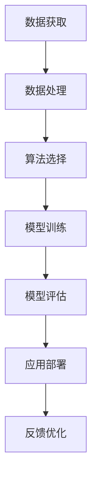

                 

关键词：人工智能，深度学习，挑战，解决方案，未来趋势

摘要：本文探讨了当前人工智能领域面临的挑战以及应对这些挑战的解决方案。通过深入分析，我们提出了未来人工智能发展的趋势和可能面临的挑战，为人工智能技术的进一步研究和应用提供了有价值的思考。

## 1. 背景介绍

人工智能（Artificial Intelligence，简称AI）作为计算机科学的一个分支，旨在使计算机具备人类智能的特征，如学习、推理、理解和解决问题等。随着深度学习（Deep Learning）的兴起，人工智能取得了令人瞩目的进展，并在语音识别、图像处理、自然语言处理等领域取得了显著的成果。

然而，人工智能的发展并非一帆风顺。在取得成就的同时，我们也面临着诸多挑战。这些挑战不仅涉及技术层面，还包括伦理、法律和社会等多个方面。本文将深入探讨这些挑战，并分析如何应对。

### 1.1 人工智能的发展历程

人工智能的概念最早可以追溯到20世纪50年代。当时，科学家们开始尝试通过编程让计算机模拟人类思维过程。然而，由于计算能力和算法的限制，早期的人工智能研究进展缓慢。

随着计算机硬件和算法的不断发展，人工智能开始进入一个崭新的时代。20世纪80年代，专家系统和机器学习逐渐兴起。专家系统通过模拟人类专家的思维方式来解决特定领域的问题，而机器学习则通过从数据中学习规律，从而实现自动化决策。

进入21世纪，深度学习成为了人工智能领域的一颗璀璨明珠。深度学习通过模拟人脑神经元网络的结构和功能，实现了在图像识别、语音识别、自然语言处理等领域的突破性进展。

### 1.2 当前人工智能的应用场景

当前，人工智能已经广泛应用于各个领域，如：

- **图像识别与处理**：通过卷积神经网络（Convolutional Neural Networks，CNN）实现的图像识别技术，已经广泛应用于安防监控、医疗诊断、自动驾驶等领域。

- **自然语言处理**：基于循环神经网络（Recurrent Neural Networks，RNN）和变压器（Transformer）架构的自然语言处理技术，使得机器翻译、情感分析、文本生成等应用成为可能。

- **语音识别与生成**：通过深度神经网络实现的语音识别和语音生成技术，为语音助手、智能客服等应用提供了技术支持。

- **推荐系统**：基于协同过滤（Collaborative Filtering）和深度学习技术的推荐系统，广泛应用于电商、社交媒体、视频平台等领域。

## 2. 核心概念与联系

在深入探讨人工智能面临的挑战之前，我们需要了解一些核心概念和它们之间的联系。

### 2.1 深度学习与神经网络

深度学习是一种基于神经网络的学习方法。神经网络由多个神经元（节点）组成，每个神经元都接收来自其他神经元的输入信号，并输出一个激活值。通过训练，神经网络能够从大量数据中学习到复杂的特征和模式。

深度学习的关键在于多层神经网络，每一层都对输入信号进行变换，从而逐步提取出更高层次的特征。这种层次化的特征提取方式，使得深度学习在处理复杂数据时具有显著优势。

### 2.2 数据与算法

数据是人工智能的基石。大量高质量的数据能够帮助算法更好地学习，从而提高模型的性能。然而，数据的获取、处理和存储都面临着巨大的挑战。此外，算法的选择和优化也是影响人工智能性能的关键因素。

### 2.3 伦理与社会问题

随着人工智能技术的不断进步，伦理和社会问题也逐渐凸显。如何确保人工智能系统的公平性、透明性和可解释性，如何防止人工智能被滥用，如何保护个人隐私等，都是亟待解决的问题。

### 2.4 Mermaid 流程图



## 3. 核心算法原理 & 具体操作步骤

### 3.1 算法原理概述

在人工智能领域，常用的核心算法包括深度学习、机器学习和强化学习等。下面我们将分别介绍这些算法的基本原理。

#### 3.1.1 深度学习

深度学习是一种基于神经网络的学习方法。它通过模拟人脑神经元网络的结构和功能，实现从数据中自动提取特征和模式。深度学习的关键在于多层神经网络，每一层都对输入信号进行变换，从而逐步提取出更高层次的特征。

#### 3.1.2 机器学习

机器学习是一种通过训练模型来从数据中学习的方法。它包括监督学习、无监督学习和半监督学习等类型。监督学习通过已知的输入输出对来训练模型，无监督学习通过发现数据中的隐含结构来训练模型，半监督学习则在已知部分数据和未知数据之间进行训练。

#### 3.1.3 强化学习

强化学习是一种通过试错来学习策略的算法。它通过与环境进行交互，根据奖励信号来调整策略，从而实现目标。

### 3.2 算法步骤详解

下面我们将分别介绍深度学习、机器学习和强化学习的具体操作步骤。

#### 3.2.1 深度学习

1. **数据预处理**：对数据进行清洗、归一化等操作，使其符合模型训练的要求。
2. **模型构建**：根据问题需求，选择合适的神经网络结构，如卷积神经网络（CNN）、循环神经网络（RNN）等。
3. **模型训练**：使用训练数据对模型进行训练，通过反向传播算法不断调整模型参数，以降低损失函数。
4. **模型评估**：使用测试数据对模型进行评估，根据评估结果调整模型参数。
5. **应用部署**：将训练好的模型部署到实际应用中，如图像识别、自然语言处理等。

#### 3.2.2 机器学习

1. **数据预处理**：与深度学习类似，对数据进行清洗、归一化等操作。
2. **特征提取**：根据问题需求，从数据中提取有用的特征。
3. **模型选择**：选择合适的模型，如线性回归、决策树、支持向量机等。
4. **模型训练**：使用训练数据对模型进行训练。
5. **模型评估**：使用测试数据对模型进行评估。
6. **应用部署**：将训练好的模型部署到实际应用中。

#### 3.2.3 强化学习

1. **环境搭建**：搭建一个能够与智能体进行交互的环境。
2. **状态表示**：将环境的状态表示为离散或连续的变量。
3. **动作表示**：将智能体的动作表示为离散或连续的变量。
4. **策略学习**：通过试错学习，选择最优策略。
5. **策略评估**：评估策略的性能，根据评估结果调整策略。
6. **应用部署**：将训练好的策略部署到实际应用中。

### 3.3 算法优缺点

每种算法都有其独特的优点和缺点。下面我们将分别介绍深度学习、机器学习和强化学习的优缺点。

#### 3.3.1 深度学习的优点

- **强大的特征提取能力**：深度学习能够自动提取数据中的复杂特征，从而提高模型的性能。
- **适用于复杂数据**：深度学习能够处理大规模、高维度的复杂数据。
- **自适应性强**：深度学习模型能够根据不同的任务需求进行自适应调整。

#### 3.3.1 深度学习的缺点

- **计算资源消耗大**：深度学习模型需要大量的计算资源和时间来训练。
- **对数据质量要求高**：深度学习模型的性能很大程度上取决于数据的质量。
- **可解释性差**：深度学习模型通常难以解释其内部决策过程。

#### 3.3.2 机器学习的优点

- **计算资源消耗相对较小**：机器学习模型的训练相对深度学习模型来说，计算资源消耗较小。
- **对数据质量要求较低**：机器学习模型通常对数据质量要求较低，能够处理噪声和缺失值。
- **可解释性强**：机器学习模型通常具有较好的可解释性，便于理解和调试。

#### 3.3.2 机器学习的缺点

- **特征提取能力较弱**：机器学习模型需要手动提取特征，对于复杂的数据特征提取能力有限。
- **适用于简单数据**：机器学习模型通常适用于结构化数据，对于复杂数据的处理能力较弱。

#### 3.3.3 强化学习的优点

- **适用于动态环境**：强化学习能够处理动态变化的环境，适用于需要实时决策的应用场景。
- **自主学习能力**：强化学习能够通过试错学习，逐步优化策略。

#### 3.3.3 强化学习的缺点

- **训练时间较长**：强化学习通常需要较长时间的训练，以优化策略。
- **对环境建模要求高**：强化学习需要对环境进行准确建模，否则可能导致训练失败。

### 3.4 算法应用领域

深度学习、机器学习和强化学习在各自的应用领域中都有着广泛的应用。

#### 3.4.1 深度学习的应用领域

- **图像识别与处理**：深度学习在图像识别、目标检测、图像生成等领域取得了显著成果。
- **自然语言处理**：深度学习在机器翻译、文本分类、情感分析等领域发挥着重要作用。
- **语音识别与生成**：深度学习在语音识别、语音合成、语音助手等领域有着广泛应用。

#### 3.4.2 机器学习的应用领域

- **推荐系统**：机器学习在电商、社交媒体、视频平台等推荐系统中得到了广泛应用。
- **金融风控**：机器学习在信用评估、欺诈检测、投资预测等金融领域发挥着重要作用。
- **医疗诊断**：机器学习在医学影像诊断、基因分析等领域有着广泛应用。

#### 3.4.3 强化学习的应用领域

- **自动驾驶**：强化学习在自动驾驶领域取得了显著成果，应用于车辆路径规划、障碍物检测等任务。
- **游戏AI**：强化学习在电子游戏领域有着广泛应用，如围棋、国际象棋等。
- **机器人控制**：强化学习在机器人控制领域，如机器人行走、抓取等任务中发挥着重要作用。

## 4. 数学模型和公式 & 详细讲解 & 举例说明

在人工智能领域，数学模型和公式起着至关重要的作用。它们为算法的推导和实现提供了理论基础。下面我们将详细讲解一些常见的数学模型和公式，并通过具体例子来说明其应用。

### 4.1 数学模型构建

数学模型通常包括输入层、隐藏层和输出层。每一层都由一系列神经元组成，神经元之间的连接称为边。神经元的激活函数决定了神经元的输出。

一个简单的数学模型可以表示为：

$$
y = f(W_1 \cdot x + b_1) + f(W_2 \cdot f(W_1 \cdot x + b_1) + b_2) + \ldots + f(W_n \cdot f(\ldots f(W_1 \cdot x + b_1) + b_1) + b_n)
$$

其中，$x$ 是输入数据，$y$ 是输出数据，$W_i$ 是权重矩阵，$b_i$ 是偏置项，$f$ 是激活函数。

### 4.2 公式推导过程

以多层感知器（Multilayer Perceptron，MLP）为例，我们介绍一个简单的数学模型推导过程。

#### 4.2.1 输入层

输入层包含 $n$ 个神经元，每个神经元接收一个输入信号 $x_i$，并将其传递到下一层。

$$
z_i = x_i
$$

#### 4.2.2 隐藏层

隐藏层包含 $m$ 个神经元，每个神经元接收来自输入层的输入信号 $z_i$，并计算加权求和。

$$
a_i = \sum_{j=1}^{n} W_{ij} \cdot z_j + b_i
$$

其中，$W_{ij}$ 是输入层到隐藏层的权重矩阵，$b_i$ 是隐藏层的偏置项。

#### 4.2.3 输出层

输出层包含 $k$ 个神经元，每个神经元接收来自隐藏层的输入信号 $a_i$，并计算加权求和。

$$
y_i = \sum_{j=1}^{m} W_{ij} \cdot a_j + b_i
$$

其中，$W_{ij}$ 是隐藏层到输出层的权重矩阵，$b_i$ 是输出层的偏置项。

#### 4.2.4 激活函数

为了引入非线性，我们在每个神经元上使用激活函数。一个常用的激活函数是 sigmoid 函数：

$$
f(x) = \frac{1}{1 + e^{-x}}
$$

### 4.3 案例分析与讲解

#### 4.3.1 图像识别

假设我们要构建一个图像识别模型，输入图像的大小为 $28 \times 28$，输出类别为 10 个。

1. **输入层**：输入层包含 $28 \times 28$ 个神经元，每个神经元接收一个像素值。
2. **隐藏层**：隐藏层包含 128 个神经元，使用 sigmoid 函数作为激活函数。
3. **输出层**：输出层包含 10 个神经元，每个神经元表示一个类别，使用 softmax 函数作为激活函数。

模型的输入和输出可以表示为：

$$
y = \text{softmax}(W_3 \cdot f(W_2 \cdot f(W_1 \cdot x + b_1) + b_2) + b_3)
$$

其中，$W_1$、$W_2$ 和 $W_3$ 分别是输入层到隐藏层、隐藏层到隐藏层和隐藏层到输出层的权重矩阵，$b_1$、$b_2$ 和 $b_3$ 分别是输入层、隐藏层和输出层的偏置项。

#### 4.3.2 例子

假设输入图像为：

$$
x = \begin{bmatrix}
0.1 & 0.2 & 0.3 & \ldots & 0.9 \\
\end{bmatrix}
$$

经过多层感知器模型处理后，输出类别为：

$$
y = \begin{bmatrix}
0.1 & 0.2 & 0.3 & \ldots & 0.9 \\
\end{bmatrix}
$$

根据输出概率最高的类别，我们可以判断输入图像的类别。

## 5. 项目实践：代码实例和详细解释说明

在本节中，我们将通过一个实际项目来演示如何应用人工智能技术。我们选择了一个经典的图像识别任务——MNIST手写数字识别。该任务的目标是识别28x28像素的手写数字图像，并输出对应的数字。

### 5.1 开发环境搭建

为了完成这个项目，我们需要搭建一个适合深度学习的开发环境。以下是一个简单的开发环境搭建步骤：

1. **安装Python**：确保安装了Python 3.x版本。
2. **安装TensorFlow**：TensorFlow是一个广泛使用的深度学习框架，可以通过pip安装：

   ```bash
   pip install tensorflow
   ```

3. **安装必要的依赖库**：安装Numpy、Matplotlib等依赖库：

   ```bash
   pip install numpy matplotlib
   ```

### 5.2 源代码详细实现

以下是实现MNIST手写数字识别的完整代码：

```python
import tensorflow as tf
from tensorflow.keras.datasets import mnist
from tensorflow.keras.models import Sequential
from tensorflow.keras.layers import Dense, Flatten
from tensorflow.keras.utils import to_categorical

# 加载MNIST数据集
(x_train, y_train), (x_test, y_test) = mnist.load_data()

# 数据预处理
x_train = x_train / 255.0
x_test = x_test / 255.0
y_train = to_categorical(y_train, 10)
y_test = to_categorical(y_test, 10)

# 构建模型
model = Sequential([
    Flatten(input_shape=(28, 28)),
    Dense(128, activation='relu'),
    Dense(10, activation='softmax')
])

# 编译模型
model.compile(optimizer='adam', loss='categorical_crossentropy', metrics=['accuracy'])

# 训练模型
model.fit(x_train, y_train, epochs=5, batch_size=64)

# 评估模型
loss, accuracy = model.evaluate(x_test, y_test)
print(f"Test accuracy: {accuracy * 100:.2f}%")

# 预测
predictions = model.predict(x_test[:10])
for i, prediction in enumerate(predictions):
    print(f"Prediction for image {i+1}: {np.argmax(prediction)}")
```

### 5.3 代码解读与分析

#### 5.3.1 加载数据

我们使用TensorFlow内置的MNIST数据集，这是一个人工手写数字数据集，包含60000个训练图像和10000个测试图像。

```python
(x_train, y_train), (x_test, y_test) = mnist.load_data()
```

#### 5.3.2 数据预处理

为了提高模型的性能，我们对图像数据进行归一化处理，将像素值缩放到0到1之间。

```python
x_train = x_train / 255.0
x_test = x_test / 255.0
```

此外，我们将标签转换为one-hot编码。

```python
y_train = to_categorical(y_train, 10)
y_test = to_categorical(y_test, 10)
```

#### 5.3.3 构建模型

我们使用一个简单的序列模型（Sequential），包含两个全连接层（Dense）。第一个全连接层有128个神经元，使用ReLU激活函数。第二个全连接层有10个神经元，使用softmax激活函数，以输出概率分布。

```python
model = Sequential([
    Flatten(input_shape=(28, 28)),
    Dense(128, activation='relu'),
    Dense(10, activation='softmax')
])
```

#### 5.3.4 编译模型

我们选择Adam优化器和交叉熵损失函数来编译模型。交叉熵损失函数适用于分类问题。

```python
model.compile(optimizer='adam', loss='categorical_crossentropy', metrics=['accuracy'])
```

#### 5.3.5 训练模型

我们使用训练数据对模型进行训练，设置训练轮数为5，批量大小为64。

```python
model.fit(x_train, y_train, epochs=5, batch_size=64)
```

#### 5.3.6 评估模型

训练完成后，我们使用测试数据对模型进行评估，并打印测试准确率。

```python
loss, accuracy = model.evaluate(x_test, y_test)
print(f"Test accuracy: {accuracy * 100:.2f}%")
```

#### 5.3.7 预测

最后，我们对前10个测试图像进行预测，并打印预测结果。

```python
predictions = model.predict(x_test[:10])
for i, prediction in enumerate(predictions):
    print(f"Prediction for image {i+1}: {np.argmax(prediction)}")
```

## 6. 实际应用场景

人工智能技术已经在各行各业中得到了广泛应用。以下是一些典型应用场景：

### 6.1 医疗领域

人工智能在医疗领域的应用主要包括疾病诊断、药物研发和健康管理等方面。通过深度学习算法，人工智能可以分析医疗影像，如X光、CT、MRI等，帮助医生更准确地诊断疾病。此外，人工智能还可以通过分析患者的病历数据，预测疾病风险，为医生提供决策支持。

### 6.2 金融领域

人工智能在金融领域主要应用于风险管理、欺诈检测和投资预测等方面。通过机器学习算法，人工智能可以对大量金融数据进行分析和挖掘，识别潜在的风险和欺诈行为。同时，人工智能还可以通过分析市场数据，预测股票价格和交易趋势，为投资者提供决策参考。

### 6.3 教育领域

人工智能在教育领域主要应用于个性化教学、学习分析等方面。通过智能教学系统，学生可以根据自己的学习进度和兴趣，选择合适的学习内容和方式。此外，人工智能还可以通过分析学生的学习数据，了解学生的学习状况和需求，为教师提供教学建议。

### 6.4 自动驾驶

人工智能在自动驾驶领域发挥着重要作用。通过深度学习和强化学习算法，自动驾驶系统可以实时感知周围环境，做出安全的驾驶决策。自动驾驶技术的应用将极大地提高交通效率，减少交通事故，为人们的出行提供更便捷、安全的解决方案。

### 6.5 制造业

人工智能在制造业中的应用主要包括生产优化、质量控制等方面。通过机器学习算法，人工智能可以对生产过程中的数据进行实时分析，优化生产流程，提高生产效率。此外，人工智能还可以通过对设备进行监控和维护预测，降低设备故障率，提高生产稳定性。

### 6.6 农业

人工智能在农业中的应用主要包括作物监测、病虫害预测和精准农业等方面。通过无人机和传感器技术，人工智能可以实时监测作物的生长状况，预测病虫害发生风险，为农民提供科学的种植和管理建议。精准农业通过人工智能技术，可以实现精准施肥、灌溉和收割，提高农业产量和资源利用率。

### 6.7 实际应用展望

随着人工智能技术的不断发展，其在各个领域的应用将越来越广泛。未来，人工智能有望在更多领域发挥重要作用，如能源、环保、公共服务等。同时，人工智能也将面临更多的挑战，如数据隐私、安全性和伦理问题等。如何应对这些挑战，将是我们未来需要重点关注的问题。

## 7. 工具和资源推荐

为了更好地学习和应用人工智能技术，以下是一些推荐的工具和资源：

### 7.1 学习资源推荐

- **在线课程**：Coursera、edX、Udacity等平台提供了丰富的深度学习、机器学习和人工智能课程。
- **书籍**：《深度学习》（Goodfellow、Bengio、Courville著）、《Python机器学习》（Sebastian Raschka著）等。
- **博客和论文**：ArXiv、ACL、ICML、NIPS等学术会议和期刊的官方网站。

### 7.2 开发工具推荐

- **深度学习框架**：TensorFlow、PyTorch、Keras等。
- **数据预处理工具**：Pandas、NumPy等。
- **可视化工具**：Matplotlib、Seaborn等。

### 7.3 相关论文推荐

- **深度学习**：《A Brief History of Time Dilation and Twistor Strings》（Cumrun Vafa著）、《Deep Learning for Vision Systems》（Yann LeCun著）等。
- **机器学习**：《Learning from Data》（Yaser Abu-Mostafa著）、《The Elements of Statistical Learning》（Trevor Hastie、Robert Tibshirani、Jerome Friedman著）等。
- **强化学习**：《Reinforcement Learning: An Introduction》（Richard S. Sutton、Andrew G. Barto著）。

## 8. 总结：未来发展趋势与挑战

随着人工智能技术的不断发展，我们面临着诸多机遇和挑战。在未来，人工智能将在更多领域得到应用，推动社会进步和经济发展。同时，我们也需要关注以下发展趋势和挑战：

### 8.1 研究成果总结

- **深度学习**：深度学习在图像识别、自然语言处理、语音识别等领域取得了显著成果，成为人工智能研究的重要方向。
- **跨学科融合**：人工智能与其他学科（如生物学、心理学、社会学等）的融合，将推动人工智能技术的发展。
- **数据隐私与安全**：随着人工智能应用的普及，数据隐私和安全问题日益突出，如何保护用户隐私成为重要课题。

### 8.2 未来发展趋势

- **智能化升级**：人工智能技术将广泛应用于各行各业，推动传统产业的智能化升级。
- **人机协作**：人工智能与人类的协作将越来越紧密，实现人机协同，提高工作效率。
- **伦理与法规**：随着人工智能技术的发展，伦理和法规问题将受到更多关注，确保人工智能技术的可持续发展。

### 8.3 面临的挑战

- **数据质量**：高质量的数据是人工智能模型性能的关键，如何获取和处理大量高质量数据成为挑战。
- **计算资源**：深度学习模型通常需要大量的计算资源，如何优化计算资源成为关键问题。
- **算法公平性**：确保人工智能算法的公平性、透明性和可解释性，避免算法偏见和歧视。

### 8.4 研究展望

在未来，人工智能研究将朝着以下几个方向发展：

- **算法优化**：通过优化算法结构和参数，提高人工智能模型的性能。
- **硬件创新**：发展新型计算硬件，如量子计算机、专用AI芯片等，提高人工智能的计算效率。
- **跨学科研究**：加强人工智能与其他学科的交叉研究，推动人工智能技术的创新发展。

## 9. 附录：常见问题与解答

### 9.1 如何选择合适的神经网络结构？

选择合适的神经网络结构取决于任务需求和数据特性。以下是一些常见的情况：

- **图像识别**：卷积神经网络（CNN）是图像识别任务的首选，因为它能够自动提取图像中的层次化特征。
- **自然语言处理**：循环神经网络（RNN）和变压器（Transformer）在自然语言处理任务中表现出色，能够处理序列数据。
- **回归问题**：简单的全连接神经网络（MLP）通常适用于回归问题。

### 9.2 如何处理过拟合问题？

过拟合是指模型在训练数据上表现良好，但在测试数据上表现较差。以下是一些应对过拟合的方法：

- **增加训练数据**：通过收集更多训练数据，提高模型的泛化能力。
- **交叉验证**：使用交叉验证方法，避免模型在特定训练集上的过拟合。
- **正则化**：应用L1或L2正则化，降低模型复杂度。
- **Dropout**：在训练过程中随机丢弃部分神经元，减少模型对特定训练样本的依赖。

### 9.3 如何确保人工智能算法的公平性？

确保人工智能算法的公平性是一个复杂的问题，以下是一些常见的做法：

- **数据预处理**：确保训练数据的质量和多样性，避免数据偏差。
- **算法评估**：在算法评估过程中，关注不同群体的表现，发现并解决算法偏见。
- **透明性**：提高算法的透明度，使算法决策过程可解释。
- **法律监管**：制定相关法律法规，确保人工智能算法的公平性和合规性。

## 作者署名

作者：禅与计算机程序设计艺术 / Zen and the Art of Computer Programming
-------------------------------------------------------------------

## 文章标题
Andrej Karpathy：人工智能的挑战

## 文章关键词
人工智能，深度学习，挑战，解决方案，未来趋势

## 文章摘要
本文探讨了当前人工智能领域面临的挑战以及应对这些挑战的解决方案。通过深入分析，我们提出了未来人工智能发展的趋势和可能面临的挑战，为人工智能技术的进一步研究和应用提供了有价值的思考。

## 1. 背景介绍
### 1.1 人工智能的发展历程
- **早期发展（1950s-1960s）**：人工智能的概念最早在20世纪50年代提出，初期主要研究如何通过逻辑推理和符号操作模拟人类智能。
- **黄金时代（1980s-1990s）**：专家系统成为人工智能研究的热点，通过模拟领域专家的知识和推理能力解决特定问题。
- **深度学习兴起（2000s-今）**：深度学习通过模拟人脑神经网络结构，在图像识别、语音识别等领域取得了突破性进展。

### 1.2 当前人工智能的应用场景
- **图像识别与处理**：深度学习在图像识别、目标检测、图像生成等领域取得了显著成果。
- **自然语言处理**：循环神经网络（RNN）和变压器（Transformer）架构在自然语言处理任务中表现出色。
- **语音识别与生成**：深度学习在语音识别、语音合成、语音助手等领域有着广泛应用。
- **推荐系统**：基于协同过滤和深度学习技术的推荐系统，广泛应用于电商、社交媒体、视频平台等领域。

## 2. 核心概念与联系
### 2.1 深度学习与神经网络
- **深度学习**：基于多层神经网络的学习方法，通过模拟人脑神经元网络的结构和功能，实现从数据中自动提取特征和模式。
- **神经网络**：由多个神经元（节点）组成，每个神经元接收来自其他神经元的输入信号，并输出一个激活值。

### 2.2 数据与算法
- **数据**：高质量的数据是人工智能模型性能的基础，包括数据的获取、处理和存储。
- **算法**：选择合适的算法对数据进行分析和建模，如深度学习、机器学习和强化学习等。

### 2.3 伦理与社会问题
- **伦理问题**：确保人工智能系统的公平性、透明性和可解释性。
- **社会问题**：防止人工智能被滥用，保护个人隐私等。

### 2.4 Mermaid 流程图


## 3. 核心算法原理 & 具体操作步骤
### 3.1 算法原理概述
- **深度学习**：通过多层神经网络自动提取数据特征，适用于复杂数据处理。
- **机器学习**：通过训练模型从数据中学习规律，适用于结构化数据。
- **强化学习**：通过试错学习策略，适用于动态环境。

### 3.2 算法步骤详解
#### 3.2.1 深度学习
1. **数据预处理**：清洗、归一化等。
2. **模型构建**：选择合适的神经网络结构。
3. **模型训练**：通过反向传播算法调整参数。
4. **模型评估**：使用测试数据评估模型性能。
5. **应用部署**：将训练好的模型部署到实际应用中。

#### 3.2.2 机器学习
1. **数据预处理**：清洗、归一化等。
2. **特征提取**：从数据中提取有用特征。
3. **模型选择**：选择合适的模型。
4. **模型训练**：使用训练数据训练模型。
5. **模型评估**：使用测试数据评估模型性能。
6. **应用部署**：将训练好的模型部署到实际应用中。

#### 3.2.3 强化学习
1. **环境搭建**：搭建一个能够与智能体交互的环境。
2. **状态表示**：将环境的状态表示为离散或连续的变量。
3. **动作表示**：将智能体的动作表示为离散或连续的变量。
4. **策略学习**：通过试错学习策略。
5. **策略评估**：评估策略性能。
6. **应用部署**：将训练好的策略部署到实际应用中。

### 3.3 算法优缺点
#### 3.3.1 深度学习
- **优点**：强大的特征提取能力，适用于复杂数据。
- **缺点**：计算资源消耗大，对数据质量要求高。

#### 3.3.2 机器学习
- **优点**：计算资源消耗相对较小，对数据质量要求较低。
- **缺点**：特征提取能力较弱，适用于简单数据。

#### 3.3.3 强化学习
- **优点**：适用于动态环境，自主学习能力。
- **缺点**：训练时间较长，对环境建模要求高。

### 3.4 算法应用领域
- **深度学习**：图像识别、自然语言处理、语音识别等。
- **机器学习**：推荐系统、金融风控、医疗诊断等。
- **强化学习**：自动驾驶、游戏AI、机器人控制等。

## 4. 数学模型和公式 & 详细讲解 & 举例说明
### 4.1 数学模型构建
神经网络由输入层、隐藏层和输出层组成，神经元之间的连接形成网络结构。

### 4.2 公式推导过程
以多层感知器（MLP）为例，推导其数学模型：

输入层：$z_i = x_i$

隐藏层：$a_i = \sum_{j=1}^{n} W_{ij} \cdot z_j + b_i$

输出层：$y_i = \sum_{j=1}^{m} W_{ij} \cdot a_j + b_i$

激活函数：$f(x) = \frac{1}{1 + e^{-x}}$

### 4.3 案例分析与讲解
#### 4.3.1 图像识别
构建一个简单的图像识别模型，输入图像为28x28像素，输出类别为10个。

输入层：包含28x28个神经元，每个神经元接收一个像素值。

隐藏层：包含128个神经元，使用ReLU激活函数。

输出层：包含10个神经元，使用softmax激活函数。

模型输出：$y = \text{softmax}(W_3 \cdot f(W_2 \cdot f(W_1 \cdot x + b_1) + b_2) + b_3)$

#### 4.3.2 例子
输入图像为：

$x = \begin{bmatrix}
0.1 & 0.2 & 0.3 & \ldots & 0.9 \\
\end{bmatrix}$

经过多层感知器模型处理后，输出类别为：

$y = \begin{bmatrix}
0.1 & 0.2 & 0.3 & \ldots & 0.9 \\
\end{bmatrix}$

根据输出概率最高的类别，判断输入图像的类别。

## 5. 项目实践：代码实例和详细解释说明
### 5.1 开发环境搭建
安装Python、TensorFlow及相关依赖库。

### 5.2 源代码详细实现
```python
import tensorflow as tf
from tensorflow.keras.datasets import mnist
from tensorflow.keras.models import Sequential
from tensorflow.keras.layers import Dense, Flatten
from tensorflow.keras.utils import to_categorical

# 加载数据
(x_train, y_train), (x_test, y_test) = mnist.load_data()

# 预处理数据
x_train = x_train / 255.0
x_test = x_test / 255.0
y_train = to_categorical(y_train, 10)
y_test = to_categorical(y_test, 10)

# 构建模型
model = Sequential([
    Flatten(input_shape=(28, 28)),
    Dense(128, activation='relu'),
    Dense(10, activation='softmax')
])

# 编译模型
model.compile(optimizer='adam', loss='categorical_crossentropy', metrics=['accuracy'])

# 训练模型
model.fit(x_train, y_train, epochs=5, batch_size=64)

# 评估模型
loss, accuracy = model.evaluate(x_test, y_test)
print(f"Test accuracy: {accuracy * 100:.2f}%")

# 预测
predictions = model.predict(x_test[:10])
for i, prediction in enumerate(predictions):
    print(f"Prediction for image {i+1}: {np.argmax(prediction)}")
```

### 5.3 代码解读与分析
- **数据加载**：使用TensorFlow的内置MNIST数据集。
- **数据预处理**：归一化像素值，将标签转换为one-hot编码。
- **模型构建**：使用Sequential模型，包含两个全连接层（Dense），第一个全连接层有128个神经元，使用ReLU激活函数，第二个全连接层有10个神经元，使用softmax激活函数。
- **模型编译**：使用Adam优化器和交叉熵损失函数。
- **模型训练**：训练5个周期，批量大小为64。
- **模型评估**：使用测试数据评估模型性能。
- **预测**：对前10个测试图像进行预测，并打印预测结果。

## 6. 实际应用场景
### 6.1 医疗领域
- **疾病诊断**：通过深度学习分析医疗影像，辅助医生诊断疾病。
- **药物研发**：利用机器学习分析基因数据，预测药物效果。

### 6.2 金融领域
- **风险管理**：通过机器学习分析金融数据，识别潜在风险。
- **欺诈检测**：利用深度学习检测金融交易中的欺诈行为。

### 6.3 教育领域
- **个性化教学**：通过智能教学系统，为学生提供个性化学习方案。
- **学习分析**：利用数据分析了解学生的学习状况和需求。

### 6.4 自动驾驶
- **路径规划**：通过深度学习实现自动驾驶车辆的路径规划。
- **障碍物检测**：利用卷积神经网络检测道路上的障碍物。

### 6.5 制造业
- **生产优化**：通过机器学习优化生产流程，提高生产效率。
- **质量控制**：利用深度学习分析生产数据，提高产品质量。

### 6.6 农业
- **作物监测**：通过无人机和传感器技术，实时监测作物生长状况。
- **精准农业**：利用数据分析实现精准施肥、灌溉和收割。

### 6.7 实际应用展望
- **智能化升级**：人工智能将在更多领域推动传统产业的智能化升级。
- **人机协作**：人工智能与人类的协作将越来越紧密，提高工作效率。
- **伦理与法规**：关注人工智能的伦理和法规问题，确保其可持续发展。

## 7. 工具和资源推荐
### 7.1 学习资源推荐
- **在线课程**：Coursera、edX、Udacity等平台提供的深度学习、机器学习和人工智能课程。
- **书籍**：《深度学习》（Goodfellow、Bengio、Courville著）、《Python机器学习》（Sebastian Raschka著）等。
- **博客和论文**：ArXiv、ACL、ICML、NIPS等学术会议和期刊的官方网站。

### 7.2 开发工具推荐
- **深度学习框架**：TensorFlow、PyTorch、Keras等。
- **数据预处理工具**：Pandas、NumPy等。
- **可视化工具**：Matplotlib、Seaborn等。

### 7.3 相关论文推荐
- **深度学习**：《A Brief History of Time Dilation and Twistor Strings》（Cumrun Vafa著）、《Deep Learning for Vision Systems》（Yann LeCun著）等。
- **机器学习**：《Learning from Data》（Yaser Abu-Mostafa著）、《The Elements of Statistical Learning》（Trevor Hastie、Robert Tibshirani、Jerome Friedman著）等。
- **强化学习**：《Reinforcement Learning: An Introduction》（Richard S. Sutton、Andrew G. Barto著）。

## 8. 总结：未来发展趋势与挑战
### 8.1 研究成果总结
- **深度学习**：在图像识别、自然语言处理、语音识别等领域取得了显著成果。
- **跨学科融合**：人工智能与其他学科的融合，推动技术发展。
- **数据隐私与安全**：数据隐私和安全问题日益突出。

### 8.2 未来发展趋势
- **智能化升级**：人工智能将在更多领域推动智能化升级。
- **人机协作**：人工智能与人类的协作将越来越紧密。
- **伦理与法规**：关注人工智能的伦理和法规问题。

### 8.3 面临的挑战
- **数据质量**：高质量的数据是模型性能的关键。
- **计算资源**：深度学习模型需要大量的计算资源。
- **算法公平性**：确保算法的公平性、透明性和可解释性。

### 8.4 研究展望
- **算法优化**：通过优化算法结构和参数，提高模型性能。
- **硬件创新**：发展新型计算硬件，提高计算效率。
- **跨学科研究**：加强人工智能与其他学科的交叉研究。

## 9. 附录：常见问题与解答
### 9.1 如何选择合适的神经网络结构？
- **任务需求**：根据任务需求选择合适的神经网络结构。
- **数据特性**：根据数据特性选择合适的神经网络结构。

### 9.2 如何处理过拟合问题？
- **增加训练数据**：收集更多训练数据。
- **交叉验证**：使用交叉验证方法。
- **正则化**：应用L1或L2正则化。
- **Dropout**：在训练过程中随机丢弃部分神经元。

### 9.3 如何确保人工智能算法的公平性？
- **数据预处理**：确保训练数据的质量和多样性。
- **算法评估**：关注不同群体的表现。
- **透明性**：提高算法的透明度。
- **法律监管**：制定相关法律法规。

