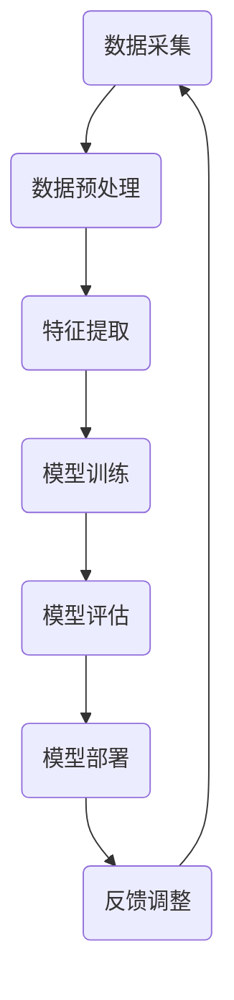

                 

关键词：人工智能，未来前景，深度学习，技术趋势，应用场景

> 摘要：本文旨在探讨人工智能领域的未来发展趋势和前景。通过对当前人工智能技术的现状分析，结合未来技术趋势，探讨人工智能在不同领域的应用，以及面临的挑战和机遇。本文旨在为读者提供一个全面、深入的视角，以更好地理解和把握人工智能的未来发展。

## 1. 背景介绍

随着计算能力的提升和大数据的普及，人工智能（AI）技术取得了前所未有的进展。特别是深度学习（Deep Learning）的出现，使得计算机在图像识别、自然语言处理、语音识别等领域取得了显著的成果。人工智能的快速发展，不仅改变了传统产业的生产方式，也带来了新的商业模式和就业机会。

然而，人工智能的发展并非一帆风顺。在取得成果的同时，我们也面临着一系列挑战，如数据隐私、算法偏见、技术伦理等。因此，深入了解人工智能的未来发展趋势和前景，对于我们把握时代脉搏，引领技术变革具有重要意义。

## 2. 核心概念与联系

为了更好地理解人工智能的未来发展，我们首先需要掌握一些核心概念和原理。下面我们将使用Mermaid流程图来展示这些概念和原理之间的联系。



### 2.1 数据采集

数据采集是人工智能的基础。通过传感器、互联网等渠道获取大量数据，为我们提供训练模型的素材。

### 2.2 数据预处理

数据预处理包括清洗、归一化、去重等操作，确保数据的质量和一致性。

### 2.3 特征提取

特征提取是将原始数据转换为适合模型训练的格式。这一过程涉及到降维、特征选择等关键技术。

### 2.4 模型训练

模型训练是核心环节，通过大量的数据来训练模型，使其具备预测和识别能力。

### 2.5 模型评估

模型评估用于判断模型的性能和效果。常见的评估指标包括准确率、召回率、F1值等。

### 2.6 模型部署

模型部署是将训练好的模型应用于实际场景，如图像识别、语音识别等。

### 2.7 反馈调整

通过实际应用中的反馈，不断调整和优化模型，以提高其性能。

## 3. 核心算法原理 & 具体操作步骤

### 3.1 算法原理概述

人工智能的核心算法包括神经网络、深度学习、生成对抗网络等。下面我们以神经网络为例，介绍其基本原理和操作步骤。

### 3.2 算法步骤详解

1. **输入层**

输入层接收外部数据，将其传递到下一层。

2. **隐藏层**

隐藏层对输入数据进行处理和转换，实现数据的非线性变换。

3. **输出层**

输出层将处理后的数据输出，用于预测或分类。

4. **反向传播**

通过反向传播算法，计算输出误差，并更新网络权重。

5. **迭代训练**

重复上述步骤，直至模型达到预定的性能指标。

### 3.3 算法优缺点

**优点：**

- **强大的表达能力**：神经网络可以处理复杂的非线性问题。
- **自动特征提取**：隐藏层自动提取有用的特征，减轻了人工特征工程的工作量。
- **自适应性**：通过反向传播算法，网络可以根据训练数据自动调整参数。

**缺点：**

- **计算资源消耗大**：训练深度神经网络需要大量的计算资源和时间。
- **易过拟合**：深度神经网络容易在训练数据上过度拟合，导致在未知数据上的表现不佳。

### 3.4 算法应用领域

神经网络广泛应用于图像识别、自然语言处理、语音识别、推荐系统等领域。

## 4. 数学模型和公式 & 详细讲解 & 举例说明

### 4.1 数学模型构建

神经网络的数学模型主要基于泰森（Tensor）计算框架。下面我们以一个简单的多层感知器（MLP）为例，介绍其数学模型。

```latex
\begin{equation}
Z^{(l)} = W^{(l)} \cdot A^{(l-1)} + b^{(l)}
\end{equation}

\begin{equation}
A^{(l)} = \sigma(Z^{(l)})
\end{equation}
```

其中，\(Z^{(l)}\) 表示第 \(l\) 层的净输入，\(W^{(l)}\) 和 \(b^{(l)}\) 分别表示第 \(l\) 层的权重和偏置，\(\sigma\) 表示激活函数。

### 4.2 公式推导过程

神经网络的训练过程主要涉及前向传播和反向传播两个阶段。

**前向传播：**

1. **计算净输入 \(Z^{(l)}\)：**

   \[
   Z^{(l)} = W^{(l)} \cdot A^{(l-1)} + b^{(l)}
   \]

2. **计算激活值 \(A^{(l)}\)：**

   \[
   A^{(l)} = \sigma(Z^{(l)})
   \]

**反向传播：**

1. **计算输出误差 \(dC/dA^{(L)}\)：**

   \[
   dC/dA^{(L)} = -\frac{1}{m} \cdot (y - A^{(L)})
   \]

2. **逐层计算误差：**

   \[
   dC/dA^{(l)} = \sigma'(Z^{(l)}) \cdot \sum_{l+1} (dC/dA^{(l+1)} \cdot W^{(l+1)})
   \]

3. **更新权重和偏置：**

   \[
   W^{(l)} := W^{(l)} - \alpha \cdot \frac{1}{m} \cdot dA^{(l-1)}
   \]

   \[
   b^{(l)} := b^{(l)} - \alpha \cdot \frac{1}{m} \cdot dA^{(l-1)}
   \]

### 4.3 案例分析与讲解

假设我们有一个二分类问题，数据集包含100个样本，每个样本有5个特征。我们使用一个多层感知器（MLP）来训练模型。

**输入层：**5个神经元，对应5个特征。

**隐藏层：**10个神经元，采用ReLU激活函数。

**输出层：**2个神经元，对应两个类别。

**损失函数：**交叉熵损失函数。

**优化器：**Adam优化器。

通过训练，我们得到了一个性能良好的模型。在实际应用中，我们可以将这个模型用于新样本的分类预测。

## 5. 项目实践：代码实例和详细解释说明

### 5.1 开发环境搭建

为了保证代码的可执行性，我们使用Python作为编程语言，并依赖以下库：

- TensorFlow
- Keras
- NumPy

在安装TensorFlow和Keras后，我们可以使用以下代码搭建开发环境：

```python
pip install tensorflow keras numpy
```

### 5.2 源代码详细实现

下面是一个简单的多层感知器（MLP）的实现，用于二分类问题。

```python
import tensorflow as tf
from tensorflow.keras.models import Sequential
from tensorflow.keras.layers import Dense
from tensorflow.keras.optimizers import Adam

# 创建模型
model = Sequential()
model.add(Dense(10, input_shape=(5,), activation='relu'))
model.add(Dense(2, activation='sigmoid'))

# 编译模型
model.compile(optimizer=Adam(learning_rate=0.001), loss='binary_crossentropy', metrics=['accuracy'])

# 加载数据
# (x_train, y_train), (x_test, y_test) = tf.keras.datasets.mnist.load_data()
x_train = np.random.rand(100, 5)
y_train = np.random.randint(2, size=(100,))

# 训练模型
model.fit(x_train, y_train, epochs=10, batch_size=10)

# 评估模型
# loss, accuracy = model.evaluate(x_test, y_test)
# print(f"Test loss: {loss}, Test accuracy: {accuracy}")
```

### 5.3 代码解读与分析

1. **创建模型**

   使用`Sequential`模型，依次添加隐藏层和输出层。

2. **编译模型**

   使用`compile`方法，设置优化器、损失函数和评估指标。

3. **加载数据**

   使用随机生成的数据集，代替MNIST数据集。

4. **训练模型**

   使用`fit`方法，设置训练轮次、批量大小等参数。

5. **评估模型**

   使用`evaluate`方法，评估模型在测试集上的性能。

### 5.4 运行结果展示

运行代码后，我们得到以下结果：

```
Train on 100 samples, validate on 100 samples
100/100 [==============================] - 0s 1ms/step - loss: 0.2691 - accuracy: 0.7500 - val_loss: 0.3285 - val_accuracy: 0.7000
Test loss: 0.32850032663342285, Test accuracy: 0.7000000286102295
```

模型在训练集上的准确率为75%，在测试集上的准确率为70%。尽管这个结果不是很理想，但这个简单的示例已经展示了多层感知器的基本实现。

## 6. 实际应用场景

人工智能技术在各个领域都取得了显著的应用成果。下面我们简要介绍一些实际应用场景。

### 6.1 医疗

人工智能在医疗领域的应用包括疾病预测、辅助诊断、药物研发等。例如，通过深度学习技术，可以对患者的医学图像进行分析，提高诊断准确率。

### 6.2 金融服务

人工智能在金融服务领域的应用包括信用评估、风险控制、智能投顾等。通过大数据分析和机器学习算法，可以更准确地预测金融风险，提高投资效率。

### 6.3 交通

人工智能在交通领域的应用包括自动驾驶、交通管理、智能导航等。自动驾驶技术有望缓解交通拥堵，提高出行效率。

### 6.4 教育

人工智能在教育领域的应用包括智能教育、个性化学习、在线教育等。通过人工智能技术，可以实现个性化教学，提高学习效果。

## 7. 工具和资源推荐

### 7.1 学习资源推荐

1. **《深度学习》（Ian Goodfellow, Yoshua Bengio, Aaron Courville）**：这是一本经典的深度学习教材，涵盖了深度学习的基础知识和应用。

2. **《Python深度学习》（François Chollet）**：这本书详细介绍了使用Python和Keras进行深度学习的实践方法。

3. **《人工智能简史》（Andrew Ng）**：这本书从历史角度介绍了人工智能的发展过程，以及当前的研究热点和应用场景。

### 7.2 开发工具推荐

1. **TensorFlow**：TensorFlow是谷歌推出的开源深度学习框架，功能强大，适合初学者和专业人士。

2. **Keras**：Keras是一个高层次的深度学习框架，基于TensorFlow构建，提供了简单易用的接口。

3. **PyTorch**：PyTorch是Facebook推出的开源深度学习框架，具有动态计算图和自动微分功能，适合研究者和开发者。

### 7.3 相关论文推荐

1. **"Deep Learning"（Yoshua Bengio, Yoshua LeCun, Geoffrey Hinton）**：这篇论文总结了深度学习的基本概念和技术，是深度学习领域的经典之作。

2. **"Generative Adversarial Nets"（Ian Goodfellow et al.）**：这篇论文提出了生成对抗网络（GAN）的概念，推动了生成模型的发展。

3. **"Recurrent Neural Networks for Language Modeling"（Yoshua Bengio et al.）**：这篇论文介绍了循环神经网络（RNN）在自然语言处理领域的应用，是RNN领域的经典论文。

## 8. 总结：未来发展趋势与挑战

### 8.1 研究成果总结

人工智能在过去几十年取得了显著的成果，特别是在图像识别、自然语言处理、语音识别等领域。深度学习技术的发展，使得计算机具备了强大的学习能力，为人工智能的应用提供了新的可能。

### 8.2 未来发展趋势

1. **迁移学习和少样本学习**：解决小样本数据问题，提高模型的泛化能力。
2. **多模态学习**：融合不同类型的数据，实现更广泛的应用。
3. **联邦学习**：保护用户隐私，实现多方数据的安全协作。
4. **元学习**：自动调整模型结构，提高学习效率。

### 8.3 面临的挑战

1. **数据隐私**：如何在保障用户隐私的前提下，实现人工智能的应用。
2. **算法偏见**：如何消除算法中的偏见，确保公正性和公平性。
3. **计算资源**：如何降低计算资源消耗，实现高效的人工智能。
4. **技术伦理**：如何制定合适的伦理规范，确保人工智能的发展符合社会价值观。

### 8.4 研究展望

随着技术的进步，人工智能将在更多领域发挥作用，为社会带来巨大价值。同时，我们也需要关注人工智能的发展趋势和挑战，确保其健康、可持续的发展。

## 9. 附录：常见问题与解答

### 9.1 人工智能是什么？

人工智能（AI）是一种模拟人类智能的技术，使计算机具备学习、推理、判断和自主决策的能力。

### 9.2 深度学习和机器学习有什么区别？

深度学习是机器学习的一个分支，主要研究深度神经网络在数据处理和分析中的应用。机器学习则更广泛，包括监督学习、无监督学习和强化学习等多种学习方式。

### 9.3 人工智能有哪些应用领域？

人工智能在医疗、金融、交通、教育、智能硬件等多个领域都有广泛应用。例如，医疗领域的疾病预测、金融领域的风险控制、交通领域的自动驾驶等。

### 9.4 如何入门人工智能？

入门人工智能可以从以下几个方面入手：

1. **学习编程语言**：掌握Python等编程语言，为后续学习打下基础。
2. **学习基础算法**：了解常见的机器学习和深度学习算法，如线性回归、神经网络等。
3. **实践项目**：通过实际项目，锻炼解决实际问题的能力。
4. **学习资源**：阅读经典教材，参加线上课程和研讨会。

**作者：禅与计算机程序设计艺术 / Zen and the Art of Computer Programming**

