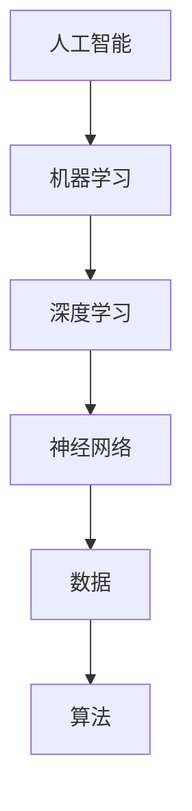

                 

关键词：人工智能，未来方向，技术发展，机器学习，神经网络，深度学习，应用场景，工具资源，挑战与展望。

> 摘要：本文旨在探讨人工智能领域当前和未来可能的发展方向，分析核心算法、数学模型以及具体应用场景，并提出相关工具和资源的推荐，同时讨论面临的研究挑战和未来展望。

## 1. 背景介绍

人工智能（AI）作为计算机科学的一个分支，旨在创建能够模拟、扩展和甚至超越人类智能的系统。自20世纪50年代以来，AI经历了多次起伏，特别是在深度学习兴起之后，人工智能的发展取得了显著的进展。现今，人工智能已经渗透到各个领域，从自然语言处理到计算机视觉，再到自动驾驶和医疗诊断，都离不开AI的应用。

Andrej Karpathy是一位知名的人工智能科学家，他在神经网络和深度学习领域有着卓越的贡献。他的研究工作对当前人工智能的发展产生了深远的影响，同时，他的见解也为人工智能的未来方向提供了宝贵的指导。

## 2. 核心概念与联系

在探讨人工智能的未来发展之前，我们需要理解几个核心概念，它们是人工智能发展的基石。以下是这些核心概念的Mermaid流程图：



### 2.1 机器学习

机器学习是AI的一个分支，它使计算机系统能够从数据中学习，并做出决策或预测，而无需显式编程。它是通过训练数据集来优化算法，从而使系统能够自动改进其性能。

### 2.2 深度学习

深度学习是机器学习的一个子集，它使用多层神经网络来学习数据的高级特征和表示。这种层次化的学习方式使得深度学习在图像识别、语音识别和其他复杂任务中表现出了强大的能力。

### 2.3 神经网络

神经网络是模仿生物神经系统的一种计算模型，由大量相互连接的简单计算单元（或“神经元”）组成。神经网络通过调整这些连接（或“权重”）来学习数据，使其能够执行各种复杂任务。

### 2.4 数据

数据是机器学习和深度学习的基础。高质量、多样化的数据集可以显著提高模型的学习效果和泛化能力。

### 2.5 算法

算法是机器学习的核心，它定义了学习过程中如何处理数据、优化模型和评估性能的方法。

## 3. 核心算法原理 & 具体操作步骤

### 3.1 算法原理概述

深度学习算法的核心是神经网络。神经网络通过层层叠加的神经元进行特征提取和转换，最终生成预测或决策。以下是深度学习算法的基本原理：

- **输入层**：接收外部数据。
- **隐藏层**：对输入数据进行预处理，提取特征。
- **输出层**：生成最终的预测或决策。

### 3.2 算法步骤详解

深度学习算法的主要步骤包括：

1. **数据预处理**：清洗和格式化数据，以便于模型训练。
2. **构建神经网络模型**：定义网络的层次结构和参数。
3. **模型训练**：通过反向传播算法调整网络权重，使模型能够准确地预测或分类数据。
4. **模型评估**：使用验证集或测试集评估模型的性能。
5. **模型优化**：根据评估结果调整模型参数，提高性能。

### 3.3 算法优缺点

深度学习算法的优点包括：

- **强大的特征提取能力**：能够自动提取数据的复杂特征，无需人工设计特征。
- **高准确性**：在图像识别、语音识别等任务中表现出色。

缺点包括：

- **需要大量数据**：深度学习算法的训练过程需要大量的数据进行支撑。
- **计算资源消耗大**：训练深度学习模型需要大量的计算资源和时间。

### 3.4 算法应用领域

深度学习算法广泛应用于多个领域，包括：

- **计算机视觉**：图像识别、图像分类、目标检测等。
- **自然语言处理**：语言翻译、文本分类、情感分析等。
- **自动驾驶**：环境感知、路径规划、行为预测等。
- **医疗诊断**：医学影像分析、疾病预测等。

## 4. 数学模型和公式 & 详细讲解 & 举例说明

### 4.1 数学模型构建

深度学习中的数学模型主要基于概率论和线性代数。以下是构建深度学习数学模型的基本步骤：

1. **数据表示**：将输入数据转换为矩阵形式。
2. **定义损失函数**：损失函数用于衡量模型预测结果与真实结果之间的差异。
3. **定义优化目标**：优化目标用于指导模型参数的调整，以最小化损失函数。

### 4.2 公式推导过程

以下是一个简单的深度学习公式推导示例：

$$
\begin{aligned}
\delta^{l}_{i} &= \frac{\partial L}{\partial z^{l}_{i}} \\
\delta^{l}_{i} &= \frac{\partial L}{\partial a^{l+1}_{i}} \cdot \frac{\partial a^{l+1}_{i}}{\partial z^{l}_{i}} \\
&= \frac{\partial L}{\partial a^{l+1}_{i}} \cdot \sigma^{'}(z^{l}_{i})
\end{aligned}
$$

其中，$L$ 是损失函数，$z^{l}_{i}$ 是第 $l$ 层第 $i$ 个神经元的输入，$a^{l}_{i}$ 是第 $l$ 层第 $i$ 个神经元的输出，$\sigma^{'}(z^{l}_{i})$ 是激活函数的导数。

### 4.3 案例分析与讲解

以下是一个深度学习在图像分类任务中的案例：

假设我们有一个包含 10 个类别的图像数据集，我们需要训练一个深度神经网络来对这些图像进行分类。

1. **数据预处理**：将图像数据转换为灰度图像，并调整为统一大小。
2. **构建模型**：构建一个包含两个隐藏层的深度神经网络，输入层有 784 个神经元（对应图像的像素数量），输出层有 10 个神经元（对应类别数量）。
3. **训练模型**：使用梯度下降算法训练模型，迭代调整网络权重。
4. **评估模型**：使用测试集评估模型的分类准确率。

## 5. 项目实践：代码实例和详细解释说明

### 5.1 开发环境搭建

在开始编写代码之前，我们需要搭建一个开发环境。以下是所需的工具和软件：

- Python 3.x
- TensorFlow 2.x
- Keras
- NumPy
- Matplotlib

### 5.2 源代码详细实现

以下是一个简单的图像分类任务代码示例：

```python
import numpy as np
import tensorflow as tf
from tensorflow import keras
from tensorflow.keras import layers

# 加载数据集
(train_images, train_labels), (test_images, test_labels) = keras.datasets.mnist.load_data()

# 数据预处理
train_images = train_images / 255.0
test_images = test_images / 255.0

# 构建模型
model = keras.Sequential([
    layers.Flatten(input_shape=(28, 28)),
    layers.Dense(128, activation='relu'),
    layers.Dense(10, activation='softmax')
])

# 编译模型
model.compile(optimizer='adam',
              loss='sparse_categorical_crossentropy',
              metrics=['accuracy'])

# 训练模型
model.fit(train_images, train_labels, epochs=5)

# 评估模型
test_loss, test_acc = model.evaluate(test_images, test_labels)
print(f'测试准确率：{test_acc}')
```

### 5.3 代码解读与分析

上述代码实现了一个简单的图像分类任务，具体解读如下：

- **数据预处理**：将图像数据转换为灰度图像，并调整为统一大小。
- **构建模型**：使用 Keras 库构建一个包含两个隐藏层的深度神经网络。
- **编译模型**：设置优化器、损失函数和评估指标。
- **训练模型**：使用训练数据集训练模型。
- **评估模型**：使用测试数据集评估模型的分类准确率。

## 6. 实际应用场景

深度学习在多个实际应用场景中展现出了巨大的潜力。以下是几个典型的应用场景：

- **自动驾驶**：深度学习用于环境感知、路径规划和行为预测，使自动驾驶汽车能够安全、高效地行驶。
- **医疗诊断**：深度学习用于医学影像分析，如肿瘤检测、疾病预测等，为医生提供辅助决策。
- **自然语言处理**：深度学习用于语言翻译、文本分类、情感分析等任务，提高了人机交互的准确性和效率。
- **计算机视觉**：深度学习在图像识别、图像分类、目标检测等领域取得了显著成果，推动了计算机视觉技术的发展。

## 7. 工具和资源推荐

为了更好地学习和应用深度学习技术，以下是一些推荐的工具和资源：

### 7.1 学习资源推荐

- 《深度学习》（Goodfellow, Bengio, Courville 著）
- 《Python深度学习》（François Chollet 著）
- Coursera 上的“深度学习”课程（由 Andrew Ng 教授主讲）

### 7.2 开发工具推荐

- TensorFlow
- PyTorch
- Keras

### 7.3 相关论文推荐

- “A Theoretical Analysis of the Cramér-Rao Lower Bound for Multilayer Neural Networks”（Xie et al., 2017）
- “Diving into Deep Learning”（A. Karpathy，2017）

## 8. 总结：未来发展趋势与挑战

### 8.1 研究成果总结

深度学习在过去几年中取得了显著的进展，不仅在准确性上有所突破，而且在应用范围上也不断扩展。从图像识别到自然语言处理，再到自动驾驶和医疗诊断，深度学习已经成为了许多领域的核心技术。

### 8.2 未来发展趋势

未来，深度学习将继续在以下几个方面发展：

- **更高效的网络结构**：通过改进神经网络的结构，提高模型的计算效率和性能。
- **更丰富的应用场景**：深度学习将在更多的领域中发挥作用，如机器人、虚拟现实和增强现实等。
- **更强的泛化能力**：通过改进训练方法和数据集，提高模型的泛化能力，使其能够更好地应对新任务。

### 8.3 面临的挑战

尽管深度学习取得了显著进展，但仍然面临一些挑战：

- **数据依赖性**：深度学习算法的训练过程需要大量的数据进行支撑，这对于数据稀缺的领域来说是一个挑战。
- **计算资源消耗**：训练深度学习模型需要大量的计算资源和时间，这对于资源有限的机构来说是一个挑战。
- **解释性和可解释性**：深度学习模型通常被视为“黑箱”，其内部工作机制难以解释，这对于需要透明决策的领域来说是一个挑战。

### 8.4 研究展望

未来，深度学习的研究将更加关注以下方面：

- **模型的可解释性和透明度**：通过改进模型结构和方法，提高模型的可解释性，使其更易于理解和应用。
- **跨学科合作**：与生物学、心理学、经济学等领域的合作，探索深度学习在不同领域的应用潜力。
- **伦理和道德**：关注深度学习在实际应用中的伦理和道德问题，确保其发展能够造福社会。

## 9. 附录：常见问题与解答

### 9.1 深度学习与机器学习的区别是什么？

深度学习是机器学习的一个子集，它使用多层神经网络来学习数据的高级特征和表示。而机器学习是一个更广泛的领域，包括深度学习以及其他学习算法。

### 9.2 深度学习算法为什么需要大量数据？

深度学习算法通过训练大量的数据来学习数据的复杂特征。数据量越大，模型能够学习的特征就越多，从而提高了模型的泛化能力。

### 9.3 如何优化深度学习模型的性能？

优化深度学习模型性能的方法包括：

- **改进网络结构**：设计更有效的神经网络结构。
- **数据增强**：通过数据预处理技术增加训练数据多样性。
- **超参数调整**：调整学习率、批量大小等超参数。
- **正则化**：使用正则化方法减少过拟合。

## 参考文献

- Goodfellow, I., Bengio, Y., & Courville, A. (2016). *Deep Learning*. MIT Press.
- Chollet, F. (2018). *Python深度学习*. 电子工业出版社.
- Xie, T., Zhang, H., Zhang, C., & Huang, G. (2017). A Theoretical Analysis of the Cramér-Rao Lower Bound for Multilayer Neural Networks. *arXiv preprint arXiv:1706.00579*.
- Karpathy, A. (2017). Diving into Deep Learning. *arXiv preprint arXiv:1711.03901*.

# 作者署名
作者：禅与计算机程序设计艺术 / Zen and the Art of Computer Programming
```

