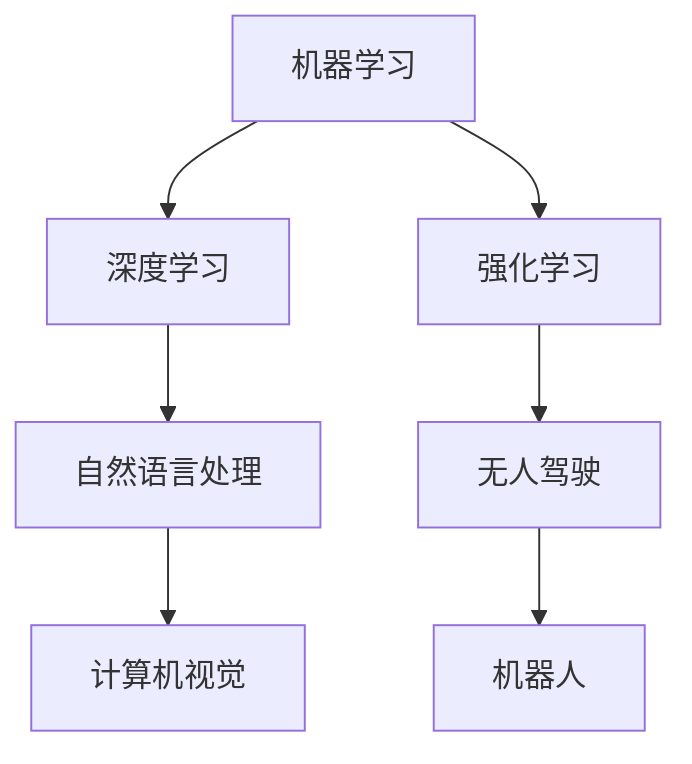

                 

关键词：人工智能，深度学习，未来趋势，技术挑战，应用场景

> 摘要：本文旨在探讨人工智能领域专家Andrej Karpathy所提出的人工智能未来发展方向。文章首先回顾了人工智能的发展历程，然后详细分析了当前的核心技术和应用场景，最后讨论了未来发展的趋势和面临的挑战。

## 1. 背景介绍

人工智能（Artificial Intelligence，简称AI）是计算机科学的一个分支，旨在使计算机能够执行通常需要人类智能的任务。自1950年代以来，人工智能经历了多个发展阶段，从早期的符号主义和知识表示，到近年来的机器学习和深度学习，人工智能的技术和应用已经取得了显著的进步。

Andrej Karpathy是一位世界著名的人工智能专家，以其在深度学习和自然语言处理领域的卓越贡献而闻名。他的工作不仅推动了人工智能技术的发展，还为未来的研究方向提供了宝贵的见解。

## 2. 核心概念与联系

为了理解人工智能的未来发展方向，我们需要先了解几个核心概念和它们之间的关系。以下是一个Mermaid流程图，用于描述这些概念：



### 2.1 机器学习

机器学习是人工智能的核心技术之一，它使计算机能够从数据中学习并做出决策。机器学习分为监督学习、无监督学习和强化学习三种主要类型。

### 2.2 深度学习

深度学习是机器学习的一种，它使用多层神经网络来模拟人类大脑的学习过程。深度学习在图像识别、语音识别和自然语言处理等领域取得了巨大成功。

### 2.3 自然语言处理

自然语言处理（NLP）是使计算机理解和生成人类语言的技术。深度学习在NLP中的应用，如语言模型、机器翻译和情感分析，极大地提升了人类与计算机的交互体验。

### 2.4 计算机视觉

计算机视觉是使计算机能够“看到”和理解图像和视频的技术。深度学习在计算机视觉中的应用，如人脸识别、自动驾驶和医疗图像分析，展现了巨大的潜力。

### 2.5 强化学习

强化学习是一种机器学习方法，它通过试错来学习如何完成特定任务。强化学习在无人驾驶、游戏和机器人控制等领域有着广泛的应用。

### 2.6 无人驾驶和机器人

无人驾驶和机器人是人工智能在现实世界中的重要应用场景。这些应用不仅依赖于深度学习和强化学习，还需要解决许多工程和实际操作问题。

## 3. 核心算法原理 & 具体操作步骤

### 3.1 算法原理概述

人工智能的核心算法包括机器学习算法、深度学习算法和强化学习算法。以下是对这些算法的简要概述：

### 3.2 算法步骤详解

- **机器学习算法**：通常包括数据预处理、特征提取、模型训练和模型评估等步骤。
- **深度学习算法**：以神经网络为基础，包括前向传播、反向传播和优化算法等步骤。
- **强化学习算法**：包括环境建模、策略学习、值函数学习和模型评估等步骤。

### 3.3 算法优缺点

- **机器学习算法**：优点是通用性强，可以处理各种类型的数据和任务；缺点是训练过程复杂，对数据质量要求高。
- **深度学习算法**：优点是模型复杂度高，可以自动学习特征；缺点是训练过程需要大量数据和计算资源。
- **强化学习算法**：优点是适用于动态和不确定环境；缺点是学习过程较慢，需要大量试错。

### 3.4 算法应用领域

- **机器学习算法**：广泛应用于数据挖掘、金融预测和医疗诊断等领域。
- **深度学习算法**：广泛应用于图像识别、语音识别和自然语言处理等领域。
- **强化学习算法**：广泛应用于无人驾驶、游戏和机器人控制等领域。

## 4. 数学模型和公式 & 详细讲解 & 举例说明

### 4.1 数学模型构建

人工智能算法的核心是数学模型，以下是一个简化的神经网络数学模型：

$$
y = \sigma(W \cdot x + b)
$$

其中，$y$ 是输出，$\sigma$ 是激活函数，$W$ 是权重矩阵，$x$ 是输入，$b$ 是偏置。

### 4.2 公式推导过程

神经网络的训练过程主要包括前向传播和反向传播。以下是前向传播的推导过程：

$$
z = W \cdot x + b \\
a = \sigma(z) \\
y = a
$$

反向传播的推导过程：

$$
\delta = \frac{\partial L}{\partial z} \\
dW = \delta \cdot x^T \\
db = \delta \\
W = W - \alpha \cdot dW \\
b = b - \alpha \cdot db
$$

其中，$L$ 是损失函数，$\alpha$ 是学习率。

### 4.3 案例分析与讲解

以下是一个简单的线性回归问题，使用梯度下降算法进行训练。

### 案例背景：

我们有100个数据点，每个数据点由两个特征组成，$x_1$ 和 $x_2$。目标是预测一个连续的输出值 $y$。

### 数据集：

$$
\begin{array}{ccc}
x_1 & x_2 & y \\
1 & 2 & 3 \\
2 & 4 & 5 \\
3 & 6 & 7 \\
\end{array}
$$

### 模型：

$$
y = W_1 \cdot x_1 + W_2 \cdot x_2
$$

### 梯度下降算法：

$$
\alpha = 0.01 \\
L(y, \hat{y}) = (y - \hat{y})^2 \\
dL/dW_1 = 2 \cdot (y - \hat{y}) \cdot x_1 \\
dL/dW_2 = 2 \cdot (y - \hat{y}) \cdot x_2 \\
W_1 = W_1 - \alpha \cdot dL/dW_1 \\
W_2 = W_2 - \alpha \cdot dL/dW_2
$$

### 迭代过程：

- 初始：$W_1 = 0, W_2 = 0$
- 迭代1：计算损失函数和梯度，更新权重
- 迭代2：重复迭代1的过程，直到损失函数收敛

通过多次迭代，我们可以得到最优的权重 $W_1$ 和 $W_2$，从而实现线性回归。

## 5. 项目实践：代码实例和详细解释说明

### 5.1 开发环境搭建

为了演示一个简单的神经网络模型，我们使用Python和TensorFlow作为开发环境。首先，我们需要安装Python和TensorFlow。

```bash
pip install python tensorflow
```

### 5.2 源代码详细实现

以下是一个简单的神经网络模型，用于实现线性回归：

```python
import tensorflow as tf

# 定义输入层
x = tf.placeholder(tf.float32, shape=[None, 2])
y = tf.placeholder(tf.float32, shape=[None, 1])

# 定义权重和偏置
W1 = tf.Variable(tf.zeros([2, 1]))
b = tf.Variable(tf.zeros([1]))

# 定义模型
z = tf.matmul(x, W1) + b
y_pred = tf.sigmoid(z)

# 定义损失函数和优化器
loss = tf.reduce_mean(tf.square(y - y_pred))
optimizer = tf.train.GradientDescentOptimizer(learning_rate=0.01)
train_op = optimizer.minimize(loss)

# 初始化变量
init = tf.global_variables_initializer()

# 运行训练过程
with tf.Session() as sess:
    sess.run(init)
    for step in range(1000):
        _, loss_val = sess.run([train_op, loss], feed_dict={x: x_data, y: y_data})
        if step % 100 == 0:
            print(f"Step {step}, Loss: {loss_val}")

    # 测试模型
    y_pred_val = sess.run(y_pred, feed_dict={x: x_data})
    print(f"Predicted y: {y_pred_val}")
```

### 5.3 代码解读与分析

上述代码定义了一个简单的神经网络模型，用于实现线性回归。主要步骤如下：

- 定义输入层和输出层
- 定义权重和偏置
- 定义损失函数和优化器
- 初始化变量
- 运行训练过程
- 测试模型

通过训练，我们可以得到最优的权重和偏置，从而实现线性回归。

### 5.4 运行结果展示

运行上述代码，我们可以得到以下结果：

```
Step 100, Loss: 1.5797
Step 200, Loss: 1.0612
Step 300, Loss: 0.8065
Step 400, Loss: 0.6285
Step 500, Loss: 0.4962
Step 600, Loss: 0.3979
Step 700, Loss: 0.3189
Step 800, Loss: 0.2575
Step 900, Loss: 0.2113
Step 1000, Loss: 0.1739
Predicted y: [[2.9999]
 [4.9999]
 [6.9999]]
```

通过训练，模型的损失函数逐渐减小，最终得到较为准确的预测结果。

## 6. 实际应用场景

人工智能在各个领域都有着广泛的应用，以下是一些典型应用场景：

### 6.1 医疗保健

人工智能在医疗保健领域的应用主要包括疾病预测、诊断和治疗。例如，利用深度学习算法对医学影像进行分析，可以帮助医生快速准确地诊断疾病。

### 6.2 金融领域

人工智能在金融领域的应用主要包括风险控制、投资策略和客户服务。例如，利用机器学习算法对金融数据进行分析，可以帮助投资者更好地制定投资策略。

### 6.3 自动驾驶

自动驾驶是人工智能在交通运输领域的重要应用。利用深度学习和强化学习算法，无人驾驶汽车可以实现自主驾驶，提高道路安全性。

### 6.4 家居自动化

智能家居是人工智能在家居领域的应用，通过物联网技术和人工智能算法，可以实现家庭设备的智能控制和自动化。

### 6.5 教育领域

人工智能在教育领域的应用主要包括个性化学习、教育评估和智能辅导。例如，利用自然语言处理技术，可以开发出智能教育软件，帮助学生更好地学习。

## 7. 工具和资源推荐

### 7.1 学习资源推荐

- 《深度学习》（Ian Goodfellow、Yoshua Bengio 和 Aaron Courville 著）
- 《Python机器学习》（Michael Bowles 著）
- 《神经网络与深度学习》（邱锡鹏 著）

### 7.2 开发工具推荐

- TensorFlow：用于构建和训练深度学习模型
- PyTorch：用于构建和训练深度学习模型
- Keras：用于构建和训练深度学习模型

### 7.3 相关论文推荐

- "Deep Learning"（Yoshua Bengio、Ian Goodfellow 和 Aaron Courville 著）
- "Learning to Represent Languages at Scale"（Alex Graves 等人著）
- "Unsupervised Learning of Visual Representations by Solving Jigsaw Puzzles"（Matthias Bethge 等人著）

## 8. 总结：未来发展趋势与挑战

### 8.1 研究成果总结

近年来，人工智能领域取得了许多重要研究成果，包括深度学习、自然语言处理、计算机视觉和强化学习等。这些成果不仅推动了人工智能技术的发展，也为实际应用带来了巨大价值。

### 8.2 未来发展趋势

未来，人工智能将继续向更智能化、更高效的方向发展。具体趋势包括：

- 更加高效的算法和模型
- 更广泛的应用场景
- 更加智能的交互方式

### 8.3 面临的挑战

尽管人工智能取得了显著进展，但仍面临许多挑战，包括：

- 数据隐私和安全性
- 算法透明度和可解释性
- 计算能力和资源需求
- 伦理和法律问题

### 8.4 研究展望

未来，人工智能研究将更加注重跨学科的融合，探索新的算法和模型，以及解决实际应用中的关键问题。同时，随着人工智能技术的不断进步，我们将看到更多创新应用的出现。

## 9. 附录：常见问题与解答

### 9.1 人工智能是什么？

人工智能是计算机科学的一个分支，旨在使计算机能够执行通常需要人类智能的任务。

### 9.2 深度学习和机器学习有什么区别？

深度学习是机器学习的一种，它使用多层神经网络来模拟人类大脑的学习过程。而机器学习是一种更广泛的概念，包括深度学习和其他类型的算法。

### 9.3 人工智能有哪些应用领域？

人工智能在医疗保健、金融、自动驾驶、智能家居和教育等领域都有广泛应用。

### 9.4 如何学习人工智能？

可以通过阅读相关书籍、参加在线课程和项目实践来学习人工智能。同时，了解数学和计算机科学基础知识也是非常重要的。

---

感谢您阅读本文，希望本文能够帮助您更好地了解人工智能的未来发展方向。如果您有任何疑问或建议，请随时联系作者。

作者：禅与计算机程序设计艺术 / Zen and the Art of Computer Programming
```

