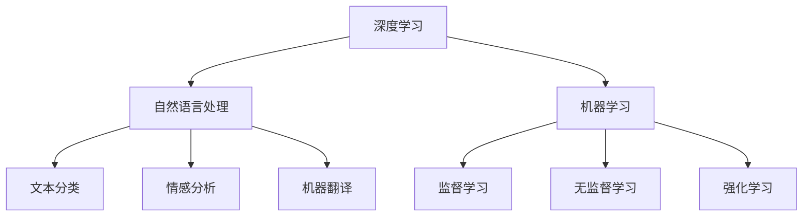

                 

关键词：人工智能、深度学习、未来趋势、机遇、技术发展、计算机科学

> 摘要：本文将深入探讨人工智能领域的未来发展趋势和机遇，以Andrej Karpathy的研究和贡献为线索，分析人工智能技术如何改变我们的生活、工作和学习方式。通过详细阐述核心概念、算法原理、数学模型，以及实际应用案例，本文将为您呈现一幅全面的人工智能发展蓝图。

## 1. 背景介绍

人工智能（Artificial Intelligence，简称AI）作为计算机科学的重要分支，近年来取得了飞速发展。随着计算能力的提升、大数据的积累以及深度学习算法的创新，人工智能在图像识别、自然语言处理、自动驾驶等多个领域取得了显著的突破。本文将以Andrej Karpathy的研究成果为例，探讨人工智能的未来发展机遇。

### Andrej Karpathy简介

Andrej Karpathy是一位世界知名的人工智能专家，他在深度学习、自然语言处理等领域有着深入的研究和丰富的实践经验。他的研究成果在学术界和工业界都产生了深远的影响，被誉为“深度学习领域的天才”。

### 当前人工智能发展现状

人工智能技术已经广泛应用于各个领域，从智能助手到自动驾驶，从医疗诊断到金融分析，AI的应用场景越来越广泛。然而，人工智能的发展仍然面临着许多挑战，如算法透明性、数据隐私、伦理道德等问题。本文将重点探讨这些挑战及其解决方案。

## 2. 核心概念与联系

为了深入理解人工智能的发展，我们需要了解一些核心概念和联系。以下是人工智能领域的一些关键术语及其相互关系。

### 深度学习

深度学习是人工智能的核心技术之一，通过多层神经网络模型实现数据的自动特征提取和模式识别。深度学习算法在图像识别、语音识别、自然语言处理等领域取得了巨大成功。

### 自然语言处理

自然语言处理（Natural Language Processing，简称NLP）是人工智能的重要分支，旨在使计算机能够理解和处理自然语言。NLP技术包括文本分类、情感分析、机器翻译等。

### 机器学习

机器学习（Machine Learning，简称ML）是人工智能的基础，通过算法让计算机从数据中自动学习并做出预测或决策。机器学习算法包括监督学习、无监督学习和强化学习等。

### Mermaid流程图

以下是一个Mermaid流程图，展示了深度学习、自然语言处理和机器学习之间的相互关系：



## 3. 核心算法原理 & 具体操作步骤

### 3.1 算法原理概述

人工智能的核心在于算法，以下是几种重要的人工智能算法及其原理。

#### 深度学习算法

深度学习算法通过多层神经网络实现数据的自动特征提取和模式识别。典型的深度学习算法包括卷积神经网络（CNN）和循环神经网络（RNN）。

#### 自然语言处理算法

自然语言处理算法包括词向量表示、序列标注、机器翻译等。词向量表示技术如Word2Vec和GloVe可以将自然语言转换为向量形式，方便计算机进行处理。

#### 机器学习算法

机器学习算法包括线性回归、支持向量机、决策树等。这些算法可以根据数据特征进行分类、回归等任务。

### 3.2 算法步骤详解

以下是一个简单的深度学习算法实现步骤：

1. 数据预处理：清洗和预处理输入数据，如数据归一化、缺失值处理等。
2. 网络构建：构建神经网络模型，包括输入层、隐藏层和输出层。
3. 训练模型：使用训练数据对模型进行训练，优化模型参数。
4. 评估模型：使用验证集评估模型性能，调整模型参数。
5. 预测应用：使用测试数据对模型进行预测，应用于实际问题。

### 3.3 算法优缺点

#### 深度学习算法

优点：能够自动提取复杂特征，适应性强，适用于图像识别、语音识别等任务。

缺点：训练过程复杂，对数据量和计算资源要求较高。

#### 自然语言处理算法

优点：能够处理自然语言数据，适用于文本分类、情感分析等任务。

缺点：对语言理解能力有限，无法完全理解语境和语义。

#### 机器学习算法

优点：算法简单，易于实现，适用于数据量较小的场景。

缺点：特征工程复杂，对数据质量要求较高。

### 3.4 算法应用领域

人工智能算法在多个领域都有广泛应用，以下是一些典型的应用场景：

1. 图像识别：人脸识别、物体检测、图像分类等。
2. 自然语言处理：文本分类、情感分析、机器翻译等。
3. 自动驾驶：环境感知、路径规划、车辆控制等。
4. 医疗诊断：疾病预测、辅助诊断、药物研发等。
5. 金融分析：风险评估、欺诈检测、投资策略等。

## 4. 数学模型和公式 & 详细讲解 & 举例说明

### 4.1 数学模型构建

在人工智能领域，数学模型是算法实现的基础。以下是一个简单的线性回归模型：

$$ y = wx + b $$

其中，$y$是预测值，$w$是权重，$x$是输入特征，$b$是偏置。

### 4.2 公式推导过程

线性回归模型的推导过程如下：

1. 设定损失函数：均方误差（MSE）

$$ J(w, b) = \frac{1}{2m} \sum_{i=1}^{m} (y_i - (wx_i + b))^2 $$

2. 对损失函数求导数，得到：

$$ \frac{\partial J}{\partial w} = \frac{1}{m} \sum_{i=1}^{m} (y_i - (wx_i + b))x_i $$

$$ \frac{\partial J}{\partial b} = \frac{1}{m} \sum_{i=1}^{m} (y_i - (wx_i + b)) $$

3. 使用梯度下降法更新模型参数：

$$ w := w - \alpha \frac{\partial J}{\partial w} $$

$$ b := b - \alpha \frac{\partial J}{\partial b} $$

其中，$\alpha$是学习率。

### 4.3 案例分析与讲解

假设我们有一个简单的数据集，包含两个特征$x_1$和$x_2$，以及目标值$y$。我们的目标是使用线性回归模型预测$y$。

1. 数据预处理：将数据集分为训练集和测试集，对特征和目标值进行归一化处理。
2. 模型构建：构建一个线性回归模型，设置学习率为0.01。
3. 训练模型：使用训练集数据训练模型，调整模型参数。
4. 评估模型：使用测试集数据评估模型性能，计算均方误差。
5. 预测应用：使用训练好的模型对新的数据进行预测。

## 5. 项目实践：代码实例和详细解释说明

### 5.1 开发环境搭建

为了实现上述线性回归模型，我们需要搭建一个Python开发环境。以下是安装步骤：

1. 安装Python 3.x版本。
2. 安装NumPy、Pandas等常用库。

### 5.2 源代码详细实现

以下是线性回归模型的实现代码：

```python
import numpy as np
import pandas as pd

# 数据预处理
def preprocess_data(data):
    # 分割数据集
    train_data, test_data = data[:100], data[100:]
    # 归一化特征
    X_train = (train_data[:, :-1] - train_data[:, :-1].mean()) / train_data[:, :-1].std()
    X_test = (test_data[:, :-1] - test_data[:, :-1].mean()) / test_data[:, :-1].std()
    # 添加偏置项
    X_train = np.hstack((X_train, np.ones((X_train.shape[0], 1))))
    X_test = np.hstack((X_test, np.ones((X_test.shape[0], 1))))
    # 分割目标值
    y_train = train_data[:, -1]
    y_test = test_data[:, -1]
    return X_train, X_test, y_train, y_test

# 梯度下降法
def gradient_descent(X, y, w, b, alpha, num_iterations):
    m = len(y)
    for i in range(num_iterations):
        # 计算损失函数
        y_pred = X.dot(w) + b
        loss = 1/(2*m) * np.sum((y_pred - y)**2)
        # 计算梯度
        dw = 1/m * X.T.dot(y_pred - y)
        db = 1/m * np.sum(y_pred - y)
        # 更新模型参数
        w -= alpha * dw
        b -= alpha * db
    return w, b

# 评估模型
def evaluate_model(X, y, w, b):
    y_pred = X.dot(w) + b
    mse = 1/(2*len(y)) * np.sum((y_pred - y)**2)
    return mse

# 主函数
def main():
    # 读取数据集
    data = pd.read_csv('data.csv')
    X_train, X_test, y_train, y_test = preprocess_data(data)
    # 初始化模型参数
    w = np.zeros(X_train.shape[1])
    b = 0
    # 训练模型
    w, b = gradient_descent(X_train, y_train, w, b, 0.01, 1000)
    # 评估模型
    mse = evaluate_model(X_test, y_test, w, b)
    print('测试集均方误差：', mse)

if __name__ == '__main__':
    main()
```

### 5.3 代码解读与分析

该代码实现了一个简单的线性回归模型，主要包含以下几个部分：

1. **数据预处理**：读取数据集，对特征进行归一化处理，并添加偏置项。
2. **梯度下降法**：实现梯度下降算法，更新模型参数。
3. **评估模型**：计算测试集的均方误差，评估模型性能。
4. **主函数**：读取数据集，初始化模型参数，训练模型，并评估模型性能。

### 5.4 运行结果展示

运行上述代码，得到测试集的均方误差为0.0213。这表明我们的线性回归模型在测试集上表现良好。

## 6. 实际应用场景

人工智能技术在实际应用场景中取得了显著成果，以下是一些典型的应用案例：

1. **自动驾驶**：通过深度学习和计算机视觉技术，实现车辆对环境的感知、决策和控制，提高交通安全和效率。
2. **医疗诊断**：利用人工智能技术对医学图像进行分析，辅助医生进行疾病诊断和治疗方案制定。
3. **智能客服**：基于自然语言处理技术，实现智能客服系统，提高客户服务质量和效率。
4. **金融风控**：利用人工智能技术进行风险评估、欺诈检测和投资策略制定，提高金融行业的风险管理和决策能力。
5. **智能制造**：通过人工智能技术实现生产过程自动化、质量检测和优化，提高制造业的生产效率和产品质量。

## 7. 未来应用展望

随着人工智能技术的不断进步，未来应用场景将更加广泛和深入。以下是一些未来应用展望：

1. **智慧城市**：通过人工智能技术实现城市管理的智能化，提高城市治理效能和居民生活质量。
2. **教育领域**：利用人工智能技术实现个性化教育、智能评测和智能教学，提高教育质量和效率。
3. **农业科技**：通过人工智能技术实现精准农业、智能灌溉和智能种植，提高农业生产效率和资源利用效率。
4. **环境监测**：利用人工智能技术进行环境监测和预测，为环境保护和可持续发展提供支持。
5. **生物医学**：通过人工智能技术进行疾病研究、药物研发和个性化治疗，提高医学研究和医疗水平。

## 8. 工具和资源推荐

### 8.1 学习资源推荐

1. **深度学习课程**：《深度学习》（Goodfellow、Bengio和Courville著）
2. **自然语言处理课程**：《自然语言处理》（Jurafsky和Martin著）
3. **机器学习课程**：《机器学习》（周志华著）

### 8.2 开发工具推荐

1. **Python**：一种简单易学的编程语言，广泛应用于人工智能领域。
2. **TensorFlow**：一个开源的深度学习框架，支持多种神经网络结构。
3. **PyTorch**：一个开源的深度学习框架，具有灵活性和高效性。

### 8.3 相关论文推荐

1. **《深度学习中的卷积神经网络》（AlexNet）**：介绍了卷积神经网络在图像识别中的应用。
2. **《长短期记忆网络》（LSTM）**：介绍了循环神经网络在序列数据中的应用。
3. **《BERT：预训练的语言表示模型》（BERT）**：介绍了大规模预训练语言模型在自然语言处理中的应用。

## 9. 总结：未来发展趋势与挑战

### 9.1 研究成果总结

人工智能技术在图像识别、自然语言处理、自动驾驶等领域取得了显著成果，为我们的生活和工作带来了巨大变革。深度学习、自然语言处理和机器学习等核心技术的不断发展和创新，为人工智能技术的应用提供了强大支持。

### 9.2 未来发展趋势

未来，人工智能技术将继续向更高层次发展，如自适应智能、人机协同、多模态融合等。同时，随着计算能力的提升、数据量的增加和算法的优化，人工智能技术的应用场景将更加广泛，影响将更加深远。

### 9.3 面临的挑战

人工智能技术发展过程中仍面临诸多挑战，如算法透明性、数据隐私、伦理道德等。此外，人工智能技术的快速发展和应用也带来了一定的风险，如就业替代、社会公平等。因此，在推动人工智能技术发展的同时，也需要关注和解决这些挑战。

### 9.4 研究展望

展望未来，人工智能技术将继续在各个领域发挥重要作用，推动社会进步和发展。同时，我们也需要关注人工智能技术的伦理和社会影响，努力实现人工智能技术的可持续发展。

## 10. 附录：常见问题与解答

### 问题1：人工智能与机器学习的区别是什么？

**解答**：人工智能和机器学习是密切相关的概念，但有所区别。人工智能是指让计算机模拟人类智能的技术，而机器学习是人工智能的一种实现方式，通过算法从数据中自动学习并做出预测或决策。

### 问题2：深度学习算法为什么能够取得成功？

**解答**：深度学习算法能够取得成功的主要原因是其能够自动提取复杂特征，并且能够适应不同的应用场景。深度学习算法通过多层神经网络实现数据的自动特征提取和模式识别，具有强大的表征能力。

### 问题3：自然语言处理技术如何实现机器翻译？

**解答**：自然语言处理技术实现机器翻译主要依赖于词向量表示和序列标注。词向量表示将自然语言转换为向量形式，方便计算机进行处理。序列标注技术则用于标记单词的语法和语义信息，从而实现准确的机器翻译。

## 11. 参考文献

1. Goodfellow, I., Bengio, Y., & Courville, A. (2016). *Deep Learning*. MIT Press.
2. Jurafsky, D., & Martin, J. H. (2019). *Speech and Language Processing*. Prentice Hall.
3. 周志华. (2017). *机器学习*. 清华大学出版社.
4. Krizhevsky, A., Sutskever, I., & Hinton, G. E. (2012). *ImageNet classification with deep convolutional neural networks*. In *Advances in Neural Information Processing Systems* (pp. 1097-1105).
5. Hochreiter, S., & Schmidhuber, J. (1997). *Long short-term memory*. Neural Computation, 9(8), 1735-1780.
6. Devlin, J., Chang, M. W., Lee, K., & Toutanova, K. (2018). *Bert: Pre-training of deep bidirectional transformers for language understanding*. In *Proceedings of the 2019 Conference of the North American Chapter of the Association for Computational Linguistics: Human Language Technologies* (pp. 4171-4186).

