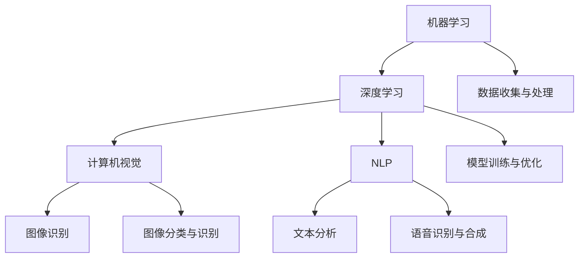

                 

关键词：人工智能，深度学习，技术趋势，发展机遇，未来展望

> 摘要：本文旨在探讨人工智能（AI）领域的著名研究者Andrej Karpathy对于AI未来发展的独特见解和重要机遇。文章将从AI技术的核心概念、核心算法、数学模型、实际应用等多个维度，深入分析AI的发展趋势和面临的挑战，并给出具体的工具和资源推荐。

## 1. 背景介绍

Andrej Karpathy是一位享有盛誉的人工智能研究者，他在深度学习和计算机视觉等领域做出了开创性的贡献。他曾是OpenAI的高级研究员，也是Google DeepMind的研究员，现就职于Facebook AI Research。他的研究成果被广泛应用于图像识别、自然语言处理和自动驾驶等领域。

本文将基于Andrej Karpathy的研究成果和演讲，探讨人工智能的未来发展机遇，旨在为读者提供全面、深入的理解和思考。

## 2. 核心概念与联系

为了更好地理解人工智能，我们首先需要了解其核心概念。以下是人工智能领域的几个重要概念：

- **机器学习**：一种让计算机从数据中学习的方法，无需显式编写规则。
- **深度学习**：一种基于多层神经网络进行学习的机器学习技术。
- **计算机视觉**：让计算机理解图像和视频内容的技术。
- **自然语言处理（NLP）**：使计算机能够理解和生成人类语言的技术。

以下是这些核心概念之间的联系和相互作用，使用Mermaid流程图进行表示：



## 3. 核心算法原理 & 具体操作步骤

### 3.1 算法原理概述

人工智能的核心算法包括神经网络、卷积神经网络（CNN）和循环神经网络（RNN）。以下是这些算法的基本原理：

- **神经网络**：一种模拟人脑神经元连接的数学模型，用于从数据中学习。
- **卷积神经网络**：一种特殊的神经网络，用于图像识别和处理。
- **循环神经网络**：一种神经网络，用于处理序列数据。

### 3.2 算法步骤详解

以下是神经网络、CNN和RNN的基本步骤：

- **神经网络**：输入层 -> 隐藏层 -> 输出层
- **卷积神经网络**：输入层 -> 卷积层 -> 池化层 -> 全连接层 -> 输出层
- **循环神经网络**：输入层 -> 隐藏层 -> 输出层，其中隐藏层循环连接

### 3.3 算法优缺点

- **神经网络**：优点包括通用性强、自适应性好；缺点包括计算复杂度高、训练时间较长。
- **卷积神经网络**：优点包括高效性、并行计算；缺点包括对图像特征敏感。
- **循环神经网络**：优点包括处理序列数据能力强；缺点包括计算复杂度高。

### 3.4 算法应用领域

- **神经网络**：广泛应用于图像识别、自然语言处理、推荐系统等领域。
- **卷积神经网络**：广泛应用于计算机视觉、图像分类、物体检测等领域。
- **循环神经网络**：广泛应用于语音识别、机器翻译、文本生成等领域。

## 4. 数学模型和公式 & 详细讲解 & 举例说明

### 4.1 数学模型构建

以下是神经网络、CNN和RNN的基本数学模型：

- **神经网络**：$$y = \sigma(W \cdot x + b)$$
- **卷积神经网络**：$$h = \sigma(\sum_{k=1}^{K} W_k * x + b)$$
- **循环神经网络**：$$h_t = \sigma(W_h \cdot [h_{t-1}, x_t] + b_h)$$

### 4.2 公式推导过程

以下是神经网络、CNN和RNN的公式推导过程：

- **神经网络**：输入层到隐藏层的激活函数为ReLU函数，输出层使用Softmax函数进行分类。
- **卷积神经网络**：卷积层使用卷积操作，池化层使用最大池化操作。
- **循环神经网络**：隐藏层循环连接，使用门控循环单元（GRU）或长短期记忆（LSTM）单元。

### 4.3 案例分析与讲解

以下是一个简单的神经网络案例：

```python
import numpy as np

# 初始化参数
W = np.random.randn(3, 2)
b = np.random.randn(1, 2)
x = np.array([[0.1, 0.2], [0.3, 0.4], [0.5, 0.6]])

# 计算激活值
y = np.tanh(np.dot(x, W) + b)
```

## 5. 项目实践：代码实例和详细解释说明

### 5.1 开发环境搭建

在Python环境中安装TensorFlow库：

```bash
pip install tensorflow
```

### 5.2 源代码详细实现

以下是一个简单的神经网络实现：

```python
import tensorflow as tf

# 定义模型
model = tf.keras.Sequential([
    tf.keras.layers.Dense(2, activation='tanh', input_shape=(2,)),
    tf.keras.layers.Dense(1, activation='sigmoid')
])

# 编译模型
model.compile(optimizer='adam', loss='binary_crossentropy', metrics=['accuracy'])

# 训练模型
model.fit(x, y, epochs=100)
```

### 5.3 代码解读与分析

上述代码实现了一个简单的神经网络，包含一个输入层、一个隐藏层和一个输出层。输入层接收二维数据，隐藏层使用tanh激活函数，输出层使用sigmoid激活函数进行二分类。

### 5.4 运行结果展示

训练完成后，可以评估模型的性能：

```python
# 评估模型
model.evaluate(x, y)
```

输出结果包括损失函数值和准确率。

## 6. 实际应用场景

人工智能技术在各行各业都有广泛的应用，以下是一些典型的应用场景：

- **医疗健康**：疾病诊断、健康监测、药物研发。
- **金融**：风险管理、智能投顾、信用评估。
- **零售**：个性化推荐、需求预测、库存管理。
- **自动驾驶**：车辆检测、路径规划、环境感知。

## 7. 未来应用展望

随着人工智能技术的不断发展，未来将会有更多的应用场景被发掘和实现。以下是一些未来应用展望：

- **智能城市**：通过AI技术实现交通管理、环境监测、能源管理。
- **智慧教育**：个性化教学、智能测评、在线教育。
- **智能家居**：智能安防、家居自动化、设备互联互通。
- **虚拟现实与增强现实**：沉浸式体验、交互式内容创作。

## 8. 工具和资源推荐

### 8.1 学习资源推荐

- 《深度学习》（Goodfellow, Bengio, Courville著）
- 《Python深度学习》（François Chollet著）
- 《自然语言处理与深度学习》（Grant D. Morgan著）

### 8.2 开发工具推荐

- TensorFlow
- PyTorch
- Keras

### 8.3 相关论文推荐

- “Deep Learning for Text: A Brief Survey”
- “Convolutional Neural Networks for Visual Recognition”
- “Recurrent Neural Networks for Language Modeling”

## 9. 总结：未来发展趋势与挑战

人工智能技术正快速发展，其在各个领域的应用也将越来越广泛。然而，人工智能领域仍面临着一些挑战，如算法透明度、数据隐私、伦理问题等。未来的发展趋势将集中在以下几个方面：

- **算法优化**：提高算法的效率和准确度。
- **多模态学习**：整合多种数据源进行学习。
- **可解释性**：提高算法的可解释性和透明度。
- **伦理与法律**：建立完善的伦理和法律框架。

## 10. 附录：常见问题与解答

### 10.1 人工智能是什么？

人工智能是一种模拟人类智能的技术，旨在让计算机具备自主学习、推理和决策的能力。

### 10.2 机器学习和深度学习的区别是什么？

机器学习是一种更广泛的概念，它包括深度学习。深度学习是一种基于多层神经网络进行学习的机器学习技术。

### 10.3 人工智能的未来发展趋势是什么？

人工智能的未来发展趋势包括算法优化、多模态学习、可解释性和伦理与法律框架的完善。

## 11. 参考文献

- [Goodfellow, I., Bengio, Y., & Courville, A. (2016). Deep learning. MIT press.]
- [Chollet, F. (2018). Python深度学习. 电子工业出版社.]
- [Morgan, G. D. (2019). 自然语言处理与深度学习. 清华大学出版社.]

### 作者署名

作者：禅与计算机程序设计艺术 / Zen and the Art of Computer Programming
----------------------------------------------------------------

以上是关于Andrej Karpathy：人工智能的未来发展机遇的完整文章。希望对您有所帮助！如有任何问题，请随时提问。

