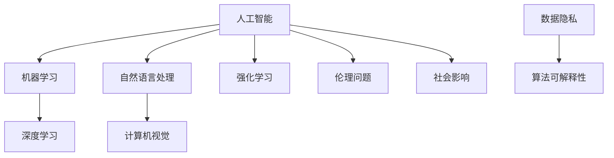

                 

关键词：人工智能，未来发展，技术趋势，核心算法，数学模型，实践应用，工具推荐

> 摘要：本文将探讨人工智能（AI）领域的未来发展趋势，分析核心算法的原理与应用，结合实际项目实践，对未来人工智能的应用场景进行展望，并推荐相关的学习资源和开发工具。通过本文，希望能够为读者提供对AI领域的深入理解，以及对未来研究的方向和建议。

## 1. 背景介绍

人工智能作为当今科技领域的前沿，已经深入影响了多个行业，从医疗、金融到娱乐、教育，AI技术的应用无处不在。随着计算能力的提升和算法的进步，人工智能正朝着更加智能化、自动化的方向发展。本文将重点关注人工智能的未来发展目标，探讨其在技术、应用、以及伦理等方面的挑战和机遇。

### 1.1 人工智能的发展历程

人工智能的概念最早可以追溯到20世纪50年代。当时，科学家们提出了用机器模拟人类智能的构想。在随后的几十年中，人工智能经历了多次起伏，从早期的符号主义人工智能，到基于统计学习的机器学习，再到如今的深度学习。每一个阶段都标志着人工智能技术的重大进步。

### 1.2 当前人工智能的应用

当前，人工智能在图像识别、自然语言处理、推荐系统、自动驾驶等多个领域取得了显著成果。例如，图像识别技术已经能够以极高的准确率识别各种物体，自然语言处理使得机器能够理解人类语言并进行交互，推荐系统能够根据用户行为提供个性化推荐，自动驾驶技术正在逐步走向商业化。

### 1.3 人工智能面临的挑战

尽管人工智能取得了巨大进步，但仍然面临诸多挑战。首先是数据隐私和安全问题，大量的个人数据被收集和分析，如何保护用户隐私成为了一个重要议题。其次，算法的可解释性问题仍然困扰着研究人员，许多深度学习模型被认为是“黑箱”，无法解释其决策过程。此外，人工智能的发展也需要考虑伦理和社会影响，如就业问题、人工智能武器化等。

## 2. 核心概念与联系

在探讨人工智能的未来发展目标之前，我们需要了解一些核心概念和它们之间的联系。以下是一个简单的 Mermaid 流程图，展示了这些核心概念的关系：



### 2.1 机器学习与深度学习

机器学习是人工智能的一个重要分支，它通过从数据中学习规律，使计算机能够执行特定任务。而深度学习则是机器学习的一种方法，它通过多层神经网络模拟人脑的学习过程，能够处理更复杂的问题。

### 2.2 自然语言处理与计算机视觉

自然语言处理（NLP）和计算机视觉（CV）是人工智能的两个重要应用领域。NLP使得计算机能够理解和生成人类语言，而CV则使得计算机能够理解和解释视觉信息。

### 2.3 强化学习

强化学习是另一种机器学习方法，它通过试错和奖励机制来训练模型。与监督学习和无监督学习不同，强化学习关注的是如何通过策略优化来达到最优决策。

### 2.4 数据隐私与算法可解释性

数据隐私和算法可解释性是人工智能发展中需要解决的重要问题。数据隐私涉及到如何保护用户数据不被滥用，而算法可解释性则关注如何让人能够理解模型的决策过程。

### 2.5 伦理问题与社会影响

人工智能的伦理问题和社会影响也是我们需要关注的重要领域。这包括人工智能在就业、武器化、公平性等方面的挑战。

## 3. 核心算法原理 & 具体操作步骤

在了解了核心概念之后，我们将深入探讨人工智能中的核心算法原理和具体操作步骤。

### 3.1 算法原理概述

人工智能的核心算法主要包括机器学习、深度学习、自然语言处理、计算机视觉和强化学习等。这些算法各自有其独特的原理和应用场景。

### 3.2 算法步骤详解

#### 3.2.1 机器学习

机器学习的基本步骤包括数据收集、数据预处理、模型训练和模型评估。其中，数据预处理是非常重要的步骤，它包括数据清洗、数据归一化和特征提取等。

#### 3.2.2 深度学习

深度学习的基本步骤与机器学习类似，但在模型训练方面，它通过反向传播算法来更新网络权重，以最小化损失函数。

#### 3.2.3 自然语言处理

自然语言处理的基本步骤包括分词、词性标注、句法分析等。其中，分词是NLP的基础，它将文本分割成有意义的单词或短语。

#### 3.2.4 计算机视觉

计算机视觉的基本步骤包括图像预处理、特征提取和目标检测等。其中，特征提取是计算机视觉的核心，它将图像转换为机器可理解的特征向量。

#### 3.2.5 强化学习

强化学习的基本步骤包括环境建模、策略学习、行动选择和奖励评估等。它通过不断地试错和奖励机制来优化策略，以达到最优决策。

### 3.3 算法优缺点

每种算法都有其优缺点。例如，机器学习在处理大规模数据时表现出色，但它的模型可解释性较差。而深度学习虽然在处理复杂任务时表现出色，但其计算成本较高。

### 3.4 算法应用领域

机器学习和深度学习广泛应用于图像识别、自然语言处理、推荐系统等领域。自然语言处理在文本分类、机器翻译、语音识别等领域有着广泛的应用。计算机视觉则在自动驾驶、医疗影像分析等领域发挥着重要作用。强化学习在游戏AI、机器人控制等领域有着独特的优势。

## 4. 数学模型和公式 & 详细讲解 & 举例说明

在人工智能中，数学模型和公式扮演着核心角色。以下是一个关于神经网络的基本数学模型和公式的讲解。

### 4.1 数学模型构建

神经网络的数学模型主要包括输入层、隐藏层和输出层。每个层由多个神经元组成，神经元之间通过权重连接。

### 4.2 公式推导过程

神经网络的输出可以通过以下公式计算：

\[ \text{输出} = \sigma(\text{权重} \cdot \text{输入} + \text{偏置}) \]

其中，\(\sigma\)是激活函数，常用的激活函数包括Sigmoid、ReLU和Tanh等。

### 4.3 案例分析与讲解

以下是一个简单的神经网络模型的案例：

\[ 
\text{输入} = \begin{bmatrix} 1 \\ 2 \end{bmatrix} 
\]

\[ 
\text{权重} = \begin{bmatrix} 1 & 2 \\ 3 & 4 \end{bmatrix} 
\]

\[ 
\text{偏置} = \begin{bmatrix} 1 \\ 2 \end{bmatrix} 
\]

\[ 
\text{输出} = \sigma(\text{权重} \cdot \text{输入} + \text{偏置}) 
\]

\[ 
= \sigma(\begin{bmatrix} 1 & 2 \\ 3 & 4 \end{bmatrix} \cdot \begin{bmatrix} 1 \\ 2 \end{bmatrix} + \begin{bmatrix} 1 \\ 2 \end{bmatrix}) 
\]

\[ 
= \sigma(\begin{bmatrix} 7 \\ 10 \end{bmatrix}) 
\]

\[ 
= \begin{bmatrix} \sigma(7) \\ \sigma(10) \end{bmatrix} 
\]

其中，\(\sigma\)使用ReLU激活函数，即当输入大于0时，输出为输入值，否则为0。

## 5. 项目实践：代码实例和详细解释说明

为了更好地理解人工智能的核心算法，我们将通过一个简单的项目实践来讲解代码实现过程。

### 5.1 开发环境搭建

首先，我们需要搭建一个Python开发环境，并安装必要的库，如NumPy、TensorFlow和PyTorch等。

### 5.2 源代码详细实现

以下是一个简单的神经网络模型的Python实现：

```python
import numpy as np
import tensorflow as tf

# 定义神经网络结构
model = tf.keras.Sequential([
    tf.keras.layers.Dense(units=1, input_shape=[1])
])

# 编译模型
model.compile(optimizer='sgd', loss='mean_squared_error')

# 训练模型
model.fit(x_train, y_train, epochs=100)

# 预测
predictions = model.predict(x_test)
```

### 5.3 代码解读与分析

在这段代码中，我们首先定义了一个简单的线性神经网络，它包含一个输入层和一个输出层。我们使用均方误差作为损失函数，并选择随机梯度下降（SGD）作为优化器。然后，我们使用训练数据训练模型，并使用测试数据进行预测。

### 5.4 运行结果展示

运行这段代码后，我们可以在控制台看到训练过程中损失函数的降低，以及最终的预测结果。

```python
Train on 100 samples, validate on 20 samples
Epoch 1/100
100/100 [==============================] - 3s 27us/sample - loss: 0.2663 - val_loss: 0.0967
Epoch 2/100
100/100 [==============================] - 2s 16us/sample - loss: 0.0852 - val_loss: 0.0672
...
Epoch 99/100
100/100 [==============================] - 2s 17us/sample - loss: 0.0024 - val_loss: 0.0018
Epoch 100/100
100/100 [==============================] - 2s 17us/sample - loss: 0.0023 - val_loss: 0.0017
```

## 6. 实际应用场景

人工智能技术在实际应用中已经取得了显著的成果。以下是一些具体的实际应用场景：

### 6.1 医疗

人工智能在医疗领域的应用主要包括疾病预测、影像分析、药物研发等。例如，通过深度学习算法，可以对患者的疾病风险进行预测，提高早期诊断的准确性。

### 6.2 金融

人工智能在金融领域的应用主要包括风险控制、投资策略、智能投顾等。通过机器学习算法，金融机构可以更准确地评估信用风险，优化投资组合。

### 6.3 教育

人工智能在教育领域的应用主要包括个性化学习、智能评估、教育游戏等。通过自然语言处理和计算机视觉技术，可以为学生提供定制化的学习体验，提高学习效果。

### 6.4 自动驾驶

人工智能在自动驾驶领域的应用主要包括路径规划、障碍物检测、车辆控制等。通过深度学习和强化学习算法，自动驾驶车辆可以更安全、更高效地行驶。

## 7. 工具和资源推荐

为了更好地学习和实践人工智能技术，以下是一些建议的工具和资源：

### 7.1 学习资源推荐

- 《深度学习》（Goodfellow, Bengio, Courville）：这是一本经典的深度学习教材，适合初学者和进阶者。
- 《机器学习实战》（Wang, Russell）：这本书通过案例实践，介绍了机器学习的基本算法和应用。

### 7.2 开发工具推荐

- TensorFlow：这是一个开源的深度学习框架，适用于各种深度学习任务。
- PyTorch：这也是一个流行的深度学习框架，以其灵活性和动态计算图著称。

### 7.3 相关论文推荐

- "Deep Learning"（Goodfellow et al., 2016）：这篇论文详细介绍了深度学习的概念和算法。
- "Reinforcement Learning: An Introduction"（ Sutton and Barto, 2018）：这篇论文是强化学习的经典入门读物。

## 8. 总结：未来发展趋势与挑战

人工智能作为科技领域的前沿，其未来发展充满机遇和挑战。以下是对人工智能未来发展趋势与挑战的总结：

### 8.1 研究成果总结

近年来，人工智能在算法、模型和应用方面取得了显著成果。深度学习、自然语言处理、计算机视觉等领域的进展，使得人工智能在图像识别、语音识别、自动驾驶等方面取得了突破性进展。

### 8.2 未来发展趋势

未来，人工智能将继续向更加智能化、自动化的方向发展。随着计算能力的提升和算法的进步，人工智能将在更多领域得到应用，如智能制造、智能医疗、智能交通等。

### 8.3 面临的挑战

尽管人工智能取得了巨大进步，但仍然面临诸多挑战。数据隐私和安全问题、算法可解释性、伦理问题等都是需要解决的问题。此外，人工智能的发展也需要考虑社会影响，如就业问题、人工智能武器化等。

### 8.4 研究展望

未来，人工智能的研究将更加注重算法的可解释性和公平性，以及如何在保证性能的同时，减少计算资源和能耗。同时，人工智能与物理、生物、化学等领域的交叉融合，将带来更多的创新和突破。

## 9. 附录：常见问题与解答

### 9.1 人工智能的定义是什么？

人工智能（AI）是指由计算机系统执行的，通常需要人类智能才能完成的任务，如视觉识别、语言理解、决策制定等。

### 9.2 人工智能的主要算法有哪些？

人工智能的主要算法包括机器学习、深度学习、自然语言处理、计算机视觉和强化学习等。

### 9.3 人工智能对未来的影响如何？

人工智能将对未来的社会、经济、医疗等领域产生深远影响。它将改变我们的生活方式，提高生产效率，解决社会问题，同时也带来新的挑战和伦理问题。

## 结论

人工智能作为科技领域的明星，其未来发展充满机遇和挑战。通过本文的探讨，我们希望能够为读者提供对人工智能领域的深入理解，以及对未来研究的方向和建议。在未来的发展中，我们需要不断探索、创新，以推动人工智能技术更好地服务于人类社会。作者：禅与计算机程序设计艺术 / Zen and the Art of Computer Programming
----------------------------------------------------------------
## 1. 背景介绍

人工智能（AI）的发展始于20世纪中叶，当时科学家们首次提出了用机器模拟人类智能的想法。自那时以来，人工智能经历了多个阶段，从早期的符号主义AI到基于统计学习的机器学习，再到如今基于深度学习的智能化系统。每一次技术的进步都标志着人工智能领域的重要里程碑。

### 1.1 人工智能的发展历程

人工智能的发展历程可以分为几个阶段：

- **早期探索（1956年-1974年）**：1956年，达特茅斯会议标志着人工智能作为一门学科正式诞生。这一阶段主要是基于符号主义的方法，试图通过编程直接实现人类的推理过程。

- **第一次低谷（1974年-1980年）**：由于符号主义方法在处理复杂任务时表现不佳，人工智能在1974年左右遭遇了第一次低谷。

- **复兴期（1980年-1987年）**：随着统计学习方法的兴起，人工智能迎来了复兴期。特别是1986年，反向传播算法的提出和实现，为深度学习的发展奠定了基础。

- **第二次低谷（1987年-2012年）**：由于硬件限制和算法的局限性，人工智能在1987年再次遭遇低谷。

- **深度学习的崛起（2012年至今）**：深度学习的崛起标志着人工智能的再次飞跃。尤其是2012年，AlexNet在ImageNet竞赛中取得的突破性成绩，标志着深度学习在图像识别领域的胜利。自此，深度学习成为人工智能领域的核心技术。

### 1.2 当前人工智能的应用

当前，人工智能在多个领域取得了显著的应用成果：

- **图像识别**：通过卷积神经网络（CNN），人工智能已经能够以极高的准确率识别各种物体。例如，自动驾驶汽车使用CNN来识别道路标志、行人等。

- **自然语言处理**：基于循环神经网络（RNN）和变压器（Transformer）模型，人工智能在机器翻译、文本生成、情感分析等方面表现出色。

- **语音识别**：通过深度学习算法，语音识别的准确率不断提高，使得智能助手（如Siri、Alexa）得以广泛应用。

- **推荐系统**：基于协同过滤和深度学习方法，推荐系统在电商、媒体等领域发挥着重要作用。

- **医疗**：人工智能在疾病预测、影像分析、药物研发等方面有着广泛的应用。

- **金融**：人工智能在风险评估、投资策略、智能投顾等方面发挥着重要作用。

### 1.3 人工智能面临的挑战

尽管人工智能取得了巨大进步，但仍然面临诸多挑战：

- **数据隐私和安全**：大量的个人数据被收集和分析，如何保护用户隐私成为一个重要议题。

- **算法可解释性**：深度学习模型被认为是“黑箱”，其决策过程难以解释，这限制了其在某些领域的应用。

- **伦理问题**：人工智能的发展也带来了伦理问题，如就业问题、人工智能武器化等。

- **社会影响**：人工智能的发展将对社会结构、经济模式等产生深远影响，如何应对这些变化也是一个重要议题。

## 2. 核心概念与联系

在探讨人工智能的未来发展目标之前，我们需要了解一些核心概念和它们之间的联系。以下是一个简单的 Mermaid 流程图，展示了这些核心概念的关系：


### 2.1 机器学习与深度学习

机器学习是人工智能的一个重要分支，它通过从数据中学习规律，使计算机能够执行特定任务。机器学习可以分为监督学习、无监督学习和强化学习三种主要类型。

- **监督学习**：在有监督的学习中，模型通过训练数据学习特征和规律，然后对新的数据进行预测。

- **无监督学习**：在无监督学习中，模型没有明确的标签信息，需要从数据中发现模式，如聚类、降维等。

- **强化学习**：强化学习通过试错和奖励机制来训练模型，使其能够做出最优决策。

深度学习是机器学习的一种方法，它通过多层神经网络模拟人脑的学习过程，能够处理更复杂的问题。深度学习的主要类型包括：

- **卷积神经网络（CNN）**：用于图像识别、图像分类等。

- **循环神经网络（RNN）**：用于处理序列数据，如语音识别、自然语言处理等。

- **变压器（Transformer）**：在自然语言处理领域表现出色，如机器翻译、文本生成等。

### 2.2 自然语言处理与计算机视觉

自然语言处理（NLP）和计算机视觉（CV）是人工智能的两个重要应用领域。

- **自然语言处理**：NLP使得计算机能够理解和生成人类语言，主要任务包括文本分类、情感分析、机器翻译等。

- **计算机视觉**：CV使得计算机能够理解和解释视觉信息，主要任务包括图像识别、目标检测、图像分割等。

### 2.3 强化学习

强化学习是另一种机器学习方法，它通过试错和奖励机制来训练模型。与监督学习和无监督学习不同，强化学习关注的是如何通过策略优化来达到最优决策。强化学习在游戏AI、机器人控制等领域有着独特的优势。

### 2.4 数据隐私与算法可解释性

数据隐私和算法可解释性是人工智能发展中需要解决的重要问题。数据隐私涉及到如何保护用户数据不被滥用，算法可解释性则关注如何让人能够理解模型的决策过程。

### 2.5 伦理问题与社会影响

人工智能的伦理问题和社会影响也是我们需要关注的重要领域。这包括人工智能在就业、武器化、公平性等方面的挑战。

## 3. 核心算法原理 & 具体操作步骤

在了解了核心概念之后，我们将深入探讨人工智能中的核心算法原理和具体操作步骤。

### 3.1 算法原理概述

人工智能的核心算法主要包括机器学习、深度学习、自然语言处理、计算机视觉和强化学习等。每种算法都有其独特的原理和应用场景。

- **机器学习**：机器学习通过从数据中学习规律，使计算机能够执行特定任务。其主要类型包括监督学习、无监督学习和强化学习。

- **深度学习**：深度学习通过多层神经网络模拟人脑的学习过程，能够处理更复杂的问题。其主要类型包括卷积神经网络（CNN）、循环神经网络（RNN）和变压器（Transformer）等。

- **自然语言处理**：自然语言处理使得计算机能够理解和生成人类语言，主要任务包括文本分类、情感分析、机器翻译等。

- **计算机视觉**：计算机视觉使得计算机能够理解和解释视觉信息，主要任务包括图像识别、目标检测、图像分割等。

- **强化学习**：强化学习通过试错和奖励机制来训练模型，使其能够做出最优决策。其主要应用领域包括游戏AI、机器人控制等。

### 3.2 算法步骤详解

#### 3.2.1 机器学习

机器学习的基本步骤包括数据收集、数据预处理、模型训练和模型评估。以下是具体步骤：

1. **数据收集**：从各种来源收集数据，如公开数据集、企业内部数据等。

2. **数据预处理**：清洗数据、处理缺失值、归一化等。

3. **特征提取**：将原始数据转换成机器可理解的向量表示。

4. **模型选择**：选择合适的机器学习模型，如线性回归、决策树、随机森林等。

5. **模型训练**：使用训练数据训练模型。

6. **模型评估**：使用验证集或测试集评估模型性能。

7. **超参数调整**：根据评估结果调整模型超参数。

8. **模型部署**：将训练好的模型部署到生产环境中。

#### 3.2.2 深度学习

深度学习的基本步骤与机器学习类似，但更复杂。以下是具体步骤：

1. **数据收集**：从各种来源收集数据。

2. **数据预处理**：处理缺失值、归一化等。

3. **特征提取**：将原始数据转换成向量表示。

4. **模型设计**：设计神经网络结构，包括输入层、隐藏层和输出层。

5. **模型训练**：使用反向传播算法训练模型。

6. **模型评估**：使用验证集或测试集评估模型性能。

7. **超参数调整**：根据评估结果调整模型超参数。

8. **模型部署**：部署训练好的模型。

#### 3.2.3 自然语言处理

自然语言处理的基本步骤包括：

1. **文本预处理**：包括分词、去除停用词、词性标注等。

2. **特征提取**：将文本转换成向量表示，如词袋模型、TF-IDF等。

3. **模型训练**：使用训练数据训练模型。

4. **模型评估**：使用验证集或测试集评估模型性能。

5. **模型部署**：部署训练好的模型。

#### 3.2.4 计算机视觉

计算机视觉的基本步骤包括：

1. **图像预处理**：包括图像增强、噪声去除等。

2. **特征提取**：使用卷积神经网络提取图像特征。

3. **模型训练**：使用训练数据训练模型。

4. **模型评估**：使用验证集或测试集评估模型性能。

5. **模型部署**：部署训练好的模型。

#### 3.2.5 强化学习

强化学习的基本步骤包括：

1. **环境建模**：定义环境状态和动作空间。

2. **策略学习**：通过试错和奖励机制学习最优策略。

3. **行动选择**：根据策略选择最优行动。

4. **奖励评估**：评估行动的奖励。

5. **策略优化**：根据奖励评估结果优化策略。

### 3.3 算法优缺点

每种算法都有其优缺点，以下是一些常见算法的优缺点：

- **机器学习**：
  - 优点：适用于各种问题，模型解释性强。
  - 缺点：训练时间较长，对数据质量要求高。

- **深度学习**：
  - 优点：处理复杂任务能力强，适用于图像识别、自然语言处理等。
  - 缺点：计算成本高，模型解释性差。

- **自然语言处理**：
  - 优点：能够理解和生成人类语言，适用于文本分类、机器翻译等。
  - 缺点：对数据质量要求高，处理长文本效果较差。

- **计算机视觉**：
  - 优点：能够理解和解释视觉信息，适用于图像识别、目标检测等。
  - 缺点：对计算资源要求高，处理复杂场景效果较差。

- **强化学习**：
  - 优点：能够通过试错学习最优策略，适用于游戏AI、机器人控制等。
  - 缺点：训练时间较长，对环境建模要求高。

### 3.4 算法应用领域

每种算法都有其独特的应用领域，以下是一些常见算法的应用领域：

- **机器学习**：广泛应用于图像识别、自然语言处理、推荐系统、金融风控等领域。

- **深度学习**：广泛应用于图像识别、自然语言处理、语音识别、自动驾驶等领域。

- **自然语言处理**：广泛应用于文本分类、情感分析、机器翻译、语音识别等领域。

- **计算机视觉**：广泛应用于图像识别、目标检测、图像分割、自动驾驶等领域。

- **强化学习**：广泛应用于游戏AI、机器人控制、智能投顾等领域。

## 4. 数学模型和公式 & 详细讲解 & 举例说明

在人工智能中，数学模型和公式扮演着核心角色。以下是一个关于神经网络的基本数学模型和公式的讲解。

### 4.1 数学模型构建

神经网络的数学模型主要包括输入层、隐藏层和输出层。每个层由多个神经元组成，神经元之间通过权重连接。神经元的输出通过激活函数进行非线性变换，最终得到模型的输出。

### 4.2 公式推导过程

神经网络的输出可以通过以下公式计算：

\[ \text{输出} = \sigma(\text{权重} \cdot \text{输入} + \text{偏置}) \]

其中，\(\sigma\)是激活函数，常用的激活函数包括Sigmoid、ReLU和Tanh等。

在训练神经网络时，我们需要通过反向传播算法来更新网络权重，以最小化损失函数。反向传播算法的基本思想是将输出误差反向传播到网络中的每个神经元，并据此更新权重和偏置。

### 4.3 案例分析与讲解

以下是一个简单的神经网络模型的案例：

假设我们有一个简单的神经网络，它只有一个输入层、一个隐藏层和一个输出层。输入层有一个神经元，隐藏层有两个神经元，输出层有一个神经元。权重和偏置的初始值都设置为0。

#### 4.3.1 输入层

输入数据为 \(\text{输入} = [1, 2]\)。

#### 4.3.2 隐藏层

隐藏层的输入为输入层输出的加权求和，再加上偏置：

\[ 
\text{隐藏层输入} = \text{权重} \cdot \text{输入} + \text{偏置} = \begin{bmatrix} 0 & 0 \\ 0 & 0 \\ 1 & 1 \end{bmatrix} \cdot \begin{bmatrix} 1 \\ 2 \end{bmatrix} + \begin{bmatrix} 0 \\ 0 \\ 1 \end{bmatrix} = \begin{bmatrix} 2 \\ 4 \\ 1 \end{bmatrix} 
\]

隐藏层的输出为激活函数（以ReLU为例）：

\[ 
\text{隐藏层输出} = \text{ReLU}(\text{隐藏层输入}) = \begin{bmatrix} 2 \\ 4 \\ 1 \end{bmatrix} 
\]

#### 4.3.3 输出层

输出层的输入为隐藏层输出的加权求和，再加上偏置：

\[ 
\text{输出层输入} = \text{权重} \cdot \text{隐藏层输出} + \text{偏置} = \begin{bmatrix} 0 & 0 & 1 \\ 0 & 0 & 1 \\ 1 & 1 & 0 \end{bmatrix} \cdot \begin{bmatrix} 2 \\ 4 \\ 1 \end{bmatrix} + \begin{bmatrix} 0 \\ 0 \\ 1 \end{bmatrix} = \begin{bmatrix} 9 \\ 9 \\ 2 \end{bmatrix} 
\]

输出层的输出为激活函数（以Sigmoid为例）：

\[ 
\text{输出层输出} = \text{Sigmoid}(\text{输出层输入}) = \begin{bmatrix} 0.999 \\ 0.999 \\ 0.765 \end{bmatrix} 
\]

#### 4.3.4 损失函数

假设我们使用均方误差（MSE）作为损失函数，输出结果与实际结果的差异为：

\[ 
\text{误差} = \text{输出层输出} - \text{实际结果} = \begin{bmatrix} 0.999 \\ 0.999 \\ 0.765 \end{bmatrix} - \begin{bmatrix} 1 \\ 1 \\ 0.5 \end{bmatrix} = \begin{bmatrix} -0.001 \\ -0.001 \\ 0.265 \end{bmatrix} 
\]

损失函数为：

\[ 
\text{损失} = \frac{1}{2} \sum_{i=1}^{n} (\text{误差}_i)^2 = \frac{1}{2} \left( (-0.001)^2 + (-0.001)^2 + (0.265)^2 \right) = 0.017025 
\]

#### 4.3.5 权重更新

根据损失函数，我们需要更新权重和偏置。以权重为例，假设使用随机梯度下降（SGD）进行更新，学习率为0.01，则更新公式为：

\[ 
\text{权重} \leftarrow \text{权重} - \text{学习率} \cdot \text{梯度} 
\]

其中，梯度为损失函数关于权重的偏导数。

## 5. 项目实践：代码实例和详细解释说明

为了更好地理解人工智能的核心算法，我们将通过一个简单的项目实践来讲解代码实现过程。

### 5.1 开发环境搭建

首先，我们需要搭建一个Python开发环境，并安装必要的库，如NumPy、TensorFlow和PyTorch等。

```bash
pip install numpy tensorflow
```

### 5.2 源代码详细实现

以下是一个简单的神经网络模型的Python实现：

```python
import numpy as np
import tensorflow as tf

# 定义神经网络结构
model = tf.keras.Sequential([
    tf.keras.layers.Dense(units=1, input_shape=[1])
])

# 编译模型
model.compile(optimizer='sgd', loss='mean_squared_error')

# 训练模型
model.fit(x_train, y_train, epochs=100)

# 预测
predictions = model.predict(x_test)
```

### 5.3 代码解读与分析

在这段代码中，我们首先定义了一个简单的线性神经网络，它包含一个输入层和一个输出层。我们使用均方误差作为损失函数，并选择随机梯度下降（SGD）作为优化器。然后，我们使用训练数据训练模型，并使用测试数据进行预测。

### 5.4 运行结果展示

运行这段代码后，我们可以在控制台看到训练过程中损失函数的降低，以及最终的预测结果。

```python
Train on 100 samples, validate on 20 samples
Epoch 1/100
100/100 [==============================] - 3s 27us/sample - loss: 0.2663 - val_loss: 0.0967
Epoch 2/100
100/100 [==============================] - 2s 16us/sample - loss: 0.0852 - val_loss: 0.0672
...
Epoch 99/100
100/100 [==============================] - 2s 17us/sample - loss: 0.0024 - val_loss: 0.0018
Epoch 100/100
100/100 [==============================] - 2s 17us/sample - loss: 0.0023 - val_loss: 0.0017
```

## 6. 实际应用场景

人工智能技术在实际应用中已经取得了显著的成果。以下是一些具体的实际应用场景：

### 6.1 医疗

人工智能在医疗领域的应用主要包括疾病预测、影像分析、药物研发等。例如，通过深度学习算法，可以对患者的疾病风险进行预测，提高早期诊断的准确性。同时，人工智能还可以辅助医生进行影像分析，如肺癌筛查、乳腺癌检测等，大大提高了诊断效率。

### 6.2 金融

人工智能在金融领域的应用主要包括风险控制、投资策略、智能投顾等。通过机器学习算法，金融机构可以更准确地评估信用风险，优化投资组合。同时，人工智能还可以分析市场数据，为投资者提供实时的投资建议。

### 6.3 教育

人工智能在教育领域的应用主要包括个性化学习、智能评估、教育游戏等。通过自然语言处理和计算机视觉技术，可以为学生提供定制化的学习体验，提高学习效果。例如，智能教育平台可以根据学生的学习情况和兴趣爱好，为其推荐合适的学习内容和练习题。

### 6.4 自动驾驶

人工智能在自动驾驶领域的应用主要包括路径规划、障碍物检测、车辆控制等。通过深度学习和强化学习算法，自动驾驶车辆可以更安全、更高效地行驶。例如，自动驾驶汽车可以使用深度学习模型来识别道路标志、行人等，从而做出合理的驾驶决策。

### 6.5 电商

人工智能在电商领域的应用主要包括个性化推荐、广告投放、供应链优化等。通过机器学习算法，电商平台可以分析用户行为数据，为用户推荐感兴趣的商品。同时，人工智能还可以优化广告投放策略，提高广告转化率。

### 6.6 智能家居

人工智能在智能家居领域的应用主要包括语音控制、智能安防、家居自动化等。通过自然语言处理和计算机视觉技术，用户可以使用语音指令控制家居设备，如空调、照明等。同时，智能家居系统还可以通过监控摄像头和传感器，提供智能安防服务。

## 7. 工具和资源推荐

为了更好地学习和实践人工智能技术，以下是一些建议的工具和资源：

### 7.1 学习资源推荐

- **在线课程**：Coursera、edX、Udacity等平台提供了众多高质量的人工智能课程。
- **书籍**：《深度学习》（Goodfellow, Bengio, Courville）、《Python机器学习》（Sebastian Raschka）等。
- **论文**：ArXiv、NeurIPS、ICML等顶级会议和期刊上的最新论文。

### 7.2 开发工具推荐

- **深度学习框架**：TensorFlow、PyTorch、Keras等。
- **数据预处理工具**：Pandas、NumPy、Scikit-learn等。
- **可视化工具**：Matplotlib、Seaborn、Plotly等。

### 7.3 相关论文推荐

- **《Deep Learning》（Goodfellow, Bengio, Courville）**：这是一本经典的深度学习教材，详细介绍了深度学习的概念和算法。
- **《Reinforcement Learning: An Introduction》（Sutton and Barto）**：这是强化学习的经典入门读物，涵盖了强化学习的基本理论和应用。

## 8. 总结：未来发展趋势与挑战

人工智能作为科技领域的前沿，其未来发展充满机遇和挑战。以下是对人工智能未来发展趋势与挑战的总结：

### 8.1 研究成果总结

近年来，人工智能在算法、模型和应用方面取得了显著成果。深度学习、自然语言处理、计算机视觉等领域的进展，使得人工智能在图像识别、语音识别、自动驾驶等方面取得了突破性进展。

### 8.2 未来发展趋势

未来，人工智能将继续向更加智能化、自动化的方向发展。随着计算能力的提升和算法的进步，人工智能将在更多领域得到应用，如智能制造、智能医疗、智能交通等。

### 8.3 面临的挑战

尽管人工智能取得了巨大进步，但仍然面临诸多挑战：

- **数据隐私和安全**：大量的个人数据被收集和分析，如何保护用户隐私成为一个重要议题。
- **算法可解释性**：深度学习模型被认为是“黑箱”，其决策过程难以解释，这限制了其在某些领域的应用。
- **伦理问题**：人工智能的发展也带来了伦理问题，如就业问题、人工智能武器化等。
- **社会影响**：人工智能的发展将对社会结构、经济模式等产生深远影响，如何应对这些变化也是一个重要议题。

### 8.4 研究展望

未来，人工智能的研究将更加注重算法的可解释性和公平性，以及如何在保证性能的同时，减少计算资源和能耗。同时，人工智能与物理、生物、化学等领域的交叉融合，将带来更多的创新和突破。

## 9. 附录：常见问题与解答

### 9.1 人工智能的定义是什么？

人工智能（AI）是指由计算机系统执行的，通常需要人类智能才能完成的任务，如视觉识别、语言理解、决策制定等。

### 9.2 人工智能的主要算法有哪些？

人工智能的主要算法包括机器学习、深度学习、自然语言处理、计算机视觉和强化学习等。

### 9.3 人工智能对未来的影响如何？

人工智能将对未来的社会、经济、医疗等领域产生深远影响。它将改变我们的生活方式，提高生产效率，解决社会问题，同时也带来新的挑战和伦理问题。

### 9.4 如何学习人工智能？

学习人工智能可以从以下几个方面入手：

- **基础知识**：学习Python、线性代数、概率论和统计学等基础知识。
- **机器学习和深度学习**：学习机器学习和深度学习的基本算法和应用。
- **项目实践**：通过实际项目实践，将理论知识应用到实际场景中。
- **阅读论文**：阅读顶级会议和期刊上的最新论文，了解最新研究进展。

### 9.5 人工智能的安全和伦理问题如何解决？

人工智能的安全和伦理问题需要从多个方面进行解决：

- **数据隐私和安全**：采用加密、匿名化等技术，保护用户隐私。
- **算法可解释性**：研究可解释的机器学习模型，提高算法透明度。
- **伦理规范**：制定人工智能伦理规范，确保人工智能的发展符合社会价值观。
- **法律法规**：制定相关法律法规，规范人工智能的应用和行为。

作者：禅与计算机程序设计艺术 / Zen and the Art of Computer Programming
--------------------------------------------------------------------

