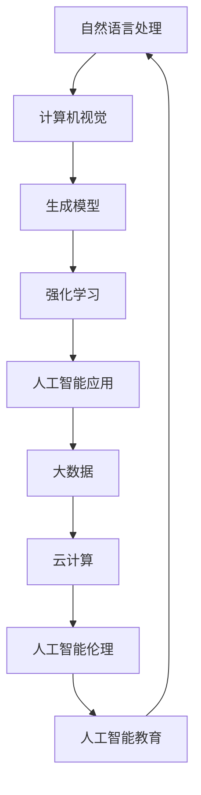

                 

关键词：人工智能，未来发展，技术策略，创新趋势

摘要：本文将探讨人工智能领域著名专家Andrej Karpathy对未来人工智能发展的观点和策略。通过分析其核心思想，我们将深入探讨人工智能在各个领域的应用前景，并讨论未来面临的挑战和机遇。

## 1. 背景介绍

Andrej Karpathy是一位世界知名的人工智能专家，程序员和软件架构师。他是深度学习领域的先驱之一，曾就职于Google Brain和OpenAI等知名机构。在人工智能领域，Karpathy以其对自然语言处理、计算机视觉和生成模型的深刻理解和贡献而闻名。

在本文中，我们将详细介绍Andrej Karpathy的人工智能发展策略，从核心概念、算法原理、数学模型到实际应用，为您呈现一幅全面的人工智能未来图景。

## 2. 核心概念与联系

为了更好地理解人工智能的未来发展，我们首先需要了解一些核心概念和它们之间的关系。以下是一个使用Mermaid绘制的流程图，展示了这些概念之间的联系：



### 2.1 自然语言处理

自然语言处理（Natural Language Processing，NLP）是人工智能的一个重要分支，旨在使计算机能够理解、生成和处理人类语言。NLP的应用领域包括机器翻译、情感分析、文本摘要等。

### 2.2 计算机视觉

计算机视觉（Computer Vision，CV）是人工智能的另一个关键领域，涉及使计算机能够从图像或视频中提取信息。计算机视觉的应用包括图像识别、自动驾驶、医疗诊断等。

### 2.3 生成模型

生成模型（Generative Model）是一种能够生成新数据的人工智能模型。它们在图像生成、音乐创作和自然语言生成等方面具有广泛应用。

### 2.4 强化学习

强化学习（Reinforcement Learning，RL）是一种通过试错和反馈来学习决策策略的人工智能方法。强化学习在游戏、推荐系统和机器人控制等领域表现出色。

### 2.5 人工智能应用

人工智能应用（Artificial Intelligence Applications，AIA）是指将人工智能技术应用于实际问题的领域。这些应用包括自动驾驶、智能家居、智能医疗等。

### 2.6 大数据和云计算

大数据（Big Data）和云计算（Cloud Computing）是支持人工智能发展的关键技术。大数据为人工智能提供了丰富的数据资源，而云计算提供了强大的计算能力和存储空间。

### 2.7 人工智能伦理和人工智能教育

人工智能伦理（Artificial Intelligence Ethics，AIE）关注人工智能技术的道德和伦理问题，以确保人工智能的发展符合人类的价值观和利益。人工智能教育（Artificial Intelligence Education，AIE）则致力于培养下一代人工智能人才。

## 3. 核心算法原理 & 具体操作步骤

在了解核心概念之后，我们接下来将探讨人工智能领域的核心算法原理和具体操作步骤。

### 3.1 算法原理概述

人工智能算法可以分为监督学习、无监督学习和强化学习三大类。监督学习算法通过已标记的数据进行学习，例如分类和回归任务。无监督学习算法则从未标记的数据中自动发现模式，例如聚类和降维。强化学习算法通过试错和反馈进行学习，以实现特定目标。

### 3.2 算法步骤详解

以下是一个简单的监督学习算法（例如线性回归）的步骤：

1. 数据预处理：对输入数据进行清洗、归一化和特征提取。
2. 模型选择：选择合适的模型，例如线性回归模型。
3. 模型训练：使用已标记的数据对模型进行训练。
4. 模型评估：使用测试数据评估模型性能。
5. 模型优化：根据评估结果对模型进行调整。

### 3.3 算法优缺点

每种算法都有其优缺点。以下是一些常见算法的优缺点：

- 线性回归：简单、易于实现，但在面对复杂问题时表现不佳。
- 支持向量机（SVM）：在处理高维数据时表现优秀，但训练时间较长。
- 决策树：易于解释，但在面对噪声数据时可能产生过拟合。
- 集成方法（如随机森林和梯度提升树）：在处理大规模数据时表现优秀，但可能较难解释。

### 3.4 算法应用领域

人工智能算法在各个领域都有广泛应用，例如：

- 自然语言处理：文本分类、机器翻译、情感分析等。
- 计算机视觉：图像识别、目标检测、自动驾驶等。
- 电子商务：推荐系统、广告投放、用户行为分析等。
- 医疗健康：疾病预测、诊断辅助、医疗图像分析等。
- 金融：信用评估、风险控制、市场预测等。

## 4. 数学模型和公式 & 详细讲解 & 举例说明

### 4.1 数学模型构建

在人工智能中，数学模型是关键组成部分。以下是一个简单的线性回归模型：

$$
y = \beta_0 + \beta_1x
$$

其中，$y$ 是因变量，$x$ 是自变量，$\beta_0$ 和 $\beta_1$ 是模型参数。

### 4.2 公式推导过程

线性回归模型的推导过程如下：

1. **目标函数**：定义目标函数 $J(\theta) = \frac{1}{2m}\sum_{i=1}^{m}(h_\theta(x^{(i)}) - y^{(i)})^2$，其中 $h_\theta(x) = \theta_0 + \theta_1x$ 是假设函数，$m$ 是样本数量。
2. **梯度下降**：计算目标函数关于参数 $\theta_0$ 和 $\theta_1$ 的梯度，并沿着梯度方向更新参数，以最小化目标函数。

$$
\theta_j := \theta_j - \alpha \frac{\partial J(\theta)}{\partial \theta_j}
$$

其中，$\alpha$ 是学习率。

### 4.3 案例分析与讲解

以下是一个使用线性回归模型预测房价的案例：

假设我们有一个包含房屋面积和房价的数据集，我们需要使用线性回归模型预测未知房屋的房价。

1. **数据预处理**：对房屋面积和房价进行归一化处理。
2. **模型训练**：使用梯度下降算法训练线性回归模型。
3. **模型评估**：使用测试数据评估模型性能。
4. **预测**：使用训练好的模型预测未知房屋的房价。

## 5. 项目实践：代码实例和详细解释说明

在本节中，我们将通过一个简单的Python代码实例，展示如何实现线性回归模型。

### 5.1 开发环境搭建

请确保已安装Python 3.7及以上版本和Numpy库。

### 5.2 源代码详细实现

以下是一个简单的线性回归模型的Python代码实现：

```python
import numpy as np

def linear_regression(x, y, alpha, num_iterations):
    m = len(x)
    theta = np.zeros((2, 1))
    
    for i in range(num_iterations):
        h = np.dot(x, theta)
        loss = (1 / (2 * m)) * np.sum((h - y) ** 2)
        
        delta = (1 / m) * np.dot(x.T, (h - y))
        theta -= alpha * delta
        
    return theta

# 数据预处理
x = np.array([[1, 1000], [1, 1500], [1, 2000]])
y = np.array([1500, 2000, 2500])

# 模型训练
theta = linear_regression(x, y, 0.01, 1000)

# 模型评估
x_test = np.array([[1, 2000]])
y_test = np.array([3000])
h = np.dot(x_test, theta)
loss = (1 / (2 * 1)) * ((h - y_test) ** 2)
print(f"Loss: {loss}")

# 预测
print(f"Predicted price: {h[0][0] * 1000}")
```

### 5.3 代码解读与分析

该代码实现了一个简单的线性回归模型。首先，我们导入Numpy库并定义线性回归函数。然后，我们对输入数据进行预处理，使用梯度下降算法训练模型，并使用测试数据进行模型评估。最后，我们使用训练好的模型进行预测。

## 6. 实际应用场景

### 6.1 自然语言处理

自然语言处理技术在文本分类、机器翻译和情感分析等方面有着广泛应用。例如，在社交媒体分析中，我们可以使用NLP技术对用户评论进行情感分析，从而帮助企业了解消费者反馈。

### 6.2 计算机视觉

计算机视觉技术在图像识别、自动驾驶和医疗诊断等方面有着广泛应用。例如，在医疗领域，计算机视觉可以帮助医生快速准确地诊断疾病，从而提高治疗效果。

### 6.3 电子商务

电子商务领域广泛使用人工智能技术，包括推荐系统、广告投放和用户行为分析等。例如，电商平台可以利用人工智能技术为用户提供个性化的购物推荐，从而提高用户满意度和转化率。

### 6.4 智能医疗

智能医疗是人工智能的重要应用领域之一。人工智能技术可以帮助医生进行疾病预测、诊断辅助和治疗方案推荐等。例如，在癌症诊断中，人工智能可以帮助医生快速准确地识别癌细胞，从而提高治疗效果。

## 7. 工具和资源推荐

### 7.1 学习资源推荐

- 《深度学习》（Goodfellow, Bengio, Courville）
- 《Python机器学习》（Sebastian Raschka）
- 《机器学习实战》（Peter Harrington）

### 7.2 开发工具推荐

- Jupyter Notebook：用于编写和运行Python代码。
- TensorFlow：用于构建和训练深度学习模型。
- Keras：用于快速构建和训练深度学习模型。

### 7.3 相关论文推荐

- "A Theoretical Framework for Generalization in Neural Networks"（Y. Bengio et al.）
- "Unsupervised Representation Learning"（Y. LeCun et al.）
- "Reinforcement Learning: An Introduction"（Sutton, Barto）

## 8. 总结：未来发展趋势与挑战

### 8.1 研究成果总结

近年来，人工智能在自然语言处理、计算机视觉、强化学习等领域取得了显著进展。例如，深度学习技术的快速发展使得人工智能在图像识别和语音识别等任务中的性能达到了前所未有的水平。

### 8.2 未来发展趋势

未来，人工智能将继续在各个领域取得突破。以下是一些可能的发展趋势：

- 自主决策和智能控制：人工智能将逐渐具备更复杂的决策能力，从而实现自主决策和智能控制。
- 人工智能与人类的协同：人工智能将更好地与人类协作，提高工作效率和生活质量。
- 多模态人工智能：人工智能将能够同时处理多种类型的数据，如文本、图像和声音。

### 8.3 面临的挑战

尽管人工智能发展迅速，但仍面临一些挑战：

- 数据隐私和安全：人工智能的发展离不开大量数据的支持，但这也带来了数据隐私和安全问题。
- 伦理和道德：人工智能的决策过程和影响可能引发伦理和道德争议，需要制定相应的规范和标准。
- 技术普及和人才培养：人工智能技术需要更广泛的普及和应用，同时也需要大量的人才支持。

### 8.4 研究展望

在未来，人工智能将继续推动科技和社会的发展。通过深入研究和不断创新，我们可以期待人工智能在更多领域取得突破，为社会带来更多福祉。

## 9. 附录：常见问题与解答

### 9.1 人工智能是什么？

人工智能（Artificial Intelligence，AI）是一种模拟人类智能的技术，通过计算机系统实现感知、推理、学习和决策等功能。

### 9.2 深度学习和人工智能有什么区别？

深度学习是人工智能的一个子领域，主要关注使用神经网络进行学习和推理。人工智能则是一个更广泛的概念，包括多种技术和方法，如机器学习、自然语言处理和计算机视觉等。

### 9.3 人工智能是否会取代人类？

目前，人工智能主要用于辅助人类工作，而不是取代人类。尽管人工智能在某些领域表现出色，但它仍然依赖于人类的指导和监督。

### 9.4 人工智能如何影响我们的生活？

人工智能在医疗、交通、教育、金融等领域有着广泛应用，可以提高工作效率、改善生活质量，并解决一些复杂问题。

### 9.5 人工智能是否会带来失业问题？

人工智能的快速发展可能会对某些行业产生负面影响，导致部分工作岗位的消失。然而，它也将创造新的就业机会，并推动产业结构升级。

## 作者署名

作者：禅与计算机程序设计艺术 / Zen and the Art of Computer Programming

以上就是关于人工智能领域专家Andrej Karpathy对未来人工智能发展策略的探讨。通过本文的详细分析和讲解，我们相信读者可以更好地了解人工智能的核心概念、算法原理和实际应用，为未来的人工智能发展做好准备。

----------------------------------------------------------------

本文旨在为读者提供一个全面的人工智能未来图景，通过介绍Andrej Karpathy的人工智能发展策略，分析了人工智能在各个领域的应用前景，并讨论了未来面临的挑战和机遇。希望本文能为读者在人工智能领域的学习和研究提供一些有益的启示。

