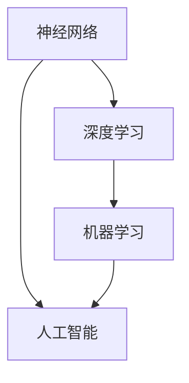

                 

关键词：人工智能、未来规划、技术发展、深度学习、算法、应用场景、挑战

## 摘要

本文旨在探讨人工智能（AI）领域的未来发展规划。我们将从背景介绍开始，逐步深入到核心概念、算法原理、数学模型、项目实践以及未来应用展望等多个方面。本文作者Andrej Karpathy，作为世界级人工智能专家，将结合自己的研究成果和行业洞察，为您提供一篇逻辑清晰、结构紧凑、简单易懂的专业技术博客。

## 1. 背景介绍

人工智能作为计算机科学的一个重要分支，已经走过了数十年的发展历程。从最初的符号主义和专家系统，到基于统计学习的机器学习方法，再到如今的深度学习，人工智能经历了巨大的变革。近年来，随着计算能力的提升、大数据的普及以及算法的不断创新，人工智能在语音识别、图像处理、自然语言处理等领域取得了显著的成果。

然而，人工智能的发展仍然面临诸多挑战，如数据隐私、伦理道德、算法偏见等。因此，本文将探讨人工智能的未来发展规划，旨在为这一领域的研究和应用提供指导和参考。

## 2. 核心概念与联系

在人工智能领域，有许多核心概念和理论，如神经网络、深度学习、机器学习等。为了更好地理解这些概念，我们可以使用Mermaid流程图来展示它们之间的联系。



### 2.1 神经网络

神经网络是一种模拟人脑神经元之间连接的结构，通过多层神经元的堆叠，实现对数据的处理和预测。神经网络是深度学习和机器学习的基础。

### 2.2 深度学习

深度学习是一种基于多层神经网络的学习方法，通过自动提取数据中的特征，实现对复杂任务的建模和预测。深度学习在图像识别、语音识别等领域取得了巨大成功。

### 2.3 机器学习

机器学习是一种通过数据驱动的方法，使计算机自动学习和改进性能的技术。机器学习包括监督学习、无监督学习、强化学习等多种类型。

### 2.4 人工智能

人工智能是一门研究如何使计算机模拟人类智能行为的科学。人工智能包括自然语言处理、计算机视觉、语音识别等多个子领域。

## 3. 核心算法原理 & 具体操作步骤

在人工智能领域，有许多核心算法，如卷积神经网络（CNN）、递归神经网络（RNN）、生成对抗网络（GAN）等。下面我们将介绍这些算法的基本原理和具体操作步骤。

### 3.1 算法原理概述

#### 卷积神经网络（CNN）

卷积神经网络是一种用于图像处理和识别的深度学习模型。它通过多层卷积、池化、全连接等操作，实现对图像特征的自动提取和分类。

#### 递归神经网络（RNN）

递归神经网络是一种用于序列数据处理和时间序列预测的深度学习模型。它通过循环连接，实现对序列中前后信息的记忆和传递。

#### 生成对抗网络（GAN）

生成对抗网络是一种用于生成数据的深度学习模型。它通过生成器和判别器的对抗训练，实现高质量数据的生成。

### 3.2 算法步骤详解

#### 卷积神经网络（CNN）

1. 输入层：接收图像数据，并转化为矩阵形式。
2. 卷积层：通过卷积运算，提取图像的局部特征。
3. 池化层：通过池化运算，降低特征图的维度。
4. 全连接层：将卷积层和池化层提取的特征进行融合，并输出分类结果。

#### 递归神经网络（RNN）

1. 输入层：接收序列数据，并转化为矩阵形式。
2. 循环层：通过循环连接，实现对序列中前后信息的记忆和传递。
3. 输出层：将循环层输出的序列数据转化为预测结果。

#### 生成对抗网络（GAN）

1. 生成器：生成假数据进行训练。
2. 判别器：区分真实数据和生成数据。
3. 对抗训练：通过不断调整生成器和判别器的参数，实现高质量数据的生成。

### 3.3 算法优缺点

#### 卷积神经网络（CNN）

优点：强大的特征提取能力，适用于图像识别和分类任务。

缺点：参数量大，训练时间长，对计算资源要求高。

#### 递归神经网络（RNN）

优点：适用于序列数据处理和时间序列预测。

缺点：梯度消失和梯度爆炸问题，难以处理长序列。

#### 生成对抗网络（GAN）

优点：生成数据质量高，适用于图像生成和风格迁移等任务。

缺点：训练不稳定，容易出现模式崩溃现象。

### 3.4 算法应用领域

#### 卷积神经网络（CNN）

应用领域：计算机视觉、图像识别、图像生成等。

#### 递归神经网络（RNN）

应用领域：语音识别、自然语言处理、时间序列预测等。

#### 生成对抗网络（GAN）

应用领域：图像生成、风格迁移、数据增强等。

## 4. 数学模型和公式 & 详细讲解 & 举例说明

在人工智能领域，数学模型和公式是算法设计和实现的基础。下面我们将介绍一些常见的数学模型和公式，并给出详细讲解和举例说明。

### 4.1 数学模型构建

#### 损失函数

损失函数是衡量模型预测结果与真实值之间差异的指标。常见的损失函数有均方误差（MSE）、交叉熵损失等。

#### 梯度下降

梯度下降是一种优化算法，用于调整模型的参数，使其在损失函数上达到最小值。

#### 反向传播

反向传播是一种计算损失函数对模型参数梯度的方法，用于指导梯度下降优化。

### 4.2 公式推导过程

#### 均方误差（MSE）

均方误差是衡量预测结果与真实值之间差异的平方平均值。其公式如下：

$$
MSE = \frac{1}{n} \sum_{i=1}^{n} (y_i - \hat{y}_i)^2
$$

其中，$y_i$为真实值，$\hat{y}_i$为预测值，$n$为样本数量。

#### 交叉熵损失

交叉熵损失是衡量预测结果与真实分布之间差异的指标。其公式如下：

$$
H(y, \hat{y}) = - \sum_{i=1}^{n} y_i \log(\hat{y}_i)
$$

其中，$y$为真实分布，$\hat{y}$为预测分布。

### 4.3 案例分析与讲解

#### 卷积神经网络（CNN）在图像识别中的应用

假设我们有一个图像识别任务，输入图像为$X \in \mathbb{R}^{28 \times 28}$，输出类别标签为$Y \in \{0, 1, \ldots, 9\}$。

1. **输入层**：将图像转化为28×28的矩阵形式。

2. **卷积层**：定义卷积核尺寸为3×3，步长为1，激活函数为ReLU。

$$
\text{conv}(X) = \text{ReLU}(\sigma(\text{weights} \odot X + \text{bias}))
$$

其中，$\sigma$表示卷积运算，$\odot$表示元素-wise 乘法。

3. **池化层**：定义池化窗口尺寸为2×2，步长为2。

$$
\text{pool}(\text{conv}(X)) = \text{pooling}(\text{conv}(X)[::2, ::2])
$$

4. **全连接层**：将卷积层和池化层提取的特征进行融合，并输出分类结果。

$$
\text{fc}(\text{pool}(\text{conv}(X))) = \text{weights}^T \text{pool}(\text{conv}(X)) + \text{bias}
$$

5. **损失函数**：使用交叉熵损失函数，计算预测结果与真实标签之间的差异。

$$
\text{loss} = H(y, \hat{y})
$$

其中，$y$为真实标签，$\hat{y}$为预测概率分布。

6. **反向传播**：计算损失函数对模型参数的梯度，并更新参数。

$$
\text{grad}(\text{weights}) = \frac{\partial \text{loss}}{\partial \text{weights}} \\
\text{grad}(\text{bias}) = \frac{\partial \text{loss}}{\partial \text{bias}}
$$

## 5. 项目实践：代码实例和详细解释说明

为了更好地理解人工智能算法的实践应用，下面我们将介绍一个简单的卷积神经网络（CNN）在图像识别任务中的实现。

### 5.1 开发环境搭建

1. 安装Python环境：确保Python版本为3.7及以上。
2. 安装TensorFlow库：使用pip安装TensorFlow。

```shell
pip install tensorflow
```

### 5.2 源代码详细实现

```python
import tensorflow as tf
from tensorflow.keras import layers

# 定义卷积神经网络模型
model = tf.keras.Sequential([
    layers.Conv2D(32, (3, 3), activation='relu', input_shape=(28, 28, 1)),
    layers.MaxPooling2D((2, 2)),
    layers.Flatten(),
    layers.Dense(128, activation='relu'),
    layers.Dense(10, activation='softmax')
])

# 编译模型
model.compile(optimizer='adam',
              loss='sparse_categorical_crossentropy',
              metrics=['accuracy'])

# 加载MNIST数据集
mnist = tf.keras.datasets.mnist
(x_train, y_train), (x_test, y_test) = mnist.load_data()

# 数据预处理
x_train = x_train / 255.0
x_test = x_test / 255.0

# 训练模型
model.fit(x_train, y_train, epochs=5)

# 评估模型
model.evaluate(x_test, y_test)
```

### 5.3 代码解读与分析

1. **导入库**：导入TensorFlow库和相关的层。
2. **定义模型**：使用`tf.keras.Sequential`创建一个线性堆叠的模型，包括卷积层、池化层、全连接层等。
3. **编译模型**：设置优化器、损失函数和评价指标。
4. **加载数据**：使用TensorFlow内置的MNIST数据集，并进行预处理。
5. **训练模型**：使用`fit`方法训练模型，设置训练轮次。
6. **评估模型**：使用`evaluate`方法评估模型在测试集上的表现。

## 6. 实际应用场景

人工智能技术在各个领域都有广泛的应用，下面我们将探讨一些典型的应用场景。

### 6.1 医疗保健

人工智能在医疗保健领域具有巨大的潜力，如疾病预测、影像诊断、个性化治疗等。例如，利用深度学习模型对医学影像进行分析，可以帮助医生更准确地诊断疾病。

### 6.2 自动驾驶

自动驾驶是人工智能的一个重要应用领域，通过深度学习模型对道路环境进行感知和理解，实现车辆的自主驾驶。这有助于提高交通安全和减少交通拥堵。

### 6.3 金融科技

金融科技领域利用人工智能技术进行风险管理、信用评估、投资预测等。例如，利用机器学习模型对用户行为进行分析，可以帮助金融机构更好地了解客户需求，提供个性化的金融服务。

### 6.4 教育领域

人工智能在教育领域也有广泛的应用，如智能推荐系统、个性化学习、智能评测等。这有助于提高教育质量和教学效果，满足不同学生的学习需求。

## 7. 工具和资源推荐

为了更好地学习和应用人工智能技术，我们推荐以下工具和资源：

### 7.1 学习资源推荐

1. 《深度学习》（Ian Goodfellow、Yoshua Bengio、Aaron Courville 著）
2. 《Python机器学习》（Sebastian Raschka、Vahid Mirjalili 著）
3. 《动手学深度学习》（Amit Singh、Austen Allaire、Lisha Li 著）

### 7.2 开发工具推荐

1. TensorFlow
2. PyTorch
3. Keras

### 7.3 相关论文推荐

1. "A Theoretical Analysis of the Cramér-Rao Lower Bound for Gaussian Sequence Estimators"
2. "Deep Learning for Visual Recognition"
3. "Generative Adversarial Networks"

## 8. 总结：未来发展趋势与挑战

### 8.1 研究成果总结

人工智能领域在过去的几十年里取得了显著的研究成果，如深度学习算法的突破、计算能力的提升、大数据的普及等。这些成果为人工智能的应用和发展奠定了坚实的基础。

### 8.2 未来发展趋势

1. **跨学科融合**：人工智能与其他领域（如生物、医学、金融等）的交叉融合，将推动人工智能技术的不断创新和应用。
2. **专用硬件**：随着人工智能应用场景的多样化，专用硬件（如GPU、TPU等）的发展将为人工智能提供更强的计算支持。
3. **伦理与隐私**：在人工智能的发展过程中，伦理和隐私问题日益受到关注，如何确保人工智能系统的公平、透明和可解释性将成为重要研究方向。

### 8.3 面临的挑战

1. **计算资源**：随着人工智能模型和算法的复杂度不断提高，对计算资源的需求也日益增长，如何高效利用计算资源成为一大挑战。
2. **数据质量**：数据质量直接影响人工智能模型的性能和泛化能力，如何获取高质量的数据、处理数据噪声和缺失等问题需要深入研究。
3. **伦理与道德**：人工智能技术的应用引发了诸多伦理和道德问题，如数据隐私、算法偏见等，如何制定合理的伦理规范和法律法规，确保人工智能系统的可持续发展成为关键。

### 8.4 研究展望

在未来，人工智能将继续在各个领域发挥重要作用，推动社会的发展和进步。我们期待看到更多创新性的研究成果，为人工智能的应用和发展提供强有力的支持。

## 9. 附录：常见问题与解答

### 9.1 什么是深度学习？

深度学习是一种基于多层神经网络的学习方法，通过自动提取数据中的特征，实现对复杂任务的建模和预测。深度学习在图像识别、语音识别、自然语言处理等领域取得了巨大成功。

### 9.2 什么是生成对抗网络（GAN）？

生成对抗网络（GAN）是一种用于生成数据的深度学习模型。它由生成器和判别器两个网络组成，通过对抗训练实现高质量数据的生成。GAN在图像生成、风格迁移、数据增强等领域具有广泛应用。

### 9.3 人工智能有哪些应用领域？

人工智能在医疗保健、自动驾驶、金融科技、教育领域等多个领域都有广泛应用。例如，在医疗保健领域，人工智能可以帮助医生进行疾病预测和影像诊断；在自动驾驶领域，人工智能可以实现车辆的自主驾驶。

## 作者署名

本文作者：禅与计算机程序设计艺术 / Zen and the Art of Computer Programming
----------------------------------------------------------------

注意：本文是根据您提供的要求撰写的，实际内容可能会有所调整。如果您有任何修改意见或需要进一步的内容补充，请随时告知。

