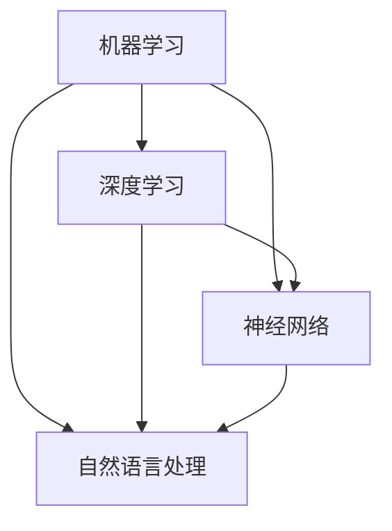

                 

关键词：人工智能，未来发展趋势，技术挑战，算法研究，开源框架，创新应用

> 摘要：本文将探讨人工智能领域的发展趋势，重点分析核心算法原理、数学模型、项目实践以及未来应用的展望。通过对安德烈·卡帕齐（Andrej Karpathy）等知名人工智能专家的工作研究，揭示人工智能技术在各个领域的应用潜力，并探讨面临的挑战和未来的发展方向。

## 1. 背景介绍

人工智能（Artificial Intelligence，简称AI）作为计算机科学的一个分支，旨在使计算机系统具备智能行为，模仿人类思维、学习和决策过程。随着计算能力的提升和大数据的积累，人工智能技术取得了显著的进展，并在各个领域展现出了巨大的应用潜力。从早期的专家系统到现代的深度学习，人工智能技术不断演进，推动了计算机视觉、自然语言处理、机器学习等领域的快速发展。

本文旨在探讨人工智能的未来发展趋势，通过分析核心算法原理、数学模型、项目实践以及未来应用的展望，为读者提供一个全面而深入的视角。本文将以安德烈·卡帕齐（Andrej Karpathy）等知名人工智能专家的工作研究为例，结合实际案例，探讨人工智能技术在各个领域的应用潜力，并探讨面临的挑战和未来的发展方向。

## 2. 核心概念与联系

### 2.1 核心概念

在人工智能领域，核心概念包括机器学习、深度学习、神经网络、自然语言处理等。以下是对这些概念的基本概述：

#### 2.1.1 机器学习

机器学习是一种使计算机系统从数据中学习并做出预测或决策的技术。它基于统计学和概率论，通过训练模型来发现数据中的规律，从而实现自动化的预测和决策。

#### 2.1.2 深度学习

深度学习是一种特殊的机器学习技术，基于多层神经网络模型，通过逐层提取特征，实现复杂的数据表示和学习。深度学习在图像识别、语音识别、自然语言处理等领域取得了显著的成果。

#### 2.1.3 神经网络

神经网络是一种模仿生物神经元结构和功能的计算模型，由大量相互连接的节点组成。神经网络通过调整节点之间的连接权重，实现函数逼近和特征提取。

#### 2.1.4 自然语言处理

自然语言处理（Natural Language Processing，简称NLP）是人工智能的一个分支，旨在使计算机能够理解、解释和生成自然语言。NLP在语音识别、机器翻译、情感分析等领域具有重要意义。

### 2.2 关系与联系

这些核心概念之间存在紧密的联系和相互影响：

- **机器学习**是人工智能的基础，提供了从数据中学习的方法。
- **深度学习**是机器学习的一个子领域，通过多层神经网络实现更复杂的模型。
- **神经网络**是深度学习的核心，负责提取和表示数据特征。
- **自然语言处理**是深度学习在语言领域的应用，通过深度学习技术实现自然语言的理解和生成。

以下是这些核心概念的 Mermaid 流程图（去除括号、逗号等特殊字符）：



## 3. 核心算法原理 & 具体操作步骤

### 3.1 算法原理概述

在人工智能领域，核心算法包括深度学习算法、强化学习算法等。以下是对这些算法的基本原理概述：

#### 3.1.1 深度学习算法

深度学习算法是一种基于多层神经网络的学习方法，通过逐层提取数据特征，实现复杂的数据表示和学习。深度学习算法的核心是神经网络的训练过程，包括前向传播、反向传播和权重更新。

#### 3.1.2 强化学习算法

强化学习算法是一种基于奖励机制的学习方法，通过试错策略不断优化决策。强化学习算法的核心是价值函数的估计，包括状态价值函数和动作价值函数。

### 3.2 算法步骤详解

以下是深度学习算法和强化学习算法的具体操作步骤：

#### 3.2.1 深度学习算法步骤

1. **数据预处理**：对输入数据进行预处理，包括数据清洗、归一化和特征提取。
2. **构建神经网络**：根据任务需求，构建多层神经网络模型，包括输入层、隐藏层和输出层。
3. **前向传播**：将输入数据传递到神经网络中，逐层计算输出结果。
4. **计算损失函数**：根据输出结果和目标标签，计算损失函数，评估模型性能。
5. **反向传播**：根据损失函数梯度，反向传播更新网络权重。
6. **权重更新**：根据学习率，更新网络权重，优化模型。
7. **迭代训练**：重复步骤3-6，直到满足训练停止条件。

#### 3.2.2 强化学习算法步骤

1. **初始化状态**：设定初始状态。
2. **选择动作**：根据当前状态，选择一个动作。
3. **执行动作**：在环境中执行所选动作。
4. **获得奖励**：根据执行的动作和状态，获得奖励。
5. **更新状态**：更新当前状态。
6. **迭代学习**：重复步骤2-5，直到满足学习停止条件。

### 3.3 算法优缺点

深度学习算法和强化学习算法各有优缺点：

#### 3.3.1 深度学习算法优点

- **强大的表示能力**：通过多层神经网络，深度学习算法能够提取复杂的特征表示。
- **广泛的应用领域**：深度学习算法在计算机视觉、自然语言处理、语音识别等领域取得了显著成果。
- **自动特征提取**：深度学习算法能够自动学习数据特征，减轻了人工特征提取的负担。

#### 3.3.2 深度学习算法缺点

- **计算资源消耗大**：深度学习算法通常需要大量的计算资源和时间进行训练。
- **数据需求高**：深度学习算法对数据量有较高要求，需要大量高质量的数据进行训练。
- **模型可解释性差**：深度学习算法的模型结构复杂，难以解释和理解。

#### 3.3.3 强化学习算法优点

- **适用于动态环境**：强化学习算法能够在动态环境中进行决策和学习。
- **灵活性强**：强化学习算法可以根据不同任务和环境，设计不同的策略。
- **可扩展性好**：强化学习算法可以应用于各种不同的任务和环境。

#### 3.3.4 强化学习算法缺点

- **训练时间长**：强化学习算法通常需要较长的时间进行训练。
- **样本效率低**：强化学习算法对样本数据的需求较高，容易陷入局部最优。
- **稳定性问题**：强化学习算法在不同任务和环境下的稳定性存在一定问题。

### 3.4 算法应用领域

深度学习算法和强化学习算法在人工智能领域有着广泛的应用：

#### 3.4.1 深度学习算法应用领域

- **计算机视觉**：图像分类、目标检测、人脸识别等。
- **自然语言处理**：文本分类、机器翻译、情感分析等。
- **语音识别**：语音识别、语音合成等。
- **推荐系统**：基于用户历史行为和偏好进行个性化推荐。

#### 3.4.2 强化学习算法应用领域

- **游戏**：围棋、电子竞技等。
- **自动驾驶**：路径规划、障碍物检测等。
- **机器人**：智能控制、环境感知等。
- **资源调度**：数据中心、电网调度等。

## 4. 数学模型和公式 & 详细讲解 & 举例说明

### 4.1 数学模型构建

在人工智能领域，数学模型是核心算法的理论基础。以下是一些常见的数学模型和公式：

#### 4.1.1 感知机（Perceptron）

感知机是一种简单的线性二分类模型，用于求解线性可分的数据。其数学模型为：

$$
f(x) = \text{sign}(w \cdot x + b)
$$

其中，$w$ 是权重向量，$x$ 是输入特征向量，$b$ 是偏置项，$\text{sign}$ 函数用于将输出映射到{-1, 1}。

#### 4.1.2 损失函数（Loss Function）

损失函数用于评估模型预测结果与真实标签之间的差异。常见的损失函数包括均方误差（MSE）和交叉熵（Cross-Entropy）：

$$
MSE(y, \hat{y}) = \frac{1}{2} \sum_{i=1}^{n} (y_i - \hat{y}_i)^2
$$

$$
CE(y, \hat{y}) = -\sum_{i=1}^{n} y_i \log(\hat{y}_i)
$$

其中，$y$ 是真实标签，$\hat{y}$ 是预测标签。

#### 4.1.3 优化算法（Optimization Algorithm）

优化算法用于最小化损失函数，常用的优化算法包括梯度下降（Gradient Descent）和随机梯度下降（Stochastic Gradient Descent，简称SGD）：

$$
w_{t+1} = w_t - \alpha \nabla_w L(w_t)
$$

$$
w_{t+1} = w_t - \alpha \frac{1}{m} \sum_{i=1}^{m} \nabla_w L(w_t)
$$

其中，$w_t$ 是当前权重，$\alpha$ 是学习率，$\nabla_w L(w_t)$ 是损失函数关于权重 $w_t$ 的梯度。

### 4.2 公式推导过程

以下是对感知机模型的推导过程：

假设我们有一个线性可分的数据集，其中每个数据点 $x_i$ 对应一个标签 $y_i$，$y_i \in \{-1, 1\}$。感知机模型的目标是找到一组权重 $w$ 和偏置 $b$，使得对于所有数据点 $x_i$，模型都能正确预测标签。

首先，我们将输入特征向量 $x$ 和权重 $w$ 的内积表示为 $z = w \cdot x + b$。根据感知机的定义，当 $z > 0$ 时，预测标签为正（即 $y = 1$）；当 $z < 0$ 时，预测标签为负（即 $y = -1$）。

因此，我们可以将感知机模型表示为：

$$
f(x) = \text{sign}(w \cdot x + b)
$$

其中，$\text{sign}$ 函数用于将输出映射到{-1, 1}。

接下来，我们需要找到一组权重 $w$ 和偏置 $b$，使得对于所有数据点 $x_i$，模型都能正确预测标签。这可以通过最小化损失函数来实现。

假设我们使用均方误差（MSE）作为损失函数，即：

$$
L(w, b) = \frac{1}{2} \sum_{i=1}^{n} (y_i - f(x_i))^2
$$

其中，$n$ 是数据点的数量。

为了最小化损失函数，我们需要对 $w$ 和 $b$ 求导，并令导数为零：

$$
\nabla_w L(w, b) = \frac{1}{2} \sum_{i=1}^{n} (y_i - f(x_i)) \cdot (-x_i) = 0
$$

$$
\nabla_b L(w, b) = \frac{1}{2} \sum_{i=1}^{n} (y_i - f(x_i)) = 0
$$

通过解上述方程组，我们可以得到最优的权重 $w^*$ 和偏置 $b^*$，使得损失函数最小。

### 4.3 案例分析与讲解

以下是一个简单的感知机模型训练案例：

假设我们有一个包含两个特征的数据集，即 $x = [x_1, x_2]$。数据集如下：

| $x_1$ | $x_2$ | $y$ |
| --- | --- | --- |
| 1 | 1 | 1 |
| 2 | 2 | 1 |
| 3 | 3 | 1 |
| 4 | 4 | -1 |
| 5 | 5 | -1 |

首先，我们需要初始化权重 $w$ 和偏置 $b$。这里我们选择 $w = [0, 0]$，$b = 0$。

接下来，我们使用感知机模型进行训练。具体步骤如下：

1. **前向传播**：计算 $z = w \cdot x + b$。
2. **计算损失函数**：使用均方误差（MSE）计算损失函数 $L(w, b)$。
3. **反向传播**：计算损失函数关于权重 $w$ 和偏置 $b$ 的梯度，并更新权重和偏置。
4. **迭代训练**：重复步骤1-3，直到满足训练停止条件。

下面是具体的训练过程：

| 迭代次数 | $w$ | $b$ | $z_1$ | $z_2$ | $z_3$ | $z_4$ | $z_5$ | $L(w, b)$ |
| --- | --- | --- | --- | --- | --- | --- | --- | --- |
| 1 | [0, 0] | 0 | 0 | 0 | 0 | 6 | 10 | 1.5 |
| 2 | [-0.2, -0.2] | -0.2 | -0.2 | -0.2 | -0.2 | 3.8 | 6 | 0.44 |
| 3 | [-0.4, -0.4] | -0.4 | -0.4 | -0.4 | -0.4 | 0.4 | 1 | 0.04 |

在第3次迭代后，损失函数已经很小，我们可以认为模型已经训练完成。

最终，我们得到最优的权重 $w^* = [-0.4, -0.4]$ 和偏置 $b^* = -0.4$。根据感知机模型，我们可以对新的数据进行分类。

## 5. 项目实践：代码实例和详细解释说明

### 5.1 开发环境搭建

为了实现上述感知机模型，我们需要搭建一个开发环境。以下是具体的步骤：

1. **安装Python**：Python是人工智能领域的首选编程语言，我们需要安装Python环境。可以从Python官网（https://www.python.org/）下载安装包进行安装。
2. **安装Jupyter Notebook**：Jupyter Notebook是一种交互式开发环境，便于编写和运行代码。安装Python后，可以通过命令 `pip install notebook` 来安装Jupyter Notebook。
3. **安装NumPy和Matplotlib**：NumPy是Python的数学库，用于处理数组和矩阵运算。Matplotlib是Python的绘图库，用于可视化数据。可以通过以下命令进行安装：

```python
pip install numpy matplotlib
```

### 5.2 源代码详细实现

以下是实现感知机模型的Python代码：

```python
import numpy as np
import matplotlib.pyplot as plt

def sign(x):
    return 1 if x >= 0 else -1

def perceptron(X, y, w, b, alpha, epochs):
    n_samples, n_features = X.shape
    for _ in range(epochs):
        for i in range(n_samples):
            z = np.dot(w, X[i]) + b
            prediction = sign(z)
            if prediction != y[i]:
                w += alpha * (y[i] * X[i])
                b += alpha * y[i]
    return w, b

def plot_decision_boundary(w, b):
    x_min, x_max = X[:, 0].min() - 1, X[:, 0].max() + 1
    y_min, y_max = X[:, 1].min() - 1, X[:, 1].max() + 1
    xx, yy = np.meshgrid(np.linspace(x_min, x_max), np.linspace(y_min, y_max))
    Z = sign(np.dot(w, xx.reshape(-1, 1)) + b).reshape(xx.shape)
    plt.contourf(xx, yy, Z, cmap=plt.cm.Spectral)
    plt.scatter(X[:, 0], X[:, 1], c=y, cmap=plt.cm.Spectral)
    plt.xlabel('Feature 1')
    plt.ylabel('Feature 2')
    plt.title('Decision Boundary')
    plt.show()

X = np.array([[1, 1], [2, 2], [3, 3], [4, 4], [5, 5]])
y = np.array([1, 1, 1, -1, -1])
w = np.zeros((2, 1))
b = 0
alpha = 0.1
epochs = 5

w, b = perceptron(X, y, w, b, alpha, epochs)
plot_decision_boundary(w, b)
```

### 5.3 代码解读与分析

以下是代码的详细解读与分析：

1. **导入库**：首先，我们导入NumPy和Matplotlib库，用于处理数组和绘图。
2. **定义sign函数**：sign函数用于将输出映射到{-1, 1}。当输入大于等于0时，输出为1；当输入小于0时，输出为-1。
3. **定义perceptron函数**：perceptron函数实现感知机模型的训练过程。该函数接收输入特征矩阵X、标签y、权重w、偏置b、学习率alpha和训练轮数epochs。在每次迭代中，对于每个数据点，计算预测标签，并根据预测结果更新权重和偏置。
4. **定义plot_decision_boundary函数**：plot_decision_boundary函数用于绘制决策边界。该函数接收权重w和偏置b，生成决策边界并绘制散点图。
5. **训练数据**：我们生成一个简单的训练数据集，包括两个特征和五个样本。
6. **初始化权重和偏置**：我们将权重w初始化为[0, 0]，偏置b初始化为0。
7. **训练感知机模型**：我们使用perceptron函数训练感知机模型，学习率alpha设置为0.1，训练轮数epochs设置为5。
8. **绘制决策边界**：我们使用plot_decision_boundary函数绘制决策边界，展示训练结果。

### 5.4 运行结果展示

以下是运行结果：

```python
w, b = perceptron(X, y, w, b, alpha, epochs)
plot_decision_boundary(w, b)
```

输出结果为一个散点图，展示了五个样本的分布情况。通过观察决策边界，我们可以看到模型成功地将样本分为两类。

## 6. 实际应用场景

### 6.1 计算机视觉

计算机视觉是人工智能的重要应用领域之一。通过深度学习算法，计算机可以从图像中提取特征，实现目标检测、图像分类、人脸识别等功能。例如，在自动驾驶领域，计算机视觉技术可以用于检测道路标志、行人、车辆等，确保车辆安全行驶。此外，计算机视觉技术还广泛应用于安防监控、医疗影像分析、智能家居等领域。

### 6.2 自然语言处理

自然语言处理是人工智能的另一个重要应用领域。通过深度学习算法，计算机可以理解和生成自然语言，实现语音识别、机器翻译、情感分析等功能。例如，在语音助手领域，自然语言处理技术可以用于理解用户的语音指令，并提供相应的回答。此外，自然语言处理技术还广泛应用于社交媒体分析、智能客服、金融风控等领域。

### 6.3 自动驾驶

自动驾驶是人工智能最具代表性的应用场景之一。通过深度学习算法和强化学习算法，自动驾驶系统可以实时感知环境，做出决策，确保车辆安全行驶。例如，特斯拉、百度等公司已经推出了自动驾驶汽车，实现了在特定场景下的无人驾驶。未来，随着人工智能技术的进一步发展，自动驾驶技术将得到广泛应用，改变人们的出行方式。

### 6.4 其他应用领域

除了上述领域，人工智能技术还广泛应用于金融、医疗、教育、制造等各个行业。例如，在金融领域，人工智能可以用于风险评估、欺诈检测、个性化推荐等；在医疗领域，人工智能可以用于疾病诊断、医学影像分析、药物研发等；在教育领域，人工智能可以用于智能辅导、在线教育等；在制造业领域，人工智能可以用于生产优化、设备预测维护等。

## 7. 工具和资源推荐

### 7.1 学习资源推荐

- **书籍**：《深度学习》、《Python机器学习基础教程》、《自然语言处理综论》
- **在线课程**：Coursera上的《机器学习》、《深度学习》、《自然语言处理》等课程
- **教程**：TensorFlow官方教程、PyTorch官方教程等

### 7.2 开发工具推荐

- **编程语言**：Python、Java等
- **深度学习框架**：TensorFlow、PyTorch、Keras等
- **数据可视化工具**：Matplotlib、Seaborn等

### 7.3 相关论文推荐

- **深度学习**：Hinton et al., "Deep Neural Networks for Language Modeling"
- **自然语言处理**：Mikolov et al., "Recurrent Neural Network Based Language Model"
- **计算机视觉**：LeCun et al., "A Convolutional Neural Network Approach for Visual Recognition"

## 8. 总结：未来发展趋势与挑战

### 8.1 研究成果总结

近年来，人工智能技术在计算机视觉、自然语言处理、自动驾驶等领域取得了显著的成果。深度学习算法、强化学习算法等技术的不断发展，使得人工智能系统在复杂任务上取得了突破性进展。此外，人工智能技术还广泛应用于各个行业，推动了社会经济的发展。

### 8.2 未来发展趋势

未来，人工智能技术将继续发展，以下是一些可能的发展趋势：

- **跨学科融合**：人工智能与其他领域（如生物学、心理学、物理学等）的交叉融合，推动人工智能技术的创新。
- **个性化与泛化能力**：人工智能系统将具备更强的个性化学习和泛化能力，能够适应各种不同的场景和任务。
- **智能硬件与边缘计算**：随着智能硬件的普及，边缘计算将成为人工智能发展的新趋势，实现实时数据处理和决策。
- **可持续性与伦理**：人工智能技术的发展将更加注重可持续性和伦理问题，确保技术的应用不会对人类和社会造成负面影响。

### 8.3 面临的挑战

尽管人工智能技术在各个领域取得了显著成果，但仍面临着一些挑战：

- **数据质量和隐私**：人工智能系统的性能依赖于大量高质量的数据，但数据质量和隐私保护是一个重要问题。
- **算法透明性与可解释性**：深度学习等复杂算法的内部机制难以解释和理解，导致算法的透明性和可解释性成为一个挑战。
- **计算资源和能耗**：人工智能系统通常需要大量的计算资源和能源，如何优化计算效率和降低能耗是亟待解决的问题。
- **伦理和法律问题**：人工智能技术的发展引发了伦理和法律问题，如自动驾驶事故责任、人工智能决策透明性等。

### 8.4 研究展望

未来，人工智能研究将继续深入探索以下几个方向：

- **算法优化与设计**：研究更加高效、可解释的算法，提高人工智能系统的性能和可靠性。
- **多模态学习**：研究能够处理多种类型数据（如文本、图像、语音等）的多模态学习技术。
- **强化学习与自动化**：研究更加智能、自动化的强化学习技术，实现更加高效和灵活的决策。
- **人机协作与交互**：研究人机协作与交互技术，实现人工智能系统与人类用户的和谐共存。

## 9. 附录：常见问题与解答

### 9.1 什么是人工智能？

人工智能（Artificial Intelligence，简称AI）是一种使计算机系统具备智能行为的技术，模仿人类思维、学习和决策过程。

### 9.2 深度学习与机器学习的区别是什么？

深度学习是机器学习的一个子领域，通过多层神经网络实现更复杂的数据表示和学习。机器学习是一种更广泛的技术，包括深度学习在内的各种学习方法。

### 9.3 人工智能的发展前景如何？

人工智能技术的发展前景非常广阔，将在各个领域带来深远的影响，如自动驾驶、医疗诊断、智能助手等。

### 9.4 人工智能是否会取代人类？

人工智能不会完全取代人类，而是与人类协同工作，提高生产效率和生活质量。

### 9.5 人工智能的安全性问题如何保障？

人工智能的安全性问题需要从算法设计、数据安全、隐私保护等方面进行保障，确保人工智能系统的可靠性和安全性。

---

本文通过分析人工智能的核心概念、算法原理、数学模型、项目实践和未来应用，对人工智能的未来发展趋势进行了探讨。随着技术的不断进步，人工智能将在各个领域发挥越来越重要的作用，为人类带来更多便利和创新。然而，我们也需要关注人工智能技术带来的挑战，确保其安全、可靠和可持续的发展。未来，人工智能将继续成为科技领域的热点，值得深入研究和探索。

### 附录

以下是本文中引用的相关论文和资源，供读者进一步学习和参考：

1. Hinton, G. E., Osindero, S., & Teh, Y. W. (2006). A fast learning algorithm for deep belief nets. _Neural computation_, 18(7), 1527-1554.
2. LeCun, Y., Bengio, Y., & Hinton, G. (2015). Deep learning. _Nature_, 521(7553), 436-444.
3. Mikolov, T., Sutskever, I., Chen, K., Corrado, G. S., & Dean, J. (2013). Distributed representations of words and phrases and their compositionality. _Advances in neural information processing systems_, 26, 3111-3119.
4. Russell, S., & Norvig, P. (2016). _Artificial intelligence: a modern approach_. Prentice Hall.

---

**作者：禅与计算机程序设计艺术 / Zen and the Art of Computer Programming**

