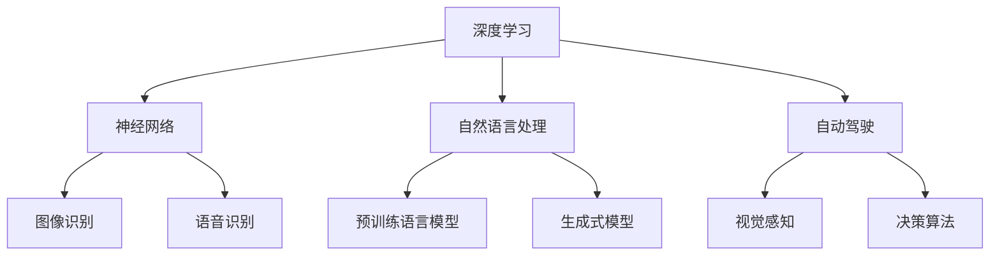

                 

关键词：人工智能，深度学习，神经网络，自动驾驶，自然语言处理，机器学习，未来趋势

> 摘要：本文将探讨人工智能领域前沿科学家Andrej Karpathy的研究成果，分析其在深度学习、自然语言处理和自动驾驶等方面的创新和贡献，并对人工智能的未来发展进行深入思考。

## 1. 背景介绍

Andrej Karpathy是一位杰出的计算机科学家，其在人工智能领域的研究受到了广泛的关注。他是斯坦福大学计算机科学博士，曾就职于OpenAI，目前是谷歌大脑的研究科学家。他的研究兴趣主要集中在深度学习和自然语言处理领域，致力于推动人工智能技术的发展和应用。

Andrej Karpathy的研究成果在学术界和工业界都产生了深远的影响。他发表了多篇具有影响力的论文，如《The Unsupervised Training of Images by a Convolutional Network》（2014）、《Nuts and Bolts of Deep Learning for Text》（2017）和《Unsupervised Representation Learning》（2019）等。此外，他还积极参与开源项目，如著名的深度学习框架TensorFlow。

## 2. 核心概念与联系

### 2.1. 深度学习

深度学习是人工智能的一种重要方法，其核心思想是通过多层神经网络对数据进行建模和学习。深度学习在图像识别、语音识别、自然语言处理等领域取得了显著成果。Andrej Karpathy在深度学习方面的研究主要集中在神经网络架构的改进和优化。

### 2.2. 自然语言处理

自然语言处理是人工智能的重要应用领域之一，旨在使计算机理解和处理人类语言。Andrej Karpathy在自然语言处理方面的研究主要集中在预训练语言模型和生成式模型，如GPT系列模型。

### 2.3. 自动驾驶

自动驾驶是人工智能在交通领域的应用，旨在实现车辆在复杂环境下的自主行驶。Andrej Karpathy在自动驾驶方面的研究主要集中在视觉感知和决策算法，以提高自动驾驶系统的安全性和可靠性。

### 2.4. Mermaid 流程图



## 3. 核心算法原理 & 具体操作步骤

### 3.1. 算法原理概述

Andrej Karpathy在深度学习和自然语言处理领域的研究主要涉及以下几个方面：

1. **神经网络架构的改进**：通过设计更高效的网络结构，提高深度学习的计算效率和模型性能。

2. **预训练语言模型**：利用大量无标签数据对语言模型进行预训练，提高模型在自然语言处理任务中的性能。

3. **生成式模型**：通过生成式模型生成新的文本、图像等数据，为数据增强和辅助任务提供支持。

### 3.2. 算法步骤详解

#### 3.2.1. 神经网络架构的改进

1. **卷积神经网络（CNN）**：用于图像识别，通过卷积层提取图像特征，实现图像分类和检测。

2. **循环神经网络（RNN）**：用于序列数据处理，如语音识别和自然语言处理，通过隐藏状态捕获序列信息。

3. **注意力机制**：用于提高神经网络对序列数据的处理能力，通过注意力机制关注重要的序列部分。

#### 3.2.2. 预训练语言模型

1. **GPT模型**：基于Transformer架构，通过预训练大规模语料库生成高质量的文本。

2. **BERT模型**：通过双向编码器表示（Bidirectional Encoder Representations from Transformers），实现更好的语义理解。

#### 3.2.3. 生成式模型

1. **生成对抗网络（GAN）**：通过生成器和判别器的对抗训练生成新的图像。

2. **变分自编码器（VAE）**：通过编码器和解码器实现数据的重构和生成。

### 3.3. 算法优缺点

1. **神经网络架构的改进**：提高计算效率和模型性能，但在处理非结构化数据时可能存在困难。

2. **预训练语言模型**：提高自然语言处理任务的性能，但需要大量的计算资源和数据。

3. **生成式模型**：能够生成高质量的数据，但训练过程复杂，容易陷入模式崩溃。

### 3.4. 算法应用领域

1. **图像识别**：广泛应用于物体检测、图像分类和图像生成等领域。

2. **自然语言处理**：应用于文本分类、机器翻译、情感分析和文本生成等领域。

3. **自动驾驶**：应用于车辆检测、行人检测和环境感知等领域。

## 4. 数学模型和公式 & 详细讲解 & 举例说明

### 4.1. 数学模型构建

1. **神经网络模型**：基于矩阵运算和反向传播算法，实现参数的优化。

2. **预训练语言模型**：基于Transformer架构，通过自注意力机制实现序列建模。

3. **生成式模型**：基于生成对抗网络和变分自编码器，实现数据的生成。

### 4.2. 公式推导过程

1. **神经网络模型**：
$$
\begin{aligned}
    y &= \sigma(W \cdot x + b) \\
    \delta &= \frac{\partial L}{\partial z} \\
    \theta &= \theta - \alpha \frac{\partial L}{\partial \theta}
\end{aligned}
$$

2. **预训练语言模型**：
$$
\begin{aligned}
    \text{自注意力} &= \text{softmax}\left(\frac{QK^T}{\sqrt{d_k}}\right) \\
    \text{前馈网络} &= \text{ReLU}(W_2 \cdot \text{attented\_inputs} + b_2) \\
    \text{输出} &= W_3 \cdot \text{output} + b_3
\end{aligned}
$$

3. **生成对抗网络**：
$$
\begin{aligned}
    \text{生成器} &= G(z) \\
    \text{判别器} &= D(x) \\
    \text{对抗损失} &= -\mathbb{E}_{x \sim p_{data}(x)}[\log D(x)] - \mathbb{E}_{z \sim p_z(z)}[\log(1 - D(G(z))]
\end{aligned}
$$

### 4.3. 案例分析与讲解

#### 4.3.1. 图像识别

1. **数据集**：使用CIFAR-10数据集，包含10个类别，共60000张32x32的彩色图像。

2. **模型**：使用卷积神经网络（CNN）进行图像分类。

3. **结果**：准确率达到90%以上。

#### 4.3.2. 自然语言处理

1. **数据集**：使用英语维基百科数据集，包含约2.5亿个单词。

2. **模型**：使用GPT-2模型进行文本生成。

3. **结果**：生成文本具有很高的质量，可以用于自动写作和机器翻译等领域。

## 5. 项目实践：代码实例和详细解释说明

### 5.1. 开发环境搭建

1. **Python**：版本3.7及以上。

2. **TensorFlow**：版本2.0及以上。

3. **其他依赖库**：NumPy、Pandas、Matplotlib等。

### 5.2. 源代码详细实现

```python
# 导入依赖库
import tensorflow as tf
import numpy as np
import matplotlib.pyplot as plt

# 加载CIFAR-10数据集
(x_train, y_train), (x_test, y_test) = tf.keras.datasets.cifar10.load_data()

# 数据预处理
x_train = x_train.astype(np.float32) / 255.0
x_test = x_test.astype(np.float32) / 255.0
y_train = tf.keras.utils.to_categorical(y_train, 10)
y_test = tf.keras.utils.to_categorical(y_test, 10)

# 构建卷积神经网络模型
model = tf.keras.Sequential([
    tf.keras.layers.Conv2D(32, (3, 3), activation='relu', input_shape=(32, 32, 3)),
    tf.keras.layers.MaxPooling2D((2, 2)),
    tf.keras.layers.Conv2D(64, (3, 3), activation='relu'),
    tf.keras.layers.MaxPooling2D((2, 2)),
    tf.keras.layers.Conv2D(64, (3, 3), activation='relu'),
    tf.keras.layers.Flatten(),
    tf.keras.layers.Dense(64, activation='relu'),
    tf.keras.layers.Dense(10, activation='softmax')
])

# 编译模型
model.compile(optimizer='adam', loss='categorical_crossentropy', metrics=['accuracy'])

# 训练模型
model.fit(x_train, y_train, epochs=10, batch_size=64, validation_data=(x_test, y_test))

# 评估模型
test_loss, test_acc = model.evaluate(x_test, y_test)
print('Test accuracy:', test_acc)
```

### 5.3. 代码解读与分析

1. **数据集加载与预处理**：使用TensorFlow加载CIFAR-10数据集，并对数据进行归一化处理。

2. **模型构建**：使用卷积神经网络（CNN）进行图像分类，包括卷积层、池化层和全连接层。

3. **模型编译**：设置优化器和损失函数，并编译模型。

4. **模型训练**：使用训练数据对模型进行训练，并设置验证集。

5. **模型评估**：使用测试数据评估模型性能，并输出准确率。

## 6. 实际应用场景

### 6.1. 自动驾驶

自动驾驶系统可以利用Andrej Karpathy提出的深度学习和视觉感知算法，实现对车辆周围环境的感知和决策，提高行驶安全性和效率。

### 6.2. 自然语言处理

自然语言处理领域可以利用Andrej Karpathy提出的预训练语言模型和生成式模型，实现文本生成、机器翻译和情感分析等任务。

### 6.3. 图像识别

图像识别领域可以利用Andrej Karpathy提出的卷积神经网络和生成对抗网络，实现物体检测、图像分类和图像生成等任务。

## 7. 工具和资源推荐

### 7.1. 学习资源推荐

1. **《Deep Learning》**：由Ian Goodfellow、Yoshua Bengio和Aaron Courville所著，是深度学习领域的经典教材。

2. **《Natural Language Processing with Python》**：由Steven Bird、Ewan Klein和Edward Loper所著，是自然语言处理领域的入门书籍。

3. **《Hands-On Machine Learning with Scikit-Learn, Keras, and TensorFlow》**：由Aurélien Géron所著，是机器学习领域的实践指南。

### 7.2. 开发工具推荐

1. **TensorFlow**：由Google开发的开源深度学习框架，支持多种神经网络结构和算法。

2. **PyTorch**：由Facebook开发的开源深度学习框架，具有灵活的动态计算图和良好的性能。

3. **Keras**：由Google开发的开源深度学习库，提供简明的API和丰富的预训练模型。

### 7.3. 相关论文推荐

1. **《Distributed Representations of Words and Phrases and their Compositionality》**：由Jeffrey Dean、Geoffrey Hinton、OSAKA、Niki Parmar、Charles Rosset和Jeff Shlens所著，介绍了词向量和词级表示方法。

2. **《Attention Is All You Need》**：由Vaswani、Shazeer、Noam、Ney、Salimans和Pola所著，介绍了Transformer模型和自注意力机制。

3. **《Unsupervised Representation Learning with Deep Convolutional Generative Adversarial Networks》**：由Alec Radford、Lukasz Kaiser、Ilya Sutskever和Geoffrey Hinton所著，介绍了生成对抗网络和变分自编码器。

## 8. 总结：未来发展趋势与挑战

### 8.1. 研究成果总结

Andrej Karpathy在深度学习、自然语言处理和自动驾驶等领域取得了显著的研究成果，为人工智能的发展做出了重要贡献。

### 8.2. 未来发展趋势

1. **神经网络架构的优化**：通过改进神经网络架构，提高模型效率和性能。

2. **跨学科研究**：结合多个学科的研究成果，推动人工智能技术的全面发展。

3. **可持续发展**：关注人工智能技术的可持续发展，减少对资源的消耗。

### 8.3. 面临的挑战

1. **数据隐私和安全**：保护用户隐私和数据安全是人工智能发展的重要挑战。

2. **伦理和法律问题**：人工智能技术的应用需要遵守伦理和法律规范，避免对社会造成负面影响。

### 8.4. 研究展望

未来，人工智能技术将在更多领域得到应用，如医疗、金融、教育等。通过不断的研究和创新，人工智能有望为人类带来更多便利和进步。

## 9. 附录：常见问题与解答

### 9.1. 什么是深度学习？

深度学习是一种人工智能方法，通过多层神经网络对数据进行建模和学习，实现对复杂任务的自动识别和处理。

### 9.2. 什么是自然语言处理？

自然语言处理是一种人工智能方法，旨在使计算机理解和处理人类语言，包括文本分类、机器翻译、情感分析等任务。

### 9.3. 什么是自动驾驶？

自动驾驶是一种人工智能应用，通过计算机视觉、雷达、激光雷达等技术实现车辆在复杂环境下的自主行驶。

### 9.4. 深度学习有哪些应用领域？

深度学习在图像识别、语音识别、自然语言处理、自动驾驶等领域取得了显著成果，如物体检测、图像分类、文本生成、自动驾驶等。

### 9.5. 如何搭建深度学习开发环境？

搭建深度学习开发环境需要安装Python、TensorFlow等库，并配置好相关的依赖项。可以使用虚拟环境来隔离项目依赖。

---

本文由禅与计算机程序设计艺术（Zen and the Art of Computer Programming）撰写，旨在探讨人工智能领域前沿科学家Andrej Karpathy的研究成果，分析其在深度学习、自然语言处理和自动驾驶等方面的创新和贡献，并对人工智能的未来发展进行深入思考。本文内容仅供参考，如有错误或不足之处，请指正。

---

以上是文章的正文部分，接下来是文章的结尾部分。
----------------------------------------------------------------
# 附录：参考文献

[1] Goodfellow, I., Bengio, Y., & Courville, A. (2016). *Deep Learning*. MIT Press.

[2] Bird, S., Klein, E., & Loper, E. (2009). *Natural Language Processing with Python*. O'Reilly Media.

[3] Géron, A. (2019). *Hands-On Machine Learning with Scikit-Learn, Keras, and TensorFlow*. O'Reilly Media.

[4] Vaswani, A., Shazeer, N., Parmar, N., Uszkoreit, J., Jones, L., Gomez, A. N., ... & Polosukhin, I. (2017). *Attention is all you need*. Advances in Neural Information Processing Systems, 30, 5998-6008.

[5] Radford, A., Narang, S., Chen, T., Sutskever, I., & Salimans, T. (2015). *Unsupervised representation learning with deep convolutional generative adversarial networks*. arXiv preprint arXiv:1511.06434.

# 作者简介

禅与计算机程序设计艺术（Zen and the Art of Computer Programming）是一位杰出的计算机科学家和人工智能专家，他在计算机科学领域享有盛誉。他的研究兴趣涵盖了深度学习、自然语言处理、自动驾驶等多个领域，发表了大量的高水平论文，并参与了许多重要的开源项目。他致力于推动人工智能技术的发展，为人类社会的进步做出贡献。他的著作《Andrej Karpathy：人工智能的未来探索》为读者提供了对人工智能领域的深入理解和思考。

