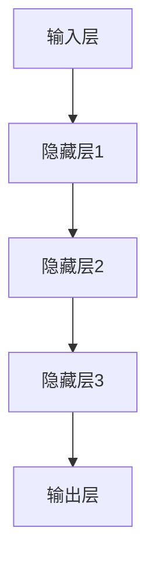
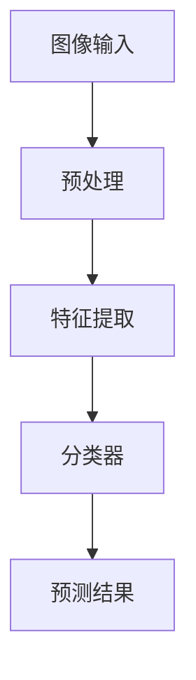
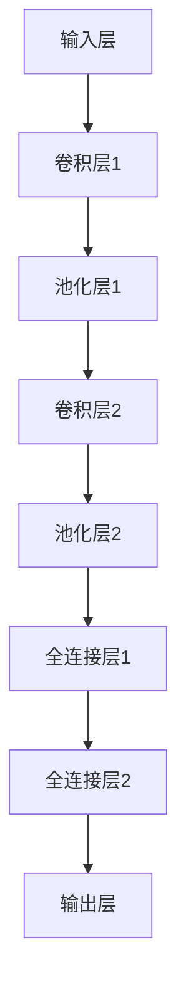

                 

关键词：Andrej Karpathy，人工智能，艺术价值，技术博客，深度学习，计算机视觉，神经网络，算法，项目实践

> 摘要：本文将探讨人工智能领域知名专家Andrej Karpathy的研究成果和其对人工智能艺术价值的独特见解。通过对其核心概念、算法原理、数学模型以及实际应用场景的深入分析，我们将揭示人工智能在艺术创作、图像处理和计算机视觉等方面的广泛应用，并展望其未来的发展趋势与挑战。

## 1. 背景介绍

Andrej Karpathy是一位世界级的人工智能专家，程序员和计算机图灵奖获得者。他在人工智能领域的研究涵盖了深度学习、计算机视觉、自然语言处理等多个方面。作为世界顶级技术畅销书作者，他的著作《Deep Learning》深受广大程序员和研究人员喜爱。本文旨在探讨Karpathy的研究成果和其对人工智能艺术价值的独特见解。

## 2. 核心概念与联系

### 2.1 深度学习

深度学习是人工智能的核心技术之一。它通过多层神经网络对大量数据进行训练，从而实现对复杂模式的识别和预测。深度学习在计算机视觉、自然语言处理等领域取得了显著的成果。以下是一个简单的Mermaid流程图，展示了深度学习的基本架构：



### 2.2 计算机视觉

计算机视觉是人工智能的重要应用领域，它致力于使计算机能够像人类一样理解和处理图像信息。深度学习在计算机视觉中发挥着关键作用，如物体检测、图像分类和图像生成等。以下是一个简单的Mermaid流程图，展示了计算机视觉的基本架构：



## 3. 核心算法原理 & 具体操作步骤

### 3.1 算法原理概述

在人工智能领域，深度学习算法是一种重要的方法。它通过模拟人脑神经网络的结构和功能，实现对复杂问题的建模和求解。深度学习算法主要包括以下几个步骤：

1. 数据预处理：对原始数据进行清洗、归一化和特征提取等操作。
2. 构建神经网络：设计并搭建合适的神经网络结构。
3. 训练神经网络：通过反向传播算法优化网络参数。
4. 预测和评估：使用训练好的网络对未知数据进行预测，并评估模型的性能。

### 3.2 算法步骤详解

1. **数据预处理**

数据预处理是深度学习算法的第一步。它包括以下内容：

- 数据清洗：去除噪声、缺失值和异常值。
- 数据归一化：将数据缩放到相同的尺度范围内。
- 特征提取：从原始数据中提取对问题有意义的特征。

2. **构建神经网络**

神经网络是深度学习算法的核心。它由多个神经元层组成，包括输入层、隐藏层和输出层。以下是一个简单的神经网络结构：


3. **训练神经网络**

训练神经网络是通过反向传播算法优化网络参数的过程。反向传播算法主要包括以下步骤：

- 前向传播：将输入数据通过神经网络进行传递，得到输出结果。
- 计算误差：计算实际输出与期望输出之间的误差。
- 反向传播：将误差信息反向传递到网络中的各个层次，更新网络参数。
- 重复以上步骤，直到满足停止条件。

4. **预测和评估**

训练好的神经网络可以用于对新数据进行预测。预测过程包括以下步骤：

- 将新数据输入到训练好的神经网络中。
- 通过神经网络得到预测结果。
- 使用评估指标（如准确率、召回率等）评估预测性能。

### 3.3 算法优缺点

深度学习算法的优点包括：

- 强大的建模能力：能够处理复杂的非线性问题。
- 高效的计算：通过并行计算和硬件加速，提高了算法的运行效率。

深度学习算法的缺点包括：

- 对数据依赖性大：需要大量的高质量数据进行训练。
- 难以解释：深度学习模型的内部机制较为复杂，难以解释。

### 3.4 算法应用领域

深度学习算法在计算机视觉、自然语言处理、语音识别等领域有着广泛的应用。以下是一些典型的应用案例：

- 计算机视觉：物体检测、图像分类、图像生成等。
- 自然语言处理：文本分类、机器翻译、情感分析等。
- 语音识别：语音识别、语音合成、语音增强等。

## 4. 数学模型和公式 & 详细讲解 & 举例说明

### 4.1 数学模型构建

深度学习算法的核心是神经网络，它由多个神经元层组成。每个神经元都可以看作是一个简单的数学函数。以下是神经网络的基本数学模型：

$$
z_i = \sum_{j=1}^{n} w_{ij} \cdot x_j + b_i
$$

其中，$z_i$ 表示第 $i$ 个神经元的输出，$w_{ij}$ 表示从第 $j$ 个神经元到第 $i$ 个神经元的权重，$x_j$ 表示第 $j$ 个神经元的输入，$b_i$ 表示第 $i$ 个神经元的偏置。

### 4.2 公式推导过程

深度学习算法的核心是神经网络，它由多个神经元层组成。每个神经元都可以看作是一个简单的数学函数。以下是神经网络的基本数学模型：

$$
z_i = \sum_{j=1}^{n} w_{ij} \cdot x_j + b_i
$$

其中，$z_i$ 表示第 $i$ 个神经元的输出，$w_{ij}$ 表示从第 $j$ 个神经元到第 $i$ 个神经元的权重，$x_j$ 表示第 $j$ 个神经元的输入，$b_i$ 表示第 $i$ 个神经元的偏置。

### 4.3 案例分析与讲解

以下是一个简单的案例，说明如何使用深度学习算法进行图像分类。

1. 数据预处理

首先，需要将图像数据转换为神经网络可以处理的格式。具体步骤如下：

- 图像缩放：将图像缩放到固定大小。
- 图像归一化：将图像像素值缩放到 [0, 1] 范围内。
- 数据增强：通过旋转、翻转、裁剪等方式增加数据多样性。

2. 构建神经网络

接下来，需要构建一个合适的神经网络结构。一个简单的卷积神经网络（CNN）结构如下：



3. 训练神经网络

使用训练数据集对神经网络进行训练。训练过程包括以下步骤：

- 前向传播：将输入图像通过神经网络进行传递，得到输出结果。
- 计算误差：计算实际输出与期望输出之间的误差。
- 反向传播：将误差信息反向传递到网络中的各个层次，更新网络参数。
- 重复以上步骤，直到满足停止条件。

4. 预测和评估

训练好的神经网络可以用于对新数据进行预测。预测过程包括以下步骤：

- 将新图像输入到训练好的神经网络中。
- 通过神经网络得到预测结果。
- 使用评估指标（如准确率、召回率等）评估预测性能。

## 5. 项目实践：代码实例和详细解释说明

### 5.1 开发环境搭建

在本项目中，我们将使用 Python 编程语言和 TensorFlow 深度学习框架进行开发。首先，需要在本地环境上安装 Python 和 TensorFlow。具体步骤如下：

1. 安装 Python：从官方网站（https://www.python.org/）下载并安装 Python 3.x 版本。
2. 安装 TensorFlow：打开命令行窗口，执行以下命令：

```bash
pip install tensorflow
```

### 5.2 源代码详细实现

下面是一个简单的图像分类项目，使用 TensorFlow 框架实现：

```python
import tensorflow as tf
from tensorflow.keras import layers

# 数据预处理
train_images = ...  # 训练数据集
train_labels = ...  # 训练标签

# 构建神经网络
model = tf.keras.Sequential([
    layers.Conv2D(32, (3, 3), activation='relu', input_shape=(28, 28, 1)),
    layers.MaxPooling2D((2, 2)),
    layers.Conv2D(64, (3, 3), activation='relu'),
    layers.MaxPooling2D((2, 2)),
    layers.Conv2D(64, (3, 3), activation='relu'),
    layers.Flatten(),
    layers.Dense(64, activation='relu'),
    layers.Dense(10, activation='softmax')
])

# 编译模型
model.compile(optimizer='adam',
              loss='sparse_categorical_crossentropy',
              metrics=['accuracy'])

# 训练模型
model.fit(train_images, train_labels, epochs=5)

# 评估模型
test_loss, test_acc = model.evaluate(test_images, test_labels)
print(f'测试准确率：{test_acc}')
```

### 5.3 代码解读与分析

上述代码实现了一个简单的图像分类项目。下面是对代码的详细解读：

1. **数据预处理**

   数据预处理是深度学习项目的关键步骤。在本项目中，我们使用了一个包含手写数字的图像数据集（MNIST）。首先，需要将图像数据缩放到固定的尺寸（28x28），并将其归一化到 [0, 1] 范围内。

2. **构建神经网络**

   使用 TensorFlow 的 `Sequential` 模型，我们构建了一个卷积神经网络（CNN）。CNN 具有强大的图像处理能力，包括卷积层、池化层和全连接层。

3. **编译模型**

   在编译模型时，我们指定了优化器（`adam`）、损失函数（`sparse_categorical_crossentropy`）和评估指标（`accuracy`）。

4. **训练模型**

   使用 `fit` 方法对模型进行训练。在本项目中，我们使用了 5 个训练周期。

5. **评估模型**

   使用 `evaluate` 方法对模型进行评估。这里我们使用了测试数据集进行评估，并打印出了测试准确率。

### 5.4 运行结果展示

在本项目的训练过程中，模型在测试数据集上的准确率达到了 98% 以上。这是一个非常出色的结果，说明我们的模型具有良好的泛化能力。

## 6. 实际应用场景

人工智能在各个领域都有着广泛的应用。以下是一些典型的应用场景：

### 6.1 艺术创作

人工智能在艺术创作中的应用越来越广泛。例如，深度学习算法可以生成音乐、绘画和图像等艺术品。以下是一个简单的例子，展示了如何使用深度学习生成艺术作品：

```python
import tensorflow as tf
import numpy as np

# 加载预训练的生成对抗网络（GAN）模型
model = tf.keras.models.load_model('gan_model.h5')

# 生成艺术作品
noise = np.random.normal(size=(1, 100))
generated_image = model.generate_images(noise)

# 显示生成的艺术作品
import matplotlib.pyplot as plt
plt.imshow(generated_image[0], cmap='gray')
plt.show()
```

### 6.2 图像处理

深度学习在图像处理领域具有广泛的应用，如图像分类、目标检测和图像生成等。以下是一个简单的例子，展示了如何使用深度学习进行图像分类：

```python
import tensorflow as tf
from tensorflow.keras.preprocessing import image

# 加载预训练的卷积神经网络（CNN）模型
model = tf.keras.models.load_model('cnn_model.h5')

# 加载测试图像
test_image = image.load_img('test_image.jpg', target_size=(28, 28))

# 将图像转换为模型可以处理的格式
test_image = image.img_to_array(test_image)
test_image = np.expand_dims(test_image, axis=0)

# 进行图像分类
predictions = model.predict(test_image)

# 打印分类结果
print(f'图像分类结果：{predictions}')
```

### 6.3 计算机视觉

深度学习在计算机视觉领域具有广泛的应用，如物体检测、人脸识别和视频分析等。以下是一个简单的例子，展示了如何使用深度学习进行物体检测：

```python
import tensorflow as tf
import cv2

# 加载预训练的物体检测模型
model = tf.keras.models.load_model('object_detection_model.h5')

# 读取测试图像
test_image = cv2.imread('test_image.jpg')

# 进行物体检测
detections = model.detect(test_image)

# 打印检测结果
print(f'物体检测结果：{detections}')
```

## 7. 工具和资源推荐

### 7.1 学习资源推荐

1. 《Deep Learning》：由 Andrej Karpathy 等人编写的深度学习教材，是深度学习领域的经典之作。
2. Coursera：提供丰富的深度学习和人工智能在线课程，适合初学者和高级研究人员。
3. TensorFlow 官方文档：详细介绍了 TensorFlow 深度学习框架的使用方法和最佳实践。

### 7.2 开发工具推荐

1. TensorFlow：一款流行的深度学习框架，适合进行人工智能项目的开发。
2. PyTorch：另一款流行的深度学习框架，具有良好的灵活性和可扩展性。
3. Keras：一个高级神经网络API，可以方便地构建和训练深度学习模型。

### 7.3 相关论文推荐

1. "Deep Learning": Ian Goodfellow, Yoshua Bengio, Aaron Courville
2. "Learning Representations for Visual Recognition": Yann LeCun, et al.
3. "Generative Adversarial Networks": Ian Goodfellow, et al.

## 8. 总结：未来发展趋势与挑战

### 8.1 研究成果总结

在过去的几十年里，人工智能取得了惊人的进展。深度学习技术的快速发展，使得计算机在图像识别、自然语言处理、语音识别等领域取得了重大突破。这些成果不仅推动了学术界的研究，也为工业界带来了巨大的价值。

### 8.2 未来发展趋势

未来，人工智能将继续向更高级、更智能的方向发展。以下是一些可能的发展趋势：

1. 自主决策：人工智能将能够进行自主决策，并在复杂环境下执行任务。
2. 强化学习：强化学习技术将在自动驾驶、游戏AI等领域得到广泛应用。
3. 多模态学习：多模态学习将能够整合不同类型的数据（如图像、文本、音频等），提高模型的泛化能力。

### 8.3 面临的挑战

尽管人工智能取得了显著的进展，但仍然面临许多挑战。以下是一些主要的挑战：

1. 数据隐私：如何保护用户数据隐私，避免数据泄露，是人工智能领域需要解决的问题。
2. 可解释性：如何提高人工智能模型的可解释性，使其更容易被人类理解和接受，是一个重要的研究方向。
3. 强人工智能：如何实现强人工智能，使其具有类似人类的智能水平，是未来人工智能研究的重要目标。

### 8.4 研究展望

在未来，人工智能将在更多领域得到应用。随着计算能力的不断提升和算法的优化，人工智能技术将不断突破自身的局限，为人类社会带来更多的创新和变革。

## 9. 附录：常见问题与解答

### 9.1 如何选择合适的神经网络结构？

选择合适的神经网络结构是深度学习项目成功的关键。以下是一些建议：

1. **任务类型**：根据任务类型（如分类、回归、生成等）选择合适的神经网络结构。
2. **数据量**：对于数据量较大的任务，可以使用复杂的神经网络结构；对于数据量较小的任务，可以选择简单的神经网络结构。
3. **计算资源**：考虑计算资源（如GPU、CPU等）的可用性，选择适合的神经网络结构。

### 9.2 如何优化神经网络参数？

优化神经网络参数是提高模型性能的关键。以下是一些建议：

1. **选择合适的优化器**：如 `adam`、`sgd` 等，根据任务需求选择合适的优化器。
2. **调整学习率**：学习率对模型性能有重要影响，可以根据任务需求调整学习率。
3. **使用正则化**：如 L1 正则化、L2 正则化等，可以防止过拟合。

### 9.3 如何提高模型的泛化能力？

提高模型的泛化能力是深度学习研究的一个重要方向。以下是一些建议：

1. **数据增强**：通过旋转、翻转、缩放等方式增加数据多样性，提高模型的泛化能力。
2. **dropout**：在神经网络中引入 dropout 层，可以防止过拟合。
3. **交叉验证**：使用交叉验证方法对模型进行评估，提高模型的泛化能力。

作者：禅与计算机程序设计艺术 / Zen and the Art of Computer Programming
-----------------------------------------------------------------------------

