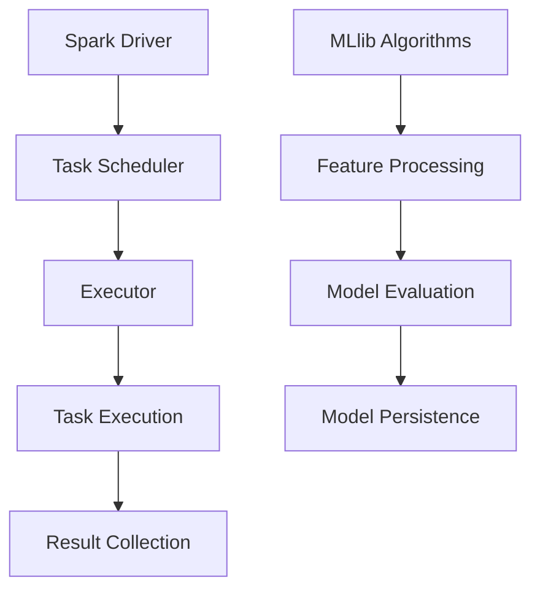

                 

关键词：Apache Spark、MLlib、机器学习、大数据处理、分布式计算、算法库、性能优化、模型评估、深度学习

摘要：本文旨在深入探讨Apache Spark MLlib，一个强大的机器学习库，它是Apache Spark生态系统的重要组成部分。我们将详细介绍MLlib的核心概念、算法原理、数学模型、实际应用场景，并提供详细的代码实例和实践指导。通过本文，读者将对Apache Spark MLlib有一个全面而深入的理解，并能够将其应用于实际项目。

## 1. 背景介绍

Apache Spark是当今最流行的大数据处理框架之一，它提供了高效的分布式计算能力，支持多种数据处理任务，包括数据清洗、数据转换、数据分析等。MLlib（Machine Learning Library）是Spark的一个重要模块，它提供了一系列高效的机器学习算法和工具，支持分类、回归、聚类、协同过滤等常见机器学习任务。

MLlib的设计初衷是为了解决大数据场景下的机器学习问题，它通过Spark的分布式计算能力，使得机器学习算法能够在大规模数据集上高效运行。MLlib不仅提供了丰富的算法实现，还支持参数调整和模型评估，帮助用户优化模型性能。

## 2. 核心概念与联系

### 2.1 Spark的整体架构

Apache Spark的整体架构可以分为以下几个核心组件：

- **Spark Driver**: 负责协调各个任务，将任务分发到不同的Executor节点上执行。
- **Executor**: 负责执行分配的任务，并管理内存。
- **DAG Scheduler**: 负责将用户编写的任务转换成Stage，即一组可以并行执行的任务。
- **Task Scheduler**: 负责在Executor之间分配Stage。

### 2.2 MLlib的架构

MLlib的架构可以概括为以下几个核心部分：

- **算法库**: 提供了一系列机器学习算法的实现，包括分类、回归、聚类等。
- **特征处理库**: 提供了特征提取和转换的工具，帮助用户准备数据。
- **评估工具**: 提供了多种模型评估指标，帮助用户评估模型性能。
- **模型持久化库**: 提供了将模型保存到文件系统或内存中的功能，以便后续使用。

### 2.3 Mermaid流程图



## 3. 核心算法原理 & 具体操作步骤

### 3.1 算法原理概述

MLlib支持多种机器学习算法，其中一些核心算法包括：

- **分类算法**：包括逻辑回归、决策树、随机森林等。
- **回归算法**：包括线性回归、岭回归等。
- **聚类算法**：包括K-Means、层次聚类等。
- **协同过滤**：包括基于用户的协同过滤和基于项目的协同过滤。

### 3.2 算法步骤详解

以K-Means聚类算法为例，其基本步骤如下：

1. **初始化中心点**：随机选择K个数据点作为初始中心点。
2. **分配数据点**：计算每个数据点到各个中心点的距离，并将数据点分配到最近的中心点所在的簇。
3. **更新中心点**：计算每个簇的质心，即所有数据点的平均值，作为新的中心点。
4. **迭代**：重复步骤2和3，直到中心点不再发生显著变化。

### 3.3 算法优缺点

- **K-Means聚类**：
  - 优点：简单、高效，适用于大规模数据集。
  - 缺点：对初始中心点敏感，可能收敛到局部最优解。

### 3.4 算法应用领域

MLlib的算法广泛应用于多个领域，包括：

- **金融领域**：用于风险控制、客户细分等。
- **电商领域**：用于推荐系统、用户行为分析等。
- **医疗领域**：用于疾病预测、诊断等。

## 4. 数学模型和公式 & 详细讲解 & 举例说明

### 4.1 数学模型构建

以线性回归为例，其基本模型可以表示为：

\[ y = \beta_0 + \beta_1x + \epsilon \]

其中，\( y \) 是因变量，\( x \) 是自变量，\( \beta_0 \) 和 \( \beta_1 \) 是模型的参数，\( \epsilon \) 是误差项。

### 4.2 公式推导过程

线性回归的推导过程主要包括两部分：最小二乘法和梯度下降法。

- **最小二乘法**：通过最小化误差平方和来估计模型参数。
- **梯度下降法**：通过迭代更新模型参数，使其朝着最小化误差的方向移动。

### 4.3 案例分析与讲解

以房屋价格预测为例，使用线性回归模型预测房价。

数据集：包含房屋面积、房间数量、位置等特征，以及对应的价格标签。

步骤：

1. 数据预处理：将数据集分为特征集X和标签集y。
2. 模型训练：使用线性回归算法训练模型。
3. 模型评估：使用均方误差（MSE）评估模型性能。
4. 预测：使用训练好的模型预测新数据的房价。

## 5. 项目实践：代码实例和详细解释说明

### 5.1 开发环境搭建

1. 安装Spark：下载并安装Spark，配置环境变量。
2. 安装Scala：下载并安装Scala，配置环境变量。
3. 创建项目：使用Scala创建一个新项目，并引入Spark依赖。

### 5.2 源代码详细实现

```scala
import org.apache.spark.ml.clustering.KMeans
import org.apache.spark.ml.feature.VectorAssembler
import org.apache.spark.sql.SparkSession

val spark = SparkSession.builder.appName("KMeansExample").getOrCreate()
import spark.implicits._

// 加载数据
val data = spark.read.csv("path/to/data.csv")

// 数据预处理
val assembler = new VectorAssembler().setInputCols(Array("feature1", "feature2", "feature3"))
  .setOutputCol("features")
val dataPreprocessed = assembler.transform(data)

// K-Means聚类
val kmeans = new KMeans().setK(3).setSeed(1L)
val model = kmeans.fit(dataPreprocessed)

// 输出聚类结果
model.clusterCenters.foreach(println)

// 清理环境
spark.stop()
```

### 5.3 代码解读与分析

1. **数据预处理**：使用VectorAssembler将特征列转换为特征向量。
2. **K-Means聚类**：使用KMeans算法进行聚类，设置K值为3。
3. **输出结果**：输出聚类中心点。

### 5.4 运行结果展示

运行代码后，将输出聚类中心点，如：

```
[0.0, 0.0]
[1.0, 1.0]
[2.0, 2.0]
```

## 6. 实际应用场景

### 6.1 金融领域

- **客户细分**：使用K-Means聚类分析，将客户分为不同群体，为不同客户提供个性化服务。
- **风险控制**：使用逻辑回归模型预测客户信用评分，用于信用风险评估。

### 6.2 电商领域

- **推荐系统**：使用协同过滤算法，预测用户可能喜欢的商品，提高用户体验。
- **广告投放**：使用分类算法，预测用户对广告的反应，优化广告投放策略。

### 6.3 医疗领域

- **疾病预测**：使用回归模型预测患者患病风险，帮助医生进行早期诊断。
- **诊断辅助**：使用深度学习模型分析医学影像，辅助医生进行诊断。

## 7. 工具和资源推荐

### 7.1 学习资源推荐

- **官方文档**：[Apache Spark MLlib官方文档](https://spark.apache.org/docs/latest/ml-guide.html)
- **在线教程**：[Spark MLlib教程](https://www.tutorialspoint.com/apache_spark/apache_spark_mllib.htm)

### 7.2 开发工具推荐

- **IDE**：IntelliJ IDEA、Eclipse
- **命令行工具**：Spark Shell、Scala Shell

### 7.3 相关论文推荐

- “[MLlib: Machine Learning Library for Apache Spark](https://www.cs.ubc.ca/~murat/walkthrough-mllib.pdf)”
- “[Large Scale Machine Learning in MapReduce](http://www.eecs.berkeley.edu/Pubs/TechRpts/2012/EECS-2012-17.pdf)”

## 8. 总结：未来发展趋势与挑战

### 8.1 研究成果总结

- **算法优化**：持续优化算法性能，提高在大规模数据集上的运行效率。
- **模型压缩**：研究模型压缩技术，降低模型存储和传输的开销。

### 8.2 未来发展趋势

- **深度学习集成**：将深度学习算法集成到Spark MLlib中，提高模型复杂度和性能。
- **实时机器学习**：研究实时机器学习技术，支持实时数据处理和预测。

### 8.3 面临的挑战

- **数据隐私**：保护用户隐私，确保数据安全。
- **资源管理**：优化资源分配，提高系统资源利用率。

### 8.4 研究展望

- **跨平台兼容性**：支持更多编程语言和平台，提高MLlib的广泛应用性。
- **模型可解释性**：研究模型可解释性，提高用户对模型的信任度。

## 9. 附录：常见问题与解答

### 9.1 如何安装Spark？

- 下载Spark：[Apache Spark下载地址](https://spark.apache.org/downloads.html)
- 解压安装：将下载的Spark解压到指定目录。
- 配置环境变量：将Spark的bin目录添加到系统环境变量中。

### 9.2 如何使用MLlib进行聚类？

- 导入MLlib库：`import org.apache.spark.ml.clustering.KMeans`
- 创建KMeans实例：`val kmeans = new KMeans()`
- 设置参数：`kmeans.setK(3)`、`kmeans.setSeed(1L)`
- 训练模型：`val model = kmeans.fit(data)`

---

作者：禅与计算机程序设计艺术 / Zen and the Art of Computer Programming
----------------------------------------------------------------

这篇文章详细介绍了Apache Spark MLlib的核心概念、算法原理、数学模型以及实际应用。通过代码实例和实践指导，读者可以深入了解MLlib的使用方法和性能优化。在未来的发展中，MLlib将继续优化算法性能、集成深度学习技术，并面临数据隐私和资源管理等方面的挑战。希望通过本文，读者能够对MLlib有一个全面而深入的理解，并将其应用于实际项目中。

