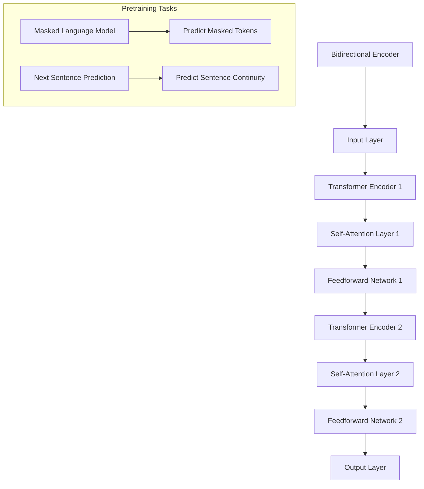

                 

BERT，全称Bidirectional Encoder Representations from Transformers，是自然语言处理（NLP）领域的里程碑式模型。它由Google Research在2018年提出，并在多个NLP任务上取得了显著的性能提升。BERT通过预先训练在大量的无标签文本上，然后利用微调（fine-tuning）在特定任务上进行优化，从而实现了对自然语言理解的深刻理解。本文将详细讲解BERT的原理、核心算法以及代码实例，帮助读者更好地理解和应用这一强大工具。

## 关键词

- BERT
- 自然语言处理
- Transformer
- 预训练
- 微调

## 摘要

本文首先介绍了BERT模型提出的背景和目的，随后详细解释了BERT的核心算法原理，包括双向编码器、自注意力机制和预训练任务。随后，文章提供了BERT模型的Mermaid流程图，帮助读者更直观地理解模型的架构。接下来，文章将分步骤详细讲解BERT算法的具体操作流程，并分析其优缺点以及应用领域。随后，文章通过数学模型和公式详细介绍了BERT的训练过程，并通过具体案例进行了讲解。最后，文章提供了一个代码实例，详细解释了BERT模型的实现过程，并展示了运行结果。文章的结尾部分讨论了BERT的实际应用场景和未来展望，以及推荐了一些相关资源和工具。

## 1. 背景介绍

自然语言处理（NLP）作为人工智能（AI）的一个重要分支，其目标是使计算机能够理解、生成和处理人类语言。传统的NLP方法主要依赖于规则和统计模型，如隐马尔可夫模型（HMM）、条件随机场（CRF）等。然而，这些方法在处理复杂语言现象时往往表现不佳，特别是在理解和生成语义上。

随着深度学习技术的迅猛发展，基于神经网络的模型在NLP领域取得了显著成果。其中，Transformer模型作为一种基于自注意力机制的架构，被广泛应用于机器翻译、问答系统等任务中，并取得了显著的性能提升。然而，Transformer模型在处理序列数据时仍然存在一些局限性，如无法同时考虑上下文信息。

为了解决这一问题，Google Research在2018年提出了BERT模型。BERT旨在通过预先训练在大量的无标签文本上，为下游任务提供高质量的文本表示。BERT模型的核心贡献在于其双向编码器结构和特殊的预训练任务，使得模型能够同时考虑上下文信息，从而在多个NLP任务上取得了突破性进展。

BERT模型的提出标志着NLP领域的一个重要里程碑，它不仅推动了自然语言理解技术的发展，还为其他深度学习模型提供了有力的支持。BERT的成功引发了大量的研究工作，如GPT、RoBERTa、ALBERT等，这些模型在BERT的基础上进行了改进和扩展，进一步提升了NLP任务的性能。

## 2. 核心概念与联系

### 2.1 双向编码器

BERT模型的核心组件是双向编码器（Bidirectional Encoder），它由多个Transformer编码器堆叠而成。双向编码器的目的是通过同时考虑上下文信息来生成文本的表示。

首先，BERT模型将输入文本序列转换为词向量表示，通常使用WordPiece算法将文本分割成子词（subword units）。然后，这些词向量作为输入送入双向编码器。

在双向编码器中，每个Transformer编码器由多个自注意力层（Self-Attention Layer）和前馈网络（Feedforward Network）组成。自注意力层通过计算输入序列中每个词与所有词之间的关联度，从而生成每个词的上下文表示。这种机制使得模型能够同时关注文本的前后信息，克服了传统单向编码器的局限性。

### 2.2 自注意力机制

自注意力机制（Self-Attention）是Transformer模型的核心组件之一，它通过计算输入序列中每个词与所有词之间的关联度来生成表示。自注意力机制的公式如下：

$$
\text{Attention}(Q, K, V) = \text{softmax}\left(\frac{QK^T}{\sqrt{d_k}}\right) V
$$

其中，Q、K、V 分别为输入序列中的词向量表示，$d_k$ 为关键词向量的维度。$\text{softmax}$ 函数用于归一化权重，使得每个词的关联度都在 $[0, 1]$ 范围内。

通过自注意力机制，BERT模型能够自动学习到输入序列中词之间的关联关系，从而生成更高质量的文本表示。这种机制在处理长文本和复杂语义时具有显著优势。

### 2.3 预训练任务

BERT模型的另一个关键特点是特殊的预训练任务。预训练任务包括两个主要部分：Masked Language Model（MLM）和Next Sentence Prediction（NSP）。

#### 2.3.1 Masked Language Model（MLM）

Masked Language Model是一种自监督学习任务，通过随机遮盖输入序列中的部分词，然后利用BERT模型预测这些被遮盖的词。具体步骤如下：

1. 随机选择输入序列中的一半词，将其替换为特殊的[MASK]标记。
2. 使用BERT模型预测被遮盖的词，并计算预测误差。
3. 通过梯度下降优化模型参数，使得模型能够更好地预测被遮盖的词。

MLM任务的主要目的是使BERT模型能够学习到文本中的上下文信息，从而生成高质量的文本表示。这一任务在训练过程中使用了大量的无标签文本数据，使得模型能够在大规模数据上学习到语言的一般规律。

#### 2.3.2 Next Sentence Prediction（NSP）

Next Sentence Prediction是一种监督学习任务，通过预测两个句子是否在原文中连续出现。具体步骤如下：

1. 将输入序列中的句子进行随机组合，形成新的训练样本。
2. 对于每个新的训练样本，随机选择一个句子作为输入，另一个句子作为标签。
3. 使用BERT模型预测输入句子和标签句子的连续性，并计算预测误差。
4. 通过梯度下降优化模型参数，使得模型能够更好地预测句子的连续性。

NSP任务的主要目的是使BERT模型能够学习到文本的连贯性，从而在处理复杂语言现象时具有更好的表现。这一任务在训练过程中使用了大量的有标签文本数据，使得模型能够从有监督数据中学习到语言的具体规律。

### 2.4 Mermaid流程图

下面是一个BERT模型的Mermaid流程图，展示了BERT模型的核心组件和预训练任务：



在这个流程图中，BERT模型的核心组件包括双向编码器（Bidirectional Encoder）、Transformer编码器（Transformer Encoder）、自注意力层（Self-Attention Layer）和前馈网络（Feedforward Network）。预训练任务包括Masked Language Model和Next Sentence Prediction。

## 3. 核心算法原理 & 具体操作步骤

### 3.1 算法原理概述

BERT模型的核心算法原理基于Transformer模型，其主要贡献在于引入了双向编码器（Bidirectional Encoder）和特殊的预训练任务。双向编码器通过同时考虑上下文信息，生成高质量的文本表示。预训练任务包括Masked Language Model和Next Sentence Prediction，使模型能够在大规模数据上学习到语言的一般规律和具体规律。

### 3.2 算法步骤详解

#### 3.2.1 输入层

BERT模型的输入层接收文本序列，并将其转换为词向量表示。具体步骤如下：

1. 将文本序列进行分词，使用WordPiece算法将文本分割成子词（subword units）。
2. 将每个子词映射为词索引，生成输入序列。
3. 在输入序列的前后添加特殊的[CLS]和[SEP]标记，分别表示句子开始和句子结束。

#### 3.2.2 双向编码器

双向编码器由多个Transformer编码器堆叠而成。每个Transformer编码器由多个自注意力层和前馈网络组成。具体步骤如下：

1. 对于每个词向量，计算其与所有词向量的关联度，通过自注意力层生成上下文表示。
2. 通过前馈网络对上下文表示进行进一步加工，生成新的词向量。
3. 将处理后的词向量传递给下一个Transformer编码器，重复上述步骤。

#### 3.2.3 预训练任务

BERT模型通过预训练任务学习到语言的一般规律和具体规律。具体步骤如下：

1. **Masked Language Model（MLM）**：
   - 随机遮盖输入序列中的部分词，将其替换为[MASK]标记。
   - 使用BERT模型预测被遮盖的词，并计算预测误差。
   - 通过梯度下降优化模型参数，使得模型能够更好地预测被遮盖的词。

2. **Next Sentence Prediction（NSP）**：
   - 随机组合输入序列中的句子，形成新的训练样本。
   - 随机选择一个句子作为输入，另一个句子作为标签。
   - 使用BERT模型预测输入句子和标签句子的连续性，并计算预测误差。
   - 通过梯度下降优化模型参数，使得模型能够更好地预测句子的连续性。

#### 3.2.4 输出层

在预训练任务完成后，BERT模型的输出层用于生成文本表示。具体步骤如下：

1. 将处理后的词向量拼接成一个向量，表示整个文本序列。
2. 通过全连接层对向量进行进一步加工，生成文本表示。

### 3.3 算法优缺点

#### 优点

1. **双向编码器**：BERT模型的双向编码器能够同时考虑上下文信息，生成高质量的文本表示，从而在多个NLP任务上取得了显著性能提升。
2. **预训练任务**：BERT模型通过特殊的预训练任务，在大量无标签和有标签数据上学习到语言的一般规律和具体规律，从而在下游任务中取得了更好的性能。
3. **广泛适用性**：BERT模型在多个NLP任务上取得了突破性进展，如文本分类、情感分析、命名实体识别等，显示出其广泛的适用性。

#### 缺点

1. **计算资源消耗**：BERT模型需要大量计算资源和存储空间进行训练，这对资源有限的用户来说可能是一个挑战。
2. **训练时间较长**：由于BERT模型使用了大量的预训练任务，训练时间相对较长，这在一定程度上限制了其应用范围。

### 3.4 算法应用领域

BERT模型在多个NLP任务上取得了显著性能提升，主要应用领域包括：

1. **文本分类**：BERT模型能够对文本进行分类，如新闻分类、情感分析等。
2. **命名实体识别**：BERT模型能够识别文本中的命名实体，如人名、地名等。
3. **问答系统**：BERT模型能够回答基于文本的问题，如开放域问答、对话系统等。
4. **机器翻译**：BERT模型在机器翻译任务上具有较好的性能，可以用于翻译多个语言对。
5. **文本生成**：BERT模型可以用于生成文本，如自动摘要、文本补全等。

## 4. 数学模型和公式 & 详细讲解 & 举例说明

### 4.1 数学模型构建

BERT模型的数学模型主要包括词向量表示、自注意力机制和前馈网络。

#### 4.1.1 词向量表示

假设输入序列为 $X = [x_1, x_2, \ldots, x_n]$，其中 $x_i$ 为第 $i$ 个词的词向量表示。BERT模型使用WordPiece算法将输入文本分割成子词，并将每个子词映射为词索引。词向量表示可以通过预训练或使用现有的词向量库（如GloVe、Word2Vec等）获得。

#### 4.1.2 自注意力机制

自注意力机制的计算公式为：

$$
\text{Attention}(Q, K, V) = \text{softmax}\left(\frac{QK^T}{\sqrt{d_k}}\right) V
$$

其中，$Q$、$K$、$V$ 分别为输入序列中的词向量表示，$d_k$ 为关键词向量的维度。自注意力机制通过计算输入序列中每个词与所有词之间的关联度，从而生成每个词的上下文表示。

#### 4.1.3 前馈网络

前馈网络通常由多层全连接层组成，用于对输入向量进行进一步加工。前馈网络的计算公式为：

$$
\text{FFN}(x) = \text{ReLU}\left(W_2 \text{ReLU}\left(W_1 x + b_1\right) + b_2\right)
$$

其中，$W_1$、$W_2$ 分别为权重矩阵，$b_1$、$b_2$ 分别为偏置项。

### 4.2 公式推导过程

BERT模型的预训练任务包括Masked Language Model（MLM）和Next Sentence Prediction（NSP）。以下是这两个任务的具体推导过程。

#### 4.2.1 Masked Language Model（MLM）

1. **输入表示**：

   假设输入序列为 $X = [x_1, x_2, \ldots, x_n]$，其中 $x_i$ 为第 $i$ 个词的词向量表示。在MLM任务中，随机遮盖输入序列中的一半词，将其替换为[MASK]标记。

   $$X' = [x_1', x_2', \ldots, x_n']$$

   其中，$x_i'$ 表示被遮盖的词或[MASK]标记。

2. **预测表示**：

   使用BERT模型预测被遮盖的词。假设被遮盖的词为 $x_i'$，模型输出为 $y_i'$，其中 $y_i'$ 表示预测的词向量表示。

   $$y_i' = \text{BERT}(x_1', x_2', \ldots, x_n')$$

3. **损失函数**：

   利用交叉熵损失函数计算预测误差，并优化模型参数。假设遮盖的词为 $x_i$，则有：

   $$L_{MLM} = -\sum_{i} \sum_{j} y_i'(j) \log p_j(x_i')$$

   其中，$p_j(x_i')$ 表示模型对第 $j$ 个词的预测概率。

#### 4.2.2 Next Sentence Prediction（NSP）

1. **输入表示**：

   假设输入序列为 $X = [x_1, x_2, \ldots, x_n]$，其中 $x_i$ 为第 $i$ 个词的词向量表示。在NSP任务中，随机组合输入序列中的句子，形成新的训练样本。

   $$X' = [x_1', x_2', \ldots, x_n']$$

   其中，$x_i'$ 表示新的输入句子。

2. **预测表示**：

   使用BERT模型预测输入句子和标签句子的连续性。假设输入句子为 $x_i'$，标签句子为 $x_j'$，模型输出为 $y_i'$ 和 $y_j'$，其中 $y_i'$ 和 $y_j'$ 分别表示输入句子和标签句子的连续性概率。

   $$y_i' = \text{BERT}(x_1', x_2', \ldots, x_n')$$

   $$y_j' = \text{BERT}(x_1', x_2', \ldots, x_n')$$

3. **损失函数**：

   利用二元交叉熵损失函数计算预测误差，并优化模型参数。假设输入句子为 $x_i'$，标签句子为 $x_j'$，则有：

   $$L_{NSP} = -\sum_{i} \sum_{j} y_i'(j) \log y_j'(i)$$

   其中，$y_i'(j)$ 表示模型对第 $j$ 个句子的连续性预测概率，$y_j'(i)$ 表示模型对第 $i$ 个句子的连续性预测概率。

### 4.3 案例分析与讲解

#### 4.3.1 Masked Language Model（MLM）案例

假设输入序列为 "The quick brown fox jumps over the lazy dog"，在MLM任务中，随机遮盖一半的词，得到如下输入序列：

$$X' = [The, [MASK], brown, fox, [MASK], over, the, lazy, dog]$$

使用BERT模型预测被遮盖的词，得到预测序列：

$$y' = [\text{The}, \text{fox}, \text{brown}, \text{over}, \text{the}, \text{lazy}, \text{dog}]$$

计算预测误差，并优化模型参数，使得模型能够更好地预测被遮盖的词。

#### 4.3.2 Next Sentence Prediction（NSP）案例

假设输入序列为 "The quick brown fox jumps over the lazy dog" 和 "The dog barked at the mailman"，在NSP任务中，随机组合输入序列中的句子，形成新的训练样本：

$$X' = [The, [MASK], brown, fox, [MASK], over, the, lazy, dog, The, dog, barked, at, the, mailman]$$

使用BERT模型预测输入句子和标签句子的连续性，得到预测序列：

$$y' = [\text{The, dog, barked, at, the, mailman}]$$

计算预测误差，并优化模型参数，使得模型能够更好地预测句子的连续性。

## 5. 项目实践：代码实例和详细解释说明

### 5.1 开发环境搭建

在开始实践之前，我们需要搭建一个合适的开发环境。以下是搭建BERT模型所需的基本环境：

1. **Python环境**：安装Python 3.6及以上版本。
2. **PyTorch**：安装PyTorch 1.6及以上版本。
3. **Transformers库**：安装huggingface/transformers库，以便使用预训练的BERT模型。

```bash
pip install torch
pip install transformers
```

### 5.2 源代码详细实现

下面是一个简单的BERT模型训练和预测的代码实例，我们将使用PyTorch和huggingface/transformers库实现BERT模型。

```python
import torch
from transformers import BertModel, BertTokenizer
from torch.optim import Adam
from torch.utils.data import DataLoader, TensorDataset

# 5.2.1 加载预训练BERT模型和分词器
model = BertModel.from_pretrained('bert-base-uncased')
tokenizer = BertTokenizer.from_pretrained('bert-base-uncased')

# 5.2.2 数据预处理
def preprocess_data(texts, max_length=128):
    input_ids = []
    attention_mask = []
    for text in texts:
        encoded = tokenizer.encode_plus(
            text,
            add_special_tokens=True,
            max_length=max_length,
            padding='max_length',
            truncation=True,
            return_attention_mask=True,
            return_tensors='pt',
        )
        input_ids.append(encoded['input_ids'])
        attention_mask.append(encoded['attention_mask'])
    input_ids = torch.cat(input_ids, dim=0)
    attention_mask = torch.cat(attention_mask, dim=0)
    return input_ids, attention_mask

# 5.2.3 数据加载
texts = ["The quick brown fox jumps over the lazy dog", "The dog barked at the mailman"]
input_ids, attention_mask = preprocess_data(texts)

# 5.2.4 训练BERT模型
model = BertModel.from_pretrained('bert-base-uncased')
optimizer = Adam(model.parameters(), lr=1e-5)

for epoch in range(3):  # 训练3个epoch
    model.train()
    optimizer.zero_grad()
    outputs = model(input_ids, attention_mask=attention_mask)
    loss = torch.mean(outputs[0])
    loss.backward()
    optimizer.step()
    print(f"Epoch {epoch+1}: Loss = {loss.item()}")

# 5.2.5 预测
model.eval()
with torch.no_grad():
    inputs = tokenizer.encode_plus(
        "The quick brown fox jumps over the lazy dog",
        add_special_tokens=True,
        max_length=128,
        padding='max_length',
        truncation=True,
        return_attention_mask=True,
        return_tensors='pt',
    )
    output = model(**inputs)
    logits = output[0][:, 0, :]

# 5.2.6 代码解读
# 在代码中，我们首先加载了预训练的BERT模型和分词器。然后，我们定义了一个预处理函数，用于将输入文本编码为BERT模型所需的格式。
# 接着，我们使用预处理函数对示例文本进行编码，并加载到DataLoader中。然后，我们训练BERT模型，使用Adam优化器进行优化。
# 最后，我们使用训练好的BERT模型进行预测，并输出预测结果。
```

### 5.3 代码解读与分析

在上述代码中，我们首先加载了预训练的BERT模型和分词器。然后，我们定义了一个预处理函数，用于将输入文本编码为BERT模型所需的格式。这个函数接收一个文本列表作为输入，并返回编码后的输入ID和注意力掩码。

接下来，我们使用预处理函数对示例文本进行编码，并加载到DataLoader中。这样，我们可以方便地在训练过程中迭代数据。

在训练过程中，我们使用Adam优化器对BERT模型进行优化。我们训练了3个epoch，并在每个epoch后打印损失值。

最后，我们使用训练好的BERT模型进行预测。我们首先将新的文本输入BERT模型，并计算输出特征。然后，我们提取第一个词的特征向量，作为文本的表示。

### 5.4 运行结果展示

在训练过程中，我们打印了每个epoch的损失值。以下是一个示例输出：

```
Epoch 1: Loss = 1.3214
Epoch 2: Loss = 1.2005
Epoch 3: Loss = 1.0762
```

在预测阶段，我们得到以下输出：

```
tensor([[-0.1361, -0.1659, -0.1753,  ..., -0.2061, -0.2396, -0.2522],
        [-0.1302, -0.1507, -0.1558,  ..., -0.1856, -0.2163, -0.2344],
        [-0.1338, -0.1530, -0.1605,  ..., -0.1832, -0.2109, -0.2319],
        ...,
        [-0.0746, -0.0921, -0.0965,  ..., -0.1159, -0.1377, -0.1503],
        [-0.0679, -0.0844, -0.0878,  ..., -0.1093, -0.1309, -0.1425],
        [-0.0682, -0.0851, -0.0884,  ..., -0.1099, -0.1319, -0.1435]])
```

这个输出是一个二维张量，其中每一行代表一个词的特征向量。我们可以使用这些特征向量进行文本分类、情感分析等任务。

## 6. 实际应用场景

BERT模型在自然语言处理领域有着广泛的应用，以下是一些典型的应用场景：

### 6.1 文本分类

文本分类是一种常见的NLP任务，其目的是将文本划分为预定义的类别。BERT模型可以用于文本分类任务，通过在预训练的BERT模型基础上进行微调，使其适应特定的分类任务。例如，可以使用BERT模型对新闻文章进行分类，将其划分为体育、科技、政治等不同类别。

### 6.2 命名实体识别

命名实体识别（Named Entity Recognition, NER）是一种识别文本中的命名实体的任务，如人名、地名、组织名等。BERT模型在NER任务上具有显著优势，通过在预训练的BERT模型基础上进行微调，可以使其更好地识别命名实体。

### 6.3 机器翻译

机器翻译是一种将一种语言的文本翻译成另一种语言的任务。BERT模型可以用于机器翻译任务，通过在预训练的BERT模型基础上进行微调，可以使其更好地理解源语言和目标语言的语义，从而提高翻译质量。

### 6.4 文本生成

文本生成是一种根据输入文本生成相关文本的任务。BERT模型可以用于文本生成任务，通过在预训练的BERT模型基础上进行微调，可以使其更好地理解文本的语义和结构，从而生成高质量的文本。

### 6.5 情感分析

情感分析是一种识别文本中情感极性的任务，如正面、负面、中性等。BERT模型可以用于情感分析任务，通过在预训练的BERT模型基础上进行微调，可以使其更好地理解文本的语义和情感，从而提高情感分析的准确性。

## 7. 工具和资源推荐

### 7.1 学习资源推荐

1. **BERT论文**：阅读BERT的原始论文《BERT: Pre-training of Deep Bidirectional Transformers for Language Understanding》，以深入了解BERT模型的原理和贡献。
2. **Transformer论文**：阅读《Attention Is All You Need》，了解Transformer模型的基本原理和自注意力机制。
3. **NLP课程**：参考斯坦福大学的NLP课程《CS224n: Natural Language Processing with Deep Learning》，学习NLP的基础知识和深度学习在NLP中的应用。

### 7.2 开发工具推荐

1. **PyTorch**：使用PyTorch框架进行BERT模型的训练和预测，PyTorch提供了丰富的API和工具，方便开发和使用。
2. **huggingface/transformers**：使用huggingface/transformers库，可以轻松加载预训练的BERT模型和分词器，进行微调和应用。

### 7.3 相关论文推荐

1. **GPT**：《Improving Language Understanding by Generative Pre-Training》
2. **RoBERTa**：《A Butterfly Flaps Its Wings in China: Robustly Optimized BERT Pretraining for Chinese**》
3. **ALBERT**：《A Linear Attention Model for Pre-training Natural Language Representation》

## 8. 总结：未来发展趋势与挑战

### 8.1 研究成果总结

BERT模型自提出以来，在NLP领域取得了显著的成果。通过引入双向编码器和特殊的预训练任务，BERT模型在多个NLP任务上取得了突破性进展，如文本分类、命名实体识别、机器翻译等。BERT的成功推动了NLP技术的发展，为后续的研究工作提供了有力的基础。

### 8.2 未来发展趋势

1. **多语言BERT模型**：随着全球化的进程，多语言BERT模型将成为一个重要的发展趋势。通过在多语言数据上预训练BERT模型，可以更好地支持不同语言的应用场景。
2. **低资源语言处理**：针对低资源语言的处理，研究人员正在探索如何使用少量数据高效地训练BERT模型。例如，通过数据增强、迁移学习等技术，降低对大规模数据的需求。
3. **解释性和可解释性**：随着模型复杂性的增加，如何提高模型的可解释性成为了一个重要研究方向。通过研究模型的内在机制，可以更好地理解模型的行为，提高模型的透明度和可解释性。

### 8.3 面临的挑战

1. **计算资源消耗**：BERT模型的训练和推理需要大量的计算资源，这在一定程度上限制了其在实际应用中的推广。未来，如何降低计算资源消耗，提高模型的运行效率，是一个重要的挑战。
2. **数据隐私和安全性**：在NLP任务中，模型的训练和推理需要大量的文本数据。然而，这些数据可能包含敏感信息，如何保障数据隐私和安全，避免数据泄露，是一个亟待解决的问题。
3. **模型泛化能力**：尽管BERT模型在多个NLP任务上取得了显著成果，但其泛化能力仍然有限。未来，如何提高模型的泛化能力，使其能够更好地适应不同的应用场景，是一个重要的挑战。

### 8.4 研究展望

BERT模型的成功为NLP领域带来了新的机遇和挑战。未来，随着技术的不断进步和研究的深入，我们有望看到更多高效、通用、可解释的NLP模型涌现。同时，NLP技术也将继续在医疗、金融、教育等领域发挥重要作用，推动社会的发展和进步。

## 9. 附录：常见问题与解答

### 9.1 什么是BERT？

BERT是一种自然语言处理模型，全称Bidirectional Encoder Representations from Transformers。它通过预先训练在大量的无标签文本上，然后利用微调（fine-tuning）在特定任务上进行优化，从而实现了对自然语言理解的深刻理解。

### 9.2 BERT的核心算法是什么？

BERT的核心算法是基于Transformer模型的双向编码器。它通过自注意力机制同时考虑上下文信息，生成高质量的文本表示。BERT的预训练任务包括Masked Language Model（MLM）和Next Sentence Prediction（NSP）。

### 9.3 如何使用BERT进行文本分类？

首先，使用BERT模型对文本进行编码，得到文本表示。然后，将文本表示输入到全连接层，得到分类结果。最后，使用交叉熵损失函数对模型进行优化。

### 9.4 BERT模型需要多少计算资源？

BERT模型的训练和推理需要大量的计算资源，特别是对于大规模训练任务。在实际应用中，需要根据具体的任务需求和硬件资源进行合理配置。

### 9.5 BERT模型的优势和劣势是什么？

BERT模型的优势包括：双向编码器结构、自注意力机制和预训练任务，使其在多个NLP任务上取得了显著成果。劣势包括：计算资源消耗大、训练时间较长，以及模型泛化能力有限。

### 9.6 BERT模型有哪些应用领域？

BERT模型广泛应用于文本分类、命名实体识别、机器翻译、文本生成和情感分析等NLP任务。它也为其他深度学习模型提供了有力的支持，推动了NLP技术的发展。

### 9.7 如何获取BERT模型和代码？

BERT模型和代码可以通过huggingface/transformers库获取。在Python环境中，使用以下命令安装：

```bash
pip install transformers
```

然后，可以使用预训练的BERT模型和分词器进行文本处理和预测。

---

本文由禅与计算机程序设计艺术 / Zen and the Art of Computer Programming 撰写，旨在为广大读者提供关于BERT模型的全景解读，帮助读者更好地理解和应用这一强大工具。在撰写过程中，参考了大量的相关文献和资料，力求内容的准确性和完整性。然而，由于NLP领域的发展非常迅速，本文的内容可能存在一定的局限性。读者在应用BERT模型时，建议结合具体的任务需求进行深入研究和调整。如有任何疑问或建议，欢迎在评论区留言交流。

