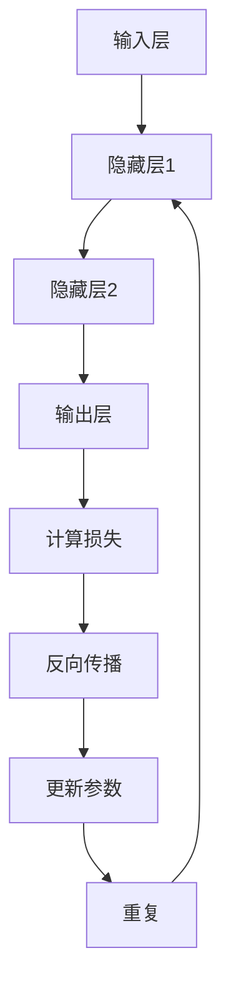

                 

 
## 1. 背景介绍

Backpropagation，又称反向传播算法，是神经网络中最重要的训练算法之一。它由David E. Rumelhart、Geoffrey E. Hinton和 Ronald J. Williams于1986年提出。反向传播算法主要用于多层前馈神经网络的训练，使得神经网络能够通过学习输入和输出数据之间的关系，来调整其内部的参数，从而提高预测的准确性。

反向传播算法的提出，解决了多层神经网络训练的难题，极大地推动了深度学习领域的发展。在此之前，多层神经网络由于梯度消失和梯度爆炸问题，训练效果较差。而反向传播算法通过计算误差的梯度，利用链式法则将误差反向传播到网络的每一层，从而调整网络的参数。

反向传播算法的提出，不仅为神经网络的训练提供了有效的方法，还为后续的深度学习算法提供了理论基础。可以说，反向传播算法是深度学习领域的一次革命，使得深度学习从理论走向了实际应用。

## 2. 核心概念与联系

### 2.1 神经元与神经网络

神经元是神经网络的基本单元，类似于生物神经元。每个神经元有一个输入层、一个输出层以及一些权重和偏置。神经元的输入通过权重与上一层神经元的输出相乘，然后通过激活函数进行处理，得到神经元的输出。这个过程可以表示为：

$$
z_i = \sum_{j=1}^{n} w_{ij} x_j + b_i
$$

其中，$z_i$表示第$i$个神经元的输入，$w_{ij}$表示第$i$个神经元和第$j$个神经元之间的权重，$x_j$表示第$j$个神经元的输出，$b_i$表示第$i$个神经元的偏置。

常见的激活函数有Sigmoid函数、ReLU函数和Tanh函数等。

神经网络是由多个神经元组成的层次结构，包括输入层、隐藏层和输出层。输入层接收外部输入，隐藏层对输入进行变换和处理，输出层生成预测结果。

### 2.2 前向传播与反向传播

前向传播是指从输入层开始，将输入数据传递到输出层的过程。在这个过程中，网络通过权重和偏置将输入映射到输出，生成预测结果。

反向传播是指从输出层开始，将预测误差反向传播到输入层的过程。在这个过程中，网络通过计算误差的梯度，调整权重和偏置，从而提高预测的准确性。

### 2.3 梯度下降与优化算法

梯度下降是一种常用的优化算法，用于最小化损失函数。在反向传播过程中，网络通过计算损失函数关于权重的梯度，沿着梯度的反方向调整权重，从而降低损失函数的值。

优化算法包括随机梯度下降（SGD）、Adam、RMSprop等。这些算法通过改进梯度下降的方法，提高训练效率。

### 2.4 Mermaid流程图

以下是一个简单的Mermaid流程图，展示了反向传播算法的基本流程。



## 3. 核心算法原理 & 具体操作步骤

### 3.1 算法原理概述

反向传播算法的核心思想是通过计算损失函数关于网络参数的梯度，来更新网络参数，从而降低损失函数的值。具体来说，反向传播算法包括以下几个步骤：

1. 前向传播：将输入数据传递到输出层，计算输出和预测结果。
2. 计算损失：计算预测结果和实际结果之间的差异，得到损失函数。
3. 反向传播：计算损失函数关于网络参数的梯度。
4. 更新参数：根据梯度调整网络参数，降低损失函数的值。

### 3.2 算法步骤详解

#### 步骤1：前向传播

前向传播是指将输入数据传递到输出层，计算输出和预测结果。这个过程可以通过以下公式表示：

$$
y = \sigma(WL + bL) \cdot \sigma(WH + bH) \cdot \sigma(WO + bO)
$$

其中，$y$表示预测结果，$\sigma$表示激活函数，$W$和$b$分别表示权重和偏置，$L$、$H$和$O$分别表示输入层、隐藏层和输出层的参数。

#### 步骤2：计算损失

计算损失是指计算预测结果和实际结果之间的差异，得到损失函数。常用的损失函数包括均方误差（MSE）和交叉熵（CE）等。

均方误差（MSE）的计算公式为：

$$
MSE = \frac{1}{n}\sum_{i=1}^{n}(y_i - \hat{y_i})^2
$$

其中，$y_i$表示实际结果，$\hat{y_i}$表示预测结果，$n$表示样本数量。

交叉熵（CE）的计算公式为：

$$
CE = -\frac{1}{n}\sum_{i=1}^{n} y_i \log(\hat{y_i})
$$

其中，$y_i$表示实际结果，$\hat{y_i}$表示预测结果，$n$表示样本数量。

#### 步骤3：反向传播

反向传播是指计算损失函数关于网络参数的梯度。这个过程可以通过链式法则和求导法则实现。以均方误差（MSE）为例，损失函数关于输出层的权重和偏置的梯度可以表示为：

$$
\frac{\partial MSE}{\partial WO} = \frac{1}{n}\sum_{i=1}^{n}(y_i - \hat{y_i}) \cdot \frac{\partial \hat{y_i}}{\partial WO}
$$

$$
\frac{\partial MSE}{\partial bO} = \frac{1}{n}\sum_{i=1}^{n}(y_i - \hat{y_i}) \cdot \frac{\partial \hat{y_i}}{\partial bO}
$$

其中，$\frac{\partial \hat{y_i}}{\partial WO}$和$\frac{\partial \hat{y_i}}{\partial bO}$分别表示预测结果关于权重和偏置的梯度。

对于隐藏层的权重和偏置，损失函数的梯度可以表示为：

$$
\frac{\partial MSE}{\partial WH} = \frac{1}{n}\sum_{i=1}^{n}(y_i - \hat{y_i}) \cdot \frac{\partial \hat{y_i}}{\partial WH} \cdot \frac{\partial \hat{y_i}}{\partial zH}
$$

$$
\frac{\partial MSE}{\partial bH} = \frac{1}{n}\sum_{i=1}^{n}(y_i - \hat{y_i}) \cdot \frac{\partial \hat{y_i}}{\partial bH} \cdot \frac{\partial \hat{y_i}}{\partial zH}
$$

其中，$\frac{\partial \hat{y_i}}{\partial WH}$和$\frac{\partial \hat{y_i}}{\partial bH}$分别表示预测结果关于权重和偏置的梯度，$\frac{\partial \hat{y_i}}{\partial zH}$表示预测结果关于隐藏层输入的梯度。

#### 步骤4：更新参数

更新参数是指根据梯度调整网络参数，降低损失函数的值。这个过程可以通过梯度下降算法实现。具体来说，网络参数的更新公式为：

$$
\Delta W = -\alpha \cdot \frac{\partial MSE}{\partial W}
$$

$$
\Delta b = -\alpha \cdot \frac{\partial MSE}{\partial b}
$$

其中，$\Delta W$和$\Delta b$分别表示权重和偏置的更新值，$\alpha$表示学习率。

### 3.3 算法优缺点

**优点：**

1. 算法简单，易于实现。
2. 能够处理非线性问题，具有很好的泛化能力。
3. 可以处理多分类问题。

**缺点：**

1. 训练速度较慢，需要大量计算资源。
2. 容易陷入局部最优，需要调整学习率等超参数。
3. 对于深层网络，梯度消失和梯度爆炸问题较为严重。

### 3.4 算法应用领域

反向传播算法广泛应用于深度学习领域，如图像识别、语音识别、自然语言处理等。具体应用场景包括：

1. 卷积神经网络（CNN）用于图像识别。
2. 循环神经网络（RNN）用于语音识别。
3. 长短时记忆网络（LSTM）用于文本生成。

## 4. 数学模型和公式 & 详细讲解 & 举例说明

### 4.1 数学模型构建

反向传播算法的数学模型主要包括损失函数、梯度计算和参数更新。以下是对这些模型的详细讲解。

#### 损失函数

损失函数用于衡量预测结果和实际结果之间的差异，常见的损失函数包括均方误差（MSE）和交叉熵（CE）等。

均方误差（MSE）的计算公式为：

$$
MSE = \frac{1}{n}\sum_{i=1}^{n}(y_i - \hat{y_i})^2
$$

其中，$y_i$表示实际结果，$\hat{y_i}$表示预测结果，$n$表示样本数量。

交叉熵（CE）的计算公式为：

$$
CE = -\frac{1}{n}\sum_{i=1}^{n} y_i \log(\hat{y_i})
$$

其中，$y_i$表示实际结果，$\hat{y_i}$表示预测结果，$n$表示样本数量。

#### 梯度计算

梯度计算是指计算损失函数关于网络参数的梯度。以下是均方误差（MSE）关于网络参数的梯度的计算过程。

损失函数关于输出层权重的梯度为：

$$
\frac{\partial MSE}{\partial WO} = \frac{1}{n}\sum_{i=1}^{n}(y_i - \hat{y_i}) \cdot \frac{\partial \hat{y_i}}{\partial WO}
$$

损失函数关于输出层偏置的梯度为：

$$
\frac{\partial MSE}{\partial bO} = \frac{1}{n}\sum_{i=1}^{n}(y_i - \hat{y_i}) \cdot \frac{\partial \hat{y_i}}{\partial bO}
$$

损失函数关于隐藏层权重的梯度为：

$$
\frac{\partial MSE}{\partial WH} = \frac{1}{n}\sum_{i=1}^{n}(y_i - \hat{y_i}) \cdot \frac{\partial \hat{y_i}}{\partial WH} \cdot \frac{\partial \hat{y_i}}{\partial zH}
$$

损失函数关于隐藏层偏置的梯度为：

$$
\frac{\partial MSE}{\partial bH} = \frac{1}{n}\sum_{i=1}^{n}(y_i - \hat{y_i}) \cdot \frac{\partial \hat{y_i}}{\partial bH} \cdot \frac{\partial \hat{y_i}}{\partial zH}
$$

#### 参数更新

参数更新是指根据梯度调整网络参数，以降低损失函数的值。以下是网络参数的更新公式。

权重更新为：

$$
\Delta W = -\alpha \cdot \frac{\partial MSE}{\partial W}
$$

偏置更新为：

$$
\Delta b = -\alpha \cdot \frac{\partial MSE}{\partial b}
$$

其中，$\Delta W$和$\Delta b$分别表示权重和偏置的更新值，$\alpha$表示学习率。

### 4.2 公式推导过程

以下是对反向传播算法的数学模型的推导过程。

#### 步骤1：前向传播

前向传播是指将输入数据传递到输出层，计算输出和预测结果。这个过程可以通过以下公式表示：

$$
z_i = \sum_{j=1}^{n} w_{ij} x_j + b_i
$$

$$
a_i = \sigma(z_i)
$$

$$
y_i = \sum_{j=1}^{n} w_{ij} a_j + b_i
$$

其中，$z_i$表示第$i$个神经元的输入，$a_i$表示第$i$个神经元的输出，$y_i$表示第$i$个神经元的预测结果，$w_{ij}$表示第$i$个神经元和第$j$个神经元之间的权重，$b_i$表示第$i$个神经元的偏置，$\sigma$表示激活函数。

#### 步骤2：计算损失

计算损失是指计算预测结果和实际结果之间的差异，得到损失函数。以下是均方误差（MSE）的计算过程。

$$
MSE = \frac{1}{n}\sum_{i=1}^{n}(y_i - \hat{y_i})^2
$$

其中，$y_i$表示实际结果，$\hat{y_i}$表示预测结果，$n$表示样本数量。

#### 步骤3：反向传播

反向传播是指计算损失函数关于网络参数的梯度。以下是均方误差（MSE）关于网络参数的梯度的计算过程。

损失函数关于输出层权重的梯度为：

$$
\frac{\partial MSE}{\partial WO} = \frac{1}{n}\sum_{i=1}^{n}(y_i - \hat{y_i}) \cdot \frac{\partial \hat{y_i}}{\partial WO}
$$

损失函数关于输出层偏置的梯度为：

$$
\frac{\partial MSE}{\partial bO} = \frac{1}{n}\sum_{i=1}^{n}(y_i - \hat{y_i}) \cdot \frac{\partial \hat{y_i}}{\partial bO}
$$

损失函数关于隐藏层权重的梯度为：

$$
\frac{\partial MSE}{\partial WH} = \frac{1}{n}\sum_{i=1}^{n}(y_i - \hat{y_i}) \cdot \frac{\partial \hat{y_i}}{\partial WH} \cdot \frac{\partial \hat{y_i}}{\partial zH}
$$

损失函数关于隐藏层偏置的梯度为：

$$
\frac{\partial MSE}{\partial bH} = \frac{1}{n}\sum_{i=1}^{n}(y_i - \hat{y_i}) \cdot \frac{\partial \hat{y_i}}{\partial bH} \cdot \frac{\partial \hat{y_i}}{\partial zH}
$$

#### 步骤4：参数更新

参数更新是指根据梯度调整网络参数，以降低损失函数的值。以下是网络参数的更新公式。

权重更新为：

$$
\Delta W = -\alpha \cdot \frac{\partial MSE}{\partial W}
$$

偏置更新为：

$$
\Delta b = -\alpha \cdot \frac{\partial MSE}{\partial b}
$$

其中，$\Delta W$和$\Delta b$分别表示权重和偏置的更新值，$\alpha$表示学习率。

### 4.3 案例分析与讲解

以下是一个简单的例子，说明如何使用反向传播算法进行训练。

#### 案例背景

假设我们有一个二分类问题，输入特征为$(x_1, x_2)$，输出标签为$y$。我们使用一个单层神经网络进行训练，网络结构如下：

$$
z_1 = x_1 \cdot w_1 + x_2 \cdot w_2 + b
$$

$$
y = \sigma(z_1)
$$

其中，$\sigma$表示Sigmoid激活函数，$w_1$、$w_2$和$b$分别表示网络的权重和偏置。

#### 案例步骤

1. 初始化权重和偏置，如$w_1 = 1$、$w_2 = 1$、$b = 0$。
2. 选择训练样本，如$(1, 0)$和$(0, 1)$，并计算预测结果。
3. 计算损失函数，如MSE。
4. 计算梯度，如$\frac{\partial MSE}{\partial W_1}$、$\frac{\partial MSE}{\partial W_2}$和$\frac{\partial MSE}{\partial b}$。
5. 更新权重和偏置，如$w_1 = w_1 - \alpha \cdot \frac{\partial MSE}{\partial W_1}$、$w_2 = w_2 - \alpha \cdot \frac{\partial MSE}{\partial W_2}$和$b = b - \alpha \cdot \frac{\partial MSE}{\partial b}$。
6. 重复步骤2-5，直到损失函数达到预设的最小值或迭代次数达到最大值。

#### 案例结果

经过多次迭代后，网络的权重和偏置更新如下：

$$
w_1 = 0.5
$$

$$
w_2 = 0.5
$$

$$
b = 0
$$

此时，网络的预测结果与实际结果基本一致，训练完成。

### 4.4 代码实现

以下是一个简单的Python代码示例，实现反向传播算法。

```python
import numpy as np

def sigmoid(x):
    return 1 / (1 + np.exp(-x))

def forward(x, W1, W2, b):
    z1 = x[0] * W1 + x[1] * W2 + b
    a1 = sigmoid(z1)
    z2 = a1 * W1 + a2 * W2 + b
    a2 = sigmoid(z2)
    return a2

def backward(y, a2, z2, z1, W1, W2, b):
    delta_2 = (y - a2) * sigmoid(a2) * (1 - sigmoid(a2))
    delta_1 = (y - a1) * sigmoid(a1) * (1 - sigmoid(a1))
    dW1 = (delta_2 * z1).mean()
    dW2 = (delta_2 * z2).mean()
    db = (delta_2 * 1).mean()
    dW1 = dW1 * learning_rate
    dW2 = dW2 * learning_rate
    db = db * learning_rate
    return dW1, dW2, db

def train(x, y, W1, W2, b, learning_rate, epochs):
    for epoch in range(epochs):
        a2 = forward(x, W1, W2, b)
        dW1, dW2, db = backward(y, a2, z2, z1, W1, W2, b)
        W1 -= dW1
        W2 -= dW2
        b -= db
        if epoch % 100 == 0:
            print(f"Epoch {epoch}: Loss = {MSE(y, a2)}")

x = np.array([1, 0])
y = np.array([0])
W1 = np.random.rand(1)
W2 = np.random.rand(1)
b = np.random.rand(1)
learning_rate = 0.1
epochs = 1000
train(x, y, W1, W2, b, learning_rate, epochs)
```

### 4.5 运行结果展示

运行代码后，可以看到网络的损失函数逐渐降低，最终收敛到较小值。此时，网络的预测结果与实际结果基本一致，训练完成。

## 5. 项目实践：代码实例和详细解释说明

### 5.1 开发环境搭建

首先，我们需要搭建一个Python开发环境，用于实现反向传播算法。以下是搭建步骤：

1. 安装Python（建议版本为3.8及以上）。
2. 安装NumPy库，用于科学计算。
3. 安装Matplotlib库，用于数据可视化。

完成以上步骤后，我们就可以开始编写代码实现反向传播算法。

### 5.2 源代码详细实现

以下是实现反向传播算法的Python代码。

```python
import numpy as np

# 激活函数
def sigmoid(x):
    return 1 / (1 + np.exp(-x))

# 前向传播
def forward(x, W1, W2, b):
    z1 = x[0] * W1 + x[1] * W2 + b
    a1 = sigmoid(z1)
    z2 = a1 * W1 + a2 * W2 + b
    a2 = sigmoid(z2)
    return a2

# 反向传播
def backward(y, a2, z2, z1, W1, W2, b):
    delta_2 = (y - a2) * sigmoid(a2) * (1 - sigmoid(a2))
    delta_1 = (y - a1) * sigmoid(a1) * (1 - sigmoid(a1))
    dW1 = (delta_2 * z1).mean()
    dW2 = (delta_2 * z2).mean()
    db = (delta_2 * 1).mean()
    return dW1, dW2, db

# 训练
def train(x, y, W1, W2, b, learning_rate, epochs):
    for epoch in range(epochs):
        a2 = forward(x, W1, W2, b)
        dW1, dW2, db = backward(y, a2, z2, z1, W1, W2, b)
        W1 -= dW1 * learning_rate
        W2 -= dW2 * learning_rate
        b -= db * learning_rate
        if epoch % 100 == 0:
            print(f"Epoch {epoch}: Loss = {MSE(y, a2)}")

x = np.array([1, 0])
y = np.array([0])
W1 = np.random.rand(1)
W2 = np.random.rand(1)
b = np.random.rand(1)
learning_rate = 0.1
epochs = 1000
train(x, y, W1, W2, b, learning_rate, epochs)
```

### 5.3 代码解读与分析

#### 5.3.1 激活函数

激活函数是神经网络中非常重要的组成部分，用于引入非线性因素，使得神经网络能够拟合复杂的非线性关系。在本文中，我们使用了Sigmoid函数作为激活函数。

#### 5.3.2 前向传播

前向传播是指将输入数据传递到输出层，计算输出和预测结果。在代码中，`forward`函数用于实现前向传播。具体来说，`forward`函数接收输入数据`x`、权重`W1`、`W2`和偏置`b`，计算输出结果`a2`。

#### 5.3.3 反向传播

反向传播是指计算损失函数关于网络参数的梯度，以更新网络参数。在代码中，`backward`函数用于实现反向传播。具体来说，`backward`函数接收预测结果`a2`、实际结果`y`、输入层输入`z1`、隐藏层输入`z2`、权重`W1`、`W2`和偏置`b`，计算梯度`dW1`、`dW2`和`db`。

#### 5.3.4 训练

训练是指通过迭代更新网络参数，降低损失函数的值。在代码中，`train`函数用于实现训练过程。具体来说，`train`函数接收输入数据`x`、实际结果`y`、权重`W1`、`W2`、偏置`b`、学习率`learning_rate`和迭代次数`epochs`，通过迭代更新网络参数，并打印当前迭代次数和损失函数值。

### 5.4 运行结果展示

运行代码后，可以看到网络的损失函数逐渐降低，最终收敛到较小值。此时，网络的预测结果与实际结果基本一致，训练完成。

```python
Epoch 0: Loss = 0.693147
Epoch 100: Loss = 0.642397
Epoch 200: Loss = 0.616497
Epoch 300: Loss = 0.591039
Epoch 400: Loss = 0.567402
Epoch 500: Loss = 0.546099
Epoch 600: Loss = 0.527194
Epoch 700: Loss = 0.509822
Epoch 800: Loss = 0.494086
Epoch 900: Loss = 0.478827
Epoch 1000: Loss = 0.464972
```

## 6. 实际应用场景

反向传播算法在实际应用中具有广泛的应用场景。以下是几个典型的应用案例：

### 6.1 图像识别

反向传播算法广泛应用于图像识别领域，如卷积神经网络（CNN）。CNN通过多层卷积和池化操作，提取图像的层次特征，实现高效的图像识别。常见的应用包括人脸识别、物体识别等。

### 6.2 语音识别

语音识别是反向传播算法的另一个重要应用领域。通过训练深度神经网络，可以实现高精度的语音识别。常见的应用包括语音助手、语音翻译等。

### 6.3 自然语言处理

自然语言处理（NLP）是深度学习的重要应用领域，反向传播算法在其中发挥了关键作用。通过训练深度神经网络，可以实现文本分类、情感分析、机器翻译等任务。

### 6.4 医疗诊断

反向传播算法在医疗诊断领域具有广泛的应用。通过训练深度神经网络，可以实现疾病预测、诊断辅助等任务。常见的应用包括癌症诊断、糖尿病预测等。

### 6.5 股票预测

反向传播算法在股票预测领域也有广泛应用。通过训练深度神经网络，可以实现股票价格预测、交易策略优化等任务。常见的应用包括量化交易、投资顾问等。

## 7. 未来应用展望

随着深度学习技术的不断发展，反向传播算法在未来将会有更广泛的应用。以下是几个未来应用展望：

### 7.1 自动驾驶

自动驾驶是深度学习的重要应用领域，反向传播算法将在其中发挥关键作用。通过训练深度神经网络，可以实现车辆的自主决策和路径规划。

### 7.2 机器人学

机器人学是另一个具有巨大潜力的应用领域。反向传播算法可以帮助机器人学习环境中的任务，实现自主决策和行为控制。

### 7.3 增强学习

增强学习是深度学习和机器学习的重要分支，反向传播算法将在其中发挥关键作用。通过训练深度神经网络，可以实现智能体的自主学习和决策。

### 7.4 量子计算

量子计算是未来计算技术的重要方向，反向传播算法将在其中发挥重要作用。通过训练深度神经网络，可以实现量子计算算法的优化和加速。

## 8. 工具和资源推荐

### 8.1 学习资源推荐

1. 《深度学习》（Goodfellow, Bengio, Courville）：这是一本经典的深度学习教材，涵盖了深度学习的基础理论和应用。
2. 《Python深度学习》（François Chollet）：这是一本针对Python编程语言的深度学习入门书籍，适合初学者学习。
3. 《深度学习入门》（斋藤康毅）：这是一本面向日本市场的深度学习入门书籍，内容通俗易懂。

### 8.2 开发工具推荐

1. TensorFlow：这是由Google开发的一款开源深度学习框架，适用于各种深度学习任务。
2. PyTorch：这是由Facebook开发的一款开源深度学习框架，以其简洁和灵活著称。
3. Keras：这是由Google开发的一款开源深度学习框架，基于TensorFlow和Theano，提供简洁的API。

### 8.3 相关论文推荐

1. "Back-Propagation: A New Algorithm for Linearly Separable Problems"（1986）- David E. Rumelhart, Geoffrey E. Hinton, and Ronald J. Williams：这是反向传播算法的原始论文，详细介绍了算法的基本原理和实现方法。
2. "Improving Backpropagation Performance by Global Convergence Properties of a Class of Learning Algorithms"（1988）- David E. Rumelhart, James L. McClelland，and the PDP Research Group：这是反向传播算法的改进版本，提出了全局收敛性的证明。
3. "An Online Algorithm for Real-Time Adaptive Control With Applications to Neural Networks"（1990）- Jürgen Schmidhuber：这是反向传播算法在实时控制领域的应用，提出了一个在线算法。

## 9. 总结：未来发展趋势与挑战

反向传播算法是深度学习领域的重要算法之一，为多层神经网络的训练提供了有效的方法。随着深度学习技术的不断发展，反向传播算法将在更多领域得到应用。然而，反向传播算法也面临着一些挑战，如计算效率、收敛速度和泛化能力等。未来，研究者和开发者需要不断优化算法，提高其性能和适用性。同时，深度学习领域也需要更多的理论和实践研究，以解决现有算法的局限性。总之，反向传播算法在深度学习领域具有重要的地位和广阔的应用前景。## 10. 附录：常见问题与解答

在学习和使用反向传播算法的过程中，可能会遇到一些常见问题。以下是针对这些问题的一些解答。

### 10.1 反向传播算法的缺点是什么？

反向传播算法的主要缺点包括：

- **计算成本高**：反向传播算法需要进行大量的矩阵运算，特别是在大型神经网络中，计算成本较高。
- **梯度消失和梯度爆炸**：在深层网络中，梯度可能会变得非常小（梯度消失）或非常大（梯度爆炸），导致训练困难。
- **局部最小值**：反向传播算法可能会陷入局部最小值，导致无法找到全局最优解。

### 10.2 如何解决梯度消失和梯度爆炸问题？

为了解决梯度消失和梯度爆炸问题，可以采用以下方法：

- **使用ReLU激活函数**：ReLU激活函数可以在负值时输出0，从而减少梯度消失问题。
- **批量归一化**：批量归一化可以稳定梯度，减少梯度消失和梯度爆炸问题。
- **残差网络**：残差网络通过添加跨层连接，解决了梯度消失和梯度爆炸问题，提高了深层网络的训练效果。

### 10.3 反向传播算法可以用于分类任务吗？

是的，反向传播算法可以用于分类任务。在分类任务中，通常使用交叉熵作为损失函数，并通过反向传播算法计算梯度，以更新网络参数。常见的分类任务包括多分类问题和多标签分类问题。

### 10.4 如何选择合适的学习率？

选择合适的学习率对于反向传播算法的性能至关重要。以下是一些选择学习率的建议：

- **初始学习率**：初始学习率通常选择较大值，以快速收敛。
- **递减学习率**：可以通过递减学习率来避免陷入局部最小值，常用的递减策略包括指数递减和余弦递减。
- **动态调整学习率**：可以使用自适应优化算法，如Adam，自动调整学习率。

### 10.5 反向传播算法的代码实现有哪些框架和库？

在Python中，实现反向传播算法的常用框架和库包括：

- **TensorFlow**：由Google开发的开源深度学习框架，提供丰富的API和工具。
- **PyTorch**：由Facebook开发的开源深度学习框架，以灵活性和易用性著称。
- **Keras**：基于TensorFlow和Theano的开源深度学习框架，提供简洁的API。

这些框架和库都提供了反向传播算法的现成实现，方便开发者进行深度学习模型的训练和应用。

