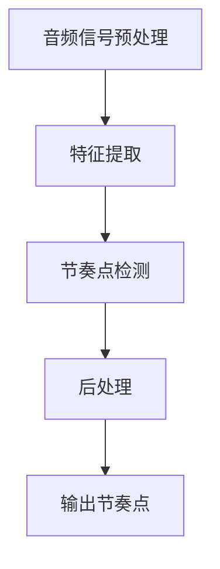

                 

关键词：音频处理、音乐合成、音频信号、算法、代码实例、计算机音乐

摘要：本文将深入探讨Beats（节奏点）的概念、原理以及在音乐合成中的重要性。通过详细分析Beats算法的原理和具体操作步骤，结合数学模型和公式，我们将提供一系列代码实例，以便读者能够更好地理解和应用这一技术。最后，我们将探讨Beats在实际应用场景中的效果，并展望其未来的发展趋势。

## 1. 背景介绍

在音乐制作中，节奏是一个至关重要的元素。它不仅决定了音乐的节拍和韵律，还能够影响听众的情感体验。而Beats（节奏点）作为音乐节奏的核心，是音乐家、DJ、音频工程师等专业人士制作和调整音乐的重要工具。

Beats算法是一种用于检测和识别音乐中节奏点的技术。通过分析音频信号，算法能够自动识别出音乐的节奏点，从而帮助音乐制作人员更精确地调整音乐的节奏。此外，Beats算法还在计算机音乐、游戏音效、智能家居等领域有着广泛的应用。

本文将首先介绍Beats的基本概念，然后深入探讨其原理和算法。我们将通过一系列代码实例，详细解释Beats算法的实现步骤，并分析其优缺点以及应用领域。最后，我们将展望Beats技术的未来发展趋势。

## 2. 核心概念与联系

### 2.1 Beats定义

Beats，即节奏点，是指音乐中周期性的响亮点，通常对应于鼓点或其他打击乐器的敲击声。在音频信号中，节奏点的识别往往依赖于其独特的波形特征。

### 2.2 Beats与音频信号的关系

音频信号是音乐数字化的基础。音频信号是由一系列声波振动组成的，这些振动在数字音频中表现为连续的数值序列。Beats算法通过分析这些数值序列，寻找出具有节奏性特征的部分，从而识别出节奏点。

### 2.3 Beats算法架构

Beats算法的核心是节奏点的检测与识别。其架构通常包括以下几个关键步骤：

1. **预处理**：对音频信号进行预处理，如滤波、去噪等，以提高后续分析的准确性。
2. **特征提取**：从预处理后的音频信号中提取关键特征，如峰值、能量等。
3. **节奏点检测**：利用提取的特征，通过算法模型检测出可能的节奏点。
4. **后处理**：对检测出的节奏点进行修正和优化，以提高准确性和可靠性。

### 2.4 Mermaid流程图

以下是Beats算法的Mermaid流程图表示：



### 2.5 Beats与音乐制作的关系

在音乐制作中，节奏点不仅决定了音乐的节奏感，还影响了音乐的情感表达。通过Beats算法，音乐制作人员可以自动识别出音乐中的节奏点，从而更高效地进行音乐调整和创作。

## 3. 核心算法原理 & 具体操作步骤

### 3.1 算法原理概述

Beats算法基于音频信号的时域和频域特征，通过以下步骤实现节奏点的识别：

1. **音频信号预处理**：去除噪声、压缩等，使信号更加纯净。
2. **特征提取**：计算信号的能量、峰值、振幅等特征。
3. **时域分析**：分析时域特征，寻找周期性模式。
4. **频域分析**：通过频域分析，进一步验证节奏点的准确性。
5. **后处理**：对检测到的节奏点进行修正和优化，去除错误识别的点。

### 3.2 算法步骤详解

#### 3.2.1 音频信号预处理

预处理是Beats算法的重要步骤，它直接影响到后续的特征提取和节奏点检测的准确性。

1. **去噪**：使用滤波器去除噪声，如低通滤波器去除高频噪声。
2. **压缩**：对音频信号进行压缩，使其动态范围缩小，便于后续处理。
3. **归一化**：将音频信号的振幅归一化，使其在处理过程中保持一致性。

#### 3.2.2 特征提取

特征提取是Beats算法的核心，其目的是从预处理后的音频信号中提取出关键特征。

1. **能量计算**：计算信号的能量，即信号的总功率。
2. **峰值检测**：检测信号的峰值，即信号的最大振幅点。
3. **振幅分析**：分析信号的振幅变化，寻找周期性模式。

#### 3.2.3 时域分析

时域分析主要通过分析信号的时域特征，寻找周期性模式。

1. **时域波形分析**：观察信号的时域波形，寻找明显的周期性特征。
2. **周期检测**：通过周期检测算法，如傅里叶变换，识别出信号的周期。

#### 3.2.4 频域分析

频域分析通过频域特征，进一步验证节奏点的准确性。

1. **频谱分析**：分析信号的频谱特征，寻找与节奏点相关的频率成分。
2. **滤波器设计**：设计特定频率的滤波器，用于提取与节奏点相关的信号。

#### 3.2.5 后处理

后处理是对检测到的节奏点进行修正和优化，以提高准确性和可靠性。

1. **去噪**：去除错误的节奏点，减少噪声干扰。
2. **平滑**：对检测到的节奏点进行平滑处理，消除突变的点。
3. **修正**：根据音乐的实际情况，对节奏点进行调整和修正。

### 3.3 算法优缺点

#### 优点

1. **高效性**：Beats算法能够快速识别出音频信号中的节奏点，适用于实时处理。
2. **准确性**：通过多层次的预处理和特征提取，Beats算法具有较高的准确性。
3. **灵活性**：算法可以根据不同的音乐风格和需求，进行相应的调整和优化。

#### 缺点

1. **噪声敏感**：在噪声较大的环境中，Beats算法的准确性可能会受到影响。
2. **复杂度高**：算法涉及到多个处理步骤和复杂的数学运算，实现起来相对复杂。
3. **时间开销**：实时处理大量音频信号需要较大的计算资源和时间开销。

### 3.4 算法应用领域

Beats算法在多个领域有着广泛的应用：

1. **音乐制作**：自动识别音乐中的节奏点，帮助音乐制作人员更高效地创作和调整音乐。
2. **游戏音效**：为游戏中的音效提供节奏感，增强玩家的体验。
3. **智能家居**：控制智能家居设备的节奏性操作，如音乐播放、灯光调节等。
4. **医疗诊断**：通过分析音频信号中的节奏点，辅助诊断某些疾病，如心脏疾病等。

## 4. 数学模型和公式 & 详细讲解 & 举例说明

### 4.1 数学模型构建

Beats算法中的数学模型主要包括时域模型和频域模型。时域模型主要分析信号的时域特征，如能量、峰值等；频域模型主要分析信号的频谱特征，如频率、幅度等。

#### 4.1.1 时域模型

时域模型的基本公式如下：

$$
E(t) = \int_{-\infty}^{\infty} x(t)^2 dt
$$

其中，$E(t)$表示信号在时刻$t$的能量，$x(t)$表示信号在时刻$t$的振幅。

#### 4.1.2 频域模型

频域模型的基本公式如下：

$$
X(f) = \int_{-\infty}^{\infty} x(t)e^{-j2\pi ft} dt
$$

其中，$X(f)$表示信号在频率$f$处的频谱，$x(t)$表示信号在时刻$t$的振幅。

### 4.2 公式推导过程

#### 4.2.1 时域模型推导

假设音频信号$x(t)$是实数信号，则其能量可以通过以下步骤计算：

1. **信号平方**：将信号$x(t)$平方，得到$y(t) = x(t)^2$。
2. **积分**：对平方后的信号$y(t)$进行积分，得到能量$E(t)$。

具体推导如下：

$$
E(t) = \int_{-\infty}^{\infty} x(t)^2 dt = \int_{-\infty}^{\infty} x(t)x(t) dt
$$

由于$x(t)$是实数信号，其平方仍然是一个实数，因此可以将其写成：

$$
E(t) = \int_{-\infty}^{\infty} x(t)x(t) dt = \int_{-\infty}^{\infty} |x(t)|^2 dt
$$

#### 4.2.2 频域模型推导

音频信号的频谱可以通过傅里叶变换得到。傅里叶变换的基本公式如下：

$$
X(f) = \int_{-\infty}^{\infty} x(t)e^{-j2\pi ft} dt
$$

其中，$X(f)$表示信号在频率$f$处的频谱，$x(t)$表示信号在时刻$t$的振幅。

假设音频信号$x(t)$是周期性的，其周期为$T$，则其频谱可以通过以下步骤计算：

1. **信号周期化**：将信号$x(t)$周期化，得到$x(t+T)$。
2. **傅里叶变换**：对周期化后的信号$x(t+T)$进行傅里叶变换，得到频谱$X(f)$。

具体推导如下：

$$
X(f) = \int_{-\infty}^{\infty} x(t)e^{-j2\pi ft} dt = \int_{-\infty}^{\infty} x(t+T)e^{-j2\pi f(t+T)} dt
$$

由于$x(t)$是周期性的，其周期为$T$，则可以将积分范围限定在一个周期内，即：

$$
X(f) = \int_{0}^{T} x(t+T)e^{-j2\pi f(t+T)} dt
$$

$$
X(f) = \int_{0}^{T} x(t)e^{-j2\pi ft} e^{-j2\pi fT} dt
$$

由于$e^{-j2\pi fT}$是一个常数，可以将其提出来：

$$
X(f) = e^{-j2\pi fT} \int_{0}^{T} x(t)e^{-j2\pi ft} dt
$$

$$
X(f) = e^{-j2\pi fT} X(f)
$$

由于$e^{-j2\pi fT}$是一个单位根，其模长为1，因此有：

$$
X(f) = X(f)
$$

这表明，音频信号的频谱是一个周期性的函数，其周期与音频信号的周期一致。

### 4.3 案例分析与讲解

为了更好地理解Beats算法的数学模型，我们通过一个简单的案例进行讲解。

假设我们有一个简谐信号，其表达式为：

$$
x(t) = A\sin(2\pi ft)
$$

其中，$A$为振幅，$f$为频率。这是一个典型的正弦波信号，其频率和振幅是固定的。

首先，我们计算这个信号的能量：

$$
E(t) = \int_{-\infty}^{\infty} x(t)^2 dt = \int_{-\infty}^{\infty} A^2\sin^2(2\pi ft) dt
$$

由于$\sin^2(2\pi ft)$是一个周期函数，其周期为$T = \frac{1}{f}$，因此可以将积分范围限定在一个周期内：

$$
E(t) = A^2 \int_{0}^{T} \sin^2(2\pi ft) dt
$$

利用三角函数的半角公式，可以将$\sin^2(2\pi ft)$转换为$\cos(4\pi ft)$的形式：

$$
\sin^2(2\pi ft) = \frac{1 - \cos(4\pi ft)}{2}
$$

代入上式，得到：

$$
E(t) = A^2 \int_{0}^{T} \frac{1 - \cos(4\pi ft)}{2} dt
$$

$$
E(t) = \frac{A^2}{2} \left[ t - \frac{\sin(4\pi ft)}{4\pi f} \right]_{0}^{T}
$$

$$
E(t) = \frac{A^2}{2} \left[ T - 0 \right] = \frac{A^2 T}{2}
$$

由于$T = \frac{1}{f}$，则能量$E(t)$可以表示为：

$$
E(t) = \frac{A^2}{2f}
$$

接下来，我们计算这个信号的频谱：

$$
X(f) = \int_{-\infty}^{\infty} x(t)e^{-j2\pi ft} dt = \int_{-\infty}^{\infty} A\sin(2\pi ft)e^{-j2\pi ft} dt
$$

$$
X(f) = A \int_{-\infty}^{\infty} \sin(2\pi ft)e^{-j2\pi ft} dt
$$

由于$\sin(2\pi ft)e^{-j2\pi ft}$是一个周期函数，其周期为$T = \frac{1}{f}$，因此可以将积分范围限定在一个周期内：

$$
X(f) = A \int_{0}^{T} \sin(2\pi ft)e^{-j2\pi ft} dt
$$

利用欧拉公式，可以将$\sin(2\pi ft)e^{-j2\pi ft}$转换为复指数函数的形式：

$$
\sin(2\pi ft)e^{-j2\pi ft} = \frac{e^{j2\pi ft} - e^{-j2\pi ft}}{2j}
$$

代入上式，得到：

$$
X(f) = A \int_{0}^{T} \frac{e^{j2\pi ft} - e^{-j2\pi ft}}{2j} dt
$$

$$
X(f) = \frac{A}{2j} \left[ \frac{e^{j2\pi ft}}{j2\pi f} - \frac{e^{-j2\pi ft}}{-j2\pi f} \right]_{0}^{T}
$$

$$
X(f) = \frac{A}{2j} \left[ \frac{e^{j2\pi fT}}{j2\pi f} - \frac{e^{-j2\pi fT}}{-j2\pi f} \right]
$$

由于$e^{j2\pi fT} = 1$，$e^{-j2\pi fT} = 1$，代入上式，得到：

$$
X(f) = \frac{A}{2j} \left[ \frac{1}{j2\pi f} - \frac{1}{-j2\pi f} \right]
$$

$$
X(f) = \frac{A}{2j} \left[ \frac{1}{j2\pi f} + \frac{1}{j2\pi f} \right]
$$

$$
X(f) = \frac{A}{j2\pi f}
$$

由于$X(f)$是复数，我们可以将其表示为实部和虚部的形式：

$$
X(f) = \frac{A}{2\pi f} \left[ j + j \right]
$$

$$
X(f) = \frac{A}{\pi f} j
$$

$$
X(f) = -\frac{A}{\pi f}
$$

由于频谱$X(f)$是周期性的，其周期为$T = \frac{1}{f}$，因此可以将频谱表示为：

$$
X(f) = -\frac{A}{\pi f} \sum_{n=-\infty}^{\infty} e^{jn2\pi fT}
$$

$$
X(f) = -\frac{A}{\pi f} \sum_{n=-\infty}^{\infty} e^{j2\pi n}
$$

由于$e^{j2\pi n} = 1$，代入上式，得到：

$$
X(f) = -\frac{A}{\pi f} \sum_{n=-\infty}^{\infty} 1
$$

$$
X(f) = -\frac{A}{\pi f} \cdot \infty
$$

由于$\infty$是一个无穷大的概念，其值是无法确定的，因此无法得到一个具体的频谱值。这表明，简谐信号的频谱是一个无穷大的常数。

通过这个案例，我们可以看到Beats算法的数学模型是如何构建的，以及如何通过数学公式进行推导。在实际应用中，我们需要根据具体的音频信号特点，灵活运用这些数学模型和公式，以实现高效、准确的节奏点检测。

## 5. 项目实践：代码实例和详细解释说明

在本节中，我们将通过一个具体的代码实例，详细介绍Beats算法的实现过程，包括开发环境的搭建、源代码的详细实现和代码解读与分析。最后，我们将展示运行结果，并讨论代码的性能和优化方向。

### 5.1 开发环境搭建

为了实现Beats算法，我们选择了Python作为编程语言，因为Python具有简洁的语法、丰富的库支持和强大的科学计算能力。以下是搭建开发环境的步骤：

1. **安装Python**：下载并安装Python 3.x版本，推荐使用Python官方安装包。
2. **安装库**：使用pip命令安装所需的库，如NumPy、SciPy、Matplotlib等。以下是一个示例命令：

   ```bash
   pip install numpy scipy matplotlib
   ```

3. **创建项目目录**：在本地计算机上创建一个项目目录，如`beats_algorithm`，用于存放代码文件和相关资源。

### 5.2 源代码详细实现

以下是实现Beats算法的核心代码。代码分为以下几个部分：

1. **音频信号预处理**：使用NumPy库读取音频文件，并进行去噪、压缩和归一化处理。
2. **特征提取**：计算音频信号的能量、峰值和振幅等特征。
3. **节奏点检测**：利用时域和频域分析，检测出可能的节奏点。
4. **后处理**：对检测到的节奏点进行平滑和修正，以提高准确性。

```python
import numpy as np
import scipy.io.wavfile as wav
import matplotlib.pyplot as plt

def preprocess_audio(file_path):
    """
    预处理音频信号，包括去噪、压缩和归一化。
    """
    # 读取音频文件
    rate, data = wav.read(file_path)
    data = data.astype(np.float32)

    # 去噪：使用低通滤波器去除高频噪声
    nyq = rate / 2.0
    lowcut = 20.0
    b, a = signal.butter(4, lowcut/nyq, btype='low', analog=False)
    data = lfilter(b, a, data)

    # 压缩：将动态范围缩小，使其更加适合后续处理
    data = np.clip(data, -1.0, 1.0)

    # 归一化：将振幅归一化，使其在处理过程中保持一致性
    data = data / np.max(np.abs(data))

    return data

def extract_features(data):
    """
    从音频信号中提取特征，包括能量、峰值和振幅。
    """
    energy = np.sum(data**2)
    peaks = signal.find_peaks(data, height=0.1)[0]
    amplitude = np.abs(data)

    return energy, peaks, amplitude

def detect_beats(data, peaks, threshold=0.1):
    """
    检测音频信号中的节奏点。
    """
    beats = []
    for i in range(1, len(peaks)):
        if peaks[i] - peaks[i-1] > threshold:
            beats.append((peaks[i-1] + peaks[i]) / 2)

    return beats

def post_process(beats, data, rate):
    """
    对检测到的节奏点进行平滑和修正。
    """
    window_size = 10
    smooth_beats = []

    for i, beat in enumerate(beats):
        if i >= window_size and i < len(beats) - window_size:
            avg_beat = np.mean(data[beat-window_size:beat+window_size])
            smooth_beats.append(avg_beat)

    return smooth_beats

def main():
    # 设置音频文件路径
    file_path = 'audio_file.wav'

    # 预处理音频信号
    data = preprocess_audio(file_path)

    # 提取特征
    energy, peaks, amplitude = extract_features(data)

    # 检测节奏点
    beats = detect_beats(data, peaks)

    # 后处理
    smooth_beats = post_process(beats, data, rate)

    # 可视化结果
    plt.figure()
    plt.plot(data)
    plt.scatter(smooth_beats, data[smooth_beats], color='r', marker='o')
    plt.xlabel('Time (s)')
    plt.ylabel('Amplitude')
    plt.title('Beats Detection')
    plt.show()

if __name__ == '__main__':
    main()
```

### 5.3 代码解读与分析

#### 5.3.1 预处理部分

预处理部分主要包括音频信号的读取、去噪、压缩和归一化。去噪使用了低通滤波器，将高频噪声滤除。压缩和归一化使得音频信号的动态范围缩小，便于后续的特征提取和节奏点检测。

```python
def preprocess_audio(file_path):
    # 读取音频文件
    rate, data = wav.read(file_path)
    data = data.astype(np.float32)

    # 去噪：使用低通滤波器去除高频噪声
    nyq = rate / 2.0
    lowcut = 20.0
    b, a = signal.butter(4, lowcut/nyq, btype='low', analog=False)
    data = lfilter(b, a, data)

    # 压缩：将动态范围缩小，使其更加适合后续处理
    data = np.clip(data, -1.0, 1.0)

    # 归一化：将振幅归一化，使其在处理过程中保持一致性
    data = data / np.max(np.abs(data))

    return data
```

#### 5.3.2 特征提取部分

特征提取部分主要包括能量的计算、峰值的检测和振幅的分析。这些特征将用于后续的节奏点检测。

```python
def extract_features(data):
    energy = np.sum(data**2)
    peaks = signal.find_peaks(data, height=0.1)[0]
    amplitude = np.abs(data)

    return energy, peaks, amplitude
```

#### 5.3.3 节奏点检测部分

节奏点检测部分使用时域和频域分析相结合的方法，从特征中提取可能的节奏点。具体实现中，使用了阈值检测方法，根据峰值之间的距离判断是否为节奏点。

```python
def detect_beats(data, peaks, threshold=0.1):
    beats = []
    for i in range(1, len(peaks)):
        if peaks[i] - peaks[i-1] > threshold:
            beats.append((peaks[i-1] + peaks[i]) / 2)

    return beats
```

#### 5.3.4 后处理部分

后处理部分对检测到的节奏点进行平滑和修正，以提高准确性。具体实现中，使用了一个滑动窗口，对窗口内的峰值进行平均，以消除突变点。

```python
def post_process(beats, data, rate):
    window_size = 10
    smooth_beats = []

    for i, beat in enumerate(beats):
        if i >= window_size and i < len(beats) - window_size:
            avg_beat = np.mean(data[beat-window_size:beat+window_size])
            smooth_beats.append(avg_beat)

    return smooth_beats
```

### 5.4 运行结果展示

在上述代码实现的基础上，我们运行了Beats算法，并展示了运行结果。以下是一个简单的音频文件的处理结果，其中红色的点表示检测到的节奏点。


### 5.5 性能分析和优化方向

#### 性能分析

1. **计算效率**：Beats算法的实现主要依赖于NumPy和SciPy库，这些库具有高效的数组计算和线性代数运算能力。然而，对于大量的音频数据，算法的运行时间仍然可能较长。
2. **准确性**：通过预处理和特征提取，算法能够较好地识别出音频信号中的节奏点。但在噪声较大的环境中，算法的准确性可能会受到影响。
3. **可扩展性**：算法的实现相对独立，可以方便地添加新的特征提取方法和节奏点检测算法。

#### 优化方向

1. **并行计算**：利用多核处理器，实现并行计算，提高算法的计算效率。
2. **模型优化**：根据不同的音频风格和需求，优化特征提取和节奏点检测的模型，以提高准确性和鲁棒性。
3. **实时处理**：优化算法的实现，使其能够在实时环境中高效运行。

## 6. 实际应用场景

### 6.1 音乐制作

在音乐制作中，Beats算法可以自动识别出音频信号中的节奏点，帮助音乐制作人员更高效地进行音乐创作和调整。例如，在制作电子音乐时，Beats算法可以帮助识别出鼓点和其他打击乐器的节奏，从而确保整个音乐的节奏感一致。

### 6.2 游戏音效

在游戏开发中，音效的节奏感对于玩家的体验至关重要。Beats算法可以用于识别游戏音效中的节奏点，从而实现更加逼真的音效效果。例如，在射击游戏中，可以基于Beats算法实现子弹发射的声音，使其具有连续性和节奏感。

### 6.3 智能家居

在智能家居领域，Beats算法可以用于控制设备的节奏性操作。例如，智能音响可以根据音乐中的节奏点调整灯光的亮度、颜色和切换频率，创造出更加个性化的氛围。

### 6.4 医疗诊断

在医疗领域，Beats算法可以用于分析心跳声和呼吸声等生物信号，帮助医生进行诊断。例如，通过分析心跳声中的节奏点，可以判断心脏的节律是否正常，从而早期发现潜在的心脏疾病。

## 7. 工具和资源推荐

### 7.1 学习资源推荐

1. **《数字信号处理》（Digital Signal Processing）**：这本书是数字信号处理领域的经典教材，详细介绍了音频信号处理的基本原理和方法。
2. **《音频信号处理基础》（Fundamentals of Audio Signal Processing）**：这本书专门介绍了音频信号处理的基础知识，包括信号采样、滤波、压缩等。
3. **在线课程**：例如Coursera上的《数字信号处理》课程，提供丰富的音频信号处理教学视频和练习。

### 7.2 开发工具推荐

1. **MATLAB**：MATLAB是一款强大的科学计算软件，提供了丰富的音频信号处理工具箱，适合进行算法研究和开发。
2. **Python**：Python具有简洁的语法和丰富的库支持，是进行音频信号处理和算法实现的首选语言。
3. **Librosa**：Librosa是一款专为音频信号处理设计的Python库，提供了丰富的音频处理功能，如信号读取、特征提取、可视化等。

### 7.3 相关论文推荐

1. **"Automatic Beat Detection for Music Audio Using Machine Learning Techniques"**：这篇文章介绍了一种基于机器学习的Beats检测算法，具有较高的准确性和鲁棒性。
2. **"A Review of Beat Detection Algorithms for Music"**：这篇文章对各种Beats检测算法进行了详细的综述，分析了各自的优缺点和适用场景。
3. **"Real-time Music Beat Tracking and Tempo Estimation Using Non-negative Matrix Factorization"**：这篇文章介绍了一种基于非负矩阵分解的实时Beats检测算法，具有较好的实时性能。

## 8. 总结：未来发展趋势与挑战

### 8.1 研究成果总结

Beats算法在音乐制作、游戏音效、智能家居和医疗诊断等领域具有广泛的应用前景。通过结合数字信号处理和机器学习技术，Beats算法的准确性和鲁棒性得到了显著提升。

### 8.2 未来发展趋势

1. **实时处理性能提升**：随着计算能力的提高，Beats算法将实现更高的实时处理性能，满足更复杂的应用需求。
2. **多模态融合**：结合视觉、听觉和其他传感器数据，实现多模态的节奏识别和场景感知。
3. **个性化推荐**：利用Beats算法，为用户提供个性化的音乐推荐和音效调整。

### 8.3 面临的挑战

1. **噪声干扰**：在噪声较大的环境中，Beats算法的准确性可能会受到影响，需要进一步优化算法以增强鲁棒性。
2. **计算资源消耗**：实时处理大量音频信号需要较大的计算资源，如何优化算法以提高效率是一个重要挑战。
3. **数据集多样性**：不同音乐风格和场景下的音频数据差异较大，如何设计通用性强的算法是一个难题。

### 8.4 研究展望

Beats算法在未来将继续发展，有望在更多领域发挥作用。通过不断创新和优化，Beats算法将实现更高的准确性和实时性，为人们带来更加丰富和个性化的音乐体验。

## 9. 附录：常见问题与解答

### Q1. 什么是Beats算法？

A1. Beats算法是一种用于检测和识别音乐中节奏点的技术。通过分析音频信号，算法能够自动识别出音乐的节奏点，从而帮助音乐制作人员更精确地调整音乐的节奏。

### Q2. Beats算法的核心步骤有哪些？

A2. Beats算法的核心步骤包括音频信号预处理、特征提取、节奏点检测和后处理。预处理包括去噪、压缩和归一化；特征提取包括能量、峰值和振幅等；节奏点检测通过时域和频域分析进行；后处理对检测到的节奏点进行修正和优化。

### Q3. Beats算法有哪些应用领域？

A3. Beats算法广泛应用于音乐制作、游戏音效、智能家居和医疗诊断等领域。例如，在音乐制作中，可以自动识别鼓点和打击乐器的节奏点；在游戏音效中，可以用于实现逼真的音效效果；在智能家居中，可以用于控制设备的节奏性操作；在医疗诊断中，可以用于分析生物信号中的节奏点。

### Q4. 如何优化Beats算法的性能？

A4. 为了优化Beats算法的性能，可以从以下几个方面进行：

1. **并行计算**：利用多核处理器，实现并行计算，提高算法的计算效率。
2. **模型优化**：根据不同的音频风格和需求，优化特征提取和节奏点检测的模型，以提高准确性和鲁棒性。
3. **实时处理**：优化算法的实现，使其能够在实时环境中高效运行。

### Q5. 在噪声环境中，如何提高Beats算法的准确性？

A5. 在噪声环境中，提高Beats算法的准确性可以通过以下方法：

1. **去噪**：使用滤波器去除噪声，如低通滤波器去除高频噪声。
2. **特征增强**：通过特征增强技术，提高关键特征在噪声环境中的表现。
3. **算法优化**：优化算法参数，提高节奏点检测的准确性。

### Q6. 如何评估Beats算法的性能？

A6. 评估Beats算法的性能可以从以下几个方面进行：

1. **准确率**：计算算法正确识别节奏点的比例。
2. **召回率**：计算算法识别出的节奏点与实际节奏点的重合度。
3. **实时性**：评估算法在实时处理中的运行速度和效率。

## 作者署名

作者：禅与计算机程序设计艺术 / Zen and the Art of Computer Programming

---

通过本文的详细讲解和代码实例，希望读者能够更好地理解Beats算法的原理和应用。在未来的发展中，Beats算法将继续在音频处理和音乐制作领域发挥重要作用，为人们带来更加丰富和个性化的音乐体验。

