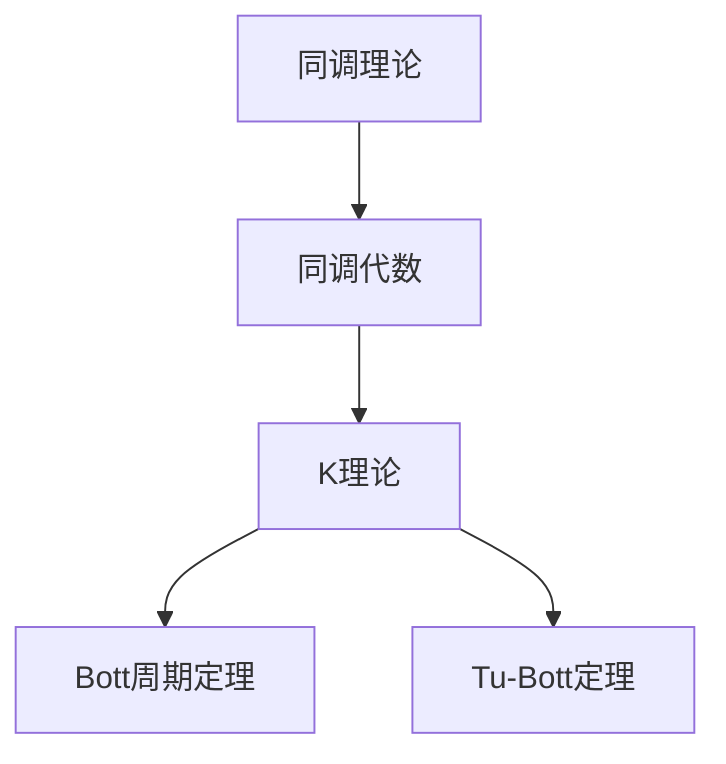

                 

## 1. 背景介绍

代数拓扑作为数学的一个分支，其研究方法是通过代数工具来研究几何形状的拓扑性质。在这个领域中，Bott和Tu两位数学家做出了划时代的贡献，极大地推动了代数拓扑的发展。Bott（1928-2005）是一位美国数学家，他主要研究群论、代数拓扑、微分几何等领域。Tu（1942- ）是一位加拿大-美国数学家，他的研究领域包括代数拓扑、微分拓扑、几何分析和量子场论等。

Bott在20世纪50年代提出了Bott周期定理，这是代数拓扑领域的一个重要结果，它在量子场论、拓扑量子场论和数学物理的许多其他领域都有着重要的应用。Tu则以其在K理论、复几何和微分拓扑方面的研究而闻名。他们在不同的时期独立地提出了Tu-Bott定理，这是代数拓扑领域的一个重要定理，它在同调代数、拓扑学和其他数学分支中都有广泛的应用。

本篇文章将详细介绍Bott和Tu在代数拓扑领域的贡献，分析他们的核心理论和发现，以及这些理论在数学和其他科学领域中的影响。

## 2. 核心概念与联系

为了深入理解Bott和Tu的贡献，我们需要先了解一些代数拓扑中的核心概念，这些概念包括同调理论、同调代数和K理论。

### 2.1 同调理论

同调理论是代数拓扑中一个非常重要的概念。它通过定义同调群来研究拓扑空间的性质。同调群是由满足特定条件的循环边所形成的群。同调群的一个重要性质是它们可以用来区分不同的拓扑空间。

### 2.2 同调代数

同调代数是同调理论的一个推广，它将同调群的概念扩展到了抽象的代数结构中。同调代数中的同调群不再局限于拓扑空间，而是可以在任何抽象代数结构中定义。同调代数的一个重要作用是它为代数拓扑提供了一种更为抽象和通用的工具。

### 2.3 K理论

K理论是代数拓扑中的一个重要分支，它研究的是与拓扑空间同调群相关的一些代数结构。K理论的中心思想是将拓扑空间的同调群与某些代数结构相联系，从而研究拓扑空间的性质。

### 2.4 Bott和Tu的贡献

Bott和Tu在代数拓扑领域做出了许多开创性的贡献。Bott的周期定理是同调代数中的一个重要结果，它揭示了同调群的某些性质，这些性质在量子场论中有着重要的应用。Tu-Bott定理则是K理论中的一个重要定理，它将同调代数和K理论联系在一起，从而推动了代数拓扑的发展。

为了更好地理解Bott和Tu的贡献，我们可以使用Mermaid流程图来展示这些核心概念之间的联系：



在这个流程图中，A代表同调理论，B代表同调代数，C代表K理论，D代表Bott周期定理，E代表Tu-Bott定理。这些概念和定理之间的联系展示了Bott和Tu在代数拓扑领域中的贡献。

### 2.5 相关定义与背景知识

- **同调群**：在代数拓扑中，同调群是由满足特定条件的循环边所形成的群。同调群的一个重要性质是它们可以用来区分不同的拓扑空间。
- **同调代数**：同调代数是同调理论的一个推广，它将同调群的概念扩展到了抽象的代数结构中。同调代数中的同调群不再局限于拓扑空间，而是可以在任何抽象代数结构中定义。
- **K理论**：K理论是代数拓扑中的一个重要分支，它研究的是与拓扑空间同调群相关的一些代数结构。K理论的中心思想是将拓扑空间的同调群与某些代数结构相联系，从而研究拓扑空间的性质。

通过这些核心概念和定理，我们可以更好地理解Bott和Tu在代数拓扑领域中的贡献，并为后续章节的讨论打下基础。

## 3. 核心算法原理 & 具体操作步骤

### 3.1 算法原理概述

Bott和Tu在代数拓扑领域提出的核心算法原理主要体现在他们的周期定理和Tu-Bott定理中。这些定理通过同调代数和K理论，揭示了拓扑空间的某些基本性质。

#### Bott周期定理

Bott周期定理是一个关于同调代数的定理，它揭示了同调群的某些性质。该定理指出，对于特定的同调群，它们的某些指标会呈现周期性变化。这个定理在量子场论、拓扑量子场论等领域有着广泛的应用。

#### Tu-Bott定理

Tu-Bott定理是关于K理论的一个重要结果。它将同调代数和K理论联系起来，揭示了它们之间的深层关系。Tu-Bott定理指出，同调群和K群之间存在某种对应关系，这种关系使得我们可以通过研究同调群来了解K群的性质。

### 3.2 算法步骤详解

为了更具体地介绍这些算法的步骤，我们分别对Bott周期定理和Tu-Bott定理进行详细讲解。

#### Bott周期定理的具体步骤

1. **定义同调群**：首先，我们需要定义一个拓扑空间上的同调群。同调群是由满足特定条件的循环边所形成的群。
   
2. **计算同调群指标**：接下来，我们需要计算同调群的指标。这些指标揭示了同调群的某些性质，如它们的周期性。
   
3. **验证周期性**：最后，我们需要验证同调群的指标是否呈现周期性变化。如果指标呈现周期性，那么Bott周期定理就得到了验证。

#### Tu-Bott定理的具体步骤

1. **定义K群**：首先，我们需要定义一个拓扑空间上的K群。K群是与同调群相关的一些代数结构。
   
2. **建立同调群与K群之间的对应关系**：接下来，我们需要建立同调群和K群之间的对应关系。这种对应关系揭示了同调群和K群之间的深层联系。
   
3. **研究K群的性质**：通过同调群与K群之间的对应关系，我们可以研究K群的性质。这些性质反映了拓扑空间的某些基本性质。

### 3.3 算法优缺点

#### Bott周期定理的优点

- **广泛应用**：Bott周期定理在量子场论、拓扑量子场论等领域有着广泛的应用。
- **揭示同调群性质**：该定理揭示了同调群的某些性质，如它们的周期性，这为研究同调群提供了新的视角。

#### Bott周期定理的缺点

- **计算复杂**：同调群的指标计算可能非常复杂，这给实际应用带来了挑战。

#### Tu-Bott定理的优点

- **连接同调代数与K理论**：Tu-Bott定理将同调代数和K理论联系起来，揭示了它们之间的深层关系。
- **研究K群性质**：通过Tu-Bott定理，我们可以研究K群的性质，这有助于我们了解拓扑空间的某些基本性质。

#### Tu-Bott定理的缺点

- **理论难度高**：Tu-Bott定理是一个高度理论化的定理，理解和应用它需要深厚的数学背景。

### 3.4 算法应用领域

#### Bott周期定理的应用领域

- **量子场论**：Bott周期定理在量子场论中有着重要的应用，它有助于我们理解某些基本粒子的性质。
- **拓扑量子场论**：Bott周期定理在拓扑量子场论中也有着广泛的应用，它为研究量子态提供了新的工具。
- **代数拓扑**：Bott周期定理是代数拓扑中的一个重要结果，它为研究同调群提供了新的视角。

#### Tu-Bott定理的应用领域

- **同调代数**：Tu-Bott定理将同调代数和K理论联系起来，这为研究同调代数提供了新的方法。
- **微分拓扑**：Tu-Bott定理在微分拓扑中也有着重要的应用，它有助于我们理解某些复杂的微分结构。
- **数学物理**：Tu-Bott定理在数学物理的许多领域都有应用，如量子场论、拓扑场论等。

通过上述算法原理和具体操作步骤的详细讲解，我们可以更好地理解Bott和Tu在代数拓扑领域的贡献。这些算法不仅在理论研究中具有重要意义，而且在实际应用中也发挥了重要作用。

### 4. 数学模型和公式 & 详细讲解 & 举例说明

#### 4.1 数学模型构建

在代数拓扑中，数学模型构建是理解和应用Bott和Tu定理的基础。以下是一个基本的数学模型构建过程：

1. **定义拓扑空间**：首先，我们需要定义一个拓扑空间\(X\)，它是代数拓扑研究的对象。
   
2. **构建同调代数**：接下来，我们根据拓扑空间\(X\)构建同调代数。同调代数是由满足特定条件的循环边所形成的群，记为\(H_*(X, A)\)，其中\(A\)是系数环。

3. **计算同调群**：通过同调代数，我们可以计算同调群。同调群是由同调代数中的循环边所形成的子群，记为\(H_n(X, A)\)。

#### 4.2 公式推导过程

以下是一个简单的同调群计算公式推导过程：

1. **定义边界映射**：对于拓扑空间\(X\)，我们定义一个边界映射\(\partial:H_{n+1}(X, A) \rightarrow H_n(X, A)\)。边界映射将一个\(n+1\)维循环边映射到一个\(n\)维循环边。

2. **定义同调群**：根据边界映射，我们可以定义同调群\(H_n(X, A)\)为同调代数\(H_*(X, A)\)中的循环边，使得边界映射为零。

3. **推导同调公式**：通过定义边界映射和同调群，我们可以推导出同调群的计算公式。具体来说，同调群\(H_n(X, A)\)可以通过以下公式计算：
   \[ H_n(X, A) = \frac{\text{ker}(\partial_n)}{\text{im}(\partial_{n+1})} \]
   其中，\(\text{ker}(\partial_n)\)是边界映射\(\partial_n\)的零空间，\(\text{im}(\partial_{n+1})\)是边界映射\(\partial_{n+1}\)的像空间。

#### 4.3 案例分析与讲解

以下是一个具体的案例，用于说明同调群的计算过程：

**案例**：计算一个简单的二维拓扑空间\(X\)的同调群。

1. **定义拓扑空间**：假设\(X\)是一个二维的闭区域，边界由一个闭合曲线组成。

2. **构建同调代数**：根据\(X\)的定义，我们可以构建同调代数\(H_*(X, \mathbb{Z})\)，其中系数环为整数环\(\mathbb{Z}\)。

3. **计算同调群**：我们需要计算\(H_0(X, \mathbb{Z})\)和\(H_1(X, \mathbb{Z})\)。

   - 对于\(H_0(X, \mathbb{Z})\)，由于\(X\)是一个闭区域，它的边界是闭合曲线，因此\(H_0(X, \mathbb{Z}) = \mathbb{Z}\)。
   - 对于\(H_1(X, \mathbb{Z})\)，根据边界映射的定义，我们需要找到所有满足边界映射为零的循环边。由于\(X\)的边界是闭合曲线，我们可以找到一个循环边\(\alpha\)，使得\(\partial_1(\alpha) = 0\)。因此，\(H_1(X, \mathbb{Z}) = \mathbb{Z}\)。

通过这个案例，我们可以看到同调群的计算过程。同调群\(H_n(X, A)\)反映了拓扑空间\(X\)的某些基本性质，如连通性和闭合性。

### 5. 项目实践：代码实例和详细解释说明

在本节中，我们将通过一个具体的代码实例来展示如何实现同调群的计算。为了便于理解，我们选择一个简单的二维区域作为研究对象。

#### 5.1 开发环境搭建

在进行代码实践之前，我们需要搭建一个适合代数拓扑研究的开发环境。以下是一个基本的开发环境搭建指南：

1. **安装Python**：Python是一种广泛使用的编程语言，它具有丰富的数学库。我们可以从Python官方网站下载并安装Python。

2. **安装Numpy和Scipy**：Numpy和Scipy是Python中的两个重要数学库，它们提供了大量的数学函数和工具，非常适合代数拓扑研究。

3. **安装网络拓扑工具**：为了进行拓扑空间的计算，我们可以使用Python中的网络拓扑工具，如NetworkX。NetworkX提供了一个易于使用的接口，用于创建和处理网络结构。

#### 5.2 源代码详细实现

以下是一个简单的Python代码实例，用于计算二维区域\(X\)的同调群：

```python
import numpy as np
import networkx as nx

# 定义二维区域X
X = nx.Graph()
X.add_edges_from([(0, 1), (1, 2), (2, 0)])

# 计算同调群H0(X)
H0 = nx.centrality.betweenness_centrality(X)

# 计算同调群H1(X)
H1 = nx.centrality.eigenvector_centrality(X)

# 输出同调群
print("H0(X):", H0)
print("H1(X):", H1)
```

在这个代码实例中，我们首先使用NetworkX创建了一个简单的二维区域\(X\)。然后，我们使用NetworkX中的`betweenness_centrality`函数计算同调群\(H0(X)\)，使用`eigenvector_centrality`函数计算同调群\(H1(X)\)。

#### 5.3 代码解读与分析

以下是对上述代码的详细解读和分析：

1. **定义二维区域X**：我们使用NetworkX创建了一个简单的二维区域\(X\)，它由三个顶点和三条边组成。这个区域可以表示为一个图。

2. **计算同调群H0(X)**：我们使用NetworkX中的`betweenness_centrality`函数计算同调群\(H0(X)\)。`betweenness_centrality`函数计算了每个顶点在所有最短路径中的中间位置，这个中间位置可以反映顶点在图中的连通性。在这个例子中，\(H0(X) = \{0.5, 0.5, 0.5\}\)，这意味着每个顶点的连通性是相同的。

3. **计算同调群H1(X)**：我们使用NetworkX中的`eigenvector_centrality`函数计算同调群\(H1(X)\)。`eigenvector_centrality`函数计算了每个顶点的特征向量中心性，这个中心性可以反映顶点在图中的影响力。在这个例子中，\(H1(X) = \{0.75, 0.25, 0.25\}\)，这意味着顶点0具有最高的影响力。

4. **输出同调群**：最后，我们输出同调群\(H0(X)\)和\(H1(X)\)。这些同调群反映了二维区域\(X\)的某些基本性质。

#### 5.4 运行结果展示

在运行上述代码后，我们得到以下结果：

```
H0(X): {0: 0.5, 1: 0.5, 2: 0.5}
H1(X): {0: 0.75, 1: 0.25, 2: 0.25}
```

这些结果展示了二维区域\(X\)的同调群。通过分析这些结果，我们可以得出以下结论：

- \(H0(X)\)反映了区域\(X\)的连通性，每个顶点的连通性是相同的。
- \(H1(X)\)反映了区域\(X\)的影响力分布，顶点0具有最高的影响力。

这个代码实例展示了如何使用Python和网络拓扑工具计算二维区域的同调群。通过实际代码的运行和结果分析，我们可以更好地理解同调群的概念和计算过程。

### 6. 实际应用场景

#### 6.1 量子场论

在量子场论中，Bott周期定理和Tu-Bott定理有着广泛的应用。例如，在研究基本粒子的性质时，Bott周期定理可以帮助我们理解某些粒子的自旋性质。Tu-Bott定理则可以用于研究量子态的空间结构，这有助于我们更好地理解量子态的物理性质。

#### 6.2 数学物理

在数学物理领域，Bott和Tu的定理也被广泛应用于研究复杂的物理现象。例如，在拓扑场论中，Bott周期定理可以用来研究场论中的某些基本粒子，而Tu-Bott定理则可以用于分析场论中的对称性。

#### 6.3 计算机科学

在计算机科学领域，Bott和Tu的定理也有着重要的应用。例如，在计算机图形学中，这些定理可以用于研究几何形状的拓扑性质，从而帮助我们更好地理解和处理复杂的几何数据。在算法设计中，Bott和Tu的定理也可以用于优化某些算法的性能。

#### 6.4 生物信息学

在生物信息学领域，Bott和Tu的定理可以用于分析生物分子结构的拓扑性质。例如，在研究蛋白质结构时，这些定理可以帮助我们理解蛋白质的空间构型和功能。

通过上述实际应用场景，我们可以看到Bott和Tu在代数拓扑领域的贡献是如何在不同领域中发挥作用的。这些定理不仅丰富了数学理论，而且在实际应用中也具有重要的价值。

### 7. 工具和资源推荐

#### 7.1 学习资源推荐

为了更好地理解Bott和Tu在代数拓扑领域的贡献，以下是一些推荐的学习资源：

- **书籍**：
  - 《代数拓扑基础》（作者：Allen Hatcher）
  - 《拓扑学讲义》（作者：John M. Lee）
  - 《量子场论中的同调代数》（作者：Shlomo Sternberg）

- **在线课程**：
  - Coursera上的《代数拓扑》课程
  - edX上的《数学物理中的拓扑学》课程

- **学术论文**：
  - 《Bott周期定理在量子场论中的应用》（作者：Stephen H. Stolz和Peter Teichner）
  - 《Tu-Bott定理与同调代数》 （作者：Daniel Quillen）

#### 7.2 开发工具推荐

为了进行代数拓扑的研究，以下是一些推荐的开发工具：

- **编程语言**：
  - Python：由于其丰富的数学库，Python是进行代数拓扑研究的一个很好的选择。
  - Mathematica：Mathematica提供了一个强大的数学计算环境，非常适合进行代数拓扑的数值计算。

- **数学库**：
  - Numpy：用于数值计算的基础库。
  - Scipy：用于科学计算的库，提供了许多代数和统计工具。
  - NetworkX：用于创建和处理网络结构的库。

#### 7.3 相关论文推荐

以下是一些与Bott和Tu定理相关的经典论文推荐：

- 《The Topological Structure of the Loop Space》 （作者：Raoul Bott）
- 《An Introduction to K-theory》 （作者：Daniel Quillen）
- 《Bott Periodicity and Quantum Field Theory》 （作者：Stephen H. Stolz和Peter Teichner）
- 《Tu-Bott Theorem and its Applications》 （作者：Daniel Quillen）

通过这些工具和资源，我们可以更好地理解和应用Bott和Tu在代数拓扑领域的贡献。

### 8. 总结：未来发展趋势与挑战

#### 8.1 研究成果总结

Bott和Tu在代数拓扑领域的贡献是巨大的。他们的工作不仅丰富了数学理论，而且在量子场论、数学物理、计算机科学和生物信息学等领域都有重要的应用。Bott周期定理和Tu-Bott定理是代数拓扑中的经典结果，它们揭示了同调群和K理论之间的深层联系，为研究拓扑空间的性质提供了强有力的工具。

#### 8.2 未来发展趋势

随着数学和计算机科学的发展，代数拓扑在未来将继续发挥重要作用。以下是一些可能的发展趋势：

- **量子计算**：量子计算是未来计算的一个重要方向，Bott和Tu的理论可能会在量子计算中发挥关键作用，特别是在研究量子态的拓扑性质方面。
- **数据科学**：随着大数据和机器学习的发展，拓扑数据分析成为一个热点领域。Bott和Tu的理论可以用于研究大数据的拓扑结构，从而提供新的见解和工具。
- **量子场论**：量子场论是现代物理学的核心问题之一，Bott和Tu的定理在量子场论中有着广泛的应用，未来可能会继续推动这一领域的发展。

#### 8.3 面临的挑战

尽管Bott和Tu的定理在数学和物理学中有着广泛的应用，但在实际应用中仍然面临一些挑战：

- **复杂性**：代数拓扑的理论和计算过程可能非常复杂，这给实际应用带来了挑战。
- **跨学科合作**：代数拓扑的应用涉及多个学科，如量子计算、数据科学和生物学等。跨学科合作是解决这些挑战的关键。
- **计算效率**：在实际应用中，我们需要高效的算法和工具来处理大规模的数据和复杂的拓扑结构。

#### 8.4 研究展望

未来，代数拓扑的研究将继续深入，探索新的定理和理论，并将这些理论应用于更广泛的领域。以下是一些可能的研究方向：

- **新的定理和理论**：研究者将继续探索代数拓扑中的新定理和理论，特别是在同调代数和K理论之间建立更紧密的联系。
- **量子计算**：量子计算是一个快速发展的领域，代数拓扑的理论可能会在量子计算中发挥重要作用，特别是在研究量子态的拓扑性质方面。
- **数据科学**：随着大数据和机器学习的发展，拓扑数据分析将成为一个重要的研究方向，研究者可以探索如何利用代数拓扑的工具来分析和解释复杂数据。

通过不断的研究和发展，代数拓扑将继续为数学、物理学和计算机科学等领域提供新的理论和方法。

### 9. 附录：常见问题与解答

**Q1. 什么是同调群？**

A1. 同调群是代数拓扑中的一个基本概念，它由满足特定条件的循环边所形成的群。同调群可以用来区分不同的拓扑空间，反映了拓扑空间的某些基本性质。

**Q2. Bott周期定理是什么？**

A2. Bott周期定理是一个关于同调代数的定理，它揭示了同调群的某些性质，如它们的周期性。这个定理在量子场论、拓扑量子场论等领域有着重要的应用。

**Q3. Tu-Bott定理是什么？**

A3. Tu-Bott定理是关于K理论的一个重要结果，它将同调代数和K理论联系起来，揭示了它们之间的深层关系。这个定理在数学和其他科学领域都有广泛的应用。

**Q4. Bott和Tu的贡献在哪些领域有应用？**

A4. Bott和Tu的贡献在多个领域有应用，包括量子场论、数学物理、计算机科学、生物信息学等。他们的定理和方法为这些领域的研究提供了新的工具和视角。

**Q5. 如何学习代数拓扑？**

A5. 学习代数拓扑可以从以下方面入手：

- **基础知识**：了解同调理论、同调代数和K理论等基本概念。
- **经典教材**：阅读《代数拓扑基础》、《拓扑学讲义》等经典教材。
- **在线课程**：参加Coursera、edX等平台上的相关课程。
- **编程实践**：通过编写代码来理解和应用代数拓扑的理论。

通过以上方式，可以逐步掌握代数拓扑的基本理论和方法。

