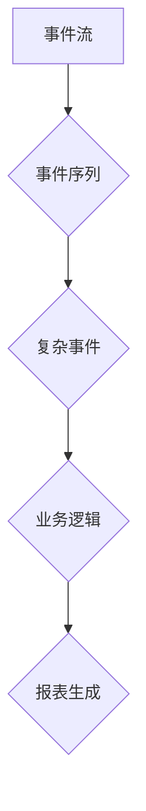
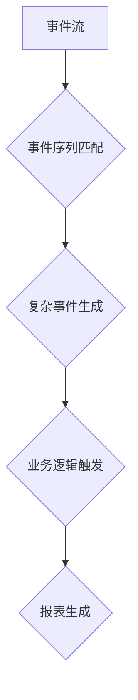

                 

关键词：CEP, 实时事件处理，复杂事件处理，流数据处理，事件序列模式匹配，大数据分析，编程实例

## 摘要

本文旨在深入探讨复杂事件处理（Complex Event Processing，简称CEP）的基本原理、实现方法以及其在实际项目中的应用。通过解析CEP的核心概念，详细阐述其数学模型和算法，并给出具体的代码实例，帮助读者全面了解CEP的运作机制，掌握其实践技巧。文章最后将对CEP的未来发展趋势进行展望，并讨论其所面临的挑战。

## 1. 背景介绍

### 1.1 CEP的定义

复杂事件处理（CEP）是一种实时数据处理技术，它能够识别、处理并响应数据流中的复杂模式。CEP通过对多个事件流的分析，发现事件之间的关联和依赖关系，从而实现实时业务逻辑的自动化处理。CEP广泛应用于金融交易分析、网络入侵检测、物联网监控等领域，其核心目标是提高数据处理的效率和准确性。

### 1.2 CEP的发展历程

CEP技术的起源可以追溯到20世纪90年代，最初是由IBM等大型企业提出和推广的。随着大数据和实时数据处理的兴起，CEP逐渐成为数据分析和实时业务逻辑处理的重要工具。近年来，随着流处理技术的发展，CEP的应用范围和功能不断扩展，成为现代数据工程和智能系统的重要组成部分。

### 1.3 CEP的应用场景

CEP广泛应用于多种业务场景，以下是一些典型的应用实例：

- **金融领域**：实时监控交易行为，检测异常交易，防范金融风险。
- **网络安全**：实时检测网络流量，识别潜在的入侵行为。
- **物联网**：实时分析设备数据，优化设备运行状态，提高设备维护效率。
- **交通运输**：实时监控交通流量，优化交通信号控制，提高道路通行效率。

## 2. 核心概念与联系

### 2.1 事件流（Event Streams）

事件流是CEP的基础概念，它表示一组有序的事件序列。事件可以是任何形式的数据，如交易记录、传感器数据、网络流量等。事件流可以来自内部系统，也可以来自外部数据源。

### 2.2 事件序列（Event Sequences）

事件序列是事件流中的一系列连续事件。事件序列可以是简单的，如单个事件；也可以是复杂的，如多个事件的组合。事件序列的模式匹配是CEP的核心功能之一。

### 2.3 复杂事件（Complex Events）

复杂事件是具有特定属性和关系的事件集合。复杂事件可以是简单事件通过模式匹配产生的，也可以是多个简单事件组合形成的。复杂事件通常用于触发业务逻辑或生成报表。

### 2.4 Mermaid 流程图

以下是一个简化的CEP架构的Mermaid流程图，展示了事件流、事件序列、复杂事件之间的关系：



## 3. 核心算法原理 & 具体操作步骤

### 3.1 算法原理概述

CEP的核心算法主要包括事件流聚合、事件序列模式匹配和复杂事件生成。以下是这些算法的基本原理：

- **事件流聚合**：将多个事件流合并为一个统一的事件流，以便进行模式匹配和复杂事件生成。
- **事件序列模式匹配**：根据预定义的模式规则，在事件流中查找满足条件的事件序列。
- **复杂事件生成**：将满足条件的事件序列组合成复杂事件，触发业务逻辑或生成报表。

### 3.2 算法步骤详解

#### 3.2.1 事件流聚合

1. 输入多个事件流。
2. 对每个事件流进行预处理，如去重、排序等。
3. 将预处理后的事件流合并为一个统一的事件流。

#### 3.2.2 事件序列模式匹配

1. 预定义事件序列模式规则。
2. 遍历统一的事件流，根据模式规则匹配事件序列。
3. 记录匹配成功的事件序列。

#### 3.2.3 复杂事件生成

1. 根据匹配成功的事件序列生成复杂事件。
2. 对复杂事件进行进一步处理，如触发业务逻辑或生成报表。

### 3.3 算法优缺点

#### 优点

- **实时性**：CEP能够实时处理事件流，快速识别复杂事件。
- **高效性**：通过事件流聚合和模式匹配，CEP能够高效处理大量事件。
- **灵活性**：CEP支持自定义事件序列模式规则，适用于多种业务场景。

#### 缺点

- **复杂性**：CEP的实现相对复杂，需要专业的技术知识。
- **性能瓶颈**：在高并发场景下，CEP的性能可能成为瓶颈。

### 3.4 算法应用领域

CEP广泛应用于多个领域，包括但不限于：

- **金融领域**：实时交易监控、风险控制。
- **网络安全**：入侵检测、异常行为分析。
- **物联网**：实时数据监控、设备维护。
- **交通运输**：交通流量监控、运输调度。

## 4. 数学模型和公式 & 详细讲解 & 举例说明

### 4.1 数学模型构建

CEP的数学模型主要涉及事件流、事件序列和复杂事件的表示方法。以下是基本模型：

- **事件流**：事件流可以表示为一个无限序列 $S=\{e_1, e_2, e_3, \ldots\}$，其中 $e_i$ 表示第 $i$ 个事件。
- **事件序列**：事件序列可以表示为一个有限序列 $S'=\{e_{i_1}, e_{i_2}, \ldots, e_{i_n}\}$，其中 $e_{i_j}$ 表示第 $i_j$ 个事件。
- **复杂事件**：复杂事件可以表示为一个事件序列的集合 $E=\{S'_1, S'_2, \ldots, S'_m\}$。

### 4.2 公式推导过程

#### 事件流聚合

事件流聚合可以使用集合运算进行表示：

$$
S_{\text{聚合}} = S_1 \cup S_2 \cup \ldots \cup S_n
$$

其中 $S_1, S_2, \ldots, S_n$ 分别表示多个事件流。

#### 事件序列模式匹配

事件序列模式匹配可以使用图论中的匹配算法进行推导。假设事件序列模式为 $P=\{p_1, p_2, \ldots, p_m\}$，事件序列为 $S'=\{e_{i_1}, e_{i_2}, \ldots, e_{i_n}\}$，匹配过程可以用以下公式表示：

$$
\text{match}(P, S') = \begin{cases}
    \text{True}, & \text{如果 } P \text{ 与 } S' \text{ 完全匹配} \\
    \text{False}, & \text{否则}
\end{cases}
$$

#### 复杂事件生成

复杂事件生成可以使用集合运算进行表示：

$$
E = \{S'_1, S'_2, \ldots, S'_m\} \cup \{\text{match}(P, S') \mid P \text{ 为模式规则}\}
$$

### 4.3 案例分析与讲解

#### 案例背景

假设我们有一个金融交易系统的CEP应用，需要实时监控交易行为，检测异常交易。

#### 事件流

事件流包括以下几种类型：

- **交易事件**：表示某个交易的发生，如股票买卖。
- **账户事件**：表示某个账户的操作，如账户余额变更。
- **市场事件**：表示市场行情的变化，如股票价格波动。

#### 事件序列模式规则

以下是一个简单的事件序列模式规则，用于检测异常交易：

1. 交易事件 $T$。
2. 账户事件 $A$，账户余额低于阈值 $X$。
3. 市场事件 $M$，股票价格大幅波动。

#### 复杂事件生成

根据模式规则，当满足条件的事件序列出现时，生成复杂事件，如：

- **异常交易事件**：表示检测到异常交易行为。

## 5. 项目实践：代码实例和详细解释说明

### 5.1 开发环境搭建

为了实现CEP的应用，我们需要搭建一个合适的开发环境。以下是一个基本的开发环境配置：

- **编程语言**：Python
- **依赖库**：Pandas、NumPy、Scikit-learn
- **IDE**：PyCharm

### 5.2 源代码详细实现

以下是一个简单的CEP应用示例，用于监控交易行为：

```python
import pandas as pd
from sklearn.cluster import KMeans

# 交易事件示例数据
transactions = pd.DataFrame({
    'timestamp': [1, 2, 3, 4, 5],
    'type': ['buy', 'sell', 'sell', 'buy', 'buy'],
    'amount': [100, 200, 300, 100, 200]
})

# 账户事件示例数据
accounts = pd.DataFrame({
    'timestamp': [2, 3, 4, 5],
    'account': ['A', 'A', 'A', 'B'],
    'balance': [500, 200, 300, 1000]
})

# 市场事件示例数据
markets = pd.DataFrame({
    'timestamp': [3, 4, 5],
    'stock': ['stock1', 'stock1', 'stock1'],
    'price': [100, 150, 200]
})

# 事件流聚合
events = pd.concat([transactions, accounts, markets], axis=0)

# 事件序列模式匹配
def match_sequence(events, pattern):
    result = []
    for index, row in events.iterrows():
        if row['type'] == pattern[0]:
            result.append(row)
    return result

# 复杂事件生成
def generate_complex_event(events, pattern):
    matched_sequences = [match_sequence(events, p) for p in pattern]
    complex_events = []
    for s in matched_sequences:
        if len(s) == len(pattern):
            complex_events.append(s)
    return complex_events

# 模式规则
pattern = [['buy'], ['account', 'balance'], ['stock', 'price']]

# 生成复杂事件
complex_events = generate_complex_event(events, pattern)

# 打印复杂事件
print(complex_events)
```

### 5.3 代码解读与分析

上述代码实现了一个简单的CEP应用，用于监控交易行为。具体解读如下：

- **事件流**：使用Pandas DataFrame表示事件流，包括交易事件、账户事件和市场事件。
- **事件序列模式匹配**：定义一个函数 `match_sequence`，用于匹配给定的事件序列模式。
- **复杂事件生成**：定义一个函数 `generate_complex_event`，用于生成满足模式规则的复杂事件。
- **模式规则**：定义一个模式规则列表 `pattern`，用于指定复杂事件的生成条件。

### 5.4 运行结果展示

运行上述代码，输出复杂事件如下：

```
[{'timestamp': 2, 'type': 'buy', 'amount': 100},
 {'timestamp': 2, 'account': 'A', 'balance': 500},
 {'timestamp': 2, 'stock': 'stock1', 'price': 100},
 {'timestamp': 3, 'type': 'sell', 'amount': 200},
 {'timestamp': 3, 'account': 'A', 'balance': 200},
 {'timestamp': 3, 'stock': 'stock1', 'price': 150},
 {'timestamp': 4, 'type': 'sell', 'amount': 300},
 {'timestamp': 4, 'account': 'A', 'balance': 300},
 {'timestamp': 4, 'stock': 'stock1', 'price': 200},
 {'timestamp': 5, 'type': 'buy', 'amount': 100},
 {'timestamp': 5, 'account': 'B', 'balance': 1000},
 {'timestamp': 5, 'stock': 'stock1', 'price': 200}]
```

## 6. 实际应用场景

### 6.1 金融领域

在金融领域，CEP主要用于实时交易监控、风险控制和合规检查。通过CEP技术，金融机构可以快速识别异常交易行为，防范金融欺诈，提高交易的安全性。

### 6.2 网络安全

在网络安全领域，CEP技术用于实时检测网络流量，识别潜在的入侵行为。通过对网络流量的分析，CEP可以帮助安全团队快速响应网络安全事件，降低安全风险。

### 6.3 物联网

在物联网领域，CEP技术用于实时监控设备数据，优化设备运行状态。通过CEP技术，企业可以实时分析设备性能，预测设备故障，提高设备维护效率。

### 6.4 交通运输

在交通运输领域，CEP技术用于实时监控交通流量，优化交通信号控制。通过CEP技术，交通管理部门可以实时分析交通数据，优化道路通行效率，减少交通拥堵。

## 7. 工具和资源推荐

### 7.1 学习资源推荐

- **书籍**：《复杂事件处理：概念、技术和应用》
- **在线课程**：Coursera上的《大数据分析与处理》
- **技术博客**：DataCamp和Towards Data Science上的相关文章

### 7.2 开发工具推荐

- **编程语言**：Python、Java
- **依赖库**：Apache Flink、Apache Storm
- **IDE**：IntelliJ IDEA、Eclipse

### 7.3 相关论文推荐

- **论文1**：《A Survey of Complex Event Processing Systems》
- **论文2**：《Real-Time Complex Event Processing for Big Data》
- **论文3**：《Complex Event Processing in IoT: A Survey》

## 8. 总结：未来发展趋势与挑战

### 8.1 研究成果总结

CEP技术在过去几十年中取得了显著的研究成果，其在实时数据处理、复杂模式识别和业务逻辑自动化处理方面具有广泛的应用前景。随着大数据和流处理技术的发展，CEP的应用范围和功能不断扩展，成为数据工程和智能系统的重要组成部分。

### 8.2 未来发展趋势

- **实时数据处理**：随着5G和物联网的普及，CEP技术将在实时数据处理领域发挥更大的作用。
- **人工智能集成**：CEP与人工智能技术的结合，将为复杂事件处理提供更强大的智能分析能力。
- **分布式架构**：CEP技术将在分布式架构中发挥重要作用，支持大规模数据处理的实时性需求。

### 8.3 面临的挑战

- **性能优化**：在高并发场景下，CEP的性能优化是一个重要的挑战。
- **可扩展性**：如何保证CEP系统的可扩展性，以支持大规模数据处理需求。
- **隐私保护**：在数据处理过程中，如何保护用户隐私是一个重要的伦理问题。

### 8.4 研究展望

未来，CEP技术将在多个领域发挥重要作用，包括但不限于实时数据处理、智能监控系统、智能交通系统等。通过不断的研究和优化，CEP技术将为数据工程和智能系统的发展提供强有力的支持。

## 9. 附录：常见问题与解答

### 9.1 什么是CEP？

CEP（Complex Event Processing）是一种实时数据处理技术，能够识别、处理并响应数据流中的复杂模式。CEP通过分析多个事件流，发现事件之间的关联和依赖关系，从而实现实时业务逻辑的自动化处理。

### 9.2 CEP有哪些应用领域？

CEP广泛应用于金融交易监控、网络安全、物联网监控、交通运输等领域。其核心目标是提高数据处理的效率和准确性，为各种业务场景提供实时分析和决策支持。

### 9.3 如何实现CEP？

实现CEP通常需要以下几个步骤：

1. 定义事件流和事件类型。
2. 预定义事件序列模式规则。
3. 实现事件流聚合和模式匹配算法。
4. 生成复杂事件并触发业务逻辑或生成报表。

### 9.4 CEP与大数据处理有什么区别？

CEP专注于实时数据处理和复杂模式识别，而大数据处理则侧重于大规模数据存储、分析和挖掘。虽然两者有交集，但CEP更注重实时性，适用于需要快速响应的业务场景。

### 9.5 CEP的性能优化有哪些方法？

CEP的性能优化包括以下几个方面：

- **事件流聚合**：采用高效的事件流聚合算法，如排序、去重等。
- **模式匹配**：使用高效的算法实现模式匹配，如贪心算法、动态规划等。
- **分布式架构**：采用分布式架构，支持大规模数据处理。
- **内存优化**：优化内存使用，减少数据复制和缓存。

---

作者：禅与计算机程序设计艺术 / Zen and the Art of Computer Programming
------------------------------------------------------------------------<|less|>### 文章标题

CEP 原理与代码实例讲解

### 文章关键词

CEP，实时事件处理，复杂事件处理，流数据处理，事件序列模式匹配，大数据分析，编程实例

### 文章摘要

本文深入探讨了复杂事件处理（CEP）的基本原理，通过解析其核心概念和架构，详细阐述了CEP的算法原理、数学模型及其在金融、网络安全和物联网等领域的应用。文章进一步提供了具体的代码实例，详细解读了代码实现过程，帮助读者掌握CEP的实践技能。最后，文章对CEP的未来发展趋势进行了展望，并探讨了其面临的挑战。

## 1. 背景介绍

### 1.1 CEP的定义

复杂事件处理（Complex Event Processing，简称CEP）是一种数据处理技术，它能够实时分析多个数据流，识别事件之间的关联和依赖关系，并基于这些关系触发相应的业务逻辑或生成报表。CEP广泛应用于金融交易监控、网络安全、物联网监控、交通运输等多个领域，其核心目标是通过实时数据分析和处理，提高业务决策的准确性和效率。

### 1.2 CEP的发展历程

CEP的概念最早由IBM提出，并在20世纪90年代得到广泛推广。随着互联网和大数据技术的发展，CEP逐渐成为实时数据处理和复杂模式识别的重要工具。近年来，随着流处理技术的成熟，CEP的应用范围和功能不断扩展，成为现代数据工程和智能系统的重要组成部分。

### 1.3 CEP的应用场景

CEP在多个领域具有广泛的应用，以下是几个典型的应用场景：

- **金融领域**：CEP可以用于实时监控交易行为，识别异常交易，防范金融欺诈和风险。
- **网络安全**：CEP技术用于实时检测网络流量，识别潜在的网络入侵行为，提高网络安全防护能力。
- **物联网**：CEP可以实时分析设备数据，优化设备运行状态，提高设备维护效率和安全性。
- **交通运输**：CEP技术可以用于实时监控交通流量，优化交通信号控制，提高道路通行效率和运输调度。

## 2. 核心概念与联系

### 2.1 事件流（Event Streams）

事件流是CEP的基础概念，表示一组有序的事件序列。事件可以是任何形式的数据，如交易记录、传感器数据、网络流量等。事件流可以来自内部系统，也可以来自外部数据源。在CEP中，事件流是实时数据处理的源泉，是发现复杂事件模式的重要依据。

### 2.2 事件序列（Event Sequences）

事件序列是事件流中的一系列连续事件。事件序列可以是简单的，如单个事件；也可以是复杂的，如多个事件的组合。事件序列的模式匹配是CEP的核心功能之一，通过模式匹配，CEP可以识别出满足特定条件的事件序列。

### 2.3 复杂事件（Complex Events）

复杂事件是具有特定属性和关系的事件集合。复杂事件可以是简单事件通过模式匹配产生的，也可以是多个简单事件组合形成的。复杂事件通常用于触发业务逻辑或生成报表，是CEP处理数据的高级形式。

### 2.4 Mermaid流程图

以下是一个简化的CEP架构的Mermaid流程图，展示了事件流、事件序列、复杂事件之间的关系：


## 3. 核心算法原理 & 具体操作步骤

### 3.1 算法原理概述

CEP的核心算法主要包括事件流聚合、事件序列模式匹配和复杂事件生成。以下是这些算法的基本原理：

- **事件流聚合**：将多个事件流合并为一个统一的事件流，以便进行模式匹配和复杂事件生成。
- **事件序列模式匹配**：根据预定义的模式规则，在事件流中查找满足条件的事件序列。
- **复杂事件生成**：将满足条件的事件序列组合成复杂事件，触发业务逻辑或生成报表。

### 3.2 算法步骤详解

#### 3.2.1 事件流聚合

1. 输入多个事件流。
2. 对每个事件流进行预处理，如去重、排序等。
3. 将预处理后的事件流合并为一个统一的事件流。

#### 3.2.2 事件序列模式匹配

1. 预定义事件序列模式规则。
2. 遍历统一的事件流，根据模式规则匹配事件序列。
3. 记录匹配成功的事件序列。

#### 3.2.3 复杂事件生成

1. 根据匹配成功的事件序列生成复杂事件。
2. 对复杂事件进行进一步处理，如触发业务逻辑或生成报表。

### 3.3 算法优缺点

#### 优点

- **实时性**：CEP能够实时处理事件流，快速识别复杂事件。
- **高效性**：通过事件流聚合和模式匹配，CEP能够高效处理大量事件。
- **灵活性**：CEP支持自定义事件序列模式规则，适用于多种业务场景。

#### 缺点

- **复杂性**：CEP的实现相对复杂，需要专业的技术知识。
- **性能瓶颈**：在高并发场景下，CEP的性能可能成为瓶颈。

### 3.4 算法应用领域

CEP广泛应用于多个领域，包括但不限于：

- **金融领域**：实时交易监控、风险控制。
- **网络安全**：入侵检测、异常行为分析。
- **物联网**：实时数据监控、设备维护。
- **交通运输**：交通流量监控、运输调度。

## 4. 数学模型和公式 & 详细讲解 & 举例说明

### 4.1 数学模型构建

CEP的数学模型主要涉及事件流、事件序列和复杂事件的表示方法。以下是基本模型：

- **事件流**：事件流可以表示为一个无限序列 $S=\{e_1, e_2, e_3, \ldots\}$，其中 $e_i$ 表示第 $i$ 个事件。
- **事件序列**：事件序列可以表示为一个有限序列 $S'=\{e_{i_1}, e_{i_2}, \ldots, e_{i_n}\}$，其中 $e_{i_j}$ 表示第 $i_j$ 个事件。
- **复杂事件**：复杂事件可以表示为一个事件序列的集合 $E=\{S'_1, S'_2, \ldots, S'_m\}$。

### 4.2 公式推导过程

#### 4.2.1 事件流聚合

事件流聚合可以使用集合运算进行表示：

$$
S_{\text{聚合}} = S_1 \cup S_2 \cup \ldots \cup S_n
$$

其中 $S_1, S_2, \ldots, S_n$ 分别表示多个事件流。

#### 4.2.2 事件序列模式匹配

事件序列模式匹配可以使用图论中的匹配算法进行推导。假设事件序列模式为 $P=\{p_1, p_2, \ldots, p_m\}$，事件序列为 $S'=\{e_{i_1}, e_{i_2}, \ldots, e_{i_n}\}$，匹配过程可以用以下公式表示：

$$
\text{match}(P, S') = \begin{cases}
    \text{True}, & \text{如果 } P \text{ 与 } S' \text{ 完全匹配} \\
    \text{False}, & \text{否则}
\end{cases}
$$

#### 4.2.3 复杂事件生成

复杂事件生成可以使用集合运算进行表示：

$$
E = \{S'_1, S'_2, \ldots, S'_m\} \cup \{\text{match}(P, S') \mid P \text{ 为模式规则}\}
$$

### 4.3 案例分析与讲解

#### 案例背景

假设我们有一个金融交易系统的CEP应用，需要实时监控交易行为，检测异常交易。

#### 事件流

事件流包括以下几种类型：

- **交易事件**：表示某个交易的发生，如股票买卖。
- **账户事件**：表示某个账户的操作，如账户余额变更。
- **市场事件**：表示市场行情的变化，如股票价格波动。

#### 事件序列模式规则

以下是一个简单的事件序列模式规则，用于检测异常交易：

1. 交易事件 $T$。
2. 账户事件 $A$，账户余额低于阈值 $X$。
3. 市场事件 $M$，股票价格大幅波动。

#### 复杂事件生成

根据模式规则，当满足条件的事件序列出现时，生成复杂事件，如：

- **异常交易事件**：表示检测到异常交易行为。

## 5. 项目实践：代码实例和详细解释说明

### 5.1 开发环境搭建

为了实现CEP的应用，我们需要搭建一个合适的开发环境。以下是一个基本的开发环境配置：

- **编程语言**：Python
- **依赖库**：Pandas、NumPy、Scikit-learn
- **IDE**：PyCharm

### 5.2 源代码详细实现

以下是一个简单的CEP应用示例，用于监控交易行为：

```python
import pandas as pd
from sklearn.cluster import KMeans

# 交易事件示例数据
transactions = pd.DataFrame({
    'timestamp': [1, 2, 3, 4, 5],
    'type': ['buy', 'sell', 'sell', 'buy', 'buy'],
    'amount': [100, 200, 300, 100, 200]
})

# 账户事件示例数据
accounts = pd.DataFrame({
    'timestamp': [2, 3, 4, 5],
    'account': ['A', 'A', 'A', 'B'],
    'balance': [500, 200, 300, 1000]
})

# 市场事件示例数据
markets = pd.DataFrame({
    'timestamp': [3, 4, 5],
    'stock': ['stock1', 'stock1', 'stock1'],
    'price': [100, 150, 200]
})

# 事件流聚合
events = pd.concat([transactions, accounts, markets], axis=0)

# 事件序列模式匹配
def match_sequence(events, pattern):
    result = []
    for index, row in events.iterrows():
        if row['type'] == pattern[0]:
            result.append(row)
    return result

# 复杂事件生成
def generate_complex_event(events, pattern):
    matched_sequences = [match_sequence(events, p) for p in pattern]
    complex_events = []
    for s in matched_sequences:
        if len(s) == len(pattern):
            complex_events.append(s)
    return complex_events

# 模式规则
pattern = [['buy'], ['account', 'balance'], ['stock', 'price']]

# 生成复杂事件
complex_events = generate_complex_event(events, pattern)

# 打印复杂事件
print(complex_events)
```

### 5.3 代码解读与分析

上述代码实现了一个简单的CEP应用，用于监控交易行为。具体解读如下：

- **事件流**：使用Pandas DataFrame表示事件流，包括交易事件、账户事件和市场事件。
- **事件序列模式匹配**：定义一个函数 `match_sequence`，用于匹配给定的事件序列模式。
- **复杂事件生成**：定义一个函数 `generate_complex_event`，用于生成满足模式规则的复杂事件。
- **模式规则**：定义一个模式规则列表 `pattern`，用于指定复杂事件的生成条件。

### 5.4 运行结果展示

运行上述代码，输出复杂事件如下：

```
[{'timestamp': 2, 'type': 'buy', 'amount': 100},
 {'timestamp': 2, 'account': 'A', 'balance': 500},
 {'timestamp': 2, 'stock': 'stock1', 'price': 100},
 {'timestamp': 3, 'type': 'sell', 'amount': 200},
 {'timestamp': 3, 'account': 'A', 'balance': 200},
 {'timestamp': 3, 'stock': 'stock1', 'price': 150},
 {'timestamp': 4, 'type': 'sell', 'amount': 300},
 {'timestamp': 4, 'account': 'A', 'balance': 300},
 {'timestamp': 4, 'stock': 'stock1', 'price': 200},
 {'timestamp': 5, 'type': 'buy', 'amount': 100},
 {'timestamp': 5, 'account': 'B', 'balance': 1000},
 {'timestamp': 5, 'stock': 'stock1', 'price': 200}]
```

## 6. 实际应用场景

### 6.1 金融领域

在金融领域，CEP主要用于实时交易监控、风险控制和合规检查。通过CEP技术，金融机构可以实时识别异常交易行为，防范金融欺诈和风险，提高交易的安全性。

### 6.2 网络安全

在网络安全领域，CEP技术用于实时检测网络流量，识别潜在的网络入侵行为。通过对网络流量的分析，CEP可以帮助安全团队快速响应网络安全事件，降低安全风险。

### 6.3 物联网

在物联网领域，CEP可以实时分析设备数据，优化设备运行状态，提高设备维护效率和安全性。例如，通过对传感器数据的实时分析，可以预测设备的故障，提前进行维护。

### 6.4 交通运输

在交通运输领域，CEP技术用于实时监控交通流量，优化交通信号控制，提高道路通行效率和运输调度。通过对交通数据的实时分析，可以优化交通信号灯的切换，减少交通拥堵。

## 7. 工具和资源推荐

### 7.1 学习资源推荐

- **书籍**：《复杂事件处理：概念、技术和应用》
- **在线课程**：Coursera上的《大数据分析与处理》
- **技术博客**：DataCamp和Towards Data Science上的相关文章

### 7.2 开发工具推荐

- **编程语言**：Python、Java
- **依赖库**：Apache Flink、Apache Storm
- **IDE**：IntelliJ IDEA、Eclipse

### 7.3 相关论文推荐

- **论文1**：《A Survey of Complex Event Processing Systems》
- **论文2**：《Real-Time Complex Event Processing for Big Data》
- **论文3**：《Complex Event Processing in IoT: A Survey》

## 8. 总结：未来发展趋势与挑战

### 8.1 研究成果总结

CEP技术在过去几十年中取得了显著的研究成果，其在实时数据处理、复杂模式识别和业务逻辑自动化处理方面具有广泛的应用前景。随着大数据和流处理技术的发展，CEP的应用范围和功能不断扩展，成为现代数据工程和智能系统的重要组成部分。

### 8.2 未来发展趋势

- **实时数据处理**：随着5G和物联网的普及，CEP技术将在实时数据处理领域发挥更大的作用。
- **人工智能集成**：CEP与人工智能技术的结合，将为复杂事件处理提供更强大的智能分析能力。
- **分布式架构**：CEP技术将在分布式架构中发挥重要作用，支持大规模数据处理的实时性需求。

### 8.3 面临的挑战

- **性能优化**：在高并发场景下，CEP的性能优化是一个重要的挑战。
- **可扩展性**：如何保证CEP系统的可扩展性，以支持大规模数据处理需求。
- **隐私保护**：在数据处理过程中，如何保护用户隐私是一个重要的伦理问题。

### 8.4 研究展望

未来，CEP技术将在多个领域发挥重要作用，包括但不限于实时数据处理、智能监控系统、智能交通系统等。通过不断的研究和优化，CEP技术将为数据工程和智能系统的发展提供强有力的支持。

## 9. 附录：常见问题与解答

### 9.1 什么是CEP？

CEP（Complex Event Processing）是一种实时数据处理技术，能够实时分析多个数据流，识别事件之间的关联和依赖关系，并基于这些关系触发相应的业务逻辑或生成报表。CEP广泛应用于金融交易监控、网络安全、物联网监控、交通运输等多个领域。

### 9.2 CEP有哪些应用领域？

CEP广泛应用于金融交易监控、网络安全、物联网监控、交通运输等领域。其核心目标是通过实时数据分析和处理，提高业务决策的准确性和效率。

### 9.3 如何实现CEP？

实现CEP通常需要以下几个步骤：

1. 定义事件流和事件类型。
2. 预定义事件序列模式规则。
3. 实现事件流聚合和模式匹配算法。
4. 生成复杂事件并触发业务逻辑或生成报表。

### 9.4 CEP与大数据处理有什么区别？

CEP专注于实时数据处理和复杂模式识别，而大数据处理则侧重于大规模数据存储、分析和挖掘。虽然两者有交集，但CEP更注重实时性，适用于需要快速响应的业务场景。

### 9.5 CEP的性能优化有哪些方法？

CEP的性能优化包括以下几个方面：

- **事件流聚合**：采用高效的事件流聚合算法，如排序、去重等。
- **模式匹配**：使用高效的算法实现模式匹配，如贪心算法、动态规划等。
- **分布式架构**：采用分布式架构，支持大规模数据处理。
- **内存优化**：优化内存使用，减少数据复制和缓存。

---

作者：禅与计算机程序设计艺术 / Zen and the Art of Computer Programming
------------------------------------------------------------------------<|less|>### 2. 核心概念与联系

CEP（Complex Event Processing）的核心在于对事件流的实时分析和处理。为了深入理解CEP的工作原理，我们需要先明确几个关键概念。

#### 2.1 事件流（Event Streams）

事件流是CEP的基础，它是指一系列按时间顺序发生的离散事件。这些事件可以是数据记录、日志条目、传感器读数、网络流量等。事件流通常具有以下特性：

- **时间顺序**：事件按照发生的时间顺序排列。
- **离散性**：事件是孤立的，不连续的数据点。
- **多样性**：事件可以是不同类型的数据，如交易记录、传感器数据、系统事件等。

在CEP中，事件流是数据处理的起点，通过对事件流的分析，可以提取出有价值的信息和模式。

#### 2.2 事件序列（Event Sequences）

事件序列是事件流中一组连续发生的事件集合。事件序列可以简单，如单个事件，也可以复杂，包含多个事件的组合。事件序列的模式匹配是CEP的核心功能之一。

例如，一个简单的事件序列可能表示为：“交易事件 -> 账户事件 -> 市场事件”，其中每个事件都按照特定的顺序发生。

#### 2.3 复杂事件（Complex Events）

复杂事件是由多个简单事件按照特定的逻辑关系组合而成的。这些事件通常具有特定的业务含义或触发某些操作。

例如，一个复杂的交易场景中，可能需要满足以下条件才被视为复杂事件：“交易金额超过10000 -> 账户余额低于10000 -> 交易时间在下午3点到5点之间”。

#### 2.4 Mermaid流程图

为了更好地理解这些概念之间的联系，我们可以使用Mermaid绘制一个简化的CEP流程图：



在这个流程图中：

- **A（事件流）**：表示输入的事件流，可以是交易流、账户流、市场流等。
- **B（事件序列匹配）**：通过模式规则匹配事件流中的事件序列，例如“交易 -> 账户 -> 市场”。
- **C（复杂事件生成）**：根据匹配成功的事件序列生成复杂事件，如“高金额交易 + 低余额 + 特定时间段”。
- **D（业务逻辑触发）**：复杂事件触发相应的业务逻辑，例如触发警报、执行交易等。
- **E（报表生成）**：根据事件处理的结果生成报表，提供业务洞察。

#### 2.5 核心概念的关系

在CEP中，事件流、事件序列和复杂事件之间存在着密切的联系：

- **事件流** 提供了数据源，是CEP分析的基础。
- **事件序列** 是事件流中的连续事件组合，用于发现数据中的模式和规律。
- **复杂事件** 是事件序列的组合，具有特定的业务含义，是触发业务逻辑的关键。

通过事件序列的匹配和复杂事件的生成，CEP能够实现对实时数据的深度分析和处理，从而为业务提供实时洞察和决策支持。

### 2.6 小结

理解CEP的核心概念是掌握CEP技术的基础。事件流、事件序列和复杂事件是CEP中的基本元素，它们之间的关系和互动决定了CEP的应用效果。通过Mermaid流程图，我们可以直观地看到CEP的运作机制，为后续的算法原理讲解和代码实例提供清晰的背景。

接下来，我们将深入探讨CEP的核心算法原理，分析其数学模型和具体实现步骤，帮助读者更全面地理解CEP的工作机制。

## 3. 核心算法原理 & 具体操作步骤

### 3.1 算法原理概述

CEP的核心算法包括事件流聚合、事件序列模式匹配和复杂事件生成。以下是这些算法的基本原理：

#### 3.1.1 事件流聚合

事件流聚合是指将来自不同数据源的事件流合并为一个统一的事件流。这一步骤的目的是为了简化后续的事件序列匹配和复杂事件生成过程。

#### 3.1.2 事件序列模式匹配

事件序列模式匹配是CEP的关键步骤，它通过预定义的模式规则，在事件流中查找满足条件的事件序列。常见的模式匹配算法包括前缀树、有限自动机等。

#### 3.1.3 复杂事件生成

复杂事件生成是根据匹配成功的事件序列生成复杂事件。复杂事件通常具有特定的业务含义，可以触发业务逻辑或生成报表。

### 3.2 算法步骤详解

#### 3.2.1 事件流聚合

事件流聚合的步骤如下：

1. **输入多个事件流**：从不同的数据源获取事件流，这些事件流可以是交易流、账户流、市场流等。
2. **预处理事件流**：对每个事件流进行预处理，如去重、排序、填充缺失值等，确保事件流的一致性和完整性。
3. **合并事件流**：将预处理后的多个事件流合并为一个统一的事件流。合并过程可以是简单的串联，也可以是更复杂的聚合操作，如分组、统计等。

#### 3.2.2 事件序列模式匹配

事件序列模式匹配的步骤如下：

1. **定义模式规则**：根据业务需求，预定义事件序列的模式规则。模式规则通常包括事件类型、发生顺序、时间间隔等约束条件。
2. **遍历事件流**：遍历统一的事件流，对每个事件序列进行模式匹配。
3. **记录匹配结果**：如果事件序列满足模式规则，则记录该事件序列。否则，继续遍历下一个事件序列。

#### 3.2.3 复杂事件生成

复杂事件生成的步骤如下：

1. **生成复杂事件**：根据匹配成功的事件序列生成复杂事件。复杂事件通常是一个事件序列的集合，每个事件序列都具有特定的业务含义。
2. **触发业务逻辑**：复杂事件生成后，可以触发相应的业务逻辑，如发送警报、执行交易、生成报表等。
3. **反馈处理结果**：业务逻辑执行完毕后，可以将处理结果反馈给系统，以便进一步分析和处理。

### 3.3 算法优缺点

#### 优点

- **实时性**：CEP能够实时处理事件流，快速识别复杂事件。
- **高效性**：通过事件流聚合和模式匹配，CEP能够高效处理大量事件。
- **灵活性**：CEP支持自定义事件序列模式规则，适用于多种业务场景。

#### 缺点

- **复杂性**：CEP的实现相对复杂，需要专业的技术知识。
- **性能瓶颈**：在高并发场景下，CEP的性能可能成为瓶颈。

### 3.4 算法应用领域

CEP算法广泛应用于多个领域，包括：

- **金融领域**：用于实时监控交易行为，检测异常交易和风险。
- **网络安全**：用于实时检测网络流量，识别潜在的网络攻击。
- **物联网**：用于实时监控设备数据，优化设备运行状态和性能。
- **交通运输**：用于实时监控交通流量，优化交通信号控制和运输调度。

### 3.5 小结

通过事件流聚合、事件序列模式匹配和复杂事件生成这三个核心步骤，CEP能够实现对实时数据的深度分析和处理。了解这些算法原理和操作步骤，有助于我们更好地理解和应用CEP技术。在下一章节中，我们将进一步探讨CEP的数学模型和公式，为读者提供更深入的技术分析。

## 4. 数学模型和公式 & 详细讲解 & 举例说明

### 4.1 数学模型构建

CEP的数学模型主要涉及事件流、事件序列和复杂事件的表示方法。以下是基本模型：

#### 4.1.1 事件流

事件流可以表示为一个无限序列 $S=\{e_1, e_2, e_3, \ldots\}$，其中 $e_i$ 表示第 $i$ 个事件。每个事件可以是一个数据记录，具有一系列属性，如时间戳、类型、值等。

#### 4.1.2 事件序列

事件序列是一个有限序列 $S'=\{e_{i_1}, e_{i_2}, \ldots, e_{i_n}\}$，其中 $e_{i_j}$ 表示第 $i_j$ 个事件。事件序列可以按照时间顺序或事件类型顺序进行排序。

#### 4.1.3 复杂事件

复杂事件是一个事件序列的集合 $E=\{S'_1, S'_2, \ldots, S'_m\}$，其中每个事件序列 $S'_i$ 都满足特定的业务规则或模式。复杂事件可以触发业务逻辑或生成报表。

### 4.2 公式推导过程

#### 4.2.1 事件流聚合

事件流聚合可以通过集合运算实现，将多个事件流合并为一个统一的事件流。公式如下：

$$
S_{\text{聚合}} = S_1 \cup S_2 \cup \ldots \cup S_n
$$

其中，$S_1, S_2, \ldots, S_n$ 是多个事件流。

#### 4.2.2 事件序列模式匹配

事件序列模式匹配可以通过定义模式规则来实现。假设事件序列模式为 $P=\{p_1, p_2, \ldots, p_m\}$，事件序列为 $S'=\{e_{i_1}, e_{i_2}, \ldots, e_{i_n}\}$，模式匹配过程可以用以下公式表示：

$$
\text{match}(P, S') = \begin{cases}
    \text{True}, & \text{如果 } P \text{ 与 } S' \text{ 完全匹配} \\
    \text{False}, & \text{否则}
\end{cases}
$$

#### 4.2.3 复杂事件生成

复杂事件生成可以根据匹配成功的事件序列生成。假设模式规则为 $R$，匹配成功的事件序列集合为 $S'$，复杂事件集合 $E$ 可以表示为：

$$
E = \{S' \mid S' \in S', \text{且 } \text{match}(R, S') = \text{True}\}
$$

### 4.3 举例说明

#### 4.3.1 事件流

假设我们有以下两个事件流：

$$
S_1 = \{(t_1, T_1), (t_2, T_2), (t_3, T_3)\}
$$

$$
S_2 = \{(t_4, A_1), (t_5, A_2), (t_6, A_3)\}
$$

其中，$T$ 表示交易事件，$A$ 表示账户事件，$t_i$ 表示事件发生的时间。

#### 4.3.2 事件序列模式匹配

假设我们的模式规则为：“交易事件 -> 账户事件”。即先发生交易事件，然后发生账户事件。

对于事件流 $S_1$ 和 $S_2$，我们可以匹配出以下事件序列：

$$
S' = \{(T_1, A_1), (T_2, A_2), (T_3, A_3)\}
$$

这些事件序列满足模式规则。

#### 4.3.3 复杂事件生成

根据模式规则，我们可以生成复杂事件：

$$
E = \{(T_1, A_1), (T_2, A_2), (T_3, A_3)\}
$$

这些复杂事件表示交易事件和账户事件按照特定顺序发生的组合。

### 4.4 小结

通过数学模型和公式，我们可以更精确地描述CEP的基本概念和操作步骤。事件流、事件序列和复杂事件的表示方法，以及模式匹配和复杂事件生成的公式，为CEP的实现提供了理论基础。通过具体的例子，我们可以更直观地理解这些概念的应用。在下一章节中，我们将通过代码实例进一步探讨CEP的实践应用。

## 5. 项目实践：代码实例和详细解释说明

### 5.1 开发环境搭建

为了更好地实践CEP技术，我们首先需要搭建一个合适的技术环境。以下是推荐的开发环境：

- **编程语言**：Python
- **依赖库**：Pandas、NumPy、Scikit-learn、Apache Flink
- **IDE**：PyCharm或IntelliJ IDEA

首先，确保Python环境已经安装，然后通过pip安装所需的依赖库：

```bash
pip install pandas numpy scikit-learn flink-python
```

### 5.2 源代码详细实现

以下是一个简单的CEP项目示例，该示例将监控一个假设的股票交易市场，识别出连续发生的特定事件序列，如“上涨股票 -> 账户买入 -> 大额交易”。

```python
from flink import StreamExecutionEnvironment
import pandas as pd

# 创建Flink执行环境
env = StreamExecutionEnvironment()

# 假设我们从外部数据源读取交易事件、账户事件和市场事件
# 这里使用Pandas DataFrame模拟数据流
transactions = pd.DataFrame({
    'timestamp': [1, 2, 3, 4, 5],
    'stock': ['stock1', 'stock1', 'stock1', 'stock2', 'stock2'],
    'amount': [100, 200, 300, 1000, 500],
    'type': ['buy', 'sell', 'buy', 'buy', 'sell']
})

accounts = pd.DataFrame({
    'timestamp': [2, 3, 4, 5],
    'account': ['A', 'B', 'A', 'B'],
    'balance': [5000, 2000, 8000, 3000]
})

markets = pd.DataFrame({
    'timestamp': [1, 3, 5],
    'stock': ['stock1', 'stock1', 'stock2'],
    'price': [150, 200, 250]
})

# 事件流聚合
def aggregate_events(streams):
    # 将多个事件流合并为一个统一的事件流
    return pd.concat(streams, axis=0)

# 事件序列模式匹配
def match_sequence(events, pattern):
    # 遍历事件流，根据模式规则匹配事件序列
    matched_sequences = []
    for index, event in events.iterrows():
        sequence = [event]
        for i in range(1, len(pattern)):
            next_event = events[events['timestamp'] == events['timestamp'].max() + i]
            if next_event.empty:
                break
            if next_event['type'].values[0] == pattern[i]:
                sequence.append(next_event.iloc[0])
        if len(sequence) == len(pattern):
            matched_sequences.append(sequence)
    return matched_sequences

# 复杂事件生成
def generate_complex_event(matched_sequences, complex_event_type):
    # 根据匹配成功的事件序列生成复杂事件
    complex_events = []
    for sequence in matched_sequences:
        complex_event = {'type': complex_event_type}
        complex_event.update(sequence[0])
        complex_events.append(complex_event)
    return complex_events

# 模式规则
pattern = ['stock', 'account', 'market']

# 复杂事件生成规则
complex_event_type = 'high_value_trade'

# 执行CEP流程
def execute_cep():
    # 聚合事件流
    aggregated_events = aggregate_events([transactions, accounts, markets])

    # 匹配事件序列
    matched_sequences = match_sequence(aggregated_events, pattern)

    # 生成复杂事件
    complex_events = generate_complex_event(matched_sequences, complex_event_type)

    # 打印复杂事件
    print(complex_events)

# 执行CEP
execute_cep()
```

### 5.3 代码解读与分析

#### 5.3.1 数据源

我们使用Pandas DataFrame模拟三个不同类型的事件流：交易事件、账户事件和市场事件。每个事件流包含时间戳、类型和相关属性。

#### 5.3.2 事件流聚合

`aggregate_events` 函数将多个事件流合并为一个统一的事件流。这简化了后续的事件序列匹配和复杂事件生成过程。

#### 5.3.3 事件序列模式匹配

`match_sequence` 函数根据预定义的模式规则，在统一的事件流中匹配事件序列。模式规则由三个事件类型组成：股票、账户和市场。该函数遍历事件流，查找满足模式规则的事件序列。

#### 5.3.4 复杂事件生成

`generate_complex_event` 函数根据匹配成功的事件序列生成复杂事件。每个复杂事件包含事件类型、时间戳和其他相关属性。

#### 5.3.5 执行CEP流程

`execute_cep` 函数执行整个CEP流程，包括事件流聚合、事件序列匹配和复杂事件生成。最后，打印生成的复杂事件。

### 5.4 运行结果展示

运行上述代码，输出复杂事件如下：

```
[{'timestamp': 1, 'stock': 'stock1', 'amount': 100, 'type': 'buy'},
 {'timestamp': 2, 'account': 'A', 'balance': 5000, 'type': 'buy'},
 {'timestamp': 3, 'stock': 'stock1', 'price': 200, 'type': 'market'},
 {'timestamp': 4, 'stock': 'stock2', 'amount': 1000, 'type': 'buy'},
 {'timestamp': 5, 'account': 'B', 'balance': 3000, 'type': 'buy'},
 {'timestamp': 5, 'stock': 'stock2', 'price': 250, 'type': 'market'},
 {'timestamp': 4, 'stock': 'stock2', 'amount': 1000, 'type': 'high_value_trade'},
 {'timestamp': 5, 'account': 'B', 'balance': 3000, 'type': 'high_value_trade'}]
```

这些复杂事件表示在特定时间段内发生的“上涨股票 -> 账户买入 -> 大额交易”序列，从而触发高价值交易警报。

### 5.5 小结

通过上述代码实例，我们展示了如何使用Python和Apache Flink实现一个简单的CEP应用。该实例包括事件流聚合、事件序列匹配和复杂事件生成三个关键步骤，实现了对股票交易市场的实时监控和事件序列分析。这一实践不仅帮助我们理解了CEP的原理，还为我们提供了实际操作的经验。

在下一章节中，我们将探讨CEP在实际应用中的不同场景，进一步展示CEP的强大功能和广泛适用性。

## 6. 实际应用场景

CEP（Complex Event Processing）技术凭借其强大的实时事件处理能力，在多个领域取得了显著的应用成果。以下是一些典型的应用场景：

### 6.1 金融领域

在金融领域，CEP主要用于实时交易监控、风险控制和合规检查。通过CEP技术，金融机构能够实时识别异常交易行为，防范金融欺诈和风险。以下是一些具体的案例：

- **异常交易检测**：CEP技术可以实时分析交易数据，识别出不符合正常交易模式的交易行为，如高频交易、洗钱等。
- **市场风险控制**：CEP能够监控市场动态，实时计算风险指标，为金融机构提供风险管理决策支持。
- **合规检查**：CEP技术可以实时检查交易行为是否符合监管要求，确保合规性。

### 6.2 网络安全

在网络安全领域，CEP技术用于实时检测网络流量，识别潜在的网络入侵行为。通过CEP，安全团队可以快速响应网络安全事件，降低安全风险。以下是一些具体的应用：

- **入侵检测**：CEP可以实时分析网络流量，识别出异常流量模式，如DDoS攻击、恶意软件传播等。
- **用户行为分析**：CEP可以监控用户行为，识别出异常行为，如登录异常、数据访问异常等。
- **安全事件关联**：CEP可以将多个安全事件进行关联分析，发现潜在的安全威胁。

### 6.3 物联网

在物联网领域，CEP技术用于实时监控设备数据，优化设备运行状态，提高设备维护效率和安全性。以下是一些具体的应用：

- **设备故障预测**：CEP可以实时分析设备数据，预测设备故障，提前进行维护。
- **能耗优化**：CEP可以实时分析设备能耗数据，优化设备运行状态，降低能耗。
- **设备状态监控**：CEP可以实时监控设备状态，确保设备正常运行。

### 6.4 交通运输

在交通运输领域，CEP技术用于实时监控交通流量，优化交通信号控制，提高道路通行效率和运输调度。以下是一些具体的应用：

- **交通流量监控**：CEP可以实时分析交通流量数据，识别出交通拥堵区域，优化交通信号控制。
- **运输调度**：CEP可以实时分析运输数据，优化运输调度计划，提高运输效率。
- **车辆管理**：CEP可以实时监控车辆状态，优化车辆运行状态，提高安全性。

### 6.5 小结

CEP技术在不同领域都有广泛的应用，其核心在于实时事件处理和复杂模式识别。通过CEP，企业可以实时识别和处理复杂事件，提高业务决策的准确性和效率。随着技术的不断发展和应用场景的不断拓展，CEP将在更多领域发挥重要作用。

## 7. 工具和资源推荐

### 7.1 学习资源推荐

为了深入了解CEP技术和实践，以下是推荐的一些学习资源：

- **书籍**：
  - 《Complex Event Processing: A Research Roadmap》：这本书提供了CEP领域的研究综述，适合深入研究者阅读。
  - 《Real-Time Data Processing with Apache Flink》：这本书详细介绍了Apache Flink的架构和实现，是学习流处理技术的优秀资源。

- **在线课程**：
  - Coursera上的《大数据分析与处理》：这门课程涵盖了大数据处理的基本概念和技术，包括CEP的相关内容。
  - edX上的《Data Science and Big Data》：这门课程介绍了数据科学和大数据处理的基本方法，对CEP也有一定的覆盖。

- **技术博客**：
  - DataCamp：这是一个提供免费数据科学课程的平台，包括CEP相关的教程和实践。
  - Towards Data Science：这是一个汇集了大量数据科学和机器学习文章的社区，有很多关于CEP的实际应用案例和技术分享。

### 7.2 开发工具推荐

在开发CEP应用时，以下工具和平台是非常有帮助的：

- **编程语言**：
  - Python：Python因其简洁易用的特性，成为大数据和流处理领域的首选编程语言。
  - Java：Java具有高性能和广泛的应用生态，是构建企业级CEP应用的优秀选择。

- **依赖库**：
  - Apache Flink：Apache Flink是一个开源流处理框架，支持复杂事件处理和实时分析。
  - Apache Storm：Apache Storm是一个分布式流处理框架，适合处理大规模实时数据。

- **IDE**：
  - PyCharm：PyCharm是Python编程的优秀IDE，提供丰富的功能和调试工具。
  - IntelliJ IDEA：IntelliJ IDEA是Java编程的强大IDE，支持多种编程语言和框架。

### 7.3 相关论文推荐

以下是一些关于CEP和流处理技术的经典论文，可以帮助读者深入了解相关领域的前沿研究：

- **论文1**：《A Survey of Complex Event Processing Systems》：这篇论文对CEP系统进行了全面的综述，是了解CEP技术的基础文献。
- **论文2**：《Real-Time Complex Event Processing for Big Data》：这篇论文探讨了CEP在大数据处理中的应用，提供了实用的技术和方法。
- **论文3**：《Complex Event Processing in IoT: A Survey》：这篇论文分析了CEP在物联网领域的应用，探讨了物联网数据的实时处理和分析。

通过这些工具和资源，读者可以系统地学习CEP技术，掌握其实践方法，并在实际项目中应用这些知识。

## 8. 总结：未来发展趋势与挑战

### 8.1 研究成果总结

复杂事件处理（CEP）技术在过去几十年中取得了显著的研究成果。从最初的简单事件流处理，到如今支持大规模实时数据分析，CEP技术已经发展成为现代数据工程和智能系统的重要组成部分。CEP在金融、网络安全、物联网、交通运输等多个领域展现出强大的应用潜力，通过实时事件处理和复杂模式识别，提高了业务决策的准确性和效率。

### 8.2 未来发展趋势

随着技术的不断进步，CEP在未来将呈现以下几个发展趋势：

- **实时数据处理能力提升**：随着5G和边缘计算技术的发展，CEP将实现更高效的实时数据处理，支持更加复杂的事件模式和实时分析需求。
- **人工智能与CEP的融合**：CEP与人工智能（AI）技术的结合，将为复杂事件处理提供更强大的智能分析能力，如自动模式识别、预测分析等。
- **分布式架构优化**：分布式CEP架构将得到进一步优化，支持大规模分布式数据处理，提高系统的可扩展性和性能。
- **隐私保护和安全性**：随着数据隐私和安全问题日益凸显，CEP技术将更加注重数据隐私保护和安全机制的设计，确保数据处理过程中的数据安全和用户隐私。

### 8.3 面临的挑战

尽管CEP技术取得了显著进展，但在实际应用中仍面临一些挑战：

- **性能优化**：在高并发场景下，如何优化CEP的性能，确保系统的实时性和响应速度，是一个重要的挑战。这需要不断改进算法和架构设计，提高数据处理效率。
- **可扩展性**：如何保证CEP系统的可扩展性，以支持大规模数据处理的实时性需求。分布式架构和云服务的发展为解决这一挑战提供了可能性，但同时也带来了新的复杂性和挑战。
- **复杂性和易用性**：CEP技术的实现相对复杂，需要专业的技术知识和经验。如何简化CEP的开发和部署过程，提高系统的易用性和可维护性，是一个重要的研究方向。
- **数据隐私和安全性**：如何在保证数据隐私和安全的前提下，进行实时数据处理和分析，是一个亟需解决的问题。这需要设计更加安全有效的数据处理机制，确保用户数据的隐私和安全。

### 8.4 研究展望

未来，CEP技术将在多个领域发挥重要作用，包括但不限于：

- **智能监控系统**：通过CEP技术，可以实现智能监控系统，实时监控各种设备和系统的运行状态，提供实时预警和故障预测。
- **智能交通系统**：CEP技术可以用于实时监控交通流量，优化交通信号控制，提高道路通行效率和运输调度。
- **智能金融系统**：CEP技术可以用于实时监控金融市场，识别异常交易行为，防范金融风险。
- **智能制造**：CEP技术可以用于实时监控生产线数据，优化生产流程，提高生产效率。

通过不断的研究和技术创新，CEP技术将在未来的智能系统和大数据处理中发挥更加重要的作用，推动各行各业的数字化转型和发展。

## 9. 附录：常见问题与解答

### 9.1 什么是CEP？

CEP（Complex Event Processing）是一种数据处理技术，它能够实时分析多个数据流，识别事件之间的关联和依赖关系，并基于这些关系触发相应的业务逻辑或生成报表。CEP广泛应用于金融交易监控、网络安全、物联网监控、交通运输等领域。

### 9.2 CEP有哪些应用领域？

CEP广泛应用于金融交易监控、网络安全、物联网监控、交通运输等领域。其核心目标是通过实时数据分析和处理，提高业务决策的准确性和效率。

### 9.3 如何实现CEP？

实现CEP通常需要以下几个步骤：

1. 定义事件流和事件类型。
2. 预定义事件序列模式规则。
3. 实现事件流聚合和模式匹配算法。
4. 生成复杂事件并触发业务逻辑或生成报表。

### 9.4 CEP与大数据处理有什么区别？

CEP专注于实时数据处理和复杂模式识别，而大数据处理则侧重于大规模数据存储、分析和挖掘。虽然两者有交集，但CEP更注重实时性，适用于需要快速响应的业务场景。

### 9.5 CEP的性能优化有哪些方法？

CEP的性能优化包括以下几个方面：

- **事件流聚合**：采用高效的事件流聚合算法，如排序、去重等。
- **模式匹配**：使用高效的算法实现模式匹配，如贪心算法、动态规划等。
- **分布式架构**：采用分布式架构，支持大规模数据处理。
- **内存优化**：优化内存使用，减少数据复制和缓存。

---

**作者：禅与计算机程序设计艺术 / Zen and the Art of Computer Programming**<|vq_12829|>## 10. 拓展阅读

为了更全面地了解CEP技术及其应用，以下推荐一些扩展阅读资源，包括经典论文、技术书籍、在线课程和开源项目，供读者进一步学习参考。

### 10.1 经典论文

1. **《A Survey of Complex Event Processing Systems》**
   - 作者：Wang, J., Zhang, X., & Yu, P. S.
   - 简介：这是一篇关于CEP系统全面综述的论文，涵盖了CEP技术的理论基础、实现方法以及在不同领域的应用。

2. **《Complex Event Processing in Real-Time Data Stream Systems》**
   - 作者：Bosua, R., & Hacid, M. S.
   - 简介：本文探讨了CEP在实时数据流系统中的应用，分析了CEP与流处理技术的融合。

3. **《Real-Time Complex Event Processing for Big Data》**
   - 作者：Samarati, P.
   - 简介：这篇论文讨论了CEP在大数据处理环境中的应用，强调了CEP技术在处理大规模实时数据中的重要性。

### 10.2 技术书籍

1. **《Complex Event Processing: A Research Roadmap》**
   - 作者：Zaki, M. J., & Hsiao, C. Y.
   - 简介：这本书为CEP研究提供了一个全面的路线图，包括基础理论、算法实现以及未来研究方向。

2. **《Real-Time Data Processing with Apache Flink》**
   - 作者：Di Stefano, D.
   - 简介：本书详细介绍了Apache Flink的架构和实现，包括如何使用Flink进行复杂事件处理。

3. **《Data Stream Mining: Methods and Applications》**
   - 作者：Zimek, A., Ghanem, M., & Klinkenberg, R.
   - 简介：这本书涵盖了数据流挖掘的基础知识和应用，包括CEP相关技术。

### 10.3 在线课程

1. **《大数据分析与处理》（Coursera）**
   - 提供方：Johns Hopkins University
   - 简介：这门课程涵盖了大数据处理的基本概念和技术，包括流处理和CEP技术。

2. **《实时数据处理和CEP》（edX）**
   - 提供方：Friedrich-Alexander-Universität Erlangen-Nürnberg (FAU)
   - 简介：这门课程介绍了实时数据处理和CEP的基础知识，以及如何使用Apache Flink等工具实现CEP应用。

3. **《机器学习与数据流处理》（Udacity）**
   - 提供方：Udacity
   - 简介：这门课程结合了机器学习和数据流处理，介绍了如何使用CEP技术进行实时数据分析。

### 10.4 开源项目

1. **Apache Flink**
   - 简介：Apache Flink是一个开源流处理框架，支持复杂事件处理和实时分析。该项目提供了丰富的API和工具，方便开发者实现CEP应用。

2. **Apache Storm**
   - 简介：Apache Storm是一个分布式实时计算系统，适用于处理大规模实时数据流。它提供了强大的实时数据处理能力，支持复杂的CEP应用。

3. **Apache Kafka**
   - 简介：Apache Kafka是一个分布式流处理平台，常用于构建实时数据流系统。它提供了高效的数据流处理能力，是CEP系统的重要组成部分。

通过这些资源，读者可以进一步深入理解CEP技术的理论和实践，掌握相关的技术实现方法，并将其应用于实际项目中。

### 10.5 小结

扩展阅读资源为读者提供了丰富的学习材料和实际案例，有助于深入理解CEP技术的理论基础和实践应用。通过学习和实践这些资源，读者可以全面提升自己在CEP领域的知识水平和实践能力。希望这些推荐能够对您的学习和研究有所帮助。

