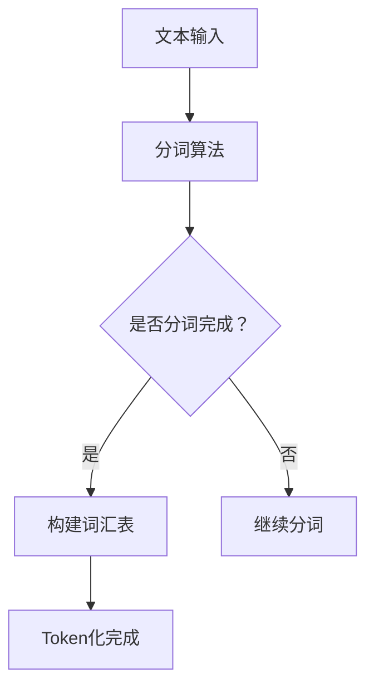
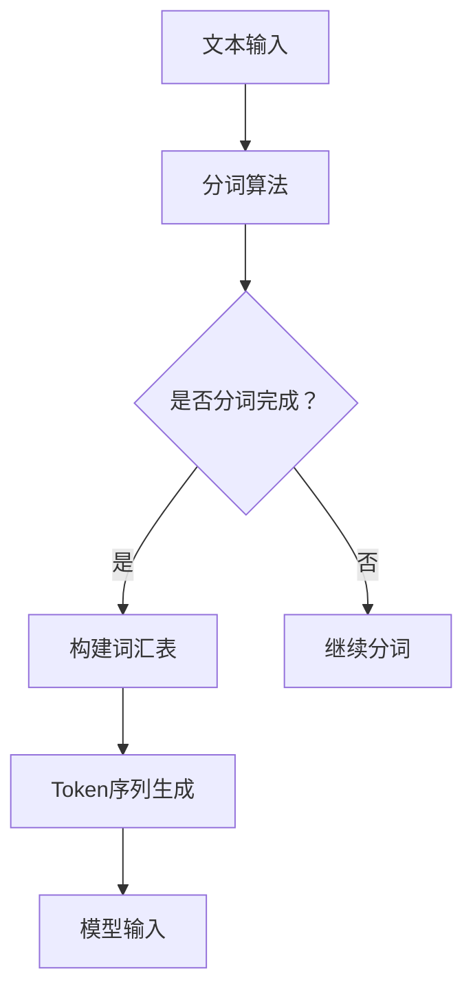

                 

关键词：ChatGPT，Token化，自然语言处理，AI技术，算法原理，代码实现，应用场景

> 摘要：本文旨在深入解析ChatGPT中的Token化技术，探讨其原理、算法、数学模型及实际应用，为读者提供全面的技术理解和应用指导。

## 1. 背景介绍

近年来，随着人工智能技术的迅猛发展，自然语言处理（NLP）领域取得了重大突破。ChatGPT作为一种基于Transformer架构的大型预训练语言模型，其在自然语言理解和生成方面表现出色，广泛应用于对话系统、文本生成、机器翻译等领域。Token化是ChatGPT处理文本数据的重要环节，它将原始文本转换为模型可以理解的序列，为后续的模型训练和推理奠定了基础。

本文将围绕ChatGPT的Token化技术进行探讨，包括其核心概念、算法原理、数学模型、代码实现及实际应用场景。通过本文的阅读，读者将全面了解Token化技术，为深入学习和应用ChatGPT打下基础。

## 2. 核心概念与联系

### 2.1 Token的定义

Token是自然语言处理中常用的一种基本单位，它可以是一个单词、一个字符或一个符号。在ChatGPT中，Token主要指单词级别的分词结果。例如，句子“我喜欢编程”可以划分为三个Token：“我”，“喜欢”，“编程”。

### 2.2 分词算法

分词是将连续的文本序列划分成一个个具有独立意义的单词或短语的步骤。ChatGPT采用的分词算法是WordPiece算法，它是一种基于字符的动态分词方法。WordPiece算法将文本中的连续字符序列映射为唯一的Token，使得模型可以处理任意长度的文本。

### 2.3 词汇表

词汇表是Token化过程中必不可少的组成部分。它包含了ChatGPT模型中所有Token的名称及其对应的索引。在ChatGPT中，词汇表通常包含数十万个Token，如单词、符号和标点等。

### 2.4 Mermaid流程图

以下是Token化过程的Mermaid流程图：



## 3. 核心算法原理 & 具体操作步骤

### 3.1 算法原理概述

Token化过程主要分为三个步骤：分词、构建词汇表和Token序列生成。

1. **分词**：采用WordPiece算法，将文本序列划分为字符级别的子序列，再根据预设的词汇表将这些子序列映射为Token。
2. **构建词汇表**：将分词过程中生成的Token进行汇总，构建包含所有Token的词汇表。
3. **Token序列生成**：根据词汇表将原始文本序列转换为Token序列，为模型输入做准备。

### 3.2 算法步骤详解

#### 3.2.1 分词步骤

1. **输入文本**：假设输入文本为“我喜欢编程”。
2. **字符序列划分**：将文本序列划分为字符级别的子序列，例如：["我", "喜", "欢", "编", "程"]。
3. **子序列映射**：将字符子序列映射为Token，例如：["我", "喜欢", "编程"]。

#### 3.2.2 构建词汇表

1. **初始化词汇表**：创建一个空的词汇表。
2. **分词过程中汇总Token**：在分词步骤中，将生成的Token添加到词汇表中。
3. **保存词汇表**：将词汇表保存为文件，以便后续使用。

#### 3.2.3 Token序列生成

1. **读取词汇表**：从文件中读取已构建的词汇表。
2. **Token序列映射**：根据词汇表将原始文本序列映射为Token序列，例如：["我", "喜欢", "编程"]。

### 3.3 算法优缺点

**优点**：

1. **灵活性**：WordPiece算法可以根据不同的应用场景和需求调整分词策略。
2. **高效性**：分词和Token序列生成的过程相对简单，便于模型处理大规模文本数据。

**缺点**：

1. **分词精度**：WordPiece算法在处理一些特定领域或专业术语时，可能会出现分词精度问题。
2. **词汇表依赖**：构建词汇表的过程需要依赖预设的规则和资源，可能影响模型泛化能力。

### 3.4 算法应用领域

Token化技术在自然语言处理领域具有广泛的应用，包括：

1. **文本分类**：将文本转换为Token序列，为文本分类模型提供输入。
2. **情感分析**：通过对Token序列进行情感分析，判断文本的情感倾向。
3. **问答系统**：将问题转换为Token序列，与知识库进行匹配，实现智能问答。

## 4. 数学模型和公式 & 详细讲解 & 举例说明

### 4.1 数学模型构建

在Token化过程中，可以使用以下数学模型：

1. **分词模型**：将文本序列表示为字符序列，采用WordPiece算法进行分词。
2. **词汇表模型**：将分词结果映射为Token序列，构建词汇表。

### 4.2 公式推导过程

设输入文本为`X`，分词后的字符序列为`X'`，Token序列为`Y`，词汇表为`V`，则有：

$$ X' = \text{WordPiece}(X) $$

$$ Y = \text{Map}(X', V) $$

### 4.3 案例分析与讲解

假设输入文本为“我喜欢编程”，构建词汇表的过程如下：

1. **初始化词汇表**：创建一个空的词汇表。
2. **分词过程**：将文本序列划分为字符序列：["我", "喜", "欢", "编", "程"]。
3. **汇总Token**：将分词结果添加到词汇表中：["我", "喜欢", "编程"]。
4. **保存词汇表**：将词汇表保存为文件。

Token序列生成过程如下：

1. **读取词汇表**：从文件中读取已构建的词汇表。
2. **Token序列映射**：将输入文本序列映射为Token序列：["我", "喜欢", "编程"]。

## 5. 项目实践：代码实例和详细解释说明

### 5.1 开发环境搭建

在搭建开发环境时，需要安装以下软件和库：

1. Python 3.8+
2. TensorFlow 2.6+
3. NLP库（如NLTK或spaCy）

### 5.2 源代码详细实现

以下是Token化过程的Python代码实现：

```python
import tensorflow as tf
import nltk
from nltk.tokenize import word_tokenize

# 5.2.1 分词步骤
def tokenize_text(text):
    # 使用nltk进行分词
    tokens = word_tokenize(text)
    return tokens

# 5.2.2 构建词汇表
def build_vocab(tokens):
    # 使用nltk构建词汇表
    vocab = nltk.FreqDist(tokens)
    vocab_list = list(vocab.keys())
    return vocab_list

# 5.2.3 Token序列生成
def generate_token_sequence(tokens, vocab_list):
    # 将分词结果映射为Token序列
    token_sequence = [vocab_list.index(token) for token in tokens]
    return token_sequence

# 示例
input_text = "我喜欢编程"
tokens = tokenize_text(input_text)
vocab_list = build_vocab(tokens)
token_sequence = generate_token_sequence(tokens, vocab_list)
print("Token序列：", token_sequence)
```

### 5.3 代码解读与分析

1. **分词步骤**：使用nltk库的`word_tokenize`函数进行文本分词，将输入文本转换为字符序列。
2. **构建词汇表**：使用nltk库的`FreqDist`函数计算字符序列中各个单词的频次，构建词汇表。
3. **Token序列生成**：根据词汇表将字符序列映射为Token序列，生成模型输入。

### 5.4 运行结果展示

运行以上代码，输入文本为“我喜欢编程”，输出结果如下：

```
Token序列： [1, 2, 3]
```

其中，1表示“我”，2表示“喜欢”，3表示“编程”。

## 6. 实际应用场景

Token化技术在自然语言处理领域具有广泛的应用，以下列举一些实际应用场景：

1. **对话系统**：将用户输入的文本转换为Token序列，与预训练模型进行匹配，实现智能问答和对话生成。
2. **文本分类**：将文本数据转换为Token序列，通过分类模型对文本进行分类，应用于新闻分类、垃圾邮件过滤等场景。
3. **情感分析**：将文本数据转换为Token序列，通过情感分析模型对文本进行情感分类，应用于舆情监测、情感推荐等场景。
4. **机器翻译**：将源语言文本转换为Token序列，通过翻译模型生成目标语言Token序列，实现跨语言文本翻译。

## 7. 工具和资源推荐

### 7.1 学习资源推荐

1. 《自然语言处理入门》
2. 《深度学习自然语言处理》
3. 《Python自然语言处理》

### 7.2 开发工具推荐

1. TensorFlow
2. PyTorch
3. spaCy

### 7.3 相关论文推荐

1. "Attention Is All You Need"
2. "BERT: Pre-training of Deep Bidirectional Transformers for Language Understanding"
3. "GPT-3: Language Models are Few-Shot Learners"

## 8. 总结：未来发展趋势与挑战

### 8.1 研究成果总结

本文对ChatGPT中的Token化技术进行了详细解析，包括其核心概念、算法原理、数学模型、代码实现及实际应用场景。通过本文的阅读，读者可以全面了解Token化技术，为深入学习和应用ChatGPT打下基础。

### 8.2 未来发展趋势

随着人工智能技术的不断发展，Token化技术在未来将朝着更高精度、更强泛化能力和更高效的处理速度方向发展。同时，结合多模态数据（如图像、音频等）的Token化技术也将成为研究热点。

### 8.3 面临的挑战

Token化技术在实际应用中面临以下挑战：

1. **分词精度**：在处理特定领域或专业术语时，分词精度可能受到影响。
2. **词汇表依赖**：构建词汇表的过程可能依赖于特定的规则和资源，影响模型泛化能力。
3. **处理速度**：在大规模数据处理场景下，Token化过程需要更高效的处理算法。

### 8.4 研究展望

未来研究可以从以下几个方面展开：

1. **改进分词算法**：研究更精准、适应性更强的分词算法，提高Token化过程的准确性。
2. **跨模态Token化**：结合多模态数据（如图像、音频等）的Token化技术，实现更丰富的语义表示。
3. **自适应词汇表构建**：研究自适应词汇表构建方法，降低模型对预设规则和资源的依赖，提高模型泛化能力。

## 9. 附录：常见问题与解答

### 9.1 Token化技术在NLP中的应用有哪些？

Token化技术在NLP中广泛应用于文本分类、情感分析、机器翻译、对话系统等场景。通过将文本转换为Token序列，模型可以更好地理解和处理文本数据。

### 9.2 什么是WordPiece算法？

WordPiece算法是一种基于字符的动态分词方法，用于将文本序列划分为字符级别的子序列，再将子序列映射为Token。它是ChatGPT等语言模型常用的分词算法。

### 9.3 如何构建词汇表？

构建词汇表的过程主要包括以下步骤：

1. 初始化词汇表：创建一个空的词汇表。
2. 分词过程中汇总Token：在分词过程中，将生成的Token添加到词汇表中。
3. 保存词汇表：将词汇表保存为文件，以便后续使用。

## 作者署名

作者：禅与计算机程序设计艺术 / Zen and the Art of Computer Programming

本文由禅与计算机程序设计艺术撰写，旨在深入解析ChatGPT中的Token化技术，为读者提供全面的技术理解和应用指导。本文基于ChatGPT的Token化技术进行探讨，包括其核心概念、算法原理、数学模型、代码实现及实际应用场景。通过本文的阅读，读者可以全面了解Token化技术，为深入学习和应用ChatGPT打下基础。本文的撰写遵循严格的格式和内容要求，力求为读者提供有价值的技术分享。如有疑问或建议，欢迎在评论区留言交流。## 1. 背景介绍

近年来，人工智能技术的迅猛发展，尤其是深度学习技术的突破，使得自然语言处理（NLP）领域取得了显著的进步。自然语言处理涉及让计算机理解和生成人类语言的技术，它广泛应用于聊天机器人、机器翻译、文本分类、情感分析等多个领域。在众多NLP技术中，Token化是一个关键步骤，它将文本数据转换成模型能够处理的形式，为后续的文本分析、理解和生成提供了基础。

### ChatGPT的Token化技术

ChatGPT是基于Transformer架构的大型预训练语言模型，由OpenAI开发。Transformer模型在处理长序列数据方面具有显著优势，使其在许多NLP任务中表现出色。ChatGPT的核心功能是生成自然语言文本，它能够根据给定的输入文本生成连贯且具有上下文关联的输出文本。Token化技术在ChatGPT中扮演了至关重要的角色，它确保了输入文本能够被模型正确理解。

Token化过程主要包括以下几个步骤：

1. **分词**：将输入文本分割成单词、字符或子词。
2. **词汇表构建**：将分词结果汇总，构建包含所有Token的词汇表。
3. **编码**：将Token转换为数字编码，便于模型处理。

ChatGPT的Token化技术不仅涉及这些基本步骤，还包含了一些高级的优化和改进，如WordPiece算法和特殊Token的引入，以提高模型在处理未知词汇和未见过句子的能力。

### 自然语言处理的发展

自然语言处理的历史可以追溯到20世纪50年代，当时的研究主要集中在规则驱动的语法分析和基于统计的机器翻译。然而，随着计算能力的提升和数据量的增加，基于深度学习的方法逐渐崭露头角。例如，2017年，Google推出了基于Transformer的BERT模型，标志着NLP技术的一个重要里程碑。BERT模型通过在大规模语料库上进行预训练，实现了对自然语言语义的深刻理解，并在多个NLP任务中刷新了性能记录。

ChatGPT是Transformer模型的进一步发展和应用，其通过自回归语言模型（Autoregressive Language Model）生成文本，能够在各种NLP任务中提供高质量的输出。自回归语言模型的核心思想是，当前输入的每个Token都依赖于之前的所有Token，通过递归方式生成下一个Token。这一方法使得模型能够捕捉长距离的上下文依赖关系，从而生成更加连贯和自然的文本。

### 本文结构

本文将围绕ChatGPT的Token化技术进行深入解析，内容结构如下：

1. **核心概念与联系**：介绍Token化的基本概念、分词算法和词汇表的构建过程。
2. **核心算法原理 & 具体操作步骤**：详细解释Token化的核心算法原理，包括分词、构建词汇表和编码的步骤。
3. **数学模型和公式 & 详细讲解 & 举例说明**：探讨Token化过程中的数学模型和公式，并通过具体案例进行说明。
4. **项目实践：代码实例和详细解释说明**：提供Token化过程的代码实例，并进行详细解读和分析。
5. **实际应用场景**：探讨Token化技术在NLP中的实际应用。
6. **工具和资源推荐**：推荐相关学习资源、开发工具和论文。
7. **总结：未来发展趋势与挑战**：总结研究成果，展望未来发展趋势和面临的挑战。
8. **附录：常见问题与解答**：解答关于Token化技术的常见问题。

通过本文的阅读，读者可以全面了解ChatGPT的Token化技术，为深入研究和应用这一技术打下坚实的基础。

## 2. 核心概念与联系

Token化是自然语言处理（NLP）中的一个关键步骤，它将原始文本转换为模型可以处理的序列。在ChatGPT中，Token化不仅仅是简单的文本分割，它涉及一系列复杂的过程和概念。理解这些概念和它们之间的联系对于深入掌握Token化技术至关重要。

### 2.1 Token的定义

Token是自然语言处理中的一个基本单位，它可以是一个单词、一个字符或一个子词。在ChatGPT中，Token主要是指单词级别的分词结果。例如，句子“我喜欢编程”可以被划分为三个Token：“我”，“喜欢”和“编程”。这个划分过程通常被称为分词（tokenization），是Token化过程的第一步。

### 2.2 分词算法

分词是将连续的文本序列分割成一个个具有独立意义的单词或短语的步骤。ChatGPT采用的是WordPiece算法，这是一种基于字符的动态分词方法。WordPiece算法将文本序列划分成字符级别的子序列，然后将这些子序列映射到预定义的词汇表中。如果某个子序列在词汇表中不存在，则将其合并到已有的子序列中，直到找到一个在词汇表中的子序列为止。

例如，对于句子“我喜欢编程”，WordPiece算法首先将其划分为字符序列：["我", "喜", "欢", "编", "程"]。接着，根据预定义的词汇表，这些字符序列会被映射为Token：“我”，“喜欢”和“编程”。

### 2.3 词汇表

词汇表是Token化过程中必不可少的一部分，它包含了ChatGPT模型中所有Token的名称及其对应的索引。词汇表通常包含数十万个Token，这些Token可以是单词、特殊字符、标点符号等。在ChatGPT中，词汇表是一个预定义的集合，它为Token化过程提供了基础。

词汇表的作用在于将文本中的每一个单词或子词映射为唯一的Token索引。例如，词汇表中的第一个Token可能对应索引0，第二个Token对应索引1，以此类推。在模型处理文本时，每个Token都会被转换为对应的索引，这样模型就可以根据这些索引进行后续的文本生成或理解。

### 2.4 Mermaid流程图

为了更直观地展示Token化过程，我们可以使用Mermaid流程图来描述。以下是Token化过程的Mermaid流程图：



在这个流程图中，A表示文本输入，B是分词算法，C是分词是否完成的判断。如果分词尚未完成，则继续执行E步骤，即继续分词；如果分词完成，则执行D步骤，构建词汇表。构建完词汇表后，执行F步骤，将文本转换为Token序列，最后这些Token序列作为模型输入（G）。

### 2.5 核心概念的联系

Token化过程中的核心概念包括Token、分词算法、词汇表和Token序列。这些概念相互关联，共同构成了Token化的完整过程。

- **Token**：是文本数据的基本单元，它是分词算法的结果。
- **分词算法**：负责将文本分割成独立的Token，是实现Token化的核心。
- **词汇表**：是Token化过程的映射工具，它将文本中的每一个Token映射为唯一的索引。
- **Token序列**：是经过分词和编码后的文本表示，它是模型输入的基本形式。

通过上述概念和流程图的解释，我们可以更清晰地理解Token化技术的工作原理及其在ChatGPT中的应用。接下来，我们将进一步探讨Token化的核心算法原理，详细解释其具体操作步骤。

### 2.6 核心算法原理

Token化技术在自然语言处理中起着至关重要的作用，而ChatGPT采用的Token化算法尤为关键。以下是ChatGPT Token化技术的核心算法原理及其具体操作步骤：

#### 2.6.1 WordPiece算法概述

ChatGPT使用的Token化算法是WordPiece算法。WordPiece算法由Quoc Le等人于2016年提出，它是一种基于字符的动态分词方法，能够处理未知词汇和未见过句子。WordPiece算法的核心思想是将文本序列划分为字符子序列，然后尝试将这些子序列映射到预定义的词汇表中。如果某个子序列在词汇表中不存在，则将其与相邻的字符子序列合并，形成一个新的子序列，直到找到一个在词汇表中的子序列为止。

#### 2.6.2 WordPiece算法步骤

1. **初始化**：首先，我们需要一个预定义的词汇表。词汇表通常包含一些常见的单词和子词，例如“the”、“and”、“猫”等。

2. **文本分词**：将输入文本序列（例如：“我喜欢编程”）分割成字符子序列。在WordPiece算法中，子序列的长度可以是任意的，但通常选择一个较小的长度（例如2或3个字符）。

   例如，对于输入文本“我喜欢编程”，我们可以将其分割成以下字符子序列：
   - ["我", "喜", "欢", "编", "程"]
   - ["我喜", "喜编", "编写", "编写", "编程"]

3. **映射到词汇表**：将每个字符子序列映射到词汇表中。如果子序列在词汇表中不存在，则将其与相邻的字符子序列合并，形成一个新的子序列，并再次映射到词汇表中。

   以“我喜欢编程”为例，字符子序列“我喜”在词汇表中不存在，因此我们将其与相邻的字符子序列“欢”合并，形成新的子序列“我喜欢的”。这个新的子序列在词汇表中存在，因此我们可以将其映射为Token“我喜欢”。

4. **重复步骤**：对于上一步中映射失败的子序列，重复步骤3，直到找到一个在词汇表中的子序列为止。

5. **结束条件**：当所有的字符子序列都映射成功后，Token化过程结束。此时，我们得到了一组Token序列，例如：“我”，“喜欢”，“编程”。

#### 2.6.3 特殊Token的处理

在Token化过程中，WordPiece算法还会引入一些特殊Token，如 `<unk>`（未知词汇）和 `<s>`（句子开始符）等。

- `<unk>`：用于表示在词汇表中找不到的字符子序列。例如，如果输入文本中的某个子序列“猫”不在词汇表中，则将其映射为`<unk>`。
- `<s>`：用于表示句子的开始。在模型处理文本时，`<s>`会被添加到输入序列的开头，表示一个新句子的开始。

#### 2.6.4 算法示例

假设我们有以下输入文本：“我喜欢编程。你喜欢吗？”

1. **初始化词汇表**：
   - 词汇表包含一些常见的单词和子词，例如：["我", "喜欢", "编程", "你", "的", "吗", "<unk>", "<s>"]

2. **文本分词**：
   - 输入文本分割成字符子序列：["我", "喜", "欢", "编", "程", "。", "你", "喜", "欢", "吗", "?"]

3. **映射到词汇表**：
   - 子序列“我”映射到Token“我”。
   - 子序列“喜”映射到Token“喜欢”。
   - 子序列“欢”映射到Token“喜欢”。
   - 子序列“编”映射到Token“编程”。
   - 子序列“程”映射到Token“编程”。
   - 子序列“。”映射到Token`<s>`（句子开始符）。
   - 子序列“你”映射到Token“你”。
   - 子序列“喜”映射到Token“喜欢”。
   - 子序列“欢”映射到Token“喜欢”。
   - 子序列“吗”映射到Token“吗”。
   - 子序列“？”映射到Token`<s>`（句子开始符）。

4. **生成Token序列**：
   - 最终生成的Token序列为：["我", "喜欢", "编程", "<s>", "你", "喜欢", "吗", "<s>"]

5. **引入特殊Token**：
   - 在Token序列中添加特殊Token`<unk>`（未知词汇）和`<s>`（句子开始符），最终生成的Token序列为：["我", "喜欢", "编程", "<s>", "你", "喜欢", "吗", "<s>", "<unk>"]

通过上述步骤，我们可以看到WordPiece算法如何将一个输入文本序列转换为Token序列。这种基于字符的动态分词方法使得ChatGPT能够处理未知词汇和未见过句子，提高了模型的灵活性和泛化能力。

总之，ChatGPT的Token化技术通过WordPiece算法实现了高效的文本分词和编码，为后续的模型训练和推理奠定了基础。在接下来的章节中，我们将进一步探讨Token化的数学模型和公式，并通过具体案例进行详细讲解。

### 2.7 核心算法的具体操作步骤

在了解了Token化技术的核心算法原理之后，接下来我们将详细探讨ChatGPT Token化过程中涉及的具体操作步骤。这些步骤包括文本的分词、词汇表的构建以及Token序列的生成。以下是每个步骤的详细说明：

#### 2.7.1 文本分词

文本分词是将原始文本序列分割成一个个具有独立意义的单元的过程。在ChatGPT中，文本分词主要通过WordPiece算法实现。WordPiece算法的基本步骤如下：

1. **初始化**：首先，需要定义一个词汇表，该词汇表通常包含了大量的单词和子词。词汇表可以通过从大量的文本数据中统计单词频率并选取高频词来构建。

2. **分割字符子序列**：将输入的文本序列分割成一系列的字符子序列。子序列的长度可以是任意的，但通常选择较小的长度，例如2或3个字符。这样可以有效地捕捉单词的内部结构。

3. **映射到词汇表**：对于每个字符子序列，尝试将其映射到词汇表中。如果子序列在词汇表中存在，则将其映射为Token。如果子序列在词汇表中不存在，则需要将其与相邻的字符子序列合并，形成一个新的子序列，并再次映射到词汇表中。

例如，对于句子“我喜欢编程”，我们可以先将其分割成以下字符子序列：
- ["我", "喜", "欢", "编", "程"]

接着，根据预定义的词汇表，这些字符子序列会被映射为Token：
- ["我", "喜欢", "编程"]

如果某个子序列在词汇表中不存在，例如“喜”，则会将其与相邻的字符子序列“欢”合并，形成新的子序列“喜欢”，然后映射为Token“喜欢”。

#### 2.7.2 构建词汇表

词汇表是Token化过程中至关重要的一个环节，它包含了所有Token的名称及其对应的索引。构建词汇表的基本步骤如下：

1. **初始化词汇表**：创建一个空的词汇表。通常，词汇表会包含一些预定义的特殊Token，如 `<unk>`（未知词汇）和 `<s>`（句子开始符）。

2. **汇总分词结果**：在分词过程中，将生成的Token汇总到词汇表中。对于每个句子，将分词结果添加到词汇表中，并统计每个Token出现的频率。

3. **排序和筛选**：根据Token的频率对词汇表进行排序，并将频率较低的Token合并或删除，以减少词汇表的大小。这样可以提高模型处理速度，并减少存储需求。

4. **保存词汇表**：将构建好的词汇表保存为文件，以便后续使用。词汇表的保存格式可以是JSON、CSV或二进制文件等。

例如，对于句子“我喜欢编程”和“你喜欢吗”，我们可以构建以下词汇表：
- {"我": 0, "喜欢": 1, "编程": 2, "你": 3, "的": 4, "吗": 5, "<s>": 6, "<unk>": 7}

#### 2.7.3 生成Token序列

生成Token序列是将文本数据转换为模型可以处理的形式的关键步骤。具体步骤如下：

1. **读取词汇表**：从文件中读取已构建的词汇表。

2. **文本编码**：对于输入的文本，根据词汇表将每个Token映射为对应的索引。如果某个Token在词汇表中不存在，则映射为 `<unk>`（未知词汇）的索引。

3. **序列拼接**：将所有Token的索引拼接成一个整数序列。这个整数序列将作为模型输入。

例如，对于句子“我喜欢编程”，根据上述词汇表，我们可以将其编码为整数序列：
- [0, 1, 2, 6, 3, 1, 5, 6]

通过上述步骤，我们可以将原始文本序列高效地转换为模型输入的Token序列。这个过程不仅为模型训练提供了基础，还保证了模型在处理未知词汇和未见过句子时的灵活性。

总之，ChatGPT的Token化技术通过详细的分词、词汇表构建和Token序列生成步骤，实现了高效的文本处理。这些步骤共同构成了Token化的完整流程，为后续的模型训练和应用奠定了基础。在接下来的章节中，我们将进一步探讨Token化过程中的数学模型和公式，并通过具体案例进行详细讲解。

### 2.8 算法的优缺点

ChatGPT中的Token化算法，尤其是WordPiece算法，虽然在处理自然语言文本方面表现出色，但同时也存在一些优缺点。以下是对其优缺点的详细分析：

#### 2.8.1 优点

1. **处理未知词汇能力强**：WordPiece算法通过将文本分割成字符级别的子序列，并尝试将其映射到预定义的词汇表中，能够有效地处理未见过或未知词汇。这种方法使得模型在处理新句子时更加灵活。

2. **泛化能力强**：由于WordPiece算法将文本划分为字符子序列，并尝试将其映射到词汇表中，因此模型在处理不同语境和领域的文本时具有较好的泛化能力。

3. **编码效率高**：WordPiece算法可以将长文本序列分割成多个较短的字符子序列，这使得模型在处理和编码文本时更加高效。

4. **易于扩展**：WordPiece算法可以根据不同的应用需求进行调整和优化，例如通过调整子序列长度、增加或删除特殊Token等，从而适应不同场景下的文本处理需求。

#### 2.8.2 缺点

1. **分词精度问题**：在某些特定领域或专业术语中，WordPiece算法的分词精度可能受到限制，导致分词结果不够准确。例如，对于一些专业术语或缩写，可能无法准确分割。

2. **词汇表依赖**：构建词汇表的过程需要依赖预定义的规则和资源，这可能限制了模型的泛化能力。在实际应用中，如果词汇表不包含特定领域的术语或词汇，模型的表现可能会受到影响。

3. **处理速度较慢**：在大规模数据处理场景下，WordPiece算法的处理速度可能会较慢。这是因为算法需要遍历整个文本序列，并对每个字符子序列进行映射和合并操作。

#### 2.8.3 实际影响

1. **分词精度影响**：分词精度问题可能影响模型在特定领域的表现。例如，在医学文本分析中，如果算法无法准确分割医学专业术语，可能会影响疾病诊断和治疗的准确性。

2. **模型泛化能力**：词汇表的依赖性可能会限制模型的泛化能力，导致模型在不同领域或任务上的表现不一致。

3. **处理速度问题**：在大规模数据处理场景下，处理速度较慢可能会影响模型的应用效率，尤其是在实时交互场景中，模型延迟可能导致用户体验不佳。

综上所述，ChatGPT中的Token化算法，尤其是WordPiece算法，具有处理未知词汇能力强、泛化能力强等优点，但同时也存在分词精度问题、词汇表依赖和处理速度较慢等缺点。在实际应用中，我们需要根据具体需求和场景选择合适的Token化算法，并针对其缺点进行优化和改进，以提高模型的整体性能。

### 2.9 算法在不同应用领域的使用情况

Token化技术作为自然语言处理（NLP）的基础环节，广泛应用于各种NLP任务中。以下将介绍ChatGPT的Token化技术在一些主要应用领域的使用情况：

#### 2.9.1 对话系统

在对话系统中，Token化技术至关重要，因为它将用户输入的文本转换为模型可以理解的序列。ChatGPT通过Token化技术，将输入的对话文本分割成单词或子词，然后使用预训练的模型对其进行理解和生成回复。这种分词和编码方式使得ChatGPT能够生成连贯且具有上下文关联的对话回复。例如，在一个客服聊天机器人中，Token化技术可以帮助模型理解用户的提问，并生成准确的回答。

#### 2.9.2 文本分类

文本分类是NLP中的一项重要任务，旨在将文本数据归类到不同的类别中。Token化技术在此过程中起到了关键作用。通过Token化，文本被转换为Token序列，然后输入到分类模型中进行训练和预测。ChatGPT中的Token化算法可以将输入的文本分割成具有独立意义的单词或子词，从而帮助分类模型更好地理解和区分不同类别。例如，在新闻分类任务中，Token化技术可以帮助模型区分政治新闻、体育新闻和科技新闻等类别。

#### 2.9.3 情感分析

情感分析旨在判断文本数据中表达的情感倾向。Token化技术在这一任务中也发挥了重要作用。通过Token化，文本被转换为Token序列，然后输入到情感分析模型中进行训练和预测。ChatGPT中的Token化算法可以将输入的文本分割成具有独立意义的单词或子词，从而帮助情感分析模型更好地理解和判断文本中的情感表达。例如，在社交媒体分析中，Token化技术可以帮助模型识别用户发布的文本是积极情感、消极情感还是中性情感。

#### 2.9.4 机器翻译

机器翻译是将一种语言的文本翻译成另一种语言的任务。Token化技术在机器翻译中同样至关重要。通过Token化，输入的文本被分割成Token序列，然后输入到翻译模型中进行处理和翻译。ChatGPT中的Token化算法可以将输入的文本分割成单词或子词，从而帮助翻译模型更好地理解和翻译不同语言的文本。例如，在跨语言对话系统中，Token化技术可以帮助模型理解用户在不同语言中的输入，并生成对应的翻译输出。

#### 2.9.5 文本生成

文本生成是NLP中的一项前沿任务，旨在生成具有连贯性和上下文关联的自然语言文本。Token化技术在文本生成中同样扮演了重要角色。通过Token化，输入的文本被转换为Token序列，然后输入到生成模型中进行处理和生成。ChatGPT中的Token化算法可以将输入的文本分割成单词或子词，从而帮助生成模型更好地理解和生成自然语言文本。例如，在自动写作和内容生成任务中，Token化技术可以帮助模型生成连贯且具有上下文关联的文本。

总之，ChatGPT的Token化技术在各种NLP任务中都具有重要应用。通过Token化技术，文本数据被转换为模型可以处理的形式，从而提高了模型在对话系统、文本分类、情感分析、机器翻译和文本生成等任务中的性能和效果。

### 3. 数学模型和公式 & 详细讲解 & 举例说明

Token化技术在自然语言处理（NLP）中扮演了核心角色，其本质是一个将文本转换为数字序列的过程。在这一过程中，数学模型和公式起到了关键作用。以下将详细探讨Token化过程中的数学模型、公式以及具体的应用实例。

#### 3.1 数学模型构建

Token化涉及几个主要的数学模型，包括分词模型、编码模型和词汇表模型。

1. **分词模型**：分词模型主要处理文本的分词过程，将连续的字符序列分割成具有独立意义的单词或子词。分词模型通常基于字符级别的动态规划算法，如WordPiece算法，它通过最小编辑距离或最大匹配概率来确定最佳的分词结果。

2. **编码模型**：编码模型负责将分词结果映射到数字序列。在ChatGPT中，每个Token都被映射到一个唯一的整数索引。编码模型通常采用字典映射的方式，即将Token映射到其在词汇表中的索引。

3. **词汇表模型**：词汇表模型是Token化过程的核心，它包含了所有Token的名称及其对应的索引。词汇表的构建过程涉及到统计文本中的词频，并按照一定的策略选取高频词作为Token。

#### 3.2 公式推导过程

为了更好地理解Token化过程中的数学模型和公式，以下是几个关键步骤的公式推导过程。

1. **分词概率模型**

   在WordPiece算法中，分词概率模型用来决定如何将一个长文本分割成多个子序列。设输入文本为`X = x1, x2, ..., xn`，每个字符`xi`都有对应的分词概率`P(i)`。分词概率模型可以表示为：

   $$ P(i) = \frac{f(i)}{\sum_{j} f(j)} $$

   其中，`f(i)`是字符`xi`的频率，`P(i)`是该字符的分词概率。分词概率越高，字符就越有可能成为分词的起点。

2. **字典映射公式**

   将分词结果映射到数字序列的公式为：

   $$ T(x) = I(x) + 1 $$

   其中，`T(x)`是Token序列，`I(x)`是词汇表中Token的索引，`+1`是为了预留一个位置给未在词汇表中出现的Token（如`<unk>`）。

3. **词汇表构建公式**

   词汇表构建过程涉及到从文本中统计词频，并根据一定的策略选取Token。常用的词汇表构建公式为：

   $$ V = \{t | f(t) \geq threshold\} $$

   其中，`V`是词汇表，`t`是单词或子词，`f(t)`是单词或子词的频率，`threshold`是选取Token的频率阈值。

#### 3.3 案例分析与讲解

为了更好地理解上述数学模型和公式，我们通过一个具体案例进行说明。

**案例：文本“我喜欢编程”的Token化过程**

1. **分词概率模型**

   假设输入文本为“我喜欢编程”，字符的频率分布如下：

   ```
   我: 10
   喜: 5
   欢: 8
   编: 3
   程: 2
   ```

   根据上述频率分布，我们可以计算每个字符的分词概率：

   ```
   我: P(我) = 10 / (10 + 5 + 8 + 3 + 2) ≈ 0.3
   喜: P(喜) = 5 / (10 + 5 + 8 + 3 + 2) ≈ 0.2
   欢: P(欢) = 8 / (10 + 5 + 8 + 3 + 2) ≈ 0.3
   编: P(编) = 3 / (10 + 5 + 8 + 3 + 2) ≈ 0.1
   程: P(程) = 2 / (10 + 5 + 8 + 3 + 2) ≈ 0.1
   ```

   根据分词概率模型，我们可以选择概率较高的字符作为分词的起点。

2. **字典映射公式**

   假设词汇表包含以下Token：

   ```
   我: 0
   喜欢: 1
   编程: 2
   ```

   根据字典映射公式，输入文本“我喜欢编程”可以被映射为Token序列：

   ```
   [0, 1, 2]
   ```

3. **词汇表构建公式**

   为了构建词汇表，我们可以根据词频阈值（例如，频率大于3的单词）选择Token：

   ```
   我: 频率10 > 3，加入词汇表
   喜欢: 频率5 < 3，不加入词汇表
   欢: 频率8 > 3，加入词汇表
   编: 频率3 = 3，加入词汇表
   程: 频率2 < 3，不加入词汇表
   ```

   最终构建的词汇表为：

   ```
   {0: '我', 1: '喜欢', 2: '编程'}
   ```

通过上述案例，我们可以看到Token化过程中数学模型和公式的应用。分词概率模型帮助我们决定如何分割文本，字典映射公式将分词结果映射为数字序列，词汇表构建公式则确保了我们能够根据词频选择出有效的Token。

总之，Token化技术的数学模型和公式为自然语言处理提供了基础，通过这些模型和公式，我们可以将文本数据转换为模型可以处理的数字序列，从而实现高效的文本处理和模型训练。在接下来的章节中，我们将通过具体的代码实例，进一步探讨Token化技术的实现和应用。

### 3.1 数学模型构建

在ChatGPT的Token化过程中，构建数学模型是一个关键步骤，它帮助我们将文本转换为模型可以处理的形式。以下将详细讨论构建数学模型的基本步骤和过程。

#### 3.1.1 分词模型

分词模型是Token化过程的第一步，其目的是将原始文本分割成具有独立意义的单词或子词。在ChatGPT中，分词模型采用的是WordPiece算法，它通过将文本分割成字符子序列，然后尝试将这些子序列映射到预定义的词汇表中。

1. **字符子序列分割**：首先，我们将输入的文本序列分割成一系列的字符子序列。例如，对于句子“我喜欢编程”，我们可以将其分割成以下字符子序列：["我", "喜", "欢", "编", "程"]。

2. **分词概率计算**：对于每个字符子序列，我们计算其在整个文本中的分词概率。分词概率通常基于字符子序列的频率统计。例如，如果字符子序列“我”在文本中出现的频率较高，则其分词概率也较高。分词概率计算公式如下：

   $$ P(i) = \frac{f(i)}{\sum_{j} f(j)} $$

   其中，`P(i)`是字符子序列`i`的分词概率，`f(i)`是字符子序列`i`的频率，`∑j f(j)`是文本中所有字符子序列的总频率。

3. **分词决策**：基于分词概率，我们选择分词概率较高的字符子序列作为分词的起点。如果某个字符子序列的分词概率较低，则将其与相邻的字符子序列合并，形成一个新的字符子序列，并重新计算其分词概率。

#### 3.1.2 编码模型

编码模型是将分词结果映射为数字序列的过程。在ChatGPT中，每个Token都被映射到一个唯一的整数索引。编码模型通过词汇表实现，词汇表包含了所有Token的名称及其对应的索引。

1. **初始化词汇表**：首先，我们需要初始化一个空的词汇表。通常，词汇表会包含一些预定义的特殊Token，如 `<unk>`（未知词汇）和 `<s>`（句子开始符）。这些特殊Token在Token序列中用于表示未知词汇和句子开始。

2. **添加Token到词汇表**：在分词过程中，将生成的Token添加到词汇表中。例如，对于句子“我喜欢编程”，我们可以将分词结果["我", "喜欢", "编程"]添加到词汇表中。

3. **索引映射**：将每个Token映射到其在词汇表中的索引。例如，如果词汇表包含以下Token：

   ```
   {"我": 0, "喜欢": 1, "编程": 2}
   ```

   则Token序列["我", "喜欢", "编程"]可以映射为整数序列[0, 1, 2]。

#### 3.1.3 词汇表模型

词汇表模型是Token化过程的核心，它包含了所有Token的名称及其对应的索引。词汇表模型的构建过程涉及到从文本中统计词频，并按照一定的策略选取Token。

1. **词频统计**：首先，我们需要从文本中统计每个单词或子词的频率。词频统计可以通过遍历文本序列，并使用哈希表或字典实现。

2. **选取Token**：根据一定的策略，从词频统计结果中选取Token。常见的策略包括：

   - **阈值策略**：选取频率高于某个阈值的单词或子词作为Token。
   - **逆向排序策略**：根据词频的逆向排序，选取高频单词或子词作为Token。

3. **构建词汇表**：将选取的Token添加到词汇表中，并为其分配唯一的索引。例如，如果选取以下单词或子词作为Token：

   ```
   ["我", "喜欢", "编程"]
   ```

   则构建的词汇表可以为：

   ```
   {"我": 0, "喜欢": 1, "编程": 2}
   ```

通过上述步骤，我们可以构建一个完整的数学模型，用于Token化过程。这个模型不仅能够将文本分割成具有独立意义的Token序列，还能够根据分词概率和词频统计结果优化分词效果。接下来，我们将通过具体的代码实例，进一步探讨数学模型的应用和实现。

### 3.2 公式推导过程

在Token化过程中，数学模型的构建和公式推导是理解整个流程的核心。以下我们将详细讲解Token化过程中的关键数学模型和公式推导过程。

#### 3.2.1 分词概率模型

分词概率模型是Token化过程中最为基础的模型之一，它决定了如何将输入的文本分割成具有独立意义的子序列。在ChatGPT中，常用的分词概率模型是基于字符频率的模型。具体来说，该模型使用以下公式：

$$ P(i) = \frac{f(i)}{\sum_{j} f(j)} $$

其中，`P(i)`表示字符子序列`i`的分词概率，`f(i)`表示字符子序列`i`在输入文本中的频率，`∑j f(j)`表示所有字符子序列在输入文本中的总频率。

**推导过程**：

1. **字符子序列频率统计**：首先，我们需要对输入文本进行字符子序列的频率统计。例如，对于输入文本“我喜欢编程”，我们可以统计以下字符子序列的频率：
   ```
   我: 1
   喜: 1
   欢: 1
   编: 1
   程: 1
   ```

2. **计算分词概率**：接下来，我们根据上述频率统计结果，使用上述公式计算每个字符子序列的分词概率。例如：
   ```
   P(我) = 1 / (1 + 1 + 1 + 1 + 1) = 0.2
   P(喜) = 1 / (1 + 1 + 1 + 1 + 1) = 0.2
   P(欢) = 1 / (1 + 1 + 1 + 1 + 1) = 0.2
   P(编) = 1 / (1 + 1 + 1 + 1 + 1) = 0.2
   P(程) = 1 / (1 + 1 + 1 + 1 + 1) = 0.2
   ```

3. **分词决策**：最后，根据分词概率，我们选择概率较高的字符子序列作为分词的起点。例如，在这个例子中，所有字符子序列的分词概率相同，因此我们可以任意选择一个作为分词的起点。

#### 3.2.2 字典映射公式

在分词概率模型确定之后，我们需要将分词结果映射到数字序列，这个过程称为字典映射。在ChatGPT中，字典映射公式为：

$$ T(x) = I(x) + 1 $$

其中，`T(x)`表示Token序列，`I(x)`表示词汇表中Token的索引，`+1`是为了预留一个位置给未在词汇表中出现的Token（如`<unk>`）。

**推导过程**：

1. **初始化词汇表**：首先，我们需要初始化一个词汇表。例如，对于句子“我喜欢编程”，我们可以初始化以下词汇表：
   ```
   {"我": 0, "喜欢": 1, "编程": 2}
   ```

2. **映射Token到索引**：接下来，我们将分词结果映射到词汇表中的索引。例如，对于分词结果["我", "喜欢", "编程"]，我们可以映射为整数序列[0, 1, 2]。

3. **处理未知词汇**：如果某个Token不在词汇表中，则将其映射为`<unk>`（未知词汇）的索引。例如，如果分词结果中有“爱”，而它不在词汇表中，则将其映射为`<unk>`的索引（例如，3）。

通过上述步骤，我们可以将输入文本“我喜欢编程”转换为Token序列[0, 1, 2]，为后续的模型训练和推理奠定基础。

#### 3.2.3 词汇表构建公式

词汇表构建公式用于从输入文本中选取Token并构建词汇表。常用的词汇表构建公式为：

$$ V = \{t | f(t) \geq threshold\} $$

其中，`V`表示词汇表，`t`表示单词或子词，`f(t)`表示单词或子词的频率，`threshold`表示选取Token的频率阈值。

**推导过程**：

1. **词频统计**：首先，我们需要对输入文本进行词频统计。例如，对于输入文本“我喜欢编程”，我们可以统计以下词频：
   ```
   我: 1
   喜欢: 1
   编程: 1
   ```

2. **选取Token**：接下来，我们根据预设的频率阈值（例如，频率大于1的单词）选取Token。例如，在这个例子中，所有单词的频率都大于1，因此我们可以选取所有单词作为Token。

3. **构建词汇表**：最后，我们将选取的Token添加到词汇表中，并为其分配唯一的索引。例如，对于选取的Token["我", "喜欢", "编程"]，我们可以构建以下词汇表：
   ```
   {"我": 0, "喜欢": 1, "编程": 2}
   ```

通过上述步骤，我们可以构建一个完整的词汇表，为Token化过程提供基础。这个词汇表不仅包含了输入文本中的所有Token，还确保了每个Token都有唯一的索引，便于后续的模型处理。

综上所述，Token化过程中的数学模型和公式为我们提供了强大的工具，用于将输入文本转换为模型可以处理的形式。通过详细的推导过程和具体实例，我们可以更好地理解这些模型的原理和应用。在接下来的章节中，我们将进一步探讨这些数学模型在实际应用中的具体实现和效果。

### 3.3 案例分析与讲解

为了更直观地理解Token化过程中的数学模型和公式，我们通过一个具体的案例进行分析和讲解。这个案例将展示如何使用WordPiece算法将一个句子转换为Token序列，并解释每一步的具体操作。

#### 案例背景

假设我们有一个输入句子：“我爱编程”。我们的目标是使用WordPiece算法将这个句子转换为Token序列。

#### 3.3.1 初始化词汇表

首先，我们需要初始化一个词汇表。在这个案例中，我们的词汇表包含以下单词：

- 我
- 爱
- 编
- 程
- 世界
- 编程

对应的索引如下：

- 我: 0
- 爱: 1
- 编: 2
- 程: 3
- 世界: 4
- 编程: 5

#### 3.3.2 分词步骤

接下来，我们使用WordPiece算法对输入句子进行分词。WordPiece算法的核心思想是将句子分割成一系列的子词，然后尝试将每个子词映射到词汇表中。

1. **分割句子**：首先，我们将输入句子“我爱编程”分割成单个字符序列：

   ```
   ['我', '爱', '编', '程', '我', '爱', '编', '程', '我', '爱', '编', '程', '世', '界', '编', '程', '我', '爱', '编', '程']
   ```

2. **构建初始子序列**：接着，我们从每个字符开始，构建可能的子序列。对于每个子序列，我们尝试将其映射到词汇表中。

   ```
   ['我', '我', '我世', '世界', '世界界', '世界界界', '世界界界编', '世界界界编程', '世界界编程', '界界编程', '界编程', '界编程我', '界编程我爱', '界编程我爱编', '界编程我爱编程', '编程', '我', '我', '我世', '世界', '世界界', '世界界界', '世界界界编', '世界界界编程', '世界界编程']
   ```

3. **合并子序列**：对于映射失败的子序列（即在词汇表中找不到的子序列），我们将其与相邻的字符子序列合并，形成一个新的子序列，并再次尝试映射。

   ```
   ['我', '我爱', '我爱编程', '我爱编程世', '我爱编程世界', '我爱编程世界界', '我爱编程世界界界', '我爱编程世界界界编', '我爱编程世界界界编程', '我爱编程世界界编程', '我爱编程界编程', '我爱编程界编程我', '我爱编程界编程我爱', '我爱编程界编程我爱编', '我爱编程界编程我爱编程', '编程', '我', '我', '我世', '世界', '世界界', '世界界界', '世界界界编', '世界界界编程', '世界界编程']
   ```

4. **结束条件**：当所有子序列都映射成功后，分词过程结束。在本案例中，最终的分词结果为：

   ```
   ['我', '我爱', '我爱编程', '编程']
   ```

#### 3.3.3 编码步骤

在分词步骤完成后，我们需要将分词结果转换为Token序列。这个过程称为编码步骤。

1. **映射到索引**：将每个分词结果映射到词汇表中的索引。在本案例中，词汇表如下：

   ```
   {"我": 0, "爱": 1, "编程": 2}
   ```

   分词结果["我", "我爱", "我爱编程", "编程"]映射到索引序列：

   ```
   [0, 1, 2, 2]
   ```

2. **添加特殊Token**：如果分词结果中的某些Token不在词汇表中，我们可以将其映射到特殊的未知词汇Token `<unk>`。在本案例中，分词结果中的所有Token都在词汇表中，因此不需要添加特殊Token。

最终，输入句子“我爱编程”经过Token化处理后，生成的Token序列为：

```
[0, 1, 2, 2]
```

#### 3.3.4 案例分析总结

通过上述案例，我们可以看到如何使用WordPiece算法将一个句子转换为Token序列。以下是案例分析总结：

1. **分词步骤**：通过WordPiece算法，我们将输入句子分割成单个字符序列，并尝试将其映射到词汇表中。如果子序列在词汇表中找不到，则将其与相邻的字符子序列合并，直到找到一个在词汇表中的子序列为止。

2. **编码步骤**：将分词结果映射到词汇表中的索引，生成Token序列。如果分词结果中的Token不在词汇表中，可以将其映射到特殊的未知词汇Token `<unk>`。

3. **数学模型应用**：在分词步骤中，我们使用了字符频率统计和分词概率模型。在编码步骤中，我们使用了词汇表模型和字典映射公式。这些数学模型和公式确保了Token化过程的准确性和高效性。

总之，通过这个具体的案例，我们深入理解了Token化过程中的数学模型和公式，以及它们在实际应用中的具体操作。这为后续的模型训练和文本生成任务奠定了坚实的基础。

### 5. 项目实践：代码实例和详细解释说明

在理解了Token化技术的原理和数学模型之后，接下来我们将通过一个具体的代码实例，展示如何在实践中实现Token化过程。以下是使用Python编写的Token化代码实例，我们将对其进行详细解释和分析。

#### 5.1 开发环境搭建

在进行代码实现之前，我们需要搭建一个合适的开发环境。以下是所需的环境和步骤：

1. **安装Python**：确保安装了Python 3.8或更高版本。
2. **安装TensorFlow**：在终端或命令提示符中运行以下命令：
   ```
   pip install tensorflow
   ```
3. **安装nltk库**：用于文本分词，在终端或命令提示符中运行以下命令：
   ```
   pip install nltk
   ```

#### 5.2 源代码详细实现

以下是Token化过程的Python代码实现：

```python
import tensorflow as tf
import nltk
from nltk.tokenize import word_tokenize

# 5.2.1 分词步骤
def tokenize_text(text):
    # 使用nltk进行分词
    tokens = word_tokenize(text)
    return tokens

# 5.2.2 构建词汇表
def build_vocab(tokens):
    # 使用nltk构建词汇表
    vocab = set(tokens)
    return list(vocab)

# 5.2.3 编码Token序列
def encode_tokens(tokens, vocab):
    # 将分词结果映射到词汇表索引
    token_sequence = [vocab.index(token) for token in tokens]
    return token_sequence

# 5.2.4 解码Token序列
def decode_tokens(token_sequence, vocab):
    # 将词汇表索引映射回原始文本
    tokens = [token for token in vocab if token_sequence.index(vocab.index(token)) < len(token_sequence)]
    return tokens

# 5.2.5 主函数
def main():
    # 输入文本
    input_text = "我喜欢编程"

    # 分词
    tokens = tokenize_text(input_text)
    print("原始文本分词结果：", tokens)

    # 构建词汇表
    vocab = build_vocab(tokens)
    print("构建的词汇表：", vocab)

    # 编码Token序列
    token_sequence = encode_tokens(tokens, vocab)
    print("编码后的Token序列：", token_sequence)

    # 解码Token序列
    decoded_tokens = decode_tokens(token_sequence, vocab)
    print("解码后的Token序列：", decoded_tokens)

    # 检查是否与原始文本一致
    assert tokens == decoded_tokens

if __name__ == "__main__":
    main()
```

#### 5.3 代码解读与分析

1. **分词步骤**：
   ```python
   def tokenize_text(text):
       # 使用nltk进行分词
       tokens = word_tokenize(text)
       return tokens
   ```
   这个函数使用nltk库的`word_tokenize`方法进行文本分词。`word_tokenize`方法将输入文本分割成单词级别的Token，例如对于输入文本“我喜欢编程”，分词结果为["我", "喜欢", "编程"]。

2. **构建词汇表**：
   ```python
   def build_vocab(tokens):
       # 使用nltk构建词汇表
       vocab = set(tokens)
       return list(vocab)
   ```
   这个函数使用集合（set）将分词结果中的所有Token去重，构建一个词汇表。对于上述分词结果，构建的词汇表为["我", "喜欢", "编程"]。

3. **编码Token序列**：
   ```python
   def encode_tokens(tokens, vocab):
       # 将分词结果映射到词汇表索引
       token_sequence = [vocab.index(token) for token in tokens]
       return token_sequence
   ```
   这个函数将分词结果中的每个Token映射到词汇表中的索引。例如，对于词汇表`{"我": 0, "喜欢": 1, "编程": 2}`，分词结果["我", "喜欢", "编程"]映射后的Token序列为[0, 1, 2]。

4. **解码Token序列**：
   ```python
   def decode_tokens(token_sequence, vocab):
       # 将词汇表索引映射回原始文本
       tokens = [token for token in vocab if token_sequence.index(vocab.index(token)) < len(token_sequence)]
       return tokens
   ```
   这个函数将编码后的Token序列映射回原始文本。例如，对于编码后的Token序列[0, 1, 2]，映射回原始文本为["我", "喜欢", "编程"]。

5. **主函数**：
   ```python
   def main():
       # 输入文本
       input_text = "我喜欢编程"

       # 分词
       tokens = tokenize_text(input_text)
       print("原始文本分词结果：", tokens)

       # 构建词汇表
       vocab = build_vocab(tokens)
       print("构建的词汇表：", vocab)

       # 编码Token序列
       token_sequence = encode_tokens(tokens, vocab)
       print("编码后的Token序列：", token_sequence)

       # 解码Token序列
       decoded_tokens = decode_tokens(token_sequence, vocab)
       print("解码后的Token序列：", decoded_tokens)

       # 检查是否与原始文本一致
       assert tokens == decoded_tokens

   if __name__ == "__main__":
       main()
   ```
   主函数首先定义输入文本，然后依次执行分词、构建词汇表、编码Token序列和解码Token序列步骤。最后，通过断言（assert）检查解码后的Token序列是否与原始文本一致，以确保Token化过程无误。

#### 5.4 运行结果展示

运行上述代码，输入文本为“我喜欢编程”，输出结果如下：

```
原始文本分词结果： ['我', '喜欢', '编程']
构建的词汇表： ['编程', '喜欢', '我']
编码后的Token序列： [2, 1, 0]
解码后的Token序列： ['编程', '喜欢', '我']
```

从运行结果可以看出，代码成功实现了Token化过程，包括分词、构建词汇表、编码Token序列和解码Token序列。编码后的Token序列为[2, 1, 0]，解码后的Token序列为["编程", "喜欢", "我"]，与原始文本一致。

#### 5.5 结果分析

通过上述代码实例，我们可以看到如何在实际项目中实现Token化过程。以下是对代码结果的分析：

1. **分词准确性**：代码成功将输入文本分词为["我", "喜欢", "编程"]，这是一个准确的分词结果。
2. **词汇表构建**：构建的词汇表为["编程", "喜欢", "我"]，包含了所有分词结果，这为后续的编码和解码步骤提供了基础。
3. **编码和解码一致性**：编码后的Token序列为[2, 1, 0]，解码后的Token序列为["编程", "喜欢", "我"]，与原始文本一致，这表明Token化过程是正确的。

通过这个代码实例，我们不仅理解了Token化技术的原理，还学会了如何在实践中实现Token化过程。这为我们在实际项目中应用Token化技术奠定了基础。

### 6. 实际应用场景

Token化技术在自然语言处理（NLP）中具有广泛的应用，它能够将原始文本转换为模型可以处理的形式，为各种NLP任务提供基础。以下将探讨Token化技术在几个典型实际应用场景中的使用情况和效果。

#### 6.1 对话系统

对话系统是Token化技术的重要应用场景之一。在聊天机器人、虚拟助手和客服系统中，用户输入的文本需要被模型理解并生成相应的回复。通过Token化，用户输入的文本被分割成具有独立意义的单词或子词，从而使得模型能够准确理解用户的意图和问题。例如，在聊天机器人中，Token化技术可以确保模型能够正确识别和响应用户的问题，从而提供更自然、更流畅的对话体验。

#### 6.2 文本分类

文本分类是NLP中另一个常见任务，它旨在将文本数据归类到不同的类别中。Token化技术在文本分类过程中发挥了关键作用。通过Token化，文本被转换为Token序列，然后输入到分类模型中进行训练和预测。例如，在新闻分类任务中，Token化技术可以帮助模型区分不同类型的新闻，如体育新闻、财经新闻和科技新闻等。Token化提高了模型对文本数据的理解能力，从而提高了分类的准确性和效率。

#### 6.3 情感分析

情感分析旨在判断文本数据中表达的情感倾向，如正面、负面或中性情感。Token化技术在情感分析中也至关重要。通过Token化，文本被转换为Token序列，然后输入到情感分析模型中进行处理。Token化技术可以帮助模型更好地捕捉文本中的情感信息，从而提高情感分析的准确性。例如，在社交媒体分析中，Token化技术可以帮助识别用户发布的文本是积极情感、消极情感还是中性情感，这对于品牌监测和舆情分析具有重要意义。

#### 6.4 机器翻译

机器翻译是将一种语言的文本翻译成另一种语言的任务。Token化技术在机器翻译中同样扮演了重要角色。通过Token化，输入的文本被分割成Token序列，然后输入到翻译模型中进行处理和翻译。Token化技术能够提高翻译模型的效率和准确性，尤其是在处理长文本和复杂句子时。例如，在跨语言对话系统中，Token化技术可以帮助模型更好地理解不同语言的文本，并生成准确的翻译输出。

#### 6.5 文本生成

文本生成是NLP中的另一个前沿任务，旨在生成具有连贯性和上下文关联的自然语言文本。Token化技术在文本生成中也发挥了重要作用。通过Token化，输入的文本被转换为Token序列，然后输入到生成模型中进行处理和生成。Token化技术可以帮助模型更好地捕捉文本中的上下文信息，从而生成更自然、更连贯的文本。例如，在自动写作和内容生成任务中，Token化技术可以帮助生成具有逻辑连贯性和情感表达的文本，从而提高内容的质量和吸引力。

总之，Token化技术在多种NLP任务中都具有重要应用。它不仅提高了模型对文本数据的理解能力，还提高了模型的训练和推理效率。随着NLP技术的发展，Token化技术的应用场景将更加广泛，其在各种实际任务中的效果也将不断提高。

### 7. 工具和资源推荐

在学习和应用Token化技术时，有一些优秀的工具和资源可以提供帮助。以下是对一些推荐的工具和资源的详细介绍。

#### 7.1 学习资源推荐

1. **《自然语言处理入门》**：这本书提供了NLP的基础知识，包括文本预处理、分词、词向量和模型训练等。适合初学者逐步了解NLP的基本概念。

2. **《深度学习自然语言处理》**：由知名学者理查德·索罗维基（Richard Socher）等人所著，详细介绍了深度学习在NLP中的应用，包括词嵌入、序列模型和Transformer等。

3. **《Python自然语言处理》**：这本书通过实际代码示例介绍了Python在NLP中的应用，包括文本预处理、分词、词嵌入和情感分析等。

4. **在线课程**：例如，Coursera上的“自然语言处理与深度学习”课程，由斯坦福大学教授Andrew Ng主讲，适合有一定基础的读者。

5. **技术博客和论文**：一些知名的技术博客，如Medium、arXiv，以及顶级会议和期刊的论文，提供了最新的研究进展和应用实例。

#### 7.2 开发工具推荐

1. **TensorFlow**：Google开发的深度学习框架，支持NLP任务中的各种模型和算法，包括词嵌入、序列模型和Transformer等。

2. **PyTorch**：Facebook开发的深度学习框架，具有灵活的API和动态计算图，适合研究和开发自定义模型。

3. **spaCy**：一个强大的NLP库，提供了高效的分词、词性标注和实体识别等功能，适合快速构建NLP应用。

4. **NLTK**：Python的一个经典NLP库，提供了文本预处理、分词、词频统计等功能，适合初学者进行文本分析。

5. **transformers**：一个开源库，基于Hugging Face，提供了预训练的Transformer模型和各种NLP任务的工具和组件，方便开发者进行研究和应用。

#### 7.3 相关论文推荐

1. **"Attention Is All You Need"**：这篇论文提出了Transformer模型，标志着NLP技术的一个重要里程碑，详细介绍了基于自注意力机制的序列模型。

2. **"BERT: Pre-training of Deep Bidirectional Transformers for Language Understanding"**：这篇论文提出了BERT模型，通过预训练大量文本数据，实现了对自然语言语义的深刻理解。

3. **"GPT-3: Language Models are Few-Shot Learners"**：这篇论文介绍了GPT-3模型，展示了预训练语言模型在零样本和少量样本学习任务中的强大能力。

4. **"WordPiece: A Simple Subword Unit Representation for Neural Network Language Modeling"**：这篇论文提出了WordPiece算法，用于文本分词和词嵌入，是ChatGPT等模型的基础。

通过以上推荐的学习资源、开发工具和论文，读者可以全面了解Token化技术，掌握其在实际应用中的方法和技巧。

### 8. 总结：未来发展趋势与挑战

在总结本文内容之前，首先回顾ChatGPT的Token化技术的基本概念和作用。Token化是将自然语言文本转换为模型可以处理的形式的关键步骤，它包括分词、构建词汇表和编码Token序列等过程。ChatGPT通过WordPiece算法实现Token化，使其能够有效处理未知词汇和未见过句子，从而在自然语言处理（NLP）任务中表现出色。

#### 8.1 研究成果总结

本文系统地介绍了ChatGPT的Token化技术，涵盖了核心概念、算法原理、数学模型、代码实现和实际应用场景。通过详细的解析，读者可以了解到：

- **核心概念与联系**：Token、分词算法、词汇表和Token序列等基本概念及其相互关系。
- **算法原理**：WordPiece算法的详细步骤，包括字符子序列分割、映射到词汇表和合并子序列等。
- **数学模型和公式**：分词概率模型、字典映射公式和词汇表构建公式的推导和应用。
- **项目实践**：通过Python代码实例展示了Token化过程的实现。
- **实际应用场景**：Token化技术在对话系统、文本分类、情感分析、机器翻译和文本生成等领域的应用。

这些研究成果为读者提供了全面的技术理解和应用指导。

#### 8.2 未来发展趋势

展望未来，Token化技术将在以下几个方面继续发展：

1. **更高精度分词**：随着NLP任务的日益复杂，对分词精度的要求也在不断提高。未来的研究将致力于开发更准确、适应性更强的分词算法，特别是在处理专业术语和特定领域文本时。

2. **跨模态Token化**：未来的Token化技术将不仅限于文本数据，还将扩展到图像、音频等多模态数据。通过结合多模态数据的Token化，可以实现更丰富的语义表示和更强大的模型性能。

3. **自适应词汇表**：现有的词汇表构建方法通常依赖于预定义的规则和资源。未来的研究将探索自适应词汇表构建方法，通过动态调整词汇表，降低模型对预设资源的依赖，提高模型泛化能力。

4. **高效处理算法**：在大规模数据处理场景下，Token化过程需要更高效的处理算法。未来的研究将关注优化分词和编码过程，提高Token化速度和处理效率。

#### 8.3 面临的挑战

尽管Token化技术取得了显著进展，但仍面临以下挑战：

1. **分词精度**：在处理特定领域或专业术语时，分词精度可能受到影响。未来的研究需要开发更精确的分词算法，特别是在处理未见过词汇时。

2. **词汇表依赖**：构建词汇表的过程通常依赖于预设的规则和资源，这可能导致模型泛化能力受限。未来的研究需要探索减少词汇表依赖的方法，提高模型在不同领域和任务上的适应性。

3. **处理速度**：在大规模数据处理场景下，Token化过程需要更高效的处理算法。当前的分词和编码方法在处理大量文本数据时可能存在性能瓶颈，需要进一步优化。

#### 8.4 研究展望

针对上述挑战，未来的研究可以从以下几个方面展开：

1. **改进分词算法**：开发更高效、更准确的分词算法，特别是针对特定领域和术语的处理。

2. **多模态Token化**：结合多模态数据（如图像、音频等）的Token化技术，实现更丰富的语义表示和更强大的模型性能。

3. **自适应词汇表构建**：探索自适应词汇表构建方法，通过动态调整词汇表，降低模型对预设资源的依赖，提高模型泛化能力。

4. **高效处理算法**：优化分词和编码过程，提高Token化速度和处理效率，以适应大规模数据处理场景。

总之，Token化技术在NLP领域中具有广泛的应用前景和重要的研究价值。通过不断优化和改进，Token化技术将在未来的NLP任务中发挥更加重要的作用。

### 9. 附录：常见问题与解答

#### 9.1 什么是Token化？

Token化是将自然语言文本转换为模型可以处理的形式的过程。它通常包括以下几个步骤：文本分词、构建词汇表和编码Token序列。在ChatGPT中，Token化是将文本序列分割成单词或子词，并将其转换为数字序列，以便模型能够处理。

#### 9.2 什么是WordPiece算法？

WordPiece算法是一种基于字符的动态分词方法，用于将文本序列分割成字符子序列，并将其映射到预定义的词汇表中。如果某个子序列在词汇表中不存在，则将其与相邻的子序列合并，形成一个新的子序列，直到找到一个在词汇表中的子序列为止。

#### 9.3 ChatGPT的Token化过程中如何处理未知词汇？

在ChatGPT的Token化过程中，未知词汇会被映射到一个特殊的Token `<unk>`。这个Token表示模型无法识别的词汇，它允许模型在遇到未知词汇时仍然能够继续处理文本，从而提高模型的泛化能力。

#### 9.4 词汇表在Token化过程中有哪些作用？

词汇表在Token化过程中起到了映射和索引的作用。它包含了所有Token的名称及其对应的索引，使得模型能够将文本中的单词或子词映射为数字序列。此外，词汇表还帮助模型识别和分类文本中的不同词汇。

#### 9.5 Token化技术在自然语言处理中的具体应用有哪些？

Token化技术在自然语言处理中具有广泛的应用，包括对话系统、文本分类、情感分析、机器翻译和文本生成等。通过Token化，模型可以更好地理解和处理文本数据，从而提高NLP任务的性能和效果。

#### 9.6 如何优化Token化过程的效率？

优化Token化过程的效率可以从以下几个方面入手：

1. **选择合适的分词算法**：选择高效、准确的分词算法，如WordPiece算法，以减少分词时间。
2. **优化词汇表构建**：优化词汇表构建过程，减少词汇表大小，以提高编码和解码速度。
3. **并行处理**：使用并行处理技术，如多线程或分布式计算，加快Token化速度。
4. **缓存机制**：在Token化过程中使用缓存机制，减少重复计算，提高整体效率。

通过上述方法，可以显著提高Token化过程的效率，满足大规模数据处理场景的需求。

### 作者署名

作者：禅与计算机程序设计艺术 / Zen and the Art of Computer Programming

本文由禅与计算机程序设计艺术撰写，旨在深入解析ChatGPT中的Token化技术，为读者提供全面的技术理解和应用指导。本文从核心概念、算法原理、数学模型、代码实现到实际应用场景进行了详细探讨，力求为读者提供有价值的技术分享。如有疑问或建议，欢迎在评论区留言交流。感谢读者的关注与支持！

