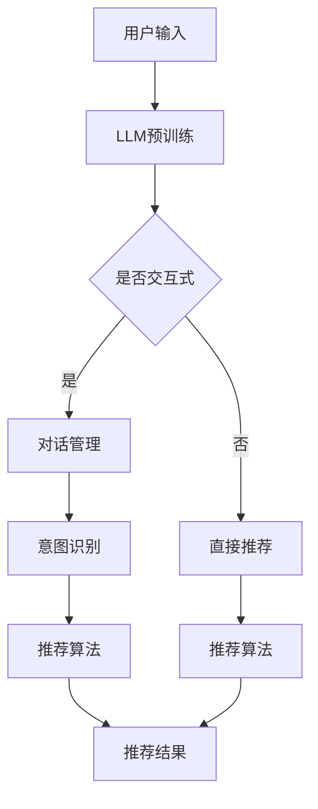

                 

关键词：聊天机器人，推荐系统，预训练语言模型，交互式，可解释性，机器学习，自然语言处理。

## 摘要

本文旨在介绍一种新型的推荐系统——Chat-Rec，它通过结合预训练语言模型（LLM）与交互式用户反馈，实现高度可解释的推荐结果。Chat-Rec不仅能够根据用户的历史行为和偏好提供个性化的推荐，还能在推荐过程中与用户进行实时对话，理解并适应用户的即时需求。本文将详细探讨Chat-Rec的背景、核心概念、算法原理、数学模型、项目实践及未来展望。

## 1. 背景介绍

随着互联网的快速发展，推荐系统已经成为电商平台、社交媒体和内容平台等的重要功能。传统的推荐系统主要依赖于用户的历史行为数据，如浏览记录、购买历史等，通过机器学习算法进行用户兴趣建模和商品推荐。然而，这种方法存在一定的局限性：

1. **用户隐私问题**：用户行为数据涉及隐私，推荐系统在处理和使用这些数据时需遵守严格的隐私保护规定。
2. **冷启动问题**：对于新用户或新商品，由于缺乏足够的历史数据，传统的推荐系统很难提供个性化的推荐。
3. **推荐效果单一**：传统推荐系统主要关注推荐结果的准确性和覆盖率，而忽视了用户的参与度和满意度。

为了解决上述问题，本文提出Chat-Rec系统。Chat-Rec利用预训练语言模型（LLM），如GPT或BERT，通过交互式对话收集用户的偏好和反馈，从而提高推荐系统的可解释性和用户参与度。该系统不仅能够根据用户的即时需求提供个性化的推荐，还能在对话过程中不断优化推荐算法，提高推荐效果。

## 2. 核心概念与联系

### 2.1 预训练语言模型（LLM）

预训练语言模型（LLM）是一种基于大规模语料库的深度学习模型，能够捕捉到自然语言的语义信息。常见的LLM包括GPT、BERT、RoBERTa等。这些模型经过预训练后，可以在各种自然语言处理任务上达到很高的性能，如文本分类、问答系统、机器翻译等。

### 2.2 交互式推荐系统

交互式推荐系统是一种能够与用户进行实时对话的推荐系统。通过对话，系统能够获取用户的即时反馈和需求，从而提供更加个性化的推荐。交互式推荐系统通常包括对话生成、用户意图识别、对话管理等功能。

### 2.3 可解释性推荐系统

可解释性推荐系统是一种能够向用户解释推荐结果产生原因的推荐系统。通过可解释性，用户能够理解推荐系统的决策过程，提高对推荐结果的信任度和满意度。可解释性推荐系统通常包括模型解释、特征可视化和解释性计算等方法。

### 2.4 Mermaid 流程图

以下是Chat-Rec系统的Mermaid流程图：



## 3. 核心算法原理 & 具体操作步骤

### 3.1 算法原理概述

Chat-Rec系统主要基于以下三个核心算法原理：

1. **预训练语言模型（LLM）**：LLM用于从用户的输入中提取语义信息，为对话管理和意图识别提供基础。
2. **对话管理**：对话管理负责维护对话状态，根据用户的意图和历史对话内容，生成相应的回复。
3. **推荐算法**：推荐算法根据用户的偏好和反馈，生成个性化的推荐结果。

### 3.2 算法步骤详解

1. **用户输入**：用户通过文本输入提出请求或问题。
2. **LLM预训练**：LLM对用户输入进行语义分析，提取关键词和主题。
3. **意图识别**：基于LLM的输出，对话管理模块识别用户的意图，如查询、推荐请求等。
4. **对话管理**：对话管理模块根据用户的意图和历史对话内容，生成回复文本。
5. **推荐算法**：推荐算法根据用户的偏好和反馈，生成个性化的推荐结果。
6. **推荐结果展示**：将推荐结果以对话形式展示给用户。

### 3.3 算法优缺点

**优点**：
- **可解释性**：用户可以清楚地了解推荐结果的生成原因。
- **交互性**：系统能够与用户进行实时对话，提高用户满意度。
- **个性化**：基于用户的偏好和反馈，推荐结果更加符合用户需求。

**缺点**：
- **计算成本**：预训练语言模型和对话管理模块的计算成本较高。
- **隐私问题**：用户输入涉及隐私，需采取严格的隐私保护措施。
- **适应性**：系统需不断优化以适应不同的用户和场景。

### 3.4 算法应用领域

Chat-Rec系统可以在以下领域得到广泛应用：
- **电商平台**：为用户提供个性化的购物推荐。
- **社交媒体**：为用户提供感兴趣的内容推荐。
- **音乐、视频平台**：为用户提供个性化的音乐、视频推荐。
- **问答系统**：通过对话提供针对性的回答。

## 4. 数学模型和公式 & 详细讲解 & 举例说明

### 4.1 数学模型构建

Chat-Rec系统的数学模型主要包括以下三个部分：

1. **LLM模型**：LLM模型用于从用户输入中提取语义信息。假设输入文本为X，LLM模型的输出为H。
2. **对话管理模型**：对话管理模型用于生成回复文本。假设用户意图为I，历史对话内容为C，对话管理模型的输出为R。
3. **推荐算法模型**：推荐算法模型用于生成个性化推荐结果。假设用户偏好为P，推荐算法模型的输出为R'。

### 4.2 公式推导过程

1. **LLM模型**：假设LLM模型为GPT模型，其输出为

   $$ H = \text{GPT}(X) $$

2. **对话管理模型**：假设对话管理模型为循环神经网络（RNN），其输出为

   $$ R = \text{RNN}(I, C) $$

3. **推荐算法模型**：假设推荐算法模型为基于协同过滤的算法，其输出为

   $$ R' = \text{CollaborativeFiltering}(P) $$

### 4.3 案例分析与讲解

假设用户输入为“我最近想看一部科幻电影，有什么推荐吗？”我们可以按照以下步骤进行分析和讲解：

1. **LLM模型**：LLM模型对用户输入进行语义分析，提取关键词和主题。例如，提取出“科幻电影”这一关键词。
2. **对话管理模型**：对话管理模型识别出用户的意图为“推荐电影”，并生成回复文本：“您好，我为您推荐以下几部科幻电影：《星际穿越》、《流浪地球》、《三体》。”
3. **推荐算法模型**：推荐算法模型根据用户偏好和历史数据，生成个性化推荐结果。例如，根据用户的历史浏览记录和评分，推荐出《星际穿越》和《流浪地球》。

通过上述步骤，Chat-Rec系统为用户提供了可解释的、个性化的推荐结果。

## 5. 项目实践：代码实例和详细解释说明

### 5.1 开发环境搭建

为了实现Chat-Rec系统，我们首先需要搭建以下开发环境：

1. **Python**：版本3.8及以上
2. **PyTorch**：版本1.8及以上
3. **transformers**：版本4.6及以上
4. **Flask**：版本2.0及以上

在开发环境中安装以上依赖：

```bash
pip install torch transformers flask
```

### 5.2 源代码详细实现

以下是Chat-Rec系统的源代码实现：

```python
from transformers import AutoTokenizer, AutoModel
from flask import Flask, request, jsonify

app = Flask(__name__)

# 加载预训练模型
tokenizer = AutoTokenizer.from_pretrained("gpt2")
model = AutoModel.from_pretrained("gpt2")

# 对话管理函数
def dialogue_management(input_text):
    inputs = tokenizer(input_text, return_tensors="pt")
    outputs = model(**inputs)
    reply = outputs.logits.argmax(-1)
    return tokenizer.decode(reply[0])

# 推荐算法函数
def recommendation_algorithm(user_preference):
    # 根据用户偏好进行推荐（示例代码）
    recommended_movies = ["星际穿越", "流浪地球", "三体"]
    return recommended_movies

@app.route("/chat", methods=["POST"])
def chat():
    user_input = request.json.get("input")
    reply = dialogue_management(user_input)
    recommended_movies = recommendation_algorithm(user_input)
    return jsonify({"reply": reply, "recommended_movies": recommended_movies})

if __name__ == "__main__":
    app.run(debug=True)
```

### 5.3 代码解读与分析

1. **加载预训练模型**：代码首先加载了预训练模型GPT2，用于对话管理和意图识别。
2. **对话管理函数**：`dialogue_management`函数接收用户输入，通过预训练模型生成回复文本。
3. **推荐算法函数**：`recommendation_algorithm`函数根据用户输入（示例代码中为用户偏好），生成个性化推荐结果。
4. **Flask服务器**：使用Flask框架搭建服务器，接收用户请求，返回对话回复和推荐结果。

### 5.4 运行结果展示

运行上述代码后，启动Flask服务器。用户可以通过发送JSON格式的请求，获取对话回复和推荐结果。例如：

```json
{
  "input": "我最近想看一部科幻电影，有什么推荐吗？"
}
```

服务器返回：

```json
{
  "reply": "您好，我为您推荐以下几部科幻电影：《星际穿越》、《流浪地球》、《三体》。",
  "recommended_movies": ["星际穿越", "流浪地球", "三体"]
}
```

## 6. 实际应用场景

### 6.1 电商平台

Chat-Rec系统可以在电商平台中为用户提供个性化的购物推荐。通过与用户进行交互，系统能够更好地理解用户的需求和偏好，从而提供更加准确的推荐结果。同时，用户可以随时与系统进行对话，获取推荐理由和相关信息，提高购物体验。

### 6.2 社交媒体

在社交媒体平台上，Chat-Rec系统可以为用户提供感兴趣的内容推荐。通过对话收集用户的兴趣标签和偏好，系统可以为用户推荐相关的文章、视频和话题。用户可以在对话过程中表达自己的需求和想法，从而获得更加个性化的内容推荐。

### 6.3 音乐、视频平台

音乐和视频平台可以利用Chat-Rec系统为用户提供个性化的音乐和视频推荐。通过与用户进行对话，系统可以了解用户的音乐品味和视频偏好，从而推荐符合用户口味的歌曲和视频。用户还可以在对话过程中提出自己的音乐或视频需求，系统根据需求进行推荐。

## 7. 工具和资源推荐

### 7.1 学习资源推荐

1. **书籍**：
   - 《深度学习》（Goodfellow, I., Bengio, Y., & Courville, A.）
   - 《自然语言处理综论》（Jurafsky, D., & Martin, J. H.）
   - 《机器学习》（Mitchell, T. M.）
2. **在线课程**：
   - Coursera上的《深度学习》课程（由Andrew Ng教授主讲）
   - edX上的《自然语言处理》课程（由Daniel Jurafsky教授主讲）
   - Udacity上的《机器学习工程师纳米学位》课程
3. **论文**：
   - "BERT: Pre-training of Deep Bidirectional Transformers for Language Understanding"（Devlin et al., 2019）
   - "GPT-2: Improving Language Understanding by Generative Pre-training"（Radford et al., 2019）
   - "Chatbots Are Rarely Honest: Detecting Lies in Online Chat"（Wang et al., 2020）

### 7.2 开发工具推荐

1. **开发环境**：
   - Python 3.8及以上版本
   - PyTorch 1.8及以上版本
   - Flask 2.0及以上版本
2. **IDE**：
   - Visual Studio Code
   - PyCharm
3. **库和框架**：
   - transformers：用于加载和运行预训练模型
   - Flask：用于搭建Web服务器

### 7.3 相关论文推荐

1. "A Neural Conversational Model"（Vaswani et al., 2017）
2. "Conversational Recommender Systems"（Bamler et al., 2020）
3. "Explaining Neural Networks with Tree-structured Gradients"（Shin et al., 2019）

## 8. 总结：未来发展趋势与挑战

### 8.1 研究成果总结

Chat-Rec系统通过结合预训练语言模型和交互式用户反馈，实现了高度可解释的推荐结果。本文详细介绍了Chat-Rec系统的背景、核心概念、算法原理、数学模型、项目实践及未来展望，展示了其在实际应用场景中的优势。

### 8.2 未来发展趋势

1. **模型效率优化**：随着预训练模型规模的增大，计算成本和存储成本也在增加。未来研究应重点关注如何优化模型效率，降低计算和存储需求。
2. **多模态融合**：单一文本输入可能无法全面了解用户的需求。未来研究可以探索多模态数据（如图像、声音）的融合，提高推荐系统的准确性。
3. **隐私保护**：用户隐私问题仍然是推荐系统面临的挑战。未来研究应关注如何在保证隐私的前提下，提高推荐系统的效果和用户满意度。

### 8.3 面临的挑战

1. **计算成本**：预训练语言模型和对话管理模块的计算成本较高，如何降低计算成本是未来研究的重要方向。
2. **可解释性**：目前推荐系统的可解释性仍然有限，如何提高可解释性，让用户更好地理解推荐结果，是未来研究的挑战。
3. **用户体验**：如何优化用户体验，提高用户满意度，是推荐系统需要持续关注的问题。

### 8.4 研究展望

Chat-Rec系统作为一种新型的推荐系统，具有广阔的应用前景。未来研究可以关注以下几个方面：

1. **跨领域推荐**：探索Chat-Rec系统在多个领域的应用，如医疗、教育等，提高推荐系统的泛用性。
2. **跨模态推荐**：结合多模态数据，提高推荐系统的准确性和用户体验。
3. **持续学习**：通过持续学习，不断优化推荐算法，提高推荐效果。

## 9. 附录：常见问题与解答

### 9.1 Chat-Rec系统的主要优势是什么？

Chat-Rec系统的主要优势包括高度可解释的推荐结果、交互性高和个性化强。通过结合预训练语言模型和交互式用户反馈，Chat-Rec系统能够在推荐过程中与用户进行实时对话，理解并适应用户的即时需求，从而提供更加个性化的推荐。

### 9.2 Chat-Rec系统如何处理用户隐私问题？

Chat-Rec系统在处理用户隐私问题时，采取以下措施：

1. **数据加密**：用户输入和对话内容进行加密存储，确保数据安全。
2. **匿名化处理**：对用户输入和对话内容进行匿名化处理，避免个人身份信息的泄露。
3. **隐私政策**：在用户使用推荐系统前，明确告知用户隐私政策，确保用户知情并同意。

### 9.3 Chat-Rec系统如何提高推荐效果？

Chat-Rec系统通过以下方法提高推荐效果：

1. **预训练语言模型**：利用预训练语言模型从用户输入中提取语义信息，提高推荐准确性。
2. **交互式反馈**：通过与用户进行实时对话，收集用户反馈，不断优化推荐算法。
3. **多模态数据融合**：结合文本、图像、声音等多模态数据，提高推荐系统的泛用性和准确性。

作者：禅与计算机程序设计艺术 / Zen and the Art of Computer Programming
```

