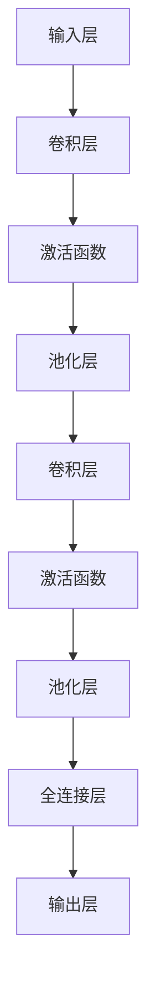

                 

关键词：卷积神经网络、CNN、图像识别、深度学习、神经网络架构、代码实例

摘要：本文深入解析卷积神经网络（CNN）的基本原理、架构以及应用场景，结合实际代码实例，详细讲解CNN的实现过程。通过本文，读者可以全面了解CNN的工作机制，掌握CNN在图像识别等领域的应用技巧。

## 1. 背景介绍

卷积神经网络（Convolutional Neural Networks，简称CNN）是深度学习中一种重要的神经网络架构，广泛应用于图像识别、物体检测、语音识别等领域。与传统神经网络相比，CNN具有以下特点：

- **参数共享**：CNN中的卷积层使用了局部感知和参数共享技术，这大大减少了模型的参数数量，提高了训练效率。
- **层次化特征学习**：CNN通过多个卷积层和池化层的堆叠，逐渐提取图像的底层特征（边缘、角点等）到高层特征（形状、语义等），这种层次化的特征提取机制使得CNN在图像识别任务中表现出色。
- **平移不变性**：CNN的卷积操作具有平移不变性，即网络可以识别图像中不同位置的相同特征。

CNN的成功得益于其独特的结构设计，使得它能够在复杂的图像数据中提取有意义的特征。本文将围绕CNN的核心概念、算法原理以及实际应用，为读者呈现一幅全面的技术画卷。

## 2. 核心概念与联系

### 2.1 卷积神经网络的基本概念

卷积神经网络由以下几个核心部分组成：

1. **输入层（Input Layer）**：接收原始图像数据。
2. **卷积层（Convolutional Layer）**：使用卷积核（filter）对输入图像进行卷积操作，提取图像的局部特征。
3. **池化层（Pooling Layer）**：对卷积层输出的特征图进行下采样，减少数据维度，增强平移不变性。
4. **全连接层（Fully Connected Layer）**：将卷积层和池化层输出的特征图展平，形成一个一维的向量，输入到全连接层进行分类。
5. **输出层（Output Layer）**：根据分类任务的不同，输出层可以是softmax层、sigmoid层等。

### 2.2 卷积神经网络的工作原理

CNN的工作原理可以分为以下几个步骤：

1. **初始化权重和偏置**：在训练过程中，初始化卷积层和全连接层的权重和偏置。
2. **卷积操作**：卷积层使用卷积核（filter）在输入图像上滑动，对每个局部区域进行卷积操作，提取图像特征。
3. **激活函数**：通常使用ReLU（Rectified Linear Unit）作为激活函数，对卷积层输出的特征进行非线性变换。
4. **池化操作**：池化层对卷积层输出的特征图进行下采样，减小数据维度。
5. **全连接层**：将卷积层和池化层输出的特征图展平，输入到全连接层进行分类。
6. **输出层**：根据分类任务的不同，输出层使用适当的激活函数（如softmax）进行分类。

### 2.3 卷积神经网络与图像识别的联系

CNN在图像识别中的核心作用是通过层次化的特征提取，逐步从原始图像中提取有意义的特征，如边缘、角点、形状等。这些特征有助于提高图像分类的准确性。以下是CNN在图像识别中应用的一些关键步骤：

1. **特征提取**：通过卷积层和池化层的堆叠，从原始图像中提取底层特征到高层特征。
2. **特征融合**：将不同卷积层的特征进行融合，形成一个全面的特征表示。
3. **分类决策**：将特征向量输入到全连接层，通过softmax层进行分类决策。

### 2.4 Mermaid 流程图

以下是卷积神经网络的基本架构的Mermaid流程图：



## 3. 核心算法原理 & 具体操作步骤

### 3.1 算法原理概述

卷积神经网络（CNN）的核心算法原理基于卷积操作和池化操作，下面将详细解释这两个操作。

#### 卷积操作

卷积操作是CNN中最基本的操作之一。它通过卷积核（filter）在输入图像上滑动，对每个局部区域进行卷积，从而提取图像的特征。卷积操作的数学表达式如下：

$$
o_{ij} = \sum_{k=1}^{K} w_{ik} * g_{kj}
$$

其中，$o_{ij}$ 表示卷积层输出的特征图中的像素值，$w_{ik}$ 表示卷积核的权重，$g_{kj}$ 表示输入图像中的像素值，$K$ 表示卷积核的大小。

#### 池化操作

池化操作是卷积操作的一个补充，用于减少数据维度并增强网络的平移不变性。最常用的池化操作是最大池化（Max Pooling），其数学表达式如下：

$$
p_{ij} = \max(g_{ij})
$$

其中，$p_{ij}$ 表示池化层输出的像素值，$g_{ij}$ 表示卷积层输出的像素值。

### 3.2 算法步骤详解

#### 步骤1：初始化权重和偏置

在训练过程中，初始化卷积层和全连接层的权重和偏置。通常使用随机初始化方法，如高斯分布初始化。

#### 步骤2：卷积操作

对输入图像进行卷积操作，使用多个卷积核提取图像的局部特征。

#### 步骤3：激活函数

对卷积层输出的特征进行非线性变换，通常使用ReLU激活函数。

#### 步骤4：池化操作

对卷积层输出的特征图进行最大池化操作，减少数据维度。

#### 步骤5：全连接层

将卷积层和池化层输出的特征图展平，形成一个一维的向量，输入到全连接层进行分类。

#### 步骤6：输出层

根据分类任务的不同，输出层使用适当的激活函数（如softmax）进行分类决策。

### 3.3 算法优缺点

#### 优点：

1. **参数共享**：通过局部感知和参数共享技术，减少了模型的参数数量，提高了训练效率。
2. **层次化特征学习**：通过多个卷积层和池化层的堆叠，逐渐提取图像的底层特征到高层特征，提高了特征提取的准确性。
3. **平移不变性**：卷积操作具有平移不变性，使得网络可以识别图像中不同位置的相同特征。

#### 缺点：

1. **计算复杂度高**：CNN需要大量的计算资源，尤其是在处理大型图像数据时。
2. **数据需求大**：CNN需要大量的训练数据，否则容易出现过拟合问题。

### 3.4 算法应用领域

CNN在图像识别、物体检测、语音识别等领域具有广泛的应用。以下是一些典型的应用案例：

1. **图像识别**：使用CNN对图像进行分类，如人脸识别、车牌识别等。
2. **物体检测**：使用CNN检测图像中的物体，如YOLO、SSD等模型。
3. **语音识别**：使用CNN提取语音信号的时频特征，如CNN-HMM模型。

## 4. 数学模型和公式 & 详细讲解 & 举例说明

### 4.1 数学模型构建

卷积神经网络（CNN）的数学模型主要涉及卷积操作、激活函数和池化操作。下面将详细讲解这些操作的数学模型。

#### 卷积操作

卷积操作的数学模型如下：

$$
o_{ij} = \sum_{k=1}^{K} w_{ik} * g_{kj}
$$

其中，$o_{ij}$ 表示卷积层输出的特征图中的像素值，$w_{ik}$ 表示卷积核的权重，$g_{kj}$ 表示输入图像中的像素值，$K$ 表示卷积核的大小。

#### 激活函数

常用的激活函数包括ReLU、Sigmoid和softmax。下面将分别介绍这些激活函数的数学模型。

1. **ReLU激活函数**：

$$
a_{i} = \max(0, z_{i})
$$

其中，$a_{i}$ 表示激活函数的输出，$z_{i}$ 表示卷积层或全连接层的输入。

2. **Sigmoid激活函数**：

$$
a_{i} = \frac{1}{1 + e^{-z_{i}}}
$$

3. **softmax激活函数**：

$$
a_{j} = \frac{e^{z_{j}}}{\sum_{k=1}^{N} e^{z_{k}}}
$$

其中，$a_{j}$ 表示softmax层的输出，$z_{j}$ 表示全连接层的输入，$N$ 表示分类类别数。

#### 池化操作

池化操作的数学模型如下：

$$
p_{ij} = \max(g_{ij})
$$

其中，$p_{ij}$ 表示池化层输出的像素值，$g_{ij}$ 表示卷积层输出的像素值。

### 4.2 公式推导过程

为了更好地理解卷积神经网络（CNN）的数学模型，我们将对卷积操作、激活函数和池化操作进行公式推导。

#### 卷积操作

卷积操作的公式推导如下：

$$
o_{ij} = \sum_{k=1}^{K} w_{ik} * g_{kj}
$$

其中，$o_{ij}$ 表示卷积层输出的特征图中的像素值，$w_{ik}$ 表示卷积核的权重，$g_{kj}$ 表示输入图像中的像素值，$K$ 表示卷积核的大小。

#### 激活函数

激活函数的公式推导如下：

1. **ReLU激活函数**：

$$
a_{i} = \max(0, z_{i})
$$

其中，$a_{i}$ 表示激活函数的输出，$z_{i}$ 表示卷积层或全连接层的输入。

2. **Sigmoid激活函数**：

$$
a_{i} = \frac{1}{1 + e^{-z_{i}}}
$$

3. **softmax激活函数**：

$$
a_{j} = \frac{e^{z_{j}}}{\sum_{k=1}^{N} e^{z_{k}}}
$$

其中，$a_{j}$ 表示softmax层的输出，$z_{j}$ 表示全连接层的输入，$N$ 表示分类类别数。

#### 池化操作

池化操作的公式推导如下：

$$
p_{ij} = \max(g_{ij})
$$

其中，$p_{ij}$ 表示池化层输出的像素值，$g_{ij}$ 表示卷积层输出的像素值。

### 4.3 案例分析与讲解

为了更好地理解卷积神经网络（CNN）的数学模型，我们通过一个具体的案例进行讲解。

假设我们有一个32x32的输入图像，使用一个3x3的卷积核进行卷积操作。卷积核的权重和偏置分别为：

$$
w_{ik} = \begin{bmatrix}
1 & 0 & 1 \\
1 & 1 & 1 \\
0 & 1 & 1
\end{bmatrix}
$$

$$
b_{i} = 1
$$

输入图像的像素值为：

$$
g_{ij} = \begin{bmatrix}
0 & 0 & 0 & 0 & 0 & 0 & 0 & 0 & 0 \\
0 & 0 & 1 & 1 & 1 & 0 & 0 & 0 & 0 \\
0 & 1 & 1 & 0 & 0 & 1 & 1 & 0 & 0 \\
0 & 1 & 0 & 1 & 1 & 0 & 0 & 1 & 0 \\
0 & 0 & 1 & 1 & 1 & 0 & 0 & 0 & 0 \\
0 & 0 & 0 & 0 & 0 & 0 & 0 & 0 & 0 \\
0 & 0 & 0 & 0 & 0 & 0 & 0 & 0 & 0 \\
0 & 0 & 0 & 0 & 0 & 0 & 0 & 0 & 0 \\
0 & 0 & 0 & 0 & 0 & 0 & 0 & 0 & 0
\end{bmatrix}
$$

根据卷积操作的数学模型，我们可以计算出卷积层输出的特征图：

$$
o_{ij} = \sum_{k=1}^{3} w_{ik} * g_{kj} + b_{i}
$$

$$
= (1 * 0 + 0 * 1 + 1 * 1 + 1 * 1 + 1 * 0 + 0 * 0 + 1 * 0 + 0 * 1 + 1 * 1) + 1
$$

$$
= 3
$$

因此，卷积层输出的特征图中的像素值为3。

接下来，我们对卷积层输出的特征图进行ReLU激活函数：

$$
a_{i} = \max(0, o_{i})
$$

$$
= \max(0, 3)
$$

$$
= 3
$$

最后，我们对激活后的特征图进行最大池化操作：

$$
p_{ij} = \max(a_{ij})
$$

$$
= \max(3, 3, 3, 3, 3)
$$

$$
= 3
$$

因此，池化层输出的像素值为3。

## 5. 项目实践：代码实例和详细解释说明

在本节中，我们将通过一个实际的代码实例，详细解释卷积神经网络（CNN）的实现过程。我们将使用Python和TensorFlow框架进行编程。

### 5.1 开发环境搭建

在开始编写代码之前，我们需要搭建一个合适的开发环境。以下是搭建TensorFlow开发环境的基本步骤：

1. 安装Anaconda：下载并安装Anaconda，它是一个集成了Python和其他科学计算库的发行版。
2. 创建虚拟环境：打开终端，执行以下命令创建一个名为`tf_environment`的虚拟环境：

```shell
conda create -n tf_environment python=3.8
```

3. 激活虚拟环境：

```shell
conda activate tf_environment
```

4. 安装TensorFlow：在虚拟环境中安装TensorFlow：

```shell
pip install tensorflow
```

### 5.2 源代码详细实现

下面是一个简单的CNN实现，用于MNIST手写数字识别任务。我们将分步骤介绍代码的实现过程。

#### 步骤1：导入必要的库

```python
import tensorflow as tf
from tensorflow.keras import datasets, layers, models
import matplotlib.pyplot as plt
```

#### 步骤2：加载和预处理数据

```python
(train_images, train_labels), (test_images, test_labels) = datasets.mnist.load_data()

train_images = train_images.reshape((60000, 28, 28, 1)).astype('float32') / 255
test_images = test_images.reshape((10000, 28, 28, 1)).astype('float32') / 255

train_labels = tf.keras.utils.to_categorical(train_labels)
test_labels = tf.keras.utils.to_categorical(test_labels)
```

#### 步骤3：构建CNN模型

```python
model = models.Sequential()
model.add(layers.Conv2D(32, (3, 3), activation='relu', input_shape=(28, 28, 1)))
model.add(layers.MaxPooling2D((2, 2)))
model.add(layers.Conv2D(64, (3, 3), activation='relu'))
model.add(layers.MaxPooling2D((2, 2)))
model.add(layers.Conv2D(64, (3, 3), activation='relu'))
model.add(layers.Flatten())
model.add(layers.Dense(64, activation='relu'))
model.add(layers.Dense(10, activation='softmax'))
```

#### 步骤4：编译和训练模型

```python
model.compile(optimizer='adam',
              loss='categorical_crossentropy',
              metrics=['accuracy'])

history = model.fit(train_images, train_labels, epochs=10, 
                    validation_data=(test_images, test_labels))
```

#### 步骤5：评估模型

```python
test_loss, test_acc = model.evaluate(test_images,  test_labels, verbose=2)
print('\nTest accuracy:', test_acc)
```

### 5.3 代码解读与分析

#### 5.3.1 模型构建

在代码中，我们首先定义了一个序列模型（Sequential），然后依次添加了卷积层（Conv2D）、池化层（MaxPooling2D）和全连接层（Dense）。卷积层使用了ReLU激活函数，池化层使用了最大池化操作。最后，全连接层使用了softmax激活函数进行分类。

#### 5.3.2 训练过程

在训练过程中，我们使用了`model.fit()`方法，它接受训练数据、标签、训练轮数和验证数据。在训练过程中，模型将不断调整权重和偏置，以最小化损失函数并提高准确性。

#### 5.3.3 评估模型

训练完成后，我们使用`model.evaluate()`方法对模型进行评估。这个方法返回模型在测试数据上的损失值和准确性。

### 5.4 运行结果展示

在代码的最后，我们输出了模型在测试数据上的准确性。在实际运行中，我们可能需要可视化训练过程中的损失值和准确性，以便更好地理解模型的训练过程。

```python
plt.plot(history.history['accuracy'], label='accuracy')
plt.plot(history.history['val_accuracy'], label='val_accuracy')
plt.xlabel('Epoch')
plt.ylabel('Accuracy')
plt.ylim([0, 1])
plt.legend(loc='lower right')
plt.show()
```

通过这个可视化，我们可以观察到模型在训练过程中的收敛情况。

## 6. 实际应用场景

卷积神经网络（CNN）在多个实际应用场景中表现出色。以下是一些典型的应用领域：

### 6.1 图像识别

CNN在图像识别领域具有广泛的应用，如人脸识别、车牌识别、医疗图像诊断等。CNN通过层次化的特征提取，能够从原始图像中提取出具有区分度的特征，从而实现高精度的分类。

### 6.2 物体检测

物体检测是计算机视觉中的一个重要任务，CNN在这方面也发挥了重要作用。著名的物体检测模型如YOLO、SSD等都是基于CNN构建的。这些模型能够同时检测图像中的多个物体，提高了实时性。

### 6.3 语音识别

语音识别是另一个重要的应用领域。CNN可以提取语音信号的时频特征，与传统的隐藏马尔可夫模型（HMM）结合，实现高精度的语音识别。

### 6.4 自然语言处理

虽然CNN最初是用于图像处理，但其在自然语言处理（NLP）领域的应用也越来越广泛。例如，CNN可以用于文本分类、情感分析等任务，通过提取文本的局部特征，提高模型的准确性。

## 7. 工具和资源推荐

为了更好地学习卷积神经网络（CNN），以下是一些推荐的工具和资源：

### 7.1 学习资源推荐

1. **《深度学习》（Goodfellow, Bengio, Courville著）**：这本书是深度学习领域的经典教材，涵盖了CNN的基本原理和应用。
2. **[TensorFlow官方文档](https://www.tensorflow.org/)**：TensorFlow是CNN实现的主要工具，其官方文档提供了丰富的教程和示例。

### 7.2 开发工具推荐

1. **Jupyter Notebook**：Jupyter Notebook是一个交互式的开发环境，非常适合用于编写和运行CNN代码。
2. **Google Colab**：Google Colab是Google提供的免费云端Jupyter Notebook服务，可以在线编写和运行CNN代码。

### 7.3 相关论文推荐

1. **"A Guide to Convolutional Neural Networks for Visual Recognition"（卷积神经网络视觉识别指南）**：这是一篇综述文章，详细介绍了CNN的基本原理和应用。
2. **"Deep Learning on ImageNet: Application of a Large-Scale Deep Convolutional Network"（深度学习在ImageNet上的应用：大型深度卷积神经网络的实现）**：这是Google发布的论文，详细描述了Inception网络的实现过程。

## 8. 总结：未来发展趋势与挑战

### 8.1 研究成果总结

卷积神经网络（CNN）在图像识别、物体检测、语音识别等领域取得了显著的成果。通过层次化的特征提取和参数共享技术，CNN能够在复杂的图像数据中提取有意义的特征，实现了高精度的分类和检测。

### 8.2 未来发展趋势

1. **模型压缩与优化**：为了提高CNN的运行效率，未来的研究将聚焦于模型压缩和优化技术，如量化、剪枝、知识蒸馏等。
2. **迁移学习与数据增强**：迁移学习和数据增强技术将有助于解决数据不足的问题，提高CNN在特定领域的表现。
3. **多模态学习**：多模态学习是未来的一个重要方向，将CNN与其他模型（如循环神经网络RNN、生成对抗网络GAN等）结合，实现更丰富的特征提取和推理能力。

### 8.3 面临的挑战

1. **计算资源需求**：CNN模型通常需要大量的计算资源，尤其是在处理大型图像数据时。这限制了CNN在某些应用场景中的使用。
2. **数据隐私与安全**：在深度学习中，数据的安全性和隐私保护是一个重要的挑战。未来的研究需要关注如何确保数据在训练和推理过程中的安全性。
3. **可解释性与透明度**：深度学习模型的“黑箱”性质使得其决策过程缺乏可解释性。未来的研究需要开发可解释的CNN模型，提高模型的透明度和可信度。

### 8.4 研究展望

卷积神经网络（CNN）在计算机视觉、语音识别和自然语言处理等领域具有广泛的应用前景。未来的研究将致力于解决当前面临的挑战，提高CNN的运行效率、可解释性和安全性。同时，多模态学习和迁移学习等新技术的引入，将为CNN带来更多创新和应用机会。

## 9. 附录：常见问题与解答

### 9.1 什么是卷积神经网络（CNN）？

卷积神经网络（CNN）是一种专门用于处理图像数据的神经网络架构。它通过卷积操作和池化操作，能够提取图像的层次化特征，从而实现图像分类、物体检测等任务。

### 9.2 CNN的核心组成部分有哪些？

CNN的核心组成部分包括输入层、卷积层、池化层、全连接层和输出层。其中，卷积层和池化层用于特征提取，全连接层用于分类决策。

### 9.3 CNN与传统的全连接神经网络有何区别？

CNN与传统全连接神经网络的主要区别在于其参数共享和层次化特征提取。CNN通过局部感知和参数共享技术，减少了模型的参数数量，提高了训练效率。同时，CNN通过多个卷积层和池化层的堆叠，实现了从底层特征到高层特征的层次化提取。

### 9.4 如何优化CNN模型的性能？

优化CNN模型的性能可以从以下几个方面入手：

1. **数据增强**：通过旋转、缩放、裁剪等数据增强方法，增加训练数据的多样性，提高模型的泛化能力。
2. **模型压缩**：使用量化、剪枝、知识蒸馏等技术，减少模型的参数数量和计算量，提高模型的运行效率。
3. **迁移学习**：利用预训练模型，在特定领域上进行微调，提高模型的性能。
4. **正则化技术**：如dropout、L2正则化等，减少过拟合现象，提高模型的泛化能力。

### 9.5 CNN在哪些领域具有广泛应用？

CNN在图像识别、物体检测、语音识别、自然语言处理等领域具有广泛应用。例如，在图像识别领域，CNN可以用于人脸识别、车牌识别、医疗图像诊断等；在物体检测领域，CNN可以用于实时视频监控、自动驾驶等。

### 9.6 如何使用CNN进行图像分类？

使用CNN进行图像分类通常包括以下几个步骤：

1. **数据预处理**：对图像进行归一化、裁剪等预处理操作。
2. **构建CNN模型**：定义卷积层、池化层、全连接层等，构建CNN模型。
3. **训练模型**：使用训练数据训练模型，调整模型的权重和偏置。
4. **评估模型**：使用验证数据评估模型的性能，调整模型参数。
5. **部署模型**：将训练好的模型部署到实际应用场景，如图像分类任务。

### 9.7 CNN的优缺点是什么？

CNN的优点包括：

1. **参数共享**：通过局部感知和参数共享技术，减少了模型的参数数量，提高了训练效率。
2. **层次化特征提取**：通过多个卷积层和池化层的堆叠，逐渐提取图像的底层特征到高层特征，提高了特征提取的准确性。
3. **平移不变性**：卷积操作具有平移不变性，使得网络可以识别图像中不同位置的相同特征。

CNN的缺点包括：

1. **计算复杂度高**：CNN需要大量的计算资源，尤其是在处理大型图像数据时。
2. **数据需求大**：CNN需要大量的训练数据，否则容易出现过拟合问题。

### 9.8 如何改进CNN的性能？

改进CNN的性能可以从以下几个方面入手：

1. **增加网络深度**：增加网络的层数，可以提取更多的层次化特征，提高模型的表现力。
2. **使用预训练模型**：利用预训练模型，在特定领域上进行微调，提高模型的性能。
3. **数据增强**：通过旋转、缩放、裁剪等数据增强方法，增加训练数据的多样性，提高模型的泛化能力。
4. **正则化技术**：如dropout、L2正则化等，减少过拟合现象，提高模型的泛化能力。

### 9.9 CNN与循环神经网络（RNN）有何区别？

CNN与循环神经网络（RNN）的主要区别在于它们处理的输入数据类型和特征提取方式。CNN主要用于处理二维图像数据，通过卷积操作和池化操作提取图像的层次化特征。RNN主要用于处理一维序列数据（如文本、时间序列等），通过循环连接实现序列数据的时序建模。

### 9.10 CNN与生成对抗网络（GAN）有何联系？

CNN与生成对抗网络（GAN）的联系在于，它们都可以用于特征提取和生成任务。CNN可以用于提取输入数据的特征，而GAN则通过生成器和判别器的对抗训练，实现数据的生成。在GAN中，通常使用CNN作为生成器和判别器的一部分，以提高模型的表现力。

### 9.11 CNN在实时应用中有哪些挑战？

CNN在实时应用中面临的主要挑战包括：

1. **计算资源限制**：实时应用通常需要快速的响应时间，这要求CNN模型在有限的计算资源下高效运行。
2. **数据延迟**：实时应用中的数据输入可能存在延迟，这会影响模型的实时性和准确性。
3. **模型更新**：在实时应用中，模型需要不断更新以适应新的数据和环境，这要求模型具有较好的适应性和可扩展性。

