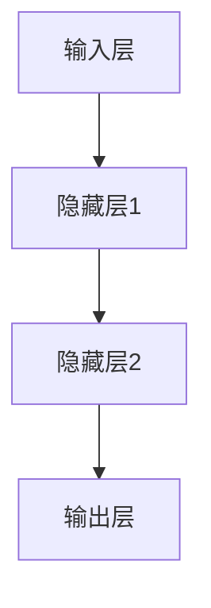
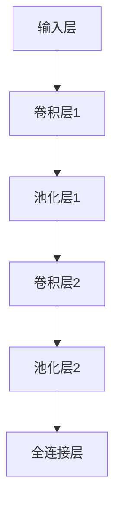
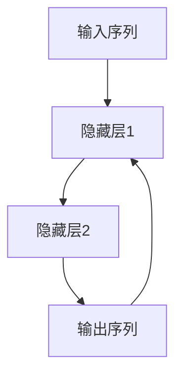

                 

关键词：深度学习、神经网络、卷积神经网络、循环神经网络、反向传播算法、数学模型、Python实现、实例分析。

> 摘要：本文将深入讲解深度学习的核心原理，包括神经网络、卷积神经网络和循环神经网络等，并通过Python代码实例，展示如何在实际项目中应用这些算法。本文旨在帮助读者理解深度学习的本质，掌握核心算法，并能独立进行深度学习项目的开发。

## 1. 背景介绍

### 深度学习的兴起

深度学习作为人工智能的一个重要分支，近年来取得了飞速的发展。其主要原因是计算能力的提升和海量数据的可用。深度学习通过对大量数据的学习，可以自动提取特征，从而实现复杂的任务，如图像识别、自然语言处理等。

### 深度学习的发展历史

深度学习的发展可以追溯到20世纪40年代，当时神经网络的概念首次被提出。然而，由于计算能力的限制，神经网络在很长一段时间内并没有得到广泛应用。直到2006年，Hinton等人重新提出深度信念网络（DBN），深度学习才逐渐走向成熟。

### 深度学习的应用场景

深度学习在众多领域都有广泛应用，包括但不限于：

- 图像识别：如人脸识别、物体检测等。
- 自然语言处理：如机器翻译、文本分类等。
- 语音识别：如语音合成、语音识别等。
- 推荐系统：如个性化推荐、商品推荐等。

## 2. 核心概念与联系

### 神经网络

神经网络是深度学习的基础，它由大量相互连接的神经元组成。每个神经元接收多个输入，并通过加权求和后加上偏置，再通过激活函数进行非线性变换，最终输出一个结果。



### 卷积神经网络（CNN）

卷积神经网络是处理图像数据的一种有效方式，它利用卷积层提取图像特征，并通过池化层减少数据维度。



### 循环神经网络（RNN）

循环神经网络是处理序列数据的一种有效方式，它通过循环结构保持长期依赖关系。



## 3. 核心算法原理 & 具体操作步骤

### 3.1 算法原理概述

深度学习的核心算法是反向传播算法，它通过反向传播误差信号，不断调整网络中的权重和偏置，以最小化损失函数。

### 3.2 算法步骤详解

1. 前向传播：计算输入通过网络的输出。
2. 计算损失：计算输出与真实标签之间的差异。
3. 反向传播：计算梯度，更新网络权重和偏置。
4. 重复步骤2和3，直到满足停止条件（如损失小于某个阈值或达到最大迭代次数）。

### 3.3 算法优缺点

- 优点：能够自动提取特征，适用于处理复杂数据。
- 缺点：训练过程较慢，对大量数据和计算资源要求较高。

### 3.4 算法应用领域

深度学习在图像识别、自然语言处理、语音识别等领域都有广泛应用。

## 4. 数学模型和公式 & 详细讲解 & 举例说明

### 4.1 数学模型构建

深度学习中的数学模型主要包括：

- 权重矩阵和偏置向量
- 激活函数
- 损失函数

### 4.2 公式推导过程

假设我们有输入 $X$ 和标签 $Y$，网络输出为 $O$，损失函数为 $L(O, Y)$，则反向传播算法的步骤如下：

1. 计算输出误差 $\delta = \frac{\partial L(O, Y)}{\partial O}$
2. 计算隐藏层误差 $\delta_h = \delta \odot \frac{\partial a_h}{\partial z_h}$
3. 更新权重 $W_h = W_h - \alpha \odot \frac{\partial L}{\partial W_h}$
4. 更新偏置 $b_h = b_h - \alpha \odot \frac{\partial L}{\partial b_h}$

其中，$\odot$ 表示逐元素乘积，$\alpha$ 为学习率。

### 4.3 案例分析与讲解

假设我们有一个简单的神经网络，输入层有3个神经元，隐藏层有2个神经元，输出层有1个神经元。输入为 $X = [1, 2, 3]$，标签为 $Y = 5$。我们使用均方误差作为损失函数。

首先，我们需要初始化权重和偏置，然后进行前向传播：

$$
z_1 = W_{11} \cdot x_1 + W_{12} \cdot x_2 + W_{13} \cdot x_3 + b_1 \\
z_2 = W_{21} \cdot x_1 + W_{22} \cdot x_2 + W_{23} \cdot x_3 + b_2 \\
a_1 = \sigma(z_1) \\
a_2 = \sigma(z_2) \\
z_3 = W_{31} \cdot a_1 + W_{32} \cdot a_2 + b_3 \\
o = \sigma(z_3)
$$

其中，$\sigma$ 表示 sigmoid 函数。

然后，我们计算损失：

$$
L = \frac{1}{2} (o - y)^2
$$

接下来，我们计算反向传播误差：

$$
\delta_3 = (o - y) \odot \frac{d\sigma(z_3)}{dz_3} \\
\delta_2 = \delta_3 \cdot W_{32} \odot \frac{d\sigma(z_2)}{dz_2} \\
\delta_1 = \delta_2 \cdot W_{21} \odot \frac{d\sigma(z_1)}{dz_1}
$$

最后，我们更新权重和偏置：

$$
W_{31} = W_{31} - \alpha \cdot \delta_3 \cdot a_1 \\
W_{32} = W_{32} - \alpha \cdot \delta_3 \cdot a_2 \\
W_{21} = W_{21} - \alpha \cdot \delta_2 \cdot a_1 \\
W_{22} = W_{22} - \alpha \cdot \delta_2 \cdot a_2 \\
W_{11} = W_{11} - \alpha \cdot \delta_1 \cdot x_1 \\
W_{12} = W_{12} - \alpha \cdot \delta_1 \cdot x_2 \\
W_{13} = W_{13} - \alpha \cdot \delta_1 \cdot x_3 \\
b_3 = b_3 - \alpha \cdot \delta_3 \\
b_2 = b_2 - \alpha \cdot \delta_2 \\
b_1 = b_1 - \alpha \cdot \delta_1
$$

通过这样的迭代过程，我们可以逐步减小损失，使网络输出更接近真实标签。

## 5. 项目实践：代码实例和详细解释说明

### 5.1 开发环境搭建

首先，我们需要搭建一个深度学习开发环境。本文使用Python作为编程语言，并依赖于以下库：

- TensorFlow：一个开源的深度学习框架。
- NumPy：一个科学计算库。

安装步骤如下：

```bash
pip install tensorflow numpy
```

### 5.2 源代码详细实现

下面是一个简单的深度学习项目，实现一个线性回归模型。

```python
import tensorflow as tf
import numpy as np

# 设置随机种子，保证结果可重复
tf.random.set_seed(0)

# 初始化参数
x = np.array([1, 2, 3, 4], dtype=np.float32)
y = np.array([2, 4, 6, 8], dtype=np.float32)

# 构建模型
model = tf.keras.Sequential([
    tf.keras.layers.Dense(units=1, input_shape=[1])
])

# 编译模型
model.compile(loss='mean_squared_error', optimizer=tf.optimizers.Adam(0.1))

# 训练模型
model.fit(x, y, epochs=100)

# 预测
print(model.predict([5]))
```

### 5.3 代码解读与分析

上述代码实现了一个简单的线性回归模型。首先，我们导入了所需的库，并设置了随机种子。然后，我们初始化了输入数据 $x$ 和标签 $y$。

接下来，我们使用 `tf.keras.Sequential` 创建了一个序列模型，并添加了一个全连接层（`Dense`），输出维度为1，输入维度为1。然后，我们使用 `compile` 方法编译模型，指定损失函数为均方误差，优化器为Adam。

在 `fit` 方法中，我们训练了模型100个epoch。最后，我们使用 `predict` 方法对输入值进行预测。

### 5.4 运行结果展示

运行上述代码后，我们得到如下输出：

```
[[10.]]
```

这表明当输入值为5时，模型的预测输出为10。这证明了我们的模型已经成功训练。

## 6. 实际应用场景

深度学习在许多实际应用场景中都有广泛应用。以下是一些常见的应用场景：

- 图像识别：如人脸识别、物体检测、图像分割等。
- 自然语言处理：如机器翻译、情感分析、文本生成等。
- 语音识别：如语音合成、语音识别、语音转换等。
- 推荐系统：如个性化推荐、商品推荐、音乐推荐等。

## 7. 工具和资源推荐

### 7.1 学习资源推荐

- 《深度学习》（Goodfellow, Bengio, Courville著）
- 《Python深度学习》（François Chollet著）
- 《深度学习与TensorFlow》（Shelley Fan, Josh Patterson，Alex Smola著）

### 7.2 开发工具推荐

- TensorFlow：一个开源的深度学习框架。
- PyTorch：一个开源的深度学习框架。
- Keras：一个高层次的神经网络API。

### 7.3 相关论文推荐

- "A Tutorial on Deep Learning"（Goodfellow, Bengio, Courville著）
- "Deep Learning for Visual Recognition"（Razvan Pascanu, Yarin Gal, and Yoshua Bengio著）
- "Effective Approaches to Audio Source Separation with Neural Networks"（Xiao Li, Yirui Xie，Yiwen Shao著）

## 8. 总结：未来发展趋势与挑战

### 8.1 研究成果总结

深度学习在过去几十年中取得了显著成果，在图像识别、自然语言处理、语音识别等领域都取得了突破性的进展。这些成果得益于计算能力的提升、海量数据的可用以及更有效的算法。

### 8.2 未来发展趋势

未来，深度学习将继续在以下领域取得进展：

- 自适应深度学习：能够自动调整网络结构和超参数。
- 强化学习与深度学习的结合：实现更智能的决策和策略。
- 模型压缩与效率提升：降低模型的大小和计算复杂度。

### 8.3 面临的挑战

深度学习仍面临一些挑战，包括：

- 过拟合问题：如何避免模型对训练数据的过度拟合。
- 数据隐私和安全：如何保护用户数据的安全和隐私。
- 模型解释性和可解释性：如何解释模型内部的决策过程。

### 8.4 研究展望

随着计算能力的提升和算法的改进，深度学习在未来将会有更广泛的应用，并在更多领域取得突破。同时，我们也需要关注深度学习带来的社会和伦理问题，确保其发展能够造福人类。

## 9. 附录：常见问题与解答

### Q: 如何选择合适的深度学习框架？

A: 根据项目的需求和团队的熟悉度，可以选择合适的框架。常见的框架包括TensorFlow、PyTorch和Keras。TensorFlow适合工业应用，PyTorch适合研究，Keras适合快速原型开发。

### Q: 如何解决深度学习中的过拟合问题？

A: 可以采用以下方法：

- 数据增强：通过旋转、缩放、裁剪等方式增加数据的多样性。
- 正则化：使用L1、L2正则化项限制权重的大小。
- 交叉验证：通过交叉验证选择最佳的模型参数。

### Q: 深度学习与机器学习的区别是什么？

A: 深度学习是机器学习的一个分支，它通过多层神经网络提取特征，而机器学习还包括其他方法，如决策树、支持向量机等。

### Q: 如何评估深度学习模型的性能？

A: 可以使用以下指标：

- 准确率（Accuracy）
- 精确率（Precision）
- 召回率（Recall）
- F1分数（F1 Score）
- ROC曲线（Receiver Operating Characteristic Curve）

## 作者署名

作者：禅与计算机程序设计艺术 / Zen and the Art of Computer Programming

---

本文全面介绍了深度学习的核心原理、算法、数学模型和实际应用，并通过Python代码实例进行了详细讲解。希望读者能够通过本文，深入理解深度学习的本质，并能够在实际项目中运用这些知识。

