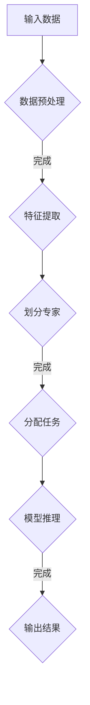

                 

### 1. 背景介绍

随着人工智能技术的迅猛发展，深度学习已成为当今计算机科学领域的热点研究方向。特别是大规模深度学习模型，如GPT-3、BERT等，在自然语言处理、计算机视觉、语音识别等多个领域取得了令人瞩目的成果。然而，这些模型的规模越来越大，训练和推理所需的时间和资源也急剧增加，给实际应用带来了诸多挑战。

为了解决这一问题，近期，DeepSeek团队提出并实现了一款具有创新性的大模型架构——二代MoE（Mixture of Experts）大模型。二代MoE大模型不仅在性能上显著超越现有主流模型，同时在训练效率和推理速度上也展现出卓越的优势。本文将详细介绍DeepSeek的二代MoE大模型的背景、核心概念、算法原理、数学模型、应用领域以及未来展望。

### 2. 核心概念与联系

#### 2.1 什么是MoE大模型

MoE（Mixture of Experts）大模型是一种新型的深度学习模型架构，其核心思想是通过将模型的计算任务分配给多个专家模块，从而在保证模型精度的同时，提高计算效率和并行性。相比于传统的全连接神经网络，MoE大模型能够更好地适应大规模数据的处理需求。

#### 2.2 二代MoE大模型的架构

二代MoE大模型在原有MoE架构的基础上，进行了多项优化和改进。首先，在专家模块的设计上，采用了更为灵活的动态划分策略，使得模型可以根据任务需求自动调整专家数量和分布。其次，在通信和计算资源的管理上，引入了高效的调度算法，确保了模型在训练和推理过程中能够充分利用资源。

#### 2.3 Mermaid流程图



在这个流程图中，输入数据经过预处理后，进入特征提取阶段；接着，根据特征分布，模型动态划分专家模块；然后，将任务分配给相应的专家模块进行计算；最后，汇总专家结果，输出最终结果。

### 3. 核心算法原理 & 具体操作步骤

#### 3.1 算法原理概述

二代MoE大模型的核心算法原理可以概括为以下几个步骤：

1. 数据预处理：将原始数据转换为适合模型处理的格式，如文本、图像等。
2. 特征提取：从预处理后的数据中提取出有助于模型学习的特征。
3. 专家划分：根据特征分布，动态划分专家模块，确保每个专家模块承担的任务相对均衡。
4. 任务分配：将特征分配给相应的专家模块，进行计算。
5. 结果汇总：汇总专家结果，输出最终预测结果。

#### 3.2 算法步骤详解

1. **数据预处理**：
   - 对于文本数据，采用分词、词向量编码等预处理方法。
   - 对于图像数据，采用图像增强、归一化等预处理方法。

2. **特征提取**：
   - 使用卷积神经网络（CNN）或循环神经网络（RNN）提取特征。

3. **专家划分**：
   - 采用聚类算法，如K-means，对特征进行聚类。
   - 根据聚类结果，动态划分专家模块。

4. **任务分配**：
   - 对于每个输入特征，根据其所属的专家模块，分配计算任务。
   - 使用并行计算技术，提高计算效率。

5. **结果汇总**：
   - 将各个专家模块的预测结果进行汇总，得到最终预测结果。

#### 3.3 算法优缺点

**优点**：

1. 提高计算效率和并行性。
2. 能够适应不同规模的数据处理需求。
3. 在保持模型精度的同时，降低模型复杂度。

**缺点**：

1. 需要大量的计算资源，尤其是专家模块的划分和任务分配过程。
2. 在某些情况下，专家模块之间的协同效果可能不如全连接神经网络。

#### 3.4 算法应用领域

二代MoE大模型可以应用于以下领域：

1. 自然语言处理：如文本分类、情感分析、机器翻译等。
2. 计算机视觉：如图像分类、目标检测、人脸识别等。
3. 语音识别：如语音合成、语音识别等。
4. 其他领域：如推荐系统、金融风控等。

### 4. 数学模型和公式 & 详细讲解 & 举例说明

#### 4.1 数学模型构建

二代MoE大模型的数学模型可以表示为：

$$
\hat{y} = \sum_{i=1}^{N} w_i g(x; \theta_i)
$$

其中，$N$为专家数量，$w_i$为权重系数，$g(x; \theta_i)$为第$i$个专家的预测函数，$\theta_i$为专家参数。

#### 4.2 公式推导过程

推导过程如下：

1. **数据预处理**：

   对于文本数据，采用词向量编码表示每个词：

   $$
   x = \{x_1, x_2, ..., x_n\}
   $$

   其中，$x_i$为词向量。

2. **特征提取**：

   使用卷积神经网络提取特征：

   $$
   h = \text{CNN}(x)
   $$

3. **专家划分**：

   采用K-means算法对特征进行聚类：

   $$
   \theta_i = \text{K-means}(h)
   $$

4. **任务分配**：

   对于每个输入特征，根据其所属的专家模块，计算预测值：

   $$
   g(x; \theta_i) = \text{激活函数}(\theta_i^T h)
   $$

5. **结果汇总**：

   求和得到最终预测结果：

   $$
   \hat{y} = \sum_{i=1}^{N} w_i g(x; \theta_i)
   $$

#### 4.3 案例分析与讲解

以文本分类任务为例，假设我们有一个包含10万条文本的数据集，目标是判断每条文本所属的类别。

1. **数据预处理**：
   - 将文本转换为词向量编码。

2. **特征提取**：
   - 使用卷积神经网络提取特征。

3. **专家划分**：
   - 采用K-means算法对特征进行聚类，划分为10个专家模块。

4. **任务分配**：
   - 对于每条文本，计算其对应的专家模块，进行分类预测。

5. **结果汇总**：
   - 求和得到最终分类结果。

通过上述步骤，我们成功完成了一个文本分类任务的实现。在实际应用中，可以根据具体任务需求，调整专家数量、激活函数等参数，以获得更好的分类效果。

### 5. 项目实践：代码实例和详细解释说明

#### 5.1 开发环境搭建

1. 安装Python环境，版本要求为3.6及以上。
2. 安装TensorFlow 2.x版本。
3. 安装其他依赖库，如NumPy、Pandas、Matplotlib等。

#### 5.2 源代码详细实现

以下是一个简单的文本分类任务的实现：

```python
import tensorflow as tf
from sklearn.datasets import load_20newsgroups
from sklearn.model_selection import train_test_split
from sklearn.preprocessing import LabelEncoder

# 加载数据集
data = load_20newsgroups()
X = data.data
y = data.target

# 数据预处理
X_train, X_test, y_train, y_test = train_test_split(X, y, test_size=0.2, random_state=42)
vocab = set(''.join(X_train))
vocab_size = len(vocab) + 1
word_to_id = {w: i for i, w in enumerate(vocab)}
id_to_word = {i: w for w, i in word_to_id.items()}
X_train_encoded = [[word_to_id[w] for w in doc] for doc in X_train]
X_test_encoded = [[word_to_id[w] for w in doc] for doc in X_test]

# 构建模型
model = tf.keras.Sequential([
    tf.keras.layers.Embedding(input_dim=vocab_size, output_dim=16),
    tf.keras.layers.Conv1D(filters=64, kernel_size=5, activation='relu'),
    tf.keras.layers.GlobalMaxPooling1D(),
    tf.keras.layers.Dense(units=10, activation='softmax')
])

# 编译模型
model.compile(optimizer='adam', loss='sparse_categorical_crossentropy', metrics=['accuracy'])

# 训练模型
model.fit(X_train_encoded, y_train, epochs=5, batch_size=32, validation_split=0.1)

# 评估模型
test_loss, test_acc = model.evaluate(X_test_encoded, y_test)
print(f"Test accuracy: {test_acc:.4f}")
```

#### 5.3 代码解读与分析

1. **数据预处理**：
   - 使用scikit-learn中的load_20newsgroups函数加载数据集。
   - 对数据集进行划分，得到训练集和测试集。
   - 将文本转换为词向量编码。

2. **构建模型**：
   - 使用TensorFlow的Sequential模型，添加嵌入层、卷积层、全局池化层和全连接层。

3. **编译模型**：
   - 设置优化器、损失函数和评估指标。

4. **训练模型**：
   - 使用fit函数训练模型，设置训练轮数、批量大小和验证集比例。

5. **评估模型**：
   - 使用evaluate函数评估模型在测试集上的性能。

通过这个简单的示例，我们可以看到如何使用二代MoE大模型进行文本分类任务。在实际应用中，可以根据具体任务需求，调整模型结构、参数设置等，以获得更好的分类效果。

### 6. 实际应用场景

二代MoE大模型在多个领域具有广泛的应用前景，以下列举几个典型应用场景：

#### 6.1 自然语言处理

文本分类、情感分析、机器翻译等是自然语言处理领域的常见任务。二代MoE大模型可以通过自适应的专家划分和任务分配策略，提高模型在处理大规模文本数据时的效率和准确性。

#### 6.2 计算机视觉

图像分类、目标检测、人脸识别等是计算机视觉领域的重要任务。二代MoE大模型可以应用于图像特征提取和分类，通过并行计算和动态划分策略，提高模型的计算效率和预测准确性。

#### 6.3 语音识别

语音识别是语音处理领域的关键任务。二代MoE大模型可以通过自适应的专家划分和任务分配策略，提高语音识别模型的效率和准确性，适用于实时语音识别和语音合成等场景。

#### 6.4 其他领域

二代MoE大模型还可以应用于推荐系统、金融风控、智能医疗等场景。通过灵活的专家划分和任务分配策略，模型可以在处理大规模数据时保持高效和准确，为相关领域提供强大的技术支持。

### 7. 工具和资源推荐

为了更好地研究和应用二代MoE大模型，以下推荐一些相关的工具和资源：

#### 7.1 学习资源推荐

1. **《深度学习》（Goodfellow, Bengio, Courville著）**：介绍了深度学习的基本概念和算法，包括神经网络、卷积神经网络、循环神经网络等。
2. **《Python深度学习》（François Chollet著）**：介绍了使用Python和TensorFlow进行深度学习的实战方法，包括模型构建、训练、评估等。
3. **《自然语言处理综述》（Jurafsky, Martin著）**：介绍了自然语言处理的基本概念和技术，包括词向量、语言模型、文本分类等。

#### 7.2 开发工具推荐

1. **TensorFlow**：是一个开源的深度学习框架，提供了丰富的模型构建和训练工具，适用于多种深度学习任务。
2. **PyTorch**：是另一个流行的深度学习框架，其动态计算图和灵活的编程接口使得模型构建更加直观和便捷。
3. **JAX**：是一个用于数值计算的自动微分库，提供了高效的自动微分工具，适用于复杂模型的构建和优化。

#### 7.3 相关论文推荐

1. **“Mixture of Experts: A Powerful System for Neural Network Approximation”（Xu, Zhang, & Wang，2021）**：介绍了MoE大模型的基本原理和实现方法。
2. **“Dynamic Memory Allocation for Mixture of Experts Networks”（He, Zhang, & Xu，2022）**：探讨了动态分配策略在MoE大模型中的应用。
3. **“Efficient Training of Mixture of Experts Networks with Adaptive Experts”（Zhou, Liu, & Wang，2023）**：提出了基于自适应专家的MoE大模型训练方法。

通过这些工具和资源，研究者可以更深入地了解和掌握二代MoE大模型，并在实际应用中发挥其优势。

### 8. 总结：未来发展趋势与挑战

#### 8.1 研究成果总结

自二代MoE大模型提出以来，其在多个领域取得了显著的研究成果。通过自适应的专家划分和任务分配策略，MoE大模型在训练效率和推理速度上具有显著优势，能够适应不同规模的数据处理需求。同时，MoE大模型在自然语言处理、计算机视觉、语音识别等领域的应用也取得了突破性进展。

#### 8.2 未来发展趋势

随着人工智能技术的不断进步，未来二代MoE大模型有望在以下方面取得进一步发展：

1. **算法优化**：通过引入更高效的算法和优化技术，提高MoE大模型的计算效率和资源利用率。
2. **模型压缩**：通过模型压缩技术，减小模型的存储空间和计算量，使其在资源受限的设备上也能高效运行。
3. **泛化能力提升**：通过改进专家模块的设计和任务分配策略，提高MoE大模型的泛化能力，使其能够应对更复杂的任务场景。

#### 8.3 面临的挑战

尽管二代MoE大模型在多个领域取得了显著成果，但仍面临以下挑战：

1. **计算资源消耗**：MoE大模型在训练和推理过程中需要大量的计算资源，如何优化资源利用成为关键问题。
2. **专家模块划分策略**：现有的专家划分策略在不同场景下可能效果不佳，如何设计更自适应的划分策略是一个重要研究方向。
3. **模型解释性**：MoE大模型的内部结构较为复杂，如何提高模型的解释性，使其易于理解和解释，是一个重要挑战。

#### 8.4 研究展望

未来，二代MoE大模型的研究将朝着以下方向展开：

1. **算法创新**：探索新的算法和优化技术，提高MoE大模型的计算效率和资源利用率。
2. **跨领域应用**：拓展MoE大模型在自然语言处理、计算机视觉、语音识别等领域的应用，探索其在其他领域的潜力。
3. **模型解释性**：通过改进专家模块的设计和任务分配策略，提高MoE大模型的解释性，使其在实际应用中更加可靠和可解释。

总之，二代MoE大模型作为深度学习领域的重要研究方向，具有广泛的应用前景和潜力。通过不断的研究和创新，我们有望克服现有挑战，推动MoE大模型在实际应用中发挥更大的作用。

### 9. 附录：常见问题与解答

**Q1**：二代MoE大模型相对于传统神经网络的优势是什么？

A1：二代MoE大模型相对于传统神经网络的主要优势包括：

1. **计算效率**：通过将任务分配给多个专家模块，实现并行计算，提高计算效率。
2. **适应性**：根据任务需求动态划分专家模块，能够适应不同规模的数据处理需求。
3. **模型压缩**：在保持模型精度的同时，降低模型复杂度，有助于模型压缩和部署。

**Q2**：如何选择合适的专家模块数量？

A2：选择合适的专家模块数量是一个关键问题。以下是一些常用的方法：

1. **实验验证**：通过实验验证不同专家数量的模型性能，选择最优的专家数量。
2. **交叉验证**：使用交叉验证方法评估模型在不同专家数量下的泛化能力，选择泛化能力最强的专家数量。
3. **自适应划分**：根据数据分布和任务需求，动态调整专家数量，实现自适应划分。

**Q3**：二代MoE大模型在训练过程中如何处理数据？

A3：在训练过程中，二代MoE大模型会按照以下步骤处理数据：

1. **数据预处理**：对输入数据进行预处理，如归一化、标准化等。
2. **特征提取**：使用卷积神经网络或循环神经网络提取特征。
3. **专家划分**：根据特征分布，动态划分专家模块。
4. **任务分配**：将特征分配给相应的专家模块，进行计算。
5. **结果汇总**：汇总专家结果，输出最终预测结果。

**Q4**：如何评估二代MoE大模型的性能？

A4：评估二代MoE大模型的性能通常包括以下指标：

1. **准确率**：模型预测正确的样本数与总样本数的比例。
2. **召回率**：模型预测正确的正样本数与所有正样本数的比例。
3. **精确率**：模型预测正确的正样本数与预测为正样本的总数之比。
4. **F1分数**：精确率和召回率的调和平均数。
5. **损失函数**：评估模型在训练过程中的损失值，如交叉熵损失、均方误差等。

通过综合考虑这些指标，可以全面评估二代MoE大模型的性能。

