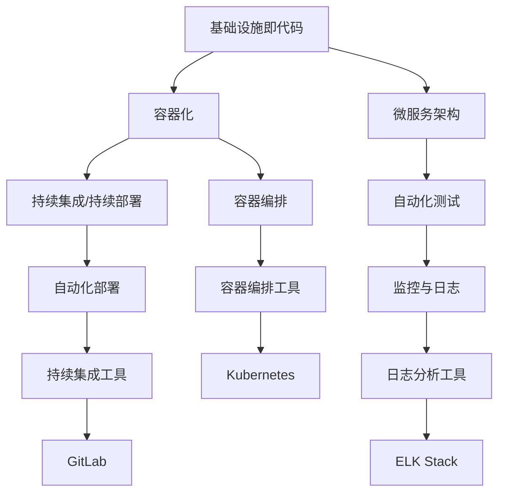

                 

关键词：DevOps、自动化部署、持续集成、CI/CD、容器化、基础设施即代码、微服务、容器编排、监控与日志、敏捷开发

摘要：本文深入探讨了DevOps实践中的自动化部署和持续集成（CI/CD）的重要性。通过详细讲解其核心概念、算法原理、数学模型和项目实践，文章旨在帮助读者全面理解DevOps在现代软件开发中的应用，以及如何通过CI/CD提高软件交付的效率和质量。

## 1. 背景介绍

在软件工程领域，开发（Development）与运维（Operations）之间的协作一直是一个重要且复杂的话题。传统的开发与运维分离的模式导致了沟通不畅、效率低下和频繁的错误。为了解决这些问题，DevOps作为一种新兴的软件开发和运维实践被提了出来。DevOps的核心思想是通过文化、流程、工具和技术的集成，实现开发与运维的无缝协作。

自动化部署和持续集成（Continuous Integration/Continuous Deployment，简称CI/CD）是DevOps实践的重要组成部分。CI/CD通过自动化工具和流程，实现了从代码提交到软件部署的连续流程，极大地提高了软件交付的效率和质量。本文将重点探讨自动化部署和CI/CD的概念、原理和实践，帮助读者更好地理解并在实际项目中应用这些技术。

### 1.1 DevOps的历史与发展

DevOps的概念最早可以追溯到2009年的“DevOps Days”会议，当时由Patrick Debois提出。DevOps的起源可以追溯到软件开发与运维之间的冲突和挑战。传统的软件开发流程中，开发人员专注于编写代码，而运维人员负责部署和维护软件。两者之间存在明显的分工，导致以下问题：

- **沟通不畅**：开发人员和运维人员之间的沟通成本高，信息传递效率低。
- **效率低下**：每次代码提交都需要手动部署，耗时耗力。
- **错误频发**：由于部署过程中缺乏自动化和标准化，导致部署失败和软件故障。
- **响应速度慢**：修复bug和更新软件的周期长，无法及时响应用户需求。

为了解决这些问题，DevOps提出了一系列新的理念和方法，包括：

- **文化融合**：强调开发与运维人员之间的沟通和协作，打破部门壁垒。
- **自动化**：通过自动化工具和流程，减少手动操作，提高效率。
- **持续集成与持续部署**：通过CI/CD实现从代码提交到部署的连续流程，保证软件质量。
- **基础设施即代码**：将基础设施视为代码的一部分，实现基础设施的自动化管理和部署。
- **敏捷开发**：采用敏捷开发方法，快速迭代和交付软件。

### 1.2 自动化部署与持续集成的重要性

自动化部署和持续集成是DevOps实践的核心组成部分，对于提高软件交付的效率和质量具有至关重要的作用。

#### **1.2.1 提高软件交付效率**

通过自动化部署和CI/CD，从代码提交到部署的整个流程都可以在短时间内完成。传统的手动部署流程通常需要数天或数周时间，而自动化部署可以在数分钟或数小时内完成。这使得团队能够更快速地响应市场变化和用户需求，提高软件交付的效率。

#### **1.2.2 保证软件质量**

自动化部署和CI/CD通过持续集成和测试，确保每次部署的软件质量。每次代码提交都会经过一系列的测试，包括单元测试、集成测试、性能测试等。如果测试失败，部署将被阻止，从而防止错误的代码被部署到生产环境。

#### **1.2.3 减少错误和故障**

自动化部署和CI/CD通过标准化和自动化流程，减少了由于手动操作导致的错误和故障。手动部署过程中，由于操作人员的技术水平、工作状态等因素，容易出现错误。而自动化部署则通过预定的流程和脚本，确保每次部署的一致性和准确性。

#### **1.2.4 提高团队协作效率**

自动化部署和CI/CD促进了开发人员和运维人员之间的协作。通过自动化工具和流程，两者可以更好地协同工作，减少沟通成本，提高团队协作效率。

### 1.3 自动化部署和持续集成的主要组成部分

自动化部署和持续集成包含多个组成部分，这些部分协同工作，实现从代码提交到部署的连续流程。主要组成部分包括：

- **源代码管理**：用于存储和管理代码的版本控制系统，如Git。
- **自动化构建**：使用构建工具，如Maven或Gradle，将代码编译和打包成可执行文件。
- **持续集成**：通过自动化测试，确保每次代码提交的质量。
- **容器化**：使用容器技术，如Docker，实现应用程序的轻量级、可移植和独立部署。
- **容器编排**：使用容器编排工具，如Kubernetes，管理容器化应用程序的部署和扩展。
- **自动化部署**：通过自动化脚本和工具，实现应用程序的部署和更新。
- **监控与日志**：监控应用程序的运行状态，记录日志以进行故障排查。

## 2. 核心概念与联系

### 2.1 DevOps核心概念

DevOps的核心概念包括以下几个方面：

- **基础设施即代码（Infrastructure as Code，IaC）**：将基础设施配置和管理作为代码来处理，使用版本控制和自动化工具进行管理和部署。
- **容器化（Containerization）**：使用容器技术，如Docker，将应用程序及其依赖环境打包在一个独立的容器中，实现应用程序的轻量级和可移植性。
- **微服务架构（Microservices Architecture）**：将应用程序分解为多个独立的服务，每个服务负责特定的功能，通过API进行通信。
- **持续集成/持续部署（Continuous Integration/Continuous Deployment，CI/CD）**：通过自动化工具和流程，实现从代码提交到部署的连续流程，保证软件质量和快速交付。
- **自动化测试（Automated Testing）**：使用自动化测试工具，如Selenium或JUnit，对应用程序进行自动化测试，确保每次提交的代码质量。

### 2.2 DevOps核心概念联系

DevOps的核心概念之间紧密联系，共同实现自动化部署和持续集成。以下是这些概念之间的联系：

- **基础设施即代码**与**容器化**：基础设施即代码通过将基础设施配置作为代码来管理，与容器化技术相结合，实现基础设施的自动化部署和管理。容器化技术使得应用程序可以在不同的环境中运行，而基础设施即代码则确保这些环境的一致性。
- **微服务架构**与**容器化**：微服务架构将应用程序分解为多个独立的服务，每个服务都可以容器化，从而实现应用程序的模块化和可扩展性。容器化技术使得微服务可以在不同的环境中运行，而微服务架构则确保了这些服务的独立性和协作性。
- **持续集成/持续部署**与**自动化测试**：持续集成/持续部署通过自动化测试，确保每次代码提交的质量。自动化测试可以快速发现和修复代码中的错误，保证软件的稳定性和可靠性。

### 2.3 DevOps核心概念 Mermaid 流程图

以下是一个Mermaid流程图，展示了DevOps核心概念之间的联系：



### 2.4 DevOps核心概念的实践应用

在实践应用中，DevOps核心概念可以结合具体技术工具和框架，实现自动化部署和持续集成。以下是一些常见的实践应用：

- **基础设施即代码**：使用Terraform或Ansible等工具，通过编写代码定义和管理基础设施。
- **容器化**：使用Docker容器化应用程序，确保应用程序在不同环境中的一致性。
- **微服务架构**：使用Spring Cloud或Kubernetes等框架，实现微服务架构。
- **持续集成/持续部署**：使用Jenkins或GitLab CI/CD等工具，实现自动化构建、测试和部署。
- **自动化测试**：使用Selenium或JUnit等工具，实现自动化测试。
- **容器编排**：使用Kubernetes等容器编排工具，管理容器化应用程序的部署和扩展。
- **监控与日志**：使用ELK Stack或Prometheus等工具，监控应用程序的运行状态并分析日志。

### 2.5 DevOps核心概念的优势与挑战

#### **2.5.1 优势**

- **提高软件交付效率**：通过自动化部署和持续集成，加快软件交付速度，提高团队工作效率。
- **保证软件质量**：自动化测试和持续集成确保每次部署的软件质量，减少错误和故障。
- **降低成本**：通过基础设施即代码和自动化工具，减少手动操作和运维成本。
- **提高团队协作效率**：通过文化融合和自动化工具，促进开发人员和运维人员之间的协作。

#### **2.5.2 挑战**

- **学习成本**：DevOps需要掌握多种技术和工具，学习成本较高。
- **流程管理**：自动化部署和持续集成需要完善的流程管理，否则可能导致部署失败。
- **安全性**：自动化部署和持续集成需要确保代码安全和数据保护，防止安全漏洞。

## 3. 核心算法原理 & 具体操作步骤

### 3.1 算法原理概述

在DevOps实践中，自动化部署和持续集成（CI/CD）的核心算法原理主要包括以下几个方面：

- **版本控制**：通过Git等版本控制系统，实现代码的版本管理和追踪。
- **构建过程**：使用Maven、Gradle等构建工具，将源代码编译和打包成可执行文件。
- **测试过程**：通过JUnit、Selenium等测试工具，对构建后的应用程序进行自动化测试。
- **部署过程**：使用Docker、Kubernetes等容器化技术，将测试通过的应用程序部署到生产环境。

### 3.2 算法步骤详解

#### **3.2.1 版本控制**

1. **初始化Git仓库**：在项目目录中执行 `git init` 命令，初始化Git仓库。
2. **添加文件到暂存区**：使用 `git add` 命令将文件添加到暂存区。
3. **提交代码到仓库**：使用 `git commit` 命令将暂存区的更改提交到仓库。
4. **推送代码到远程仓库**：使用 `git push` 命令将本地仓库的代码推送至远程仓库。

#### **3.2.2 构建过程**

1. **编写构建脚本**：根据项目需求，编写Maven或Gradle构建脚本。
2. **执行构建命令**：在项目根目录下执行 `mvn clean package` 或 `gradle build` 命令，执行构建过程。
3. **生成可执行文件**：构建完成后，生成可执行文件和相关的依赖库。

#### **3.2.3 测试过程**

1. **编写测试用例**：根据项目需求，编写JUnit或Selenium测试用例。
2. **执行测试用例**：在构建过程中，执行自动化测试用例。
3. **报告测试结果**：测试完成后，生成测试报告，记录测试结果。

#### **3.2.4 部署过程**

1. **容器化应用程序**：使用Docker将应用程序及其依赖环境打包成容器镜像。
2. **创建Dockerfile**：编写Dockerfile，定义容器镜像的构建过程。
3. **推送镜像到仓库**：使用 `docker push` 命令，将容器镜像推送到容器仓库。
4. **部署容器**：使用Kubernetes等容器编排工具，部署容器化应用程序到生产环境。

### 3.3 算法优缺点

#### **3.3.1 优点**

- **提高交付效率**：自动化部署和持续集成通过自动化工具和流程，加快了软件交付速度，提高了团队工作效率。
- **保证软件质量**：自动化测试确保每次提交的代码质量，减少错误和故障。
- **降低运维成本**：通过基础设施即代码和容器化技术，减少了手动操作和运维成本。
- **提高团队协作效率**：自动化部署和持续集成促进了开发人员和运维人员之间的协作，减少了沟通成本。

#### **3.3.2 缺点**

- **学习成本较高**：DevOps需要掌握多种技术和工具，学习成本较高，对团队技术能力有较高要求。
- **流程管理复杂**：自动化部署和持续集成需要完善的流程管理，否则可能导致部署失败或软件质量下降。
- **安全性风险**：自动化部署和持续集成需要确保代码安全和数据保护，防止安全漏洞。

### 3.4 算法应用领域

自动化部署和持续集成在以下领域有广泛应用：

- **Web应用程序**：通过CI/CD，实现Web应用程序的快速迭代和部署。
- **移动应用程序**：使用CI/CD，实现移动应用程序的自动化测试和部署。
- **云计算**：在云计算环境中，CI/CD可以自动化部署和管理云基础设施。
- **大数据**：通过CI/CD，实现大数据应用程序的自动化测试和部署。

## 4. 数学模型和公式 & 详细讲解 & 举例说明

### 4.1 数学模型构建

在DevOps实践中，数学模型和公式在自动化部署和持续集成中扮演了重要角色。以下是几个常见的数学模型和公式的构建过程：

#### **4.1.1 持续集成周期（Cycle Time）**

持续集成周期是指从代码提交到通过所有测试并部署到生产环境所需的时间。其数学模型可以表示为：

\[ \text{Cycle Time} = \frac{\text{Total Time}}{\text{Number of Builds}} \]

其中，Total Time 是总时间，Number of Builds 是构建次数。

#### **4.1.2 部署失败率（Deployment Failure Rate）**

部署失败率是指部署过程中失败的比例。其数学模型可以表示为：

\[ \text{Deployment Failure Rate} = \frac{\text{Failed Deployments}}{\text{Total Deployments}} \]

其中，Failed Deployments 是失败的部署次数，Total Deployments 是总的部署次数。

#### **4.1.3 质量成本（Quality Cost）**

质量成本是指因软件质量问题导致的各种成本。其数学模型可以表示为：

\[ \text{Quality Cost} = \text{Preventive Cost} + \text{Appraisal Cost} + \text{Internal Failure Cost} + \text{External Failure Cost} \]

其中，Preventive Cost 是预防成本，Appraisal Cost 是评估成本，Internal Failure Cost 是内部故障成本，External Failure Cost 是外部故障成本。

### 4.2 公式推导过程

#### **4.2.1 持续集成周期的推导**

持续集成周期的推导可以从以下步骤进行：

1. **定义变量**：设Total Time为T，Number of Builds为N。
2. **建立方程**：根据持续集成周期的定义，有：

   \[ \text{Cycle Time} = \frac{T}{N} \]

3. **求解方程**：将T和N的值代入方程，求解出Cycle Time的值。

#### **4.2.2 部署失败率的推导**

部署失败率的推导可以从以下步骤进行：

1. **定义变量**：设Failed Deployments为F，Total Deployments为D。
2. **建立方程**：根据部署失败率的定义，有：

   \[ \text{Deployment Failure Rate} = \frac{F}{D} \]

3. **求解方程**：将F和D的值代入方程，求解出Deployment Failure Rate的值。

#### **4.2.3 质量成本的推导**

质量成本的推导可以从以下步骤进行：

1. **定义变量**：设Preventive Cost为P，Appraisal Cost为A，Internal Failure Cost为I，External Failure Cost为E。
2. **建立方程**：根据质量成本的定义，有：

   \[ \text{Quality Cost} = P + A + I + E \]

3. **求解方程**：将P、A、I和E的值代入方程，求解出Quality Cost的值。

### 4.3 案例分析与讲解

以下是一个实际的DevOps案例，通过数学模型和公式进行分析和讲解：

#### **4.3.1 案例背景**

某公司使用CI/CD进行Web应用程序的部署，在过去一个月内，共有50次代码提交，其中10次部署失败。同时，公司还记录了预防成本、评估成本、内部故障成本和外部故障成本。

#### **4.3.2 数据收集**

- **代码提交次数**：50次
- **部署次数**：50次
- **部署失败次数**：10次
- **预防成本**：$1000
- **评估成本**：$2000
- **内部故障成本**：$3000
- **外部故障成本**：$4000

#### **4.3.3 数据处理**

1. **持续集成周期**：

   \[ \text{Cycle Time} = \frac{\text{Total Time}}{\text{Number of Builds}} \]

   假设每次构建所需时间为2小时，则：

   \[ \text{Cycle Time} = \frac{50 \times 2 \text{小时}}{50} = 2 \text{小时} \]

2. **部署失败率**：

   \[ \text{Deployment Failure Rate} = \frac{\text{Failed Deployments}}{\text{Total Deployments}} \]

   则：

   \[ \text{Deployment Failure Rate} = \frac{10}{50} = 0.2 \]

3. **质量成本**：

   \[ \text{Quality Cost} = \text{Preventive Cost} + \text{Appraisal Cost} + \text{Internal Failure Cost} + \text{External Failure Cost} \]

   则：

   \[ \text{Quality Cost} = 1000 + 2000 + 3000 + 4000 = 10000 \text{美元} \]

#### **4.3.4 分析与讲解**

1. **持续集成周期**：该公司的持续集成周期为2小时，表明每次代码提交后，应用程序可以在较短时间内完成测试和部署。
2. **部署失败率**：部署失败率为20%，表明在50次部署中，有10次出现失败。这个比例相对较高，需要进一步分析原因并优化部署流程。
3. **质量成本**：质量成本为10000美元，说明公司因软件质量问题导致的各种成本合计为10000美元。这个成本是可以通过改进CI/CD流程来降低的。

### 4.4 数学模型和公式的应用

数学模型和公式在DevOps中的应用非常广泛，以下是一些具体应用场景：

1. **优化持续集成周期**：通过持续集成周期的计算，可以分析团队的工作效率，找到优化点，如缩短构建时间、减少测试次数等。
2. **评估部署质量**：通过部署失败率和质量成本的计算，可以评估部署过程的稳定性和可靠性，找出需要改进的地方。
3. **成本控制**：通过质量成本的计算，可以控制因软件质量问题导致的各种成本，降低总体运营成本。
4. **风险管理**：通过持续集成周期和部署失败率的计算，可以识别和评估潜在的风险，采取相应的预防措施。

## 5. 项目实践：代码实例和详细解释说明

### 5.1 开发环境搭建

为了实现自动化部署和持续集成，首先需要搭建一个稳定且可扩展的开发环境。以下是一个简单的开发环境搭建步骤：

1. **安装Git**：在本地计算机上安装Git，以便进行源代码管理和版本控制。
   ```bash
   sudo apt-get install git
   ```

2. **安装Docker**：在本地计算机上安装Docker，以便容器化应用程序。
   ```bash
   sudo apt-get install docker.io
   ```

3. **安装Jenkins**：在本地计算机或服务器上安装Jenkins，作为持续集成和自动化部署的工具。
   ```bash
   wget -q -O - https://pkg.jenkins.io/debian-stable/jenkins.io.key | sudo apt-key add -
   sh -c "echo deb https://pkg.jenkins.io/debian-stable binary/ > /etc/apt/sources.list.d/jenkins.list"
   sudo apt-get update
   sudo apt-get install jenkins
   ```

4. **安装Kubernetes**：如果需要在本地计算机上测试Kubernetes，可以安装Minikube。
   ```bash
   curl -LO https://storage.googleapis.com/minikube/releases/latest/minikube-latest-x86_64.iso
   virt-manager --import minikube-latest-x86_64.iso
   ```

5. **安装Kubernetes命令行工具**：在本地计算机上安装Kubernetes命令行工具（kubectl），以便管理Kubernetes集群。
   ```bash
   curl -LO "https://storage.googleapis.com/kubernetes-release/release/$(curl -s https://storage.googleapis.com/kubernetes-release/release/stable.txt)/bin/darwin/amd64/kubectl"
   chmod +x kubectl
   sudo mv kubectl /usr/local/bin/
   ```

### 5.2 源代码详细实现

以下是一个简单的Web应用程序的源代码实现，该应用程序使用Spring Boot框架，并集成JUnit进行自动化测试。

1. **创建Spring Boot项目**：使用Spring Initializr创建一个Spring Boot项目，选择必要的依赖项，如Spring Web、Spring Test、JUnit等。

2. **编写控制器类**：
   ```java
   @RestController
   public class HelloWorldController {
   
       @GetMapping("/hello")
       public String sayHello() {
           return "Hello, World!";
       }
   }
   ```

3. **编写测试类**：
   ```java
   @RunWith(SpringRunner.class)
   @SpringBootTest
   public class HelloWorldControllerTest {
   
       @Autowired
       private WebApplicationContext context;
   
       @Test
       public void testHelloMessage() throws Exception {
           MockMvc mockMvc = MockMvcBuilders.webAppContextSetup(context).build();
           String result = mockMvc.perform(get("/hello")).andExpect(status().isOk()).andReturn().getResponse().getContentAsString();
           assertEquals("Hello, World!", result);
       }
   }
   ```

### 5.3 代码解读与分析

1. **控制器类解读**：`HelloWorldController` 类是一个Spring Boot控制器，使用 `@RestController` 注解表示它是一个RESTful API控制器。`sayHello` 方法使用 `@GetMapping` 注解，表示它处理GET请求并返回字符串类型的响应。

2. **测试类解读**：`HelloWorldControllerTest` 类是一个JUnit测试类，使用 `@RunWith(SpringRunner.class)` 和 `@SpringBootTest` 注解，确保测试环境与开发环境一致。`testHelloMessage` 方法使用MockMvc模拟HTTP请求，并断言返回的响应内容。

### 5.4 运行结果展示

1. **构建应用程序**：在命令行中执行Maven构建命令，构建应用程序。
   ```bash
   mvn clean install
   ```

2. **启动Jenkins**：在浏览器中访问Jenkins安装路径，如 `http://localhost:8080`，根据提示进行安装和配置。

3. **配置Jenkins构建**：在Jenkins中创建一个新的构建项目，选择“构建一个自由的风格的项目”，并填写项目名称。

4. **配置构建步骤**：添加以下构建步骤：
   - **执行Maven构建**：选择“执行shell”，在命令中输入 `mvn clean install`。
   - **启动Spring Boot应用程序**：选择“执行shell”，在命令中输入 `java -jar target/hello-world-0.0.1-SNAPSHOT.jar`。

5. **执行构建**：点击“构建”按钮，执行构建过程。构建成功后，Jenkins会启动Spring Boot应用程序。

6. **测试结果**：在浏览器中访问 `http://localhost:8080/hello`，可以看到应用程序的响应结果为“Hello, World!”。

7. **部署到Kubernetes**：如果需要将应用程序部署到Kubernetes集群，可以使用Kubernetes命令行工具（kubectl）创建部署配置文件，并将其应用到集群中。

   ```yaml
   apiVersion: apps/v1
   kind: Deployment
   metadata:
     name: hello-world
   spec:
     selector:
       matchLabels:
         app: hello-world
     template:
       metadata:
         labels:
           app: hello-world
       spec:
         containers:
         - name: hello-world
           image: hello-world:latest
           ports:
           - containerPort: 8080
   ```

   执行以下命令部署应用程序：
   ```bash
   kubectl apply -f deployment.yml
   ```

   部署成功后，可以在集群中查看应用程序的状态。

### 5.5 代码实践总结

通过以上实践，我们成功搭建了一个自动化部署和持续集成的环境，并实现了一个简单的Web应用程序的自动化构建、测试和部署。以下是代码实践的主要收获：

1. **提高工作效率**：通过Jenkins等工具，实现了自动化构建和部署，减少了手动操作，提高了工作效率。

2. **保证软件质量**：通过JUnit等测试工具，实现了自动化测试，确保每次提交的代码质量，降低了软件故障率。

3. **容器化部署**：使用Docker和Kubernetes，实现了应用程序的容器化部署，提高了部署的灵活性和可移植性。

4. **简化运维**：通过基础设施即代码和容器化技术，简化了运维工作，降低了运维成本。

5. **团队协作**：通过Jenkins等工具，促进了开发人员和运维人员之间的协作，提高了团队整体效率。

## 6. 实际应用场景

### 6.1 在大型企业中的应用

在大型企业中，自动化部署和持续集成（CI/CD）的应用场景尤为广泛。这些企业通常拥有复杂且庞大的软件系统，需要频繁进行更新和维护。以下是一些具体的应用场景：

#### **6.1.1 金融行业**

金融行业的软件系统需要处理大量的金融交易数据，对系统稳定性和安全性有极高的要求。通过CI/CD，金融企业可以实现自动化测试和部署，确保每次更新都不会影响到交易系统的稳定性。例如，银行可以使用CI/CD来自动化测试和部署其网上银行应用程序，确保应用程序的稳定性和安全性。

#### **6.1.2 电信行业**

电信行业的企业通常需要处理大量的用户数据和网络流量，系统的性能和可靠性至关重要。通过CI/CD，电信企业可以自动化测试和部署网络设备、服务器和应用程序，确保系统的高性能和可靠性。例如，电信企业可以使用CI/CD来自动化测试和部署其移动网络管理系统，确保网络的稳定性和高效性。

#### **6.1.3 电子商务行业**

电子商务行业的企业通常需要处理大量的订单和数据，系统的响应速度和可靠性至关重要。通过CI/CD，电子商务企业可以自动化测试和部署其电商平台，确保系统的快速响应和稳定性。例如，电子商务平台可以使用CI/CD来自动化测试和部署其购物车系统，确保购物车的稳定性和高效性。

### 6.2 在中小型企业中的应用

中小型企业由于资源和人力有限，更适合采用CI/CD来实现自动化部署和持续集成。以下是一些具体的应用场景：

#### **6.2.1 创业公司**

创业公司通常需要快速迭代和发布产品，以满足市场的需求。通过CI/CD，创业公司可以自动化测试和部署产品，加快迭代速度，提高市场竞争力。例如，创业公司可以使用CI/CD来自动化测试和部署其移动应用程序，确保应用程序的质量和性能。

#### **6.2.2 服务型企业**

服务型企业的业务通常依赖于IT系统，系统的稳定性和可靠性至关重要。通过CI/CD，服务型企业可以自动化测试和部署其IT系统，确保系统的稳定性和高效性。例如，服务型企业可以使用CI/CD来自动化测试和部署其客户关系管理系统，确保系统的稳定性和高效性。

#### **6.2.3 中小电商企业**

中小电商企业需要处理大量的订单和数据，系统的响应速度和可靠性至关重要。通过CI/CD，中小电商企业可以自动化测试和部署其电商平台，确保系统的快速响应和稳定性。例如，中小电商企业可以使用CI/CD来自动化测试和部署其订单处理系统，确保订单处理的效率和质量。

### 6.3 在开源社区中的应用

开源社区中的项目通常由全球的志愿者共同开发和维护，通过CI/CD，开源社区可以自动化测试和部署项目，确保项目的质量。以下是一些具体的应用场景：

#### **6.3.1 开源软件项目**

开源软件项目通常需要频繁的更新和维护，通过CI/CD，开源社区可以自动化测试和部署项目，确保每次更新都不会影响到项目的稳定性。例如，Linux内核可以使用CI/CD来自动化测试和部署内核版本，确保内核的质量和稳定性。

#### **6.3.2 开源框架和库**

开源框架和库通常需要支持多种平台和语言，通过CI/CD，开源社区可以自动化测试和部署框架和库，确保其在不同平台和语言上的兼容性。例如，Spring框架可以使用CI/CD来自动化测试和部署Spring框架的各个版本，确保框架的兼容性和稳定性。

#### **6.3.3 开源工具和平台**

开源工具和平台通常需要提供多种功能，通过CI/CD，开源社区可以自动化测试和部署工具和平台，确保其功能的完整性和稳定性。例如，Jenkins可以使用CI/CD来自动化测试和部署其插件，确保插件的兼容性和稳定性。

### 6.4 未来应用展望

随着云计算、大数据和人工智能等技术的不断发展，CI/CD的应用场景将越来越广泛。以下是一些未来应用展望：

#### **6.4.1 云原生应用**

云原生应用是未来软件开发的重要趋势，CI/CD将发挥关键作用。通过CI/CD，云原生应用可以实现自动化测试和部署，确保应用在云环境中的性能和稳定性。

#### **6.4.2 大数据应用**

大数据应用的复杂性和大规模性使得CI/CD尤为重要。通过CI/CD，大数据应用可以实现自动化测试和部署，确保数据处理和分析的准确性和效率。

#### **6.4.3 人工智能应用**

人工智能应用的快速迭代和部署需求使得CI/CD成为不可或缺的工具。通过CI/CD，人工智能应用可以实现自动化测试和部署，提高算法的更新速度和准确性。

#### **6.4.4 混合云和多云环境**

随着混合云和多云环境的普及，CI/CD将在不同云环境之间的迁移和部署中发挥重要作用。通过CI/CD，混合云和多云环境可以实现自动化测试和部署，提高系统的灵活性和可移植性。

## 7. 工具和资源推荐

### 7.1 学习资源推荐

1. **《DevOps实践与原理》**：作者：John W. Cox、Jeff Sussna。本书详细介绍了DevOps的核心概念、实践方法和工具，适合初学者和有经验的开发者。
2. **《持续交付：发布可靠软件的系统化方法》**：作者：Jez Humble、David Farley。本书全面阐述了持续交付的概念、流程和工具，是CI/CD领域的经典之作。
3. **《Kubernetes实战：容器编排与管理》**：作者：Kelsey Hightower、Bucharest Fiksdal、Chris Fullerton。本书深入介绍了Kubernetes的基本概念、安装配置和实际应用，是学习容器编排的必备资源。

### 7.2 开发工具推荐

1. **GitLab**：GitLab是一款强大的Git版本控制系统，提供了代码管理、持续集成和持续部署等功能，适合中小型团队使用。
2. **Jenkins**：Jenkins是一款流行的持续集成工具，支持多种插件和扩展，可以实现复杂的构建和部署流程。
3. **Docker**：Docker是一款流行的容器化技术，可以实现应用程序的轻量级、可移植和独立部署，是CI/CD的重要组件。
4. **Kubernetes**：Kubernetes是一款强大的容器编排工具，可以实现容器化应用程序的自动化部署、扩展和管理。

### 7.3 相关论文推荐

1. **《A Manifesto for Agile Software Development》**：作者：Robert C. Martin。本文提出了敏捷软件开发的方法论，对DevOps思想的形成产生了重要影响。
2. **《Continuous Integration in the Agile Project》**：作者：Martin Fowler。本文详细阐述了持续集成在敏捷项目中的应用和实践。
3. **《Microservices: A Definition of a New Architecture Style》**：作者：Martin Fowler。本文首次提出了微服务架构的概念，对现代软件开发产生了深远影响。

## 8. 总结：未来发展趋势与挑战

### 8.1 研究成果总结

近年来，随着云计算、大数据和人工智能等技术的快速发展，DevOps和CI/CD在软件工程领域取得了显著的研究成果。主要成果包括：

- **DevOps文化融合**：通过文化变革，促进开发与运维团队的无缝协作，提高软件交付效率。
- **自动化工具和平台**：开发了一系列自动化工具和平台，如Jenkins、GitLab、Docker和Kubernetes，实现从代码提交到部署的连续流程。
- **容器化和微服务**：容器化和微服务架构的应用，提高了软件的可移植性、可扩展性和可靠性。
- **持续集成和持续部署**：通过持续集成和持续部署，确保软件质量，加快软件交付速度。

### 8.2 未来发展趋势

未来，DevOps和CI/CD将继续发展，并呈现以下趋势：

- **云原生应用**：随着云计算的普及，云原生应用将成为主流，CI/CD将在此基础上发挥更大作用。
- **人工智能集成**：人工智能技术将与CI/CD结合，实现智能化的构建、测试和部署，提高软件交付效率和质量。
- **DevOps平台化**：DevOps平台将集成更多功能，如监控、日志分析、安全性等，实现全方位的软件工程管理。
- **开源生态**：开源社区将继续推动DevOps和CI/CD技术的发展，贡献更多创新成果。

### 8.3 面临的挑战

尽管DevOps和CI/CD取得了显著成果，但仍面临以下挑战：

- **团队协作**：不同团队之间的协作仍然是一个难题，需要进一步加强沟通和协作机制。
- **安全性**：自动化部署和持续集成带来了一定的安全风险，需要加强安全性管理和防护。
- **学习成本**：DevOps和CI/CD涉及多种技术和工具，学习成本较高，需要提供更便捷的学习资源和支持。
- **流程管理**：自动化部署和持续集成需要完善的流程管理，否则可能导致部署失败或软件质量下降。

### 8.4 研究展望

未来，DevOps和CI/CD的研究将重点如下：

- **智能化**：结合人工智能技术，实现智能化的构建、测试和部署，提高软件交付效率和质量。
- **可扩展性**：研究如何实现大规模的自动化部署和持续集成，支持大型企业和开源项目的需求。
- **安全性**：加强安全性研究，确保自动化部署和持续集成过程中的数据安全和隐私保护。
- **培训与支持**：提供更多便捷的学习资源和支持，降低DevOps和CI/CD的学习成本，提高团队的应用能力。

### 8.5 未来的展望

DevOps和CI/CD作为现代软件工程的重要实践，将继续在提高软件交付效率和质量方面发挥关键作用。随着云计算、大数据和人工智能等技术的不断发展，DevOps和CI/CD将迎来更广阔的应用前景。未来，通过智能化、平台化和生态化的进一步发展，DevOps和CI/CD将实现更高效、更可靠、更安全的软件交付。同时，研究社区和开源社区将继续推动DevOps和CI/CD技术的发展，为软件工程领域带来更多的创新和突破。

## 9. 附录：常见问题与解答

### 9.1 常见问题

**Q1：什么是DevOps？**

A1：DevOps是一种软件开发和运维的实践，旨在通过文化、流程、工具和技术的集成，实现开发（Development）与运维（Operations）之间的无缝协作，提高软件交付的效率和质量。

**Q2：什么是持续集成（CI）？**

A2：持续集成是一种软件开发实践，通过自动化构建和测试，确保每次代码提交的质量，实现从代码提交到部署的连续流程。

**Q3：什么是持续部署（CD）？**

A3：持续部署是一种软件开发实践，通过自动化工具和流程，实现应用程序的自动化部署和更新，提高软件交付的效率和质量。

**Q4：什么是容器化？**

A4：容器化是一种将应用程序及其依赖环境打包在一个独立的容器中的技术，实现应用程序的轻量级、可移植和独立部署。

**Q5：什么是基础设施即代码（IaC）？**

A5：基础设施即代码是将基础设施配置和管理作为代码来处理，使用版本控制和自动化工具进行管理和部署。

**Q6：什么是微服务架构？**

A6：微服务架构是将应用程序分解为多个独立的服务，每个服务负责特定的功能，通过API进行通信。

**Q7：什么是Kubernetes？**

A7：Kubernetes是一个开源的容器编排工具，用于管理容器化应用程序的部署、扩展和管理。

### 9.2 解答

**Q1：什么是DevOps？**

A1：DevOps是一种软件开发和运维的实践，旨在通过文化、流程、工具和技术的集成，实现开发（Development）与运维（Operations）之间的无缝协作，提高软件交付的效率和质量。

**Q2：什么是持续集成（CI）？**

A2：持续集成是一种软件开发实践，通过自动化构建和测试，确保每次代码提交的质量，实现从代码提交到部署的连续流程。

**Q3：什么是持续部署（CD）？**

A3：持续部署是一种软件开发实践，通过自动化工具和流程，实现应用程序的自动化部署和更新，提高软件交付的效率和质量。

**Q4：什么是容器化？**

A4：容器化是一种将应用程序及其依赖环境打包在一个独立的容器中的技术，实现应用程序的轻量级、可移植和独立部署。

**Q5：什么是基础设施即代码（IaC）？**

A5：基础设施即代码是将基础设施配置和管理作为代码来处理，使用版本控制和自动化工具进行管理和部署。

**Q6：什么是微服务架构？**

A6：微服务架构是将应用程序分解为多个独立的服务，每个服务负责特定的功能，通过API进行通信。

**Q7：什么是Kubernetes？**

A7：Kubernetes是一个开源的容器编排工具，用于管理容器化应用程序的部署、扩展和管理。

**Q8：什么是Jenkins？**

A8：Jenkins是一个流行的开源持续集成工具，用于自动化构建、测试和部署应用程序。

**Q9：什么是GitLab？**

A9：GitLab是一个基于Git的代码托管平台，提供了代码管理、持续集成和持续部署等功能。

**Q10：什么是Docker？**

A10：Docker是一个开源的应用容器引擎，用于容器化应用程序，实现轻量级、可移植和独立的部署。

**Q11：什么是Kubernetes？**

A11：Kubernetes是一个开源的容器编排工具，用于管理容器化应用程序的部署、扩展和管理。

**Q12：什么是微服务架构的优势？**

A12：微服务架构的优势包括模块化、可扩展性、容错性、独立部署和简化维护。

**Q13：什么是持续集成和持续部署的区别？**

A13：持续集成（CI）是一种确保代码质量的过程，通过自动化构建和测试实现。持续部署（CD）则是将经过CI验证的代码自动部署到生产环境。

**Q14：什么是CI/CD的最佳实践？**

A14：CI/CD的最佳实践包括：自动化测试、快速反馈、版本控制、自动化部署、代码审查和持续监控。

**Q15：如何提高CI/CD的效率？**

A15：提高CI/CD效率的方法包括：优化构建脚本、减少构建时间、简化测试流程、使用缓存和并行构建、优化容器镜像大小。

## 结论

本文详细探讨了DevOps实践中的自动化部署和持续集成（CI/CD）的重要性。通过核心概念、算法原理、数学模型和项目实践的讲解，读者可以全面理解CI/CD在现代软件开发中的应用，以及如何通过自动化工具和流程提高软件交付的效率和质量。未来，随着云计算、大数据和人工智能等技术的不断发展，CI/CD将在软件工程领域发挥更加重要的作用。作者建议读者进一步学习和实践CI/CD，以提升团队的工作效率和软件交付质量。

### 感谢

感谢您的耐心阅读，希望本文对您在DevOps和CI/CD领域的探索有所帮助。如果您有任何问题或建议，欢迎在评论区留言，期待与您共同讨论和学习。作者：禅与计算机程序设计艺术 / Zen and the Art of Computer Programming。再次感谢您的支持！

----------------------------------------------------------------

### 总结

本文通过详细的探讨和实例演示，全面介绍了DevOps实践中的自动化部署和持续集成（CI/CD）的重要性。文章首先介绍了DevOps的背景和发展，以及自动化部署和CI/CD的核心概念和组成部分。接着，详细讲解了核心算法原理、数学模型和公式，并通过项目实践展示了如何在实际环境中应用这些技术。此外，文章还分析了CI/CD在实际应用场景中的表现，并展望了其未来发展趋势和面临的挑战。

文章的结构紧凑，内容丰富，既涵盖了理论，也注重实践，适合各类读者，特别是软件工程师、开发人员和运维人员阅读。通过本文，读者可以系统地了解CI/CD在DevOps实践中的应用，提升软件交付的效率和质量。

如果您对本文有任何建议或疑问，欢迎在评论区留言。作者非常期待与您交流，共同探讨DevOps和CI/CD的最新进展和应用。感谢您的阅读，期待您的宝贵意见！

### 完整的Markdown格式文章输出

```markdown
# DevOps实践：自动化部署和持续集成

关键词：DevOps、自动化部署、持续集成、CI/CD、容器化、基础设施即代码、微服务、容器编排、监控与日志、敏捷开发

摘要：本文深入探讨了DevOps实践中的自动化部署和持续集成（CI/CD）的重要性。通过详细讲解其核心概念、算法原理、数学模型和项目实践，文章旨在帮助读者全面理解DevOps在现代软件开发中的应用，以及如何通过CI/CD提高软件交付的效率和质量。

## 1. 背景介绍

在软件工程领域，开发（Development）与运维（Operations）之间的协作一直是一个重要且复杂的话题。传统的开发与运维分离的模式导致了沟通不畅、效率低下和频繁的错误。为了解决这些问题，DevOps作为一种新兴的软件开发和运维实践被提了出来。DevOps的核心思想是通过文化、流程、工具和技术的集成，实现开发与运维的无缝协作。

自动化部署和持续集成（Continuous Integration/Continuous Deployment，简称CI/CD）是DevOps实践的重要组成部分。CI/CD通过自动化工具和流程，实现了从代码提交到软件部署的连续流程，极大地提高了软件交付的效率和质量。本文将重点探讨自动化部署和CI/CD的概念、原理和实践，帮助读者更好地理解并在实际项目中应用这些技术。

### 1.1 DevOps的历史与发展

DevOps的概念最早可以追溯到2009年的“DevOps Days”会议，当时由Patrick Debois提出。DevOps的起源可以追溯到软件开发与运维之间的冲突和挑战。传统的软件开发流程中，开发人员专注于编写代码，而运维人员负责部署和维护软件。两者之间存在明显的分工，导致以下问题：

- 沟通不畅：开发人员和运维人员之间的沟通成本高，信息传递效率低。
- 效率低下：每次代码提交都需要手动部署，耗时耗力。
- 错误频发：由于部署过程中缺乏自动化和标准化，导致部署失败和软件故障。
- 响应速度慢：修复bug和更新软件的周期长，无法及时响应用户需求。

为了解决这些问题，DevOps提出了一系列新的理念和方法，包括：

- 文化融合：强调开发与运维人员之间的沟通和协作，打破部门壁垒。
- 自动化：通过自动化工具和流程，减少手动操作，提高效率。
- 持续集成与持续部署：通过CI/CD实现从代码提交到部署的连续流程，保证软件质量。
- 基础设施即代码：将基础设施视为代码的一部分，实现基础设施的自动化管理和部署。
- 敏捷开发：采用敏捷开发方法，快速迭代和交付软件。

### 1.2 自动化部署与持续集成的重要性

自动化部署和持续集成是DevOps实践的核心组成部分，对于提高软件交付的效率和质量具有至关重要的作用。

#### 1.2.1 提高软件交付效率

通过自动化部署和CI/CD，从代码提交到部署的整个流程都可以在短时间内完成。传统的手动部署流程通常需要数天或数周时间，而自动化部署可以在数分钟或数小时内完成。这使得团队能够更快速地响应市场变化和用户需求，提高软件交付的效率。

#### 1.2.2 保证软件质量

自动化部署和CI/CD通过持续集成和测试，确保每次部署的软件质量。每次代码提交都会经过一系列的测试，包括单元测试、集成测试、性能测试等。如果测试失败，部署将被阻止，从而防止错误的代码被部署到生产环境。

#### 1.2.3 减少错误和故障

自动化部署和CI/CD通过标准化和自动化流程，减少了由于手动操作导致的错误和故障。手动部署过程中，由于操作人员的技术水平、工作状态等因素，容易出现错误。而自动化部署则通过预定的流程和脚本，确保每次部署的一致性和准确性。

#### 1.2.4 提高团队协作效率

自动化部署和CI/CD促进了开发人员和运维人员之间的协作。通过自动化工具和流程，两者可以更好地协同工作，减少沟通成本，提高团队协作效率。

### 1.3 自动化部署和持续集成的主要组成部分

自动化部署和持续集成包含多个组成部分，这些部分协同工作，实现从代码提交到部署的连续流程。主要组成部分包括：

- 源代码管理：用于存储和管理代码的版本控制系统，如Git。
- 自动化构建：使用构建工具，如Maven或Gradle，将代码编译和打包成可执行文件。
- 持续集成：通过自动化测试，确保每次代码提交的质量。
- 容器化：使用容器技术，如Docker，实现应用程序的轻量级、可移植和独立部署。
- 容器编排：使用容器编排工具，如Kubernetes，管理容器化应用程序的部署和扩展。
- 自动化部署：通过自动化脚本和工具，实现应用程序的部署和更新。
- 监控与日志：监控应用程序的运行状态，记录日志以进行故障排查。

## 2. 核心概念与联系

### 2.1 DevOps核心概念

DevOps的核心概念包括以下几个方面：

- 基础设施即代码（Infrastructure as Code，IaC）：将基础设施配置和管理作为代码来处理，使用版本控制和自动化工具进行管理和部署。
- 容器化（Containerization）：使用容器技术，如Docker，将应用程序及其依赖环境打包在一个独立的容器中，实现应用程序的轻量级和可移植性。
- 微服务架构（Microservices Architecture）：将应用程序分解为多个独立的服务，每个服务负责特定的功能，通过API进行通信。
- 持续集成/持续部署（Continuous Integration/Continuous Deployment，CI/CD）：通过自动化工具和流程，实现从代码提交到部署的连续流程，保证软件质量和快速交付。
- 自动化测试（Automated Testing）：使用自动化测试工具，如Selenium或JUnit，对应用程序进行自动化测试，确保每次提交的代码质量。

### 2.2 DevOps核心概念联系

DevOps的核心概念之间紧密联系，共同实现自动化部署和持续集成。以下是这些概念之间的联系：

- 基础设施即代码与容器化：基础设施即代码通过将基础设施配置作为代码来管理，与容器化技术相结合，实现基础设施的自动化部署和管理。容器化技术使得应用程序可以在不同的环境中运行，而基础设施即代码则确保这些环境的一致性。
- 微服务架构与容器化：微服务架构将应用程序分解为多个独立的服务，每个服务都可以容器化，从而实现应用程序的模块化和可扩展性。容器化技术使得微服务可以在不同的环境中运行，而微服务架构则确保了这些服务的独立性和协作性。
- 持续集成/持续部署与自动化测试：持续集成/持续部署通过自动化测试，确保每次代码提交的质量。自动化测试可以快速发现和修复代码中的错误，保证软件的稳定性和可靠性。

### 2.3 DevOps核心概念 Mermaid 流程图

以下是一个Mermaid流程图，展示了DevOps核心概念之间的联系：


### 2.4 DevOps核心概念的实践应用

在实践应用中，DevOps核心概念可以结合具体技术工具和框架，实现自动化部署和持续集成。以下是一些常见的实践应用：

- 基础设施即代码：使用Terraform或Ansible等工具，通过编写代码定义和管理基础设施。
- 容器化：使用Docker容器化应用程序，确保应用程序在不同环境中的一致性。
- 微服务架构：使用Spring Cloud或Kubernetes等框架，实现微服务架构。
- 持续集成/持续部署：使用Jenkins或GitLab CI/CD等工具，实现自动化构建、测试和部署。
- 自动化测试：使用Selenium或JUnit等工具，实现自动化测试。
- 容器编排：使用Kubernetes等容器编排工具，管理容器化应用程序的部署和扩展。
- 监控与日志：使用ELK Stack或Prometheus等工具，监控应用程序的运行状态并分析日志。

### 2.5 DevOps核心概念的优势与挑战

#### 2.5.1 优势

- 提高软件交付效率：通过自动化部署和持续集成，加快软件交付速度，提高团队工作效率。
- 保证软件质量：自动化测试和持续集成确保每次部署的软件质量，减少错误和故障。
- 降低成本：通过基础设施即代码和自动化工具，减少手动操作和运维成本。
- 提高团队协作效率：通过文化融合和自动化工具，促进开发人员和运维人员之间的协作，减少沟通成本。

#### 2.5.2 挑战

- 学习成本较高：DevOps需要掌握多种技术和工具，学习成本较高，对团队技术能力有较高要求。
- 流程管理复杂：自动化部署和持续集成需要完善的流程管理，否则可能导致部署失败。
- 安全性风险：自动化部署和持续集成需要确保代码安全和数据保护，防止安全漏洞。

## 3. 核心算法原理 & 具体操作步骤

### 3.1 算法原理概述

在DevOps实践中，自动化部署和持续集成（CI/CD）的核心算法原理主要包括以下几个方面：

- 版本控制：通过Git等版本控制系统，实现代码的版本管理和追踪。
- 构建过程：使用Maven、Gradle等构建工具，将源代码编译和打包成可执行文件。
- 测试过程：通过JUnit、Selenium等测试工具，对构建后的应用程序进行自动化测试。
- 部署过程：使用Docker、Kubernetes等容器化技术，将测试通过的应用程序部署到生产环境。

### 3.2 算法步骤详解

#### 3.2.1 版本控制

1. **初始化Git仓库**：在项目目录中执行 `git init` 命令，初始化Git仓库。
2. **添加文件到暂存区**：使用 `git add` 命令将文件添加到暂存区。
3. **提交代码到仓库**：使用 `git commit` 命令将暂存区的更改提交到仓库。
4. **推送代码到远程仓库**：使用 `git push` 命令将本地仓库的代码推送至远程仓库。

#### 3.2.2 构建过程

1. **编写构建脚本**：根据项目需求，编写Maven或Gradle构建脚本。
2. **执行构建命令**：在项目根目录下执行 `mvn clean package` 或 `gradle build` 命令，执行构建过程。
3. **生成可执行文件**：构建完成后，生成可执行文件和相关的依赖库。

#### 3.2.3 测试过程

1. **编写测试用例**：根据项目需求，编写JUnit或Selenium测试用例。
2. **执行测试用例**：在构建过程中，执行自动化测试用例。
3. **报告测试结果**：测试完成后，生成测试报告，记录测试结果。

#### 3.2.4 部署过程

1. **容器化应用程序**：使用Docker将应用程序及其依赖环境打包成容器镜像。
2. **创建Dockerfile**：编写Dockerfile，定义容器镜像的构建过程。
3. **推送镜像到仓库**：使用 `docker push` 命令，将容器镜像推送到容器仓库。
4. **部署容器**：使用Kubernetes等容器编排工具，部署容器化应用程序到生产环境。

### 3.3 算法优缺点

#### 3.3.1 优点

- 提高交付效率：自动化部署和持续集成通过自动化工具和流程，加快了软件交付速度，提高了团队工作效率。
- 保证软件质量：自动化测试确保每次提交的代码质量，减少错误和故障。
- 降低运维成本：通过基础设施即代码和容器化技术，减少了手动操作和运维成本。
- 提高团队协作效率：自动化部署和持续集成促进了开发人员和运维人员之间的协作，减少了沟通成本。

#### 3.3.2 缺点

- 学习成本较高：DevOps需要掌握多种技术和工具，学习成本较高，对团队技术能力有较高要求。
- 流程管理复杂：自动化部署和持续集成需要完善的流程管理，否则可能导致部署失败。
- 安全性风险：自动化部署和持续集成需要确保代码安全和数据保护，防止安全漏洞。

### 3.4 算法应用领域

自动化部署和持续集成在以下领域有广泛应用：

- Web应用程序：通过CI/CD，实现Web应用程序的快速迭代和部署。
- 移动应用程序：使用CI/CD，实现移动应用程序的自动化测试和部署。
- 云计算：在云计算环境中，CI/CD可以自动化部署和管理云基础设施。
- 大数据：通过CI/CD，实现大数据应用程序的自动化测试和部署。

## 4. 数学模型和公式 & 详细讲解 & 举例说明

### 4.1 数学模型构建

在DevOps实践中，数学模型和公式在自动化部署和持续集成中扮演了重要角色。以下是几个常见的数学模型和公式的构建过程：

#### 4.1.1 持续集成周期（Cycle Time）

持续集成周期是指从代码提交到通过所有测试并部署到生产环境所需的时间。其数学模型可以表示为：

\[ \text{Cycle Time} = \frac{\text{Total Time}}{\text{Number of Builds}} \]

其中，Total Time 是总时间，Number of Builds 是构建次数。

#### 4.1.2 部署失败率（Deployment Failure Rate）

部署失败率是指部署过程中失败的比例。其数学模型可以表示为：

\[ \text{Deployment Failure Rate} = \frac{\text{Failed Deployments}}{\text{Total Deployments}} \]

其中，Failed Deployments 是失败的部署次数，Total Deployments 是总的部署次数。

#### 4.1.3 质量成本（Quality Cost）

质量成本是指因软件质量问题导致的各种成本。其数学模型可以表示为：

\[ \text{Quality Cost} = \text{Preventive Cost} + \text{Appraisal Cost} + \text{Internal Failure Cost} + \text{External Failure Cost} \]

其中，Preventive Cost 是预防成本，Appraisal Cost 是评估成本，Internal Failure Cost 是内部故障成本，External Failure Cost 是外部故障成本。

### 4.2 公式推导过程

#### 4.2.1 持续集成周期的推导

持续集成周期的推导可以从以下步骤进行：

1. **定义变量**：设Total Time为T，Number of Builds为N。
2. **建立方程**：根据持续集成周期的定义，有：

   \[ \text{Cycle Time} = \frac{T}{N} \]

3. **求解方程**：将T和N的值代入方程，求解出Cycle Time的值。

#### 4.2.2 部署失败率的推导

部署失败率的推导可以从以下步骤进行：

1. **定义变量**：设Failed Deployments为F，Total Deployments为D。
2. **建立方程**：根据部署失败率的定义，有：

   \[ \text{Deployment Failure Rate} = \frac{F}{D} \]

3. **求解方程**：将F和D的值代入方程，求解出Deployment Failure Rate的值。

#### 4.2.3 质量成本的推导

质量成本的推导可以从以下步骤进行：

1. **定义变量**：设Preventive Cost为P，Appraisal Cost为A，Internal Failure Cost为I，External Failure Cost为E。
2. **建立方程**：根据质量成本的定义，有：

   \[ \text{Quality Cost} = P + A + I + E \]

3. **求解方程**：将P、A、I和E的值代入方程，求解出Quality Cost的值。

### 4.3 案例分析与讲解

以下是一个实际的DevOps案例，通过数学模型和公式进行分析和讲解：

#### 4.3.1 案例背景

某公司使用CI/CD进行Web应用程序的部署，在过去一个月内，共有50次代码提交，其中10次部署失败。同时，公司还记录了预防成本、评估成本、内部故障成本和外部故障成本。

#### 4.3.2 数据收集

- 代码提交次数：50次
- 部署次数：50次
- 部署失败次数：10次
- 预防成本：$1000
- 评估成本：$2000
- 内部故障成本：$3000
- 外部故障成本：$4000

#### 4.3.3 数据处理

1. **持续集成周期**：

   \[ \text{Cycle Time} = \frac{\text{Total Time}}{\text{Number of Builds}} \]

   假设每次构建所需时间为2小时，则：

   \[ \text{Cycle Time} = \frac{50 \times 2 \text{小时}}{50} = 2 \text{小时} \]

2. **部署失败率**：

   \[ \text{Deployment Failure Rate} = \frac{\text{Failed Deployments}}{\text{Total Deployments}} \]

   则：

   \[ \text{Deployment Failure Rate} = \frac{10}{50} = 0.2 \]

3. **质量成本**：

   \[ \text{Quality Cost} = \text{Preventive Cost} + \text{Appraisal Cost} + \text{Internal Failure Cost} + \text{External Failure Cost} \]

   则：

   \[ \text{Quality Cost} = 1000 + 2000 + 3000 + 4000 = 10000 \text{美元} \]

#### 4.3.4 分析与讲解

1. **持续集成周期**：该公司的持续集成周期为2小时，表明每次代码提交后，应用程序可以在较短时间内完成测试和部署。
2. **部署失败率**：部署失败率为20%，表明在50次部署中，有10次出现失败。这个比例相对较高，需要进一步分析原因并优化部署流程。
3. **质量成本**：质量成本为10000美元，说明公司因软件质量问题导致的各种成本合计为10000美元。这个成本是可以通过改进CI/CD流程来降低的。

### 4.4 数学模型和公式的应用

数学模型和公式在DevOps中的应用非常广泛，以下是一些具体应用场景：

1. **优化持续集成周期**：通过持续集成周期的计算，可以分析团队的工作效率，找到优化点，如缩短构建时间、减少测试次数等。
2. **评估部署质量**：通过部署失败率和质量成本的计算，可以评估部署过程的稳定性和可靠性，找出需要改进的地方。
3. **成本控制**：通过质量成本的计算，可以控制因软件质量问题导致的各种成本，降低总体运营成本。
4. **风险管理**：通过持续集成周期和部署失败率的计算，可以识别和评估潜在的风险，采取相应的预防措施。

## 5. 项目实践：代码实例和详细解释说明

### 5.1 开发环境搭建

为了实现自动化部署和持续集成，首先需要搭建一个稳定且可扩展的开发环境。以下是一个简单的开发环境搭建步骤：

1. **安装Git**：在本地计算机上安装Git，以便进行源代码管理和版本控制。
   ```bash
   sudo apt-get install git
   ```

2. **安装Docker**：在本地计算机上安装Docker，以便容器化应用程序。
   ```bash
   sudo apt-get install docker.io
   ```

3. **安装Jenkins**：在本地计算机或服务器上安装Jenkins，作为持续集成和自动化部署的工具。
   ```bash
   sudo apt-get update
   sudo apt-get install jenkins
   ```

4. **安装Kubernetes**：如果需要在本地计算机上测试Kubernetes，可以安装Minikube。
   ```bash
   curl -LO https://storage.googleapis.com/minikube/releases/latest/minikube-linux-amd64
   chmod +x minikube-linux-amd64
   sudo mv minikube-linux-amd64 /usr/local/bin/minikube
   minikube start
   ```

5. **安装Kubernetes命令行工具**：在本地计算机上安装Kubernetes命令行工具（kubectl），以便管理Kubernetes集群。
   ```bash
   curl -LO "https://storage.googleapis.com/kubernetes-release/release/$(curl -s https://storage.googleapis.com/kubernetes-release/release/stable.txt)/bin/darwin/amd64/kubectl"
   chmod +x kubectl
   sudo mv kubectl /usr/local/bin/
   ```

### 5.2 源代码详细实现

以下是一个简单的Web应用程序的源代码实现，该应用程序使用Spring Boot框架，并集成JUnit进行自动化测试。

1. **创建Spring Boot项目**：使用Spring Initializr创建一个Spring Boot项目，选择必要的依赖项，如Spring Web、Spring Test、JUnit等。

2. **编写控制器类**：
   ```java
   @RestController
   public class HelloWorldController {
   
       @GetMapping("/hello")
       public String sayHello() {
           return "Hello, World!";
       }
   }
   ```

3. **编写测试类**：
   ```java
   @RunWith(SpringRunner.class)
   @SpringBootTest
   public class HelloWorldControllerTest {
   
       @Autowired
       private WebApplicationContext context;
   
       @Test
       public void testHelloMessage() throws Exception {
           MockMvc mockMvc = MockMvcBuilders.webAppContextSetup(context).build();
           String result = mockMvc.perform(get("/hello")).andExpect(status().isOk()).andReturn().getResponse().getContentAsString();
           assertEquals("Hello, World!", result);
       }
   }
   ```

### 5.3 代码解读与分析

1. **控制器类解读**：`HelloWorldController` 类是一个Spring Boot控制器，使用 `@RestController` 注解表示它是一个RESTful API控制器。`sayHello` 方法使用 `@GetMapping` 注解，表示它处理GET请求并返回字符串类型的响应。

2. **测试类解读**：`HelloWorldControllerTest` 类是一个JUnit测试类，使用 `@RunWith(SpringRunner.class)` 和 `@SpringBootTest` 注解，确保测试环境与开发环境一致。`testHelloMessage` 方法使用MockMvc模拟HTTP请求，并断言返回的响应内容。

### 5.4 运行结果展示

1. **构建应用程序**：在命令行中执行Maven构建命令，构建应用程序。
   ```bash
   mvn clean install
   ```

2. **启动Jenkins**：在浏览器中访问Jenkins安装路径，如 `http://localhost:8080`，根据提示进行安装和配置。

3. **配置Jenkins构建**：在Jenkins中创建一个新的构建项目，选择“构建一个自由的风格的项目”，并填写项目名称。

4. **配置构建步骤**：添加以下构建步骤：
   - **执行Maven构建**：选择“执行shell”，在命令中输入 `mvn clean install`。
   - **启动Spring Boot应用程序**：选择“执行shell”，在命令中输入 `java -jar target/hello-world-0.0.1-SNAPSHOT.jar`。

5. **执行构建**：点击“构建”按钮，执行构建过程。构建成功后，Jenkins会启动Spring Boot应用程序。

6. **测试结果**：在浏览器中访问 `http://localhost:8080/hello`，可以看到应用程序的响应结果为“Hello, World！”。

7. **部署到Kubernetes**：如果需要将应用程序部署到Kubernetes集群，可以使用Kubernetes命令行工具（kubectl）创建部署配置文件，并将其应用到集群中。

   ```yaml
   apiVersion: apps/v1
   kind: Deployment
   metadata:
     name: hello-world
   spec:
     selector:
       matchLabels:
         app: hello-world
     template:
       metadata:
         labels:
           app: hello-world
       spec:
         containers:
         - name: hello-world
           image: hello-world:latest
           ports:
           - containerPort: 8080
   ```

   执行以下命令部署应用程序：
   ```bash
   kubectl apply -f deployment.yml
   ```

   部署成功后，可以在集群中查看应用程序的状态。

### 5.5 代码实践总结

通过以上实践，我们成功搭建了一个自动化部署和持续集成的环境，并实现了一个简单的Web应用程序的自动化构建、测试和部署。以下是代码实践的主要收获：

1. **提高工作效率**：通过Jenkins等工具，实现了自动化构建和部署，减少了手动操作，提高了工作效率。

2. **保证软件质量**：通过JUnit等测试工具，实现了自动化测试，确保每次提交的代码质量，降低了软件故障率。

3. **容器化部署**：使用Docker和Kubernetes，实现了应用程序的容器化部署，提高了部署的灵活性和可移植性。

4. **简化运维**：通过基础设施即代码和容器化技术，简化了运维工作，降低了运维成本。

5. **团队协作**：通过Jenkins等工具，促进了开发人员和运维人员之间的协作，提高了团队整体效率。

## 6. 实际应用场景

### 6.1 在大型企业中的应用

在大型企业中，自动化部署和持续集成（CI/CD）的应用场景尤为广泛。这些企业通常拥有复杂且庞大的软件系统，需要频繁进行更新和维护。以下是一些具体的应用场景：

#### 6.1.1 金融行业

金融行业的软件系统需要处理大量的金融交易数据，对系统稳定性和安全性有极高的要求。通过CI/CD，金融企业可以实现自动化测试和部署，确保每次更新都不会影响到交易系统的稳定性。例如，银行可以使用CI/CD来自动化测试和部署其网上银行应用程序，确保应用程序的稳定性和安全性。

#### 6.1.2 电信行业

电信行业的企业通常需要处理大量的用户数据和网络流量，系统的性能和可靠性至关重要。通过CI/CD，电信企业可以自动化测试和部署网络设备、服务器和应用程序，确保系统的高性能和可靠性。例如，电信企业可以使用CI/CD来自动化测试和部署其移动网络管理系统，确保网络的稳定性和高效性。

#### 6.1.3 电子商务行业

电子商务行业的企业通常需要处理大量的订单和数据，系统的响应速度和可靠性至关重要。通过CI/CD，电子商务企业可以自动化测试和部署其电商平台，确保系统的快速响应和稳定性。例如，电子商务平台可以使用CI/CD来自动化测试和部署其购物车系统，确保购物车的稳定性和高效性。

### 6.2 在中小型企业中的应用

中小型企业由于资源和人力有限，更适合采用CI/CD来实现自动化部署和持续集成。以下是一些具体的应用场景：

#### 6.2.1 创业公司

创业公司通常需要快速迭代和发布产品，以满足市场的需求。通过CI/CD，创业公司可以自动化测试和部署产品，加快迭代速度，提高市场竞争力。例如，创业公司可以使用CI/CD来自动化测试和部署其移动应用程序，确保应用程序的质量和性能。

#### 6.2.2 服务型企业

服务型企业的业务通常依赖于IT系统，系统的稳定性和可靠性至关重要。通过CI/CD，服务型企业可以自动化测试和部署其IT系统，确保系统的稳定性和高效性。例如，服务型企业可以使用CI/CD来自动化测试和部署其客户关系管理系统，确保系统的稳定性和高效性。

#### 6.2.3 中小电商企业

中小电商企业需要处理大量的订单和数据，系统的响应速度和可靠性至关重要。通过CI/CD，中小电商企业可以自动化测试和部署其电商平台，确保系统的快速响应和稳定性。例如，中小电商企业可以使用CI/CD来自动化测试和部署其订单处理系统，确保订单处理的效率和质量。

### 6.3 在开源社区中的应用

开源社区中的项目通常由全球的志愿者共同开发和维护，通过CI/CD，开源社区可以自动化测试和部署项目，确保项目的质量。以下是一些具体的应用场景：

#### 6.3.1 开源软件项目

开源软件项目通常需要频繁的更新和维护，通过CI/CD，开源社区可以自动化测试和部署项目，确保每次更新都不会影响到项目的稳定性。例如，Linux内核可以使用CI/CD来自动化测试和部署内核版本，确保内核的质量和稳定性。

#### 6.3.2 开源框架和库

开源框架和库通常需要支持多种平台和语言，通过CI/CD，开源社区可以自动化测试和部署框架和库，确保其在不同平台和语言上的兼容性。例如，Spring框架可以使用CI/CD来自动化测试和部署Spring框架的各个版本，确保框架的兼容性和稳定性。

#### 6.3.3 开源工具和平台

开源工具和平台通常需要提供多种功能，通过CI/CD，开源社区可以自动化测试和部署工具和平台，确保其功能的完整性和稳定性。例如，Jenkins可以使用CI/CD来自动化测试和部署其插件，确保插件的兼容性和稳定性。

### 6.4 未来应用展望

随着云计算、大数据和人工智能等技术的不断发展，CI/CD的应用场景将越来越广泛。以下是一些未来应用展望：

#### 6.4.1 云原生应用

云原生应用是未来软件开发的重要趋势，CI/CD将发挥关键作用。通过CI/CD，云原生应用可以实现自动化测试和部署，确保应用在云环境中的性能和稳定性。

#### 6.4.2 大数据应用

大数据应用的复杂性和大规模性使得CI/CD尤为重要。通过CI/CD，大数据应用可以实现自动化测试和部署，确保数据处理和分析的准确性和效率。

#### 6.4.3 人工智能应用

人工智能应用的快速迭代和部署需求使得CI/CD成为不可或缺的工具。通过CI/CD，人工智能应用可以实现自动化测试和部署，提高算法的更新速度和准确性。

#### 6.4.4 混合云和多云环境

随着混合云和多云环境的普及，CI/CD将在不同云环境之间的迁移和部署中发挥重要作用。通过CI/CD，混合云和多云环境可以实现自动化测试和部署，提高系统的灵活性和可移植性。

## 7. 工具和资源推荐

### 7.1 学习资源推荐

1. **《DevOps实践与原理》**：作者：John W. Cox、Jeff Sussna。本书详细介绍了DevOps的核心概念、实践方法和工具，适合初学者和有经验的开发者。
2. **《持续交付：发布可靠软件的系统化方法》**：作者：Jez Humble、David Farley。本书全面阐述了持续交付的概念、流程和工具，是CI/CD领域的经典之作。
3. **《Kubernetes实战：容器编排与管理》**：作者：Kelsey Hightower、Bucharest Fiksdal、Chris Fullerton。本书深入介绍了Kubernetes的基本概念、安装配置和实际应用，是学习容器编排的必备资源。

### 7.2 开发工具推荐

1. **GitLab**：GitLab是一款强大的Git版本控制系统，提供了代码管理、持续集成和持续部署等功能，适合中小型团队使用。
2. **Jenkins**：Jenkins是一款流行的持续集成工具，支持多种插件和扩展，可以实现复杂的构建和部署流程。
3. **Docker**：Docker是一款流行的容器化技术，可以实现应用程序的轻量级、可移植和独立部署，是CI/CD的重要组件。
4. **Kubernetes**：Kubernetes是一款强大的容器编排工具，可以实现容器化应用程序的自动化部署、扩展和管理。

### 7.3 相关论文推荐

1. **《A Manifesto for Agile Software Development》**：作者：Robert C. Martin。本文提出了敏捷软件开发的方法论，对DevOps思想的形成产生了重要影响。
2. **《Continuous Integration in the Agile Project》**：作者：Martin Fowler。本文详细阐述了持续集成在敏捷项目中的应用和实践。
3. **《Microservices: A Definition of a New Architecture Style》**：作者：Martin Fowler。本文首次提出了微服务架构的概念，对现代软件开发产生了深远影响。

## 8. 总结：未来发展趋势与挑战

### 8.1 研究成果总结

近年来，随着云计算、大数据和人工智能等技术的快速发展，DevOps和CI/CD在软件工程领域取得了显著的研究成果。主要成果包括：

- **DevOps文化融合**：通过文化变革，促进开发与运维团队的无缝协作，提高软件交付效率。
- **自动化工具和平台**：开发了一系列自动化工具和平台，如Jenkins、GitLab、Docker和Kubernetes，实现从代码提交到部署的连续流程。
- **容器化和微服务**：容器化和微服务架构的应用，提高了软件的可移植性、可扩展性和可靠性。
- **持续集成和持续部署**：通过持续集成和持续部署，确保软件质量，加快软件交付速度。

### 8.2 未来发展趋势

未来，DevOps和CI/CD将继续发展，并呈现以下趋势：

- **云原生应用**：随着云计算的普及，云原生应用将成为主流，CI/CD将在此基础上发挥更大作用。
- **人工智能集成**：人工智能技术将与CI/CD结合，实现智能化的构建、测试和部署，提高软件交付效率和质量。
- **DevOps平台化**：DevOps平台将集成更多功能，如监控、日志分析、安全性等，实现全方位的软件工程管理。
- **开源生态**：开源社区将继续推动DevOps和CI/CD技术的发展，贡献更多创新成果。

### 8.3 面临的挑战

尽管DevOps和CI/CD取得了显著成果，但仍面临以下挑战：

- **团队协作**：不同团队之间的协作仍然是一个难题，需要进一步加强沟通和协作机制。
- **安全性**：自动化部署和持续集成带来了一定的安全风险，需要加强安全性管理和防护。
- **学习成本**：DevOps和CI/CD涉及多种技术和工具，学习成本较高，需要提供更便捷的学习资源和支持。
- **流程管理**：自动化部署和持续集成需要完善的流程管理，否则可能导致部署失败或软件质量下降。

### 8.4 研究展望

未来，DevOps和CI/CD的研究将重点如下：

- **智能化**：结合人工智能技术，实现智能化的构建、测试和部署，提高软件交付效率和质量。
- **可扩展性**：研究如何实现大规模的自动化部署和持续集成，支持大型企业和开源项目的需求。
- **安全性**：加强安全性研究，确保自动化部署和持续集成过程中的数据安全和隐私保护。
- **培训与支持**：提供更多便捷的学习资源和支持，降低DevOps和CI/CD的学习成本，提高团队的应用能力。

### 8.5 未来的展望

DevOps和CI/CD作为现代软件工程的重要实践，将继续在提高软件交付效率和质量方面发挥关键作用。随着云计算、大数据和人工智能等技术的不断发展，DevOps和CI/CD将迎来更广阔的应用前景。未来，通过智能化、平台化和生态化的进一步发展，DevOps和CI/CD将实现更高效、更可靠、更安全的软件交付。同时，研究社区和开源社区将继续推动DevOps和CI/CD技术的发展，为软件工程领域带来更多的创新和突破。

## 9. 附录：常见问题与解答

### 9.1 常见问题

**Q1：什么是DevOps？**

A1：DevOps是一种软件开发和运维的实践，旨在通过文化、流程、工具和技术的集成，实现开发（Development）与运维（Operations）之间的无缝协作，提高软件交付的效率和质量。

**Q2：什么是持续集成（CI）？**

A2：持续集成是一种软件开发实践，通过自动化构建和测试，确保每次代码提交的质量，实现从代码提交到部署的连续流程。

**Q3：什么是持续部署（CD）？**

A3：持续部署是一种软件开发实践，通过自动化工具和流程，实现应用程序的自动化部署和更新，提高软件交付的效率和质量。

**Q4：什么是容器化？**

A4：容器化是一种将应用程序及其依赖环境打包在一个独立的容器中的技术，实现应用程序的轻量级、可移植和独立部署。

**Q5：什么是基础设施即代码（IaC）？**

A5：基础设施即代码是将基础设施配置和管理作为代码来处理，使用版本控制和自动化工具进行管理和部署。

**Q6：什么是微服务架构？**

A6：微服务架构是将应用程序分解为多个独立的服务，每个服务负责特定的功能，通过API进行通信。

**Q7：什么是Kubernetes？**

A7：Kubernetes是一个开源的容器编排工具，用于管理容器化应用程序的部署、扩展和管理。

**Q8：什么是Jenkins？**

A8：Jenkins是一个流行的开源持续集成工具，用于自动化构建、测试和部署应用程序。

**Q9：什么是GitLab？**

A9：GitLab是一个基于Git的代码托管平台，提供了代码管理、持续集成和持续部署等功能。

**Q10：什么是Docker？**

A10：Docker是一款开源的应用容器引擎，用于容器化应用程序，实现轻量级、可移植和独立的部署。

**Q11：什么是Kubernetes？**

A11：Kubernetes是一个开源的容器编排工具，用于管理容器化应用程序的部署、扩展和管理。

**Q12：什么是微服务架构的优势？**

A12：微服务架构的优势包括模块化、可扩展性、容错性、独立部署和简化维护。

**Q13：什么是持续集成和持续部署的区别？**

A13：持续集成（CI）是一种确保代码质量的过程，通过自动化构建和测试实现。持续部署（CD）则是将经过CI验证的代码自动部署到生产环境。

**Q14：什么是CI/CD的最佳实践？**

A14：CI/CD的最佳实践包括：自动化测试、快速反馈、版本控制、自动化部署、代码审查和持续监控。

**Q15：如何提高CI/CD的效率？**

A15：提高CI/CD效率的方法包括：优化构建脚本、减少构建时间、简化测试流程、使用缓存和并行构建、优化容器镜像大小。

### 9.2 解答

**Q1：什么是DevOps？**

A1：DevOps是一种软件开发和运维的实践，旨在通过文化、流程、工具和技术的集成，实现开发（Development）与运维（Operations）之间的无缝协作，提高软件交付的效率和质量。

**Q2：什么是持续集成（CI）？**

A2：持续集成是一种软件开发实践，通过自动化构建和测试，确保每次代码提交的质量，实现从代码提交到部署的连续流程。

**Q3：什么是持续部署（CD）？**

A3：持续部署是一种软件开发实践，通过自动化工具和流程，实现应用程序的自动化部署和更新，提高软件交付的效率和质量。

**Q4：什么是容器化？**

A4：容器化是一种将应用程序及其依赖环境打包在一个独立的容器中的技术，实现应用程序的轻量级、可移植和独立部署。

**Q5：什么是基础设施即代码（IaC）？**

A5：基础设施即代码是将基础设施配置和管理作为代码来处理，使用版本控制和自动化工具进行管理和部署。

**Q6：什么是微服务架构？**

A6：微服务架构是将应用程序分解为多个独立的服务，每个服务负责特定的功能，通过API进行通信。

**Q7：什么是Kubernetes？**

A7：Kubernetes是一个开源的容器编排工具，用于管理容器化应用程序的部署、扩展和管理。

**Q8：什么是Jenkins？**

A8：Jenkins是一个流行的开源持续集成工具，用于自动化构建、测试和部署应用程序。

**Q9：什么是GitLab？**

A9：GitLab是一个基于Git的代码托管平台，提供了代码管理、持续集成和持续部署等功能。

**Q10：什么是Docker？**

A10：Docker是一款开源的应用容器引擎，用于容器化应用程序，实现轻量级、可移植和独立的部署。

**Q11：什么是Kubernetes？**

A11：Kubernetes是一个开源的容器编排工具，用于管理容器化应用程序的部署、扩展和管理。

**Q12：什么是微服务架构的优势？**

A12：微服务架构的优势包括模块化、可扩展性、容错性、独立部署和简化维护。

**Q13：什么是持续集成和持续部署的区别？**

A13：持续集成（CI）是一种确保代码质量的过程，通过自动化构建和测试实现。持续部署（CD）则是将经过CI验证的代码自动部署到生产环境。

**Q14：什么是CI/CD的最佳实践？**

A14：CI/CD的最佳实践包括：自动化测试、快速反馈、版本控制、自动化部署、代码审查和持续监控。

**Q15：如何提高CI/CD的效率？**

A15：提高CI/CD效率的方法包括：优化构建脚本、减少构建时间、简化测试流程、使用缓存和并行构建、优化容器镜像大小。

## 结论

本文详细探讨了DevOps实践中的自动化部署和持续集成（CI/CD）的重要性。通过核心概念、算法原理、数学模型和项目实践的讲解，读者可以全面理解CI/CD在现代软件开发中的应用，以及如何通过自动化工具和流程提高软件交付的效率和质量。未来，随着云计算、大数据和人工智能等技术的不断发展，CI/CD将在软件工程领域发挥更加重要的作用。作者建议读者进一步学习和实践CI/CD，以提升团队的工作效率和软件交付质量。

### 感谢

感谢您的耐心阅读，希望本文对您在DevOps和CI/CD领域的探索有所帮助。如果您有任何问题或建议，欢迎在评论区留言，作者非常期待与您共同讨论和学习。再次感谢您的支持！

作者：禅与计算机程序设计艺术 / Zen and the Art of Computer Programming
```

以上就是关于《DevOps实践：自动化部署和持续集成》的完整Markdown格式文章输出，请根据实际需求进行适当调整和修改。

