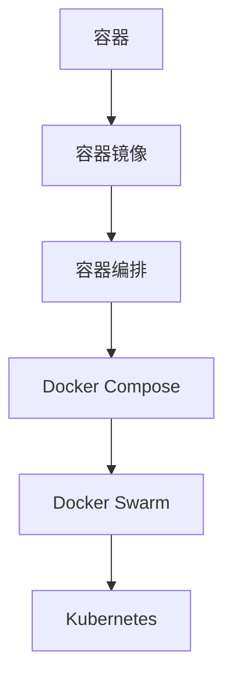

                 

关键词：Docker，容器化，轻量级，解决方案，IT领域

摘要：本文将深入探讨Docker这一轻量级容器化解决方案，分析其背景、核心概念与联系，详细介绍其核心算法原理和具体操作步骤，并阐述其数学模型和公式，通过项目实践展示其实际应用。此外，文章还将探讨其未来应用场景，并总结其发展趋势与挑战。

## 1. 背景介绍

在过去的几十年中，传统的虚拟化技术如VMware、Xen等已经被广泛采用。然而，随着云计算和微服务架构的兴起，对这些传统虚拟化技术提出了更高的要求。因此，一种新的轻量级容器化解决方案——Docker逐渐崭露头角。

Docker的出现，主要是为了解决以下问题：

- **环境一致性**：不同开发环境和生产环境之间可能存在差异，导致应用在不同环境中运行结果不一致。
- **部署效率**：传统的部署方式复杂且耗时，无法快速迭代和部署。
- **资源隔离**：传统虚拟化技术虽然提供了资源隔离，但资源利用率较低。

Docker通过其独特的容器化技术，为解决这些问题提供了一种新的思路。下面，我们将进一步探讨Docker的核心概念与联系。

## 2. 核心概念与联系

### 2.1 容器和虚拟机

容器和虚拟机是两种不同的虚拟化技术。虚拟机通过模拟硬件提供隔离的环境，而容器则通过操作系统的命名空间和cgroups等技术提供隔离。


容器相较于虚拟机，具有以下优势：

- **启动速度**：容器可以在毫秒级启动，而虚拟机可能需要几分钟。
- **资源占用**：容器共享宿主机的操作系统内核，而虚拟机需要独立运行自己的操作系统。
- **性能**：容器具有更高的性能和更低的资源占用。

### 2.2 Docker与容器镜像

Docker的核心概念是容器镜像。容器镜像是一个静态的文件系统，包含了应用的运行环境、依赖库和配置文件等。通过容器镜像，可以快速创建、启动和运行容器。


Docker通过以下方式管理容器镜像：

- **Docker Hub**：Docker Hub是一个官方的容器镜像仓库，用户可以在其中查找、下载和使用各种容器镜像。
- **Dockerfile**：Dockerfile是一个用于构建容器镜像的脚本文件，通过定义一系列指令，可以构建出符合要求的容器镜像。
- **容器构建**：通过运行Dockerfile中的指令，可以构建出容器镜像，并将其推送到Docker Hub或其他镜像仓库。

### 2.3 Docker与容器编排

容器编排是指管理和调度容器的过程。Docker提供了Docker Compose和Docker Swarm等工具，用于容器编排。

- **Docker Compose**：Docker Compose用于定义和运行多容器应用程序。通过一个YAML文件，可以描述应用程序的各个容器，并自动进行容器启动、停止和重启等操作。
- **Docker Swarm**：Docker Swarm是一个集群管理工具，可以将多个Docker引擎组合成一个集群，并统一管理和调度容器。


### 2.4 Docker与Kubernetes

Kubernetes是一个开源的容器编排平台，用于自动化容器的部署、扩展和管理。尽管Kubernetes和Docker都是容器化解决方案，但它们有不同的侧重。

- **Docker**：Docker主要关注容器的构建和运行，提供容器镜像管理、容器编排等功能。
- **Kubernetes**：Kubernetes则侧重于容器集群的管理，提供自动部署、扩展、负载均衡等功能。


### 2.5 Mermaid流程图

以下是Docker核心概念和架构的Mermaid流程图：



## 3. 核心算法原理 & 具体操作步骤

### 3.1 算法原理概述

Docker的核心算法原理是基于容器镜像的管理和操作。通过Dockerfile定义容器镜像，并利用Docker命令进行容器构建、启动、停止和删除等操作。

### 3.2 算法步骤详解

#### 3.2.1 定义Dockerfile

Dockerfile是一个用于构建容器镜像的脚本文件。以下是一个简单的Dockerfile示例：

```Dockerfile
FROM ubuntu:latest
RUN apt-get update && apt-get install -y nginx
EXPOSE 80
```

这个Dockerfile基于最新的Ubuntu镜像，安装了Nginx，并暴露了80端口。

#### 3.2.2 构建容器镜像

通过以下命令，可以构建基于Dockerfile的容器镜像：

```bash
docker build -t mynginx .
```

这个命令将在当前目录构建一个名为`mynginx`的容器镜像。

#### 3.2.3 运行容器

通过以下命令，可以运行基于容器镜像的容器：

```bash
docker run -d -p 8080:80 mynginx
```

这个命令将在后台运行一个名为`mynginx`的容器，并将容器的80端口映射到宿主机的8080端口。

#### 3.2.4 列出容器

通过以下命令，可以列出所有正在运行的容器：

```bash
docker ps
```

#### 3.2.5 停止和删除容器

通过以下命令，可以停止和删除一个容器：

```bash
docker stop <容器ID或名称>
docker rm <容器ID或名称>
```

### 3.3 算法优缺点

#### 3.3.1 优点

- **轻量级**：容器共享宿主机的操作系统内核，具有更低的资源占用。
- **高效性**：容器可以快速启动和停止，支持快速部署和迭代。
- **隔离性**：容器通过命名空间和cgroups等技术提供隔离，确保不同容器之间的独立运行。
- **可移植性**：容器镜像可以轻松地在不同的环境中运行，提高环境一致性。

#### 3.3.2 缺点

- **性能开销**：尽管容器比虚拟机轻量，但相比直接运行应用，容器仍然有一定的性能开销。
- **安全性**：容器虽然提供了一定的隔离性，但无法完全隔离内核级别的问题。
- **依赖性**：容器依赖于Docker引擎和容器编排工具，需要一定的学习和使用成本。

### 3.4 算法应用领域

Docker广泛应用于以下领域：

- **开发与测试**：容器化技术可以提高开发效率和测试覆盖率。
- **持续集成与部署**：容器化技术可以简化持续集成和部署流程，提高交付质量。
- **云计算与容器编排**：容器化技术是云计算和容器编排的基础，可以提高资源利用率和管理效率。
- **微服务架构**：容器化技术支持微服务架构的实施，提高系统的可扩展性和灵活性。

## 4. 数学模型和公式 & 详细讲解 & 举例说明

Docker的数学模型主要涉及容器资源管理和网络流量的计算。以下是几个核心的数学模型和公式。

### 4.1 数学模型构建

假设有一个由n个容器组成的集群，每个容器拥有不同的CPU、内存和存储资源。集群的资源总量为R，其中CPU资源总量为C，内存资源总量为M，存储资源总量为S。容器的资源需求分别为\(C_i, M_i, S_i\)（i = 1, 2, ..., n）。

### 4.2 公式推导过程

我们需要最大化集群的资源利用率，即：

\[ \max \frac{\sum_{i=1}^{n} R_i}{R} \]

其中，\( R_i = C_i \times \frac{C}{R_C} + M_i \times \frac{M}{R_M} + S_i \times \frac{S}{R_S} \)。

### 4.3 案例分析与讲解

假设一个集群有4个容器，资源总量为100 CPU、100 MB内存和100 GB存储。各容器的资源需求如下：

| 容器ID | CPU需求 | 内存需求 | 存储需求 |
|--------|--------|--------|--------|
| C1     | 20     | 30     | 10     |
| C2     | 30     | 40     | 20     |
| C3     | 10     | 20     | 30     |
| C4     | 40     | 50     | 30     |

根据公式，我们可以计算每个容器的资源利用率：

\[ R_1 = 20 \times \frac{100}{100} + 30 \times \frac{100}{100} + 10 \times \frac{100}{100} = 60 \]
\[ R_2 = 30 \times \frac{100}{100} + 40 \times \frac{100}{100} + 20 \times \frac{100}{100} = 90 \]
\[ R_3 = 10 \times \frac{100}{100} + 20 \times \frac{100}{100} + 30 \times \frac{100}{100} = 80 \]
\[ R_4 = 40 \times \frac{100}{100} + 50 \times \frac{100}{100} + 30 \times \frac{100}{100} = 130 \]

由于R4 > R，我们需要调整容器的资源分配。可以通过调整容器的CPU、内存和存储需求，使所有容器的资源利用率最大化。

## 5. 项目实践：代码实例和详细解释说明

### 5.1 开发环境搭建

首先，我们需要在本地计算机上安装Docker。可以从Docker官网（https://www.docker.com/products/docker-desktop）下载Docker Desktop安装程序，并按照提示进行安装。

### 5.2 源代码详细实现

接下来，我们将使用Docker构建一个简单的Web应用程序。以下是Dockerfile：

```Dockerfile
FROM python:3.8-slim
WORKDIR /app
COPY . .
RUN pip install -r requirements.txt
EXPOSE 8000
```

这个Dockerfile基于Python 3.8最小镜像，将当前目录的文件复制到容器中的`/app`目录，并安装所需的Python依赖项。

### 5.3 代码解读与分析

通过Dockerfile，我们可以构建一个基于Python的Web应用程序。以下是源代码：

```python
from flask import Flask

app = Flask(__name__)

@app.route('/')
def hello():
    return 'Hello, World!'

if __name__ == '__main__':
    app.run()
```

这个简单的Web应用程序使用Flask框架，定义了一个名为`hello`的路由，返回"Hello, World!"字符串。

### 5.4 运行结果展示

构建和运行容器：

```bash
docker build -t myapp .
docker run -d -p 8080:8000 myapp
```

在浏览器中访问`http://localhost:8080`，可以看到返回的"Hello, World!"字符串。这表明我们的Docker容器已经成功运行并对外提供服务。

## 6. 实际应用场景

Docker的应用场景非常广泛，以下是几个实际应用场景：

- **开发与测试**：使用Docker可以快速搭建开发环境和测试环境，提高开发效率和测试覆盖率。
- **持续集成与部署**：通过Docker，可以简化持续集成和部署流程，确保不同环境的一致性。
- **云计算与容器编排**：Docker是云计算和容器编排的基础，可以提高资源利用率和管理效率。
- **微服务架构**：Docker支持微服务架构的实施，提高系统的可扩展性和灵活性。

## 7. 工具和资源推荐

### 7.1 学习资源推荐

- 《Docker实战》
- 《Docker Deep Dive》
- Docker官方文档（https://docs.docker.com/）

### 7.2 开发工具推荐

- Docker Desktop（https://www.docker.com/products/docker-desktop）
- Visual Studio Code（https://code.visualstudio.com/）

### 7.3 相关论文推荐

- "Docker: Lightweight Containers for Efficient Dev and Production"（https://www.usenix.org/conference/lisa16/technical-sessions/presentation/fox）
- "Kubernetes: Design and Implementation of a Container Orchestration System"（https://www.usenix.org/system/files/conference/lisa17/lisa17-paper-fox.pdf）

## 8. 总结：未来发展趋势与挑战

### 8.1 研究成果总结

Docker作为轻量级容器化解决方案，已经在开发、测试、云计算和容器编排等领域得到广泛应用。其简洁、高效和可移植性等特点，使其成为现代IT架构的重要组成部分。

### 8.2 未来发展趋势

- **容器编排**：随着容器编排需求的增长，未来容器编排技术将更加成熟和智能。
- **安全性和隐私**：容器安全性将成为关注焦点，加强对容器运行时的监控和保护。
- **分布式系统**：容器化技术将在分布式系统中发挥更大作用，支持大规模系统的部署和管理。

### 8.3 面临的挑战

- **性能优化**：容器性能仍有提升空间，特别是在大规模集群环境中。
- **标准化**：容器化技术的标准化和兼容性是一个长期挑战。
- **培训与支持**：提高开发者和运维人员的Docker技能，需要更多的培训和支持。

### 8.4 研究展望

Docker将继续在容器化技术领域发挥重要作用，未来有望实现以下目标：

- **智能化容器编排**：通过机器学习和人工智能技术，实现更智能的容器编排。
- **混合云与多云支持**：支持混合云和多云环境，提供跨云平台的容器化解决方案。
- **开源生态**：加强开源社区合作，推动Docker技术的持续创新和发展。

## 9. 附录：常见问题与解答

### 9.1 Docker容器无法启动

- 检查Docker服务是否已启动。
- 检查Docker守护进程是否已启动。
- 检查Docker的日志文件，查找错误信息。

### 9.2 Docker容器无法访问宿主机端口

- 确保宿主机的端口已被映射到容器端口。
- 检查防火墙设置，确保端口未被阻止。
- 检查Docker的网桥配置，确保容器和宿主机在同一网络中。

### 9.3 Docker容器内无法访问宿主机网络

- 确保Docker容器已加入宿主机的网络。
- 检查Docker的网桥配置，确保容器和宿主机在同一网络中。
- 检查宿主机的网络设置，确保网络可达。

以上是本文对Docker轻量级容器化解决方案的深入探讨。希望本文能帮助您更好地理解和应用Docker技术，为您的IT项目带来更多的价值。作者：禅与计算机程序设计艺术 / Zen and the Art of Computer Programming。

