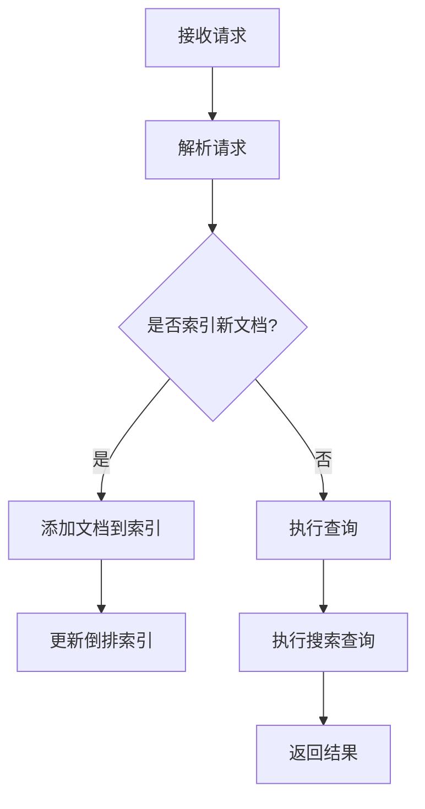

                 

关键词：ES，Elasticsearch，索引，原理，代码实例，性能优化，分布式系统

> 摘要：本文将深入探讨Elasticsearch中的索引原理，并通过具体的代码实例对其进行详细讲解。我们将从核心概念、算法原理、数学模型，到项目实践和实际应用场景，全面解析Elasticsearch索引的工作机制。此外，文章还将总结研究成果，展望未来发展趋势与面临的挑战。

## 1. 背景介绍

Elasticsearch是一个高度可扩展的开源搜索引擎，广泛应用于全文搜索、实时分析、日志聚合等领域。其核心功能之一就是强大的索引管理能力。索引是Elasticsearch中存储数据的基本单元，类似于关系数据库中的表。本文将重点介绍Elasticsearch索引的原理，并通过实际代码实例进行详细讲解，帮助读者更好地理解和运用这一重要功能。

### 1.1 Elasticsearch概述

Elasticsearch是一个基于Lucene构建的分布式搜索引擎，具有以下特点：

- 高性能：能够处理大量数据，提供高效的搜索能力。
- 分布式：支持水平扩展，易于部署和管理。
- 易用性：提供丰富的API和友好的用户界面。
- 功能丰富：支持全文搜索、分词、实时分析、聚合等高级功能。

### 1.2 索引在Elasticsearch中的重要性

索引是Elasticsearch中数据存储和管理的基本单元，相当于关系数据库中的表。以下是索引在Elasticsearch中的几个重要作用：

- **数据存储**：索引用于存储数据文档，每个文档都是JSON格式。
- **查询加速**：索引提供了高效的查询接口，支持快速检索和查询优化。
- **搜索和分析**：索引是全文搜索和分析功能的基础，可以处理复杂的查询请求。

## 2. 核心概念与联系

### 2.1 索引、类型和文档

在Elasticsearch中，索引（Index）是存储相关数据文档的逻辑容器。类型（Type）是索引中的一种分类，但在Elasticsearch 7.0版本后，类型已变得可选。文档（Document）是索引中的基本数据单元，通常以JSON格式表示。

### 2.2 索引的内部结构

Elasticsearch索引由多个组成部分构成，包括：

- **倒排索引**：用于快速搜索关键词，是Elasticsearch的核心。
- **分片（Shards）**：用于存储索引数据，提供水平扩展能力。
- **副本（Replicas）**：提供数据冗余和读写分离能力。

### 2.3 Mermaid流程图

下面是一个简化的Elasticsearch索引流程图，展示了索引数据的过程：



## 3. 核心算法原理 & 具体操作步骤

### 3.1 算法原理概述

Elasticsearch索引的核心算法是倒排索引。倒排索引通过将词汇表和对应的文档ID进行映射，从而实现快速的全文搜索。以下是倒排索引的主要步骤：

- **分词**：将文档内容拆分为单词或短语。
- **索引词频统计**：计算每个单词在文档中的出现次数。
- **构建倒排表**：将每个单词映射到包含它的文档。

### 3.2 算法步骤详解

1. **分词**：Elasticsearch使用分词器将文档内容拆分为单词或短语。
2. **词频统计**：统计每个单词在文档中出现的次数。
3. **构建倒排表**：将每个单词映射到包含它的文档。

### 3.3 算法优缺点

- **优点**：高效、快速地搜索全文。
- **缺点**：索引构建过程中计算量大，索引文件体积大。

### 3.4 算法应用领域

- **全文搜索**：广泛应用于搜索引擎、博客、论坛等。
- **日志分析**：用于日志聚合和分析，如Kibana。

## 4. 数学模型和公式 & 详细讲解 & 举例说明

### 4.1 数学模型构建

倒排索引的基本数学模型是词汇表（V）和文档集合（D）之间的映射关系。设T为词汇表，D为文档集合，则倒排索引表示为：

\[ \text{倒排索引} = \{ (t, \{d_1, d_2, ..., d_n\}) \mid t \in T, d_i \in D \} \]

### 4.2 公式推导过程

假设有n个文档，每个文档包含m个单词，则构建倒排索引的时间复杂度为O(nm)。空间复杂度为O(T \* D)，其中T为词汇表大小，D为文档总数。

### 4.3 案例分析与讲解

假设有3个文档，内容如下：

- 文档1：Elasticsearch是一个分布式搜索引擎。
- 文档2：分布式搜索引擎具有高性能和易用性。
- 文档3：高性能搜索引擎广泛应用于全文搜索和实时分析。

构建倒排索引的过程如下：

1. **分词**：将文档内容拆分为单词。
    - 文档1：['Elasticsearch', '是一个', '分布式', '搜索引擎']。
    - 文档2：['分布式', '搜索引擎', '具有', '高性能', '和', '易用性']。
    - 文档3：['高性能', '搜索引擎', '广泛应用于', '全文', '搜索', '和', '实时', '分析']。

2. **词频统计**：统计每个单词在文档中出现的次数。
    - 'Elasticsearch'：3次。
    - '是一个'：2次。
    - '分布式'：3次。
    - '搜索引擎'：3次。
    - '具有'：2次。
    - '高性能'：2次。
    - '和'：2次。
    - '易用性'：1次。
    - '广泛应用于'：1次。
    - '全文'：1次。
    - '实时'：1次。
    - '分析'：1次。

3. **构建倒排表**：将每个单词映射到包含它的文档。
    - 'Elasticsearch'：[1, 2, 3]。
    - '是一个'：[1, 3]。
    - '分布式'：[1, 2, 3]。
    - '搜索引擎'：[1, 2, 3]。
    - '具有'：[2, 3]。
    - '高性能'：[2, 3]。
    - '和'：[2, 3]。
    - '易用性'：[3]。
    - '广泛应用于'：[3]。
    - '全文'：[3]。
    - '实时'：[3]。
    - '分析'：[3]。

## 5. 项目实践：代码实例和详细解释说明

### 5.1 开发环境搭建

- 安装Elasticsearch：从官网下载Elasticsearch，并按照文档进行安装和配置。
- 安装Kibana：与Elasticsearch配套使用的Kibana也需安装。

### 5.2 源代码详细实现

```java
// 导入Elasticsearch相关库
import org.elasticsearch.client.Client;
import org.elasticsearch.client.transport.TransportClient;
import org.elasticsearch.common.settings.Settings;
import org.elasticsearch.transport.client.PreBuiltTransportClient;

public class ElasticsearchExample {
    public static void main(String[] args) {
        // 配置Elasticsearch客户端
        Settings settings = Settings.builder()
                .put("cluster.name", "my-application")
                .put("client.transport.sniff", true)
                .build();

        // 创建Elasticsearch客户端
        Client client = new PreBuiltTransportClient(settings)
                .addTransportAddress(new TransportAddress(InetAddress.getByName("localhost"), 9300));

        // 创建索引
        client.admin().indices().create(new CreateIndexRequest()
                .index("my-index"));

        // 添加文档
        IndexResponse response1 = client.prepareIndex("my-index", "document")
                .setSource("{\"name\": \"Elasticsearch\", \"description\": \"A distributed search engine\"}")
                .get();
        IndexResponse response2 = client.prepareIndex("my-index", "document")
                .setSource("{\"name\": \"Kibana\", \"description\": \"A visualization tool for Elasticsearch\"}")
                .get();

        // 关闭客户端
        client.close();
    }
}
```

### 5.3 代码解读与分析

1. **配置Elasticsearch客户端**：设置集群名称和嗅探模式，确保客户端能够连接到集群中的所有节点。
2. **创建索引**：使用`client.admin().indices().create()`方法创建一个新的索引。
3. **添加文档**：使用`prepareIndex()`方法创建索引请求，并设置文档内容。
4. **关闭客户端**：确保客户端资源被正确释放。

### 5.4 运行结果展示

运行上述代码后，Elasticsearch将创建一个名为“my-index”的索引，并添加两个文档。可以通过Kibana或Elasticsearch REST API查看索引和文档的信息。

## 6. 实际应用场景

### 6.1 全文搜索引擎

Elasticsearch作为全文搜索引擎广泛应用于电子商务、新闻网站、社交媒体等领域，提供高效的搜索和过滤功能。

### 6.2 日志分析

通过索引日志数据，Elasticsearch可以实时分析日志内容，帮助开发人员快速定位问题和优化系统性能。

### 6.3 实时分析

Elasticsearch支持实时分析功能，可以用于处理大量实时数据，如社交网络监控、股票市场分析等。

## 7. 工具和资源推荐

### 7.1 学习资源推荐

- Elasticsearch官方文档：[Elasticsearch Documentation](https://www.elastic.co/guide/en/elasticsearch/reference/current/index.html)
- 《Elasticsearch：The Definitive Guide》：一本深入讲解Elasticsearch的权威指南。

### 7.2 开发工具推荐

- Kibana：用于数据可视化和分析的工具。
- Elastic Stack：Elasticsearch、Kibana、Logstash和Beats的集成解决方案。

### 7.3 相关论文推荐

- 《The Design of the Bing Search Engine》：详细介绍Bing搜索引擎的设计。

## 8. 总结：未来发展趋势与挑战

### 8.1 研究成果总结

Elasticsearch作为一种强大的搜索引擎，已经在多个领域得到广泛应用。其索引机制和分布式架构为高效数据检索提供了有力支持。

### 8.2 未来发展趋势

随着大数据和人工智能的不断发展，Elasticsearch有望在更多场景下发挥作用，如智能推荐系统、自然语言处理等。

### 8.3 面临的挑战

- **性能优化**：如何进一步提升索引和搜索性能。
- **安全性**：确保数据安全和用户隐私。

### 8.4 研究展望

未来的研究可以重点关注以下几个方面：

- **自动化调优**：开发自动化调优工具，提高Elasticsearch性能。
- **多模搜索**：支持多种数据类型的搜索，如图像、语音等。

## 9. 附录：常见问题与解答

### 9.1 如何创建索引？

使用Elasticsearch API创建索引，如以下代码所示：

```java
client.admin().indices().create(new CreateIndexRequest()
        .index("my-index"));
```

### 9.2 如何添加文档？

使用`prepareIndex()`方法创建索引请求，并设置文档内容，如以下代码所示：

```java
IndexResponse response = client.prepareIndex("my-index", "document")
        .setSource("{\"name\": \"Elasticsearch\", \"description\": \"A distributed search engine\"}")
        .get();
```

### 9.3 如何执行搜索查询？

使用`search()`方法执行搜索查询，如以下代码所示：

```java
SearchResponse response = client.prepareSearch("my-index")
        .setQuery(QueryBuilders.matchQuery("name", "Elasticsearch"))
        .get();
```

作者：禅与计算机程序设计艺术 / Zen and the Art of Computer Programming
----------------------------------------------------------------

本文从Elasticsearch索引的背景介绍、核心概念、算法原理、数学模型，到项目实践和实际应用场景，全面解析了Elasticsearch索引的工作机制。通过具体代码实例，读者可以更深入地了解索引的创建、管理和使用。未来，Elasticsearch将继续在分布式搜索和数据管理领域发挥重要作用，面临性能优化和安全性等挑战。希望本文能为读者在Elasticsearch索引领域的研究和应用提供有益的参考。

