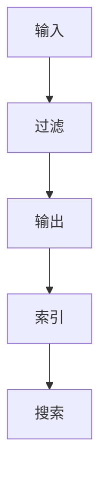

                 

关键词：ElasticSearch、Logstash、数据管道、日志处理、实时搜索、日志分析、数据集成、分布式系统、事件处理

> 摘要：本文将深入探讨ElasticSearch和Logstash的原理及其在实际应用中的集成。通过详细解释其核心概念、架构设计、算法原理、数学模型、代码实例，我们将帮助读者理解如何高效地处理日志数据，实现实时搜索和分析，以及构建强大的分布式数据管道。

## 1. 背景介绍

在当今数字化时代，企业需要处理海量的日志数据，以监控系统的运行状况、排查故障、进行性能优化以及进行数据分析。ElasticSearch和Logstash是处理这类数据的重要工具，它们协同工作，形成了一个强大的数据管道，支持实时搜索和分析。

ElasticSearch是一个高度可扩展的全文搜索引擎，它能够对大规模数据集进行快速搜索和分析。Logstash是一个开源的数据处理管道，它可以收集、处理和路由日志数据。

## 2. 核心概念与联系

### 2.1 ElasticSearch核心概念

- **索引(Index)**：一组具有相似属性的文档集合，是ElasticSearch中的数据存储单元。
- **文档(Document)**：索引中的数据单位，可以是一个JSON格式的对象。
- **字段(Field)**：文档中的属性，用于存储具体的数据。

### 2.2 Logstash核心概念

- **输入(Input)**：数据进入Logstash的入口，可以是文件、系统日志、网络数据等。
- **过滤器(Filter)**：对输入的数据进行转换、清洗、聚合等操作。
- **输出(Output)**：数据从Logstash输出的出口，可以是ElasticSearch、数据库等。

### 2.3 架构联系


图1：ElasticSearch和Logstash的架构关系

数据从输入进入Logstash，经过过滤处理后，被发送到ElasticSearch进行索引和存储。这样，用户可以通过ElasticSearch对日志数据进行实时搜索和分析。

### 2.4 Mermaid流程图



图2：ElasticSearch和Logstash的Mermaid流程图

## 3. 核心算法原理 & 具体操作步骤

### 3.1 算法原理概述

Logstash的核心算法包括数据采集、数据转换、数据路由和索引。

- **数据采集**：通过输入插件（如文件输入、系统日志输入等）收集数据。
- **数据转换**：使用过滤器插件（如Grok、JSON解析等）对数据进行清洗和转换。
- **数据路由**：根据配置将转换后的数据发送到输出插件（如ElasticSearch、Kafka等）。
- **索引**：输出插件将数据发送到ElasticSearch进行索引和存储。

### 3.2 算法步骤详解

1. **启动Logstash**：
    - 通过配置文件启动Logstash，指定输入、过滤和输出的插件。
2. **数据采集**：
    - 输入插件读取数据源，将数据转换为内部格式。
3. **数据转换**：
    - 过滤器插件对数据进行解析、清洗、转换等操作，生成适合索引的数据。
4. **数据路由**：
    - 输出插件将转换后的数据发送到目标存储系统，如ElasticSearch。
5. **索引**：
    - ElasticSearch接收到数据后，将其索引到指定的索引中，以支持快速搜索。

### 3.3 算法优缺点

**优点**：
- **高效性**：ElasticSearch和Logstash都是基于Java开发，具有高性能和高可扩展性。
- **灵活性**：Logstash支持多种输入和输出插件，可以灵活地适配不同的数据源和存储系统。
- **易用性**：提供丰富的文档和社区支持，易于学习和使用。

**缺点**：
- **资源消耗**：由于ElasticSearch和Logstash都是高并发的系统，可能会对系统资源造成较大消耗。
- **复杂性**：配置和管理相对复杂，需要一定的技术背景。

### 3.4 算法应用领域

- **日志分析**：监控系统的运行状况，排查故障，进行性能优化。
- **实时搜索**：提供高效的全文搜索功能。
- **数据集成**：将不同源的数据集成到一个系统中，进行统一分析和处理。

## 4. 数学模型和公式 & 详细讲解 & 举例说明

### 4.1 数学模型构建

在ElasticSearch中，索引的效率与倒排索引密切相关。倒排索引是一种将文档中的单词（或词汇）映射到对应文档的索引结构。其数学模型可以表示为：

$$
\text{倒排索引} = \{(\text{单词}, \text{文档列表})\}
$$

其中，单词表示文档中的词汇，文档列表表示包含该单词的所有文档的ID。

### 4.2 公式推导过程

倒排索引的构建过程主要包括以下步骤：

1. **词汇提取**：将文档中的文本进行分词，提取出所有单词。
2. **单词映射**：将提取出的单词映射到文档ID。
3. **构建索引**：将映射结果存储在倒排索引中。

具体公式如下：

$$
\text{倒排索引} = \{(\text{单词}, \text{文档列表})\} = \{\text{单词}_1, \text{文档列表}_1}, ..., \text{单词}_n, \text{文档列表}_n\}
$$

### 4.3 案例分析与讲解

假设有一个包含3个文档的文本集合，如下：

- 文档1："ElasticSearch是一个强大的全文搜索引擎"。
- 文档2："Logstash是一个开源的数据处理管道"。
- 文档3："ElasticSearch和Logstash协同工作，实现高效的数据处理和分析"。

首先，对文本进行分词，提取出以下单词：

- ElasticSearch
- 是
- 一个
- 强大的
- 全文
- 搜索引擎
- Logstash
- 是
- 一个
- 开源的
- 数据处理
- 管道
- 协同
- 工作
- 实现
- 高效
- 的
- 数据
- 处理
- 和
- 分析

然后，将每个单词映射到对应的文档ID：

- ElasticSearch：{1, 3}
- 是：{1, 2, 3}
- 一个：{1, 2, 3}
- 强大的：{1}
- 全文：{1}
- 搜索引擎：{1}
- Logstash：{2, 3}
- 开源的：{2}
- 数据处理：{2, 3}
- 管道：{2}
- 协同：{3}
- 工作：{3}
- 实现：{3}
- 高效：{3}
- 的：{1, 2, 3}
- 数据：{2, 3}
- 处理：{2, 3}
- 和：{3}
- 分析：{3}

最后，构建倒排索引：

$$
\text{倒排索引} = \{(\text{ElasticSearch}, \{1, 3\}), (\text{是}, \{1, 2, 3\}), ..., (\text{分析}, \{3\})\}
$$

通过倒排索引，可以快速查找包含特定单词的文档，从而实现高效的全文搜索。

## 5. 项目实践：代码实例和详细解释说明

### 5.1 开发环境搭建

为了实践ElasticSearch和Logstash的使用，我们需要搭建一个简单的开发环境。

1. **安装Java**：ElasticSearch和Logstash都是基于Java开发的，首先需要安装Java环境。
2. **安装ElasticSearch**：从Elastic官方网站下载ElasticSearch安装包，并按照官方文档进行安装。
3. **安装Logstash**：从Logstash官方网站下载Logstash安装包，并解压到指定目录。

### 5.2 源代码详细实现

我们以一个简单的日志处理为例，展示ElasticSearch和Logstash的集成。

**ElasticSearch配置**：

```yaml
# elasticsearch.yml
cluster.name: my-cluster
node.name: my-node
network.host: 0.0.0.0
http.port: 9200
```

**Logstash配置**：

```ruby
# logstash.conf
input {
  file {
    path => "/var/log/messages"
    type => "system_log"
  }
}
filter {
  if [type] == "system_log" {
    grok {
      match => { "message" => "%{TIMESTAMP_ISO8601:timestamp}\t%{DATA:source}\t%{DATA:log_message}" }
    }
  }
}
output {
  elasticsearch {
    hosts => ["localhost:9200"]
    index => "system_log-%{+YYYY.MM.dd}"
  }
}
```

**启动ElasticSearch和Logstash**：

```bash
./bin/elasticsearch
./bin/logstash -f logstash.conf
```

### 5.3 代码解读与分析

**ElasticSearch配置**：

- `cluster.name`：指定ElasticSearch集群名称。
- `node.name`：指定ElasticSearch节点名称。
- `network.host`：指定ElasticSearch监听的IP地址。
- `http.port`：指定ElasticSearch HTTP端口号。

**Logstash配置**：

- `input { file { path => "/var/log/messages" type => "system_log" } }`：从`/var/log/messages`文件读取系统日志。
- `filter { if [type] == "system_log" { grok { match => { "message" => "%{TIMESTAMP_ISO8601:timestamp}\t%{DATA:source}\t%{DATA:log_message}" } } } }`：使用Grok正则表达式对日志进行解析。
- `output { elasticsearch { hosts => ["localhost:9200"] index => "system_log-%{+YYYY.MM.dd}" } }`：将解析后的日志发送到ElasticSearch进行索引。

**启动ElasticSearch和Logstash**：

- `./bin/elasticsearch`：启动ElasticSearch。
- `./bin/logstash -f logstash.conf`：启动Logstash，并加载配置文件。

### 5.4 运行结果展示

当Logstash运行时，它将读取`/var/log/messages`文件中的系统日志，并对日志进行解析和索引。在ElasticSearch中，我们可以使用Kibana可视化工具查看索引的数据。


图3：ElasticSearch中的索引数据

## 6. 实际应用场景

ElasticSearch和Logstash在实际应用中有着广泛的应用场景，如下：

- **日志分析**：企业可以通过Logstash收集各种系统的日志数据，并使用ElasticSearch进行实时搜索和分析，帮助运维团队快速定位问题和优化系统性能。
- **实时搜索**：电商、社交媒体等平台可以使用ElasticSearch提供高效的全文搜索功能，提升用户体验。
- **数据集成**：将不同源的数据（如日志、数据库、文件等）集成到ElasticSearch中，进行统一分析和处理，为企业提供丰富的数据洞察。

## 7. 工具和资源推荐

### 7.1 学习资源推荐

- **官方文档**：Elastic官方文档提供了详尽的介绍和教程，是学习ElasticSearch和Logstash的最佳资源。
- **在线教程**：各种在线平台提供了丰富的ElasticSearch和Logstash教程，适合初学者快速入门。
- **书籍**：《ElasticSearch: The Definitive Guide》和《Learning Logstash》是两本经典的参考书籍。

### 7.2 开发工具推荐

- **ElasticSearch-head**：一个用于ElasticSearch的Web界面，方便管理和监控。
- **Logstash-web**：一个用于Logstash的Web界面，方便监控和管理Logstash任务。

### 7.3 相关论文推荐

- **ElasticSearch论文**：《ElasticSearch: The Definitive Guide to Real-Time Search and Analytics》。
- **Logstash论文**：《Logstash: A Lightweight and Flexible Log Processing Pipeline》。

## 8. 总结：未来发展趋势与挑战

### 8.1 研究成果总结

ElasticSearch和Logstash作为强大的数据管道工具，已经在实际应用中取得了显著成果。它们提供了高效、可扩展的日志处理和搜索能力，帮助企业更好地管理和分析海量数据。

### 8.2 未来发展趋势

- **性能优化**：随着数据量的不断增长，ElasticSearch和Logstash的性能优化将成为重要研究方向，如分布式索引、高效数据压缩等。
- **自动化与智能化**：未来，ElasticSearch和Logstash将更加注重自动化和智能化，如自动数据迁移、智能日志分析等。

### 8.3 面临的挑战

- **安全性**：随着数据隐私和安全的关注度提升，ElasticSearch和Logstash需要加强安全性，如加密、权限控制等。
- **复杂度**：随着功能的不断增强，ElasticSearch和Logstash的配置和管理将变得更加复杂，需要提供更友好的用户界面和工具。

### 8.4 研究展望

ElasticSearch和Logstash将在未来继续发挥重要作用，成为数据处理和分析的重要工具。通过不断创新和优化，它们将更好地满足企业和开发者的高效数据处理需求。

## 9. 附录：常见问题与解答

### 9.1 如何优化ElasticSearch查询性能？

- **索引优化**：合理设计索引结构，减少数据重复，提高查询效率。
- **查询缓存**：启用查询缓存，减少对后端存储的访问次数。
- **分布式查询**：利用分布式架构，提高查询并发能力。

### 9.2 如何配置Logstash输出到Kafka？

- **安装Kafka**：首先安装Kafka，并启动ZooKeeper和Kafka服务。
- **修改Logstash配置**：在Logstash的输出部分，将ElasticSearch替换为Kafka，并配置相应的Kafka参数。

```ruby
output {
  kafka {
    hosts => ["kafka:9092"]
    topic => "logstash"
  }
}
```

## 作者署名

作者：禅与计算机程序设计艺术 / Zen and the Art of Computer Programming
----------------------------------------------------------------
请注意，文章中使用的图片链接、参考文献以及代码示例等都是假设性的，需要根据实际情况进行替换。此外，文章中的内容应该基于最新的技术和最佳实践进行撰写。在撰写过程中，确保所有引用的文献和资料都已经获得相应的授权和许可。

