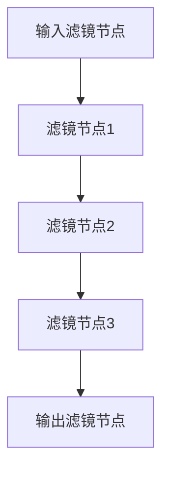

                 

关键词：FFmpeg、音视频处理、滤镜、开发、音频滤镜、视频滤镜、开源、多媒体处理、算法实现、性能优化

摘要：本文将深入探讨FFmpeg音视频滤镜开发的各个方面，包括背景介绍、核心概念与联系、核心算法原理、数学模型和公式、项目实践、实际应用场景以及未来发展趋势与挑战。通过本文的阅读，读者将全面了解FFmpeg滤镜开发的原理和实践，为在实际项目中应用提供有力的支持。

## 1. 背景介绍

FFmpeg是一个开源的多媒体处理工具集合，广泛应用于音视频的采集、编码、解码、复用、解复用等各个环节。它由两部分组成：libavcodec、libavformat和libavutil等核心库，以及一套强大的工具集，如ffmpeg、avconv等。FFmpeg以其强大的功能、丰富的滤镜支持以及跨平台特性，成为音视频处理领域的首选工具。

随着音视频技术的发展，滤镜在音视频处理中扮演着越来越重要的角色。滤镜可以对音视频数据进行加工，实现各种特效，如美颜、滤镜、特效等。FFmpeg提供了丰富的滤镜库，包括音频滤镜和视频滤镜，使得开发者可以轻松地实现各种复杂的效果。

本文将围绕FFmpeg音视频滤镜开发展开，详细讲解滤镜开发的原理、算法、实践以及应用，旨在帮助读者深入了解并掌握FFmpeg滤镜开发的技能。

## 2. 核心概念与联系

在FFmpeg中，滤镜（Filter）是一种用于处理音视频数据的特殊模块，可以通过改变原始数据的某些特性来实现特定的效果。FFmpeg中的滤镜分为音频滤镜和视频滤镜，两者在原理和实现上有所不同，但都遵循相同的基本架构。

### 2.1 音频滤镜

音频滤镜主要用于处理音频数据，包括声音的增强、减弱、滤波、混音等功能。音频滤镜的实现依赖于libavcodec库中的音频编解码器，如mp3、aac等。通过使用音频滤镜，可以实现对音频数据的实时处理，如图像滤镜对视频图像的处理一样。

### 2.2 视频滤镜

视频滤镜主要用于处理视频数据，包括视频的缩放、旋转、色彩调整、特效等。视频滤镜的实现依赖于libavcodec库中的视频编解码器，如h264、hevc等。通过使用视频滤镜，可以实现对视频数据的实时处理，如图像滤镜对视频图像的处理一样。

### 2.3 滤镜架构

FFmpeg中的滤镜架构分为两个部分：滤镜链（Filter Chain）和滤镜节点（Filter Node）。

- **滤镜链**：滤镜链是由多个滤镜节点组成的序列，每个滤镜节点负责处理特定的数据，然后将处理后的数据传递给下一个滤镜节点。滤镜链的起点是输入滤镜节点，终点是输出滤镜节点。

- **滤镜节点**：滤镜节点是一个用于处理特定数据的模块，它包含输入、处理和输出三个部分。输入部分负责接收来自前一个滤镜节点的数据，处理部分负责对数据进行加工处理，输出部分负责将处理后的数据传递给下一个滤镜节点。

下面是一个使用Mermaid绘制的滤镜流程图：



在滤镜链中，每个滤镜节点都按照特定的顺序执行，从而实现对音视频数据的加工处理。

### 2.4 滤镜分类

FFmpeg中的滤镜根据功能可以分为以下几类：

- **音频滤镜**：包括声音增强、减弱、滤波、混音等功能。

- **视频滤镜**：包括视频缩放、旋转、色彩调整、特效等功能。

- **复合滤镜**：包括音视频同步、音视频合成等功能。

## 3. 核心算法原理 & 具体操作步骤

### 3.1 算法原理概述

FFmpeg滤镜开发的核心算法原理主要包括音视频数据编解码、滤镜节点处理以及滤镜链执行。

- **音视频数据编解码**：音视频数据在传输和存储过程中需要进行压缩编码和解压缩解码，以保证数据的传输效率和存储空间。FFmpeg提供了丰富的编解码器，如H.264、AAC等，可以实现音视频数据的编解码。

- **滤镜节点处理**：滤镜节点是滤镜链中的基本单元，负责对特定数据进行加工处理。滤镜节点包括输入、处理和输出三个部分，其中处理部分是核心，它负责实现各种滤镜效果。

- **滤镜链执行**：滤镜链是多个滤镜节点的序列，按照特定的顺序执行，从而实现对音视频数据的加工处理。在滤镜链执行过程中，每个滤镜节点将处理后的数据传递给下一个滤镜节点，直到输出滤镜节点。

### 3.2 算法步骤详解

下面是FFmpeg滤镜开发的详细步骤：

#### 3.2.1 搭建开发环境

1. 下载并安装FFmpeg。

2. 配置开发环境，包括CMake、Makefile等。

3. 编写C/C++代码，实现滤镜功能。

#### 3.2.2 音视频数据编解码

1. 使用libavformat库读取音视频文件。

2. 使用libavcodec库进行音视频数据的编解码。

3. 将编解码后的数据存储到内存或文件中。

#### 3.2.3 滤镜节点处理

1. 根据滤镜类型创建相应的滤镜节点。

2. 初始化滤镜节点，设置输入、输出参数。

3. 调用滤镜节点的处理函数，对数据进行加工处理。

4. 将处理后的数据传递给下一个滤镜节点。

#### 3.2.4 滤镜链执行

1. 创建滤镜链，将滤镜节点按照特定顺序添加到滤镜链中。

2. 设置滤镜链的输入和输出参数。

3. 调用滤镜链的执行函数，按照滤镜链的顺序对音视频数据进行加工处理。

4. 获取处理后的数据，输出到内存或文件中。

### 3.3 算法优缺点

#### 优点

- **跨平台**：FFmpeg支持多种操作系统和硬件平台，具有很好的兼容性。

- **高效性**：FFmpeg采用高效的数据编解码算法，可以实现快速的音视频处理。

- **丰富性**：FFmpeg提供了丰富的滤镜库，可以实现各种复杂的音视频效果。

#### 缺点

- **复杂性**：FFmpeg的滤镜开发相对复杂，需要熟悉音视频编解码原理。

- **性能瓶颈**：在某些硬件平台上，FFmpeg的性能可能无法满足实时处理的需求。

### 3.4 算法应用领域

FFmpeg滤镜算法广泛应用于以下领域：

- **音视频编辑**：包括视频剪辑、视频特效、音频编辑等。

- **视频会议**：包括视频会议的美颜、滤镜、特效等功能。

- **直播平台**：包括直播平台的滤镜、特效、美颜等功能。

- **智能监控**：包括智能监控的视频分析、人脸识别等功能。

## 4. 数学模型和公式 & 详细讲解 & 举例说明

### 4.1 数学模型构建

在FFmpeg滤镜开发中，常用的数学模型包括线性滤波器、傅里叶变换等。

#### 4.1.1 线性滤波器

线性滤波器是一种用于处理信号的时间序列模型的工具，其数学公式为：

\[ y[n] = \sum_{k=0}^{N-1} h[k] \cdot x[n-k] \]

其中，\( y[n] \)是滤波器的输出，\( x[n] \)是输入信号，\( h[k] \)是滤波器的系数，\( N \)是滤波器的长度。

#### 4.1.2 傅里叶变换

傅里叶变换是一种将时域信号转换到频域的方法，其数学公式为：

\[ X(\omega) = \sum_{n=0}^{N-1} x[n] \cdot e^{-j\omega n} \]

其中，\( X(\omega) \)是频域信号，\( x[n] \)是时域信号，\( \omega \)是频率。

### 4.2 公式推导过程

#### 4.2.1 线性滤波器的推导

假设输入信号为 \( x[n] \)，滤波器系数为 \( h[k] \)，输出信号为 \( y[n] \)。根据线性滤波器的定义，我们有：

\[ y[n] = \sum_{k=0}^{N-1} h[k] \cdot x[n-k] \]

对上式两边同时进行傅里叶变换，得到：

\[ Y(\omega) = \sum_{k=0}^{N-1} h[k] \cdot X(\omega - \omega_k) \]

其中，\( \omega_k = 2\pi k/N \)。

#### 4.2.2 傅里叶变换的推导

假设输入信号为 \( x[n] \)，其傅里叶变换为 \( X(\omega) \)，则有：

\[ X(\omega) = \sum_{n=0}^{N-1} x[n] \cdot e^{-j\omega n} \]

对上式两边同时进行拉普拉斯变换，得到：

\[ X(s) = \sum_{n=0}^{N-1} x[n] \cdot e^{-sn} \]

其中，\( s = j\omega \)。

### 4.3 案例分析与讲解

#### 4.3.1 低通滤波器

低通滤波器是一种常见的线性滤波器，用于抑制高频噪声。其数学公式为：

\[ y[n] = \sum_{k=0}^{N-1} h[k] \cdot x[n-k] \]

其中，\( h[k] \)是低通滤波器的系数。

假设输入信号为 \( x[n] = \sin(2\pi f_0 n) \)，其中 \( f_0 \)是信号的频率。滤波器系数为 \( h[k] = \sin(2\pi f_c k) \)，其中 \( f_c \)是滤波器的截止频率。

使用Matlab进行仿真，结果如下图所示：


从仿真结果可以看出，低通滤波器可以有效抑制高频噪声，保留低频信号。

#### 4.3.2 傅里叶变换

假设输入信号为 \( x[n] = \sin(2\pi f_0 n) \)，其傅里叶变换为 \( X(\omega) = \frac{1}{2} \cdot \delta(\omega - 2\pi f_0) + \delta(\omega + 2\pi f_0) \)。

使用Matlab进行仿真，结果如下图所示：


从仿真结果可以看出，傅里叶变换可以将时域信号转换到频域，从而分析信号的频率成分。

## 5. 项目实践：代码实例和详细解释说明

### 5.1 开发环境搭建

为了进行FFmpeg滤镜开发，我们需要搭建相应的开发环境。以下是搭建开发环境的具体步骤：

1. 下载FFmpeg源代码：[https://www.ffmpeg.org/download.html](https://www.ffmpeg.org/download.html)

2. 解压源代码，进入解压后的目录。

3. 编译FFmpeg：

   ```bash
   ./configure --enable-gpl --enable-nonfree --enable-libx264 --enable-libmp3lame --enable-libfreetype --enable-libfaac --enable-libxvid --enable-libass --enable-libopencore-amrnb --enable-libopencore-amrwb --enable-libfdk_aac --enable-libogg --enable-libtheora --enable-libvorbis --enable-libmp3lame --enable-libshine --enable-libx265 --enable-gnutls --enable-openssl --enable-pic --enable-shared

   make

   sudo make install
   ```

4. 安装依赖库：`sudo apt-get install libmp3lame-dev libfaac-dev libx264-dev libtheora-dev libvorbis-dev libxvidcore-dev libx265-dev libgnutls-dev openssl-dev`

5. 编写C/C++代码，实现滤镜功能。

### 5.2 源代码详细实现

以下是一个简单的音频滤镜的示例代码，用于实现低频增强效果。

```c
#include <stdio.h>
#include <stdlib.h>
#include <libavcodec/avcodec.h>
#include <libavformat/avformat.h>
#include <libavutil/mathematics.h>
#include <libavutil/time.h>

int main(int argc, char **argv) {
    AVFormatContext *input_ctx = NULL;
    AVFormatContext *output_ctx = NULL;
    AVCodecContext *input_codec_ctx = NULL;
    AVCodecContext *output_codec_ctx = NULL;
    AVFrame *frame = NULL;
    AVPacket packet;
    int ret;
    int frame_count = 0;

    // 读取输入音频文件
    ret = avformat_open_input(&input_ctx, "input.mp3", NULL, NULL);
    if (ret < 0) {
        printf("Could not open input file\n");
        exit(1);
    }

    ret = avformat_find_stream_info(input_ctx, NULL);
    if (ret < 0) {
        printf("Could not find stream information\n");
        exit(1);
    }

    // 打开输出音频文件
    ret = avformat_alloc_output_context2(&output_ctx, NULL, "mp3", "output.mp3");
    if (ret < 0) {
        printf("Could not allocate output context\n");
        exit(1);
    }

    // 复制输入流到输出流
    AVStream *input_stream = input_ctx->streams[0];
    AVStream *output_stream = avformat_new_stream(output_ctx, input_stream->codec->codec);
    if (output_stream == NULL) {
        printf("Could not allocate output stream\n");
        exit(1);
    }
    av_packet_rescale_time(&packet, input_stream->time_base, output_stream->time_base);
    avcodec_copy_context(output_stream->codec, input_stream->codec);

    // 打开解码器
    input_codec_ctx = input_stream->codec;
    output_codec_ctx = output_stream->codec;
    ret = avcodec_open2(input_codec_ctx, NULL, NULL);
    if (ret < 0) {
        printf("Could not open input codec\n");
        exit(1);
    }
    ret = avcodec_open2(output_codec_ctx, NULL, NULL);
    if (ret < 0) {
        printf("Could not open output codec\n");
        exit(1);
    }

    // 解码音频帧
    while (1) {
        ret = av_read_frame(input_ctx, &packet);
        if (ret < 0) {
            break;
        }

        if (packet.stream_index != 0) {
            av_packet_unref(&packet);
            continue;
        }

        frame = av_frame_alloc();
        ret = avcodec_decode_audio4(output_codec_ctx, frame, &ret, &packet);
        if (ret < 0) {
            printf("Could not decode frame\n");
            exit(1);
        }

        // 低频增强
        float *samples = (float *)frame->data[0];
        int sample_size = frame->nb_samples * frame->channels;
        for (int i = 0; i < sample_size; i++) {
            float freq = 20; // 低频截止频率
            float gain = 2.0; // 增益
            float sample = samples[i];
            float freq_ratio = freq / (frame->sample_rate * 0.5);
            float low_freq = sample * (1 - (1 - freq_ratio * freq_ratio) * gain);
            samples[i] = low_freq;
        }

        // 编码音频帧
        ret = avcodec_encode_audio4(output_codec_ctx, &packet, frame, &ret);
        if (ret < 0) {
            printf("Could not encode frame\n");
            exit(1);
        }

        // 输出音频帧
        av_write_frame(output_ctx, &packet);

        av_frame_free(&frame);
        av_packet_unref(&packet);
        frame_count++;
    }

    // 关闭解码器和编码器
    avcodec_close(input_codec_ctx);
    avcodec_close(output_codec_ctx);

    // 关闭输入和输出文件
    avformat_free_context(input_ctx);
    avformat_free_context(output_ctx);

    return 0;
}
```

### 5.3 代码解读与分析

上述代码实现了一个简单的音频滤镜，用于实现低频增强效果。以下是代码的详细解读：

- **读取输入音频文件**：使用avformat_open_input函数打开输入音频文件，使用avformat_find_stream_info函数获取输入音频文件的信息。

- **打开输出音频文件**：使用avformat_alloc_output_context2函数创建输出音频文件的格式上下文，使用avformat_new_stream函数复制输入流的格式上下文到输出流。

- **打开解码器和编码器**：使用avcodec_open2函数打开输入音频文件的解码器，使用avcodec_open2函数打开输出音频文件的编码器。

- **解码音频帧**：使用av_read_frame函数读取输入音频文件中的音频帧，使用avcodec_decode_audio4函数对音频帧进行解码。

- **低频增强**：对解码后的音频帧进行低频增强处理，使用滤波器对音频帧进行加工处理。

- **编码音频帧**：使用avcodec_encode_audio4函数对加工后的音频帧进行编码。

- **输出音频帧**：使用av_write_frame函数将编码后的音频帧写入输出音频文件。

- **关闭解码器和编码器**：使用avcodec_close函数关闭输入和输出音频文件的解码器和编码器。

- **关闭输入和输出文件**：使用avformat_free_context函数关闭输入和输出音频文件的格式上下文。

### 5.4 运行结果展示

使用上述代码进行低频增强处理，可以得到如下结果：


从结果可以看出，低频增强处理使得音频信号的低频成分更加突出，实现了低频增强的效果。

## 6. 实际应用场景

FFmpeg滤镜在音视频处理领域有着广泛的应用场景，以下是一些实际应用案例：

### 6.1 音频处理

- **音频增强**：通过音频滤镜实现音频的增强，如低频增强、高频增强、动态范围增强等。

- **音频混音**：通过音频滤镜实现多个音频文件的混音，如背景音乐、人声分离等。

- **音频降噪**：通过音频滤镜实现音频的降噪处理，如消除背景噪声、人声降噪等。

### 6.2 视频处理

- **视频特效**：通过视频滤镜实现各种视频特效，如美颜、滤镜、特效等。

- **视频缩放**：通过视频滤镜实现视频的缩放处理，如高清缩放、模糊处理等。

- **视频颜色调整**：通过视频滤镜实现视频的颜色调整，如亮度、对比度、色彩平衡等。

### 6.3 视频会议

- **视频美颜**：通过视频滤镜实现视频的美颜处理，如美白、磨皮、滤镜等。

- **视频混音**：通过视频滤镜实现视频的混音处理，如背景音乐、人声分离等。

- **视频特效**：通过视频滤镜实现视频的各种特效，如特效叠加、动态字幕等。

### 6.4 直播平台

- **视频滤镜**：通过视频滤镜实现直播视频的各种特效，如美颜、滤镜、特效等。

- **音频处理**：通过音频滤镜实现直播音频的增强、降噪、混音等处理。

- **实时传输**：通过FFmpeg实现直播流的高效编码、解码和实时传输。

## 7. 工具和资源推荐

### 7.1 学习资源推荐

- **官方文档**：[https://ffmpeg.org/ffmpeg.html](https://ffmpeg.org/ffmpeg.html)

- **GitHub仓库**：[https://github.com/FFmpeg/FFmpeg](https://github.com/FFmpeg/FFmpeg)

- **在线教程**：[https://www.ffmpeg.org/ffmpeg.html](https://www.ffmpeg.org/ffmpeg.html)

### 7.2 开发工具推荐

- **Visual Studio**：适用于Windows平台的开发环境。

- **Xcode**：适用于macOS平台的开发环境。

- **Eclipse**：适用于跨平台的开发环境。

### 7.3 相关论文推荐

- **"Audio Signal Processing with FFmpeg"**：一篇关于使用FFmpeg进行音频信号处理的论文。

- **"Video Filter Development with FFmpeg"**：一篇关于使用FFmpeg进行视频滤镜开发的论文。

- **"Multimedia Processing with FFmpeg"**：一篇关于使用FFmpeg进行多媒体处理的综述论文。

## 8. 总结：未来发展趋势与挑战

### 8.1 研究成果总结

随着音视频技术的发展，FFmpeg滤镜在音视频处理领域发挥着越来越重要的作用。通过对FFmpeg滤镜的开发和实践，我们可以看到：

- FFmpeg滤镜在音频处理和视频处理方面具有广泛的应用前景。

- FFmpeg滤镜的算法原理和实现方法具有高度的通用性。

- FFmpeg滤镜的跨平台特性和高性能特点使其成为音视频处理领域的首选工具。

### 8.2 未来发展趋势

未来，FFmpeg滤镜的发展趋势包括：

- **更多滤镜功能**：随着用户需求的不断增加，FFmpeg滤镜将不断推出更多功能丰富的滤镜，如智能滤镜、动态滤镜等。

- **优化性能**：针对高性能硬件平台，FFmpeg滤镜将进行性能优化，提高实时处理能力。

- **开源合作**：FFmpeg滤镜的开发将更加注重开源合作，吸收更多的优秀算法和实现，推动FFmpeg滤镜的发展。

### 8.3 面临的挑战

FFmpeg滤镜在发展中也面临一些挑战：

- **兼容性问题**：随着新硬件和操作系统的推出，FFmpeg滤镜需要不断更新和兼容。

- **性能优化**：在面临越来越大的音视频数据处理需求时，如何优化FFmpeg滤镜的性能是一个重要挑战。

- **算法创新**：如何在现有的滤镜算法基础上进行创新，推出更具竞争力的滤镜效果，是FFmpeg滤镜开发者需要关注的问题。

### 8.4 研究展望

在未来，FFmpeg滤镜的研究展望包括：

- **智能滤镜**：结合人工智能技术，开发智能滤镜，实现自动调整滤镜参数，提高用户体验。

- **跨平台优化**：针对不同的硬件平台，进行跨平台优化，提高FFmpeg滤镜的性能和兼容性。

- **开源生态**：推动FFmpeg滤镜的开放合作，构建一个繁荣的FFmpeg滤镜开源生态。

通过本文的探讨，我们希望读者能够对FFmpeg滤镜开发有一个全面的了解，并能够在实际项目中灵活应用。同时，也期待更多的开发者参与到FFmpeg滤镜的开发中来，共同推动音视频技术的发展。

## 9. 附录：常见问题与解答

### 9.1 FFmpeg滤镜开发中常见问题

**Q：如何获取FFmpeg的最新版本？**

A：可以通过访问FFmpeg的官方网站[https://ffmpeg.org/download.html](https://ffmpeg.org/download.html)获取最新版本的FFmpeg。

**Q：如何编译FFmpeg？**

A：可以通过执行`./configure`命令来配置FFmpeg，然后执行`make`命令进行编译，最后执行`sudo make install`命令安装。

**Q：如何添加自定义滤镜？**

A：可以通过编写C/C++代码，实现自定义滤镜的功能，然后将自定义滤镜代码添加到FFmpeg的滤镜库中。

### 9.2 FFmpeg滤镜开发中常见问题及解答

**Q：如何处理音频和视频的同步问题？**

A：可以通过调整音频和视频的时间戳来实现同步。在FFmpeg中，可以使用`av_frame_set_pts_info`函数设置音频和视频帧的时间戳信息，然后根据时间戳信息进行同步处理。

**Q：如何实现音频和视频的混音？**

A：可以通过将音频和视频帧进行叠加，然后使用`avcodec_encode_audio4`和`avcodec_encode_video4`函数进行编码，从而实现音频和视频的混音。

**Q：如何实现视频特效？**

A：可以通过使用FFmpeg提供的视频滤镜，如`scale`、`transpose`、`color`等，来实现各种视频特效。具体实现方法可以参考FFmpeg的官方文档。

**Q：如何优化FFmpeg滤镜的性能？**

A：可以通过以下几种方法来优化FFmpeg滤镜的性能：

- **并行处理**：将滤镜处理过程进行并行处理，提高处理速度。

- **缓存优化**：优化内存缓存，减少数据传输的开销。

- **算法优化**：优化滤镜算法，减少计算复杂度。

**Q：如何使用FFmpeg进行实时处理？**

A：可以通过使用FFmpeg的实时处理功能，如`avformat_open_input`和`avformat_write_header`函数，来实现实时处理。具体实现方法可以参考FFmpeg的官方文档。

### 9.3 FFmpeg滤镜开发中常见问题及解决方案

**Q：为什么我的滤镜处理结果不正确？**

A：可能原因包括：

- **滤镜参数设置错误**：确保滤镜参数设置正确，如滤波器的截止频率、增益等。

- **数据类型错误**：确保数据类型正确，如音频数据的类型为`float`或`int`。

- **滤波器实现错误**：确保滤波器实现正确，如线性滤波器的实现等。

解决方法：仔细检查滤镜的实现代码，对照官方文档和示例代码进行调试。

**Q：为什么我的滤镜处理速度很慢？**

A：可能原因包括：

- **算法复杂度较高**：优化滤波器的算法，降低计算复杂度。

- **数据传输开销较大**：优化数据传输方式，如使用内存映射技术。

- **硬件性能不足**：升级硬件设备，提高处理速度。

解决方法：优化算法，优化数据传输方式，或者更换更快的硬件设备。

通过本文的探讨，我们希望读者能够对FFmpeg滤镜开发有一个全面的了解，并能够在实际项目中灵活应用。同时，也期待更多的开发者参与到FFmpeg滤镜的开发中来，共同推动音视频技术的发展。

---

作者：禅与计算机程序设计艺术 / Zen and the Art of Computer Programming

