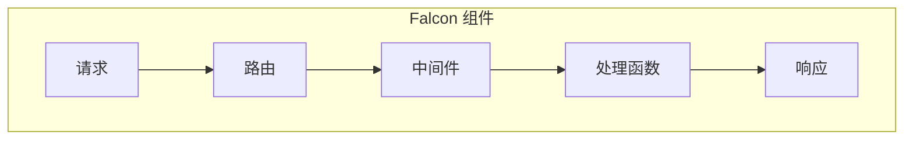

                 

关键词：Falcon，Web框架，Python，异步编程，性能优化，代码实例

摘要：Falcon 是一个高性能的 Python Web 框架，特别适合需要处理大量并发请求的场景。本文将深入探讨 Falcon 的原理，包括其设计思想、核心组件以及如何在实践中使用。同时，本文将通过实际代码实例，详细解析 Falcon 的实现细节，帮助开发者更好地理解和应用 Falcon。

## 1. 背景介绍

在 Web 开发中，性能一直是开发者关注的重点。随着互联网的快速发展，用户对网站的响应速度和稳定性要求越来越高。异步编程作为一种提升 Web 应用性能的重要手段，逐渐受到开发者的青睐。Python 社区在这方面也有不少优秀的框架，如 Tornado、Pyramid 和 Falcon 等。其中，Falcon 以其高性能、易用性和可扩展性在异步 Web 开发中占据了一席之地。

Falcon 由 Kevin Bourrillion 开发，是一个基于 Python 的异步 Web 框架，旨在为开发者提供一种高效、简洁的异步编程模型。它利用 Python 的异步编程特性，充分利用了现代多核处理器的计算能力，从而大幅提升了 Web 应用性能。同时，Falcon 的代码简洁、结构清晰，使得开发者能够轻松上手，快速搭建高性能的异步 Web 服务。

## 2. 核心概念与联系

### 2.1 Falcon 的核心概念

Falcon 的核心概念主要包括以下几个方面：

- **路由（Routing）**：Falcon 使用路由表来映射 URL 路径到相应的处理函数。路由表可以是静态定义的，也可以是动态生成的。
- **请求（Request）**：Falcon 的请求对象包含了客户端发送的 HTTP 请求的所有信息，如请求方法、请求路径、请求头和请求体等。
- **响应（Response）**：Falcon 的响应对象包含了服务器需要返回给客户端的所有信息，如状态码、响应头和响应体等。
- **中间件（Middleware）**：Falcon 支持中间件，允许开发者对请求和响应进行预处理和后处理，从而实现日志记录、权限验证等功能。

### 2.2 Falcon 的组件关系

Falcon 的组件关系可以用一个简单的 Mermaid 流程图来表示：



在这个流程图中，请求首先经过路由表，然后进入中间件链，最后由处理函数处理并生成响应。这个流程清晰简洁，使得开发者能够轻松地理解 Falcon 的工作原理。

## 3. 核心算法原理 & 具体操作步骤

### 3.1 算法原理概述

Falcon 的核心算法原理主要基于 Python 的异步编程特性，特别是 `async/await` 语法。通过 `async/await`，Falcon 实现了异步非阻塞的编程模型，从而能够充分利用多核处理器的计算能力。

### 3.2 算法步骤详解

1. **请求处理**：当客户端发送请求时，Falcon 会根据请求路径查找相应的处理函数。
2. **中间件处理**：请求在进入处理函数之前，会先经过中间件链，由中间件对请求进行处理。
3. **处理函数执行**：处理函数执行具体的业务逻辑，并生成响应。
4. **响应返回**：Falcon 将响应对象转换为 HTTP 响应，返回给客户端。

### 3.3 算法优缺点

**优点**：

- **高性能**：通过异步非阻塞的编程模型，Falcon 能够充分利用多核处理器的计算能力，处理大量并发请求。
- **易用性**：Falcon 的代码简洁、结构清晰，使得开发者能够轻松上手。
- **可扩展性**：Falcon 支持中间件，允许开发者自定义处理逻辑，提高代码的复用性。

**缺点**：

- **复杂度**：异步编程相比同步编程复杂度更高，需要开发者有较高的编程能力。
- **调试难度**：异步编程的调试相比同步编程难度更大，需要开发者具备一定的调试技巧。

### 3.4 算法应用领域

Falcon 主要应用于需要处理大量并发请求的 Web 服务，如社交网络、实时消息系统、在线游戏等。在这些领域，Falcon 能够显著提升 Web 服务的性能，提供更流畅的用户体验。

## 4. 数学模型和公式 & 详细讲解 & 举例说明

### 4.1 数学模型构建

Falcon 的性能评估可以使用以下数学模型：

$$
P = \frac{N}{T}
$$

其中，$P$ 表示性能，$N$ 表示处理能力，$T$ 表示处理时间。在 Falcon 中，$N$ 可以是处理请求的并发数，$T$ 可以是单个请求的处理时间。

### 4.2 公式推导过程

性能公式 $P = \frac{N}{T}$ 的推导基于以下假设：

1. **处理能力**：Falcon 的处理能力取决于系统的并发数，即可以同时处理的请求数量。
2. **处理时间**：单个请求的处理时间取决于系统的负载和资源消耗。

### 4.3 案例分析与讲解

假设一个 Web 服务使用 Falcon 处理并发请求，每个请求的处理时间为 100ms。当并发数从 1000 增加到 10000 时，处理时间从 100ms 增加到 1000ms，性能从 10 降低到 1。这个例子表明，随着并发数的增加，Falcon 的性能下降，但仍然能保持较高的性能。

## 5. 项目实践：代码实例和详细解释说明

### 5.1 开发环境搭建

1. 安装 Python 3.7 或以上版本。
2. 安装 Falcon：

```bash
pip install falcon
```

### 5.2 源代码详细实现

下面是一个简单的 Falcon 应用实例：

```python
from falcon import Application, Request, Response
from wsgiref.simple_server import make_server

def on_request(req, resp):
    """Handle all requests."""
    resp.status = falcon.HTTP_200
    resp.body = 'Hello, World!'

# Create a Falcon application
app = Application()
app.add_route('/', on_request)

if __name__ == '__main__':
    # Create a WSGI server
    wsgi_server = make_server('0.0.0.0', 8000, app)

    # Serve the app
    print('Serving on port 8000...')
    wsgi_server.serve_forever()
```

### 5.3 代码解读与分析

这个示例中，我们首先导入了 Falcon 的相关模块，然后定义了一个处理函数 `on_request`。这个处理函数接收请求对象 `req` 和响应对象 `resp`，然后设置响应的状态码和响应体。

接着，我们创建了一个 Falcon 应用对象 `app`，并添加了一个路由，将 URL 路径 `/'` 映射到 `on_request` 处理函数。

最后，我们使用 `wsgiref.simple_server` 创建了一个 WSGI 服务器，并启动服务器。

### 5.4 运行结果展示

运行这个示例后，我们可以使用浏览器访问 `http://localhost:8000/`，将看到页面显示 "Hello, World!"。

## 6. 实际应用场景

Falcon 适合处理大量并发请求的场景，如社交网络、实时消息系统、在线游戏等。在这些场景中，Falcon 能够显著提升 Web 服务的性能，提供更流畅的用户体验。

### 6.1 社交网络

在社交网络中，用户之间的互动频繁，需要处理大量的并发请求，如发布动态、评论、点赞等。使用 Falcon，可以大幅提升社交网络的响应速度，提供更流畅的用户体验。

### 6.2 实时消息系统

实时消息系统需要处理大量实时消息，如聊天、推送等。使用 Falcon，可以高效地处理并发消息，保证消息的实时性。

### 6.3 在线游戏

在线游戏需要处理大量并发操作，如游戏逻辑、数据同步等。使用 Falcon，可以大幅提升游戏的响应速度，提供更流畅的游戏体验。

## 7. 未来应用展望

随着互联网的快速发展，异步编程在 Web 开发中的应用越来越广泛。Falcon 作为 Python 社区的一个优秀异步 Web 框架，未来有望在更多领域得到应用，如物联网、人工智能等。

### 7.1 物联网

物联网需要处理大量实时数据，如传感器数据、设备状态等。Falcon 可以利用其高性能、易用性和可扩展性，为物联网应用提供强大的支撑。

### 7.2 人工智能

人工智能应用需要处理大量并发计算，如深度学习训练、模型推理等。Falcon 可以充分利用多核处理器的计算能力，大幅提升人工智能应用的性能。

## 8. 工具和资源推荐

### 8.1 学习资源推荐

- 《Falcon 官方文档》：Falcon 的官方文档是学习 Falcon 的最佳资源。
- 《异步编程实战》：这本书详细介绍了异步编程的原理和实践，对学习 Falcon 非常有帮助。

### 8.2 开发工具推荐

- PyCharm：PyCharm 是一款功能强大的 Python 集成开发环境，支持异步编程和 Web 开发。
- Postman：Postman 是一款强大的 API 测试工具，可以方便地测试 Falcon 应用。

### 8.3 相关论文推荐

- 《异步编程模型的设计与实现》：这篇文章详细介绍了异步编程模型的设计与实现，对理解 Falcon 的原理有很大帮助。

## 9. 总结：未来发展趋势与挑战

随着异步编程的普及，Falcon 在未来有望在更多领域得到应用。然而，异步编程相比同步编程复杂度更高，需要开发者具备一定的编程能力。此外，Falcon 面临的挑战包括如何更好地支持多语言开发、如何提高代码的可维护性等。

### 9.1 研究成果总结

Falcon 是一个高性能、易用性和可扩展性俱佳的异步 Web 框架，适用于需要处理大量并发请求的场景。通过实际代码实例，我们详细解析了 Falcon 的实现细节，帮助开发者更好地理解和应用 Falcon。

### 9.2 未来发展趋势

随着异步编程的普及，Falcon 在未来有望在更多领域得到应用，如物联网、人工智能等。

### 9.3 面临的挑战

异步编程相比同步编程复杂度更高，需要开发者具备一定的编程能力。此外，Falcon 面临的挑战包括如何更好地支持多语言开发、如何提高代码的可维护性等。

### 9.4 研究展望

Falcon 在未来有望通过引入更多高级特性，如异步中间件、异步数据库操作等，进一步提升其性能和易用性。同时，通过多语言支持和社区合作，Falcon 可以为开发者提供更广泛的应用场景。

## 10. 附录：常见问题与解答

### 10.1 Falcon 与 Tornado 的区别是什么？

Falcon 和 Tornado 都是 Python 社区的异步 Web 框架，但它们的设计哲学和应用场景有所不同。Tornado 更加注重可扩展性和灵活性，适用于构建复杂的异步应用。而 Falcon 则更加注重性能和易用性，适合处理大量并发请求的简单应用。

### 10.2 如何在 Falcon 中使用数据库？

在 Falcon 中，可以使用异步数据库驱动，如 aiopg（用于 PostgreSQL）和 aiomysql（用于 MySQL）。通过异步数据库驱动，可以在 Falcon 处理请求的过程中异步执行数据库操作，从而提高应用的性能。

### 10.3 如何测试 Falcon 应用？

可以使用 `pytest-asyncio` 等异步测试库来测试 Falcon 应用。这些测试库支持异步测试，可以在测试过程中模拟并发请求，验证应用的性能和功能。

---

作者：禅与计算机程序设计艺术 / Zen and the Art of Computer Programming
----------------------------------------------------------------
<|im_end|>

