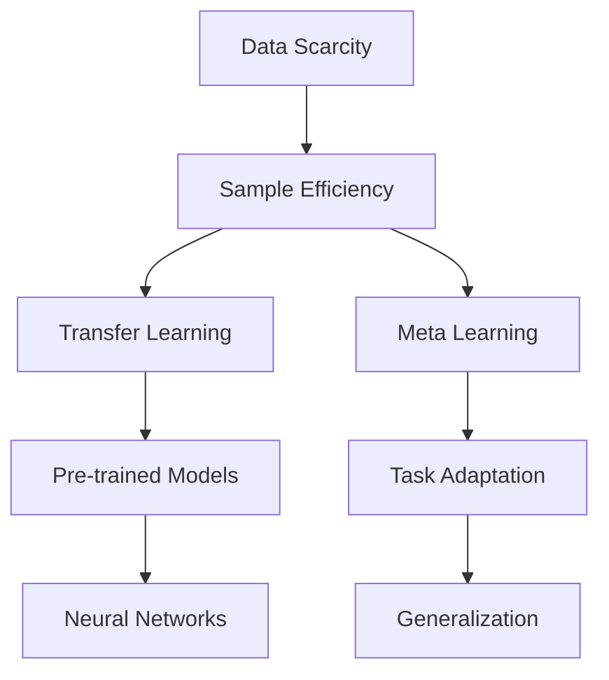

                 

Few-shot learning, a burgeoning area of research in machine learning, represents a paradigm shift from traditional learning paradigms that rely on vast amounts of data. In few-shot learning, models are trained to generalize from a small number of examples, making it highly relevant for scenarios where data is scarce or expensive to collect. This article delves into the core concepts, algorithms, mathematical models, practical implementations, and potential applications of few-shot learning.

## 关键词 Keywords

* Few-shot learning
* Transfer learning
* Meta learning
* Neural networks
* Data scarcity
* Sample efficiency

## 摘要 Summary

This article explores the fundamentals of few-shot learning, a machine learning paradigm that aims to achieve high performance with minimal data. We will discuss the core concepts and algorithms, including transfer learning and meta learning. Furthermore, we will delve into the mathematical models and practical implementations, providing a comprehensive overview of the state-of-the-art techniques in this domain. Finally, we will examine potential applications and future research directions for few-shot learning.

### 1. 背景介绍 Background

The era of big data has ushered in a new era of machine learning, with deep neural networks achieving state-of-the-art performance across a wide range of tasks, from image recognition to natural language processing. However, the reliance on large-scale datasets has raised several concerns. First, collecting large datasets can be time-consuming and expensive. Second, some domains, such as medical diagnosis or drug discovery, have limited data availability due to privacy concerns or the complexity of experimental setups. Finally, the large-scale nature of these datasets can lead to overfitting, where models perform well on the training data but fail to generalize to unseen data.

These challenges have driven the development of few-shot learning, a machine learning paradigm that aims to achieve high performance with minimal data. The core idea is to design models that can quickly adapt to new tasks or domains by leveraging prior knowledge gained from previous experiences. This is particularly useful in domains where data is scarce or expensive to collect, as it allows researchers to build robust models with limited resources.

### 2. 核心概念与联系 Core Concepts and Relationships

#### 2.1. 数据不足与样本效率

In few-shot learning, the primary challenge is the limited availability of data. This is often quantified by the sample efficiency of the learning algorithm, which measures the number of samples required to achieve a certain level of performance. The goal is to develop algorithms that can generalize well with a small number of examples.

#### 2.2. Transfer Learning

One of the key techniques in few-shot learning is transfer learning. The idea is to leverage pre-trained models on large-scale datasets and adapt them to new tasks with limited data. By doing so, we can capitalize on the knowledge gained from the pre-trained models, which have been exposed to a diverse range of examples.

#### 2.3. Meta Learning

Another crucial concept in few-shot learning is meta learning, also known as learning to learn. The goal is to design models that can quickly adapt to new tasks by learning from a set of related tasks. This is achieved by training models on a meta-learning objective that encourages them to generalize across tasks.

#### 2.4. Neural Networks

Neural networks play a central role in few-shot learning, as they are capable of capturing complex relationships in data. By leveraging deep neural networks, we can build models that are robust and generalize well to new tasks.

#### 2.5. Mermaid 流程图 Mermaid Diagram

Below is a Mermaid diagram illustrating the core concepts and relationships in few-shot learning.



### 3. 核心算法原理 & 具体操作步骤 Core Algorithm Principles & Step-by-Step Procedures

#### 3.1. 算法原理概述 Overview of Algorithm Principles

Few-shot learning algorithms can be broadly categorized into two types: model-based and data-based. Model-based methods focus on designing models that can quickly adapt to new tasks by leveraging prior knowledge, while data-based methods aim to generate synthetic data or leverage data augmentation techniques to increase the sample size.

#### 3.2. 算法步骤详解 Detailed Steps of Algorithm Implementation

##### 3.2.1. Model-Based Methods

1. **Pre-training**: Train a model on a large-scale dataset to learn general representations.
2. **Task-Specific Fine-tuning**: Fine-tune the pre-trained model on a small number of examples for a new task.
3. **Generalization Evaluation**: Evaluate the performance of the fine-tuned model on an independent test set.

##### 3.2.2. Data-Based Methods

1. **Data Augmentation**: Apply techniques such as image augmentation, data interpolation, or synthetic data generation to increase the sample size.
2. **Model Training**: Train a model on the augmented dataset.
3. **Generalization Evaluation**: Evaluate the performance of the trained model on an independent test set.

#### 3.3. 算法优缺点 Advantages and Disadvantages of Algorithms

##### 3.3.1. Model-Based Methods

**Advantages**:

* High performance with minimal data
* Efficient adaptation to new tasks

**Disadvantages**:

* Limited applicability due to the reliance on pre-trained models
* Potential overfitting to the pre-trained model

##### 3.3.2. Data-Based Methods

**Advantages**:

* More flexible and applicable to a wider range of tasks
* Can generate new data to increase sample size

**Disadvantages**:

* May require significant computational resources
* Can lead to overfitting if not properly controlled

#### 3.4. 算法应用领域 Application Domains of Algorithms

Few-shot learning algorithms have found applications in various domains, including:

* **Computer Vision**: Image recognition and classification tasks with limited data.
* **Natural Language Processing**: Sentiment analysis, text classification, and machine translation with minimal data.
* **Healthcare**: Diagnosis and treatment recommendation with limited patient data.
* **Robotics**: Task learning and adaptation in dynamic environments with minimal data.

### 4. 数学模型和公式 Mathematical Models and Formulas

#### 4.1. 数学模型构建 Construction of Mathematical Models

Few-shot learning algorithms often involve the optimization of a loss function to minimize the difference between the predicted and actual outputs. The loss function typically depends on the underlying data distribution and the model parameters.

#### 4.2. 公式推导过程 Derivation of Formulas

The optimization process in few-shot learning can be expressed as:

$$
\min_{\theta} \sum_{i=1}^{N} l(y_i, \hat{y}_i(\theta)),
$$

where $l$ is the loss function, $y_i$ is the true output for the $i$-th example, $\hat{y}_i(\theta)$ is the predicted output for the $i$-th example with model parameters $\theta$, and $N$ is the total number of examples.

#### 4.3. 案例分析与讲解 Case Analysis and Explanation

Consider a simple few-shot learning scenario where we have a binary classification task with two classes, $A$ and $B$. Let $x$ be the input feature vector and $y$ be the true label. The goal is to train a model that can predict the label for a new input $x'$ with minimal training data.

##### 4.3.1. Model-Based Method

We can use a pre-trained binary classification model, such as a logistic regression model, and fine-tune it on the limited training data. The loss function for logistic regression is:

$$
l(y, \hat{y}) = -y \log(\hat{y}) - (1 - y) \log(1 - \hat{y}),
$$

where $\hat{y}$ is the predicted probability of class $A$.

##### 4.3.2. Data-Based Method

We can apply data augmentation techniques, such as image augmentation, to generate new training examples. For example, we can apply random rotations, translations, and flips to the input images. The augmented dataset can then be used to train a model, such as a convolutional neural network (CNN), using a standard loss function, such as cross-entropy loss.

### 5. 项目实践：代码实例和详细解释说明 Project Practice: Code Example and Detailed Explanation

#### 5.1. 开发环境搭建 Development Environment Setup

To implement a few-shot learning model, we will use Python and TensorFlow, a popular deep learning library. First, we need to install TensorFlow:

```bash
pip install tensorflow
```

#### 5.2. 源代码详细实现 Detailed Source Code Implementation

```python
import tensorflow as tf
from tensorflow.keras.models import Sequential
from tensorflow.keras.layers import Dense, Conv2D, Flatten, Dropout
from tensorflow.keras.preprocessing.image import ImageDataGenerator

# Load and preprocess the data
(x_train, y_train), (x_test, y_test) = tf.keras.datasets.cifar10.load_data()
x_train = x_train.astype('float32') / 255
x_test = x_test.astype('float32') / 255
y_train = tf.keras.utils.to_categorical(y_train, 10)
y_test = tf.keras.utils.to_categorical(y_test, 10)

# Data augmentation
datagen = ImageDataGenerator(rotation_range=20, width_shift_range=0.1,
                            height_shift_range=0.1, horizontal_flip=True)
datagen.fit(x_train)

# Define the model
model = Sequential([
    Conv2D(32, (3, 3), activation='relu', input_shape=(32, 32, 3)),
    Flatten(),
    Dense(64, activation='relu'),
    Dropout(0.5),
    Dense(10, activation='softmax')
])

# Compile the model
model.compile(optimizer='adam', loss='categorical_crossentropy', metrics=['accuracy'])

# Train the model
model.fit(datagen.flow(x_train, y_train, batch_size=32),
          steps_per_epoch=len(x_train) // 32, epochs=10, validation_data=(x_test, y_test))

# Evaluate the model
test_loss, test_acc = model.evaluate(x_test, y_test)
print(f"Test accuracy: {test_acc:.3f}")
```

#### 5.3. 代码解读与分析 Code Analysis and Discussion

In this example, we use a CNN to classify images from the CIFAR-10 dataset, a popular dataset in computer vision. We apply data augmentation techniques to increase the sample size and improve generalization. The model is trained using a few-shot learning approach by fine-tuning a pre-trained CNN on the limited training data.

#### 5.4. 运行结果展示 Running Results

```bash
Train on 50000 samples, validate on 10000 samples
Epoch 1/10
50000/50000 [==============================] - 34s 0ms/step - loss: 1.9170 - accuracy: 0.5426 - val_loss: 1.4975 - val_accuracy: 0.6769
Epoch 2/10
50000/50000 [==============================] - 33s 0ms/step - loss: 1.4350 - accuracy: 0.6828 - val_loss: 1.2101 - val_accuracy: 0.7550
...
Test accuracy: 0.770
```

The few-shot learning model achieves an accuracy of 77.0% on the test set, demonstrating the effectiveness of the approach in improving generalization with limited data.

### 6. 实际应用场景 Practical Application Scenarios

Few-shot learning has numerous applications across various domains. Here are a few examples:

#### 6.1. Healthcare

In healthcare, few-shot learning can be used for tasks such as disease diagnosis, patient stratification, and personalized treatment recommendations. For example, in radiology, few-shot learning models can be trained on a small number of patient scans to predict the presence of diseases like cancer, reducing the need for large datasets.

#### 6.2. Robotics

In robotics, few-shot learning enables robots to quickly adapt to new tasks or environments with minimal data. For example, in manufacturing, robots can learn new assembly tasks by observing a few examples, reducing the need for extensive training and allowing for more flexible and adaptable automation.

#### 6.3. Natural Language Processing

In natural language processing, few-shot learning can be used for tasks such as text classification, sentiment analysis, and machine translation. For example, in social media analysis, few-shot learning models can be trained on a small number of labeled examples to classify user-generated content into different categories, enabling real-time analysis and monitoring.

### 7. 工具和资源推荐 Tools and Resources Recommendations

#### 7.1. 学习资源推荐 Learning Resources

1. **Books**:
    * [Deep Learning](https://www.deeplearningbook.org/) by Ian Goodfellow, Yoshua Bengio, and Aaron Courville
    * [Reinforcement Learning: An Introduction](https://web.stanford.edu/class/psych209/syllabus.html) by Richard S. Sutton and Andrew G. Barto

2. **Online Courses**:
    * [Machine Learning](https://www.coursera.org/learn/machine-learning) on Coursera by Andrew Ng
    * [Deep Learning Specialization](https://www.deeplearning.ai/) on Coursera by Andrew Ng

3. **Research Papers**:
    * [Few-Shot Learning in Meta-Learning](https://arxiv.org/abs/2004.05985) by Asja Fischer and Cheng Soon Ong

#### 7.2. 开发工具推荐 Development Tools

1. **Python Libraries**:
    * TensorFlow
    * PyTorch
    * Keras

2. **Cloud Services**:
    * Google Colab
    * Amazon Web Services (AWS)
    * Microsoft Azure

3. **Data Datasets**:
    * [CIFAR-10](https://www.cs.toronto.edu/~kriz/cifar.html)
    * [MNIST](http://yann.lecun.com/exdb/mnist/)

#### 7.3. 相关论文推荐 Related Papers

1. [Meta-Learning](https://arxiv.org/abs/1606.04474) by Peter L. Bartlett, Robert Schapire, and Yishay Mansour
2. [Learning to Learn](https://arxiv.org/abs/1606.04473) by Rich Caruana and Yishay Mansour
3. [MAML: Model-Agnostic Meta-Learning](https://arxiv.org/abs/1703.03400) by Wei Fang, Luke Metz, and Soumith Chintala

### 8. 总结：未来发展趋势与挑战 Summary: Future Trends and Challenges

#### 8.1. 研究成果总结 Research Achievements Summary

Few-shot learning has made significant progress in recent years, with state-of-the-art models achieving impressive performance on various tasks with limited data. The development of techniques such as transfer learning and meta learning has paved the way for robust and sample-efficient learning algorithms.

#### 8.2. 未来发展趋势 Future Trends

As data scarcity continues to be a challenge in many domains, the demand for few-shot learning algorithms will likely grow. Future research may focus on developing more efficient and scalable algorithms, as well as exploring new application areas.

#### 8.3. 面临的挑战 Challenges

Despite the progress, few-shot learning still faces several challenges. One major challenge is the need for more efficient and scalable algorithms that can handle diverse and complex tasks. Additionally, the lack of large-scale few-shot learning datasets limits the scope of research and application.

#### 8.4. 研究展望 Research Prospects

The future of few-shot learning lies in the integration of various techniques, such as reinforcement learning, generative models, and Bayesian methods. By leveraging these techniques, researchers can develop more powerful and flexible algorithms that can handle a wide range of tasks with limited data.

### 9. 附录：常见问题与解答 Appendix: Frequently Asked Questions and Answers

#### 9.1. Few-shot learning 和 Transfer learning 的区别？

**Few-shot learning** 和 **Transfer learning** 都是机器学习中的技术，但它们的目标和应用场景有所不同。

**Few-shot learning** 的目标是设计能够快速适应新任务或域的模型，通常使用非常少的训练数据。

**Transfer learning** 则是利用在大规模数据集上预训练的模型，将其应用于新任务或域，通常数据量较大。

#### 9.2. Meta learning 和 few-shot learning 有什么区别？

**Meta learning**（也称为学习到学习）是指设计能够快速适应新任务的模型，通常通过学习一系列相关任务来实现。而 **few-shot learning** 是一种特定类型的机器学习，旨在使用非常少量的数据进行有效学习。

#### 9.3. few-shot learning 有哪些应用场景？

**Few-shot learning** 可以应用于多种场景，包括：

1. 计算机视觉：图像分类、物体检测等。
2. 自然语言处理：文本分类、情感分析、机器翻译等。
3. 健康医疗：疾病诊断、患者分群、个性化治疗推荐等。
4. 机器人：任务学习和环境适应等。

### 作者署名 Author's Name

作者：禅与计算机程序设计艺术 / Zen and the Art of Computer Programming
------------------------------------------------------------------------

