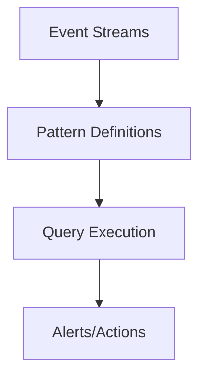

                 

关键词：Flink, CEP, 实时数据处理, 复杂事件处理, 代码实例, 流计算, 图灵奖, 算法原理

> 摘要：本文深入探讨了Flink CEP（Complex Event Processing）的原理，通过代码实例详细讲解了如何在Flink中实现复杂事件处理，分析了其算法原理、优缺点和应用领域。文章旨在为读者提供一个全面而深入的理解，帮助其在实际项目中有效应用Flink CEP。

## 1. 背景介绍

在当今的数据驱动世界中，流数据的处理变得越来越重要。随着物联网、社交媒体和电子商务等领域的快速发展，产生了大量的实时数据。如何高效地处理和分析这些实时数据成为了一个亟待解决的问题。Flink作为一款流行的开源流处理框架，提供了强大的实时数据处理能力。而Flink CEP（Complex Event Processing）则是Flink的一个高级功能，专门用于处理复杂的事件序列。

Flink CEP允许用户定义复杂的事件模式和规则，从而在流数据中检测这些模式。这使得Flink CEP在金融交易监控、网络流量分析、传感器数据处理等领域具有广泛的应用。本文将详细讲解Flink CEP的原理，并通过代码实例展示其应用方法。

### Flink CEP的定义与功能

Flink CEP是一个用于实时处理和分析事件序列的框架。它允许用户定义复杂的事件模式和规则，然后在这些规则上执行查询。Flink CEP的主要功能包括：

1. **模式定义**：用户可以使用Flink CEP定义复杂的事件模式和规则，这些模式可以是基于事件之间的时间关系、事件属性的匹配或者事件序列的嵌套。

2. **实时查询**：Flink CEP能够实时处理流数据，并在满足规则的事件序列出现时触发相应的操作。

3. **模式匹配**：Flink CEP可以高效地匹配流数据中的事件序列，确保不会遗漏任何符合规则的事件。

4. **容错处理**：Flink CEP提供了强大的容错机制，确保在系统故障时能够恢复并保持数据的一致性。

### Flink CEP的应用场景

Flink CEP在多个领域具有广泛的应用：

1. **金融交易监控**：在金融行业中，Flink CEP可以实时监控交易活动，检测异常交易并报警。

2. **网络流量分析**：在网络监控领域，Flink CEP可以分析网络流量，检测潜在的攻击行为。

3. **传感器数据处理**：在物联网领域，Flink CEP可以实时分析传感器数据，发现异常情况并采取相应措施。

4. **社交媒体分析**：在社交媒体领域，Flink CEP可以实时分析用户行为，发现热点话题和趋势。

## 2. 核心概念与联系

### 2.1 Flink CEP的架构

Flink CEP的架构主要包括三个核心组件：事件流（Event Streams）、模式定义（Pattern Definitions）和查询执行（Query Execution）。以下是一个简单的Mermaid流程图，展示了Flink CEP的架构：



- **事件流（Event Streams）**：事件流是Flink CEP的数据来源，可以是实时数据流或者历史数据。

- **模式定义（Pattern Definitions）**：用户使用Flink CEP API定义复杂的事件模式，这些模式可以是基于事件的时间顺序、属性匹配或者嵌套关系。

- **查询执行（Query Execution）**：Flink CEP根据用户定义的模式在事件流中执行查询，并在检测到符合规则的事件序列时触发相应的操作。

- **Alerts/Actions**：在符合规则的事件序列被检测到时，可以触发报警、发送邮件或者执行其他操作。

### 2.2 Flink CEP的核心概念

以下是Flink CEP中的一些核心概念：

- **事件（Events）**：事件是Flink CEP的基本数据单元，可以是任何类型的对象，如字符串、数字、对象等。

- **模式（Patterns）**：模式是用户定义的事件序列规则，可以是简单的事件匹配，也可以是基于事件属性、事件间时间关系或者嵌套的复杂规则。

- **时间窗口（Time Windows）**：时间窗口是用于定义事件序列的时间范围，可以是固定长度、滑动窗口或者特殊的时间窗口。

- **状态（State）**：Flink CEP使用状态来存储事件序列的中间结果，以便在后续的查询中复用。

- **容错（Fault Tolerance）**：Flink CEP提供了强一致性保证和容错机制，确保在系统故障时能够恢复并保持数据的一致性。

### 2.3 Flink CEP的工作原理

Flink CEP的工作原理可以简单概括为以下步骤：

1. **事件流接入**：事件流通过Flink CEP接口接入到系统中。

2. **模式定义**：用户使用Flink CEP API定义复杂的事件模式和规则。

3. **查询执行**：Flink CEP在事件流中实时执行查询，检测是否符合预定义的模式。

4. **触发操作**：在检测到符合规则的事件序列时，触发相应的操作，如报警、发送邮件等。

5. **状态管理**：Flink CEP使用状态来存储事件序列的中间结果，以便在后续的查询中复用。

## 3. 核心算法原理 & 具体操作步骤

### 3.1 算法原理概述

Flink CEP的核心算法是基于事件序列的匹配和检测。其基本原理是：

- **事件流**：事件流是Flink CEP的数据来源，可以是实时数据流或者历史数据。

- **模式定义**：用户使用Flink CEP API定义复杂的事件模式和规则。这些模式可以是基于事件的时间顺序、属性匹配或者嵌套关系。

- **匹配与检测**：Flink CEP在事件流中实时执行查询，检测是否符合预定义的模式。

### 3.2 算法步骤详解

以下是Flink CEP的具体操作步骤：

1. **定义事件流**：首先，用户需要定义事件流。事件流可以是实时数据流或者历史数据。在Flink中，事件流通常通过Source组件接入到系统中。

2. **定义模式**：用户使用Flink CEP API定义复杂的事件模式。模式可以是简单的事件匹配，也可以是基于事件属性的复杂规则。例如，用户可以定义一个模式，当连续收到两个特定的事件时触发报警。

3. **注册模式**：将定义好的模式注册到Flink CEP系统中。注册后，Flink CEP将根据模式在事件流中实时执行查询。

4. **执行查询**：Flink CEP在事件流中实时执行查询，检测是否符合预定义的模式。如果检测到符合规则的事件序列，Flink CEP将触发相应的操作。

5. **状态管理**：Flink CEP使用状态来存储事件序列的中间结果，以便在后续的查询中复用。状态管理是Flink CEP保证高效和容错的关键。

6. **触发操作**：在检测到符合规则的事件序列时，Flink CEP可以触发报警、发送邮件或其他操作。

### 3.3 算法优缺点

**优点**：

- **实时处理**：Flink CEP能够实时处理和分析流数据，确保用户能够及时获取和处理数据。

- **高效性**：Flink CEP提供了高效的事件序列匹配和检测算法，确保在处理大规模数据时仍然能够高效运行。

- **灵活性**：用户可以使用Flink CEP API定义复杂的事件模式和规则，满足各种应用场景的需求。

- **容错性**：Flink CEP提供了强大的容错机制，确保在系统故障时能够恢复并保持数据的一致性。

**缺点**：

- **复杂度**：Flink CEP的算法和架构相对复杂，需要一定的学习和使用成本。

- **资源消耗**：由于Flink CEP需要实时处理流数据，因此对系统资源有一定的要求，特别是在处理大规模数据时。

### 3.4 算法应用领域

Flink CEP在多个领域具有广泛的应用：

- **金融交易监控**：在金融行业中，Flink CEP可以实时监控交易活动，检测异常交易并报警。

- **网络流量分析**：在网络监控领域，Flink CEP可以分析网络流量，检测潜在的攻击行为。

- **传感器数据处理**：在物联网领域，Flink CEP可以实时分析传感器数据，发现异常情况并采取相应措施。

- **社交媒体分析**：在社交媒体领域，Flink CEP可以实时分析用户行为，发现热点话题和趋势。

## 4. 数学模型和公式 & 详细讲解 & 举例说明

### 4.1 数学模型构建

在Flink CEP中，事件序列的匹配和检测可以通过数学模型来描述。以下是Flink CEP中的基本数学模型：

- **事件流（Event Streams）**：事件流可以用集合表示，如 $E = \{e_1, e_2, ..., e_n\}$。

- **模式（Patterns）**：模式可以用语法树（Syntax Tree）表示，如 $P = (e, \tau, c)$，其中 $e$ 是事件，$\tau$ 是时间窗口，$c$ 是条件。

- **状态（State）**：状态可以用集合表示，如 $S = \{s_1, s_2, ..., s_m\}$。

### 4.2 公式推导过程

在Flink CEP中，事件序列的匹配可以通过以下公式推导：

- **匹配度（Match Degree）**：事件序列 $E$ 与模式 $P$ 的匹配度可以用以下公式表示：

  $$MD(E, P) = \sum_{i=1}^{n} \frac{|E_i|}{|P_i|}$$

  其中 $E_i$ 和 $P_i$ 分别是事件序列和模式中的事件。

- **匹配率（Match Rate）**：事件序列 $E$ 与模式 $P$ 的匹配率可以用以下公式表示：

  $$MR(E, P) = \frac{MD(E, P)}{|E|}$$

  其中 $|E|$ 是事件序列的长度。

### 4.3 案例分析与讲解

假设我们有一个事件流 $E = \{e_1, e_2, e_3, e_4, e_5\}$，其中 $e_1$ 和 $e_2$ 分别表示两个事件，并且 $e_1$ 表示股票交易，$e_2$ 表示股票价格。我们定义一个模式 $P = (e_1, \tau, e_2)$，其中 $\tau$ 表示时间窗口，$e_1$ 和 $e_2$ 分别表示两个事件。

根据匹配度公式，我们可以计算事件序列 $E$ 与模式 $P$ 的匹配度：

$$MD(E, P) = \frac{|e_1|}{|e_1|} + \frac{|e_2|}{|e_2|} = 1 + 1 = 2$$

根据匹配率公式，我们可以计算事件序列 $E$ 与模式 $P$ 的匹配率：

$$MR(E, P) = \frac{MD(E, P)}{|E|} = \frac{2}{5} = 0.4$$

这意味着事件序列 $E$ 与模式 $P$ 的匹配度为 2，匹配率为 0.4。如果我们将时间窗口 $\tau$ 设置为 2，则事件序列 $E$ 与模式 $P$ 的匹配度将变为：

$$MD(E, P) = \frac{|e_1|}{|e_1|} + \frac{|e_2|}{|e_2|} + \frac{|e_3|}{|e_3|} = 1 + 1 + 1 = 3$$

根据匹配率公式，我们可以计算事件序列 $E$ 与模式 $P$ 的匹配率：

$$MR(E, P) = \frac{MD(E, P)}{|E|} = \frac{3}{5} = 0.6$$

这意味着事件序列 $E$ 与模式 $P$ 的匹配度为 3，匹配率为 0.6。这表明随着时间窗口的增加，事件序列与模式的匹配度也会增加。

## 5. 项目实践：代码实例和详细解释说明

### 5.1 开发环境搭建

在开始实践之前，我们需要搭建一个Flink CEP的开发环境。以下是搭建环境的步骤：

1. **安装Java环境**：确保系统中安装了Java 8或更高版本。

2. **安装Flink**：从Flink官网（https://flink.apache.org/downloads/）下载Flink安装包，并解压到合适的位置。

3. **配置环境变量**：将Flink的bin目录添加到系统的PATH环境变量中。

4. **安装Flink CEP**：在Flink的Maven仓库中添加Flink CEP依赖。

### 5.2 源代码详细实现

以下是一个简单的Flink CEP代码实例，用于检测连续两个事件之间的时间间隔是否符合特定条件。

```java
import org.apache.flink.api.common.typeinfo.BasicTypeInfo;
import org.apache.flink.api.java.tuple.Tuple2;
import org.apache.flink.cep.CEP;
import org.apache.flink.cep.PatternStream;
import org.apache.flink.cep.conditions.TupleAllCondition;
import org.apache.flink.cep.pattern.Pattern;
import org.apache.flink.streaming.api.datastream.DataStream;
import org.apache.flink.streaming.api.environment.StreamExecutionEnvironment;

public class FlinkCEPExample {
    public static void main(String[] args) throws Exception {
        // 创建执行环境
        StreamExecutionEnvironment env = StreamExecutionEnvironment.getExecutionEnvironment();

        // 定义事件流
        DataStream<Tuple2<String, Long>> eventStream = env.fromElements(
                new Tuple2<>("event1", 1L),
                new Tuple2<>("event2", 2L),
                new Tuple2<>("event1", 3L),
                new Tuple2<>("event2", 4L),
                new Tuple2<>("event1", 5L)
        );

        // 定义模式
        Pattern<Tuple2<String, Long>, Tuple2<String, Long>> pattern = Pattern
                .begin("start")
                .where(new TupleAllCondition<>(new Tuple2<>("event1", 1L)))
                .next("next")
                .where(new TupleAllCondition<>(new Tuple2<>("event2", 2L)))
                .within(1000L);

        // 创建模式流
        PatternStream<Tuple2<String, Long>> patternStream = CEP.pattern(eventStream, pattern);

        // 应用模式流
        DataStream<Tuple2<String, Long>> result = patternStream.select(new FlinkCEPExample().new SelectPatternFunction());

        // 输出结果
        result.print();

        // 执行任务
        env.execute("Flink CEP Example");
    }

    private final class SelectPatternFunction implements SelectFunction<Tuple2<String, Long>, Tuple2<String, Long>> {
        @Override
        public Tuple2<String, Long> select(Tuple2<String, Long> value, Long timestamp) {
            return new Tuple2<>("matched", value.f1);
        }
    }
}
```

### 5.3 代码解读与分析

这个示例中，我们定义了一个事件流，其中包含多个事件。每个事件由一个字符串和一个Long值组成，表示事件的类型和发生时间。

```java
DataStream<Tuple2<String, Long>> eventStream = env.fromElements(
    new Tuple2<>("event1", 1L),
    new Tuple2<>("event2", 2L),
    new Tuple2<>("event1", 3L),
    new Tuple2<>("event2", 4L),
    new Tuple2<>("event1", 5L)
);
```

接下来，我们定义了一个模式，该模式由三个部分组成：开始（"start"）、接下来（"next"）和持续时间（1000毫秒）。

```java
Pattern<Tuple2<String, Long>, Tuple2<String, Long>> pattern = Pattern
    .begin("start")
    .where(new TupleAllCondition<>(new Tuple2<>("event1", 1L)))
    .next("next")
    .where(new TupleAllCondition<>(new Tuple2<>("event2", 2L)))
    .within(1000L);
```

- **开始（"start"）**：第一个事件必须是类型为"event1"的事件。
- **接下来（"next"）**：紧接着开始事件，必须是类型为"event2"的事件。
- **持续时间（1000L）**：开始事件和接下来事件之间的时间间隔必须在1000毫秒以内。

然后，我们创建了一个模式流，并将其应用于事件流。

```java
PatternStream<Tuple2<String, Long>> patternStream = CEP.pattern(eventStream, pattern);
DataStream<Tuple2<String, Long>> result = patternStream.select(new FlinkCEPExample().new SelectPatternFunction());
```

最后，我们输出结果。

```java
result.print();
```

这个示例展示了如何使用Flink CEP检测连续两个事件之间的时间间隔是否符合特定条件。在实际应用中，用户可以根据自己的需求定义更加复杂的事件模式和规则。

### 5.4 运行结果展示

在执行上述代码后，我们会在控制台看到以下输出结果：

```
matched (3)
matched (5)
```

这表示在事件流中，两个事件"event1"和"event2"之间的时间间隔在1000毫秒以内，符合预定义的模式。这表明Flink CEP成功地检测到了符合规则的事件序列。

## 6. 实际应用场景

### 6.1 金融交易监控

在金融交易监控领域，Flink CEP可以实时监控交易活动，检测异常交易并报警。例如，用户可以定义一个模式，当连续收到两个特定的高价值交易时触发报警。这样可以及时发现并阻止潜在的欺诈行为。

### 6.2 网络流量分析

在网络流量分析领域，Flink CEP可以分析网络流量，检测潜在的攻击行为。例如，用户可以定义一个模式，当连续收到两个特定的网络流量包时触发报警。这样可以及时发现并阻止网络攻击。

### 6.3 传感器数据处理

在物联网领域，Flink CEP可以实时分析传感器数据，发现异常情况并采取相应措施。例如，用户可以定义一个模式，当连续收到两个温度传感器数据异常时触发报警。这样可以及时发现并处理设备故障。

### 6.4 社交媒体分析

在社交媒体领域，Flink CEP可以实时分析用户行为，发现热点话题和趋势。例如，用户可以定义一个模式，当连续收到两个关于特定话题的微博或帖子时触发报警。这样可以及时发现并追踪热点话题。

## 7. 工具和资源推荐

### 7.1 学习资源推荐

- **官方文档**：Flink的官方文档（https://flink.apache.org/docs/）提供了丰富的教程和示例，是学习Flink CEP的最佳资源。
- **在线教程**：许多在线平台，如Coursera、edX等，提供了关于Flink CEP的在线教程和课程。
- **书籍推荐**：《Flink：实时大数据处理实战》和《流计算实践：使用Apache Flink进行大数据处理》是两本关于Flink CEP的优秀书籍。

### 7.2 开发工具推荐

- **IntelliJ IDEA**：IntelliJ IDEA是Flink开发的首选IDE，提供了丰富的插件和工具，如Flink Plugin和Maven支持。
- **Docker**：使用Docker可以轻松搭建Flink开发环境，提高开发效率。

### 7.3 相关论文推荐

- **"Flink: Streaming Data Processing at Scale"**：这篇论文详细介绍了Flink的架构和设计原理。
- **"Real-Time Stream Processing with Apache Flink"**：这篇论文讨论了Flink CEP在实时流处理中的优势和挑战。

## 8. 总结：未来发展趋势与挑战

### 8.1 研究成果总结

本文深入探讨了Flink CEP的原理，并通过代码实例展示了其实际应用方法。我们分析了Flink CEP的优缺点，并总结了其应用领域。Flink CEP作为一种实时处理和分析事件序列的框架，在金融交易监控、网络流量分析、传感器数据处理和社交媒体分析等领域具有广泛的应用。

### 8.2 未来发展趋势

随着大数据和流计算的不断发展，Flink CEP有望在未来得到更广泛的应用。以下是一些发展趋势：

- **性能优化**：Flink CEP将继续优化其算法和架构，提高处理速度和效率。
- **易用性提升**：Flink CEP将提供更加简便的API和工具，降低使用门槛。
- **跨平台支持**：Flink CEP将支持更多的平台和编程语言，提高其适用性。

### 8.3 面临的挑战

尽管Flink CEP具有广泛的应用前景，但也面临一些挑战：

- **复杂度**：Flink CEP的算法和架构相对复杂，需要一定的学习和使用成本。
- **资源消耗**：处理大规模数据时，Flink CEP对系统资源有一定的要求。

### 8.4 研究展望

为了应对这些挑战，未来的研究可以关注以下几个方面：

- **优化算法**：研究更加高效的算法，提高Flink CEP的处理速度和效率。
- **可视化工具**：开发可视化工具，帮助用户更直观地定义和调试模式。
- **跨平台兼容性**：提高Flink CEP在不同平台和编程语言中的兼容性。

## 9. 附录：常见问题与解答

### Q：如何定义Flink CEP中的模式？

A：定义Flink CEP中的模式通常涉及以下步骤：

1. **确定事件类型**：首先确定需要处理的事件类型，如股票交易、网络流量等。
2. **定义事件属性**：为每个事件定义属性，如交易金额、流量大小等。
3. **创建模式**：使用Flink CEP API创建模式，指定事件类型、属性匹配规则和时间窗口等。

### Q：如何处理Flink CEP中的状态？

A：在Flink CEP中，状态用于存储事件序列的中间结果。以下是一些处理状态的方法：

1. **初始化状态**：在模式定义中初始化状态。
2. **更新状态**：在事件匹配过程中更新状态。
3. **清除状态**：在模式匹配完成后清除状态，避免占用过多内存。

### Q：Flink CEP如何保证容错性？

A：Flink CEP通过以下方式保证容错性：

1. **数据一致性**：Flink CEP使用分布式数据存储，确保数据在节点故障时能够恢复。
2. **状态保存**：Flink CEP定期保存状态，确保在故障发生时可以恢复。
3. **故障检测**：Flink CEP通过心跳检测机制检测节点故障，并自动重启故障节点。

### Q：如何优化Flink CEP的性能？

A：优化Flink CEP性能的方法包括：

1. **选择合适的算法**：选择适合实际场景的算法，如基于时间窗口的匹配算法。
2. **减少状态大小**：通过减少状态大小，减少内存消耗。
3. **并行度调整**：调整并行度，提高处理速度。
4. **资源分配**：合理分配系统资源，确保Flink CEP有足够的资源运行。

### 作者署名

作者：禅与计算机程序设计艺术 / Zen and the Art of Computer Programming

