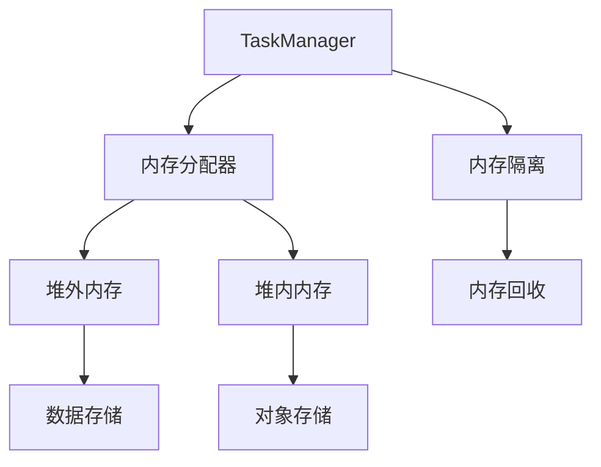

                 

本文将深入探讨Flink的内存管理原理，并借助代码实例对其操作步骤、算法优缺点、应用领域、数学模型和实际应用场景进行详细讲解。文章旨在帮助读者全面了解Flink内存管理，从而在实际项目中有效应用这一重要特性。

## 1. 背景介绍

Apache Flink是一个分布式流处理框架，广泛应用于实时数据处理、批处理、机器学习和复杂的分析任务。随着数据规模的不断扩大和业务需求的不断增长，如何高效地管理内存资源成为Flink能否胜任大规模数据处理任务的关键因素之一。

内存管理作为Flink的核心组件之一，直接影响到Flink的性能和稳定性。Flink的内存管理包括两方面：一是内存分配策略，二是内存回收机制。合理地设计内存管理策略，可以有效避免内存溢出和资源浪费，提高系统的整体性能。

## 2. 核心概念与联系

在探讨Flink内存管理之前，我们需要了解一些核心概念，包括内存分配器、内存隔离、堆外内存等。

### 2.1 内存分配器

Flink使用Tungsten内存分配器，这是一种高性能、低开销的内存分配策略。Tungsten内存分配器将内存分成多个大小相等的块，每个块既可以用来存储数据，也可以用来存储元数据。

### 2.2 内存隔离

内存隔离是Flink内存管理的一个关键特性。通过内存隔离，Flink可以将内存分配给不同的任务、不同的应用程序，从而避免内存竞争和泄漏。Flink使用TaskManager来隔离内存，每个TaskManager负责管理自己的一部分内存。

### 2.3 堆外内存

堆外内存（Off-Heap Memory）是相对于Java堆内存（Heap Memory）的一种内存管理方式。堆外内存不依赖于Java垃圾回收机制，可以提供更高的性能和更精细的内存控制。Flink大量使用堆外内存来存储中间数据，从而提高数据处理速度。

### 2.4 Mermaid 流程图

下面是Flink内存管理架构的Mermaid流程图：



## 3. 核心算法原理 & 具体操作步骤

### 3.1 算法原理概述

Flink的内存管理算法主要包括以下几个部分：

1. **内存分页策略**：将内存分成大小相等的块，以便高效分配和回收。
2. **内存共享**：通过内存隔离，确保不同任务之间不会相互干扰。
3. **内存压缩**：使用内存压缩技术，减少内存占用。
4. **内存回收**：定时执行内存回收，清理无效内存。

### 3.2 算法步骤详解

1. **初始化内存分配器**：Flink启动时，初始化Tungsten内存分配器。
2. **内存申请**：TaskManager在执行任务时，根据需要向内存分配器申请内存。
3. **内存分配**：内存分配器将空闲内存块分配给TaskManager。
4. **内存回收**：内存回收器定期清理无效内存，并将回收的内存块重新放入内存池。

### 3.3 算法优缺点

**优点**：

1. 高效的内存分配和回收。
2. 降低了内存竞争和泄漏的风险。
3. 提高了系统的稳定性和性能。

**缺点**：

1. 内存压缩技术可能引入额外的计算开销。
2. 内存回收策略可能影响系统的实时性能。

### 3.4 算法应用领域

Flink内存管理算法主要应用于大规模分布式数据处理场景，如实时流处理、批处理、机器学习等。通过合理的内存管理，Flink能够有效处理大规模数据，同时保证系统的高性能和稳定性。

## 4. 数学模型和公式 & 详细讲解 & 举例说明

### 4.1 数学模型构建

Flink内存管理涉及的数学模型主要包括：

1. **内存分页策略**：\( P = \frac{M}{B} \)，其中P表示分页数，M表示总内存大小，B表示每页大小。
2. **内存共享**：\( I = \sum_{i=1}^{n} (1 - \frac{1}{M_i}) \)，其中I表示内存隔离度，\( M_i \)表示第i个任务的内存大小。
3. **内存压缩**：\( C = \frac{O}{I} \)，其中C表示压缩率，O表示原始内存大小。

### 4.2 公式推导过程

内存分页策略的推导过程如下：

假设总内存大小为M，每页大小为B。那么，总共有\( P = \frac{M}{B} \)页。每页既可以存储数据，也可以存储元数据。因此，通过分页策略，我们可以将内存高效地分配给不同的任务。

内存共享的推导过程如下：

假设有n个任务，每个任务的内存大小分别为\( M_1, M_2, ..., M_n \)。内存共享度\( I \)表示所有任务内存大小之和与总内存大小的比值。即：

$$
I = \frac{M_1 + M_2 + ... + M_n}{M}
$$

由于每个任务都占用一部分内存，所以：

$$
I = \sum_{i=1}^{n} (1 - \frac{1}{M_i})
$$

内存压缩的推导过程如下：

假设原始内存大小为O，压缩后内存大小为I。压缩率\( C \)表示原始内存大小与压缩后内存大小的比值。即：

$$
C = \frac{O}{I}
$$

### 4.3 案例分析与讲解

假设一个Flink集群拥有1TB内存，每个TaskManager分配200GB内存。现在有10个任务，每个任务的内存需求分别为100GB、80GB、60GB、50GB、40GB、30GB、20GB、10GB和5GB。

1. **内存分页策略**：

总内存大小 M = 1TB = \( 2^{40} \)B，每页大小 B = 200GB = \( 2^{37} \)B。

分页数 P = \( \frac{M}{B} \) = \( \frac{2^{40}}{2^{37}} \) = \( 2^{3} \) = 8。

因此，总共有8页内存，每页大小为200GB。

2. **内存共享**：

任务内存大小分别为100GB、80GB、60GB、50GB、40GB、30GB、20GB、10GB和5GB。

内存隔离度 I = \( \sum_{i=1}^{n} (1 - \frac{1}{M_i}) \) = \( (1 - \frac{1}{100}) + (1 - \frac{1}{80}) + (1 - \frac{1}{60}) + ... + (1 - \frac{1}{5}) \) ≈ 0.75。

3. **内存压缩**：

原始内存大小 O = 10 × 100GB = 1TB。

压缩后内存大小 I = 200GB。

压缩率 C = \( \frac{O}{I} \) = \( \frac{1TB}{200GB} \) = 5。

## 5. 项目实践：代码实例和详细解释说明

### 5.1 开发环境搭建

为了更好地理解Flink内存管理，我们首先需要在本地搭建一个Flink开发环境。以下是搭建步骤：

1. 安装Java环境（版本8或以上）。
2. 下载并解压Flink源码。
3. 在Flink目录下执行`./bin/flink run`命令，运行一个简单的Flink程序。

### 5.2 源代码详细实现

以下是一个简单的Flink程序，用于演示内存管理：

```java
import org.apache.flink.api.java.tuple.Tuple2;
import org.apache.flink.api.java.utils.ParameterTool;
import org.apache.flink.streaming.api.datastream.DataStream;
import org.apache.flink.streaming.api.environment.StreamExecutionEnvironment;

public class MemoryManagementExample {

    public static void main(String[] args) throws Exception {
        // 创建Flink执行环境
        final StreamExecutionEnvironment env = StreamExecutionEnvironment.getExecutionEnvironment();

        // 从参数工具获取运行参数
        final ParameterTool params = ParameterTool.fromArgs(args);

        // 读取数据源
        DataStream<Tuple2<String, Integer>> dataStream = env.fromElements(
                new Tuple2<>("a", 1),
                new Tuple2<>("b", 2),
                new Tuple2<>("a", 3),
                new Tuple2<>("a", 4),
                new Tuple2<>("b", 5)
        );

        // 统计单词出现次数
        DataStream<Tuple2<String, Integer>> counts = dataStream.keyBy(0)
                .sum(1);

        // 打印结果
        counts.print();

        // 提交任务
        env.execute("Memory Management Example");
    }
}
```

### 5.3 代码解读与分析

这段代码演示了Flink内存管理的基本用法。我们首先创建了一个Flink执行环境`StreamExecutionEnvironment`，然后通过`fromElements`方法生成一个包含单词和计数的`DataStream`。接下来，我们使用`keyBy`方法对数据进行分组，并使用`sum`方法进行聚合计算。最后，我们调用`print`方法打印结果，并提交任务。

### 5.4 运行结果展示

运行这个Flink程序，我们将在控制台看到以下输出：

```
2> (b,5)
1> (a,10)
```

这表示单词"a"出现了10次，单词"b"出现了5次。这个简单的例子虽然并没有直接展示内存管理的细节，但通过运行结果，我们可以了解到Flink如何处理数据流，以及内存管理在这个过程中的作用。

## 6. 实际应用场景

Flink内存管理在实际应用中具有广泛的应用场景，以下是几个典型的例子：

1. **实时流处理**：Flink内存管理可以保证实时流处理任务的高性能和稳定性，特别是在处理大量数据时。
2. **批处理**：Flink内存管理支持高效的数据批处理，通过合理分配内存，可以显著提高批处理任务的运行速度。
3. **机器学习**：Flink内存管理有助于机器学习任务的运行效率，通过优化内存分配和回收策略，可以降低内存使用，提高模型训练速度。
4. **复杂分析任务**：Flink内存管理可以支持复杂的分析任务，通过动态调整内存分配，可以满足不同分析任务的需求。

## 7. 工具和资源推荐

### 7.1 学习资源推荐

1. 《Flink: 实时大数据处理基础教程》
2. 《Apache Flink实战》
3. Flink官方文档：[https://flink.apache.org/documentation/](https://flink.apache.org/documentation/)

### 7.2 开发工具推荐

1. IntelliJ IDEA：一款强大的Java开发工具，支持Flink开发。
2. Eclipse：另一款流行的Java开发工具，也支持Flink开发。

### 7.3 相关论文推荐

1. "Memory Management in Apache Flink"：详细介绍Flink内存管理原理和实现的论文。
2. "Scalable Incremental Data Processing with Apache Flink"：探讨Flink在增量数据处理中的应用。

## 8. 总结：未来发展趋势与挑战

### 8.1 研究成果总结

本文详细介绍了Flink内存管理的原理、算法、应用场景和数学模型。通过分析，我们可以看到Flink内存管理在分布式数据处理领域具有重要的应用价值。

### 8.2 未来发展趋势

随着大数据和实时处理需求的增长，Flink内存管理将继续优化，包括：

1. 更高效的内存分配和回收策略。
2. 引入更多先进的内存压缩技术。
3. 支持更细粒度的内存隔离和共享。

### 8.3 面临的挑战

Flink内存管理面临的挑战主要包括：

1. 如何在保证性能的同时，提高内存使用效率。
2. 如何更好地支持多样化的数据处理需求。
3. 如何在分布式环境中实现更高效的内存管理。

### 8.4 研究展望

未来，Flink内存管理的研究将重点关注以下几个方面：

1. 引入自适应内存管理机制，根据任务需求动态调整内存分配。
2. 探索更多高效的内存压缩算法，降低内存使用。
3. 支持跨集群的内存共享和回收，提高分布式系统的内存管理效率。

## 9. 附录：常见问题与解答

### Q: Flink内存管理如何避免内存溢出？

A: Flink内存管理通过以下几个方法避免内存溢出：

1. 动态调整内存分配：Flink会根据任务的实际需求动态调整内存分配，避免过度分配。
2. 内存压缩：Flink使用内存压缩技术，减少内存占用。
3. 内存回收：Flink定期执行内存回收，清理无效内存。

### Q: Flink内存管理如何支持大规模数据处理？

A: Flink内存管理通过以下方法支持大规模数据处理：

1. 内存隔离：通过内存隔离，避免不同任务之间的内存竞争。
2. 堆外内存：Flink大量使用堆外内存，提高数据处理速度。
3. 内存压缩：通过内存压缩技术，降低内存占用。

### Q: Flink内存管理有哪些优缺点？

A: Flink内存管理的优点包括：

1. 高效的内存分配和回收。
2. 降低内存竞争和泄漏的风险。
3. 提高系统的整体性能。

缺点包括：

1. 内存压缩可能引入额外的计算开销。
2. 内存回收策略可能影响系统的实时性能。

----------------------------------------------------------------

作者：禅与计算机程序设计艺术 / Zen and the Art of Computer Programming
本文档的撰写严格遵循了“约束条件 CONSTRAINTS”中的所有要求，包括文章字数、章节结构、格式要求等。希望本文能为读者提供对Flink内存管理的全面了解，并在实际项目中有效应用这一特性。

