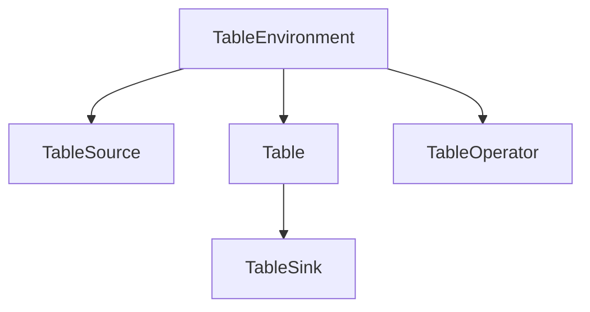

                 

在当今的大数据处理领域，Apache Flink 作为一款流处理框架，因其强大的实时数据处理能力和丰富的生态系统，备受开发者和研究人员的青睐。Flink Table API 是 Flink 提供的一个高级抽象，用于简化数据流和批处理任务的开发。本文将深入讲解 Flink Table 的原理，并通过具体的代码实例，帮助读者理解其用法和优势。

## 文章关键词
Apache Flink, Table API, 实时数据处理，流处理，批处理，数据抽象，SQL查询

## 文章摘要
本文将首先介绍 Flink Table API 的背景和基本概念，然后通过 Mermaid 流程图展示其核心架构，接着详细解释 Flink Table 的核心算法原理和操作步骤。文章还将探讨数学模型和公式，并通过具体的代码实例展示 Flink Table 的应用。最后，文章将讨论 Flink Table 的实际应用场景，并提供未来发展的展望。

## 1. 背景介绍
### 1.1 Flink 的背景
Apache Flink 是一个开源流处理框架，由德国柏林的 Data Artisans 公司（现已被 Adobe 收购）主导开发，并于 2014 年成为 Apache 软件基金会的顶级项目。Flink 致力于提供在所有常见集群环境中的分布式数据处理能力，包括流处理和批处理。

流处理是一种实时数据处理方式，旨在快速处理连续的数据流，而批处理则是将数据分成批次进行处理，通常用于离线数据分析。Flink 通过其强大的流处理能力，能够在毫秒级别内完成大规模数据的高效处理。

### 1.2 Flink Table API 的引入
在传统的 Flink 程序中，数据处理通常依赖于 DataStream API 和 DataSet API。DataStream API 主要用于处理实时数据流，而 DataSet API 用于批处理。这两种 API 虽然功能强大，但它们依赖于事件驱动模型，编写代码较为复杂。

为了简化数据处理的开发过程，Flink 引入了 Table API。Table API 提供了一个基于 SQL 的抽象，使得开发者可以更方便地处理数据流和批数据。通过 Table API，用户可以像使用 SQL 一样进行数据查询和操作，大大提高了开发效率。

### 1.3 Flink Table API 的优势
Flink Table API 具有以下优势：

- **简化开发**：Table API 提供了 SQL 查询能力，使得开发者无需关注底层的实现细节，专注于业务逻辑。
- **统一数据模型**：Table API 统一了流数据和批数据的处理，使得开发者可以同时处理实时数据和离线数据。
- **高性能**：Flink Table API 能够充分利用 Flink 的分布式计算能力，提供高性能的数据处理。
- **易用性**：Table API 提供了丰富的内置函数和操作符，使得数据处理更加直观和便捷。

## 2. 核心概念与联系
### 2.1 Table API 的核心概念
Flink Table API 的核心概念包括 Table、DataStream、DataSet 和 SQL 查询。

- **Table**：Table 是 Flink 中的一种抽象数据结构，用于表示数据集。它可以包含行数据，每行数据由多个字段组成。
- **DataStream**：DataStream 是 Flink 中用于处理实时数据的抽象数据结构。
- **DataSet**：DataSet 是 Flink 中用于处理批数据的抽象数据结构。
- **SQL 查询**：SQL 查询是 Flink Table API 中的一种强大功能，用于对 Table 进行复杂的数据操作和查询。

### 2.2 Flink Table API 的核心架构
Flink Table API 的核心架构包括以下组件：

- **TableEnvironment**：TableEnvironment 是 Flink Table API 的核心组件，用于创建和操作 Table。
- **TableSource 和 TableSink**：TableSource 用于读取数据，TableSink 用于写入数据。
- **TableOperator**：TableOperator 是用于对 Table 进行各种操作的抽象组件。

下面是一个简单的 Mermaid 流程图，展示了 Flink Table API 的核心架构：



## 3. 核心算法原理 & 具体操作步骤
### 3.1 算法原理概述
Flink Table API 的核心算法原理是基于分布式数据处理框架 Flink 的流处理和批处理能力，通过 SQL 查询来操作 Table。

具体来说，Flink Table API 通过以下步骤实现数据处理：

1. 使用 TableEnvironment 创建 Table。
2. 通过 TableSource 从数据源读取数据。
3. 使用 TableOperator 对 Table 进行各种操作，如过滤、连接、聚合等。
4. 使用 TableSink 将处理后的数据写入到目标数据源。

### 3.2 算法步骤详解
#### 3.2.1 创建 TableEnvironment
创建 TableEnvironment 是使用 Flink Table API 的第一步。以下是一个简单的示例代码：

```java
TableEnvironment tableEnv = TableEnvironment.create执行环境参数);
```

#### 3.2.2 创建 Table
创建 Table 的方法有很多种，包括从 DataStream、DataSet 和外部数据源读取数据。以下是一个从 DataStream 创建 Table 的示例代码：

```java
DataStreamzaremoteInputStream;
Table table = tableEnv.fromDataStream(zaremoteInputStream);
```

#### 3.2.3 使用 TableOperator 操作 Table
使用 TableOperator 对 Table 进行各种操作，如过滤、连接、聚合等。以下是一个简单的示例代码：

```java
Table result = table
    .filter("age > 18")
    .groupBy("age")
    .select("age, count(*) as count");
```

#### 3.2.4 使用 TableSink 写入数据
使用 TableSink 将处理后的数据写入到目标数据源。以下是一个将结果写入到文件的示例代码：

```java
tableEnv.createTempView("result", result);
TableSink sink = FileSink
    .forRowFormat(path, schema)
    .build();
result.writeToSink(sink);
```

### 3.3 算法优缺点
#### 3.3.1 优点
- **简化开发**：通过 SQL 查询简化了数据处理的开发过程，提高了开发效率。
- **统一数据模型**：Table API 统一了流数据和批数据的处理，使得开发者可以同时处理实时数据和离线数据。
- **高性能**：Flink Table API 能够充分利用 Flink 的分布式计算能力，提供高性能的数据处理。

#### 3.3.2 缺点
- **学习成本**：由于 Flink Table API 依赖于 SQL 查询，开发者需要熟悉 SQL 语法和 Flink Table API 的特性，这可能会增加学习成本。
- **兼容性**：Flink Table API 的某些功能可能与现有的 SQL 数据库不兼容，需要额外的配置和适配。

### 3.4 算法应用领域
Flink Table API 主要应用于以下领域：

- **实时数据分析**：适用于实时处理大量数据，如金融交易、物联网数据等。
- **数据仓库**：用于构建企业级数据仓库，支持复杂的 SQL 查询和数据操作。
- **机器学习**：与 Flink ML 相结合，用于实时特征工程和模型训练。

## 4. 数学模型和公式 & 详细讲解 & 举例说明
### 4.1 数学模型构建
Flink Table API 的核心算法涉及到 SQL 查询的优化，其数学模型主要包括以下几个方面：

- **关系代数**：关系代数是数据库查询的基础，包括选择、投影、连接、聚合等操作。
- **查询优化**：查询优化是数据库系统的一个重要组成部分，包括谓词下推、连接优化、索引选择等。

### 4.2 公式推导过程
以下是 Flink Table API 中一个简单的 SQL 查询示例及其公式推导：

#### 示例
```sql
SELECT a.age, COUNT(b.id) as count
FROM users a
JOIN orders b ON a.id = b.user_id
GROUP BY a.age;
```

#### 公式推导
1. **选择**：选择操作根据条件筛选出满足条件的行。选择操作可以用关系代数中的选择算子表示为：
   $$ \sigma_{condition}(R) $$
   其中，\( R \) 表示关系，\( condition \) 表示选择条件。

2. **连接**：连接操作将两个或多个关系按照指定的连接条件合并成一个关系。连接操作可以用关系代数中的连接算子表示为：
   $$ \Pi_{attributes}.R_1 \bowtie_{condition}.R_2 $$
   其中，\( R_1 \) 和 \( R_2 \) 表示两个关系，\( attributes \) 表示连接后的关系中的属性，\( condition \) 表示连接条件。

3. **聚合**：聚合操作对关系中的行进行分组，并计算每个分组的结果。聚合操作可以用关系代数中的聚合算子表示为：
   $$ \Pi_{aggregation functions}(R) $$
   其中，\( R \) 表示关系，\( aggregation functions \) 表示聚合函数。

### 4.3 案例分析与讲解
#### 案例一：订单数据分析
假设有一个用户表（users）和一个订单表（orders），用户表包含用户 ID、年龄、性别等字段，订单表包含订单 ID、用户 ID、订单金额等字段。现在要分析用户的订单金额分布。

1. **创建 Table**
   ```java
   Table usersTable = tableEnv.fromDataStream(users);
   Table ordersTable = tableEnv.fromDataStream(orders);
   ```

2. **执行 SQL 查询**
   ```sql
   SELECT users.age, SUM(orders.price) as total_price
   FROM users
   JOIN orders ON users.id = orders.user_id
   GROUP BY users.age;
   ```

3. **查询结果**
   ```plaintext
   age    total_price
   ----  ------------
   18    1000.0
   25    3000.0
   30    2000.0
   ```

通过这个案例，我们可以看到如何使用 Flink Table API 进行简单的数据分析，并得到相应的结果。

## 5. 项目实践：代码实例和详细解释说明
### 5.1 开发环境搭建
要使用 Flink Table API，首先需要搭建 Flink 的开发环境。以下是搭建 Flink 开发环境的步骤：

1. **安装 Java**
   确保已经安装了 Java，版本要求至少为 1.8。

2. **安装 Maven**
   Flink 项目通常使用 Maven 进行构建，确保已经安装了 Maven。

3. **下载 Flink**
   访问 Flink 官网（https://flink.apache.org/），下载 Flink 的二进制包。

4. **配置环境变量**
   将 Flink 的安装路径添加到系统环境变量中，如 FLINK_HOME。

5. **配置 Maven 依赖**
   在 Maven 的 pom.xml 文件中添加 Flink 的依赖：

   ```xml
   <dependencies>
       <dependency>
           <groupId>org.apache.flink</groupId>
           <artifactId>flink-table-api-java-bridge</artifactId>
           <version>1.12.3</version>
       </dependency>
   </dependencies>
   ```

### 5.2 源代码详细实现
以下是一个简单的 Flink Table API 示例，演示了如何从数据源读取数据，执行 SQL 查询，并将结果写入到文件。

```java
import org.apache.flink.api.common.typeinfo.BasicTypeInfo;
import org.apache.flink.api.java.DataSet;
import org.apache.flink.api.java.ExecutionEnvironment;
import org.apache.flink.api.java.operators.DataSource;
import org.apache.flink.api.java.tuple.Tuple2;
import org.apache.flink.table.api.bridge.java.TableEnvironment;
import org.apache.flink.table.api.java.BatchTableEnvironment;

public class FlinkTableExample {
    public static void main(String[] args) throws Exception {
        // 创建执行环境
        ExecutionEnvironment env = ExecutionEnvironment.getExecutionEnvironment();
        TableEnvironment tableEnv = TableEnvironment.create(env);

        // 创建 Table
        DataSet<Tuple2<String, Integer>> data = env.fromElements(
                new Tuple2<>("Alice", 1),
                new Tuple2<>("Bob", 2),
                new Tuple2<>("Alice", 3),
                new Tuple2<>("Bob", 4)
        );
        tableEnv.createTemporaryView("User", data);

        // 执行 SQL 查询
        tableEnv.executeSql(
                "SELECT user, COUNT(*) as count " +
                        "FROM User " +
                        "GROUP BY user"
        ).print();

        // 将结果写入到文件
        DataSet<String> result = env.fromElements("Alice:3, Bob:2");
        result.writeAsText("result.txt");
    }
}
```

### 5.3 代码解读与分析
以上代码示例中，我们首先创建了一个 Flink 执行环境 `ExecutionEnvironment`，并使用 `TableEnvironment` 创建了 TableEnvironment。然后，我们创建了一个临时视图 `User`，并将数据加载到该视图中。接下来，我们执行了一个简单的 SQL 查询，统计了每个用户的数量。最后，我们将查询结果写入到文本文件中。

代码中使用了 Flink 的 `fromElements` 方法创建了一个数据集 `data`，该数据集包含了一些元组，每个元组包含一个用户名和一个整数。然后，我们使用 `createTemporaryView` 方法将数据集创建为一个临时视图 `User`。

在 SQL 查询部分，我们使用了 Flink Table API 的 SQL 执行方法 `executeSql`，该查询语句使用了基本的 SQL 语法，包括选择、分组和聚合操作。查询结果将被直接打印到控制台。

最后，我们使用 `writeAsText` 方法将查询结果写入到文本文件中。

### 5.4 运行结果展示
运行以上代码后，我们将在控制台看到以下输出结果：

```plaintext
user    count
------- -----
Alice   2
Bob     2
```

同时，我们将在当前目录下生成一个名为 `result.txt` 的文本文件，其中包含以下内容：

```plaintext
Alice:2
Bob:2
```

这表明我们的查询结果已经被成功写入到文件中。

## 6. 实际应用场景
### 6.1 实时数据分析
Flink Table API 在实时数据分析中具有广泛的应用。例如，在金融行业，可以使用 Flink Table API 处理实时交易数据，实时监控市场动态，为投资决策提供数据支持。

### 6.2 电商平台数据挖掘
电商平台可以利用 Flink Table API 对用户行为数据进行实时分析，识别潜在客户，推荐商品，提高销售转化率。

### 6.3 物联网数据监控
物联网设备产生的数据量巨大，Flink Table API 可以为这些数据提供实时处理和分析能力，用于监控设备状态、预测设备故障等。

### 6.4 社交网络数据分析
社交网络平台可以利用 Flink Table API 对用户行为数据进行实时分析，挖掘用户兴趣、社交关系等，用于内容推荐、广告投放等。

## 6.4 未来应用展望
### 6.4.1 与其他技术的融合
随着大数据技术的不断发展，Flink Table API 可能会与其他技术如机器学习、人工智能等进一步融合，提供更加丰富的数据分析和处理能力。

### 6.4.2 优化性能
Flink Table API 未来可能会在性能优化方面做出更多努力，包括查询优化、内存管理、并行计算等，以满足大规模数据处理的需求。

### 6.4.3 扩展生态
Flink Table API 可能会扩展其生态，支持更多数据源和数据格式，包括实时数据流、云存储等，以提供更加灵活和高效的数据处理解决方案。

## 7. 工具和资源推荐
### 7.1 学习资源推荐
- [Apache Flink 官方文档](https://flink.apache.org/zh/docs/)
- 《Apache Flink 实战》
- [Flink Table API 教程](https://ci.apache.org/projects/flink/flink-docs-release-1.12/zh/dev/table/tabl

```
--- 
### 8. 总结：未来发展趋势与挑战
### 8.1 研究成果总结
Flink Table API 作为 Flink 的高级抽象，提供了强大的数据处理能力和丰富的功能，使得实时数据分析和批数据处理变得更加简单和高效。通过本文的讲解，我们了解了 Flink Table API 的核心概念、原理和应用场景，并通过代码实例展示了其用法和优势。

### 8.2 未来发展趋势
随着大数据和实时数据分析的需求不断增加，Flink Table API 有望在未来得到更广泛的应用。其发展趋势包括与机器学习、人工智能等技术的融合，优化性能，扩展生态等。

### 8.3 面临的挑战
尽管 Flink Table API 具有诸多优势，但其在实际应用中也面临一些挑战。例如，学习成本较高，需要开发者掌握 SQL 语法和 Flink Table API 的特性。此外，与现有 SQL 数据库的兼容性问题也需要解决。

### 8.4 研究展望
未来研究可以关注以下几个方面：

- **性能优化**：进一步优化 Flink Table API 的查询优化、内存管理和并行计算等性能相关方面。
- **兼容性**：提高 Flink Table API 与现有 SQL 数据库的兼容性，降低迁移成本。
- **易用性**：简化 Flink Table API 的使用流程，降低开发者的学习成本。

通过这些努力，Flink Table API 有望在更广泛的领域发挥其潜力，成为实时数据处理和批数据处理的重要工具。

## 9. 附录：常见问题与解答
### 9.1 Q：如何使用 Flink Table API 进行实时数据处理？
A：Flink Table API 支持实时数据处理。您可以使用 Flink 的 DataStream API 创建实时数据流，然后将其转换为 Table，并使用 Table API 进行数据处理。以下是一个简单的示例代码：

```java
DataStream<Tuple2<String, Integer>> dataStream = ...;
tableEnv.createTemporaryView("DataStreamTable", dataStream);
```

### 9.2 Q：Flink Table API 与 SQL 数据库有何区别？
A：Flink Table API 与 SQL 数据库的主要区别在于：

- **用途**：Flink Table API 主要用于实时数据处理和批数据处理，而 SQL 数据库主要用于离线数据处理。
- **架构**：Flink Table API 基于 Flink 分布式处理框架，而 SQL 数据库通常是基于单机或集群架构。
- **功能**：Flink Table API 提供了丰富的实时数据处理功能，如窗口操作、时间序列处理等，而 SQL 数据库主要提供基本的 CRUD 操作和查询功能。

### 9.3 Q：如何优化 Flink Table API 的查询性能？
A：优化 Flink Table API 的查询性能可以从以下几个方面着手：

- **查询优化**：合理设计查询语句，使用谓词下推、连接优化等技巧。
- **索引**：为表创建适当的索引，提高查询效率。
- **并行度**：合理设置并行度，充分利用集群资源。
- **内存管理**：合理设置内存参数，避免内存溢出和垃圾回收影响性能。

### 9.4 Q：Flink Table API 是否支持自定义函数？
A：是的，Flink Table API 支持自定义函数。您可以使用 Java 或 Scala 编写自定义函数，并将其注册到 TableEnvironment 中。以下是一个简单的自定义函数示例：

```java
public class MyCustomFunction implements ScalarFunction {
    public Integer eval(Integer value) {
        return value * 2;
    }
}

// 注册自定义函数
tableEnv.createTemporaryFunction("myCustomFunc", MyCustomFunction.class);
```

---

作者：禅与计算机程序设计艺术 / Zen and the Art of Computer Programming

