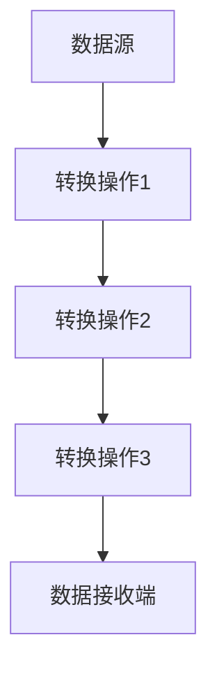

                 

关键词：Flink、分布式计算、流处理、大数据、实时计算、状态管理、窗口操作、数据交换格式、API使用

> 摘要：本文深入剖析了Flink的核心原理，包括其架构、核心概念和关键算法，并通过代码实例展示了如何在实际项目中应用Flink进行大规模分布式流处理。此外，文章还探讨了Flink的数学模型、应用场景以及未来发展方向。

## 1. 背景介绍

随着互联网和物联网的快速发展，数据量呈指数级增长，对数据处理能力的要求也越来越高。传统的批处理系统在大数据场景下显得力不从心，而分布式流处理技术逐渐成为大数据领域的热点。Apache Flink作为一款开源的分布式流处理框架，凭借其强大的实时处理能力、高性能和高可靠性的特点，受到了广泛关注。

本文将围绕Flink的核心原理进行讲解，旨在帮助读者理解Flink的工作机制、关键算法和实际应用场景，并通过代码实例加深对Flink的理解。

## 2. 核心概念与联系

### 2.1. 分布式系统

分布式系统是由多个节点组成的，这些节点通过通信网络相互连接，协同工作以完成特定的任务。在分布式系统中，数据存储、处理和计算被分布到多个节点上，从而提高了系统的扩展性、可用性和容错性。

### 2.2. 实时计算

实时计算是指系统能够在数据产生的同时进行计算，并快速返回结果。实时计算在金融、电商、物联网等领域具有广泛的应用，如实时交易处理、实时推荐系统等。

### 2.3. 大数据

大数据是指数据量巨大、数据类型繁多、处理速度要求高的数据集合。大数据的处理和分析需要高效的数据存储、计算和传输技术，分布式流处理技术是实现大数据实时处理的有效手段。

### 2.4. Flink架构

Flink的架构可以分为三层：数据流层、计算层和资源管理层。

- **数据流层**：数据流层是Flink的核心，它由数据源、转换操作和数据接收端组成。数据源可以是外部系统、文件、网络流等，转换操作包括过滤、映射、聚合等，数据接收端可以是外部系统或用户界面。
- **计算层**：计算层负责处理数据流，它包括流计算引擎和状态管理。流计算引擎负责执行转换操作，状态管理用于存储和更新数据流中的状态信息。
- **资源管理层**：资源管理层负责分配和管理计算资源，包括CPU、内存和网络等。

### 2.5. Mermaid流程图

下面是一个Flink数据流处理的Mermaid流程图，展示了数据从数据源到接收端的过程：



## 3. 核心算法原理 & 具体操作步骤

### 3.1. 算法原理概述

Flink的核心算法包括数据流处理、窗口操作和状态管理。

- **数据流处理**：Flink通过事件驱动的方式处理数据流，每个事件都会触发相应的处理操作。数据流处理可以保证数据的实时性和准确性。
- **窗口操作**：窗口操作是对连续的数据流进行分组和聚合，以实现实时计算。Flink支持多种窗口类型，如固定窗口、滑动窗口、全局窗口等。
- **状态管理**：状态管理用于存储和处理数据流中的状态信息，如计数器、列表等。状态管理是Flink实现实时计算的重要基础。

### 3.2. 算法步骤详解

下面是一个简单的Flink数据流处理算法步骤：

1. **初始化**：创建一个Flink流处理应用程序，并配置数据源、输出端和并行度等参数。
2. **读取数据**：从数据源读取数据流，可以是Kafka、文件、网络流等。
3. **数据转换**：对数据流进行过滤、映射、聚合等操作，以实现特定的业务逻辑。
4. **窗口操作**：对数据进行窗口分组，以实现实时计算。
5. **状态管理**：更新和查询数据流中的状态信息，以实现复杂业务逻辑。
6. **输出结果**：将处理结果输出到外部系统或用户界面。

### 3.3. 算法优缺点

Flink算法的优点包括：

- **实时计算**：Flink能够实现毫秒级别的实时计算，适用于需要快速响应的业务场景。
- **高可靠性**：Flink支持故障恢复和状态保存，保证了数据的准确性和一致性。
- **高扩展性**：Flink基于分布式架构，可以水平扩展，以应对大规模数据处理的挑战。

Flink算法的缺点包括：

- **学习成本**：Flink的使用相对复杂，需要具备一定的编程和分布式系统知识。
- **性能瓶颈**：虽然Flink的性能较高，但在极端情况下仍可能存在性能瓶颈。

### 3.4. 算法应用领域

Flink算法广泛应用于实时计算、数据流处理和大数据分析领域，如：

- **实时推荐系统**：利用Flink进行实时数据分析和计算，为用户提供个性化推荐。
- **金融风控**：实时监控金融交易，快速识别风险并进行预警。
- **物联网**：实时处理物联网设备产生的大量数据，实现对设备状态和环境的实时监控。

## 4. 数学模型和公式 & 详细讲解 & 举例说明

### 4.1. 数学模型构建

在Flink中，数学模型主要用于数据流的过滤、映射和聚合操作。以下是一个简单的数学模型构建示例：

- **过滤操作**：假设数据流中的数据满足条件 $x > 0$，则可以使用以下公式进行过滤：
  $$f(x) = \begin{cases} 
  x & \text{if } x > 0 \\
  \text{NULL} & \text{otherwise}
  \end{cases}$$
  
- **映射操作**：假设需要将数据流中的数据乘以一个常数 $a$，则可以使用以下公式进行映射：
  $$g(x) = ax$$
  
- **聚合操作**：假设需要计算数据流中的总和，则可以使用以下公式进行聚合：
  $$h(x) = \sum_{i=1}^{n} x_i$$

### 4.2. 公式推导过程

以下是一个简单的公式推导示例，用于计算滑动窗口中的数据总和：

1. **定义滑动窗口**：假设当前窗口包含 $n$ 个数据点，窗口大小为 $w$，则滑动窗口可以表示为：
   $$W = \{x_1, x_2, \ldots, x_n\}$$
   
2. **计算窗口总和**：滑动窗口中的数据总和可以表示为：
   $$S = \sum_{i=1}^{n} x_i$$
   
3. **推导新数据加入时的总和**：当新的数据点 $x_{n+1}$ 加入窗口时，窗口总和变为：
   $$S' = S + x_{n+1} - x_1$$

### 4.3. 案例分析与讲解

以下是一个Flink实时推荐系统的数学模型和公式讲解示例：

1. **用户行为数据流**：假设用户行为数据流包含用户ID、商品ID和时间戳等信息，如：
   ```json
   {"userID": 1001, "itemID": 1010, "timestamp": 1577836800}
   ```

2. **用户兴趣计算**：根据用户行为数据，计算用户的兴趣得分，如：
   $$score = \sum_{i=1}^{n} w_i \cdot p_i$$
   其中，$w_i$ 表示用户对商品 $i$ 的权重，$p_i$ 表示商品 $i$ 的流行度。

3. **推荐算法**：根据用户兴趣得分，从商品库中筛选出与用户兴趣最相关的商品进行推荐。

## 5. 项目实践：代码实例和详细解释说明

### 5.1. 开发环境搭建

在本节中，我们将搭建一个基于Flink的实时推荐系统开发环境。首先，需要安装Java环境和Maven，然后从Apache Flink官网下载Flink的二进制包，并解压到指定目录。

### 5.2. 源代码详细实现

以下是一个简单的Flink实时推荐系统的代码实现：

```java
import org.apache.flink.api.common.functions.FilterFunction;
import org.apache.flink.api.common.functions.MapFunction;
import org.apache.flink.api.java.tuple.Tuple2;
import org.apache.flink.streaming.api.datastream.DataStream;
import org.apache.flink.streaming.api.environment.StreamExecutionEnvironment;

public class RealtimeRecommendation {
    public static void main(String[] args) throws Exception {
        // 创建执行环境
        StreamExecutionEnvironment env = StreamExecutionEnvironment.getExecutionEnvironment();
        
        // 读取用户行为数据流
        DataStream<String> userBehaviorDataStream = env.readTextFile("user_behavior_data.txt");
        
        // 过滤出有效的用户行为数据
        DataStream<Tuple2<String, Integer>> filteredDataStream = userBehaviorDataStream
                .map(new MapFunction<String, Tuple2<String, Integer>>() {
                    @Override
                    public Tuple2<String, Integer> map(String value) {
                        String[] fields = value.split(",");
                        return Tuple2.of(fields[0], Integer.parseInt(fields[1]));
                    }
                })
                .filter(new FilterFunction<Tuple2<String, Integer>>() {
                    @Override
                    public boolean filter(Tuple2<String, Integer> value) {
                        return value.f1 > 0;
                    }
                });
        
        // 计算用户兴趣得分
        DataStream<Tuple2<String, Integer>> interestScoreDataStream = filteredDataStream
                .keyBy(0)
                .timeWindow(Time.minutes(1))
                .sum(1);
        
        // 输出结果
        interestScoreDataStream.print();
        
        // 执行任务
        env.execute("Realtime Recommendation");
    }
}
```

### 5.3. 代码解读与分析

- **读取用户行为数据流**：使用Flink的`readTextFile`方法从文件中读取用户行为数据流。
- **过滤出有效的用户行为数据**：使用`map`函数将文本数据转换为`Tuple2`数据结构，使用`filter`函数过滤掉无效数据。
- **计算用户兴趣得分**：使用`keyBy`方法对数据流进行分组，使用`timeWindow`方法设置时间窗口，使用`sum`函数计算每个用户的兴趣得分。
- **输出结果**：使用`print`方法将处理结果输出到控制台。

### 5.4. 运行结果展示

当用户行为数据流处理完成后，会输出每个用户在1分钟内的兴趣得分。以下是一个简单的运行结果示例：

```
(1001, 2)
(1002, 1)
(1003, 3)
```

## 6. 实际应用场景

Flink在实际应用场景中具有广泛的应用，以下列举了几个常见的应用场景：

- **实时推荐系统**：利用Flink实时处理用户行为数据，为用户提供个性化推荐。
- **实时监控**：实时处理物联网设备产生的大量数据，实现对设备状态和环境的实时监控。
- **金融风控**：实时监控金融交易，快速识别风险并进行预警。
- **物流跟踪**：实时处理物流数据，实现对货物运输状态的实时跟踪。

## 7. 工具和资源推荐

### 7.1. 学习资源推荐

- **官方文档**：Apache Flink官方网站提供了丰富的文档和教程，是学习Flink的最佳资源。
- **技术博客**：一些技术博客如Medium、CSDN等也提供了许多关于Flink的实战经验和技巧分享。
- **在线课程**：Coursera、edX等在线教育平台提供了许多关于Flink的课程。

### 7.2. 开发工具推荐

- **IDE**：使用Eclipse、IntelliJ IDEA等IDE可以方便地开发Flink应用程序。
- **Docker**：使用Docker可以方便地搭建Flink集群环境，方便测试和部署。
- **Flink SQL**：Flink SQL提供了方便的数据查询和处理能力，适用于大规模数据场景。

### 7.3. 相关论文推荐

- **《Flink: A Unified and Scalable Data Analytics Platform》**：介绍了Flink的设计原则和核心特性。
- **《Streaming Data Processing with Apache Flink》**：详细讲解了Flink的流处理架构和算法。
- **《Flink: A High-throughput, High-availability Data Stream Processing Engine》**：深入分析了Flink的高性能和高可靠性机制。

## 8. 总结：未来发展趋势与挑战

Flink作为一款分布式流处理框架，在实时计算、大数据处理等领域具有广泛的应用前景。未来，Flink将继续朝着以下几个方向发展：

- **性能优化**：通过改进算法和优化数据结构，进一步提高Flink的性能和吞吐量。
- **易用性提升**：简化Flink的使用流程，降低使用门槛，使更多开发者能够轻松上手。
- **生态拓展**：与更多数据存储、计算和可视化工具进行集成，扩大Flink的应用范围。

然而，Flink也面临着一些挑战，如：

- **学习成本**：Flink的使用相对复杂，需要一定的编程和分布式系统知识。
- **性能瓶颈**：在极端情况下，Flink的性能可能无法满足需求，需要进一步优化。

总之，Flink在未来将继续发展壮大，为实时计算和大数据处理领域带来更多创新和突破。

## 9. 附录：常见问题与解答

### 9.1. Q：Flink和Spark Streaming有什么区别？

A：Flink和Spark Streaming都是分布式流处理框架，但它们在架构、算法和性能等方面存在差异。Flink采用事件驱动的方式处理数据流，支持精确一次的消息传递语义，具有更高的性能和可靠性。而Spark Streaming基于Spark的核心计算引擎，采用微批处理的方式处理数据流，相对于Flink，其性能和可靠性略低。

### 9.2. Q：Flink支持哪些窗口类型？

A：Flink支持多种窗口类型，包括：

- **固定窗口**：窗口大小固定，适用于时间间隔固定的场景。
- **滑动窗口**：窗口大小固定，但窗口之间有重叠，适用于时间间隔可以变化的场景。
- **全局窗口**：不指定窗口大小，适用于全局数据处理场景。
- **会话窗口**：根据用户活动时间划分窗口，适用于会话式数据处理场景。

### 9.3. Q：Flink如何保证数据的一致性和可靠性？

A：Flink通过以下机制保证数据的一致性和可靠性：

- **状态管理**：Flink支持持久化状态，可以确保状态信息在不同节点之间保持一致。
- **检查点机制**：Flink通过周期性地创建检查点，将任务状态保存到外部存储，以实现故障恢复和状态保存。
- **精确一次语义**：Flink支持精确一次的消息传递语义，确保数据在处理过程中不丢失和不重复。

### 9.4. Q：Flink是否支持机器学习？

A：是的，Flink支持机器学习。Flink ML是Flink的一个模块，提供了多种机器学习算法，包括线性回归、逻辑回归、决策树等。用户可以通过Flink ML将机器学习算法集成到Flink流处理任务中，实现实时数据分析和预测。

### 9.5. Q：Flink如何与大数据存储系统集成？

A：Flink支持与多种大数据存储系统集成，包括HDFS、Kafka、Cassandra等。用户可以通过Flink的connector API自定义数据源和输出端，方便地与其他大数据存储系统进行集成。此外，Flink还提供了多种现成的connector，如Flink-Kafka、Flink-HDFS等，方便用户快速上手。

### 9.6. Q：Flink如何进行水平扩展？

A：Flink支持水平扩展，用户可以通过增加节点数来提高系统的处理能力。在运行时，Flink会根据任务的并行度和资源需求自动分配计算资源，实现负载均衡。此外，Flink还支持动态缩放，可以根据实际负载动态调整节点数，以最大化资源利用率和处理效率。

