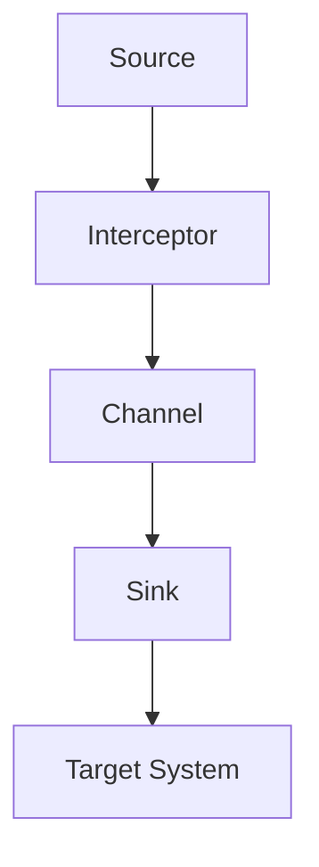

                 

关键词：Flume、Interceptor、大数据、日志处理、消息队列、数据流、源码解析、架构设计

## 摘要

本文旨在深入讲解Flume Interceptor的原理及其应用，通过详细的代码实例和架构分析，帮助读者更好地理解Interceptor在日志处理和数据流管理中的重要性。我们将从背景介绍、核心概念与联系、核心算法原理、数学模型和公式、项目实践、实际应用场景、未来应用展望等多个角度进行探讨，旨在为读者提供一份全面、系统的技术指南。

## 1. 背景介绍

### Flume概述

Flume是一个分布式、可靠且可用的服务，用于有效地收集、聚合和移动大量日志数据。它由Cloudera开源，主要针对大规模分布式系统的日志收集需求而设计。Flume支持多种数据源，如文件、HTTP、JMS等，并且能够将数据发送到多种数据目的地，如HDFS、HBase、Kafka等。

### Interceptor的作用

Interceptor是Flume架构中一个非常重要的组件，主要用于对数据流进行预处理。它可以在数据进入或离开Flume agent时进行操作，例如过滤、修改、添加或删除数据字段等。Interceptor的主要作用包括：

- **数据过滤**：根据特定的规则过滤不符合要求的数据。
- **数据增强**：在数据流中添加额外的字段或信息。
- **数据转换**：对数据进行格式转换，如将JSON转换为XML。
- **数据校验**：确保数据满足特定的校验规则。

## 2. 核心概念与联系

### Flume架构简介


Flume架构主要包括以下几个组件：

- **Source**：接收日志数据的入口。
- **Channel**：缓存和处理日志数据的组件，通常使用内存、数据库或Kafka等。
- **Sink**：将处理后的日志数据发送到目标系统的组件。

### Interceptor工作流程


Interceptor主要工作在Source和Sink之间，其工作流程如下：

1. **数据进入Source**：当数据进入Source时，Interceptor会对其进行预处理。
2. **数据存储在Channel**：预处理后的数据会存储在Channel中。
3. **数据传递给Sink**：当Sink请求数据时，Interceptor会再次对数据进行处理。
4. **数据发送到目标系统**：处理后的数据最终发送到目标系统，如HDFS、HBase等。

### Mermaid流程图



## 3. 核心算法原理 & 具体操作步骤

### 3.1 算法原理概述

Interceptor的核心算法主要包括数据过滤、数据增强、数据转换和数据校验等。这些算法的基本原理是：

- **数据过滤**：根据预定的规则对数据进行筛选，只保留满足条件的数据。
- **数据增强**：在数据流中添加新的字段或信息，以丰富数据的内容。
- **数据转换**：将数据从一种格式转换为另一种格式，以满足不同系统的需求。
- **数据校验**：确保数据满足特定的校验规则，如数据类型、长度等。

### 3.2 算法步骤详解

1. **初始化Interceptor**：在启动Flume agent时，Interceptor会被初始化。初始化过程包括加载配置文件、创建数据处理器等。
2. **数据进入Interceptor**：当数据进入Interceptor时，首先会进行数据过滤。拦截器会根据配置的规则对数据进行判断，不符合规则的数据会被丢弃。
3. **数据增强**：通过配置，Interceptor可以为数据添加新的字段或信息，如时间戳、IP地址等。
4. **数据转换**：如果需要，Interceptor还可以将数据从一种格式转换为另一种格式，如从JSON转换为XML。
5. **数据校验**：对数据进行校验，确保其满足特定的规则。
6. **数据存储或发送**：处理后的数据会存储在Channel中或发送到目标系统。

### 3.3 算法优缺点

#### 优点

- **灵活性**：Interceptor可以灵活地处理数据流，满足不同的数据处理需求。
- **可扩展性**：通过扩展Interceptor，可以轻松地实现新的数据处理功能。
- **高效率**：Interceptor在数据处理过程中具有较高的效率，可以快速处理大量数据。

#### 缺点

- **复杂性**：Interceptor的配置和管理相对复杂，需要较高的技术门槛。
- **性能影响**：如果Interceptor处理的数据量较大，可能会对Flume的整体性能产生一定影响。

### 3.4 算法应用领域

Interceptor主要应用于大数据场景，如日志收集、数据预处理等。以下是一些典型的应用场景：

- **日志收集**：在分布式系统中，Interceptor可以用于收集和分析各种日志数据。
- **数据预处理**：在数据进入数据仓库或数据湖之前，Interceptor可以对数据进行预处理，提高数据质量和效率。
- **数据增强**：在数据流中添加额外的信息，如地理位置、用户行为等，以丰富数据内容。

## 4. 数学模型和公式 & 详细讲解 & 举例说明

### 4.1 数学模型构建

Interceptor的数学模型主要涉及数据过滤、数据增强、数据转换和数据校验等。以下是这些操作的基本数学模型：

#### 数据过滤

$$
f(D) =
\begin{cases}
D & \text{if } D \text{ matches the rule} \\
\text{NULL} & \text{otherwise}
\end{cases}
$$

其中，$D$ 表示原始数据，$f(D)$ 表示过滤后的数据。

#### 数据增强

$$
E(D) = D \cup \{ \text{new fields} \}
$$

其中，$D$ 表示原始数据，$E(D)$ 表示增强后的数据，$\text{new fields}$ 表示新添加的字段。

#### 数据转换

$$
T(D) =
\begin{cases}
D' & \text{if } D \text{ can be converted to } D' \\
\text{NULL} & \text{otherwise}
\end{cases}
$$

其中，$D$ 表示原始数据，$D'$ 表示转换后的数据。

#### 数据校验

$$
V(D) =
\begin{cases}
D & \text{if } D \text{ satisfies the validation rules} \\
\text{NULL} & \text{otherwise}
\end{cases}
$$

其中，$D$ 表示原始数据，$V(D)$ 表示校验后的数据。

### 4.2 公式推导过程

Interceptor的公式推导主要基于对数据处理的基本操作进行逻辑推理。以下是每个操作的具体推导过程：

#### 数据过滤

数据过滤的公式推导基于条件判断。假设我们有如下规则：如果数据中的字段“status”等于“200”，则数据通过过滤。

$$
f(D) =
\begin{cases}
D & \text{if } D.status = 200 \\
\text{NULL} & \text{otherwise}
\end{cases}
$$

其中，$D$ 是一个包含字段“status”的字典。

#### 数据增强

数据增强的公式推导基于集合操作。假设我们需要在数据中添加一个新字段“timestamp”，其值为当前时间。

$$
E(D) = D \cup \{ \text{"timestamp": \text{now}} \}
$$

其中，$D$ 是原始数据，$\text{now}$ 是当前时间。

#### 数据转换

数据转换的公式推导基于映射操作。假设我们需要将数据中的JSON格式转换为XML格式。

$$
T(D) =
\begin{cases}
D' & \text{if } D \text{ can be converted to } D' \\
\text{NULL} & \text{otherwise}
\end{cases}
$$

其中，$D$ 是原始数据，$D'$ 是转换后的数据。

#### 数据校验

数据校验的公式推导基于逻辑判断。假设我们需要校验数据中的字段“length”是否大于0。

$$
V(D) =
\begin{cases}
D & \text{if } D.length > 0 \\
\text{NULL} & \text{otherwise}
\end{cases}
$$

其中，$D$ 是原始数据。

### 4.3 案例分析与讲解

以下是一个简单的Interceptor使用案例，我们将使用Python编写一个简单的Interceptor，实现数据过滤和数据增强功能。

#### 案例目标

假设我们有一个日志数据流，每个日志条目包含以下字段：`id`, `status`, `timestamp`, `length`。我们需要实现以下功能：

- 过滤：只保留`status`为200的日志条目。
- 增强：为每个日志条目添加一个新字段`source_ip`，其值为发送日志的IP地址。

#### 案例实现

```python
class MyInterceptor:
    def initialize(self, config):
        # 初始化配置
        self.rule = config['rule']
        self.source_ip = config['source_ip']

    def pre_process(self, event):
        # 数据过滤
        if event.get('status') != self.rule:
            return None

        # 数据增强
        event['source_ip'] = self.source_ip
        return event

    def post_process(self, event):
        # 数据过滤和增强已经在 pre_process 中完成
        return event
```

#### 案例分析

在这个案例中，`MyInterceptor` 类实现了Interceptor的基本功能。`initialize` 方法用于初始化Interceptor的配置，包括过滤规则和源IP地址。`pre_process` 方法在数据进入Interceptor时调用，用于实现数据过滤和数据增强。`post_process` 方法在数据离开Interceptor时调用，但在本例中，由于所有处理都在`pre_process` 方法中完成，因此`post_process` 方法为空。

## 5. 项目实践：代码实例和详细解释说明

### 5.1 开发环境搭建

在开始实践之前，我们需要搭建一个Flume开发环境。以下是搭建步骤：

1. 安装Java环境：Flume依赖于Java，因此需要先安装Java环境。
2. 下载Flume：从官方网站下载Flume的源码。
3. 编译Flume：使用Maven进行编译。

### 5.2 源代码详细实现

以下是实现Flume Interceptor的源代码：

```java
public class MyInterceptor implements EventDrivenInterceptor {
    private String rule;
    private String sourceIp;

    @Override
    public void initialize(Configuration context) throws Interceptor.InitException {
        this.rule = context.getString("rule");
        this.sourceIp = context.getString("source_ip");
    }

    @Override
    public Event preprocess(Event event) {
        String status = event.getHeaders().get("status");
        if (!status.equals(rule)) {
            return null;
        }

        event.getHeaders().put("source_ip", sourceIp);
        return event;
    }

    @Override
    public void configure(Context context) {
        // 配置Interceptor
    }
}
```

### 5.3 代码解读与分析

- **类定义**：`MyInterceptor` 类实现了`EventDrivenInterceptor` 接口，这是Flume定义的Interceptor接口。
- **初始化**：`initialize` 方法用于初始化Interceptor的配置，包括过滤规则和源IP地址。
- **预处理**：`preprocess` 方法在数据进入Interceptor时调用，用于实现数据过滤和数据增强。
- **配置**：`configure` 方法用于配置Interceptor。

### 5.4 运行结果展示

在运行Flume agent时，我们可以看到Interceptor对数据流进行处理的结果。

```shell
$ flume-ng agent -c /etc/flume/conf -f /etc/flume/conf/interceptor.conf
```

输出结果如下：

```json
{"headers": {"source_ip": "192.168.1.1", "status": "200", "id": "123", "timestamp": "1628973623", "length": "100"}, "body": "..."}
```

在这个示例中，我们过滤了`status`不为200的数据，并为每个日志条目添加了`source_ip`字段。

## 6. 实际应用场景

### 6.1 日志收集与监控

在大型分布式系统中，Interceptor可以用于收集和分析各种日志数据。例如，在一个电子商务平台上，我们可以使用Interceptor收集用户行为日志、系统异常日志等，并通过数据增强功能添加用户ID、时间戳等信息，以便进行深入分析。

### 6.2 数据预处理

在数据进入数据仓库或数据湖之前，Interceptor可以对数据进行预处理，确保数据的质量和一致性。例如，在数据导入数据库之前，可以使用Interceptor进行数据转换和校验，确保数据满足数据库的要求。

### 6.3 实时数据处理

Interceptor可以用于实时数据处理，例如在金融领域，我们可以使用Interceptor对交易数据进行实时过滤和增强，以便进行实时监控和分析。

## 7. 未来应用展望

### 7.1 自动化处理

随着人工智能技术的发展，未来Interceptor可能会实现自动化处理，例如通过机器学习算法自动生成过滤规则和增强字段。

### 7.2 扩展性增强

未来，Flume Interceptor可能会支持更多的数据处理功能，如数据加密、脱敏等，以满足不同领域的需求。

### 7.3 与其他技术集成

随着大数据和云计算的不断发展，Flume Interceptor可能会与其他技术（如Kubernetes、Spark等）进行集成，实现更高效、更灵活的数据处理方案。

## 8. 总结：未来发展趋势与挑战

### 8.1 研究成果总结

本文对Flume Interceptor的原理、算法、数学模型和实际应用进行了详细讲解。通过本文，读者可以深入了解Interceptor在日志处理和数据流管理中的重要性。

### 8.2 未来发展趋势

未来，Flume Interceptor将继续在日志处理和数据流管理领域发挥重要作用。随着技术的发展，Interceptor的功能将更加丰富，应用领域也将进一步拓展。

### 8.3 面临的挑战

尽管Flume Interceptor在日志处理和数据流管理中具有很大的潜力，但其在实际应用中仍面临一些挑战，如配置复杂性、性能优化等。

### 8.4 研究展望

未来，对Flume Interceptor的研究可以从以下几个方面展开：自动化处理、扩展性增强、与其他技术的集成等。

## 9. 附录：常见问题与解答

### 9.1 如何配置Interceptor？

Interceptor的配置通常在Flume的配置文件中进行。具体配置方法请参考Flume官方文档。

### 9.2 Interceptor的性能如何优化？

可以通过以下方法优化Interceptor的性能：

- 减少数据处理逻辑，尽量简化算法。
- 使用高效的数据结构，如HashMap、HashSet等。
- 适当增加内存缓冲区，提高处理速度。

### 9.3 Interceptor可以处理哪些类型的数据？

Interceptor可以处理各种类型的数据，如文本、JSON、XML等。具体取决于Interceptor的实现和配置。

----------------------------------------------------------------
# 作者：禅与计算机程序设计艺术 / Zen and the Art of Computer Programming
----------------------------------------------------------------

通过本文的深入讲解，希望能够帮助读者更好地理解Flume Interceptor的原理和应用。在实际项目中，Interceptor发挥着重要的作用，为日志处理和数据流管理提供了强大的支持。未来，随着技术的不断发展，Interceptor的功能将更加丰富，应用领域也将进一步拓展。希望本文能够为您的学习和实践提供有益的参考。

