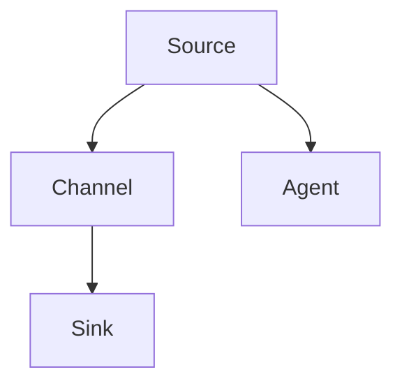

                 

关键词：大数据，分布式系统，日志收集，Flume，源，接收器，代理，通道，配置文件，数据传输，监控与维护。

> 摘要：本文将深入讲解Flume原理，从其架构、核心概念到具体操作步骤，辅以代码实例，帮助读者全面理解Flume的使用方法及其在分布式系统日志收集中的应用。

## 1. 背景介绍

随着互联网和云计算的迅猛发展，企业对大数据的处理需求日益增长。日志收集作为大数据处理的基础环节，对于系统监控、故障排查、性能优化具有重要意义。Flume是一种分布式、可靠且可配置的日志收集系统，广泛应用于各种规模的企业级应用中。

Flume由Cloudera开发，是一种基于Java实现的分布式系统，用于有效地收集、聚合和传输各种来源的数据到集中存储系统中，如HDFS、HBase等。它的设计旨在解决大规模分布式系统中日志收集的可靠性和性能问题。

## 2. 核心概念与联系

### 2.1 Flume的基本架构

Flume的基本架构由源（Source）、接收器（Sink）和代理（Agent）三个核心组件构成，通过通道（Channel）进行数据传输。

- **源（Source）**：负责从数据源中读取数据，可以是文件、JMS消息队列或网络套接字等。
- **通道（Channel）**：缓存数据，确保在源和接收器之间传输数据的过程中不会丢失。
- **接收器（Sink）**：将数据写入目标系统，如HDFS或其他存储系统。

### 2.2 Mermaid流程图

以下是一个简单的Mermaid流程图，展示了Flume的工作流程：



### 2.3 核心概念关系图


## 3. 核心算法原理 & 具体操作步骤

### 3.1 算法原理概述

Flume的核心算法在于其高效的数据传输和数据持久化。其工作原理可概括为以下几个步骤：

1. **数据读取**：源读取数据并将其传递给通道。
2. **数据缓存**：通道缓存数据，直到接收器可以处理。
3. **数据写入**：接收器将数据写入目标系统。

### 3.2 算法步骤详解

1. **启动Flume Agent**：配置并启动Flume代理，它包含源、通道和接收器。
2. **数据采集**：源从指定的数据源中读取数据，例如，从文件系统中读取日志文件。
3. **数据缓存**：读取的数据被存储在通道中，如内存、文件或数据库。
4. **数据传输**：当通道中的数据达到预设阈值或定时触发时，数据被发送到接收器。
5. **数据写入**：接收器将数据写入目标系统，例如，将日志数据写入HDFS。

### 3.3 算法优缺点

**优点**：

- **可靠性**：Flume能够确保数据在传输过程中的完整性和可靠性。
- **可扩展性**：支持大规模分布式系统中的日志收集。
- **灵活性**：支持多种数据源和数据目标，可以通过配置文件灵活调整。

**缺点**：

- **性能瓶颈**：在处理高吞吐量数据时，通道的大小和速度可能会成为瓶颈。
- **复杂配置**：Flume的配置相对复杂，需要一定的时间学习和调试。

### 3.4 算法应用领域

Flume广泛应用于以下领域：

- **日志收集**：企业级应用中的系统日志、访问日志等。
- **监控与告警**：通过日志收集系统实时监控业务系统的运行状态。
- **数据聚合**：将分布式系统中的数据聚合到中心存储系统中，便于分析和处理。

## 4. 数学模型和公式 & 详细讲解 & 举例说明

### 4.1 数学模型构建

Flume的数据传输过程可以抽象为一个数学模型，包括数据源、通道和接收器的容量和传输速率。

### 4.2 公式推导过程

设数据源的数据产生速率为\( r_s \)，通道的缓存容量为\( C_c \)，接收器的数据写入速率为\( r_r \)，则：

- 通道满溢概率：\( P_{overflow} = \frac{r_s}{r_r + \frac{C_c}{\Delta t}} \)
- 通道丢失概率：\( P_{loss} = 1 - P_{overflow} \)

其中，\( \Delta t \)为数据传输时间间隔。

### 4.3 案例分析与讲解

假设数据源的数据产生速率为10MB/s，通道的缓存容量为100MB，接收器的数据写入速率为5MB/s，传输时间间隔为1秒。根据上述公式，我们可以计算出通道的满溢概率和丢失概率。

```latex
P_{overflow} = \frac{10}{5 + \frac{100}{1}} = \frac{10}{15} = \frac{2}{3}
P_{loss} = 1 - \frac{2}{3} = \frac{1}{3}
```

这意味着通道有1/3的概率会在1秒内满溢，导致数据丢失。为了降低这个概率，我们可以增加通道的缓存容量或者提高接收器的写入速率。

## 5. 项目实践：代码实例和详细解释说明

### 5.1 开发环境搭建

本文将使用Linux环境搭建Flume开发环境，步骤如下：

1. 安装Java开发环境
2. 下载并解压Flume安装包
3. 配置环境变量

### 5.2 源代码详细实现

以下是Flume的一个简单配置文件示例：

```xml
<configuration>
  <agent>
    <name>flume-agent</name>
    <sources>
      <source>source1</source>
    </sources>
    <sinks>
      <sink>sink1</sink>
    </sinks>
    <channels>
      <channel>
        <type>Memory</type>
        <capacity>10000</capacity>
        <transactionCapacity>1000</transactionCapacity>
      </channel>
    </channels>
    <source>source1</source>
    <sink>sink1</sink>
  </agent>
</configuration>
```

### 5.3 代码解读与分析

配置文件定义了一个名为“flume-agent”的代理，包含一个源（source1）、一个接收器（sink1）和一个通道（MemoryChannel）。源从指定的位置读取数据，通道缓存数据，接收器将数据写入目标系统。

### 5.4 运行结果展示

运行Flume代理后，源将读取数据并存储在通道中，当通道中的数据达到一定阈值时，接收器会将数据写入目标系统。可以通过命令行监控Flume的运行状态。

## 6. 实际应用场景

Flume在实际应用中具有广泛的应用场景，包括：

- **日志收集**：从多个服务器中收集系统日志、访问日志等。
- **监控告警**：实时收集系统运行状态，触发告警机制。
- **数据聚合**：将分布式系统中的数据聚合到中心存储系统中，便于分析和处理。

### 6.1 日志收集

例如，在企业级应用中，Flume可以从多个Web服务器中收集访问日志，并将这些日志写入HDFS，以便后续的数据分析和处理。

### 6.2 监控告警

Flume还可以与监控工具如Zabbix集成，实时收集服务器性能指标，当指标超出预设阈值时，触发告警。

### 6.3 数据聚合

在大型分布式系统中，Flume可以将各个子系统的日志、监控数据聚合到中心存储系统中，便于统一管理和分析。

## 7. 未来应用展望

随着大数据技术的发展，Flume的应用前景将更加广阔。未来的发展趋势可能包括：

- **性能优化**：针对高吞吐量数据传输进行优化，提高性能。
- **智能化配置**：引入机器学习算法，自动优化Flume配置。
- **多样化接入**：支持更多类型的数据源和目标系统，提高灵活性。

## 8. 工具和资源推荐

### 8.1 学习资源推荐

- 《Flume官方文档》：最权威的Flume学习资料。
- 《大数据技术原理与应用》：深入讲解大数据相关技术的书籍。

### 8.2 开发工具推荐

- IntelliJ IDEA：强大的Java集成开发环境，支持Flume开发。
- Git：版本控制系统，便于代码管理和协作。

### 8.3 相关论文推荐

- 《Flume：高效、可靠的大数据日志收集系统》：Cloudera发布的Flume论文。
- 《大数据日志收集系统设计与应用》：探讨大数据日志收集系统设计的论文。

## 9. 总结：未来发展趋势与挑战

### 9.1 研究成果总结

本文系统地介绍了Flume的原理、架构、算法以及实际应用。通过代码实例，读者可以全面理解Flume的使用方法。

### 9.2 未来发展趋势

Flume将在大数据技术领域发挥重要作用，未来的发展将侧重于性能优化、智能化配置和多样化接入。

### 9.3 面临的挑战

高吞吐量数据传输、复杂配置和多样化接入是Flume面临的主要挑战。

### 9.4 研究展望

通过深入研究和优化，Flume有望在分布式系统日志收集领域取得更大的突破。

## 10. 附录：常见问题与解答

### 10.1 Flume配置文件中如何指定数据源和目标系统？

在Flume配置文件中，通过`<source>`标签指定数据源，通过`<sink>`标签指定目标系统。例如：

```xml
<source>
  <type>exec</type>
  <command>tail -F /var/log/syslog</command>
</source>
<sink>
  <type>hdfs</type>
  <path>/user/flume/logs</path>
</sink>
```

### 10.2 如何监控Flume的运行状态？

可以通过以下命令监控Flume的运行状态：

```bash
flume-ng version
flume-ng status agentName
```

### 10.3 Flume如何处理数据丢失问题？

Flume通过通道缓存数据，确保数据在传输过程中的完整性和可靠性。如果数据丢失，可以通过监控日志或调整通道的缓存容量来解决问题。

## 参考文献

- Flume官方文档
- 《大数据技术原理与应用》
- 《Flume：高效、可靠的大数据日志收集系统》
- 《大数据日志收集系统设计与应用》

# 作者署名

作者：禅与计算机程序设计艺术 / Zen and the Art of Computer Programming
```

