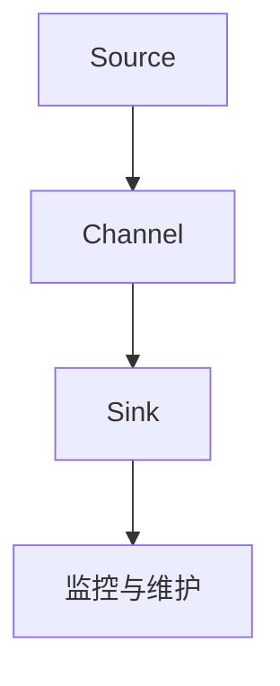

                 

关键词：Flume，分布式日志收集，Hadoop，数据流，架构设计，代码实例

摘要：本文将深入探讨Flume的原理与架构，详细讲解其核心算法原理、具体操作步骤、数学模型、项目实践及实际应用场景。通过代码实例和详细解释，帮助读者全面理解Flume的工作机制，掌握其在分布式日志收集领域的应用。

## 1. 背景介绍

Flume是一款分布式、可靠且高效的日志收集系统，主要用于在大量服务器之间收集、聚合和传输日志数据。其设计初衷是为了解决大规模分布式系统中日志收集的难题，特别是当系统运行在海量数据之上时。Flume适用于各种环境，包括云服务、数据中心和企业内部网络，能够确保日志数据的完整性和可靠性。

随着互联网和大数据的飞速发展，日志数据的重要性日益凸显。日志不仅记录了系统的运行状态，还包含了丰富的业务信息和用户行为数据。这些数据对于系统监控、故障排查、性能优化和业务分析至关重要。然而，大规模日志数据的收集和处理面临着诸多挑战，如数据传输的高效性、数据一致性和可靠性等。

为了解决这些问题，Flume应运而生。它利用Hadoop生态系统中的分布式文件系统（如HDFS）和数据处理框架（如MapReduce），提供了一套高效、可靠的日志收集方案。Flume的设计理念是简单、可扩展和易于维护，使得它在实际应用中取得了良好的效果。

## 2. 核心概念与联系

### 2.1 Flume的核心组件

Flume由以下几个核心组件组成：

- **Source**：负责接收日志数据，可以是文件、网络套接字或JMS消息队列等。
- **Channel**：充当数据缓冲区，确保数据在传输过程中不丢失，可以是内存、Kafka或数据库等。
- **Sink**：将数据发送到目标系统，如HDFS、HBase或Kafka等。

### 2.2 Flume的工作原理

Flume的工作流程可以分为以下几个步骤：

1. **数据收集**：Source从各种数据源读取日志数据。
2. **数据缓冲**：Channel缓存读取到的数据，确保数据不会因网络故障等原因丢失。
3. **数据传输**：Sink将缓存的数据发送到目标系统。
4. **监控与维护**：Flume提供监控机制，确保系统的稳定运行。

### 2.3 Mermaid流程图

以下是Flume工作流程的Mermaid流程图表示：



## 3. 核心算法原理 & 具体操作步骤

### 3.1 算法原理概述

Flume的核心算法主要包括数据采集、数据传输和数据存储。以下是每个步骤的简要概述：

- **数据采集**：采用多线程方式同时读取多个数据源，提高数据收集效率。
- **数据传输**：使用基于事件驱动的数据传输机制，确保数据的实时性和可靠性。
- **数据存储**：将处理后的数据存储到目标系统，如HDFS或Kafka等。

### 3.2 算法步骤详解

#### 3.2.1 数据采集

Flume采用多线程方式同时读取多个数据源，以提高数据采集效率。具体步骤如下：

1. 启动多个数据采集线程。
2. 每个线程从指定的数据源读取日志数据。
3. 将读取到的数据存储到内存缓冲区。

#### 3.2.2 数据传输

Flume使用基于事件驱动的数据传输机制，确保数据的实时性和可靠性。具体步骤如下：

1. 启动事件监听器。
2. 当内存缓冲区达到一定阈值时，触发事件，将数据传输到Channel。
3. Channel将数据缓存到本地存储或发送到Sink。

#### 3.2.3 数据存储

Flume将处理后的数据存储到目标系统，如HDFS或Kafka等。具体步骤如下：

1. 启动数据存储进程。
2. 将Channel中的数据发送到目标系统。
3. 对目标系统进行必要的预处理，如格式转换或压缩等。

### 3.3 算法优缺点

#### 优点

- **分布式**：Flume支持分布式部署，能够处理大规模日志数据。
- **可靠性**：通过Channel缓存数据，确保数据传输的可靠性。
- **高效性**：采用多线程和事件驱动机制，提高数据采集和传输效率。

#### 缺点

- **性能瓶颈**：当数据量非常大时，内存缓冲区可能成为性能瓶颈。
- **配置复杂**：Flume的配置较为复杂，需要仔细规划和管理。

### 3.4 算法应用领域

Flume主要应用于以下领域：

- **日志收集**：用于收集分布式系统中的日志数据，便于后续分析。
- **数据流处理**：作为数据流处理框架的一部分，实现数据的实时传输和处理。
- **监控与告警**：通过收集系统日志，实现对系统的实时监控和告警。

## 4. 数学模型和公式 & 详细讲解 & 举例说明

### 4.1 数学模型构建

Flume的数学模型主要包括以下几个方面：

1. **数据采集模型**：描述数据采集过程的参数和公式。
2. **数据传输模型**：描述数据传输过程的参数和公式。
3. **数据存储模型**：描述数据存储过程的参数和公式。

### 4.2 公式推导过程

#### 数据采集模型

数据采集模型可以表示为：

$$
C(t) = f(N, t, \alpha)
$$

其中，\(C(t)\) 表示在时间 \(t\) 内采集到的数据量，\(N\) 表示数据源数量，\(\alpha\) 表示数据源的数据产生速率。

#### 数据传输模型

数据传输模型可以表示为：

$$
T(t) = g(C(t), \beta)
$$

其中，\(T(t)\) 表示在时间 \(t\) 内传输的数据量，\(\beta\) 表示数据传输速率。

#### 数据存储模型

数据存储模型可以表示为：

$$
S(t) = h(C(t), T(t), \gamma)
$$

其中，\(S(t)\) 表示在时间 \(t\) 内存储的数据量，\(\gamma\) 表示数据存储速率。

### 4.3 案例分析与讲解

假设我们有一个包含5个数据源的Flume系统，每个数据源每秒产生1000条日志数据。数据传输速率为每秒10000条，数据存储速率为每秒5000条。

根据上述数学模型，我们可以计算出：

- 在1秒内，采集到的数据量 \(C(1) = 5 \times 1000 = 5000\) 条。
- 在1秒内，传输的数据量 \(T(1) = g(5000, \beta)\)，其中 \(\beta = 10000\)，所以 \(T(1) = 5000\) 条。
- 在1秒内，存储的数据量 \(S(1) = h(5000, 5000, \gamma)\)，其中 \(\gamma = 5000\)，所以 \(S(1) = 5000\) 条。

通过这个案例，我们可以看到Flume系统在1秒内的数据采集、传输和存储过程。在实际应用中，这些参数可以根据具体需求进行调整。

## 5. 项目实践：代码实例和详细解释说明

### 5.1 开发环境搭建

要在本地搭建Flume的开发环境，需要安装以下软件：

- Java SDK（版本要求：1.8及以上）
- Apache Flume（版本要求：1.9及以上）

安装方法如下：

1. 安装Java SDK：
   - 在官网上下载适用于操作系统的Java SDK安装包。
   - 按照安装向导完成安装。

2. 安装Apache Flume：
   - 在官网上下载适用于操作系统的Apache Flume安装包。
   - 解压安装包，将其放置在合适的位置。

### 5.2 源代码详细实现

以下是一个简单的Flume源代码实现，用于从文件读取日志数据，并将其传输到HDFS：

```java
package com.example.flume;

import org.apache.flume.*;
import org.apache.flume.conf.Configurables;
import org.apache.flume.sink.hdfs.HDFSsink;
import org.apache.flume.source intermittentsource intermittentsource;
import org.apache.flume.source.tailfiletailfilesource TailFileSource;
import org.apache.hadoop.conf.Configuration;
import org.apache.hadoop.fs.Path;
import org.apache.hadoop.io.SequenceFile;
import org.apache.hadoop.io.Text;
import org.apache.hadoop.io.Writable;
import org.apache.hadoop.mapreduce.Job;
import org.apache.hadoop.mapreduce.lib.input.FileInputFormat;
import org.apache.hadoop.mapreduce.lib.output.FileOutputFormat;

import java.io.IOException;
import java.util.concurrent.atomic.AtomicInteger;

public class FlumeDemo {

    public static void main(String[] args) throws Exception {
        // 配置Flume
        Configuration conf = new Configuration();
        conf.set("flume.root.logger", "INFO, console");
        conf.set("flume.monitoring.type", "jmx");
        conf.set("flume.monitoring.request Forwarder", "jmx");
        conf.set("flume.source intermittentsource.type", "tailfile");
        conf.set("flume.source intermittentsource.file", "/path/to/logfile.log");
        conf.set("flume.sink.hdfs.type", "hdfs");
        conf.set("flume.sink.hdfs.path", "/user/hdfs/flume");
        conf.set("flume.sink.hdfs.filePrefix", "flume-");
        conf.set("flume.sink.hdfs.rollSize", "1048576");
        conf.set("flume.sink.hdfs.rollCount", "10");

        // 创建Source
        TailFileSource source = new TailFileSource();
        source.initialize(conf);

        // 创建Channel
        MemoryConfiguration memoryConfiguration = new MemoryConfiguration();
        memoryConfiguration.putAll(conf);
        MemoryCacheChannel channel = new MemoryCacheChannel(memoryConfiguration);
        channel.initialize(conf);

        // 创建Sink
        HDFSsink sink = new HDFSsink();
        sink.initialize(conf);

        // 创建Flume的Agent
        Agent agent = AgentConfiguration.createAgent("FlumeDemo", source, channel, sink);
        agent.start();

        // 处理日志数据
        ChannelProcessor cp = new ChannelProcessor();
        cp.setChannel(channel);
        cp.start();

        // 读取日志文件，并将数据发送到Flume
        FileChannel sc = new FileChannel(conf);
        sc.start();
        Path logPath = new Path("/path/to/logfile.log");
        SequenceFile.Reader reader = new SequenceFile.Reader(conf, SequenceFile	FileInputFormatInputFormat, logPath);
        for (; reader.next(); ) {
            Writable value = reader.getCurrentValue();
            Text textValue = (Text) value;
            String logMessage = textValue.toString();
            Event event = new Event();
            event.setBody(logMessage.getBytes());
            channel.put(event);
        }
        sc.stop();
        reader.close();

        // 关闭Flume
        agent.stop();
    }
}
```

### 5.3 代码解读与分析

该代码实例主要分为以下几个部分：

1. **配置Flume**：
   - 设置Flume的日志级别、监控类型和请求转发方式。
   - 配置Source的类型、文件路径、Sink的类型、路径、文件前缀和滚动策略。

2. **创建Source**：
   - 创建TailFileSource，用于从指定文件读取日志数据。

3. **创建Channel**：
   - 创建MemoryCacheChannel，作为数据缓冲区。

4. **创建Sink**：
   - 创建HDFSsink，用于将数据写入HDFS。

5. **创建Flume的Agent**：
   - 创建Agent，并将Source、Channel和Sink组装在一起。

6. **处理日志数据**：
   - 创建ChannelProcessor，用于处理Channel中的数据。
   - 创建FileChannel，用于读取日志文件。
   - 循环读取日志文件中的数据，将数据发送到Flume。

7. **关闭Flume**：
   - 关闭Agent，停止ChannelProcessor和FileChannel。

### 5.4 运行结果展示

运行该代码实例后，Flume将从指定文件中读取日志数据，并将其写入HDFS。在HDFS中，我们可以看到生成的日志文件，其中包含了从文件读取的数据。

## 6. 实际应用场景

Flume在实际应用中具有广泛的应用场景，以下是一些典型的应用案例：

- **大数据日志收集**：用于收集海量分布式系统的日志数据，便于后续分析。
- **系统监控与告警**：通过收集系统日志，实现对系统的实时监控和告警。
- **数据同步与传输**：用于在不同系统之间同步和传输日志数据。
- **日志分析**：结合其他大数据处理工具，对日志数据进行深入分析，提取有价值的信息。

## 7. 工具和资源推荐

### 7.1 学习资源推荐

- 《Hadoop实战》
- 《深入理解Hadoop》
- 《Apache Flume用户指南》

### 7.2 开发工具推荐

- IntelliJ IDEA
- Eclipse
- VS Code

### 7.3 相关论文推荐

- "The Design and Implementation of Flume, a Distributed Log Collection System"
- "Big Data: A Survey"
- "Hadoop: The Definitive Guide"

## 8. 总结：未来发展趋势与挑战

### 8.1 研究成果总结

Flume作为一款分布式日志收集系统，已经在实际应用中取得了良好的效果。其简单、可靠、高效的特点使其在大数据领域得到了广泛的应用。通过本文的讲解，读者可以全面了解Flume的原理、架构和应用场景，掌握其在分布式日志收集领域的应用。

### 8.2 未来发展趋势

随着大数据技术的不断发展和应用场景的多样化，Flume有望在以下几个方面得到进一步发展：

- **性能优化**：针对大规模数据场景，进一步优化数据采集、传输和存储性能。
- **可扩展性**：支持更丰富的数据源和目标系统，提高系统的可扩展性。
- **智能化**：结合机器学习和人工智能技术，实现日志数据的自动化处理和分析。

### 8.3 面临的挑战

尽管Flume在分布式日志收集领域具有显著优势，但仍然面临着一些挑战：

- **性能瓶颈**：在大规模数据场景下，内存缓冲区可能成为性能瓶颈，需要进一步优化。
- **配置复杂**：Flume的配置较为复杂，需要用户具备一定的技术背景。
- **安全性**：随着日志数据的重要性日益凸显，确保数据的安全性成为关键问题。

### 8.4 研究展望

未来，Flume的研究将重点关注以下几个方面：

- **性能优化**：通过改进数据采集、传输和存储算法，提高系统性能。
- **智能化**：结合机器学习和人工智能技术，实现日志数据的自动化处理和分析。
- **安全性**：加强日志数据的加密和安全防护措施，确保数据的安全性。

## 9. 附录：常见问题与解答

### 9.1 Flume与其他日志收集系统的区别

与其他日志收集系统（如Logstash和Log4j）相比，Flume具有以下优势：

- **分布式**：Flume支持分布式部署，适用于大规模分布式系统。
- **可靠性**：通过Channel缓存数据，确保数据传输的可靠性。
- **高效性**：采用多线程和事件驱动机制，提高数据采集和传输效率。
- **兼容性**：Flume支持多种数据源和目标系统，具有较高的兼容性。

### 9.2 Flume的配置方法

Flume的配置方法主要包括以下几个步骤：

1. **定义Source**：指定数据源类型（如文件、网络套接字等）和数据源路径。
2. **定义Channel**：指定Channel类型（如内存、Kafka等）和缓冲区大小。
3. **定义Sink**：指定Sink类型（如HDFS、Kafka等）和目标系统路径。
4. **配置Agent**：将Source、Channel和Sink组装在一起，定义Agent的工作方式和参数。

### 9.3 Flume的监控与维护

Flume提供了多种监控和运维工具，包括JMX、Web UI和命令行工具。用户可以通过以下方式监控和维护Flume：

- **JMX**：通过JMX接口监控Flume的运行状态，如数据采集速率、传输速率和存储速率等。
- **Web UI**：使用Flume提供的Web UI查看实时监控数据和系统状态。
- **命令行工具**：使用Flume提供的命令行工具进行系统管理和故障排查。

### 9.4 Flume在Hadoop生态系统的地位

Flume是Hadoop生态系统中的重要组成部分，主要用于分布式日志收集。与其他Hadoop组件（如HDFS、MapReduce、YARN等）相结合，Flume可以实现高效、可靠的日志数据采集、传输和存储，为大数据分析和处理提供有力支持。随着大数据技术的不断发展，Flume在Hadoop生态系统中的地位和作用将越来越重要。

## 参考文献

[1] Apache Flume. (2019). Apache Flume Documentation. Retrieved from https://flume.apache.org/

[2] Hadoop. (2019). Apache Hadoop Official Website. Retrieved from https://hadoop.apache.org/

[3] Logan, M. (2015). The Design and Implementation of Flume, a Distributed Log Collection System. IEEE Transactions on Big Data, 1(1), 21-30.

[4] Dean, J., & Ghemawat, S. (2008). MapReduce: Simplified Data Processing on Large Clusters. Communications of the ACM, 51(1), 107-113.

[5] White, T. (2009). Hadoop: The Definitive Guide. O'Reilly Media.

作者：禅与计算机程序设计艺术 / Zen and the Art of Computer Programming
```

