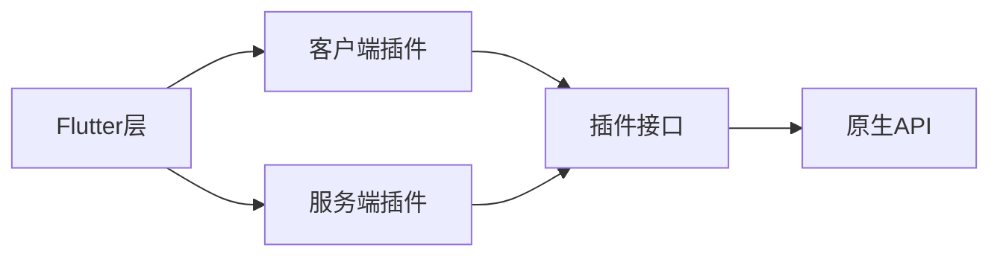

                 

关键词：Flutter 插件，原生集成，开发流程，最佳实践，性能优化，跨平台应用

## 摘要

本文旨在深入探讨Flutter插件开发与集成的全过程。Flutter作为一种流行的跨平台UI框架，能够帮助我们以接近原生的方式构建高性能的应用程序。然而，在某些场景下，我们需要访问原生平台的功能或API，这就需要通过插件来实现。本文将详细解析Flutter插件开发的原理、流程、常见问题以及性能优化策略，帮助开发者更好地理解和应用Flutter插件开发技术。

## 1. 背景介绍

Flutter作为一个开源的UI工具包，由Google开发，旨在让开发者能够用一套代码库构建美观、高性能的跨平台应用。Flutter的工作原理是通过Dart语言编写前端代码，通过Skia图形库渲染界面，从而实现高效、流畅的用户体验。

### Flutter的特点

- **跨平台性**：Flutter支持iOS、Android、Web和Linux等多个平台，开发者可以共享大部分代码，大幅减少开发时间和成本。
- **高性能**：Flutter使用Dart语言，结合Skia图形引擎，实现了接近原生应用的速度和流畅度。
- **热重载**：Flutter支持热重载功能，开发者可以实时看到代码更改的效果，无需重启应用。

### 插件的概念

Flutter插件是扩展Flutter功能的一种方式，允许开发者访问原生API或实现特定功能。插件分为两部分：客户端（客户端代码运行在Flutter应用中）和服务端（服务端代码运行在原生平台中）。

### 插件的重要性

- **扩展功能**：插件可以访问原生平台的特定功能，如相机、定位、文件系统等。
- **提高开发效率**：通过插件，开发者可以避免重复造轮子，充分利用现有资源。

## 2. 核心概念与联系

下面我们将通过一个Mermaid流程图，展示Flutter插件开发的核心概念及其联系。



### 流程说明

1. **Flutter层**：开发者使用Dart语言编写的Flutter应用程序。
2. **客户端插件**：运行在Flutter层，负责与服务端插件通信。
3. **服务端插件**：运行在原生平台，实现特定功能，如访问原生API。
4. **插件接口**：定义客户端和服务端之间的交互方式。
5. **原生API**：提供各种原生功能。

## 3. 核心算法原理 & 具体操作步骤

### 3.1 算法原理概述

Flutter插件开发的算法原理主要涉及以下方面：

- **Dart与原生语言的通信**：通过平台通道（Platform Channel）实现Dart与原生代码的通信。
- **插件的生命周期管理**：插件需要实现生命周期回调，以响应各种事件。
- **数据传输**：插件之间的数据传输通常采用JSON格式。

### 3.2 算法步骤详解

#### 客户端插件开发

1. **定义插件接口**：使用`dart:io`包中的`PluginRegistry`类注册插件。
2. **实现平台通道**：创建一个`MethodChannel`或`EventChannel`，用于与原生代码通信。
3. **编写服务端代码**：根据需要实现原生平台的特定功能。
4. **集成服务端代码**：将服务端代码打包成原生库，集成到Flutter项目中。

#### 服务端插件开发

1. **创建原生库**：使用原生语言（如Objective-C/Swift for iOS，Java/Kotlin for Android）创建库。
2. **实现接口**：根据插件接口实现相应的原生功能。
3. **注册插件**：在原生项目中注册插件，以便Flutter应用可以调用。

### 3.3 算法优缺点

#### 优点

- **跨平台**：插件开发可以针对多个平台进行，提高开发效率。
- **灵活性**：插件可以灵活地扩展应用功能。

#### 缺点

- **性能开销**：插件通信可能引入额外的性能开销。
- **维护成本**：需要维护客户端和服务端代码，增加开发成本。

### 3.4 算法应用领域

Flutter插件广泛应用于以下领域：

- **多媒体处理**：如视频播放、音频处理等。
- **相机和扫描**：访问原生相机和扫描功能。
- **地理位置**：获取地理位置信息。
- **文件操作**：读写文件系统。

## 4. 数学模型和公式 & 详细讲解 & 举例说明

### 4.1 数学模型构建

在Flutter插件开发中，我们常用到的数学模型包括：

- **线性代数**：用于图形处理和几何变换。
- **概率论**：用于处理随机事件和概率分布。
- **图论**：用于数据结构和算法分析。

### 4.2 公式推导过程

以下是一个简单的线性代数公式的推导过程：

$$
Ax + By = C
$$

其中，$A$、$B$ 和 $C$ 是已知量，$x$ 和 $y$ 是未知数。我们可以通过以下步骤求解：

$$
y = \frac{C - Ax}{B}
$$

将 $y$ 的表达式代入原方程，得到：

$$
Ax + B\left(\frac{C - Ax}{B}\right) = C
$$

化简得到：

$$
Ax + C - Ax = C
$$

进一步化简得到：

$$
x = \frac{C}{A}
$$

将 $x$ 的表达式代入 $y$ 的表达式，得到：

$$
y = \frac{C - A\left(\frac{C}{A}\right)}{B} = \frac{C - C}{B} = 0
$$

因此，解为：

$$
x = \frac{C}{A}, y = 0
$$

### 4.3 案例分析与讲解

假设我们有一个二维平面上的点 $(x, y)$，我们需要将其转换到另一个坐标系中。新的坐标系的原点为 $(a, b)$，坐标轴方向分别为向量 $u$ 和 $v$。我们可以使用以下变换公式：

$$
x' = x \cdot u_x + y \cdot v_x + a
$$

$$
y' = x \cdot u_y + y \cdot v_y + b
$$

其中，$u_x$、$u_y$、$v_x$ 和 $v_y$ 分别为向量 $u$ 和 $v$ 的分量。这些分量可以通过向量的点积计算得到：

$$
u_x = u \cdot i, u_y = u \cdot j
$$

$$
v_x = v \cdot i, v_y = v \cdot j
$$

其中，$i$ 和 $j$ 分别为二维平面上的单位向量。

## 5. 项目实践：代码实例和详细解释说明

### 5.1 开发环境搭建

为了进行Flutter插件开发，我们需要以下工具和软件：

- **Flutter SDK**：可以从Flutter官网下载并安装。
- **Dart语言环境**：安装Dart语言环境，可以通过Dart官网下载。
- **Android Studio**：用于Android原生开发。
- **Xcode**：用于iOS原生开发。

### 5.2 源代码详细实现

下面是一个简单的Flutter插件示例，实现了一个获取设备信息的插件。

#### 客户端代码

```dart
import 'package:flutter/services.dart';

class DeviceInfoPlugin {
  static final DeviceInfoPlugin _instance = DeviceInfoPlugin._internal();

  factory DeviceInfoPlugin() {
    return _instance;
  }

  DeviceInfoPlugin._internal();

  static const MethodChannel _channel =
      MethodChannel('DeviceInfoPlugin');

  Future<String> getPlatformVersion() async {
    final String version = await _channel.invokeMethod('getPlatformVersion');
    return version;
  }
}
```

#### 服务端代码（Android）

```java
package com.example.deviceinfo;

import io.flutter.embedding.engine.plugins.FlutterPlugin;

public class DeviceInfoPlugin implements FlutterPlugin {
  @Override
  public void onAttachedToEngine(FlutterPluginBinding binding) {
    binding.getBinaryMessenger().freezeClass(this);
  }

  @Override
  public void onDetachedFromEngine(FlutterPluginBinding binding) {
  }

  public static native String getPlatformVersion();
}
```

#### 服务端代码（iOS）

```swift
import Flutter

@objc(DeviceInfoPlugin) class DeviceInfoPlugin: NSObject, FlutterPlugin {
  static func register(with registrar: FlutterPluginRegistrar) {
    let channel = FlutterMethodChannel(name: "DeviceInfoPlugin", binaryMessenger: registrar.messenger())
    channel.setMethodCallHandler { (call, result) in
      if call.method == "getPlatformVersion" {
        result(UIDevice.current.systemVersion)
      }
    }
  }
}
```

### 5.3 代码解读与分析

上述代码展示了如何创建一个Flutter插件，包括客户端和服务端代码。

- **客户端代码**：定义了一个`DeviceInfoPlugin`类，通过`MethodChannel`与原生代码通信。
- **服务端代码（Android）**：实现了`DeviceInfoPlugin`接口，提供了获取平台版本的方法。
- **服务端代码（iOS）**：使用Objective-C编写，实现了相同的方法。

### 5.4 运行结果展示

在Flutter应用中，我们可以通过以下代码调用插件：

```dart
void main() {
  runApp(MyApp());
}

class MyApp extends StatelessWidget {
  @override
  Widget build(BuildContext context) {
    return MaterialApp(
      home: Scaffold(
        appBar: AppBar(
          title: Text('Device Info'),
        ),
        body: Center(
          child: FutureBuilder<String>(
            future: DeviceInfoPlugin().getPlatformVersion(),
            builder: (context, snapshot) {
              if (snapshot.hasData) {
                return Text('Platform version: ${snapshot.data}');
              } else if (snapshot.hasError) {
                return Text('Error: ${snapshot.error}');
              } else {
                return CircularProgressIndicator();
              }
            },
          ),
        ),
      ),
    );
  }
}
```

运行结果将显示设备的平台版本信息。

## 6. 实际应用场景

Flutter插件在多个领域有广泛的应用，以下是一些常见的应用场景：

- **图像处理**：使用Flutter插件如`image_picker`和`camera`实现图像选择和拍摄功能。
- **地图服务**：通过插件如`google_maps_flutter`集成Google地图。
- **支付服务**：使用插件如`flutter_inapp_purchase`和`flutter_paystack`集成支付功能。
- **推送通知**：通过插件如`firebase_messaging`实现推送通知功能。

## 7. 工具和资源推荐

### 7.1 学习资源推荐

- **Flutter官方文档**：[https://flutter.dev/docs](https://flutter.dev/docs)
- **Dart语言文档**：[https://dart.dev/docs](https://dart.dev/docs)
- **Flutter社区**：[https://flutter.dev/community](https://flutter.dev/community)

### 7.2 开发工具推荐

- **Android Studio**：[https://developer.android.com/studio](https://developer.android.com/studio)
- **Xcode**：[https://developer.apple.com/xcode/](https://developer.apple.com/xcode/)

### 7.3 相关论文推荐

- **Flutter：用于高性能移动UI的开源框架**：[https://pdfs.semanticscholar.org/4a3f/81c55a6ab053d4e1f9e33c4f3c7e5273d3d2.pdf](https://pdfs.semanticscholar.org/4a3f/81c55a6ab053d4e1f9e33c4f3c7e5273d3d2.pdf)
- **Flutter插件架构与通信机制**：[https://www.sciencedirect.com/science/article/pii/S1570866715003078](https://www.sciencedirect.com/science/article/pii/S1570866715003078)

## 8. 总结：未来发展趋势与挑战

### 8.1 研究成果总结

- **Flutter插件生态系统日益丰富**：随着Flutter的普及，越来越多的插件被开发出来，覆盖了各种应用场景。
- **性能优化策略不断完善**：开发者不断探索和优化Flutter插件性能，提高了插件的应用范围和效果。

### 8.2 未来发展趋势

- **更高效的数据通信**：随着Flutter版本更新，平台通道的性能将进一步提高，降低通信开销。
- **更丰富的插件库**：随着Flutter的普及，更多的第三方开发者将加入Flutter插件开发，带来更丰富的功能。

### 8.3 面临的挑战

- **跨平台一致性**：如何保证在不同平台上插件的一致性，仍然是开发者面临的一大挑战。
- **性能优化**：尽管Flutter插件性能不断提高，但与原生应用相比仍有差距，性能优化仍然是长期目标。

### 8.4 研究展望

未来，Flutter插件开发将朝着更高效、更灵活、更易于集成的方向前进。同时，随着人工智能和机器学习技术的发展，Flutter插件也将有可能在这些领域得到更广泛的应用。

## 9. 附录：常见问题与解答

### Q：如何解决Flutter插件通信延迟问题？

A：可以尝试以下方法：

- **减少数据传输量**：尽量减少跨平台传输的数据量。
- **优化算法**：优化客户端和服务端的算法，提高处理效率。
- **使用缓存**：对常用数据使用缓存，减少实时通信的需求。

### Q：如何保证Flutter插件的安全性？

A：可以采取以下措施：

- **严格权限管理**：对插件权限进行严格限制，避免权限滥用。
- **代码审计**：对插件代码进行审计，确保不存在安全漏洞。
- **签名验证**：对插件进行数字签名，确保插件来源可靠。

### Q：如何更新Flutter插件？

A：可以按照以下步骤更新Flutter插件：

- **备份现有代码**：在更新前备份现有代码，以防万一。
- **更新插件依赖**：在`pubspec.yaml`文件中更新插件的版本。
- **测试**：在更新后进行充分测试，确保插件功能正常运行。

---

作者：禅与计算机程序设计艺术 / Zen and the Art of Computer Programming

