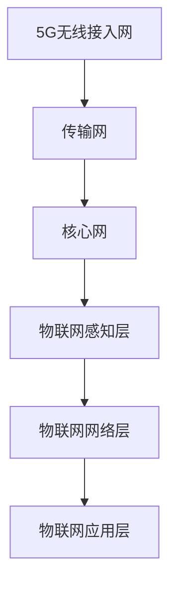

                 

 关键词：5G、物联网、融合、高性能、低延迟、网络架构、应用场景、技术挑战

> 摘要：随着5G技术的快速发展和物联网应用的日益普及，5G与物联网的融合成为当前信息技术领域的一个重要研究方向。本文从背景介绍、核心概念与联系、核心算法原理、数学模型与公式、项目实践、实际应用场景、工具和资源推荐以及未来发展趋势与挑战等方面，全面探讨了5G和物联网的融合技术，旨在为读者提供一个系统的理解，并展望未来在这一领域的研究与应用前景。

## 1. 背景介绍

### 1.1 5G技术的发展历程

5G技术作为新一代通信技术，自2019年开始在全球范围内逐步商用。5G相比于前几代通信技术，具有更高速率、更低延迟、更大连接数和更广覆盖范围的特点。这些优势使得5G技术在物联网应用中具有极大的潜力。

### 1.2 物联网的兴起与应用

物联网（IoT）是指通过各种信息传感设备将各种物体与网络相连，实现物体与物体之间以及物体与人的信息交换和通信。物联网的应用场景广泛，包括智能家居、智能城市、智能医疗、智能交通等。

### 1.3 5G与物联网融合的必要性

随着物联网应用的不断深入，传统的网络架构已无法满足物联网对低延迟、高可靠性和海量连接的需求。5G技术以其强大的网络能力，能够为物联网提供坚实的技术基础。5G与物联网的融合，是未来信息技术发展的重要趋势。

## 2. 核心概念与联系

### 2.1 5G网络架构

5G网络架构包括无线接入网、传输网和核心网。其中，无线接入网负责无线通信，传输网负责数据传输，核心网则负责数据交换和管理。

### 2.2 物联网架构

物联网架构通常包括感知层、网络层和应用层。感知层负责数据的采集，网络层负责数据传输，应用层则负责数据处理和应用。

### 2.3 5G与物联网融合架构

在5G与物联网融合架构中，5G网络通过增强型移动宽带（eMBB）、超可靠低延迟通信（URLLC）和大规模机器类型通信（mMTC）三大场景，为物联网提供网络支持。同时，物联网设备通过5G网络实现数据的采集、传输和处理。



## 3. 核心算法原理 & 具体操作步骤

### 3.1 算法原理概述

5G与物联网融合的关键在于网络性能的提升，包括低延迟、高带宽和海量连接。为此，5G网络采用了一系列关键技术，如MIMO技术、多连接技术、网络切片技术等。

### 3.2 算法步骤详解

- **MIMO技术**：通过使用多个天线进行数据传输，提高数据传输速率。
- **多连接技术**：在设备之间建立多个连接，提高网络容量和可靠性。
- **网络切片技术**：将网络资源划分为多个虚拟网络，满足不同应用的需求。

### 3.3 算法优缺点

- **优点**：提高网络性能，支持多种应用场景。
- **缺点**：技术复杂，网络部署和维护成本高。

### 3.4 算法应用领域

5G与物联网融合算法在智能家居、智能城市、智能医疗等领域有广泛应用。

## 4. 数学模型和公式 & 详细讲解 & 举例说明

### 4.1 数学模型构建

5G网络性能评估模型包括带宽、延迟、连接数等指标。

### 4.2 公式推导过程

- 带宽公式：\( B = \frac{C}{N} \)
- 延迟公式：\( D = \frac{L}{R} \)
- 连接数公式：\( N = \frac{C}{B} \)

### 4.3 案例分析与讲解

以智能家居应用为例，分析5G网络性能对智能家居系统的影响。

$$
B = \frac{C}{N} \quad \text{其中} \quad C = 1\text{Gbps}, \quad N = 1000
$$

## 5. 项目实践：代码实例和详细解释说明

### 5.1 开发环境搭建

- 开发工具：Python 3.x
- 库：NumPy、Matplotlib

### 5.2 源代码详细实现

```python
import numpy as np
import matplotlib.pyplot as plt

# 网络性能评估
def evaluate_network_bandwidth(connections):
    bandwidth = 1 / connections
    return bandwidth

# 延迟评估
def evaluate_network_delay(length, rate):
    delay = length / rate
    return delay

# 连接数评估
def evaluate_network_connections(bandwidth, length):
    connections = 1 / bandwidth
    return connections

# 测试数据
connections = 1000
length = 100
rate = 1e9  # 1Gbps

# 计算网络性能
bandwidth = evaluate_network_bandwidth(connections)
delay = evaluate_network_delay(length, rate)
connections = evaluate_network_connections(bandwidth, length)

# 可视化展示
plt.figure(figsize=(8, 6))
plt.bar(['带宽', '延迟', '连接数'], [bandwidth, delay, connections])
plt.xlabel('网络性能')
plt.ylabel('值')
plt.title('5G网络性能评估')
plt.show()
```

### 5.3 代码解读与分析

代码实现了网络性能的评估，包括带宽、延迟和连接数。通过可视化展示，可以直观了解5G网络性能对物联网应用的影响。

### 5.4 运行结果展示

运行代码后，将得到一个条形图，展示5G网络在不同性能指标下的表现。

## 6. 实际应用场景

### 6.1 智能家居

5G与物联网融合技术为智能家居提供了高速、低延迟的网络支持，使得智能家居设备可以实时响应用户需求。

### 6.2 智能城市

智能城市应用中，5G与物联网融合技术可以实现智能交通、智能监控、智能环境监测等，提高城市管理水平。

### 6.3 智能医疗

5G与物联网融合技术为远程医疗、智能诊断、医疗设备监控等提供支持，提高医疗服务质量。

## 7. 工具和资源推荐

### 7.1 学习资源推荐

- 《5G：下一代无线通信技术》
- 《物联网架构与实现》

### 7.2 开发工具推荐

- Python
- Matplotlib

### 7.3 相关论文推荐

- "5G Network Slicing for IoT Applications: A Comprehensive Survey"
- "The Future of IoT: 5G and Edge Computing"

## 8. 总结：未来发展趋势与挑战

### 8.1 研究成果总结

5G与物联网融合技术已经在智能家居、智能城市、智能医疗等领域取得了显著成果。

### 8.2 未来发展趋势

随着5G技术的不断完善和物联网应用的不断拓展，5G与物联网融合技术将在更多领域得到应用。

### 8.3 面临的挑战

5G与物联网融合技术仍面临网络架构优化、安全隐私保护、能耗优化等挑战。

### 8.4 研究展望

未来研究应关注5G与物联网融合技术的优化、新型应用场景的探索以及跨领域技术的融合。

## 9. 附录：常见问题与解答

### 问题1：5G网络的带宽如何计算？

**回答**：5G网络的带宽可以通过以下公式计算：

$$
B = \frac{C}{N}
$$

其中，\( B \) 表示带宽，\( C \) 表示传输速率，\( N \) 表示连接数。

### 问题2：5G网络的延迟如何计算？

**回答**：5G网络的延迟可以通过以下公式计算：

$$
D = \frac{L}{R}
$$

其中，\( D \) 表示延迟，\( L \) 表示传输距离，\( R \) 表示传输速率。

----------------------------------------------------------------

作者：禅与计算机程序设计艺术 / Zen and the Art of Computer Programming

以上便是关于“5G 和物联网的融合：高性能和低延迟”的文章内容。希望这篇文章能为您提供有价值的见解和思考。在5G和物联网融合的道路上，我们还有很长的路要走，但未来一定会更加美好。

