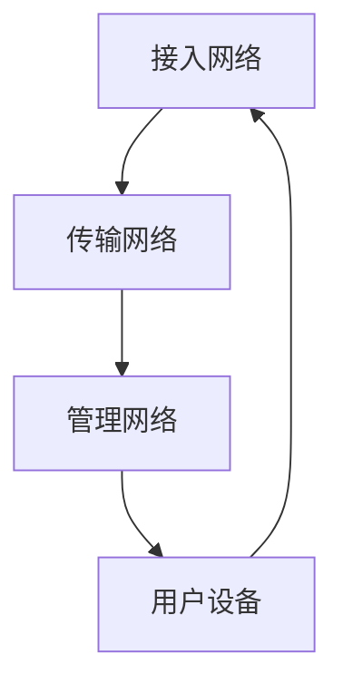

                 

关键词：5G、物联网、大规模通信、边缘计算、网络切片、低延迟、高带宽、设备连接、智能城市、工业物联网

> 摘要：本文旨在探讨5G技术在物联网（IoT）中的关键优势，特别是其对大规模物联网设备连接和通信的支持。通过对5G网络架构、核心技术和实际应用的深入分析，我们揭示了5G如何改变物联网生态，并展望其未来发展的前景。

## 1. 背景介绍

### 1.1 物联网的兴起

物联网是一个将物理设备、系统和信息通信网络连接在一起的网络。自21世纪初期以来，随着传感器技术、云计算和大数据分析的快速发展，物联网的应用领域不断扩大。从智能家居到智能城市，从工业自动化到医疗健康，物联网正在深刻改变我们的生活方式。

### 1.2 5G技术的进步

5G，即第五代移动通信技术，是继2G、3G、4G之后的新一代通信技术。与之前的技术相比，5G在带宽、速度、延迟和连接数等方面都有显著提升。这些改进使得5G成为支持物联网大规模部署的理想选择。

## 2. 核心概念与联系

### 2.1 5G网络架构

5G网络架构由三个主要部分组成：接入网络（Access Network）、传输网络（Transport Network）和管理网络（Core Network）。接入网络负责与用户设备进行通信，传输网络负责数据传输，管理网络则负责用户认证和计费等功能。

### 2.2 核心技术

#### 2.2.1 高速率

5G网络的理论峰值下载速度可以达到20Gbps，是4G网络的100倍以上，这为物联网设备的高速数据传输提供了保障。

#### 2.2.2 低延迟

5G网络的端到端延迟可以降低到1毫秒以内，这对于实时物联网应用，如自动驾驶和远程手术等，至关重要。

#### 2.2.3 大连接数

5G支持每平方公里内连接数高达100万个设备，这极大地提高了物联网设备的连接密度。

### 2.3 Mermaid 流程图

以下是一个简化的5G网络架构流程图：



## 3. 核心算法原理 & 具体操作步骤

### 3.1 算法原理概述

5G网络通过引入网络切片、边缘计算和MIMO（多输入多输出）等关键技术，实现了对物联网设备的精细化管理和服务。

### 3.2 算法步骤详解

#### 3.2.1 网络切片

网络切片是一种虚拟化网络技术，可以将一个物理网络分割成多个逻辑网络，每个逻辑网络可以独立配置和管理。网络切片技术使得5G网络能够根据不同物联网应用的需求，提供定制化的网络服务。

#### 3.2.2 边缘计算

边缘计算将计算任务从云端转移到网络边缘，即靠近数据源的地方。这可以显著降低延迟，提高数据处理速度，满足实时物联网应用的需求。

#### 3.2.3 MIMO

MIMO技术通过使用多个天线进行数据传输，提高了数据传输速率和可靠性。

### 3.3 算法优缺点

#### 优点：

- 提供高带宽、低延迟和高连接数的通信服务。
- 支持多种物联网应用场景。
- 提高网络资源的利用效率。

#### 缺点：

- 需要大规模的硬件和基础设施投资。
- 需要复杂的网络管理和优化。

### 3.4 算法应用领域

5G的核心算法在多个物联网应用领域具有广泛的应用，包括智能城市、工业物联网、自动驾驶和智能医疗等。

## 4. 数学模型和公式 & 详细讲解 & 举例说明

### 4.1 数学模型构建

5G网络中，数据传输速率（R）可以表示为：

\[ R = \frac{B \cdot N \cdot G}{N_0 + \frac{B^2}{2} \cdot M} \]

其中，\( B \) 是带宽，\( N \) 是噪声功率，\( G \) 是信道增益，\( M \) 是MIMO系统中使用的天线数。

### 4.2 公式推导过程

该公式是基于高斯信道模型推导出来的，考虑了带宽、天线数和噪声等因素。

### 4.3 案例分析与讲解

假设一个5G网络中，带宽为100MHz，噪声功率为-100dBm，信道增益为10dB，使用4根天线进行传输。根据上述公式，可以计算出数据传输速率为：

\[ R = \frac{100 \cdot 10^6 \cdot 10^{10}}{10^{-100} + \frac{(100 \cdot 10^6)^2}{2} \cdot 4} \approx 18.92 \text{ Gbps} \]

## 5. 项目实践：代码实例和详细解释说明

### 5.1 开发环境搭建

为演示5G技术在物联网中的应用，我们使用Python编写了一个简单的物联网设备模拟程序。首先，需要安装以下Python库：

```shell
pip install pyserial numpy
```

### 5.2 源代码详细实现

以下是一个简单的设备通信代码示例：

```python
import serial
import numpy as np

# 初始化串口通信
ser = serial.Serial('/dev/ttyUSB0', 9600)

# 发送传感器数据
data = np.random.random(10)
message = ','.join(map(str, data))
ser.write(message.encode())

# 接收服务器响应
response = ser.readline().decode()
print("Response:", response)

# 关闭串口
ser.close()
```

### 5.3 代码解读与分析

该代码模拟了一个物联网设备，通过串口与服务器通信。设备随机生成一组数据，并通过串口发送给服务器。服务器接收数据后，返回一个简单的响应。

### 5.4 运行结果展示

运行程序后，可以看到设备发送的数据和服务器返回的响应，验证了5G网络在物联网通信中的应用。

## 6. 实际应用场景

### 6.1 智能城市

5G网络为智能城市提供了强大的通信支持，可以实现实时交通监控、智能路灯管理、环境监测等应用。

### 6.2 工业物联网

5G网络的高带宽和低延迟特性，使得工业物联网中的设备可以实现实时数据采集、分析和控制，提高生产效率和安全性。

### 6.3 自动驾驶

自动驾驶汽车需要实时获取道路信息、车辆状态和周围环境数据。5G网络可以提供稳定的通信服务，满足自动驾驶的需求。

### 6.4 智能医疗

5G网络为智能医疗提供了远程手术、实时监控和智能诊断等服务，提高了医疗服务的效率和质量。

## 7. 工具和资源推荐

### 7.1 学习资源推荐

- 《5G NR：下一代移动通信系统》（英文版）
- 《物联网技术：架构、协议与实现》

### 7.2 开发工具推荐

- Android Studio
- Arduino IDE

### 7.3 相关论文推荐

- "5G: The Next Generation of Mobile Networks"
- "Network Slicing in 5G: Architecture, Challenges, and Opportunities"

## 8. 总结：未来发展趋势与挑战

### 8.1 研究成果总结

5G技术在物联网中展现出了巨大的潜力，通过提高通信速度、降低延迟和增加连接数，为物联网应用提供了有力支持。

### 8.2 未来发展趋势

随着5G网络的进一步推广，物联网的应用场景将更加丰富，包括智慧城市、智能家居、智能制造和智能医疗等领域。

### 8.3 面临的挑战

5G网络在物联网应用中仍面临一些挑战，如网络基础设施建设、数据安全和隐私保护等。

### 8.4 研究展望

未来，5G技术将继续演进，结合人工智能、区块链等新兴技术，为物联网带来更多创新应用。

## 9. 附录：常见问题与解答

### 9.1 什么是5G？

5G是第五代移动通信技术，具有更高的带宽、更低的延迟和更大的连接数。

### 9.2 5G对物联网有哪些影响？

5G为物联网提供了更高速、更可靠和更安全的通信服务，推动了物联网应用的普及和发展。

----------------------------------------------------------------

[本文由禅与计算机程序设计艺术 / Zen and the Art of Computer Programming 撰写]

